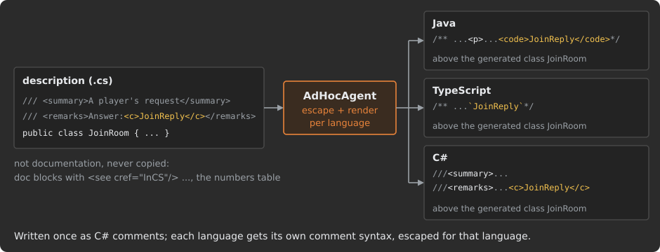
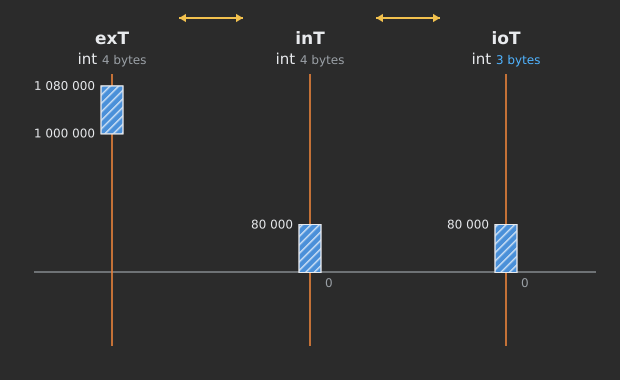
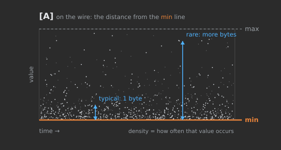
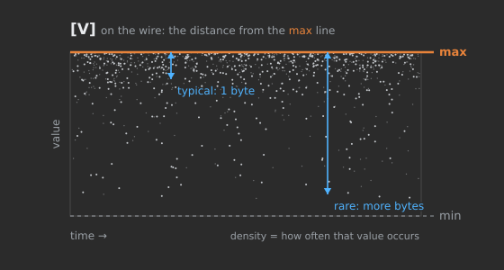
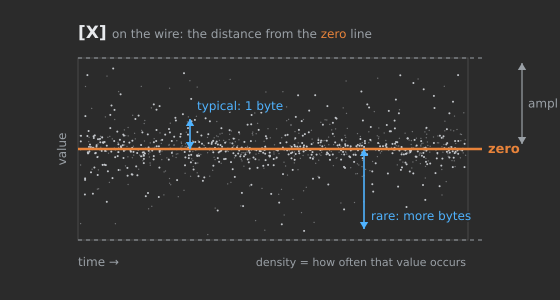
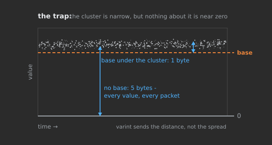

# AdHoc protocol - manual

This manual explains how AdHoc works and how to use it: how a protocol description is written, what the generator produces from it, and how the generated code behaves at runtime. For a short overview of what AdHoc is and what it can do, see [README](README.md).

## Contents

**I. Orientation**

1. [How AdHoc works](#how-adhoc-works)
2. [Getting started](#getting-started)
3. [The description file](#the-description-file)

**II. Data**

4. [Packs](#packs)
5. [Fields and types](#fields-and-types)
6. [Constants and enums](#constants-and-enums)
7. [How values become bytes](#how-values-become-bytes)

**III. Composing data**

8. [Building packs from packs](#building-packs-from-packs)
9. [Pack Sets](#pack-sets)

**IV. Hosts**

10. [Hosts, languages, generated code](#hosts-languages-generated-code)

**V. Conversations**

11. [Connections](#connections)
12. [Actors, states, branches](#actors-states-branches)
13. [Actor kinds and the actor at runtime](#actor-kinds-and-the-actor-at-runtime)

**VI. Delivery and transport**

14. [Sessions, guaranteed delivery, UDP](#sessions-guaranteed-delivery-udp)
15. [Streams](#streams)
16. [Transform chains](#transform-chains)
17. [Trims](#trims)
18. [Virtual connections and relays](#virtual-connections-and-relays)
19. [Multiplexing](#multiplexing)

**VII. Identity, evolution, reuse**

20. [Numbers tables](#numbers-tables)
21. [Evolving a protocol](#evolving-a-protocol)
22. [Reusing descriptions](#reusing-descriptions)

**VIII. Reference and tooling**

23. [Attributes](#attributes)
24. [AdHocAgent](#adhocagent)
25. [Deployment and smart merge](#deployment-and-smart-merge)

---

## How AdHoc works

*Orientation: the pipeline (**description → AdHocAgent → generator → code per host → deployment → runtime**) and the model (**project → host → connection → actor → state → branch → pack → field → bytes**)*

AdHoc is a multi-language code generator for binary protocols. You describe a system once, in a C# source file: the data its
programs exchange, the programs themselves, and the conversations between them. From that description AdHoc generates, for every
program and in each of its languages, the code that writes your data as bytes, carries the bytes over a connection under the rules
you declared, and reads them back on the other side.

The unit of data that AdHoc writes and reads is the **pack**: a structured object with typed fields. A pack is not tied to the
network. The same generated code that sends packs over a connection can write and read them in a storage format of your own.

> [!NOTE]
> A three-minute visual overview of AdHoc - the system model, the conversation rules, the streaming architecture - is in
> [README](README.md).

This chapter shows how the parts fit together: the pipeline that turns a description into running code, the model a description is
built from, and what happens to a pack at runtime. Each concept named here has a chapter of its own; the links lead there.

### The pipeline: from a description to running code

![The AdHoc pipeline as a U: your machine on the left, the AdHoc cloud on the right. The top row runs left to right, towards the server: the description file MyProtocol.cs, written in your IDE; AdHocAgent, which compiles and checks it, writes the numbers tables back into the file and uploads the description with your UUID. On the right, the generator, a cloud service, produces and tests code for every host in each of its languages. The bottom row runs right to left, back from the server: the received folder with one folder per language and per host; the deployment, which copies the code into your projects and keeps your own code through smart merge; and your projects, built from generated code, the runtime library and your code. A dashed arrow from your projects back up to the description shows that you run steps 2 to 5 again after every change of the description. Below, at runtime, the hosts exchange packs as bytes over a connection. Colors mark the owner of each part: orange what is yours, grey AdHocAgent, purple the AdHoc service, yellow what is generated.](docs/img/dev-01-pipeline.svg)

1. **The description.** You write the protocol description: a plain C# file in a .NET project. Your IDE compiles and checks it like
   any other C# code. It uses the AdHoc vocabulary - `Host`, `Connects<L, R>`, the branch attributes, the field attributes - which
   is declared in `Meta.cs`. See [The description file](#the-description-file).
2. **AdHocAgent, on your machine.** AdHocAgent is the command-line utility you run. It compiles the description files with the C#
   compiler (Roslyn) and checks them against every AdHoc rule. The first error stops the run with a message; nothing leaves your
   machine until the description passes. AdHocAgent also keeps the **numbers tables** at the top of your file up to date - the
   identities of packs, hosts, connections, actors and states - so it rewrites the description file in place. See
   [AdHocAgent](#adhocagent) and [Numbers tables](#numbers-tables).
3. **The generator, in the cloud.** Code generation does not run on your machine: the generator is a cloud service. AdHocAgent
   signs in with your personal UUID and uploads the checked project. The server generates the code of every host in each of its
   languages and tests it before returning it; how much testing a task gets depends on the server's load at that moment.
4. **The received folder.** The generated files stream straight to disk into `<output folder>/<description name>/`, named after
   the description file without its `.cs`: a folder per language (`InCS`, `InJAVA`, `InTS`), and in each a folder per host. See
   [Getting started](#getting-started).
5. **Deployment and smart merge.** AdHocAgent copies the received files into your projects as a Markdown *deployment instructions
   file* directs. The generated files contain **injection points**: marked regions where your own code lives. On every deployment,
   **smart merge** carries your code over into the new version of the file. Everything a deployment overwrites or deletes is backed
   up first, with restore scripts. See [Deployment and smart merge](#deployment-and-smart-merge).
6. **Runtime.** Each host is your program, built from the generated code, the AdHoc runtime library and your code. The hosts
   exchange packs over their connections. See [The runtime model: one buffer per direction](#the-runtime-model-one-buffer-per-direction).

You run steps 2 to 5 again whenever the description changes. To see in advance which hosts a change reaches, AdHocAgent compares
two versions of a description and writes an impact report; see [Evolving a protocol](#evolving-a-protocol).

### The model: from the project down to the bytes

One description holds both the data structures - packs and their fields - and the whole network topology: the hosts and the
connections between them. Its entities form layers, and each layer is written as a C# construct.

![The AdHoc model as a ladder of nine layers, from top to bottom: project, host, connection, actor, state, branch, pack, field and bytes. Each rung shows the C# construct that declares it, mostly taken from the Telemetry example below - interface Telemetry, struct Sensor : Host, interface Link : Connects<Sensor, Collector>, interface Name : Actor, struct Idle { }, a branch attribute naming the next state Waiting and the pack Sensor.Reading, class Reading, the field short celsius with MinMax(-40, 125) - and what the layer is; the bytes rung is a strip of a wire id followed by fields. Brackets group the rungs into topology (project, host, connection), conversation (actor, state, branch) and data (pack, field, bytes). No connector joins the branch rung to the pack rung; instead, two dashed arrows end at the pack rung: one from the branch rung, labeled selects packs, and one from the host rung, labeled declares packs (or the project does).](docs/img/dev-01-model-layers.svg)

| Layer      | What it is                                                                                                 | Declared as                                                                                    | Chapter                                                                                                                                  |
|:-----------|:-----------------------------------------------------------------------------------------------------------|:-----------------------------------------------------------------------------------------------|:-----------------------------------------------------------------------------------------------------------------------------------------|
| Project    | the whole description: one system and the protocol of all its parts                                        | a top-level `interface` in a namespace                                                         | [The description file](#the-description-file)                                                                                           |
| Host       | one program of the system, with the languages its code is generated in                                     | `struct Name : Host`, directly in the project                                                  | [Hosts, languages, generated code](#hosts-languages-generated-code)                                                                      |
| Connection | the link between two hosts - a left one and a right one - and everything said over it                      | `interface Name : Connects<Left, Right>`, directly in the project                              | [Connections](#connections)                                                                                                              |
| Actor      | one independent conversation on a connection, with a state machine of its own; many may run at once         | the states written in the connection body (the connection's own actor), or `interface Name : Actor` | [Actors, states, branches](#actors-states-branches), [Actor kinds and the actor at runtime](#actor-kinds-and-the-actor-at-runtime) |
| State      | one step of a conversation: which packs each side may send now                                             | an empty `struct` that carries branch attributes                                               | [Actors, states, branches](#actors-states-branches)                                                                                      |
| Branch     | in a state: the packs one side may send, and the state that sending them leads to                          | an attribute on the state: `[L____________<Next, Packs>]`, `[____________r<Packs>]`, ...       | [Actors, states, branches](#actors-states-branches)                                                                                      |
| Pack       | the unit that is sent and received                                                                         | a `class` in the project, in a host or in another pack                                         | [Packs](#packs)                                                                                                                          |
| Field      | a typed value inside a pack                                                                                | an instance field of the class                                                                 | [Fields and types](#fields-and-types)                                                                                                    |
| Bytes      | the wire form of a pack: its id, then its fields, each at a place fixed by its kind and declaration order  | generated                                                                                      | [How values become bytes](#how-values-become-bytes)                                                                                      |

The ladder is not only a nesting. Packs are data: you declare them in the project or in a host, outside any connection. A branch
*refers* to packs. A pack that some branch sends is **transmittable**: it gets a **wire id**, the number that precedes it on the
wire. A pack that no branch sends is never sent on its own; it can still be the type of a field of another pack.

Here is a complete description that has every layer:

```csharp
using org.unirail.Meta;

namespace com.my.company
{
    public interface Telemetry                         // project
    {
        /// <see cref="InCS"/>
        struct Sensor : Host                           // host
        {
            public class Reading                       // pack, declared in the Sensor host
            {
                [MinMax(-40, 125)] short celsius;      // field
                ulong                    time;         // field
            }
        }

        /// <see cref="InJAVA"/>
        /// <see cref="InTS"/>
        struct Collector : Host                        // host
        {
            public class Ack { }                       // pack without fields
        }

        interface Link : Connects<Sensor, Collector>   // connection: Sensor is the left host, Collector the right
        {
            [L____________<Waiting, Sensor.Reading>]   // branch: the left host sends Reading and moves to Waiting
            struct Idle { }                            // state: the first declared state is the initial one

            [____________R<Idle, Collector.Ack>]       // branch: the right host sends Ack and moves back to Idle
            struct Waiting { }
        }
    }
}
```

- `Telemetry` is the project.
- `Sensor` and `Collector` are hosts. A host's doc comment names its languages: the sensor's code is generated in C#, the
  collector's in Java and in TypeScript.
- `Reading` and `Ack` are packs, each declared in the host that sends it. `Reading` has two fields. `Ack` has none: an empty pack
  carries its information by arriving.
- `Link` is a connection. `Sensor`, the first type argument, is its left host; `Collector` is the right one.
- `Idle` and `Waiting` are states. States written directly in a connection body belong to the connection's own actor. The first
  declared state, `Idle`, is where the conversation starts.
- The attributes on the states are branches. The letter beside the underscores names the side: `L` the left host, `R` the right
  one. A capital letter means that sending moves the conversation to another state, named by the first type argument; a small
  letter means the state stays. In `Idle`, `Sensor` may send a `Reading`, and doing so moves the conversation to `Waiting`. In
  `Waiting`, `Collector` may send an `Ack`, which moves it back to `Idle`. Both hosts get this one state machine: the generated code
  of each side knows what it may send and what it may receive in every state.
- On the wire, a `Reading` is its wire id followed by its two fields. A field carries no number or tag: it is known by its place.
  The generator writes the fields in groups by kind - fixed-width numbers, bit fields, varints, nullable and reference fields,
  `Stream`/`File` fields - and keeps the declaration order inside each group, so swapping two fields of one kind changes the wire
  format ([How values become bytes](#how-values-become-bytes)). `celsius` is declared with the range -40..125, 166 values, so it
  travels in one byte.

The first time AdHocAgent processes this file, it writes the numbers tables above `interface Telemetry` and gives `Reading` and `Ack`
their wire ids ([Numbers tables](#numbers-tables)).

### The runtime model: one buffer per direction

At runtime a host opens connections through a transport of the AdHoc runtime library: TCP, WebSocket or UDP. Each connection has
two buffers - one for sending, one for receiving - of a size your code chooses when it creates the transport. Every byte of every
pack passes through these two buffers. The runtime never allocates a buffer the size of a pack, in either direction - unless you
ask it to capture a received pack for a broadcast ([One pack to many connections](#one-pack-to-many-connections)).

![One host at runtime, in three layers. At the top, your code calls send with a pack and writes code into injection points, shown as small slots inside the generated actor and state classes. In the middle, the generated code: the connection with its actors and states, a sending queue, a transmitter and a receiver. At the bottom, the runtime library: the transport with one send buffer and one receive buffer, each of bufferSize bytes, and the socket. A transmit loop runs from the socket asking for bytes, through the transmitter writing the head pack's id and fields into the send buffer, back to the socket; a receive loop runs from the socket into the receive buffer, through the receiver consuming fields in place, to the actor's state and your code. On the wire to the peer host, one large pack is shown cut into buffer-sized chunks. A note says that resident memory on this path is two buffers per connection plus small state, whatever the pack size, and that pack objects, delivery journals and codec contexts are extra.](docs/img/dev-01-runtime.svg)

#### Sending: the transport pulls the bytes

Sending a pack from your code does not serialize it. `send` puts the pack into the connection's sending queue and returns - `true`
when the pack is queued, `false` when the connection is closed or closing, or its queue is full. The bytes are produced later, on
demand. Whenever the socket can take more data, the transport asks the connection's **transmitter** to fill the send buffer. The
transmitter takes the pack at the head of the queue and writes the pack's id and fields straight into the buffer until the buffer is
full. The transport sends what was written, and the next fill continues the pack exactly where the previous one
stopped, in the middle of a field if need be.

While a pack is being sent, the runtime holds the pack itself and the transmitter's small state machine, which records where the
writing stopped. The pack never exists as one contiguous byte array.

#### Receiving: bytes are consumed where they land

Receiving is the mirror image. The socket fills the receive buffer, and the transport hands the bytes to the connection's
**receiver**. The receiver reads the pack id, picks the generated handler of that pack, and the handler consumes the bytes field by
field, directly from the buffer. A value cut off by the end of the buffer waits in the receiver's small parser state and is completed
from the next buffer. The receiver never waits for a whole pack before it starts decoding, and the receive buffer is reused for the
next read as soon as the receiver returns.

When a destination signals that it cannot take more bytes - a stream sink that is full, for example - the transport stops reading
the socket until it can. Unread data waits in the network, not in memory.

#### Memory on the serialization path

On the path from your pack to the socket and from the socket to your pack, the resident memory of a connection is one send buffer,
one receive buffer and the small state of the serializer and the parser - however long the pack is. This also holds for a `Stream`
field of unbounded size: a 1 GB blob, an endless live feed, or video relayed through a middle host all pass through the same two
buffers ([Streams](#streams)). A pack can therefore be larger than the memory of either host, as long as its bulk travels in `Stream`
fields, or in an abstract pack whose values your code produces and consumes piece by piece.

Memory outside that path is yours to count:

- a pack generated as a class (a *concrete* implementation) is an object that holds its field values;
- a connection with guaranteed delivery keeps a journal of sent packs until the peer confirms them, up to `resumable_megabytes`
  (100 MB by default) - see [Sessions, guaranteed delivery, UDP](#sessions-guaranteed-delivery-udp);
- compression and cipher stages keep their own contexts - see [Transform chains](#transform-chains);
- a received pack captured for a broadcast is held as one array until the slowest subscriber has sent it - see
  [One pack to many connections](#one-pack-to-many-connections).

Because no object the size of a pack is allocated and the socket buffers are reused - the C# TCP transport rents them from the
shared array pool - the garbage collector has no large per-message allocations to collect.

#### The socket buffer size

The buffer size is an argument of the transport's constructor; in the C# runtime its default is 1024 bytes. One value sets both
buffers of every connection the transport opens. **The smallest buffer is 128 bytes** - the transports do not check it, so do not
pass less. Every pack, whatever its size, passes through a buffer of that size in portions: sending fills the buffer with as much of
the pack as fits and continues on the next fill, receiving decodes what has arrived and continues with the next read. No array that
holds a whole serialized pack is allocated before it is sent or after it is received. A generated C# demo creates its transports like this:

```csharp
// listening side: 512-byte send and receive buffers per accepted connection
var server = new Network.TCP.Server("Server name",
                                    CommunicationChannel.Connection.NewWebSocketConnection,
                                    Network.TCP.onFailurePrintConsole,
                                    512,                                // bufferSize
                                    100,                                // backlog of pending connections
                                    null,                               // default listening socket
                                    IPEndPoint.Parse("127.0.0.1:1234"));

// dialing side: 1024-byte buffers
var client = new Network.TCP.WebSocket.Client<CommunicationChannel.Connection>("My Client Name",
                                    connection => new CommunicationChannel.Connection(connection),
                                    Network.TCP.onFailurePrintConsole,
                                    1024);                              // bufferSize
```

A larger buffer moves more bytes per system call, so it means fewer calls into the kernel; it does not change what fits in a pack.
A small one - down to 128 bytes - suits a host with little memory or many connections: a 1 GB pack still goes through.
A few kilobytes (1-8 KB) is the usual range. AdHoc's own services use 1024 bytes: AdHocAgent's connection to the generator and the
listener of AdHoc's monitoring server.

#### Threads: the receive loop and the transmit loop

Each direction of a connection is processed as a sequence of events. The receive side handles arriving packs and receive timeouts;
the transmit side handles outgoing packs and transmit timeouts. Within one direction, events are handled one at a time, and each runs
to completion before the next one is taken. Handlers that run on the same side therefore never race, and the state they own needs no
locks. The two directions may run on different threads at the same time; state shared between a receive handler and a transmit
handler is the one place you coordinate.

Your handlers run on these loops. A handler that blocks stalls its whole direction. The threads that run the loops are shared by
the connections of a transport - in the Java runtime all of them run on one thread pool, the common fork-join pool unless you pass
your own - so a blocked handler also holds back other connections. Hand long work to another thread and send the result as a new
pack. The full threading model is in [Actor kinds and the actor at runtime](#actor-kinds-and-the-actor-at-runtime).

#### Generated code and your code at runtime

A host's program is made of four parts:

| Part                                   | What it holds                                                                                                                        | Who writes it                                         |
|:---------------------------------------|:-------------------------------------------------------------------------------------------------------------------------------------|:------------------------------------------------------|
| Generated code (`gen`)                 | the packs and their serializers and parsers, the connection classes with their transmitter and receiver, the actors with their states and the dispatch of packs, the constants | the generator; replaced by every generation           |
| Runtime library (`lib`)                | the transports (TCP, WebSocket, UDP), the buffers, collections, compression and ciphers                                              | AdHoc; copied as it is                                |
| Your code in injection points          | inside generated files, in marked regions: what a received pack means to this actor, what entering a state starts, what a timeout does | you; carried over by smart merge                      |
| Your code around the generated code    | creating transports, connecting, sending packs, your own data structures                                                             | you                                                   |

An injection point is a region in a generated file that belongs to you. This one is taken from the generated C# code of AdHoc's own
protocol, where the agent receives the server's `Info` pack:

```csharp
case Agent.AdHocProtocol.Server_.Info.__id_:
    actor.OnNewState(conn, CLOSE_.ONE);     // generated: the state machine has moved on
#region> Info OnReceived Event
    // your code: what receiving Info means here
#endregion> ĀĄÿĀĄ.OnReceivedEvent
    // ... generated code continues
```

The generated dispatch has already moved the actor to its next state; the lines between `#region>` and `#endregion>` are yours. The
characters after `#endregion>` identify the region, and they are how a deployment finds your code again in the next version of the
file. How injection points, generated blocks and backups work is in [Deployment and smart merge](#deployment-and-smart-merge).

### What AdHoc generates for each host

For every host, AdHoc generates a folder per language the host declares. The received folder holds, for example,
`InCS/Sensor/`, `InJAVA/Collector/` and `InTS/Collector/` for the `Telemetry` description above. Each host folder contains:

| In the host folder                       | What it is                                                                                                                    | Deployed                    |
|:-----------------------------------------|:------------------------------------------------------------------------------------------------------------------------------|:----------------------------|
| `gen/`                                   | the generated protocol code of this host                                                                                      | always, with the host folder |
| `lib/`                                   | the AdHoc runtime library in the host's language                                                                              | always, with the host folder |
| `LICENSE-GRANT.md`                       | the terms that the generated code and the library come under                                                                  | always, with the host folder |
| `demo`                                   | a skeleton of the host: the methods you have to provide, a transport set up, packs sent - `demo.cs` in C#, `demo.ts` in TypeScript, a `demo/` folder in Java | only when you ask for it    |
| project files                            | what builds the host folder as a project of its own: `Project.csproj`, `package.json`, `tsconfig.json`                        | only when you ask for it    |

What "deployed" means, and how you ask for the optional items, is in [Deployment and smart merge](#deployment-and-smart-merge).

For each host and language, a pack is generated in one of two forms. A **concrete** pack is a class that holds its field values: you
create the object, fill it and send it. An **abstract** pack is an interface that your own type implements: the generated code reads
the values from your object field by field while it serializes, and writes received values into your object while it parses, with
no intermediate object of its own. You choose the form per host, language and pack ([Hosts, languages, generated code](#hosts-languages-generated-code)).
AdHocAgent itself uses both. In its generated C# code, the `Login` pack it sends to the server is a class; the `Project` pack, which
carries its parsed model of your description to the generator, is an interface that the agent's own model classes implement.

### Target languages of AdHoc

A host names its languages with **language markers** in its doc comment. Markers exist for six languages; code is generated today for
three of them.

| Marker   | Language   | Code generated                                   |
|:---------|:-----------|:-------------------------------------------------|
| `InCS`   | C#         | yes                                              |
| `InJAVA` | Java       | yes                                              |
| `InTS`   | TypeScript | yes                                              |
| `InCPP`  | C++        | not yet: the marker is accepted, no generator    |
| `InRS`   | Rust       | not yet: the marker is accepted, no generator    |
| `InGO`   | Go         | not yet: the marker is accepted, no generator    |

The marker syntax and its implementation modifiers are in [Hosts, languages, generated code](#hosts-languages-generated-code).

### Glossary of AdHoc terms

| Term                              | Meaning                                                                                                                                  | Chapter                                                                     |
|:----------------------------------|:-----------------------------------------------------------------------------------------------------------------------------------------|:----------------------------------------------------------------------------|
| description                       | the C# source file (or files) that declares a project                                                                                    | [The description file](#the-description-file)                               |
| project                           | a top-level C# interface in a namespace: the root of a description                                                                       | [The description file](#the-description-file)                               |
| host                              | one program of the system: `struct Name : Host`                                                                                          | [Hosts, languages, generated code](#hosts-languages-generated-code)         |
| language marker                   | `<see cref="InCS"/>` and its kin in a host's doc comment: a language the host's code is generated in                                    | [Hosts, languages, generated code](#hosts-languages-generated-code)         |
| concrete / abstract               | the two forms of a pack in generated code: a class with field values, or an interface your type implements                               | [Hosts, languages, generated code](#hosts-languages-generated-code)         |
| pack                              | the unit of data that is sent, received or stored: a `class` in the description                                                         | [Packs](#packs)                                                             |
| field                             | a typed value of a pack, known on the wire by its place, not by a number: swapping two fields of one kind changes the wire format        | [Fields and types](#fields-and-types)                                       |
| constants container               | a declaration that only holds constants and is never sent                                                                                | [Constants and enums](#constants-and-enums)                                 |
| Value Pack                        | a pack whose fields fit in 64 bits, generated as a single primitive value                                                                | [How values become bytes](#how-values-become-bytes)                         |
| Pack Set                          | a set of packs built from packs, scopes, filters and exclusions: `_<...>`, `X<...>`                                                      | [Pack Sets](#pack-sets)                                                     |
| connection                        | the typed link between two hosts: `interface Name : Connects<Left, Right>`                                                               | [Connections](#connections)                                                 |
| left host / right host            | the first and the second host of a connection; the letters `L`/`l` and `R`/`r` of a branch name them                                     | [Connections](#connections)                                                 |
| actor                             | one independent conversation on a connection, with its own state machine                                                                 | [Actors, states, branches](#actors-states-branches)                         |
| state                             | an empty struct with branch attributes: a step of a conversation                                                                         | [Actors, states, branches](#actors-states-branches)                         |
| branch                            | an attribute on a state: the packs one side may send there, and the next state                                                           | [Actors, states, branches](#actors-states-branches)                         |
| transmittable pack / wire id      | a pack that some branch sends / the number that precedes it on the wire                                                                  | [Numbers tables](#numbers-tables)                                           |
| numbers tables                    | the two doc comments AdHocAgent keeps above the project interface: the identity numbers of the entities                                  | [Numbers tables](#numbers-tables)                                           |
| transmitter / receiver            | the generated objects that write a connection's outgoing bytes into the send buffer and read incoming bytes from the receive buffer       | [The runtime model](#the-runtime-model-one-buffer-per-direction)            |
| socket buffer                     | one send buffer and one receive buffer per connection; the size is your choice                                                           | [The runtime model](#the-runtime-model-one-buffer-per-direction)            |
| session                           | a conversation that survives the loss of its socket and continues on a new one                                                           | [Sessions, guaranteed delivery, UDP](#sessions-guaranteed-delivery-udp)     |
| `Stream`, `File`                  | field types that carry raw bytes of any length through the socket buffers                                                                | [Streams](#streams)                                                         |
| transform chain                   | stages - compression, cipher, your own - that the bytes of a pack, a field or a connection pass through                                  | [Transform chains](#transform-chains)                                       |
| trim                              | an attribute (`ToStream`, `FromStream`, `Stream<To, From>`) that makes one side of one connection hold a payload as raw bytes, not as a typed object | [Trims](#trims)                                                             |
| virtual connection / relay        | a connection between hosts with no direct link, carried through relay hosts that forward its bytes unread                                 | [Virtual connections and relays](#virtual-connections-and-relays)           |
| multiplexer                       | one listening port that serves several connections, told apart by the first byte of each socket: the dialing host's number               | [Multiplexing](#multiplexing)                                               |
| AdHocAgent                        | the command-line utility: checks, uploads, receives, deploys                                                                             | [AdHocAgent](#adhocagent)                                                   |
| received folder                   | `<output folder>/<description name>/` (the file name without `.cs`): where generated files arrive                                        | [AdHocAgent](#adhocagent)                                                   |
| deployment instructions file      | the Markdown file that routes received files into your projects                                                                          | [Deployment and smart merge](#deployment-and-smart-merge)                   |
| injection point                   | a marked region in a generated file where your code lives                                                                                | [Deployment and smart merge](#deployment-and-smart-merge)                   |
| smart merge                       | the deployment step that carries your code in injection points over into new generated files                                             | [Deployment and smart merge](#deployment-and-smart-merge)                   |

---

## Getting started

*Pipeline: **description → AdHocAgent → generator → received folder → deployment** - the first pass through every step*

This chapter takes you from an empty folder to generated code in your own project: install the tools, get access to the generator,
get the template, compose your protocol, generate, and deploy. Each step links to the chapter that explains it in full.

![The steps of this chapter that you run or do, numbered as in the text, drawn as a U. Top row, left to right: step 2, AdHocAgent followed by your UUID stores it as PersonalVolatileUUID in AdHocAgent.toml beside the executable; step 4, AdHocAgent with no arguments, run in the folder of your description project, writes the template MyProtocolDescription.cs there, overwriting a file of that name; step 5, you compose your protocol by editing that file in your IDE - packs and their fields, hosts and their languages, connections, states and branches - and the IDE checks the C# as you type. An arrow runs down the right side to the bottom row, which reads right to left: step 6, AdHocAgent .MyProtocolDescription.cs - a path with a directory part - adds the numbers tables to the description, fills the received folder MyProtocolDescription with .description, InCS, InJAVA and InTS host folders, writes MyProtocolDescription.md and stops; a warning under it says that a bare file name without a directory part is taken for a UUID and nothing is generated. Step 7: after you add to the .md file a route to /D:/Projects/server/protocol/ and the no-entry mark for unused hosts, AdHocAgent .MyProtocolDescription.md copies gen, lib and LICENSE-GRANT.md of the host into D:Projectsserverprotocol, a folder for generated code only.](docs/img/dev-02-first-run.svg)

### What you need for AdHoc

| What                     | Why                                                                                         | Where                                                                                     |
|:-------------------------|:--------------------------------------------------------------------------------------------|:------------------------------------------------------------------------------------------|
| .NET 10                  | AdHocAgent runs on .NET 10; the SDK also builds your description project                    | install the .NET 10 SDK                                                                   |
| a C# IDE                 | it checks the description as you type: syntax, types, references to AdHoc's vocabulary      | [Rider](https://www.jetbrains.com/rider/), [Visual Studio Code](https://code.visualstudio.com/), [Visual Studio](https://visualstudio.microsoft.com/vs/community/) |
| AdHocAgent               | the command-line utility that checks, uploads, receives and deploys                         | [releases](https://github.com/AdHoc-Protocol/AdHoc-protocol/releases)                     |
| `Meta.cs` or `AdHocAgent.dll` | the AdHoc vocabulary - `Host`, `Connects<L, R>`, the attributes - for your IDE          | [`Meta.cs`](https://github.com/AdHoc-Protocol/AdHoc-protocol/blob/main/src/Meta.cs), or the `AdHocAgent.dll` of the release |
| a personal UUID          | admits AdHocAgent to the generator, which is a cloud service                                | the sign-up below                                                                         |

### Step 1: install .NET and AdHocAgent

1. Install the .NET 10 SDK.
2. Download AdHocAgent from the [releases page](https://github.com/AdHoc-Protocol/AdHoc-protocol/releases) and put it in a folder
   of its own. AdHocAgent keeps its configuration file, `AdHocAgent.toml`, beside its executable; when the file is missing, the
   first run writes it from a built-in template.
3. Install a C# IDE if you do not have one.

### Step 2: get your personal UUID

The generator runs on a server, and AdHocAgent identifies you to it by a personal UUID instead of a login and a password. A UUID needs
no interactive sign-in, so AdHocAgent can run unattended in a build pipeline.

1. Sign in to GitHub.
2. Post a message in the [Sign-Up Discussion](https://github.com/orgs/AdHoc-Protocol/discussions/categories/sign-up).
3. When your request has been processed, the post disappears and a bot creates a private project for you in the
   [AdHoc-Protocol organization](https://github.com/orgs/AdHoc-Protocol/projects). It holds a task with your UUID, and later the
   history of your generations and any issues found in them.
4. Run AdHocAgent once with the UUID:

   ```shell
   AdHocAgent 100b9fd2-e593-485b-a2fe-9b9c82bc1e3f
   ```

AdHocAgent stores the UUID as `PersonalVolatileUUID` in `AdHocAgent.toml`. The UUID is *volatile*: the server may replace it during
a generation, and AdHocAgent then saves the new one in the same file. Keep that file. What to do when a UUID is rejected is in
[AdHocAgent](#adhocagent).

### Step 3: create the description project

A description is a C# source file, and your IDE checks it only when it belongs to a C# project that knows AdHoc's vocabulary. The
project is never run; it exists for the IDE.

1. Create a C# project in your IDE - a class library is enough.
2. Give it the vocabulary with your IDE's usual means - either way works:
   - add [`Meta.cs`](https://github.com/AdHoc-Protocol/AdHoc-protocol/blob/main/src/Meta.cs) to the project as an existing file
     (or as a link to where you keep it);
   - or add a reference to the `AdHocAgent.dll` that came with AdHocAgent.

<details>
<summary>The same in the project file (for scripts and AI tools)</summary>

With `Meta.cs` linked from a folder beside the project:

```xml
<Project Sdk="Microsoft.NET.Sdk">
  <PropertyGroup>
    <TargetFramework>net10.0</TargetFramework>
  </PropertyGroup>
  <ItemGroup>
    <Compile Include="..\AdHoc\Meta.cs" Link="Meta.cs" />
  </ItemGroup>
</Project>
```

With a reference to `AdHocAgent.dll`:

```xml
<Project Sdk="Microsoft.NET.Sdk">
  <PropertyGroup>
    <TargetFramework>net10.0</TargetFramework>
  </PropertyGroup>
  <ItemGroup>
    <Reference Include="AdHocAgent">
      <HintPath>..\AdHocAgent\AdHocAgent.dll</HintPath>
    </Reference>
  </ItemGroup>
</Project>
```

</details>

The vocabulary uses generic attributes such as `[l____________<PACKS>]`, which need C# 11 or later; any project for .NET 7 or newer
has it.

> [!IMPORTANT]
> AdHocAgent has the vocabulary built in. Give it your description files only - never `Meta.cs`, and never a `.csproj` that
> compiles `Meta.cs`. AdHocAgent compiles every file it is given as part of the description, so `Meta.cs` would be checked as one
> and stop the run with an error about its names.

### Step 4: get the template

Run AdHocAgent with no arguments in the folder of your description project:

```shell
AdHocAgent
```

It prints its help, writes the template `MyProtocolDescription.cs` into the current folder and waits for Enter. An existing file of
that name is overwritten. An SDK-style project includes every `.cs` file in its folder, so the IDE sees the new file at once.

The template is the canonical first description, and it passes AdHocAgent's checks as it is. Its code lines are these (the comments
are shortened here):

```csharp
using org.unirail.Meta; // the AdHoc vocabulary

namespace com.my.company // required
{
    public interface MyProject // the project
    {
        class CommonPacket{ } // an empty pack declared in the project: common to all hosts

        /// <see cref="InTS"/>-  TypeScript: abstract code
        /// <see cref="InCS"/>   C#: concrete code
        /// <see cref="InJAVA"/> Java: concrete code
        struct Server : Host // a host
        {
            public class PacketToClient{ } // an empty pack of the Server host
        }

        /// <see cref="InTS"/>   TypeScript: concrete code
        /// <see cref="InCS"/>-  C#: abstract code
        /// <see cref="InJAVA"/> Java: concrete code
        struct Client : Host // a host
        {
            public class PacketToServer{ } // an empty pack of the Client host
        }

        // The connection: Client is the left host, Server the right host.
        interface Connection : Connects<Client, Server>{
            [l____________<(CommonPacket, Client.PacketToServer)>]
            [____________r<(CommonPacket, Server.PacketToClient)>]
            struct Start { }
        }
    }
}
```

It is the smallest description that has every part: one project, one pack shared by all hosts, two hosts, one connection and one
state.

- `using org.unirail.Meta;` brings in the vocabulary. The namespace is required: AdHocAgent refuses a project outside a namespace.
  The project is the top-level interface `MyProject`. See [The description file](#the-description-file).
- `CommonPacket` is declared in the project, so any host may use it. `PacketToClient` and `PacketToServer` are declared inside a
  host and belong to it. All three are empty packs: they carry no fields. See [Packs](#packs).
- `Server` and `Client` are hosts. Each doc comment line names a language with a marker; a `-` right after the marker asks for
  *abstract* code in that language, no mark for *concrete* code. So `Server` gets abstract TypeScript, concrete C# and concrete Java;
  `Client` gets concrete TypeScript, abstract C# and concrete Java. Concrete packs are classes that hold their values; abstract packs
  are interfaces your own types implement. See [Hosts, languages, generated code](#hosts-languages-generated-code).
- `Connection` links `Client`, its left host, with `Server`, its right host. See [Connections](#connections).
- `Start` is the connection's only state. Its first branch, `l____________`, lists in a tuple the packs the left host (`Client`) may
  send; its second branch, `____________r`, the packs the right host (`Server`) may send. The letters are small, so sending does
  not change the state. See [Actors, states, branches](#actors-states-branches).

### Step 5: compose your protocol

The template is a starting point. Compose your own protocol by editing `MyProtocolDescription.cs` in your IDE: rename the project
and the namespace, declare the packs your programs exchange and their fields, the hosts and the languages each one needs, and the
connections with their states and branches. The IDE checks the C# as you type - syntax, types, references to AdHoc's vocabulary;
AdHoc's own rules are checked by AdHocAgent in the next step.

A first edit of the template: each host gets a pack with fields, and the connection's branches list the new packs.

```csharp
using org.unirail.Meta;

namespace com.my.company
{
    public interface MyProject
    {
        class CommonPacket{ }

        /// <see cref="InTS"/>-
        /// <see cref="InCS"/>
        /// <see cref="InJAVA"/>
        struct Server : Host
        {
            public class PacketToClient{ }

            public class Answer                 // a new pack of the Server host
            {
                string text;                    // a field
            }
        }

        /// <see cref="InTS"/>
        /// <see cref="InCS"/>-
        /// <see cref="InJAVA"/>
        struct Client : Host
        {
            public class PacketToServer{ }

            public class Question               // a new pack of the Client host
            {
                [MinMax(1, 100)] int topic;     // a field with a declared range
                string               text;
            }
        }

        interface Connection : Connects<Client, Server>{
            [l____________<(CommonPacket, Client.PacketToServer, Client.Question)>]
            [____________r<(CommonPacket, Server.PacketToClient, Server.Answer)>]
            struct Start { }
        }
    }
}
```

A pack that no branch lists is never sent on its own, so a new pack takes effect only when a branch names it. What you can declare,
and where it is explained:

| You declare | Chapter |
|:--|:--|
| packs, their fields and field types | [Packs](#packs), [Fields and types](#fields-and-types) |
| constants and enums | [Constants and enums](#constants-and-enums) |
| hosts and their languages | [Hosts, languages, generated code](#hosts-languages-generated-code) |
| connections, actors, states, branches | [Connections](#connections), [Actors, states, branches](#actors-states-branches) |
| sessions, streams, tunnels, shared ports | [Sessions, guaranteed delivery, UDP](#sessions-guaranteed-delivery-udp), [Streams](#streams), [Virtual connections and relays](#virtual-connections-and-relays), [Multiplexing](#multiplexing) |

The rest of this chapter works with any description; its examples show the template's file names.

### Step 6: generate the first code

Run AdHocAgent with the description file. The path **must have a directory part**:

```shell
AdHocAgent .\MyProtocolDescription.cs        # Windows
AdHocAgent ./MyProtocolDescription.cs        # Linux, macOS
```

A full path works as well.

> [!WARNING]
> AdHocAgent takes a first argument that contains neither `\` nor `/` for a UUID. `AdHocAgent MyProtocolDescription.cs` generates
> nothing, and still prints "Volatile personal UUID updated successfully!". The same holds for a deployment instructions file given
> as a bare name.

What the run does:

1. AdHocAgent compiles the description and checks it. An error stops the run here with the file, the line and what to fix; nothing
   has been sent.
2. It writes the numbers tables into your description file: the identity numbers of the packs, hosts and connections, and short
   `/*…*/` marks after the branches. For the template, your file now begins like this (the project's own number differs for every project):

   ```csharp
   namespace com.my.company // required
   {
       /** packs
           <see cref='Client.PacketToServer'/>ā    1
           <see cref='CommonPacket'/>ÿ             0
           <see cref='Server.PacketToClient'/>Ā    2
       */
       /** project
           <see cref='MyProject'/>ǃƴǣźč

           hosts
           <see cref='Server'/>ÿ
           <see cref='Client'/>Ā

           connections
           <see cref='Connection'/>ÿ
       */
       public interface MyProject // the project
   ```

   and the branches read `[l____________<(CommonPacket, Client.PacketToServer)>/*Ā*/]`. The decimal column is each pack's wire
   id. These numbers are the identities of your entities: keep the rewritten file under version control, and never edit the numbers
   or the marks. See [Numbers tables](#numbers-tables).
3. It uploads the project and shows the generator's progress. The server generates the code and tests it.
4. The generated files arrive in the **received folder** `MyProtocolDescription`, named after the description file and created in
   the output folder - the current folder unless you name another one as the last argument. AdHocAgent clears the received folder
   at the start of every generation, so never edit files there.
5. On the first run there is no deployment instructions file yet. AdHocAgent writes `MyProtocolDescription.md` beside the received
   folder, says so, and stops.

To check a description without uploading it, and for every other argument and option, see [AdHocAgent](#adhocagent).

### What comes back from the generator

For the template, the output folder now holds, in outline:

```text
MyProtocolDescription.cs           your description, with its numbers tables
MyProtocolDescription.md           the deployment instructions, written on the first run
MyProtocolDescription/             the received folder
├─ .description/                   a copy of the description files of this generation
├─ InCS/
│  ├─ Client/                      gen/, lib/, LICENSE-GRANT.md, demo.cs, Project.csproj
│  └─ Server/                      the same for the Server host
├─ InJAVA/
│  ├─ Client/                      gen/, lib/, LICENSE-GRANT.md, demo/
│  └─ Server/
└─ InTS/
   ├─ Client/                      gen/, lib/, LICENSE-GRANT.md, demo.ts, package.json, tsconfig.json
   └─ Server/
```

`gen` is the generated code of the host, `lib` the AdHoc runtime library, `demo` a skeleton of the host you can start from. What each
part is for is in [What AdHoc generates for each host](#what-adhoc-generates-for-each-host).

### Step 7: deploy the first code into your project

Open `MyProtocolDescription.md`. It lists the language folders and the host folders in them, and it explains itself in its quick
start. To deploy a host, write a **route** at the end of its line - a Markdown link whose target is a folder of your project - and
put `⛔` at the end of the line of every host you do not use:

```markdown
- 📁[InCS](/D:/Work/MyProtocolDescription/InCS)
  - 📁[Client](/D:/Work/MyProtocolDescription/InCS/Client) ⛔
  - 📁[Server](/D:/Work/MyProtocolDescription/InCS/Server) [](/D:/Projects/server/protocol/)
```

Then run the deployment on the files already received:

```shell
AdHocAgent .\MyProtocolDescription.md
```

AdHocAgent reports what it is about to do; when the list of received files has changed or a destination holds files it would
delete, it asks for a `y` before it writes anything. The host's `gen`, `lib` and license file land in `D:\Projects\server\protocol\`.
Add `protocol/gen` and `protocol/lib` to the source folders of your build. From now on, every generation of this description
deploys by the same routes.

> [!WARNING]
> A destination folder belongs to the generator. A file in it that the deployment does not write is backed up and then deleted. Route
> each host to a folder that holds generated code only - a `protocol` folder beside your sources - never to a project root.

AdHoc's own services are laid out this way: each has a `protocol` folder that holds `gen`, `lib` and `LICENSE-GRANT.md`, and nothing
else. To deploy a `demo` or the project files as well, routes with filters, smart merge and backups, see
[Deployment and smart merge](#deployment-and-smart-merge).

### Where to go next with AdHoc

- The description file itself - projects, the C# constructs, naming rules: [The description file](#the-description-file).
- Data - packs, fields and their types, constants, the bytes on the wire: [Packs](#packs), [Fields and types](#fields-and-types),
  [Constants and enums](#constants-and-enums), [How values become bytes](#how-values-become-bytes).
- Hosts and their languages: [Hosts, languages, generated code](#hosts-languages-generated-code).
- Conversations - connections, actors, states, branches: [Connections](#connections),
  [Actors, states, branches](#actors-states-branches).
- Every task and option of the command-line utility: [AdHocAgent](#adhocagent).

---

## The description file

*Pipeline: **description** → AdHocAgent → generator → generated code → deployment · Model: **project** → host → connection → actor → state → branch → pack → field*

A protocol description is a plain C# source file in a .NET project. C# is the description language: your IDE and the C# compiler
check its syntax and every reference to an AdHoc type, and AdHocAgent then checks AdHoc's own rules. This chapter is about the file
itself - how a project is declared, how the C# constructs map to AdHoc entities, which names are allowed, what becomes of comments,
and the numbers tables AdHocAgent keeps at the top of the file. Each entity has its own chapter; the mapping table below links to it.

![The anatomy of one description file as nested boxes. The file starts with using org.unirail.Meta and holds a required namespace. In the namespace, a dashed strip marks the numbers tables that AdHocAgent writes before the project. Below it, the project interface contains four regions, one under the other: classes, which are packs, one of them nested in another; two structs implementing Host, which are hosts, each with its language marker, one of them with a pack of its own; a struct without interfaces and an enum, which hold constants; and an interface implementing Connects of the two hosts, which is a connection, containing two state structs with branch attributes and an actor interface with a state of its own. Dashed arrows labeled selects run from the branch of each state to a pack outside the connection: from the first state to the pack in the project, from the second to the pack in the host. Side labels name the chapter of each region.](docs/img/dev-03-description-anatomy.svg)

### A description is compiled C#

Every description file starts with

```csharp
using org.unirail.Meta;
```

It imports AdHoc's vocabulary: `Host`, `Connects<L, R>`, the branch attributes, the language markers `InCS`, `InJAVA`, `InTS`, the
field attributes and the built-in types. AdHocAgent recognizes these types by their full names in the `org.unirail.Meta`
namespace, so they must come from there - from `Meta.cs` or from `AdHocAgent.dll` in your IDE, and from AdHocAgent's own copy when it
runs ([Getting started](#getting-started)).

AdHocAgent compiles all the description files it is given together, with the C# compiler (Roslyn), warnings off. A C# compile error
stops the run with the compiler's message before any AdHoc rule is checked; your IDE shows the same errors as you type. Only then
does AdHocAgent read the compiled declarations as AdHoc entities and check the rules of each - the errors this documentation lists
under every entity.

C# access modifiers carry no meaning in a description: wherever C# accepts them, AdHocAgent ignores them. `public ulong timestamp;`,
`private float x;` and `ulong timestamp;` declare the same kind of field, and `public class` the same pack as `class`.

### The project interface

A **project** is a C# `interface` declared at the top level of a namespace. The namespace is required: it becomes the root namespace,
or package, of the generated code.

```csharp
using org.unirail.Meta;

namespace com.my.company
{
    public interface MyProject
    {
        // the description: packs, hosts, connections, ...
    }
}
```

A file-scoped namespace works the same way and saves a level of braces and indentation:

```csharp
using org.unirail.Meta;

namespace com.my.company;

public interface MyProject
{
    // the description: packs, hosts, connections, ...
}
```

These two skeletons show the shape of a file; they are valid C#, but not yet a description that generates code. A project needs at
least one connection, and a connection at least one state. Run as it is, either skeleton stops with "There is no information
available about connections." (exit code 45).

The smallest complete project has one pack, two hosts and a connection with one state:

```csharp
using org.unirail.Meta;

namespace com.my.company
{
    public interface Endianness
    {
        class Sample
        {
            [MinMax(0, 12345)]  ulong field_u2;
            [MinMax(-12345, 0)] long  field_uq;
            float                     field_f;
            double                    field_d;
        }

        ///<see cref='InTS'/>
        ///<see cref='InJAVA'/>
        ///<see cref='InCS'/>
        struct Server : Host { }

        ///<see cref='InTS'/>
        ///<see cref='InJAVA'/>
        ///<see cref='InCS'/>
        struct Client : Host { }

        interface Channel : Connects<Client, Server>
        {
            [_____lr_____<Sample>]
            struct Start { }
        }
    }
}
```

`_____lr_____` is the branch of both sides at once: in `Start`, either host may send a `Sample`, and the state stays. The pack is
named `Sample`, not `Endianness`: a pack named like the project would be renamed in the generated code (see
[Naming rules for description entities](#naming-rules-for-description-entities)). The init template in
[Getting started](#getting-started) is another complete first project.

What AdHocAgent reports about the project itself:

| Situation                                      | What happens                                                                                                                           |
|:-----------------------------------------------|:---------------------------------------------------------------------------------------------------------------------------------------|
| no top-level interface in the files            | stops: "No project detected. Provided file … is incomplete or in the wrong format. Try using the init template."                       |
| a project outside a namespace                  | stops: "The following projects do not have a namespace defined: …", then "Please define the appropriate namespaces and try again."    |
| a root project with no connection              | stops: "There is no information available about connections." (exit code 45)                                                          |

A doc comment on the namespace is not lost: AdHocAgent puts it in front of the project's own documentation, and both go into the
generated code.

### Several projects in one description

Every top-level interface is a project. The first one AdHocAgent meets - the first in the first file of its command line - is the
**root project**: the one whose hosts get generated. The other projects are libraries that the root project can extend and take
entities from:

```csharp
using org.unirail.Meta;

namespace com.my.company
{
    public interface MyProject : Shared                // the root project: first in the file
    {
        /// <see cref="InCS"/>
        struct Sensor : Host { }

        /// <see cref="InJAVA"/>
        struct Collector : Host { }

        interface Link : Connects<Sensor, Collector>
        {
            [l____________<Shared.Reading>]
            struct Start { }
        }
    }

    public interface Shared                            // a library project
    {
        class Reading { float value; }
    }
}
```

The order matters. With `Shared` first in the file, `Shared` becomes the root project; it has no connection, so the run stops with
exit code 45. A description can also be split over several files: after the first argument AdHocAgent takes further `.cs` files, or a
`.csproj`, from which it reads the files named in its `<Compile Include="…"/>` items - not the files an SDK-style project compiles by
default ([AdHocAgent](#adhocagent)). How a project extends others, imports selected entities and modifies them is in
[Reusing descriptions](#reusing-descriptions).

### From C# constructs to AdHoc entities

AdHocAgent decides what a declaration is from its C# kind, where it sits, and what it implements. Most AdHoc entities extend a type of
`org.unirail.Meta`; the rest are told apart by their place.

| C# construct                                              | Where                                                           | AdHoc entity                                                                                       | Chapter                                                                      |
|:----------------------------------------------------------|:----------------------------------------------------------------|:---------------------------------------------------------------------------------------------------|:-----------------------------------------------------------------------------|
| `interface` at the top level of a namespace               | file                                                            | project; `interface P : Other` extends the project `Other`                                         | this chapter, [Reusing descriptions](#reusing-descriptions)                  |
| `class`                                                   | project, host, another pack                                     | pack                                                                                               | [Packs](#packs)                                                              |
| `class` with no fields that no branch sends               | anywhere a pack may be                                          | constants set, not a pack                                                                          | [Constants and enums](#constants-and-enums)                                  |
| `class` whose only field is named `TYPEDEF`               | anywhere a pack may be                                          | type alias: a field type with its attributes, reusable                                             | [Fields and types](#fields-and-types)                                        |
| `class X : HeaderFor<…>` / `: FieldsInjectInto<…>`        | project, host; a header also in a connection                    | pack header / field injector                                                                       | [Building packs from packs](#building-packs-from-packs)                      |
| `class X : Stream` / `: File`                             | anywhere a pack may be                                          | named conduit: a raw byte stream as a field type                                                   | [Streams](#streams)                                                          |
| `class X : DateTimeDef` / `: TimeSpanDef` / `: Duration`  | anywhere a pack may be                                          | time type                                                                                          | [Fields and types](#fields-and-types)                                        |
| `class X : Modify<P>`                                     | project                                                         | modifier of a pack or of a pack header                                                             | [Building packs from packs](#building-packs-from-packs), [Reusing descriptions](#reusing-descriptions) |
| `interface X : Modify<C>`, `C` a connection               | project                                                         | refused: a connection cannot be modified                                                           | [Reusing descriptions](#reusing-descriptions)                                |
| `struct X : Host`                                         | directly in the project                                         | host                                                                                               | [Hosts, languages, generated code](#hosts-languages-generated-code)          |
| `struct X : Modify<H>`, `H` a host                        | directly in the project                                         | host modifier                                                                                      | [Hosts, languages, generated code](#hosts-languages-generated-code)          |
| `struct` with branch attributes                           | connection or actor body                                        | state                                                                                              | [Actors, states, branches](#actors-states-branches)                          |
| `struct` that implements no interface                     | outside a connection body                                       | constants container                                                                                | [Constants and enums](#constants-and-enums)                                  |
| `enum`                                                    | outside a connection body                                       | enum (a set of named constants); `[Flags]` for bit flags                                           | [Constants and enums](#constants-and-enums)                                  |
| `enum _DefaultMaxLengthOf`                                | project                                                         | the project's default length limits, not an enum                                                   | [Fields and types](#fields-and-types)                                        |
| `interface X : Connects<L, R>`                            | directly in the project                                         | connection                                                                                         | [Connections](#connections)                                                  |
| `interface X : VirtuallyConnects<L, R, PATH>`             | directly in the project                                         | virtual connection                                                                                 | [Virtual connections and relays](#virtual-connections-and-relays)            |
| `interface X : Multiplex<(…)>`                            | directly in the project                                         | multiplexer                                                                                        | [Multiplexing](#multiplexing)                                                |
| `interface X : Actor`                                     | connection body, or an interface that groups actors in it       | actor                                                                                              | [Actor kinds and the actor at runtime](#actor-kinds-and-the-actor-at-runtime) |
| `interface` with no AdHoc base                            | connection body                                                 | a group of actors                                                                                  | [Actor kinds and the actor at runtime](#actor-kinds-and-the-actor-at-runtime) |
| `interface` with no AdHoc base                            | elsewhere in the project                                        | constants container                                                                                | [Constants and enums](#constants-and-enums)                                  |
| method returning a tuple, e.g. `(L____________, Pong) Ping(PingReq r);` | connection body                                   | RPC actor                                                                                          | [Actor kinds and the actor at runtime](#actor-kinds-and-the-actor-at-runtime) |
| `interface X : _<…>`                                      | project, host, connection                                       | Named Pack Set                                                                                     | [Pack Sets](#pack-sets)                                                      |
| generic `interface F<SCOPE>` (one type parameter), usually with filter attributes | project, host, connection                | filter template                                                                                    | [Pack Sets](#pack-sets)                                                      |
| `interface X : IfSendingFrom<H, C>`; `interface X : _<…>` whose items are endpoints | project                                       | endpoint: one host sending over one connection; endpoint set                                       | [Trims](#trims)                                                              |
| `interface X : Resumable<HOST, PACKS>`                    | connection body                                                 | guaranteed delivery of `PACKS` sent by `HOST`                                                      | [Sessions, guaranteed delivery, UDP](#sessions-guaranteed-delivery-udp)      |
| instance field                                            | a class                                                         | field                                                                                              | [Fields and types](#fields-and-types)                                        |
| `const` or `static` field                                 | a class, struct or interface                                    | constant                                                                                           | [Constants and enums](#constants-and-enums)                                  |
| `/// <see cref="InCS"/>` and the other markers            | a host's doc comment                                            | the host's languages and implementation settings                                                   | [Hosts, languages, generated code](#hosts-languages-generated-code)          |

Several rows in one valid description:

```csharp
using org.unirail.Meta;

/// The order service of the shop.
namespace com.my.company
{
    public interface Shop                                  // project
    {
        struct Limits                                      // constants container
        {
            public const byte MAX_ITEMS = 100;
        }

        enum Payment { Card, Cash }                        // enum

        class Order                                        // pack
        {
            [MinMax(1, Limits.MAX_ITEMS)] byte items;      // field, limited by a constant
            Payment                            payment;    // field typed with the enum
        }

        /// <see cref="InJAVA"/>
        struct Store : Host                                // host
        {
            public class Receipt { ulong serial; }         // a pack of the Store host
        }

        /// <see cref="InTS"/>
        struct Browser : Host { }                          // host

        interface Session : Connects<Browser, Store>       // connection
        {
            [L____________<Paying, Order>]                 // branch
            struct Open { }                                // state

            [____________R<Open, Store.Receipt>]           // branch
            struct Paying { }                              // state
        }
    }
}
```

#### What a connection body may hold

A connection body describes a conversation, not data. It holds states, actors and the interfaces that group them, RPC methods, Named
Pack Sets and filter templates used by its branches, pack headers (`HeaderFor`) and guaranteed-delivery declarations (`Resumable<…>`).
Packs, enums and constants containers are declared outside it. A `class` that is not a `HeaderFor`, an `enum`, or a `struct` without
branch attributes inside a connection body stops the run: "The entity '…' (line …) cannot be declared inside a Connection body"
(exit code 22). See [Connections](#connections).

### The four roles of a struct

A pack is always a `class`. A `struct` is never a pack; it has exactly one of four roles, and AdHocAgent tells them apart as follows:

| Role                | How AdHocAgent recognizes it                         | Where it may sit                    | Constraint                                                                     |
|:--------------------|:-----------------------------------------------------|:------------------------------------|:-------------------------------------------------------------------------------|
| state               | it carries at least one branch attribute             | a connection or actor body          | must be empty: no fields, methods or nested types (exit code 22 otherwise)     |
| host                | it implements `Host`                                 | directly in the project interface   | -                                                                              |
| host modifier       | it implements `Modify<H>`, where `H` is a host       | directly in the project interface   | -                                                                              |
| constants container | it implements no interface                           | anywhere outside a connection body  | `const` and `static` fields only                                               |

Everything else about a struct is an error:

- A struct with branch attributes outside a connection or actor body: "The State '…' (line …) must be declared inside a
  Connection/Actor body." (exit code 22).
- A struct without branch attributes inside a connection body: "cannot be declared inside a Connection body" (exit code 22).
- A struct that implements any other interface, or implements `Host` somewhere other than directly in the project: "Unknown struct
  … entity type. If it is a Host, it should extend 'org.unirail.Meta.Host'. If it is a Host Modifier, it should extend
  'org.unirail.Meta.Modify'."
- A host is always a struct: `interface X : Host` does not declare a host, and AdHocAgent ignores it without a message.

The same holds for the time types: `DateTimeDef`, `TimeSpanDef` and `Duration` are implemented by a `class`; a struct that implements
them is an "Unknown struct".

### Naming rules for description entities

Names in a description become names in the code of every target language, so they must be valid in all of them.

| Rule                                                                                                      | What AdHocAgent does                                                                                                                                                     |
|:----------------------------------------------------------------------------------------------------------|:-------------------------------------------------------------------------------------------------------------------------------------------------------------------------|
| A name must not start or end with `_` (`key_`, `_id`). The special `enum _DefaultMaxLengthOf` is the only exception. | stops: "Entity names cannot start or end with an underscore _. Please correct the name '…' (line: …) and try again."                                         |
| A name must not be a keyword of C#, C++, Java, TypeScript, Rust or Go, nor `arguments`, `eval` or `undefined`. The check is case-sensitive. | stops. For a pack, host, connection, actor, state, enum or project: "The entity '…' name … is prohibited. Please correct the name manually." For a field, constant or enum member: "The field '…' name … is prohibited." |
| A member must not have the name of the class or struct that encloses it.                                  | the C# compiler stops the run: error CS0542, "member names cannot be the same as their enclosing type"                                                                  |
| Packs declared side by side must differ by more than letter case (`Status` and `STATUS`).                 | stops: "Cross-platform naming conflict" - the Java classes of the two would overwrite each other on a case-insensitive file system                                    |
| A pack declared directly in the project should not have the project's name.                               | warns and renames the pack in the generated code by capitalizing a letter (`Endianness` becomes `ENdianness`)                                                          |
| A nested pack or enum should not have the name of a type in an enclosing scope.                           | warns: inside its parent, that name now means the nested type, so a field there that refers to the outer type gets the nested one                                     |
| Actors have reserved names (`Actor0`, `Connection`, `OnReceived`, ...).                                   | see [Actors, states, branches](#actors-states-branches)                                                                                                                 |

The keyword list is the union of six languages, so ordinary words are taken: `type`, `number`, `function`, `var`, `let`, `final`,
`native`, `transient`, `declare`, `match`, `loop`, `fn`, `chan`, `select`. Change the case of one letter to keep the word: AdHoc's own
protocol declares its fields `Type tYpe;` and `string namespacE;`.

### Comments in a description

What you write about an entity goes with it into the generated code of every language:

- A comment before a declaration - `///`, `/** */` or `//` - becomes the documentation of the generated class, field or constant
  (XML documentation in C#, Javadoc in Java, JSDoc in TypeScript).
- A `//` comment at the end of the declaration line becomes a comment at the end of the generated line.
- The doc comment of the namespace goes in front of the project's documentation.
- A doc comment block that holds a language marker (`<see cref="InCS"/>`) or a numbers table is configuration, not documentation.
  Write the text about a host in a block of its own.

Where each comment lands and how it is escaped for each language is in [Packs](#packs).

#### Doc-comment directives: `<see cref="…"/>` with `+` or `-`

In the doc comment of a pack or of a host, a `<see cref="…"/>` is not a reference but an instruction, and a `+` or `-` written right
after its `/>` modifies it:

| In the doc comment of | `<see cref="…"/>` means                                                                                                           | Chapter                                                             |
|:----------------------|:----------------------------------------------------------------------------------------------------------------------------------|:--------------------------------------------------------------------|
| a pack                | take the fields of the referenced pack or field into this pack; followed by `-`, remove them                                      | [Building packs from packs](#building-packs-from-packs)             |
| a host                | a language marker, with up to two `+`/`-` characters after it: concrete or abstract code, hash and equality on or off; the references after a marker are the entities the setting applies to | [Hosts, languages, generated code](#hosts-languages-generated-code) |

Because every `<see cref>` in a pack's leading doc comment is a field directive - with no mark after it, it takes the fields in - a
plain reference written there as documentation pulls fields into the pack. The doc comment of the project interface is a third
case, and not a place for references at all.

> [!WARNING]
> The doc comment of the project interface takes plain text only. AdHocAgent takes a block with a `<see cref>` right before the
> project interface for a numbers table of an old form, and deletes it when it rewrites the file. To take single declarations of
> another project, put `_<…>` in the project's base list instead ([Reusing descriptions](#reusing-descriptions)).

### The numbers tables at the top of the file

On its first run AdHocAgent writes two doc comments right before the project interface, `/** packs` and `/** project`, and from then
on keeps them up to date. They hold a number for every entity that must keep its identity from one run to the next - the project, its
hosts, connections, actors, states and packs - and each transmittable pack's wire id. The code below the tables carries no numbers, so
declarations can be moved, reordered and renamed without changing anything on the wire. Rename them with your IDE, which renames the
reference in the table line too; after a rename by hand the next run stops until you correct the line. The only marks left in the code
are short block comments after branch attributes, such as `/*Ā*/`, which identify the branch. The tables belong to AdHocAgent: the one
part that is yours is the text after a pack's numbers - its tags, which branches can select packs by. Never edit the numbers or the
marks. Fields have no numbers: a field is known on the wire by its place, which follows the declaration order among the fields of its
kind, so swapping two fields of one kind changes the pack's wire format ([How values become bytes](#how-values-become-bytes)). The
tables, the tags and how they stay right are in [Numbers tables](#numbers-tables).

---

## Packs

*Model: project → host → connection → actor → state → branch → **pack** → field → bytes*

A **pack** is the unit of data that AdHoc moves between hosts. You declare it as a C# `class` in the description; its instance
fields are the data that travels. Everything a host sends or receives is a pack. For every host that sends or receives a pack, the
generator emits a type for it in each of that host's languages, together with the code that writes the pack into the socket
buffer and reads it back.

This chapter covers the pack itself: where you may declare one, how packs nest, which classes of a description are packs on
the wire and which are only helpers for the generator, the empty pack, and how the documentation you write reaches the
generated code. The fields and their types are in [Fields and types](#fields-and-types). Constants and enums declared inside a
pack are in [Constants and enums](#constants-and-enums). The byte layout of a pack is in
[How values become bytes](#how-values-become-bytes).

### What a pack contains

A pack class may hold four kinds of members:

| Member                                   | What it is                                                                                    | Details                                       |
|:-----------------------------------------|:----------------------------------------------------------------------------------------------|:----------------------------------------------|
| instance field: `int x;`                 | data. It is transmitted with every instance of the pack                                       | [Fields and types](#fields-and-types)         |
| `const` or `static` field                | a constant. It is generated as a constant of the pack's type and is never transmitted          | [Constants and enums](#constants-and-enums)   |
| nested `class`                           | another pack, or another kind of class (see [Which classes are packs](#which-classes-are-packs)), named through this one | [Nested packs](#nested-packs)                  |
| nested `enum`                            | an enum. You can use it as a field type here or anywhere else                                 | [Constants and enums](#constants-and-enums)   |

Only the instance fields are data. A pack whose only members are constants and nested declarations has no data at all: it is
an [empty pack](#empty-packs).

> [!IMPORTANT]
> **Field order is part of the pack.** A field carries no number or tag on the wire. Fields travel in the order you declare them,
> primitive fields included. Reordering the fields of a deployed pack changes it for every host that sends or receives it. See
> [How values become bytes](#how-values-become-bytes) for the layout, and [Building packs from packs](#building-packs-from-packs)
> for the final field order of a pack composed from other packs.

### Where a pack may be declared

A pack can stand at any of these places in the project:

| Place                                              | Meaning                                                                                                                          |
|:---------------------------------------------------|:---------------------------------------------------------------------------------------------------------------------------------|
| directly in the project interface                  | a common pack: any host may send or receive it                                                                                   |
| inside a host (`struct Server : Host`)             | a pack that belongs to that host. What this means for the host's generated code is in [Hosts, languages, generated code](#hosts-languages-generated-code) |
| inside another pack                                | a nested pack (next section)                                                                                                     |
| inside a constants container (a `struct` or `interface` with no base) | a pack grouped under a name, see [Constants and enums](#constants-and-enums)                                   |
| inside a connection (`interface X : Connects<…>`)  | **not allowed.** The only classes a connection body may hold are pack headers (`HeaderFor`, see [Building packs from packs](#building-packs-from-packs)). Any other class, or an enum, stops the agent with exit code 22 (see [Connections](#connections)) |

The project that `AdHocAgent` writes for a new user shows the first two places. `CommonPacket` is common, `PacketToClient`
belongs to `Server` and `PacketToServer` belongs to `Client`. The connection then names which packs each side sends:

```csharp
using org.unirail.Meta;

namespace com.my.company
{
    public interface MyProject
    {
        class CommonPacket{ }                  // a common pack, usable by every host

        /// <see cref="InTS"/>-
        /// <see cref="InCS"/>
        /// <see cref="InJAVA"/>
        struct Server : Host
        {
            public class PacketToClient{ }     // belongs to Server
        }

        /// <see cref="InTS"/>
        /// <see cref="InCS"/>-
        /// <see cref="InJAVA"/>
        struct Client : Host
        {
            public class PacketToServer{ }     // belongs to Client
        }

        interface Connection : Connects<Client, Server>{
            [l____________<(CommonPacket, Client.PacketToServer)>]
            [____________r<(CommonPacket, Server.PacketToClient)>]
            struct Start { }
        }
    }
}
```

The description is compiled as ordinary C#, so C# accessibility applies. Members of the project interface are public by default.
Members of a `struct` or a `class` are private by default, so mark a pack `public` when the connection or another host refers
to it, as `Server.PacketToClient` above. The naming rules (a pack cannot hold a member with its own name, reserved words) are in
[The description file](#the-description-file).

For a pack with fields the generator emits a class. A trimmed C# example: the class carries the pack's wire id, a property per
field, and the serializer and parser interfaces of the runtime:

```csharp
public partial class TeamCoordination : IEquatable<TeamCoordination>,
                                         AdHoc.Connection.Receiver.BytesDst,     // parsed from the receive buffer
                                         AdHoc.Connection.Transmitter.BytesSrc   // serialized into the transmit buffer
{
    public int __id => __id_;
    public const int __id_ = 4;                     // the pack's id on the wire

    public uint team_id { get; set; } = (uint) 0;
    public string? objective { get; set; } = null;
    // ... other fields, equality, hashing, the serializer and the parser
}
```

A pack whose field data fits in 8 bytes is generated as a value type, not a class: see Value Packs in
[How values become bytes](#how-values-become-bytes). Whether your host gets a concrete class or an abstract one that you
implement is set per host and language: see [Hosts, languages, generated code](#hosts-languages-generated-code).

### Nested packs

A class declared inside a pack is a pack of its own. Nesting gives it a qualified name and nothing else. The nested pack has
its own fields and, when a branch selects it, its own wire id. It is never part of its parent's data. Data nests only through a
field: a field whose type is a pack carries a whole instance of that pack inside its parent (see
[Fields and types](#fields-and-types)).


```csharp
using org.unirail.Meta;

namespace com.my.company
{
    public interface Game
    {
        /// <see cref="InCS"/>
        struct Server : Host
        {
            public class PlayerAction
            {
                byte action_type;
                int  action_id;
                Kind kind;                         // a nested enum used as a field type

                public enum Kind : byte { Move, Attack, Chat }

                public class StateUpdate           // a pack of its own, named PlayerAction.StateUpdate
                {
                    ushort state_id;
                    bool   is_active;
                }
            }
        }

        /// <see cref="InTS"/>
        struct Client : Host { }

        interface Channel : Connects<Client, Server>
        {
            [____________r<(Server.PlayerAction, Server.PlayerAction.StateUpdate)>]
            struct Start { }
        }
    }
}
```

Packs nest to any depth, and enums nest in packs the same way. The generated code keeps the nesting: in C#,
`PlayerAction.StateUpdate` is a partial class nested in `PlayerAction`. Each pack's code goes to its own file, named after the
pack's path with `_` between the names: a pack `ChatMessage` nested in `GameStateUpdate`, nested in the project-level pack
`PlayerAction`, is generated into `PlayerAction_GameStateUpdate_ChatMessage.cs`.

A pack also acts as a **scope**: a branch or a Pack Set can select a pack together with all the packs declared inside it. So
the way you nest packs decides what such a selection takes. See [Pack Sets](#pack-sets).

### Which classes are packs

Not every `class` in a description is a pack on the wire. The agent decides by what the class implements and what it holds.
Only a **transmittable** pack can be sent by a branch. The other kinds are compile-time constructs: some can be field types,
none can be sent on their own.

![A class declaration on the left with arrows to what it becomes: an ordinary class with instance fields becomes a transmittable pack; a class with no instance fields becomes an empty pack if a branch sends it, otherwise a constants container; a class whose only field is named TYPEDEF becomes a type alias; a class implementing DateTimeDef, TimeSpanDef or Duration becomes a time type; a class implementing FieldsInjectInto, HeaderFor or Modify becomes a composition construct. Transmittable outcomes are drawn in orange, compile-time outcomes in gray](docs/img/dev-04-class-kinds.svg)

| A `class` that…                                                 | is a…                                   | A branch can send it | It can be a field type     | Details                                                 |
|:----------------------------------------------------------------|:----------------------------------------|:---------------------|:---------------------------|:--------------------------------------------------------|
| has instance fields                                             | pack                                    | yes                  | yes                        | this chapter, [Fields and types](#fields-and-types)     |
| has no instance fields, and a branch sends it                   | empty pack                              | yes                  | yes, as `bool`             | [Empty packs](#empty-packs)                             |
| has no instance fields, and no branch sends it                  | constants container                     | no                   | as `bool` only (see [Empty packs](#empty-packs))           | [Constants and enums](#constants-and-enums)             |
| has exactly one field, named `TYPEDEF`                          | type alias (TYPEDEF)                    | no                   | yes                        | [Fields and types](#fields-and-types)                   |
| implements `DateTimeDef`, `TimeSpanDef` or `Duration`           | time type                               | no                   | yes                        | [Fields and types](#fields-and-types)                   |
| implements `FieldsInjectInto<…>`                                | field template                          | no                   | no                         | [Building packs from packs](#building-packs-from-packs) |
| implements `HeaderFor<…>`                                       | pack header                             | no                   | no                         | [Building packs from packs](#building-packs-from-packs) |
| implements `Modify<…>`                                          | modifier of an existing entity          | no                   | no                         | [Reusing descriptions](#reusing-descriptions)           |

Named `Stream` and `File` packs (`class X : Stream { }`) are a separate case, covered in [Streams](#streams).

The rules that follow from the table:

- A branch that lists a non-transmittable type stops the agent: *"Type '…' is a TYPEDEF (Type Alias) and not a transmittable
  message type … can only be used as field types within Pack declaration"*. The same check covers enums, constants sets, time
  types, field templates, headers and modifiers.
- A scope selection (`@Project`, `@Host`, a pack scope, a Pack Set filter) collects only transmittable packs and skips the rest
  silently. See [Pack Sets](#pack-sets).
- A transmittable pack gets a wire id only when a branch actually selects it. A pack used only as a field type travels inside its
  parent and needs no id of its own. The numbering is described in [Numbers tables](#numbers-tables).

### Empty packs

An **empty pack** is a transmittable pack with no instance fields. It may still hold constants and nested declarations. An
empty pack carries no data, only the fact that it arrived, so it is the natural way to signal an event or a transition between
states.

```csharp
/// <see cref="InCS"/>
struct Server : Host
{
    /// Invites the client to the next state of the conversation.
    public class Invitation { }     // an empty pack: a branch of the connection sends it
}
```

**What the generator produces.** The generated type has no instance members and no allocation per message. The receiving
code is one static handler that consumes no payload bytes: only the pack id is on the wire. This is the receiving side of an
empty pack in C#:

```csharp
public static partial class Invitation
{
    public const int __id_ = 3;

    public class Handler : AdHoc.Connection.Receiver.BytesDst
    {
        public int __id => __id_;
        public static readonly Handler ONE = new Handler();     // the only instance

        bool AdHoc.Connection.Receiver.BytesDst.__put_bytes(AdHoc.Connection.Receiver __src) => true;   // nothing to read
    }
}
```

A class without instance fields becomes an empty pack only when a branch sends it. An empty class that no branch sends is
reclassified automatically as a constants container: it gets no wire id and no generated pack (see
[Constants and enums](#constants-and-enums)). To group nested declarations without ever transmitting the group, declare a
constants container on purpose.

#### An empty pack as a field type

A field typed with an empty pack can carry only "present" or "absent". The agent therefore replaces the type with `bool`
(`true` = present) and prints a warning:

```text
WRN  Empty pack used as field datatype — replaced with `bool`
```

The replacement follows the field's shape:

```csharp
class Empty { }

class Degenerate
{
    Empty                empty;          // bool
    Empty?               empty_Q;        // nullable bool: null, false, true
    [D(3)] Empty[]       arr3_empty;     // an array of 3 bools
    Map<int, Empty>      map_int_empty;  // Map<int, bool>
}
```

| Use of an empty pack                       | Result                                                                                        |
|:-------------------------------------------|:----------------------------------------------------------------------------------------------|
| field type, array element, `Map` value     | replaced by `bool`, with the warning above                                                    |
| `Map` key                                  | error: *"… is a Map with a key of empty pack …, which is unsupported and unnecessary"*         |
| `Set` element                              | not supported: a set of two possible values carries nothing, and `Set<bool>` is refused. The agent does not catch this case yet: it turns `Set<Empty>` into `Set<bool>` with the warning above. Do not declare it |

The class does not have to be sent anywhere: an empty class that no branch sends is a constants container (its constants are
generated as usual), and a field typed with it is a `bool` all the same. A `struct` or `interface` constants container is not a
field type at all, see [Constants and enums](#constants-and-enums).

Pack headers, field templates, time types and named `Stream`/`File` packs have no fields of their own either. They are not
empty packs, and the `bool` replacement does not apply to them.

### Documentation in the generated code

What you write about an entity in the description goes with it into the generated code of every language. You write it once,
as C# comments; the agent renders it for each target language: javadoc for Java, JSDoc for TypeScript, XML documentation for C#.



#### Which comments are documentation

| Comment in the description                                                                 | Becomes                                                     |
|:-------------------------------------------------------------------------------------------|:------------------------------------------------------------|
| `///` lines or a `/** … */` block directly above a declaration                             | the documentation of the generated declaration              |
| plain `//` lines above a declaration (after the previous declaration)                       | documentation too, joined line by line                      |
| a `//` comment at the end of the declaration's own line                                    | a comment at the end of the generated line                  |
| a doc block that holds a language marker (`<see cref="InCS"/>` …) or the numbers table     | not documentation: it is configuration and is not copied    |

```csharp
/// <summary>A player's request to join a room.</summary>
/// <remarks>The server answers with <c>JoinReply</c>.</remarks>
public class JoinRoom
{
    /// The room to join; 0 means any free room.
    uint    room_id;
    string? password;   // optional, at most 255 characters
}
```

The generated C# carries both comments (marker comments of the generated code omitted):

```csharp
/// <summary>
/// A player's request to join a room.
/// </summary>
/// <remarks>
/// The server answers with <c>JoinReply</c>.
/// </remarks>
public partial class JoinRoom : IEquatable<JoinRoom>, AdHoc.Connection.Receiver.BytesDst, AdHoc.Connection.Transmitter.BytesSrc
{
    /// <summary>
    /// The room to join; 0 means any free room.
    /// </summary>
    public uint room_id { get; set; } = (uint) 0;

    public string? password { get; set; } = null;  //optional, at most 255 characters
```

and the generated Java the same text as javadoc:

```java
/**
 * A player's request to join a room.
 * <p>
 * The server answers with <code>JoinReply</code>.
 */
```

#### Where the documentation of each entity goes

| In the description                 | In the generated code                                                                                                                         |
|:-----------------------------------|:----------------------------------------------------------------------------------------------------------------------------------------------|
| a pack                             | its class. For a Value Pack: its type, the calls of the pack and `Pack.Nullable`. Also the handlers of the pack in a state: `OnReceived.Pack` and `OnSerialized.Pack` |
| a field                            | every declaration about the field: what reads it, writes it, asks for its value or makes its item; its property; `Pack.field__` with its constants |
| an enum and its members            | the enum and its constants                                                                                                                    |
| a host, a project                  | the file of the host                                                                                                                          |
| a connection, an actor, a state    | the classes `Connection`, the actor and the state                                                                                            |
| an interface that only groups RPC methods | nowhere: it has no class of its own in the generated code                                                                              |

#### How the text is rendered

- **Escaping.** The text is escaped for the language it goes to. `<` and `&` cannot break javadoc or XML documentation, and
  `*/` cannot end the comment. In Java, `@` and `\` are written as entities, so a stray `@` is not read as a javadoc tag and
  `\u` is not decoded by `javac`. For the same reason, a trailing `//` comment that contains `\u` gets one more backslash in
  front of the `u`.
- **Structure.** `<summary>` and `<remarks>` keep their places: in C# the first section is the summary and the following ones are
  remarks; in Java and TypeScript the sections become paragraphs. `<para>` becomes a paragraph. `<c>` and `<code>` become code:
  `<c>` in C#, `<code>` in Java, backticks in TypeScript.
- **References.** A reference inside the text, `<see cref="UserTier"/>`, is written as the name it points to, in code font.
  Each language names the entity its own way, so the name is kept exactly as you wrote it.
- **Directives.** A reference that is a composition directive, `<see cref="Pack.field"/>+` or `<see cref="Pack.field"/>-`,
  leaves nothing in the documentation, and neither does the rest of its line. The mark must follow `/>` immediately.
- **Filters.** Until the project is complete, the text keeps the marks that the `[KeepDoc]` and `[SkipDoc]` filters of a Pack Set
  read. The documentation is rendered for each language last. See [Pack Sets](#pack-sets).

#### Pitfalls of documentation comments

> [!WARNING]
> **Inside a pack's documentation, every `<see cref>` is a composition directive.** The agent reads the references in a pack's
> leading doc comment as instructions to add (or, with `-`, remove) fields, whether or not a `+` follows. A plain
> `<see cref="UserTier"/>` imports the fields of `UserTier` into the pack; a reference to a host or a connection stops the agent.
> In a pack's documentation, name other entities with `<c>UserTier</c>`. See [Building packs from packs](#building-packs-from-packs).

- **Keep the documentation of a host apart from its configuration.** A doc block that contains a language marker is
  configuration as a whole, and its prose is dropped. Write the text about the host in a doc block of its own:

  ```csharp
  /// Accepts player connections and runs the game rooms.
  /**
      <see cref="InCS"/>
      <see cref="InJAVA"/>-
  */
  struct Server : Host { }
  ```

- **Free-standing `//` notes are absorbed.** Every `//` line between the previous declaration and this one becomes this
  declaration's documentation, across blank lines too. A section banner such as `// ==== Headers ====` placed above a pack ends
  up in the pack's generated documentation. Write such banners as `#region` names instead: a region name is not a comment and
  is never documentation.
- **Editing documentation does not change the protocol.** It changes the generated comments and nothing a host does. The
  [Evolving a protocol](#evolving-a-protocol) chapter lists what does change the wire.

---

## Fields and types

*Model: project → host → connection → actor → state → branch → pack → **field** → bytes*

A **field** is an instance field of a pack class. Its C# type selects one of AdHoc's data types, and its attributes narrow that
type: a length, a range, a distribution. The fields of a pack are its data. They travel in the order you declare them (see
[How values become bytes](#how-values-become-bytes)).

This chapter explains every type a field can have: what it means, how you declare it, what the generator produces for it and
what the agent rejects. How each value is turned into bytes, including ranges, bit-packing and varint, is the subject of
[How values become bytes](#how-values-become-bytes). The byte conduits `Stream` and `File` have their own chapter,
[Streams](#streams).

### The field types at a glance

| Kind of value                          | Declare as                                                     | Section                                                                  |
|:---------------------------------------|:---------------------------------------------------------------|:-------------------------------------------------------------------------|
| integer, floating point, `bool`, `char` | `int count;` `double ratio;` `bool on;`                        | [Numeric and other primitive types](#numeric-and-other-primitive-types)  |
| a 64-bit integer that a TypeScript host can hold as a plain number | `longJS id;` `ulongJS size;`          | [longJS and ulongJS](#longjs-and-ulongjs)                                |
| a value that may be absent             | `int? count;` (reference types are always optional)            | [Optional fields](#optional-fields)                                      |
| text                                   | `string name;` `[D(+N)] string name;`                          | [Strings](#strings)                                                      |
| an array                               | `T[]`, `T[,]`, `T[,,]` with `[D(N)]`                           | [Arrays: constant, fixed and dynamic length](#arrays-constant-fixed-and-dynamic-length) |
| a map, a set                           | `Map<K, V>`, `Set<K>` with `[D(+N)]`                           | [Map and Set](#map-and-set)                                              |
| a multidimensional array               | `[D(-2, ~3)] T name;`                                          | [Multidimensional arrays](#multidimensional-arrays)                      |
| an array of arrays, maps or sets       | `T[][,,]`, `Map<K, V>[]`                                       | [Arrays of collections](#arrays-of-collections)                          |
| a nested pack, an enum                 | `Point origin;` `Mode mode;`                                   | [Packs and enums as field types](#packs-and-enums-as-field-types)        |
| raw bytes of a known length            | `[D(32)] Binary[] hash;`                                       | [Binary](#binary)                                                        |
| a named alias of a type                | a class with one field named `TYPEDEF`                         | [TYPEDEF](#typedef)                                                      |
| one value out of several alternatives  | a pack of optional fields                                      | [Alternatives: exactly one of several](#alternatives-exactly-one-of-several) |
| a moment, a recent moment, a duration  | `DateTime`, `DateTimeDef`, `TimeSpanDef`, `Duration`           | [Time types](#time-types)                                                |
| bytes streamed through a channel       | `[S(N)] Stream`, `[S(N)] File`                                 | [Streams](#streams)                                                      |

### Numeric and other primitive types

All C# numeric primitives are field types, except `decimal`: the agent stops with "Unsupported field type" when it meets one.

| Type     | Range                                                   |
|:---------|:--------------------------------------------------------|
| `sbyte`  | −128 to 127                                             |
| `byte`   | 0 to 255                                                |
| `short`  | −32,768 to 32,767                                       |
| `ushort` | 0 to 65,535                                             |
| `int`    | −2,147,483,648 to 2,147,483,647                         |
| `uint`   | 0 to 4,294,967,295                                      |
| `long`   | −9,223,372,036,854,775,808 to 9,223,372,036,854,775,807 |
| `ulong`  | 0 to 18,446,744,073,709,551,615                         |
| `float`  | ±1.5 × 10⁻⁴⁵ to ±3.4 × 10³⁸                             |
| `double` | ±5.0 × 10⁻³²⁴ to ±1.7 × 10³⁰⁸                           |

Two more primitives complete the set:

- `char` is a 16-bit unsigned value (a UTF-16 code unit).
- `bool` takes 1 bit. A `bool?` takes 2 bits, with three codes: 0 false, 1 true, 2 null.

For a primitive field the declared type is only the starting point. `[MinMax]` narrows the range, and `[A]`, `[V]` and `[X]` choose
varint encoding for a skewed distribution. Both change how many bits a value takes, not the API type you work with. See
[How values become bytes](#how-values-become-bytes).

### longJS and ulongJS

A TypeScript `number` holds integers exactly only between −(2⁵³ − 1) and 2⁵³ − 1. A 64-bit field outside that range needs a
`BigInt` on the TypeScript side, which is slower to compute with. When a TypeScript host sends or receives a 64-bit field
whose values fit the safe range, declare it with `longJS` or `ulongJS` instead of `long` or `ulong`.

Both are declared in `org.unirail.Meta` as [TYPEDEFs](#typedef) over `long` with a range:

```csharp
public class longJS {  [MinMax(-0x1FFFFFFFFFFFFF, 0x1FFFFFFFFFFFFF)] long TYPEDEF; }   // −(2⁵³ − 1) … 2⁵³ − 1
public class ulongJS { [MinMax(0, 0x1FFFFFFFFFFFFF)]                 long TYPEDEF; }   // 0 … 2⁵³ − 1
```

Because they are ranges, they are narrowed on the wire like any other `[MinMax]` field (see
[How values become bytes](#how-values-become-bytes)). Use them wherever a type may stand:

```csharp
class Ledger
{
    longJS                   balance;
    ulongJS?                 last_tx;             // optional
    [D(10)] longJS[]         recent_balances;     // exactly 10 items
    [D(10)] ulongJS?[,,]     sizes;               // up to 10 nullable items
    Map<longJS, ulongJS?>    totals;
}
```

### Optional fields

A field is **optional** when it may hold no value. You declare an optional value type with a trailing `?` (`int?`, `byte?`,
`MyEnum?`). Reference types (strings, packs, arrays, maps and sets) are always optional when they stand directly in the pack;
they need no `?`. Inside a collection, a `?` on the item type makes the items optional:

```csharp
class Packet
{
    string    user;            // optional: reference types always are
    string[]  tags;            // the field is optional; its items are not
    string?[] emails;          // the field and its items are optional
    uint?     optional_field;  // an optional uint
}
```

| Declaration                         | The field may be absent | The items may be null |
|:------------------------------------|:------------------------|:----------------------|
| `int count;`                        | no                      | -                     |
| `int? count;`                       | yes                     | -                     |
| `string name;`, `Point origin;`     | yes                     | -                     |
| `int[] ids;`, `Set<int> ids;`       | yes                     | no                    |
| `int?[] ids;`, `Set<int?> ids;`     | yes                     | yes                   |
| `Map<string?, int?> scores;`        | yes                     | one null key, and null values |

A live example mixes optional enums, packs and varint integers:

```csharp
public class QuitRoomResponse
{
    MID?     mid;           // an optional enum
    [X] int? result;        // an optional varint
    [X] int? rid;
}

public class RoomChangeResponse
{
    MID?      mid;
    RoomInfo? roomInfo;     // the ? is allowed but changes nothing: a pack field is always optional
}
```

**What the generator produces.** A reference-typed field is `null` when absent. An optional primitive keeps its plain type in the
API and gets two extra members. In C#, for `[X] long? event_id;` in the pack `PlayerEvent`:

```csharp
public long event_id { get; set; } = PlayerEvent.event_id__.NULL;            // the value
public bool event_id_hasValue => event_id != PlayerEvent.event_id__.NULL;    // is there a value?
public void event_id_to_null() => event_id = PlayerEvent.event_id__.NULL;    // make it absent
```

`event_id__.NULL` is a code of the value's type that the field reserves for "absent"; your code tests the field with
`_hasValue` rather than comparing values.

An absent field costs one bit on the wire, or one spare code of a bit field. See [How values become bytes](#how-values-become-bytes).

### Strings

A `string` field is an immutable sequence of characters. It holds at most 255 characters unless you say otherwise:
`[D(+N)]` sets the limit of one field, and `_DefaultMaxLengthOf.Strings` the default for the whole project (see
[Collection limits](#collection-limits-_defaultmaxlengthof)).

```csharp
class Packet
{
    string             string_field_with_max_255_chars;
    [D(+6)]    string  string_field_with_max_6_chars;
    [D(+7000)] string  string_field_with_max_7000_chars;
}
```

The limit counts UTF-16 code units, the unit of C#, Java and JavaScript strings. A character outside the Basic Multilingual Plane,
such as an emoji, counts as two.

A string type you use in many fields is best declared once as a [TYPEDEF](#typedef):

```csharp
class max_6_chars_string { [D(+6)] string TYPEDEF; }

class Packet
{
    string             string_field_with_max_255_chars;
    max_6_chars_string string_field_with_max_6_chars;
}
```

**What the generator produces.** A nullable string property, and the limit as a constant next to it. In C#:

```csharp
public string? objective { get; set; } = null;
public partial struct objective__ { public const int STR_LEN_MAX = 100; }
```

How a string is encoded is in [How values become bytes](#how-values-become-bytes). A string that one side must receive as raw UTF-8
bytes (to store or relay it unparsed) is a trimmed field: see [Trims](#trims).

### Arrays: constant, fixed and dynamic length

An array field holds items of one type. The brackets choose one of three forms. The commas are not formatting: they decide
the form.

| Declaration | Form                | Length of a value                                                    | The length on the wire               |
|:------------|:--------------------|:---------------------------------------------------------------------|:-------------------------------------|
| `T[]`       | constant length     | exactly the declared length                                          | never sent                           |
| `T[,]`      | fixed at creation   | chosen when the field is created, at most the declared length; one length for the field | sent once                            |
| `T[,,]`     | dynamic             | each value has its own length, at most the declared length (a list)  | sent with every value                |

`[D(N)]` sets the declared length; without it the length is 255 (`_DefaultMaxLengthOf.Arrays`). A `string` in an array keeps its
own limit, set with `+N` in the same attribute:

```csharp
class Dim_forms
{
    [D(10)] int[]     arr10_ints;     // exactly 10 ints; no length on the wire
    [D(10)] int[,]    fix10_ints;     // up to 10, fixed when the field is created
    [D(10)] int[,,]   list10_ints;    // up to 10, every value its own length

    [D(10)] int?[]    arr10_ints_Q;   // 10 optional ints

    string?[]               strs;           // 255 strings of at most 255 chars
    [D(100, +10)] string?[] arr100_strs10;  // 100 strings of at most 10 chars each
}
```

The length means "how many items" for every collection, but it is written differently for an array and for a set:

```csharp
[D(300)]  int[]    reply;   // exactly 300 ints
[D(+300)] Set<int> reply;   // up to 300 distinct ints
```

**What the generator produces.** The three forms differ in the API too. In C#:

| Form     | Field type         | Create                     | Length                                  | Assigning a value of another length        |
|:---------|:-------------------|:---------------------------|:----------------------------------------|:-------------------------------------------|
| `T[]`    | `int[]`            | `arr10_ints_new()`         | `arr10_ints_len` = `arr10_ints__.ARRAY_LEN` | cut or padded with zeros to `ARRAY_LEN`   |
| `T[,]`   | `int[]`            | `fix10_ints_new(int size)` | `fix10_ints_len`                         | cut to `fix10_ints__.ARRAY_LEN_MAX`        |
| `T[,,]`  | `List<int>`        | `list10_ints_new(int size)`| `list10_ints_len()`                      | cut to `list10_ints__.ARRAY_LEN_MAX`       |

Items that may be null use collections of the runtime library, such as `NullablePrimitiveList<int>.RW` in C#, and so do items
narrowed by `[MinMax]` that are packed into bits (`BitsList<byte>.RW`). Assigning a value runs through the field's setter
(`fix10_ints(int[] src)`), which fits it to the declared length as the last column shows.

#### `[,]` or `[,,]`: whose length is it

A `[,]` length belongs to the **field**: it is chosen once, and every value of the field has exactly that length. A `[,,]` length
belongs to **each value** and travels with it.

On a plain pack field the two look alike: the field holds one array, and it has one length either way. They differ once the
array sits inside a collection: as a `Map` key or value, as a `Set` item, or as the element of another array.

![Three rows, one per array form, each showing the values of three keys of a Map. T[] is a run of item boxes with no length box. T[,] inside a collection: one length box written once for the whole field, then several values of equal length. T[,,] inside a collection: every value is preceded by its own length box, and the values have different lengths](docs/img/dev-05-array-forms.svg)

| Declaration                       | Lengths                                                                               |
|:----------------------------------|:--------------------------------------------------------------------------------------|
| `Map<string, string[,,]> tags`    | every key has a list of its own length                                                |
| `Map<string, string[,]> tags`     | every list in the map has **the same** length, chosen when the map is created         |
| `string[][,,] rows`               | a constant number of rows, each row its own length                                    |
| `string[][,] rows`                | a constant number of rows, all of the same length                                     |

(Which bracket of `string[][,,]` is the outer array is explained in [Arrays of collections](#arrays-of-collections).)

> [!WARNING]
> Use `[,]` inside a collection only for values that really share one length: a matrix row, a hash of a fixed size. A value of
> another length is not rejected with an error: the generated code fits it to the length of the field. A multimap, a list of
> tags, anything whose values differ in length is `[,,]`.

### The `[D]` attribute

`[D(...)]` declares every length and dimension of a field. Its arguments are numbers, `const` names or `[ValueFor]` constants
(see [Constants and enums](#constants-and-enums)). A prefix in front of each number says what it describes:

| Argument | Meaning                                                                                                     | Valid on                                     |
|:---------|:------------------------------------------------------------------------------------------------------------|:---------------------------------------------|
| `N`      | the length of an array: exactly `N` for `[]`, at most `N` for `[,]` and `[,,]`. On an [array of collections](#arrays-of-collections): the length of the inner array when the item (or the key of a map or set) is an array, otherwise the length of the outer array | a field declared with `[]`, `[,]` or `[,,]`  |
| `+N`     | the intrinsic length: at most `N` characters of a `string`, at most `N` items of a `Set` or a `Map`           | `string`, `Set`, `Map`, also as items of an array |
| `-N`     | a dimension of constant length `N`                                                                          | a [multidimensional array](#multidimensional-arrays) |
| `~N`     | a dimension of at most `N`, fixed when the field is created                                                 | a [multidimensional array](#multidimensional-arrays) |

The agent checks the arguments:

| Declaration                                                     | Result                                                                                               |
|:----------------------------------------------------------------|:-----------------------------------------------------------------------------------------------------|
| `[D()]` with no arguments                                       | error, exit code 2                                                                                   |
| `N` on a field without `[]`, `[,]` or `[,,]`                    | error: *"… does not have an array declaration such as '[]', '[,]', or '[,,]'"*                       |
| `+N` on anything but a `string`, `Set` or `Map`                 | error                                                                                                |
| one `-N` or `~N` on an array                                    | accepted as the length of the outer array. The prefix is ignored: the brackets decide the form. `[D(-3)] float[,]` is a fixed-at-creation array of at most 3 |
| one `-N` or `~N` on a `Map` or `Set` without brackets           | error                                                                                                |
| two or more `-N` / `~N`                                         | a multidimensional array                                                                             |
| `-N` or `~N` inside `[Key: D(...)]` or `[Val: D(...)]`          | error: keys and values cannot be multidimensional                                                    |
| `[D]` on a field of a pack header                               | error: a header has a fixed size (see [Building packs from packs](#building-packs-from-packs))       |

> [!TIP]
> On a plain array, write the length as a bare number and let the brackets choose the form. A single `-N` or `~N` looks like a
> form but does not choose one.

### Collection limits: `_DefaultMaxLengthOf`

Every array, map, set and string without an explicit length is limited to 255 items (characters, for a string). To change these
defaults for a whole project, declare an enum named `_DefaultMaxLengthOf` with the members you want to change:

```csharp
enum _DefaultMaxLengthOf
{
    Arrays  = 255,
    Maps    = 255,
    Sets    = 255,
    Strings = 255,
}
```

| Member         | Default | Applies to                                                                                     |
|:---------------|:--------|:-----------------------------------------------------------------------------------------------|
| `Arrays`       | 255     | arrays without an `N` length                                                                   |
| `Maps`         | 255     | maps without `+N`                                                                              |
| `Sets`         | 255     | sets without `+N`                                                                              |
| `Strings`      | 255     | strings without `+N`                                                                           |
| `Uncompressed` | 1024    | a pack that can never be longer than this many bytes loses the compression stage of its chain; 0 keeps compression on every pack. See [Transform chains](#transform-chains) |

- A member you leave out keeps its default. A member with another name is ignored without a message.
- An imported project may declare its own `_DefaultMaxLengthOf`. The imported settings apply first and the root project's
  settings last, so the root project wins (see [Reusing descriptions](#reusing-descriptions)).
- The enum configures the agent only. It does not appear in the generated code.

### Map and Set

`Map<K, V>` and `Set<K>` are declared in `org.unirail.Meta`. A map or a set holds at most 255 items by default; `[D(+N)]` sets
the limit of one field.

```csharp
using org.unirail.Meta;

class Inventory
{
    [D(+20)] Set<uint>          max_20_uints_set;
    [D(+20)] Map<Point, uint>   map_of_max_20_items;
}
```

Keys, items and values may be primitives, strings, enums, packs, `DateTime`, `DateTimeDef` types and arrays. A `?` on the key
type allows one null key; a `?` on the value or item type allows null values:

```csharp
class Collections
{
    Set<byte?>           bytes_or_null;     // items may be null
    Set<Point3>          points;            // a pack as the item
    Set<int[]>           arrays;            // an array as the item
    Map<string?, int>    by_name;           // one null key allowed
    Map<Point2, Point3>  pack_to_pack;      // packs on both sides
    Map<Mode?, Mode?>    enum_to_enum;      // enums, nullable on both sides
    Map<DateTime, int>   by_time;
    Map<int, bool>       flags;             // bool as the VALUE is fine
}
```

An array used as a key or a value is usually `[,,]`: every item has its own length. `[,]` gives every key (or every value) of the
map the same length; see [whose length is it](#-or--whose-length-is-it).

Some keys carry too little information to be useful, and the agent refuses them:

| Declaration                                 | Result                                                                          |
|:--------------------------------------------|:--------------------------------------------------------------------------------|
| `Set<bool>`, `Set<bool?>`                   | error: *"… is a Set of `bool` type, which is unsupported and unnecessary"*       |
| `Map<bool, V>`                              | error: *"… is a Map with a key of type `bool`, which is unsupported and unnecessary"* |
| a `Map` key that is an empty pack           | error. An empty pack carries only its presence (see [Packs](#packs))             |
| a `Set` item that is an empty pack          | not supported, for the same reason as `Set<bool>`. The agent does not stop: it replaces the item type with `bool` and warns. Do not declare it |
| a `Map` or `Set` inside a `Map` or `Set`    | not supported: the agent stops with *"Unsupported field type"* (exit code 23). Use a pack as the value |

**What the generator produces.** In C#, a map is a `Dictionary<K, V>` and a set a `HashSet<K>`, with a creation method, an
add method and the limits as constants:

```csharp
public Dictionary<string, int>? _event_data;
public Dictionary<string, int>? event_data_new(int _items) { ... }
public bool event_data(string key, int value) { ... }   // true when the key is new
public interface event_data__
{
    public const int TYPE_LEN_MAX = 50;                    // [D(+50)]
    public struct Key { public const int STR_LEN_MAX = 100; }
}
```

### `[Key:]` and `[Val:]` attribute targets

An attribute on a `Map` or `Set` field applies to the collection itself. To apply an attribute to the key type or the value type,
use a C# attribute target: `[Key: ...]` for the key of a `Map` or the item of a `Set`, `[Val: ...]` for the value of a `Map`.

```csharp
[Key: D(+30)]               // each string key: at most 30 characters
[Val: D(100), X]            // each value: a list of at most 100 ints, ZigZag varint
Map<string, int[,,]> MAP;

[D(+70)]                    // the set: at most 70 items
[Key: D(30)]                // each item: a list of at most 30 doubles
Set<double[,,]> SET;
```

| Rule                                                          | Otherwise                                                     |
|:--------------------------------------------------------------|:--------------------------------------------------------------|
| `[Val:]` only on a `Map` field                                | error, exit code 2                                            |
| `[Key:]` only on a `Map` or `Set` field                       | error, exit code 2                                            |
| `[D]` in a target uses `N` and `+N` only                      | error: keys and values cannot be multidimensional             |
| `[Key: D(+N)]` only on a string key or item                   | error: `[Key: D(+30)] Set<double[,,]>` is refused; a list key takes `[Key: D(30)]` |
| `[Val: D(+N)]` is accepted only when the **key** is a string too | error on `Map<int, string>`: the agent checks the key type, not the value type. Limit string values with a TYPEDEF (tip below) |

Varint attributes go to the elements the same way (see [How values become bytes](#how-values-become-bytes)):

```csharp
class Counters
{
    [Val: X]          Map<uint, int>           deltas;      // ZigZag varint values
    [Key: V] [Val: V] Map<uint, uint>          both;        // varint keys and values
    [Key: X]          Set<int>                 ids;         // varint items
    [D(-3, ~3, +200)] [Val: D(100), X] Map<Str30, int[,]>[] grids;   // 3 × (≤3) maps of up to 200 items; each value
                                                                       // an array of up to 100 varint ints, one length per map
}                                                                      // (Str30 is a TYPEDEF, see below)
```

> [!TIP]
> Write the `[Val: ...]` list after the field's other attribute lists: the agent applies every attribute list that follows a
> `[Val: ...]` list to the value as well. To limit the length of string **values**, give the value a string [TYPEDEF](#typedef)
> (`Map<int, max_100_chars_string>`) rather than `[Val: D(+N)]`.

Complex key and value types used in many fields are clearer as TYPEDEFs:

```csharp
class string_max_30_chars   { [D(+30)] string TYPEDEF; }
class list_of_max_100_ints  { [D(100), X] int[,,] TYPEDEF; }

class Lookup
{
    Map<string_max_30_chars, list_of_max_100_ints>[,,] MAP;    // a list of such maps
}
```

### Multidimensional arrays

A **multidimensional array** is a field with two or more dimensions, each of constant length or of a length fixed when the field is
created. You declare it with two or more prefixed `[D]` arguments, one per dimension; the field needs no brackets:

| Argument | Dimension                                                       |
|:---------|:----------------------------------------------------------------|
| `-N`     | constant length `N`                                             |
| `~N`     | at most `N`, fixed when the field is created                    |

```csharp
class Pack
{
    [D(-2, -3, -4)] int     ints;                         // 2 × 3 × 4 ints
    [D(-2, ~3, ~4)] Point   points;                       // 2 × (≤3) × (≤4) points
    [D(-2, -3, -4)] string  strings_with_max_255_chars;   // 2 × 3 × 4 strings
    [D(-5, -12, +40)] string? labels;                     // 5 × 12 nullable strings of at most 40 chars
}
```

> [!CAUTION]
> Mind the prefixes. `[D(2, 3)]` is not a 2 × 3 array: unprefixed numbers are array lengths and need brackets.

A field has at most 32 dimensions.

**What the generator produces.** The agent passes the dimensions to the generator in declaration order, each with its kind:
constant (`-N`) or fixed when the field is created (`~N`). A `-N` dimension always has exactly `N` cells; a `~N` dimension gets
its length, at most `N`, when your code creates the field, and keeps it. Each cell is reached with one index per dimension.
Copy the member names from your generated code.

**Cells that are collections.** Brackets make each cell a collection:

- With one bracket pair, each cell is that array: `[D(-7, -34)] string?[] blocks;` is a 7 × 34 array whose cells are arrays of
  255 nullable strings.
- With two bracket pairs, the dimensions replace the outer pair, and each cell is the inner array:
  `[D(-5, ~12, 6)] string[,][] grid;` is a 5 × (≤12) array whose cells are arrays of exactly 6 strings.
- A map or set with brackets becomes a multidimensional array of maps or sets: the dimensions replace the brackets.

```csharp
class Grids
{
    [D(-3, ~3)]       Map<int[], byte?>[]  maps;          // 3 × (≤3) maps, each of at most 255 items
    [D(+100, -3, ~3)] Map<int, string>[]   maps_100;      // 3 × (≤3) maps, each of at most 100 items
    [D(-3, ~69, +10)] [Key: D(+100)] Set<string?>[] sets; // 3 × (≤69) sets of at most 10 strings of at most 100 chars
}
```

### Arrays of collections

An **array of collections** is an array whose items are arrays, maps or sets. You declare it with a second pair of brackets.
AdHoc reads the type exactly as C# does, and C# has two rules that decide which pair of brackets is the outer array:

1. **Without a `?` between the pairs, the left pair is the outer array.** `string[][,,]` is an array (`[]`) of lists
   (`[,,]`) of strings. This is the C# rule for jagged arrays.
2. **A `?` between the pairs closes the element type.** In `string?[]?[,,]` the element is the nullable array `string?[]?`,
   and the pair after the `?` is the outer array: a list (`[,,]`) of nullable constant-length arrays.

![Two color-coded declarations. Top: [D(-100, 20, +50)] string?[][,,] a; with matching colors for -100 and the left bracket pair (the outer array, exactly 100 elements), 20 and the right bracket pair (each inner list holds at most 20), +50 and string (at most 50 characters), and ? (the strings may be null). A small picture shows the outer array as 100 slots, each holding a list of its own length. Bottom: string?[]?[,,] d; with string?[]? boxed as the element, a nullable constant-length array, and the [,,] after the ? marked as the outer list](docs/img/dev-05-nested-declaration.svg)

The `[D]` arguments follow the same parts: a bare `N` is the length of the element (inner) array, a single `-N` or `~N` the length
of the outer array (its form comes from the brackets), and `+N` the length of the strings or of the maps and sets:

| Declaration                                          | Outer array                    | Elements                                     |
|:-----------------------------------------------------|:-------------------------------|:---------------------------------------------|
| `[D(-100)] string?[][,,] a;`                         | `[]`: exactly 100              | `[,,]`: lists of up to 255 nullable strings   |
| `[D(+50, -100)] string?[,,][,] b;`                   | `[,,]`: up to 100              | `[,]`: arrays of one length, chosen at creation; strings of at most 50 chars |
| `[D(~11, 12, +13)] string?[,][] c;`                  | `[,]`: up to 11, fixed at creation | `[]`: arrays of exactly 12 nullable strings of at most 13 chars |
| `string?[]?[,,] d;`                                  | `[,,]`: up to 255              | `[]?`: nullable arrays of exactly 255 nullable strings |
| `Map<int[,,], int[,,]>[,] e;`                         | `[,]`: up to 255, fixed at creation | maps                                    |
| `[D(3)] Set<Item>[] f;`                              | `[]`: exactly 3                | sets of up to 255 `Item` packs                |
| `Map<int[,,]?, byte[,]>?[]? g;`                      | `[]`: exactly 255              | nullable maps; keys are nullable int lists, values byte arrays of one length |

Nullability is independent at every level: the field (always optional), the inner collection (`Set<int>?[]`, `T[]?[,,]`), the items
(`T?`), and the keys and values of a map (`Map<K?, V?>`).

**What the generator produces.** The outer array and the inner collections keep their forms in the generated code: for `b`
above, the outer `[,,]` holds up to 100 elements, each element is an array whose one length is chosen when the field is
created, and each string holds up to 50 characters. The limits of every level are constants of the field, as for a plain
array (`ARRAY_LEN_MAX`, `STR_LEN_MAX`, ...). Copy the member names from your generated code.

### Packs and enums as field types

A field whose type is a pack carries a whole instance of that pack inside its parent; a field whose type is an enum carries one of
its constants. Pack fields are always optional; an enum field is optional with `?`.

```csharp
using org.unirail.Meta;

namespace com.my.company
{
    public interface MyProject3
    {
        /// <see cref="InJAVA"/>
        struct Server : Host
        {
            public class QuitRoomResponse
            {
                MID?     mid;           // an optional enum
                [X] int? result;
            }
        }

        public class RoomInfo
        {
            [X] long  id;
            [X] int?  rank;
        }

        enum RoomType { CLASSICS = 1, ARENA = 2, }

        enum MID { ServerRegisterReq = 1001, ServerRegisterRes = 1002, ServerListReq = 1003, ServerListRes = 1004, }

        /// <see cref="InTS"/>
        struct Client : Host
        {
            public class RoomChangeResponse
            {
                MID?      mid;
                RoomInfo? roomInfo;     // a pack declared at project level

                public class EnterRoomRequest
                {
                    MID?     mid;
                    RoomType tYpe;      // `type` is a reserved word in target languages
                    [X] int  rank;
                }
            }
        }

        // @MyProject3: every pack of the project, including those declared inside hosts and other packs (see Pack Sets)
        interface MainConnection : Connects<Server, Client>{ [_____lr_____<@MyProject3>] struct Start { } }
    }
}
```

**Recursive packs.** A pack may refer to itself, directly or through other packs. A tree is a pack with a collection of itself:

```csharp
class Folder
{
    string                    name;
    [D(65535)] Folder[,,]     folders;   // subfolders: the pack refers to itself
    [D(65535)] FileEntry[,,]  files;
}

class FileEntry
{
    string                    name;
    ulong                     size;
    [D(32)] Binary[]          sha256;
}
```

Cycles through several packs are allowed too (`A` has a `B`, `B` has an `A`). The agent detects every cycle and records, for
each recursive pack, a nesting bound derived from the cycle (`nested_max`) that goes to the generator. A pack that is not
recursive has a nesting depth fixed by the description.

An enum used by one pack may be declared inside that pack (see the nested packs of [Packs](#packs)). The rules for enums as field
types (an enum needs at least two constants; an enum whose constants all have one value becomes `bool`; a `struct` or
`interface` constants container is not a field type) are in [Constants and enums](#constants-and-enums). A class without instance
fields as a field type becomes `bool`, whether a branch sends it (an empty pack) or not (a constants container) - see the empty
packs of [Packs](#packs).

The types of this chapter combine freely in one pack:

```csharp
class max_100_chars_string { [D(+100)] string TYPEDEF; }

class TeamCoordination
{
    public uint                        team_id;
    [D(-3)]   float[,]                 waypoints;   // up to 3, fixed when created
    max_100_chars_string               objective;
    [D(+10)]  Set<max_100_chars_string> members;    // up to 10 names
    [D(100)]  Binary[,]                raw_data;    // up to 100 bytes
    [D(+50)]  Map<max_100_chars_string, int> scores;
}
```

### Binary

`Binary` (from `org.unirail.Meta`) is a raw byte: an array of `Binary` is bytes that AdHoc carries without interpreting them.
`Binary` exists so that the same bytes have the natural type of each language: a signed `byte` in Java, an unsigned `byte` in C#.

| Declaration      | C#           | Java          | TypeScript       |
|:-----------------|:-------------|:--------------|:-----------------|
| `Binary[]`, `Binary[,]` | `byte[]` | `byte[]` (signed) | `Uint8Array` |
| `Binary[,,]`     | `List<byte>` | `ByteList.RW` | `Uint8List.RW`   |

A `Binary` array fits bytes whose **length is part of the format**: a hash, a signature, a fixed-size tag. A constant-length
array sends no length at all; the value is the array:

```csharp
using org.unirail.Meta;

class Result
{
    [D(32)] Binary[] sha256;   // exactly 32 bytes, no length prefix
    [D(4)]  Binary[] tag;      // exactly 4 bytes
}
```

Bytes whose length is a property of the value (a blob, a serialized object, a file) usually belong in a `File` or `Stream` field,
which moves them between the socket buffer and a channel without holding them in an array. How to choose between `Binary`,
`File` and `Stream` is in [Streams](#streams).

**A `Binary` field of an abstract pack.** When your host implements a pack itself (an abstract implementation, see
[Hosts, languages, generated code](#hosts-languages-generated-code)), there is no array to fill. The pack gets a window of the
socket buffer instead: the bytes of the field that this portion of the buffer holds (receiving) or has room for (sending),
starting at element `item`. Your code takes or fills the window as it likes: into an array, into another buffer, straight into a
file. The method is called once per portion; afterwards the codec moves past the window, whatever your code did with it. For
a field `data`, the window methods are:

| Language   | Receiving                                                                  | Sending                                                                    |
|:-----------|:---------------------------------------------------------------------------|:---------------------------------------------------------------------------|
| C#         | `void _data(Base_.Receiver ctx, Base_.Receiver.Slot __slot, int item, ReadOnlySpan<byte> src)` | `void _data(Base_.Transmitter ctx, Base_.Transmitter.Slot __slot, int item, Span<byte> dst)` |
| Java       | `void _data(Base_.Receiver ctx, Base_.Receiver.Slot __slot, int item, java.nio.ByteBuffer src)` | `void _data(Base_.Transmitter ctx, Base_.Transmitter.Slot __slot, int item, java.nio.ByteBuffer dst)` |
| TypeScript | `_dataˎ(ctx: Base_.Receiver, __slot: Base_.Receiver.Slot, item: number, src: Uint8Array): void` | `_data̍(ctx: Base_.Transmitter, __slot: Base_.Transmitter.Slot, item: number, dst: Uint8Array): void` |

The TypeScript names end in modifier characters (U+02CE for receiving, U+030D for sending); copy them from the generated code.
On the receiving side, an array whose length travels (`[,]`, `[,,]`) also gets `_data_new(ctx, slot, items_count)`, called
before the first window to allocate the field (C# adds `_data_done(ctx, slot, recent, total)`, called when the last item is in).
On the sending side, `_data()` tells whether the field has a value and `_data_len` gives the number of items to send.

The same window applies to any plain-field array of one-byte elements that travel as they are stored (`sbyte`, `byte`, a
one-byte enum). Such arrays used as `Map` or `Set` keys or values, or in a multidimensional array, keep their per-element
methods.

### TYPEDEF

A **TYPEDEF** gives a name to a field type. It is an alias, not a new type: a field typed with it is exactly a field of the aliased
type, with all its constraints. Declare one when several fields share a type with constraints, so that a later change is made in
one place.

A TYPEDEF is a class with a single field, and that field is named `TYPEDEF`. The class name becomes the alias of the field's
type:

```csharp
class max_6_chars_string    { [D(+6)]     string TYPEDEF; }
class max_7000_chars_string { [D(+7_000)] string TYPEDEF; }

class Packet
{
    max_6_chars_string                     string_field_with_max_6_chars;
    max_7000_chars_string                  string_field_with_max_7000_chars;
    [D(100)] max_7000_chars_string[]       array_of_100_strings_with_max_7000_chars;
}
```

Use a TYPEDEF anywhere a type may stand: a field, an array item (the brackets stay on the field: `max_7000_chars_string[]`),
a map key or value, a set item. A doc comment on the TYPEDEF documents the alias:

```csharp
/// Overrides the default string limit (255 chars) for long texts.
class max_65_000_chars { [D(+65_000)] string TYPEDEF; }

/// A string key of at most 30 characters.
class Str30 { [D(+30)] string? TYPEDEF; }

/// A variable-length list of up to 100 varint ints.
class List100_intsX { [D(100), X] int[,,] TYPEDEF; }

class Lookup
{
    [D(-3, ~3, +200)] Map<Str30, List100_intsX>[] tables;
}
```

**What travels with the alias.** The type, its nullability, and every constraint resolved on the `TYPEDEF` field: `[D]` lengths
and dimensions, `[S]`, `[MinMax]`, and the varint attributes `[A]`, `[V]`, `[X]`. Varint attributes must be declared on the
TYPEDEF itself, not on the field that uses it:

```csharp
class my_varint_int_type { [X] int TYPEDEF; }   // the distribution travels to every user of the alias
```

A varint attribute on the field that uses the alias (`[X] my_varint_int_type v;`) stops the agent with exit code 2.

`longJS` and `ulongJS` are TYPEDEFs of this kind.

**Rules.**

| Declaration                                                                         | Result                                                                                       |
|:------------------------------------------------------------------------------------|:---------------------------------------------------------------------------------------------|
| the TYPEDEF and the field both declare a map or set length, an outer array, an element array, or a string limit | error: *"Typedef … may generate invalid type nesting or clashes"*  |
| a TYPEDEF that declares a `Map` or `Set`, used as the key of a `Map` or the item of a `Set` | error: *"… This nested Map/Set declaration is not supported"*                          |
| a TYPEDEF used as a `Map` value that declares a `Map` or `Set`, a map or set length, an outer array or dimensions | not supported. The agent does not catch it yet; do not declare it                 |
| a TYPEDEF listed in a branch                                                        | error: a TYPEDEF is not a transmittable pack, only a field type (see [Packs](#packs))         |

A TYPEDEF has no line in the numbers tables (see [Numbers tables](#numbers-tables)).

> [!WARNING]
> **A TYPEDEF does not carry a transform chain or a trim.** A [transform chain](#transform-chains) or a [trim](#trims) written on the
> `TYPEDEF` field does not reach the fields that use the alias, and the agent gives no warning:
>
> ```csharp
> class CutPayload  { [ToStream<FromProducer>] Payload TYPEDEF; }   // the trim goes nowhere
> class ZstdPayload { [Zstd]                   Payload TYPEDEF; }   // the chain goes nowhere
> ```
>
> Write the chain and the trim on the field that uses the alias, or put them into a flow, which does travel. To give a framing and a
> chain one name, use a named `Stream` pack instead of a TYPEDEF: a field typed with it inherits its chain and its trim. See
> [Transform chains](#transform-chains) and [Streams](#streams).

### Alternatives: exactly one of several

AdHoc has no union type. Every shape a union expresses is expressed by packs and optional fields, each with its own data shape:

| The data is…                                              | Declare                                                                                                                 |
|:----------------------------------------------------------|:------------------------------------------------------------------------------------------------------------------------|
| exactly one of several alternatives                       | a pack with one optional field per alternative. The receiver tests which field is set                                   |
| one or more of the alternatives at once                   | the same pack, unchanged                                                                                                 |
| alternatives that share fields                            | a base pack plus inheritance or mixins: the shared fields are declared once, each alternative is a pack of its own (see [Building packs from packs](#building-packs-from-packs)) |
| a whole message that is one of several kinds              | several packs. The pack id tells them apart, and the branch lists which packs a side may send (see [Actors, states, branches](#actors-states-branches)). Most event and response types belong here, not in a field |
| a choice per element of a collection                      | a pack per element holding the alternatives as optional fields: `Item[] items` with `class Item { A? a; B? b; }`        |

```csharp
class Value                     // exactly one of three
{
    string?   text;
    ulong?    amount;
    Response? response;
}
```

(A field cannot be named `number`, `type` or another keyword of a target language; see
[The description file](#the-description-file).)

An unset alternative costs one bit (see [How values become bytes](#how-values-become-bytes)). What a union type would add is the
guarantee that exactly one alternative is set. AdHoc leaves that to the code that fills the pack: state the rule in the pack's
documentation, enforce it where the pack is built, and read the alternatives in a fixed order on the receiving side.

**Values without a fixed type.** There is no `Object` type either. Choose by what you know about the value:

| You know…                                        | Declare                                                     |
|:-------------------------------------------------|:------------------------------------------------------------|
| the set of possible types                        | a pack of optional alternatives, as above                   |
| that it is serialized bytes of a fixed size      | `[D(N)] Binary[]`                                           |
| that it is serialized bytes of a variable size   | a `[S(N)] File` field (see [Streams](#streams))             |

### Time types

AdHoc has four time types, from the plain to the compact. All of them travel as a number of milliseconds or of steps of a
declared precision.

| Type          | A value is…                                          | Anchor              | Size                                                          | What spare capacity does               |
|:--------------|:-----------------------------------------------------|:--------------------|:--------------------------------------------------------------|:---------------------------------------|
| `DateTime`    | a moment in time                                     | the Unix epoch      | 6 bytes                                                       | -                                      |
| `DateTimeDef` | a moment within a declared range                     | a fixed `min`       | the fewest whole bytes for the range at the declared precision | extends `max`, or refines `precision` with `@precision` |
| `TimeSpanDef` | a recent moment, within a window that ends now       | the receiver's now  | the fewest whole bytes for the window, plus a 1-minute margin | refines `precision`                    |
| `Duration`    | how long something took, from zero to a declared maximum | zero            | 1 to 7 bytes                                                  | raises `max`                           |

![Three stacked panels. DateTimeDef: a timeline from min 2000-01-01, the requested range up to 2050-01-01 drawn solid and the extension to the expanded max 2136-02-07 drawn dashed, next to four whole-byte boxes in which 31 bits are used and one is spare. TimeSpanDef: a ring of one cycle of about 27.96 hours with the receiver's now marked, the usable history ending at now and a 1-minute margin segment after it; a value decodes into the cycle that ends one minute after now; three whole-byte boxes, every bit used. Duration: a line from zero, the requested max of 30,000 steps drawn solid and the promoted max of 65,535 steps drawn dashed, next to two whole-byte boxes](docs/img/dev-05-time-types.svg)

> [!IMPORTANT]
> Declare `DateTimeDef`, `TimeSpanDef` and `Duration` types as a **`class`**, never a `struct`. A `struct` that implements an
> interface other than `Host` (or `Modify` of a host) is rejected with `Unknown struct <name> entity type`. Declare their
> properties `public`: a property without `public` does not implement the interface member, and the default applies.

A time type is a field type only. Listing it in a branch is an error.

#### `DateTime`

A plain `DateTime` field holds a moment as milliseconds since the Unix epoch, in the range 1970-01-01 to 9999-12-31. Dates before
1970 cannot be represented. The value takes 6 bytes on the wire; a nullable `DateTime?` reserves the top value of the range as its
null.

```csharp
class Pack
{
    DateTime  createdAt;
    DateTime? deletedAt;
}
```

In C# the field is a `DateTime`; in Java a `long` of milliseconds marked `@AdHoc.DateTime`. To narrow a plain `DateTime` to a
range of dates, `[MinMax]` has constructors that take dates (see [How values become bytes](#how-values-become-bytes)).

#### `DateTimeDef`: a moment within a declared range

Use `org.unirail.Meta.DateTimeDef` for moments anchored to a point in history: birth dates, registration times, audit records.
A value is the number of `precision` steps since `min`:

`value = (time − min) / precision`

You declare a class that implements `DateTimeDef` and overrides the members you need:

| Member      | Meaning                                            | Default                                   |
|:------------|:---------------------------------------------------|:------------------------------------------|
| `min`       | the anchor: the earliest moment                    | `DateTimeOffset.MinValue.LocalDateTime`   |
| `max`       | the latest moment you need                         | `DateTimeOffset.MaxValue.LocalDateTime`   |
| `precision` | one step                                           | `TimeSpan.FromMinutes(1)`                 |

```csharp
class Seconds50Years : DateTimeDef
{
    public DateTime min       => new(2000, 1, 1);
    public DateTime max       => new(2050, 1, 1);
    public TimeSpan precision => TimeSpan.FromSeconds(1);
}

class UserProfile
{
    Seconds50Years joinedAt;
}
```

**Sizing.** The agent computes the number of steps between `min` and `max`, the bits they need, and rounds up to whole bytes.
Fifty years in seconds are about 1.58 · 10⁹ steps: 31 bits, so 4 bytes. The fourth byte has capacity to spare, and the agent uses
it in one of two ways:

- **Range expansion (the default).** The precision stays as declared and `max` moves forward until the bytes are full. For
  `Seconds50Years`, `max` becomes 2136-02-07 06:28:15: 2³² − 1 seconds after `min`. The expansion stops at `DateTime.MaxValue`.
- **Enhanced precision (`@precision`).** Write the property name with an `@`: `public TimeSpan @precision => ...`. The range stays
  close to what you asked for and the spare bits make the step finer: the precision is divided by 2 for every spare bit, down to
  1 ms, and `max` becomes `min` plus the full capacity of the bytes at the new step: up to about twice the requested range, and
  more when the 1 ms floor stops the refinement. This form does not stop `max` at `DateTime.MaxValue`: a range that would pass
  it stops the agent.

```csharp
class Decade : DateTimeDef
{
    public DateTime min        => new(2020, 1, 1);
    public DateTime max        => new(2030, 1, 1);
    public TimeSpan @precision => TimeSpan.FromMinutes(1);   // 23 bits needed, 24 allocated
}
```

`Decade` needs 23 bits and gets 3 bytes. With `@precision` the spare bit halves the step to 30 seconds, and `max` moves to about
December 2035. Without the `@`, the step stays one minute and `max` moves to about November 2051.

Declare `max`. When you leave it out, it defaults to the end of year 9999: from 2020 at one-minute precision that is about
4.2 · 10⁹ steps, 4 bytes. With `max => new(2050, 1, 1)` the same type needs 3 bytes, and range expansion carries `max` to
late 2051. A few more sizes: 50 years at one-day precision take 15 bits, so 2 bytes; one day at millisecond precision takes
27 bits, so 4 bytes.

A `DateTimeDef` only changes how many bytes a moment takes. It is the same on every host and in both directions, and both
ends work with an ordinary date and time value.

**Rules.**

| Declaration                                         | Result                                                         |
|:----------------------------------------------------|:---------------------------------------------------------------|
| `min` or `max` outside the `DateTimeOffset` range   | error: *"Invalid min value …"*, *"Invalid max value …"*         |
| `max` earlier than `min`                            | error                                                          |
| `precision` zero or negative                        | error: *"precision must be a positive time span"*               |

The generated type carries the final `min` and `max` (in milliseconds since the Unix epoch, after expansion) and `precision` (in
milliseconds).

> [!WARNING]
> - **Declare `min` after 1970-01-01 00:00 UTC.** The generated code treats a definition whose `min` is at or before the epoch as
>   a cyclic window, the way it treats a `TimeSpanDef`. The default `min` (year 1) falls into that case, so always declare `min`.
> - **Keep `precision` at 1 ms or more.** It is exported in whole milliseconds; a finer step is exported as 0.
> - **Values outside `min` … `max` are not rejected.** The generated encoder wraps them modulo the range, so check the range in
>   your code.

#### `TimeSpanDef`: a recent moment

Use `org.unirail.Meta.TimeSpanDef` when a value is always recent and its age matters more than its date: telemetry samples,
sensor ring buffers, session activity. The value encodes a position within a cycle; the receiver places it on its own timeline,
in the one-cycle window that ends one minute after its current time. Only the window of recent moments costs bytes, never the
full calendar.

| Member      | Meaning                                         | Default                    |
|:------------|:------------------------------------------------|:---------------------------|
| `interval`  | the window of history you need                  | `TimeSpan.FromDays(1)`     |
| `precision` | the step you need at least                      | `TimeSpan.FromSeconds(1)`  |

```csharp
class SecondsADay : TimeSpanDef
{
    public TimeSpan interval  => TimeSpan.FromDays(1);
    public TimeSpan precision => TimeSpan.FromSeconds(1);
}

class Sample
{
    SecondsADay taken;
}
```

**Sizing, in three steps.**

1. **Bytes.** The agent takes the smallest number of bytes (up to 8) that holds `interval / precision` steps. A `precision` finer
   than 1 ms counts as 1 ms; a zero or negative `interval` or `precision` is an error.
2. **Margin.** It reserves one minute of capacity beyond `interval`. If the spare capacity of the bytes is less than one minute,
   it adds a byte.
3. **Precision.** It spreads `interval` plus one minute over the whole capacity of the bytes: the new precision is
   `(interval + 1 minute) / capacity`, rounded up to whole milliseconds (at least 1 ms). The cycle becomes `capacity × precision`.

A monitor that keeps the last 27 hours at one-second precision needs 97,200 steps, so 3 bytes (16,777,216 steps). The minute
fits easily. The precision becomes ⌈97,260,000 ms / 16,777,216⌉ = 6 ms, and the cycle 16,777,216 × 6 ms = 100,663,296 ms, about
27.96 hours. `SecondsADay` above ends up the same: 3 bytes, 6 ms steps, a cycle of about 27.96 hours. The runtime does all of this
in integer arithmetic.

**Why the margin.** A value is encoded as a position in the cycle, without the cycle's number. The receiver decodes it into the
window (now + 1 minute − cycle, now + 1 minute]: it takes the cycle that holds "now + 1 minute" and, when the value would land
after that point, the cycle before it. A packet sent just before the cycle rolls over and received just after it therefore still
lands in the right cycle, as long as its age stays below cycle − 1 minute. The one minute at the newer end absorbs a value that
is slightly ahead of the receiver's clock because the sender's clock runs ahead; without it, such a value would decode a whole
cycle into the past.

**The usage rule.** Work only with moments between now and the earliest valid moment that the generated code exposes:
now − (cycle − 1 minute). Older values are ambiguous: they decode into a later cycle.

| Language   | Earliest valid moment                                                                         |
|:-----------|:----------------------------------------------------------------------------------------------|
| C#         | `SecondsADay.EarliestValidDate` (a `DateTime`)                                                |
| Java       | `SecondsADay.DT.getEarliestValidMillis()` (milliseconds); `getEarliestValidDateTime()` (the encoded value) |
| TypeScript | `SecondsADay.DT.EarliestValidMillis` (milliseconds); `EarliestValidDateTime` (the encoded value) |

#### `Duration`: how long something took

Use `org.unirail.Meta.Duration` for elapsed time: request latency, task run time, timeouts, heartbeat periods. A `Duration` has
no calendar anchor, unlike `DateTimeDef`, and never rolls over, unlike `TimeSpanDef`, so it needs no margin. A value is a number
of steps from zero:

`value = elapsed / precision`, in `[0, max]`

| Member      | Meaning                                                    | Default                    |
|:------------|:-----------------------------------------------------------|:---------------------------|
| `max`       | the largest duration you need, as a number of steps        | the largest allowed: 2⁵³ − 2 steps |
| `precision` | one step, taken in whole milliseconds, at least 1 ms       | `TimeSpan.FromSeconds(1)`  |

**Sizing.** The agent takes the fewest whole bytes, 1 to 7, that hold `max` steps, then raises `max` to the largest value those
bytes hold. The precision never changes. A `max` that needs 7 bytes or more is set to 2⁵³ − 2, which every language holds as an
exact integer (a plain `number` in TypeScript).

```csharp
class RequestLatency : Duration
{
    public long     max       => 30_000;                          // 15 bits: 2 bytes; max becomes 65,535
    public TimeSpan precision => TimeSpan.FromMilliseconds(19);   // 65,535 × 19 ms ≈ 20.75 minutes
}

class Duration3days : Duration
{
    public long     max       => 99;                              // 1 byte; max becomes 255 steps
    public TimeSpan precision => TimeSpan.FromDays(3);            // 255 × 3 days = 765 days
}

class OneSecond : Duration { }                                    // the defaults: 7 bytes, 1-second steps

class ApiCall
{
    RequestLatency latency;
    OneSecond      uptime;
}
```

A task that runs up to one hour at one-second precision is 3,600 steps: 12 bits, so 2 bytes. `max` is raised to 65,535 steps,
about 18.2 hours, at no extra cost.

| Declaration                         | Result                                                          |
|:------------------------------------|:----------------------------------------------------------------|
| `max` zero or negative              | error: *"max must be a positive step count"*                     |
| `precision` zero or negative        | error: *"precision must be a positive time span"*                |
| `max` above 2⁵³ − 2                 | clamped to 2⁵³ − 2                                              |
| `precision` with a fraction of a millisecond | the fraction is dropped; below 1 ms becomes 1 ms        |

#### What the generator produces for time types

Each `DateTimeDef`, `TimeSpanDef` and `Duration` becomes a type of its own in every language, and the fields use it:

| Language   | Generated type                                                                                                       |
|:-----------|:---------------------------------------------------------------------------------------------------------------------|
| C#         | a `readonly struct` that wraps the raw value and converts implicitly to and from the raw value and `DateTime` (`DateTimeDef`, `TimeSpanDef`) or `TimeSpan` (`Duration`). Constants: `MIN_DATE`, `MAX_DATE`, `PRECISION`; for a `Duration`: `PRECISION` and `MAX` |
| Java       | an annotation on a primitive field (`@SecondsADay int taken`). For a `DateTimeDef` or `TimeSpanDef` the annotation holds the codec `DT` and the constants `MIN_DATE`, `MAX_DATE`, `PRECISION`; for a `Duration`, the constants `PRECISION` and `MAX` and the helpers `Value.Millis(...)`, `Value.Seconds(...)` |
| TypeScript | a branded `number` type with a namespace of the same name that holds the codec `DT` and the constants `MIN_DATE`, `MAX_DATE`, `PRECISION`; for a `Duration`, the constants `PRECISION` (in milliseconds) and `MAX` and the helper `Value(...)`, which turns a step count into milliseconds |

```csharp
// C#: a field of a DateTimeDef type reads and writes as a DateTime
profile.joinedAt = DateTime.UtcNow;
DateTime when    = profile.joinedAt;
```

Time types may be optional (`RequestLatency?`) and array items (`[D(10)] RequestLatency[,]`). A `DateTimeDef` type may also be a
set item or a map key (`Map<Seconds50Years, int?>`).

### Stream and File fields

Two more field types move bytes between the socket buffer and a channel of your code, without holding the payload in memory:
`[S(N)] Stream` (chunked, may be cut short) and `[S(N)] File` (one length, then the bytes). A conduit field makes its pack abstract
and cannot sit inside a collection. Both are explained in [Streams](#streams).

---

## Constants and enums

*Model: project → host → connection → actor → state → branch → pack → field · **constants and enums**: compiled into the code of each host that needs them, never sent*

A constant is a named value that the generator writes into the generated code as a literal. An enum is a named set of integer
constants of one type. Neither ever travels: a host that needs a constant has its own copy, compiled into its own code, and a peer
never reads it from the connection. What does travel is an enum-typed field, and it travels as a small code, not as the constant
itself - see [How values become bytes](#how-values-become-bytes).

Constants serve three purposes:

* they give every host the same numbers, strings, bit masks and lookup tables, declared once in the description;
* they parametrize field attributes: a `const` can be the length in `[D(...)]` or a bound in `[MinMax(...)]`;
* enums give fields a closed vocabulary, which the generator encodes in the fewest bits that hold it.

### Declaring a constant: const and static

A constant is a `const` or a `static` field of a supported type. It may be declared in the body of any entity: the project
interface, a host, a pack, a constants container, a connection, a multiplexer. It belongs to the entity it is declared in and
becomes a member of that entity's generated type.

| Type of a constant | Notes |
|:---|:---|
| `bool`, `sbyte`, `byte`, `short`, `ushort`, `int`, `uint`, `long`, `ulong`, `char`, `float`, `double` | any value of the type, including `NaN`, `±Infinity`, `-0.0` and `ulong` values above `long.MaxValue` |
| `string` | at most 1000 characters |
| `Binary`, `longJS`, `ulongJS` | the AdHoc types of [Fields and types](#fields-and-types) |
| an array of any of the above | `static` only (C# allows no `const` array); at most 255 elements, a string element at most 1000 characters; a `null` element is refused |

Any other type stops the agent: "Constant field '...' cannot have ... type. Supported: bool, byte/sbyte, short/ushort, int/uint,
long/ulong, char, float, double, string, binary, longJS, ulongJS."

The two keywords differ in who computes the value:

| | `const` | `static` |
|:---|:---|:---|
| computed by | the C# compiler | the agent, at generation time: it runs the C# initializer |
| initializer | a C# compile-time expression; no method calls | any C# expression: `Math.Sin(23)`, `string.Join(...)`, `nameof(...)`, other statics |
| usable as an attribute argument | yes | no (a C# rule) |
| arrays | no | yes |

The agent evaluates `static` fields once, in the order they appear in the text: a static that reads another static must come after
it. Evaluation uses the invariant culture, so `$"{1.5}"` is `"1.5"` on every machine. Every constant must have an initializer.

```csharp
class Settings
{
    const  int    MAX_RETRY = 7;               // compile-time: may serve as an attribute argument
    static double HALF_TURN = Math.PI / 2;     // computed by the agent at generation time

    [D(MAX_RETRY)] int[,] attempts;            // the const parametrizes a field
}
```

The generated code holds the computed values, not the expressions. A `static` scalar becomes a plain constant in the target
language, a `static` array a read-only array literal. AdHoc's own protocol uses this to send small numbers and keep the texts they
stand for at home. `Progress` is a 23-bit [Value Pack](#how-values-become-bytes); its fields `what`, `lang` and `level` are indexes
into string tables:

```csharp
public class Progress {
    [MinMax(0, 15)]  byte what;    // the index of its text in TEXT
    [MinMax(0, 31)]  byte lang;    // the index of its name in LANG
    [MinMax(1, 4)]   byte pass;
    [MinMax(1, 4)]   byte passes;
    [MinMax(0, 100)] byte percent;
    [MinMax(0, 4)]   byte level;   // the index of its text in LEVEL

    static string[] TEXT  = { "accepted", "generating code", "compiling", "running tests", "echo test", "done", "delivering the result" };
    static string[] LANG  = { "C++", "Rust", "C#", "Java", "Go", "TS", "Swift" };
    static string[] LEVEL = { "none", "delivered code compiled", "compiled", "compiled, echo test", "full" };
}
```

The generated C# carries the tables next to the pack, and only the 23 bits of the pack travel:

```csharp
public static readonly string[] LANG  = new string[] { "C++", "Rust", "C#", "Java", "Go", "TS", "Swift" };
public static readonly string[] LEVEL = new string[] { "none", "delivered code compiled", "compiled", "compiled, echo test", "full" };
public static readonly string[] TEXT  = new string[] { "accepted", "generating code", "compiling", "running tests", "echo test", "done", "delivering the result" };
```

Constants also appear without being declared as fields. Every custom attribute you apply becomes a constant of the entity it is
applied to, and some built-in attributes (`TransmitTimeout`, `Resumable`, ...) are emitted as constants of their state, actor or
connection;
see [Attributes](#attributes).

### Computed constants: [ValueFor]

A `const` can only hold what the C# compiler computes, and an attribute argument can only be a `const`. To put a computed value
into an attribute, or simply into a constant, compute it in a `static` proxy field and mark the proxy with `[ValueFor(TARGET)]`.
At generation time the agent copies the proxy's value **and type** into the `const` `TARGET`. In the description the `const` keeps a
placeholder value, which is all C# ever sees.

```csharp
class Login
{
    [ValueFor(NAME_CAP)] static int name_cap = "anonymous".Length * 4;          // 36
    [ValueFor(MAX_IDS)]  static int max_ids  = (int)Math.Pow(2, 5);             // 32
    [ValueFor(TEMP_LO)]  static int temp_lo  = -(int)Math.Round(Math.PI * 100); // -314
    [ValueFor(TEMP_HI)]  static int temp_hi  = 1000 + 1;                        // 1001
    const int NAME_CAP = 1;                    // placeholders: C# sees only these
    const int MAX_IDS  = 1;
    const int TEMP_LO  = 0;
    const int TEMP_HI  = 1;
    const int PLAIN    = 16;                   // a plain const: C# folds it itself

    [D(+NAME_CAP)]             string?   nick;        // up to 36 characters
    [D(MAX_IDS)]               int[]?    ids;         // 32 items
    [D(Login.MAX_IDS)]         ushort[]? codes;       // named through its pack: also fine
    [D(+(PLAIN * 2))]          string?   note;        // an expression of plain consts: C# computes it
    [MinMax(TEMP_LO, TEMP_HI)] int       temperature; // -314 … 1001
}
```

The argument of `[ValueFor]` only names the target; its value is never used. The attribute has overloads for `long`, `ulong`,
`double`, `bool` and `string`, so the target may be a `const` of any type that converts to one of them without a cast - every
primitive and `string`. The target takes the type of the proxy: with `[ValueFor(VF_WIDER)] static long vf_wider = int.MaxValue + 1L;`
the `const int VF_WIDER` is a `long` in the generated code.

**Where a [ValueFor] const may be used.** C# compiles every use of the `const` with its placeholder. The agent replaces the
placeholder only where it reads the constant by name, as a whole, in a field attribute:

| Accepted use | Example |
|:---|:---|
| length of `[D]`, also with `+`, `-`, `~` | `[D(MAX)]`, `[D(+MAX)]`, `[D(-MAX)]`, `[D(~MAX)]` |
| cap of a conduit | `[S(MAX)]` |
| bounds of a range or of a varint | `[MinMax(LO, HI)]`, `[A(LO, ...)]`, `[V(...)]`, `[X(...)]` |
| any of these through the pack's name | `[D(Login.MAX_IDS)]` |

Every other use is refused, because the placeholder would be used silently: an expression around the constant (`[D(MAX_IDS * 2)]`,
`-MAX_IDS`), another `const` or `static` initialized from it, an enum member, any other attribute. The agent prints the line and
three fixes: use the constant by name in one of the attributes above; compute what you need in another static with its own
`[ValueFor]`; or read the static proxy instead of the constant where C# computes.

| Rule | What the agent does |
|:---|:---|
| one proxy per target | a second `[ValueFor]` naming the same `const` is an error |
| scope | works in the project, in hosts, in packs and in constants containers |
| exotic values | `NaN`, `±Infinity`, `-0.0`, `double.Epsilon`, `ulong.MaxValue - 5`, and strings with quotes, backslashes, `\u` sequences, control characters, CR/LF, surrogate pairs, U+2028/U+2029 or `${...}` are written so that C#, Java and TypeScript each reproduce the exact value |

A host-scope example, computed from an enum member and from the names of an enum:

```csharp
/// <see cref="InCS"/>
struct Server : Host
{
    public enum MAV_BATTERY_FUNCTION : byte
    {
        MAV_BATTERY_FUNCTION_UNKNOWN,
        MAV_BATTERY_FUNCTION_ALL,
        MAV_BATTERY_FUNCTION_PROPULSION,
        MAV_BATTERY_FUNCTION_AVIONICS,
        MAV_BATTERY_TYPE_PAYLOAD,
    }

    [ValueFor(HOST_BATTERY)] static byte host_battery = (byte)(MAV_BATTERY_FUNCTION.MAV_BATTERY_FUNCTION_ALL + 2); // 3
    const byte HOST_BATTERY = 0;

    [ValueFor(HOST_NAME)] static string host_name = nameof(MAV_BATTERY_FUNCTION) + "::" + MAV_BATTERY_FUNCTION.MAV_BATTERY_TYPE_PAYLOAD;
    const string HOST_NAME = "";
}
```

> [!WARNING]
> A `static` initializer runs as C#, so it sees C#'s numbering of an enum. When an enum mixes explicit and implicit values, AdHoc
> numbers the implicit ones differently (see [Numbering of enum members](#numbering-of-enum-members)), and the computed constant no
> longer matches the generated enum. Give every member of such an enum a value, or none.

### Constants containers

A **constants container** is a type that holds constants and nested declarations and is never transmitted. It gives constants a
place and a name - units, limits, masks - and organizes nested declarations into a hierarchy that the generated code repeats.

There are three ways to declare one:

| Declaration | Becomes a constants container because |
|:---|:---|
| `struct Name { ... }` that implements no interface | an interface-less struct is a constants container wherever it is declared |
| a nested `interface Name { ... }` whose first base is not an AdHoc interface | interfaces of this kind also serve as namespaces for actor hierarchies, see [Actor kinds and the actor at runtime](#actor-kinds-and-the-actor-at-runtime) |
| `class Name { ... }` with no instance fields that no branch references | the agent reclassifies such an empty pack as a constants container automatically |

The `struct` form is the explicit choice: it can never become a transmittable pack. An empty `class` stays a pack, a singleton
signal, as soon as a branch sends it; see [Packs](#packs).

```csharp
struct SI_Unit                       // constants container
{
    struct time                      // nested container: SI_Unit.time
    {
        const string s  = "s";       // seconds
        const string ms = "ms";      // milliseconds
        const string us = "us";      // microseconds
        const string Hz = "Hz";      // hertz
    }

    struct distance
    {
        const string km  = "km";     // kilometres
        const string m   = "m";      // metres
        const string m_s = "m/s";    // metres per second
    }

    struct derived                   // [ValueFor] works inside a container the same way
    {
        [ValueFor(km_in_m)]        static long   src_km_in_m = 1000L * 1;
        [ValueFor(speed_of_light)] static double src_c       = 299_792_458.0;
        [ValueFor(label)]          static string src_label   = string.Concat("k", "m", "/", "s"); // "km/s"
        const long   km_in_m        = 0;
        const double speed_of_light = 0;
        const string label          = "";
    }
}
```

Rules:

* A `struct` or `interface` constants container is not a field type: it holds no value to send. Do not type a field with it; for a
  closed set of values use an enum (below). An empty `class` used as a field type becomes `bool` even when it is a constants
  container, see [Packs](#packs).
* The `struct` and `class` forms cannot be declared inside a connection body: classes, enums and structs that are not states are
  refused there. An interface inside a connection is a namespace for actors.
* A struct that implements an interface and is not a host (or a host modifier) is not a container but an error ("Unknown
  struct ..."), see [The description file](#the-description-file).
* Declare no instance fields in a container. The agent does not reject them, but a container is never sent, so they have no
  meaning.

### Enums and flags enums

An enum in the description is a C# `enum`: named integer constants of one type. It may be declared in the project, in a host, in a
pack or in a constants container, but not in a connection body. As a field type it gives the field a closed set of values; see
[Fields and types](#fields-and-types) for enum fields.

```csharp
[Flags]                              // a bit set: members combine with |
enum GIMBAL_DEVICE_FLAGS
{
    GIMBAL_DEVICE_FLAGS_RETRACT    = 1,
    GIMBAL_DEVICE_FLAGS_NEUTRAL    = 2,
    GIMBAL_DEVICE_FLAGS_ROLL_LOCK  = 4,
    GIMBAL_DEVICE_FLAGS_PITCH_LOCK = 8,
    GIMBAL_DEVICE_FLAGS_YAW_LOCK   = 16,
}

enum MID                             // explicit message codes
{
    ServerRegisterReq   = 1001,
    ServerRegisterRes   = 1002,
    ServerListReq       = 1003,
    ServerListRes       = 1004,
    ChangeRoleServerReq = 1005,
    ChangeRoleServerRes = 1006,
    ServerEventReq      = 1007,
    ServerEventRes      = 1008,
}
```

There are two kinds:

* a **standard enum** - a field holds exactly one of the members;
* a **flags enum**, marked with `[Flags]` (`System.FlagsAttribute`) - a field holds any combination of the members, each member being
  one or more bits. The agent reads `[Flags]` as the kind of the enum; it does not become custom metadata.

How each kind is coded on the wire - the offset of a contiguous enum, the index of a sparse one, the mask of a flags enum - is in
[How values become bytes](#how-values-become-bytes). The `MID` enum above, eight contiguous codes from 1001, travels in 3 bits.

#### Numbering of enum members

Explicit values are optional. The agent numbers the members without a value as follows:

| Enum | Members without a value get |
|:---|:---|
| `[Flags]` | the lowest power of two that no explicit value uses, in declaration order |
| standard, no explicit values | 0, 1, 2, … in declaration order |
| standard, some explicit values | first the gaps between the explicit values, from the smallest up; then values below the smallest explicit value, counting down toward 0; then values above the largest |

The mixed case differs from C#. In `enum E { A = 5, B, C }` C# gives `B = 6`, `C = 7`; AdHoc gives `B = 4`, `C = 3`. The generated
enums carry the AdHoc values, while C# code in the description (a `static` initializer such as `(int)E.B`) computes with the C#
values. Give every member a value, or none.

#### What the agent checks and does with an enum

| Situation | Result |
|:---|:---|
| an enum with fewer than two members | error: "Enum {E} line:N has only one field. This is redundant. Delete it or add more fields." |
| two or more members that all share one value, used as a field type | warning "... As field data type it's useless and will be replaced with boolean"; such fields become `bool` |
| members of a standard enum that share a value (aliases) | one code travels under the name of the first member with that value; the agent logs it |
| no explicit underlying type | the enum gets the narrowest integer type that holds all its values, not C#'s default `int` |
| an explicit underlying type (`enum E : byte`) | kept as declared |
| three or more non-zero values, all powers of two, none negative, and no `[Flags]` | information message: "The `E` enum appears to be a flags enum. The [Flags] attribute may be missing." |

An explicit underlying type is still needed where C# itself needs it: a flags enum that uses bit 31 must be declared `: uint`,
because `2147483648` does not fit C#'s default `int`.

The generated code repeats the enum in each language with every value written out. In C# it is an `enum` with explicit values:

```csharp
public enum Type : byte
{
    Actor = 6,
    Connection = 5,
    Constant = 4,
    Field = 3,
    Host = 1,
    Pack = 2,
    Project = 0,
    State = 7,
}
```

In Java an enum is a type-use `@interface` that holds the values as primitive constants and tags the primitive variables that
carry them; the SlimEnum plugin turns such tags into typed completion (see [How values become bytes](#how-values-become-bytes)).

### Where constants and enums end up

A constant declared inside a pack belongs to that pack: every host whose generated code contains the pack contains the constant.
A constants container or an enum is distributed separately. It reaches a host's generated code through any of five routes, and the
routes add up:

| # | Route | Reaches |
|:---|:---|:---|
| 1 | declared inside the host's body, at any depth (also nested in a pack there) | that host |
| 2 | declared in the project outside every host body (directly in the project or nested in a pack there) | every host of the project |
| 3 | listed in `_<T>` on the project interface | every host of the project |
| 4 | the type of a field (or of a Map value) of a pack the host sends or receives, also behind a `TYPEDEF` | that host |
| 5 | referenced by a constant initializer of a pack in the host's scope | that host |

Routes 1, 2 and 3 apply only to containers that hold at least one constant, and to enums: a container that only nests other
declarations (a namespace shell) is not distributed itself. Whatever the route, the constants are emitted as static members of the
host's generated code and are never serialized.

![The project on the left with five declarations and three generated hosts on the right: a container declared in host A's body reaches only host A; a container declared at project level and an enum listed in the project's _<T> reach all three hosts; an enum used as a field type of a pack sent from A to B reaches B; a mask referenced by a constant initializer of a pack B receives reaches B; host C, which exchanges none of these packs, gets only the project-wide ones; the connection between host A and host B carries fields only, and a struck-out const chip beside it shows that no constant travels](docs/img/dev-06-const-distribution.svg)

Route 3 pulls in a container or an enum declared where the other routes do not reach - inside a host body, or in another project.
AdHoc's own protocol uses it to give every host the `DataType` enum, which is declared deep inside a pack:

```csharp
public interface AdHocProtocol :
    _<
        AdHocProtocol.Agent.Project.Host.Pack.Field.DataType // propagate the DataType enum to all hosts
    >
{
    // ...
}
```

Only the project interface distributes constants this way: list the container or the enum in the project's `_<...>`, not in a
host's. Importing from other projects, removing an import with `X<>`, and modifying imported enums and constants with `Modify<>`
are described in [Reusing descriptions](#reusing-descriptions).

#### Cross-pack constant references

A constant may be computed from the constants of another container. Then every host that has the first pack must also have the
container, or its generated code would not compile. Route 5 does this: the agent walks the initializer of every constant of every
pack in the host's scope, follows each identifier that resolves to a constant of a different constants container or enum, and adds
that container to the host.

```csharp
/// <see cref="InCS"/>
struct Monitor : Host
{
    public class Event
    {
        uint id;                                   // a composite event id, built from Mask and Action

        public struct Mask   { public const uint REMOTE  = 1u << 31; public const uint THIS  = 0; }
        public struct Action { public const uint CONNECT = 1;        public const uint CLOSE = 2; }

        static uint REMOTE_CONNECT = Mask.REMOTE | Action.CONNECT;
        static uint THIS_CONNECT   = Mask.THIS   | Action.CONNECT;
    }
}
```

`Mask` and `Action` are declared in `Monitor`'s body, so route 1 gives them to `Monitor`. A host that receives `Event` gets them by
route 5, because the initializers of `REMOTE_CONNECT` and `THIS_CONNECT` name them. A host that neither sends nor receives `Event`
gets neither. The generated `Event` carries the computed values, `REMOTE_CONNECT = 2147483649U` and `THIS_CONNECT = 1U`, and the
generated containers carry `REMOTE`, `CONNECT` and the rest.

The details of route 5:

* **Scope.** A pack is in the host's scope when the host sends or receives it. A pack that has a language configuration on the host
  (see [Hosts, languages, generated code](#hosts-languages-generated-code)) counts too.
* **Driven by references.** The rule follows identifiers, not structure: the referenced container may be a sibling, nested or
  declared anywhere, and the expression may be anything - bitwise, arithmetic, nested, a chain of member accesses.
* **No duplicates.** A referenced pack that the host already sends or receives is not added to the constants list a second time:
  it is already in the host's code as a pack.

---

## How values become bytes

*Model: project → host → connection → actor → state → branch → pack → **field → wire bytes***

This chapter follows a value from the type you declare to the bytes on the wire. It covers the three layers a primitive field value lives in,
how a declared range narrows a field down to a few bits, how varint compression is declared and checked, how strings and lengths are
written, how a small pack collapses into one integer (a Value Pack), and in which order the fields of a pack are written. Two facts
hold throughout: multi-byte values are written **little-endian**, and nothing in this chapter is visible to your code - the generated
API takes and returns the values you declared.

### Value layers: exT, inT, ioT

Every primitive type field value exists in three representations, and the generator converts between them:

| Layer | Name | What it is |
|:---|:---|:---|
| `exT` | exTernal type | what your code sees: the getter's return type, the setter's parameter, at the granularity of the language's types |
| `inT` | inTernal type | how the value is stored in the generated object, at the granularity of the language's types |
| `ioT` | IO wire type | how the value travels: a run of bytes or bits with no language granularity |

A primitive field whose values span 40,000,000,000 to 40,000,000,093 must be a `long` for your exTernal code, but it holds only 94 different values.
Stored and sent as `value - 40,000,000,000`, it needs 7 bits:


The two conversions pay off in different places:

* **`inT ↔ ioT`** runs on every send and every receive. The wire has no language granularity, so this is where the saving is real. A
  primitive field with values from 1,000,000 to 1,080,000 spans 80,000 values; it is stored in an `int` either way, because no language has a
  3-byte integer, but it travels in 3 bytes as `value - 1,000,000` and the receiver adds 1,000,000 back. In the same way a primitive field whose
  span needs 3, 5, 6 or 7 bytes travels in exactly that many bytes.

  

* **`exT ↔ inT`** saves memory only in a collection of primitives, where the width of an item is set by the collection rather than by a language type. Storage is chosen
  by the **span** of the declared range: values 1,000,000 to 1,000,004 are five values, 3 bits, so a collection of them is kept
  bit-packed - 3 bits per item instead of 4 bytes, each item stored as `value - 1,000,000`, the accessors adding the offset back.
  `[MinMax(-5, 5)] int[]` is 11 values, 4 bits per item, stored as `value + 5`. A wider span lands in a typed array of the narrowest
  element that holds it: `[MinMax(400_000_000, 400_000_193)] int[]` takes one byte per item.

In TypeScript the shift is applied only in that second place. A single primitive field, a primitive `Map`/`Set` entry and a primitive item of a plain `Array` are a
`number` whatever they hold, so they are not shifted; values are shifted only in typed arrays (`Uint8Array` … `Uint32Array`), in the
collections built on them, and in bit-packed storage.

Whatever happens underneath, **the generated API of a primitive field speaks `exT` only**: its getters, setters and per-field constants
([`MIN`, `MAX`, `NULL`, `ZERO`](#range-constants-in-the-generated-code)) all use the values you declared.

### Narrowing a primitive field with [MinMax]

`[MinMax(min, max)]` declares the inclusive range of a numeric primitive field (on a collection, of its primitive items). The generator then stores and sends the value in the fewest bits
or bytes that hold the range.

```csharp
[MinMax(400_000_000, 400_000_193)] int ranged_field;  // 194 values: one byte, offset 400 000 000
[MinMax(-5, 5)]                    int trim;          // 11 values: 4 bits
[MinMax(1_000, 1_010)]             int level;         // 11 values: 4 bits as well
[MinMax(1_000, 1_009)]             int? setting;      // 10 values + null = 11 codes: 4 bits
```

**What is stored is the offset from `min`**, `value - min`, so only the **span** decides the width, not the magnitude: `[MinMax(-5, 5)]`
and `[MinMax(1_000, 1_010)]` both hold 11 values and both take 4 bits. (Where the raw value already fits the same width, the generator
may store it unshifted; the width is the same and the accessors behave the same.) The storage is chosen by the span, counting one more
code for a nullable field:

| Span (`max - min`, +1 when nullable) | Storage |
|:---|:---|
| below 128 | a **bit field**: the fewest bits that hold the largest code, packed together with the pack's other bit fields |
| up to 255 | one byte |
| larger | in memory the narrowest unsigned 16-, 32- or 64-bit integer; on the wire exactly as many bytes as the span needs |

Because the offset is taken from `min`, a range may straddle zero and fit neither the signed nor the unsigned type of its width:
`[MinMax(-100, 150)] int` is 251 values and takes one byte.

A bit field holds codes `0 … N-1` for `N` values and, when the field is nullable, one more code for "no value". So `[MinMax(0, 7)] byte`
takes 3 bits, `[MinMax(-11, 75)] short` (87 values) takes 7 bits, and `[MinMax(1, 8)] int?` (8 values + null) takes 4 bits, with the null
code 8. A code and a value of the same number never meet in your code: the accessors convert.

**The exTernal type is chosen from the range.** The generated getter and setter use the narrowest integer type that holds `min … max`,
which may differ from the declared type in either direction:

```csharp
[MinMax(-1128, 873)] byte altitude_offset;  // the range outgrows byte: the generated field is a short
[MinMax(20, 120)]    int  temperature;      // the range fits a byte: the generated field is a byte
[MinMax(40_000_000_000, 40_000_000_093)] long ranged_long; // stays a long for your code, 7 bits inside
```

Rules for `[MinMax]`:

* **A range of one value is refused.** `[MinMax(5, 5)]` leaves one possible value, so the field carries no information. The agent
  stops: "... declares a range of a single value ... Widen the range, or declare the value as a constant instead of a field."
* **One range attribute per field.** At most one of `[MinMax]`, `[A]`, `[V]`, `[X]` may be applied to a field, also across separate
  attribute lists. Otherwise: "The MinMax attribute for Field ... cannot be used with VarInt attributes[X, V, A]. Use VarInt attribute
  arguments to set MinMax restrictions." The attribute classes declare `AllowMultiple = true`, so C# compiles a second one; the agent
  refuses it.
* **Numbers only.** `[MinMax]` is refused on `bool`, `string`, `DateTime` and pack-typed fields. On a collection it applies to the
  items; `[Key: MinMax(...)]` and `[Val: MinMax(...)]` target a Map's key and value.
* **Bounds may be computed.** A bound may be a [`[ValueFor]` constant](#constants-and-enums) named as a whole.
* **Constructors.** `MinMax(long, long)`, `MinMax(ulong, ulong)` and `MinMax(double, double)` declare integer and floating ranges.
  The attribute class also declares date constructors and allows a method target; the agent gives a range a meaning only on numeric
  fields and refuses `[MinMax]` on a `DateTime` field. Do not use the date constructors on a numeric field either: the agent reads
  only their first two arguments, a year and a month, as the bounds. Bound a date with `DateTimeDef`, see
  [Fields and types](#fields-and-types).

On a `float` or `double` field the range is recorded and published as `MIN`/`MAX`. The field is generated as a `float` when both bounds
lie within `float`'s range and as a `double` otherwise:

```csharp
[D(10), MinMax(-0.7, 0.7)] float[]   gains;    // a float, range -0.7 … 0.7
[MinMax(-1.5, 1.5)]        double    weight;   // the bounds fit a float: the field becomes a float
```

> [!WARNING]
> Because a `double` with a `[MinMax]` that fits `float`'s range becomes a `float`, it keeps 24 bits of mantissa instead of 53. Leave
> `[MinMax]` off a `double` whose precision matters.

`longJS` and `ulongJS` are `[MinMax]` TYPEDEFs over `long` and narrow like any other range; see [Fields and types](#fields-and-types).

### Bit fields: small values share the pack's bits

In every pack, a primitive field whose codes fit in 7 bits - its values plus one code for "none" when it is nullable, 128 codes at most -
is a **bit field**. It gets no byte of its own: the bits of all bit fields of the pack are packed together, lowest bits first and in
declaration order, and rounded up to whole bytes once for the whole pack. On the wire they form group 2 of
[the layout of a pack](#the-layout-of-a-pack-on-the-wire).

| Field | Codes | Bits |
|:--|:--|:--|
| `bool` | 2 | 1 |
| `bool?` | 3: false, true, none | 2 |
| an enum with 3 values | 3 | 2 |
| the same enum, nullable | 4 | 2 |
| `[MinMax(0, 7)] byte` | 8 | 3 |
| `[MinMax(1, 8)] int?` | 9 | 4 |
| `[MinMax(-20, 20)] sbyte` | 41 | 6 |
| `[MinMax(0, 100)] byte` | 101 | 7 |
| `[MinMax(0, 127)] byte` | 128 | 7 |
| `[MinMax(0, 127)] byte?` | 129 | not a bit field: one byte |

```csharp
public class Status
{
    long                    at;         // 8 bytes, fixed: not a bit field
    bool                    ignition;   // 1 bit
    bool?                   door_open;  // 2 bits
    Gear                    gear;       // 2 bits - enum Gear { Park, Drive, Reverse }
    Gear?                   wanted;     // 2 bits
    [MinMax(0, 100)] byte   fuel_pct;   // 7 bits
    [MinMax(-20, 20)] sbyte tilt;       // 6 bits
    [D(+32)] string         driver;     // a reference field: a null bit in group 4
}
```

The six bit fields take 20 bits, so `Status` writes 3 bytes of bit storage after the 8 bytes of `at`. Each field's code is
`value - min`, so a `bool?` stores 0 for false, 1 for true and 2 for none, and the accessors convert both ways: your code sees `bool?`,
`Gear` and `byte`, never the codes. When a pack also has varint fields, their length bits join the same storage (see
[How a varint is written](#how-a-varint-is-written)). A pack whose fields all fit in 64 bits goes one step further and becomes a single
integer - a [Value Pack](#value-packs).

### Enums on the wire

An enum-typed field travels as a **code**, never as the declared constant. The agent chooses the code from the enum's values:

| Enum | Code on the wire | Example |
|:---|:---|:---|
| standard, values contiguous or close | `value - min` (an expression) | `enum Shifted { P = 10, Q = 11, R = 12 }`: `value - 10`, 2 bits |
| standard, values sparse | the index of the value among the distinct values (a switch) | `enum Sparse { LOW = -7, MID = 0, HIGH = 300 }`: 0, 1, 2 in 2 bits instead of 9 |
| `[Flags]` | the bit mask, from the lowest flag to the OR of all flags; shifted down when the lowest flag is not bit 0 | `[Flags] enum AccessHigh { B4 = 16, B5 = 32, B6 = 64 }`: `value >> 4`, 3 bits |

The switch costs a lookup each way, so it is kept only where it makes the field narrower, with or without a null code; otherwise the
subtraction is used. `enum MID { ServerRegisterReq = 1001, … ServerEventRes = 1008 }` is contiguous and travels as `value - 1001` in 3
bits. `enum Collide { A = -1, B = 3, C = 7 }` travels as the index 0, 1, 2, and its null code is 3 - the same number as the value of
`B`; the generated accessors keep codes and values apart, so the two never meet in your code. A one-of enum starting at 0
(`enum Mode { SPLIT = 0, MERGE = 1 }`) has code equal to value.

A flags enum is as wide as its mask: eight flags `1 … 128` fill one byte, 16 flags two bytes, and a nullable 16-flag field takes 17
bits. Numbering, underlying types, aliases and the `bool` replacement are described in [Constants and enums](#constants-and-enums).

### Absent values on the wire

A nullable field (declared with `?`, or a reference type: a string, a pack-typed field, a collection - see
[Fields and types](#fields-and-types)) costs one of two things when it holds no value:

| Field | How "no value" is sent |
|:---|:---|
| a bit field (span below 128): `bool?`, a small `[MinMax]` range, a small enum | one more **code** inside the field's bits: `bool?` takes 2 bits (0 false, 1 true, 2 null); `[MinMax(1_000, 1_009)] int?` 11 codes in 4 bits |
| any other nullable field: wider numbers, strings, packs, collections | one **bit** in the pack's null bits (1 = present); an absent field sends nothing else |

The null bits are written in bytes of eight, each byte just before the fields it covers (see
[The layout of a pack on the wire](#the-layout-of-a-pack-on-the-wire)). In memory the generated code may still represent the null of a
narrow-range field by a spare code; that code is published as the field's `NULL` constant (for `[MinMax(0, 254)] byte?`, `NULL = 0xFF`).
A nullable `DateTime` reserves its top value, see [Fields and types](#fields-and-types).

Items of a nullable collection follow the same question: does the null still fit the item's own type? If it does (`bool?`, an enum,
`[MinMax(1_000, 1_009)] int?`), the null is one more code and the collection is read and written as codes. If it does not - exactly at
the four widths 8 + 1, 16 + 1, 32 + 1 and 64 + 1 bits - widening every item would double the collection, so the items stay in their
natural type and the nulls are kept separately, one bit per item, with an API of their own (`set1(i, null)`, `putNullKey`,
`Add(null)`). The only sentinel left there is in the bulk setter that fills such a list from a plain array of the wider type: in that
array, `NULL` is a value outside the data range.

Inside a [Value Pack](#value-packs), where every field is a slot of bits, the same question decides whether a nullable field's null is a
spare code of its slot or one more bit. The three cases, side by side in one pack:

```csharp
[MinMax(2_000_000, 2_000_510)] int? null_fits_9bit;       // 511 values + null = 512 codes: null fits the 9 bits
[MinMax(2_000_000, 2_000_511)] int? null_needs_10th_bit;  // 512 values fill 9 bits: null takes a 10th bit
[MinMax(2_000_000, 2_000_512)] int? null_is_spare_code;   // 513 values need 10 bits: null is a spare code in them
```

### Varint: declaring where values cluster

#### How a varint is written

A varint writes a number in 7-bit groups, lowest group first. Each byte carries 7 bits of the number; its high bit says whether
another byte follows. Leading groups that are all zero are not sent. So **the cost follows the magnitude of the number actually sent,
not the width of the declared type**: a `long` carrying `3` costs one byte, the same `long` carrying `3,000,000,000` costs five.

| Bytes | Number sent (distance from the base) |
|:---|:---|
| 1 | 0 … 127 |
| 2 | 128 … 16,383 |
| 3 | 16,384 … 2,097,151 |
| 4 | 2,097,152 … 268,435,455 |
| 5 | 268,435,456 … 34,359,738,367 |

Compression is therefore a property of the **distribution**, not of the type. Values spread uniformly over the whole range save
nothing; varint only adds its continuation bits. Values that cluster save, if the generator subtracts the point where they cluster, so
that a small number goes on the wire instead of a large one. Only the description can say where that point is - a temperature delta is
small, a monotonic counter grows without bound, a remaining lease sits just under its ceiling - and nothing can measure traffic that has
not been sent yet. That is why AdHoc makes you declare the distribution, and why the agent checks the declaration.

**The varint form inside bit fields.** When a pack also has bit fields, its non-nullable varint fields (group 3 in
[The layout of a pack on the wire](#the-layout-of-a-pack-on-the-wire)) are written in a second form that shares those bytes. The
number of payload bytes goes among the bit fields as one to four **length bits**, and the payload follows as that many whole bytes,
little-endian. A 16-bit field takes one length bit (0: one byte follows, 1: two bytes) and one or two bytes. The cost still follows
the magnitude of the number sent: the length bits take the place of the continuation bits. A pack without bit fields, and the varint
fields of a [Value Pack](#value-packs), use the 7-bit groups.

#### The varint attributes [A], [V] and [X]

Three attributes declare the distribution of an integer primitive field (on a collection, of its integer items). Each names a point of concentration that the generator subtracts:

| Attribute | Values cluster near… | Sent on the wire |
|:---|:---|:---|
| `[A(minMostProbableValue = 0, max = 0)]` | the **minimum**, rare excursions upward | `value - minMostProbableValue` |
| `[V(maxMostProbableValue = 0, min = 0)]` | the **maximum**, rare excursions downward | `maxMostProbableValue - value` |
| `[X(amplitude = 0, zero = 0)]` | a **center**, excursions in both directions | `ZigZag(value - zero)` |

In all three **the declared range is a hard limit, not a hint**: a value outside it cannot be transmitted. The attribute adds where the
mass sits inside the range, and therefore which end the generator subtracts.

`[A]` and `[V]` name the point of concentration first and the far bound second. **`[X]` is the other way round**: `[X(amplitude, zero)]`
names the bound first, because its center defaults to 0 and is the argument most often left out. `amplitude` is a `ulong`, `zero` a
`long`; the other arguments are `long`.

Each picture below is a stream of transmitted values: time runs left to right, the value axis is vertical, and the darker the cloud, the
more often that value occurs. The labeled line is the point of concentration you declare, and what goes on the wire is the vertical
distance from that line. The dense band costs one byte and only the sparse fringe costs more, so the line has to sit where the cloud is.



```csharp
[A]               uint? bytes_received; // 0 … uint.MaxValue - the far bound is derived from the type
[A(1_000, 9_000)] short chunk_len;      // 1 000 … 9 000 - 1 000 is the floor, not a hint
```



```csharp
[V]            short? charge_deficit; // -32 768 … 0 - the far bound is derived from the type
[V(30_000, 0)] int    lease_seconds;  // 0 … 30 000 - normally close to the full lease
```



For `[X]` the amplitude is the **maximum** deviation, not the typical one: the field's range is exactly `zero ± amplitude`, and a value
outside it cannot be transmitted. Sizing the amplitude to the typical swing is the most common misuse of `[X]`. Mind the argument order
too: `[X(50, 20_000)]` is a ±50 window around 20,000, not a ±20,000 window around 50.

A plain subtraction around a center would make half the values negative, and a negative number has no leading zero groups to drop.
ZigZag interleaves the two directions - `0, -1, 1, -2, 2, …` become `0, 1, 2, 3, 4, …` - so that a small deviation of either sign stays a
small number.

```csharp
[X]        short? temperature_delta; // -32 767 … 32 767 around 0 - the amplitude is derived from the type
[X(1_000)] int    cursor_shift;      // -1 000 … 1 000 - small shifts either way cost one byte
```

An AdHoc varint never carries a sign: subtracting the base always gives a non-negative number, and `[X]` covers the two-sided case
explicitly. A small negative value can therefore never cost the full ten bytes of a sign-extended 64-bit varint.

Which attribute to use:

| Your values | Declare | On the wire |
|:---|:---|:---|
| spread evenly over a range | `[MinMax(min, max)]` - no varint | a fixed number of bits or bytes |
| mostly near a floor, sometimes much higher | `[A(floor, max)]` | `value - floor` |
| mostly near a ceiling, sometimes much lower | `[V(ceiling, min)]` | `ceiling - value` |
| mostly near a center, deviating either way | `[X(maximum deviation, center)]` | `ZigZag(value - center)` |
| a span that fits one byte | `[MinMax]` - the agent rejects a varint, see [The one-byte rule](#the-one-byte-rule) | a bit field or one byte |

#### Derived bounds and named arguments

Leaving the far bound out is the common case: the second argument for `[A]`/`[V]`, the first for `[X]`. The generator then derives it
from the declared type, **relative to the point of concentration**, so the resulting range is shifted away from the type's own range:

| Declared type | `[A]` derives `max` as | `[V]` derives `min` as | `[X]` derives the range as |
|:---|:---|:---|:---|
| `short` | `short.MaxValue + min` | `short.MinValue + max` | `zero ± short.MaxValue` |
| `ushort`, `char` | `ushort.MaxValue + min` | `-ushort.MaxValue + max` | `zero ± ushort.MaxValue` |
| `int` | `int.MaxValue + min` | `int.MinValue + max` | `zero ± int.MaxValue` |
| `uint` | `uint.MaxValue + min` | `-uint.MaxValue + max` | `zero ± uint.MaxValue` |
| `long` | `long.MaxValue + min` | `long.MinValue + max` | `zero ± long.MaxValue` |
| `ulong` | `ulong.MaxValue + min` | `long.MinValue + max` | `zero ± long.MaxValue` |

The bound is derived only when the argument is **omitted**. An explicit `0` is a bound like any other: `[V(30_000, 0)] int` is 0 …
30,000. Two arguments are used as written; if the far bound lies on the wrong side, the two are swapped.

The declared type states the **width** available, not the final range. `[A(1000)] short q;` is 1,000 … 33,767: the shift used up the
negative half. If values also fall below the point of concentration, choose the attribute whose direction matches: with `[A]` the first
argument *is* the point of concentration, so `[A(-500, 1000)]` concentrates at -500. To concentrate at 1,000 with excursions both ways,
write `[X(amplitude, zero: 1_000)]`; for excursions downward only, `[V(1_000, min)]`. The derived range must fit 64 bits: `[A(n)] ulong`
with `n > 0`, and `[V(n)] long` or `ulong` with `n < 0`, exceed it - name both bounds instead.

**The exTernal type is recomputed from the resulting range** and can move either way. `[X] uint u;` spans ±`uint.MaxValue`, which no
longer fits a `uint`, so the generated field is a signed 64-bit integer; `[X(1_000)] int i;` needs only -1,000 … 1,000 and the generated
field narrows to 16 bits. A bare `[X]` on a signed type keeps its type: ±`short.MaxValue` around 0 is -32,767 … 32,767 and still fits a
`short`. The range is symmetric all the same, so `short.MinValue` is not part of it; on a nullable field that spare code holds the "no
value" marker. A bare `[X]` on `ulong` makes the field a signed `long`, so values above `long.MaxValue` cannot be transmitted.

To leave out an argument that is not the last one, name the one you keep with a C# named argument - `minMostProbableValue` / `max`,
`maxMostProbableValue` / `min`, `amplitude` / `zero`:

```csharp
[A(max: 5_000)]  int   queue_depth; //       0 …  5 000 - the point of concentration stays at 0
[V(min: -5_000)] int   headroom;    //  -5 000 …      0
[X(zero: 1_000)] short level;       // -31 767 … 33 767 - the amplitude is derived: 1 000 ± short.MaxValue
```

The last line shows both halves of the rule: the amplitude comes from the **declared** type (`short.MaxValue`), and then 33,767 no longer
fits a `short`, so the generated field is an `int`. A center may also be combined with a wider amplitude: `[X(ushort.MaxValue + 7, 4)] int?`
is `4 ± 65,542` and stays an `int`.

#### When varint loses

In the 7-bit groups varint spends one bit in every eight on the continuation flag, so a number that needs the full width of its type
comes out **longer** than the fixed-width field. (The figures below are for that form; the form inside bit fields pays its length bits
instead.) Against a fixed 4-byte field, varint wins while the distance from the base stays below 2,097,152, breaks even up to
268,435,455, and loses beyond that. With the base left at zero - `[A]` with no argument on values that are never small - these
ordinary fields lose on every packet:

| Field | Fixed | Varint |
|:---|:---|:---|
| a uniformly distributed `uint` - hash, checksum, half of a UUID | 4 | 5 for most values (+25 %) |
| a uniformly distributed `ulong` | 8 | 9 or 10; about half of the values take 10 |
| Unix time in seconds (about 1.7 billion) in a 32-bit field | 4 | 5, always |
| the magnitude of a latitude scaled by 10⁷ (55.75° is 557,500,000) | 4 | 5 for every latitude more than 26.8° from the equator |
| a monotonic id past 268,435,455 | 4 | 5, from then on forever |

`[A] uint request_id;` on a counter that has passed 268,435,455 pays a fifth byte on every packet.

The fat tail is not the problem. When the typical value really is small, at one byte for the common case and five for an outlier, varint
falls behind a fixed 32-bit field only once outliers exceed three quarters of the traffic. What makes varint lose is a base in the wrong
place, so that **no** value is ever small. A cluster around 400,000,000 with a spread of 200 holds eight bits of information, yet with a
base of zero varint spells out the full magnitude in five bytes on every packet - the same field as the first `[MinMax]` example above,
where it takes one byte.



Four conditions decide whether a varint pays, and all four have to be declared rather than guessed:

1. **The base sits where the mass is.** Without it, "the values are clustered" buys nothing.
2. **The direction matches the tail** - up (`[A]`), down (`[V]`) or both (`[X]`). `[A]` on values that hug the top puts every value a
   full span away from the base.
3. **The typical distance after subtraction fits one to three bytes.** Four bytes is a wash, five a loss.
4. **The span exceeds one byte.** Otherwise bit packing wins outright. The agent enforces this one.

#### The one-byte rule

Varint saves by dropping leading zero bytes, so there must be something to drop. What counts is the span of the transmitted number -
`max - min` for `[A]`/`[V]`, `2 × amplitude` for `[X]` - which is the `inT` layer, not the declared type. If that span fits in one byte, the
agent **rejects** the field with "... declares a value span that fits in a single byte, so varint has no leading zero bytes to skip ...
Use `[MinMax(min, max)]` for a range this narrow". For `[X]` this means an amplitude of 127 or less.

```csharp
[A(1_000, 1_100)] int offset;          // hard range 1 000 … 1 100, span 100 - rejected
[X(50, 20_000)]   int sensor_reading;  // hard range 19 950 … 20 050, span 100 - rejected
```

Two different mistakes hide behind such a declaration, and they need opposite fixes.

**The range really is that narrow.** Then it is a job for an offset and bit packing:

```csharp
[MinMax(1_000, 1_100)] int offset;     // 101 values: 7 bits on the wire
```

**Or the typical deviation was written where the maximum belongs.** `[X(50, 20_000)]` promises that the reading never leaves 19,950 …
20,050, so 20,100 cannot be transmitted, and `[MinMax]` would only make that wall permanent. Declare the real bound and keep the center:

```csharp
[X(2_000, 20_000)] int sensor_reading; // 18 000 … 22 000, centred on 20 000: typical readings cost 1 byte, rare swings 2
```

#### Restrictions on varint attributes

| Rule | Detail |
|:---|:---|
| integers wider than one byte only | `short`, `ushort`, `char`, `int`, `uint`, `long`, `ulong`. On `byte`, `sbyte`, `bool` the agent refuses the attribute because the inTernal type spans a single byte; on `float`, `double`, `string`, `Binary`, `DateTime`, `Stream`/`File` because varint needs an integer |
| one range attribute per field | `[A]`, `[V]`, `[X]` and `[MinMax]` exclude each other: `[MinMax]` declares a uniform distribution with no compression, the varint attributes a skewed one with their own bounds |
| not on header fields | a header has a fixed wire size; see [Building packs from packs](#building-packs-from-packs) |
| collections | the attribute applies to the items; `[Key: …]` / `[Val: …]` target a Map/Set key or a Map value: `[Val: X] Map<uint, int> deltas;` ZigZags the values; `[A, D(5)] uint[]`, `[X, D(5)] int?[,]` |
| `TYPEDEF` | declare the attribute inside the typedef, not on the field that uses it; the alias carries the distribution to every user |
| computed bounds | a bound may be a [`[ValueFor]` constant](#constants-and-enums) named as a whole |

```csharp
[A]                  uint?  bytes_received;  // skewed low,  varint
[V]                  short? charge_deficit;  // skewed high, varint
[X]                  short? temperature;     // two-sided,   varint
[MinMax(-11, 75)]    short  celsius;         // uniform in range: no varint, a 7-bit field
[MinMax(-1128, 873)] byte   altitude_offset; // the range outgrows byte: the generated field is a short
```

### Range constants in the generated code

The range of a primitive field does not stay behind in the description. The generator publishes it as constants in a helper type named after
the field with two trailing underscores, `<field>__`; a Map has one set for the key and one for the value:

| Constant | Meaning |
|:---|:---|
| `MIN`, `MAX` | the inclusive range of the field: declared, derived, or the full range of its type |
| `NULL` | nullable fields whose "no value" is a spare code: that code, written as a value |
| `ZERO` | varint fields: the point of concentration, the value that travels as 0 - `min` for `[A]`, `max` for `[V]`, `zero` for `[X]` |

```csharp
[A(1_000)]      short chunk_len; // MIN = 1 000   MAX = 33 767   ZERO =  1 000
[V(30_000, 0)]  int   lease;     // MIN =     0   MAX = 30 000   ZERO = 30 000
[X(1_000, 50)]  int   drift;     // MIN =  -950   MAX =  1 050   ZERO =     50
[MinMax(-5, 5)] int   trim;      // MIN =    -5   MAX =      5
[MinMax(1, 7)]  byte? bits;      // MIN =     1   MAX =      7   NULL = 8
```

All of them are **exTernal (`exT`) values**, the numbers your code passes to a setter and gets from a getter; the shifted, ZigZag-ed or
bit-packed forms never show through. A bare `[V] uint` reports `MIN = -4,294,967,295` and `MAX = 0`, not the stored 0 … 4,294,967,295. Use
them to validate input before a setter - a value outside `MIN … MAX` cannot be transmitted - or to size a slider, without copying numbers
into every host.

Every numeric primitive field carries `MIN` and `MAX` in C#, Java and TypeScript, a field whose range is its type's full range included. In C# the
constants are `Pack.field__.MIN`; Java nests them one level deeper, `Pack.field__.Val.MIN`; in TypeScript they are `Pack.field__.MIN`. AdHoc's
own `Login` pack shows the C# form for a plain `ulong`:

```csharp
public partial struct uuid_hi__
{
    public const ulong MIN = 0x0;
    public const ulong MAX = 0xFFFF_FFFF_FFFF_FFFFUL;
}
```

### Strings and lengths on the wire

A `string` is sent as a varint count of its UTF-16 code units, followed by each code unit as a varint of 1 to 3 bytes. Text is not
converted to UTF-8 inside a pack: the sender writes the language's native string and the receiver rebuilds it, with no decoding step in
between. The cost per character:

| Characters | Bytes in AdHoc | Bytes in UTF-8 |
|:---|:---|:---|
| U+0000 … U+007F (ASCII) | 1 | 1 (the same bytes) |
| U+0080 … U+07FF (Latin supplements, Greek, Cyrillic, Hebrew, Arabic) | 2 | 2 |
| U+0800 … U+3FFF (Devanagari, Thai, kana, ...) | 2 | 3 |
| U+4000 … U+FFFF (CJK ideographs, Hangul, ...) | 3 | 3 |
| above U+FFFF (emoji and other characters outside the Basic Multilingual Plane) | 6 (two code units, 3 bytes each) | 4 |

A pack is framed - the receiver reads exactly the bytes of the pack and a lost byte invalidates the frame - so a string inside a pack
needs no self-synchronizing encoding. The limit `[D(+N)]` counts UTF-16 code units, so an emoji counts as two; see
[Fields and types](#fields-and-types). Where the receiving side must get raw UTF-8 bytes instead of a string - to store or relay them, or
write them to a file - a trim sends the field as UTF-8 on that leg; see [Trims](#trims).

A collection carries its length before its items, except an array of constant length (`T[]` with a `[D]`), whose length never travels;
see [Fields and types](#fields-and-types) for the forms. The length of an array or list is a fixed-width field sized by the declared
maximum:

| Declared maximum length | Length field |
|:---|:---|
| up to 255 | 1 byte |
| up to 65,535 | 2 bytes |
| up to 16,777,215 | 3 bytes |

An empty collection sends a zero length; an absent one sends nothing beyond its null bit. The default maximum of a field without a `[D]`
comes from `_DefaultMaxLengthOf` (255 unless you change it); see [Fields and types](#fields-and-types).

### Value Packs

A **Value Pack** is a pack whose fields fit together in 64 bits. The generator collapses it into a single integer: there is no object, no
heap allocation and no indirection - in C# and Java always, in TypeScript while the pack fits 53 bits. A Value Pack is not declared with
a marker; the generator recognizes it.

```csharp
class PositionPack      // 48 bits: a Value Pack
{
    float x;            // 32 bits
    byte  layer;        //  8 bits
    byte  flags;        //  8 bits
}

class StatusFlags       // 6 bits: a Value Pack
{
    [MinMax(0, 7)] byte priority;  // 3 bits
    bool                is_leader; // 1 bit
    [MinMax(0, 3)] byte mode;      // 2 bits
}
```

#### What makes a pack a Value Pack

A pack is a Value Pack when every field is one of these and their widths add up to 64 bits or less:

| Field kind | Width |
|:---|:---|
| `bool` | 1 bit |
| integers, `float`, `double` | their type's width, or fewer with `[MinMax]` |
| `char` | 16 bits |
| an enum | the width of its code |
| `DateTime` | 64 bits |
| another Value Pack | its own width |

A nullable field needs room for its null: a spare code inside its bits if it has one, otherwise one more bit. Strings, arrays, other
collections, `Binary`, `Stream`/`File` fields and packs that contain themselves never make a Value Pack. The agent's own estimate counts
every field at its declared width plus one bit per nullable field; the generator makes the final decision with the narrowed widths, so a
pack brought under 65 bits only by its `[MinMax]` attributes is a Value Pack as well.

```csharp
class Point2 { float x; float y; }           // 64 bits: a Value Pack; as an array item it is one number
class Point3 { float x; float y; float z; }  // 96 bits: an ordinary pack; as an item it is a nested object
class Over_64bit_by_one { float? f32; int i32; } // 33 + 32 = 65 bits: not a Value Pack
```

A Value Pack can be a field, an array item, a Map key or value and a Set item like any other type. A field injected into a Value Pack
(see [Building packs from packs](#building-packs-from-packs)) joins its bits, and the pack stays a Value Pack while it still fits.

#### How a Value Pack is laid out

Inside its carrier integer, each field occupies a fixed slot of bits and holds its code (`value - min`). The slots are ordered by width,
the widest first; fields of one width keep their declaration order. AdHoc's `Progress` pack is 23 bits:

![The 23-bit Progress Value Pack inside a 32-bit unsigned carrier: percent in bits 0 to 6, lang in 7 to 11, what in 12 to 15, level in 16 to 18, pass in 19 to 20 and passes in 21 to 22, both stored as value minus 1, bits 23 to 31 unused; below it the wire, a pack id byte followed by 3 bytes; below that three lanes, a C# partial struct with a uint Value and properties, a Java int tagged @Progress with static get and set groups, and a TypeScript number with a merged namespace, all pointing at the same bytes](docs/img/dev-07-value-pack-bits.svg)

On the wire a Value Pack sent on its own is its pack id followed by its fixed bits, rounded up to whole bytes (`Progress`: 3 bytes). Varint
fields of a Value Pack travel after the fixed bits, each as its own varint: in `StatusFlags` with an injected `[X] short event_code`, the
6 fixed bits take one byte and `event_code` follows as a ZigZag varint. A nullable field inside a Value Pack uses a spare code of its slot
where one exists: a 3-bit enum field with five values is null when its slot holds 5.

#### Smart flattening

A pack of a single field that is a Value Pack disappears into the field that uses it: the field takes the inner value directly.

```csharp
class Temperature   { float celsius; }
class SensorReading { Temperature measurement; }   // generated as: float measurement

class Pressure       { float kilopascals; }
class PressureSensor { Pressure? reading; }        // generated as: float? reading - the null survives

class Voltage      { float volts; }
class PowerLevel   { Voltage? level; }
class DeviceStatus { PowerLevel? power; }          // a chain flattens too: power is a nullable float
```

Nullability survives flattening: if any link of the chain is nullable, the flattened field is nullable. Each nullable link keeps a null
code of its own inside the field's bits, so on the wire "no power level" and "a power level without a voltage" stay distinct for
`DeviceStatus.power`. As Set items, with `class FloatWrapper { float v; }` and `class FloatWrapperNullable { float? v; }`, the fields
`Set<FloatWrapper?>`, `Set<FloatWrapperNullable>` and `Set<FloatWrapperNullable?>` all become `Set<float?>`.

#### The generated Value Pack in C#, Java and TypeScript

| Target | Representation | Allocation |
|:---|:---|:---|
| C# | a mutable `partial struct` over one unsigned integer `Value`, with a property per field | none: a value type |
| Java | a type-use `@interface` that tags the carrier primitive, with static accessor methods in nested interfaces | none: only primitives exist |
| TypeScript | `type Pack = number` merged with `namespace Pack { ... }` of accessor functions | none while the pack fits 53 bits |

All three write identical bytes on the wire.

**C#.** The struct wraps an unsigned integer `Value` wide enough for its bits - `uint Value` for the 23-bit `Progress`, `ulong Value`
for a 64-bit pack. It has a constructor from the carrier (`new Progress(bits)`), implicit conversions to and from the carrier, implements
`IEquatable<T>`, and its `==`/`!=` operators also work on `Progress?`. A field is a property:

```csharp
var progress = new Progress();
progress.what    = 2;                 // "compiling"
progress.percent = 40;
progress.pass    = 1;
uint bits = progress;                 // implicit conversion to the carrier
string text = Progress.TEXT[progress.what];
```

**Java.** Java has no user-defined value types, so no instance is ever created. The pack is an annotation that marks the primitive
holding it, `@Progress int`; the carrier is the smallest Java primitive that fits: `boolean`, `byte`, `char`, `int` or `long`. Unsigned 8-
and 16-bit fields map to `char`. Every field access is a static method in a nested interface - a group - of the annotation: a Java
annotation cannot hold a static method itself, so the groups `get`, `set`, `hasValue`, `to_null`, `New` and `jso` carry them. The
[SlimEnum IntelliJ plugin](https://github.com/cheblin/SlimEnum) ([JetBrains Marketplace](https://plugins.jetbrains.com/plugin/10316-slimenum))
reads these `@interface` tags - on Value Packs and on enums - and makes the IDE treat a plain `long` as a typed enum or flag set:
context-aware completion, switch-case narrowing, awareness of OR-combined flags, and detection of invalid values.

**TypeScript.** The pack *is* a number: `type Pack = number`, and the merged `namespace Pack` holds the groups `get`, `set`, `hasValue`,
`to_null`, `New` and `jso`, one function per field in each group, which do the bit arithmetic. A pack wider than 53 bits does not fit a
`number` and is a class instance instead. "No value" for a whole pack is an out-of-range sentinel written as a literal type, so TypeScript
narrows it automatically.

A one-field pack with a range, such as `[MinMax(400_000_000, 400_000_193)] int`, is kept in TypeScript collections and sent as its **code**,
`value - MIN` - one byte here. `Pack.Nullable.get( code )` gives the value and `Pack.Nullable.set( value )` the code. A range near the end of
`long` makes the value a `bigint` (it does not fit the 53 bits of a `number`), while its code stays a `number`. In an **abstract** (`-`)
pack the accessors your code implements give and take such a field as its code - a `number`, exactly what travels; nothing is shifted and
no `bigint` is made per item, and `Pack.Nullable.get`/`set` convert where you need the value. In C# and Java those accessors give and take
the pack itself: there it is a value type and the shift costs nothing.

#### Working with a Value Pack in Java and TypeScript

The calls are written the same way in both languages - the pack, then the group, then the field:

| What | The call |
|:---|:---|
| read a field | `Pack.get.field( pack )` |
| write a field | `pack = Pack.set.field( pack, value )` |
| does the field hold a value | `Pack.hasValue.field( pack )` |
| make the field hold none | `pack = Pack.to_null.field( pack )` |
| make a pack | `Pack.New.of( field, field, ... )` |
| start from an empty pack (Java) | `Pack.EMPTY_PACK` |
| the pack as JSON text | `Pack.jso.n( pack )`, also `Pack.New.str( pack )` |

```java
@PositionPack long pack = PositionPack.New.of( 1.5f, (char) 3, (char) 4 ); // x, layer, flags: the order of the description
pack = PositionPack.set.x( pack, 2.5f );
float x = PositionPack.get.x( pack );
System.out.println( PositionPack.jso.n( pack ) );
```

```typescript
let pack = PositionPack.New.of( 1.5, 3, 4 );
pack = PositionPack.set.x( pack, 2.5 );
const x = PositionPack.get.x( pack );
console.log( PositionPack.jso.n( pack ) );
```

* **The pack goes first, the value second, and the setter returns the pack.** A pack is a value, so the call changes nothing in place:
  `Pack.set.field( pack, value )` without `pack =` is lost. The exception is a TypeScript pack wider than 53 bits: it is an object, the
  setter changes it and returns the same object, so the same line of code works in both cases.
* **`Pack.New.of` takes the fields in declaration order**, not in the order of their bits (in `Progress`, `percent` sits at bit 0 but is the
  fifth argument). A field that should hold no value is made so afterwards, with `Pack.to_null.field( pack )`.
* **`hasValue` and `to_null` exist only when the pack has a nullable field.**
* **A one-field pack has the same groups**, so code does not change when the pack gets a second field. Its setter takes the value alone:
  `Pack.set.field( value )`.
* **JSON.** In Java the text comes from the runtime's `JsonWriter`. In TypeScript it is `JSON.stringify`; a `bigint` is written as its digits
  followed by `n`, the way `AdHoc.JSON_EXT()` writes it, whether or not `JSON_EXT()` was called.
* **The generated code documents itself.** The doc comment of every Value Pack lists these calls under the names of the pack and its fields,
  ready to copy: making, reading, writing, JSON and the whole-pack absent form.

> [!NOTE]
> The former accessors `Pack.field__.Val.get( pack )` (Java) and `Pack.field__.get( pack )` (TypeScript) are no longer generated. The
> helper `Pack.field__` keeps only the field's constants: `MIN`, `MAX`, `NULL`.

#### A Value Pack that may be absent

A field typed with a nullable Value Pack needs a value that stands for "no pack". The generator picks an out-of-range code of the carrier
and publishes it as `NULL`:

* **C#**: the nested struct `Pack.Nullable` holds the carrier (`value`), converts to the pack (`Value`), and has `hasValue`, `to_null()` and
  the constant `NULL`.
* **Java**: the annotation `@Pack.Nullable` marks the primitive that may hold no pack; its group `Pack.Nullable.value` has `set( pack )`,
  `to_null()`, `hasValue( maybe )` and `get( maybe )`, next to the constant `Pack.Nullable.NULL`. The nullable form may need a wider primitive
  than the pack: a 32-bit pack held in an `int` is a `long` when nullable, with `NULL = 0x1_0000_0000L`.
* **TypeScript**: a literal-type sentinel, as described above.

### The layout of a pack on the wire

A pack on the wire is its pack id (see [Numbers tables](#numbers-tables)), the header fields if it has any (see
[Building packs from packs](#building-packs-from-packs)), and then its fields back to back. A pack used as a field of another pack is
written in place, without a pack id. There is no length in front of a pack: the receiver knows from its own generated code what comes
next. A field carries no number and no tag; it is recognized only by its position.

The generator writes the fields in groups. Inside each group the fields keep the order of the description:

| Group | Fields | Written as |
|:---|:---|:---|
| 1. fixed-width primitives | non-nullable numbers and `char`s that are not bit fields | their bytes, little-endian |
| 2. bit fields | `bool`s, small `[MinMax]` ranges, small enums, and their nullable forms | packed together, lowest bits first, rounded up to whole bytes |
| 3. varint fields | `[A]`, `[V]`, `[X]` fields | one varint each; when the pack has bit fields, their length bits continue the bit-field bytes and their payload bytes follow (see [How a varint is written](#how-a-varint-is-written)) |
| 4. nullable and reference fields | strings, pack-typed fields, collections, nullable fields whose null is not a code | a byte of null bits before every eight of them, then each present field |
| 5. conduits | `Stream` and `File` fields | after everything else |

Groups 1 to 3 hold the single primitive fields - numbers, booleans, chars, enums and Value Packs used as fields. In a pack made of
primitive fields only, the fixed-width fields are written widest first; fields of one width keep their declaration order. When a pack
is composed from other packs, its own fields come first and inherited and injected fields follow, in the order described in
[Building packs from packs](#building-packs-from-packs).

A worked example:

```csharp
class Reading
{
    string?                 label;     // group 4: null bit, then varint count + characters
    ushort                  sensor;    // group 1: 2 bytes
    [MinMax(-11, 75)] short celsius;   // group 2: 87 values, 7 bits
    bool                    alarm;     // group 2: 1 bit
    [X(2_000, 20_000)] int  pressure;  // group 3: ZigZag(value - 20 000), a length bit among the bit fields, then its bytes
    uint?                   sequence;  // group 4: null bit, then 4 bytes
    [D(16)] ushort[,]       samples;   // group 4: null bit, then a 1-byte length and 2 bytes per item
}
```

With `label = "ok"`, `sensor = 513`, `celsius = 20`, `alarm = true`, `pressure = 20 001`, `sequence` absent and `samples = [1, 2]`, the bytes after
the pack id are:

| Bytes | Field | Why |
|:---|:---|:---|
| `01 02` | `sensor` | 513 = 0x0201, little-endian |
| `9F` | `celsius`, `alarm` | celsius code 20 - (-11) = 31 in bits 0-6, alarm in bit 7 |
| `00` | `pressure`, its length | the bit fields go on into a second byte: pressure's length bit 0, one payload byte follows |
| `02` | `pressure`, its payload | 20 001 - 20 000 = 1, ZigZag(1) = 2 |
| `05` | null bits | label present (bit 0), sequence absent (bit 1), samples present (bit 2) |
| `02 6F 6B` | `label` | 2 code units, then `o` and `k` |
| `02 01 00 02 00` | `samples` | length 2 in one byte (the maximum is 16), then two `ushort`s |

Fourteen bytes, and `sequence` costs only its null bit. The eight bits of `celsius` and `alarm` fill the first bit-field byte, so the
length bit of `pressure` opens a second one; with a 6-bit `celsius` all three would share one byte.

![The Reading pack as declared, field by field, above the bytes it becomes: the pack id, then sensor in 2 little-endian bytes, celsius and alarm filling one bit-field byte, a second bit-field byte holding the length bit of pressure, the one payload byte of pressure, a null-bits byte for label, sequence and samples, then label and samples; arrows from each declared field to its place show that the groups are written fixed-width first, then bit fields with the varint length bits, then the varint payloads, and nullable and reference fields last, each group in declaration order, with conduits after everything](docs/img/dev-07-pack-wire-layout.svg)

#### Why reordering fields changes the protocol

Fields are not numbered, so their order is part of the wire format, as much as their types are. The generator moves a field only into
its group (and, in a pack of primitive fields only, among widths); it never sorts fields by name, and fields of one group and one width
keep the order of the description - primitive fields included. Two consequences follow:

* **Two fields of one group that change places make another pack on the wire.** Swap `ulong uuid_hi;` and `ulong uuid_lo;` in AdHoc's own
  `Login` pack, and the two hosts read each other's halves. Every host that sends or receives the pack must be regenerated and deployed
  together.
* **A field that moves past fields of another group changes nothing**: a primitive field moved past a string stays in its group, in the same
  place.

Moving whole declarations - packs, hosts, connections - changes nothing either: they are identified by numbers, not by position (see
[Numbers tables](#numbers-tables)). Sorting the fields of a pack by name or grouping them by meaning, by contrast, is a change of the protocol.
Which edits change the wire, how a new generation of a protocol is introduced, and the `.cs~` report that names every host an edit reaches
are covered in [Evolving a protocol](#evolving-a-protocol).

---

## Building packs from packs

*Model: project → host → connection → actor → state → branch → **pack → field** → wire bytes*

A pack does not have to declare every field itself. It can take fields from other packs, give some of them up, and a project can attach
fields to many packs with one declaration. Two different things can be attached, and they end up in different places:

- **Payload fields** become part of the pack. You inherit them with C# inheritance or `_<(...)>`, import or remove them with XML directives
  (`<see cref="..."/>+` and `-`), or inject them into a whole set of packs with a `FieldsInjectInto` template. They appear in the generated
  pack class and travel in the pack's payload, like the fields declared in the class body.
- **Header fields** are protocol metadata declared with `HeaderFor`. They are not part of the pack class. The connection sends them between
  the pack id and the payload, and only when the pack is sent on its own.

The first half of this chapter is about payload fields: how the Agent assembles a pack's field list, and in which order the fields come out.
The second half is about pack headers.

### How a pack's field list is assembled

The Agent builds the field list of every pack in four steps, always in the same sequence. Two rules hold in every step.

**Name occupation.** Once a field name is in the list, it is taken. A later step that brings a field with the same name skips it, whatever
the type of that field. The only exception is field injection, which replaces the field already there.

**Shared fields, not copies.** An imported or inherited field is the same field definition as in its source pack, not a copy of it. The
source pack is the only place where the field is defined. Every pack built from it follows it: change the field's type, attributes or
documentation in the source, and every pack that took the field changes with it. Rename the field with your IDE's refactoring, and the IDE
also renames the `cref` that points to it.

| Step | Source | A field whose name is already in the list |
|---|---|---|
| 1 | **Native fields** - declared in the class body | - (they come first) |
| 2 | **Field injection** - every `FieldsInjectInto` template whose target set contains the pack | the injected field **replaces** it |
| 3 | **XML directives** in the pack's doc comment, top to bottom: `-` removes, `+` (or no mark) adds | is skipped when added |
| 4 | **Base list**, left to right: the C# base class, then the `_<...>` items; `X<...>` removes | is skipped |

![Pipeline diagram of four steps for the Order example: 1 native fields version and note; 2 FieldsInjectInto appends stamp and would replace a same-name field; 3 XML see-cref directives, plus adds and minus removes, top to bottom - Common adds id and its version is skipped because the name is taken; 4 the base list (C# base class, then _<(A,B)> items, X<C> removing), left to right - Tracing adds trace_id; a dashed box after step 4 notes that Modify<Pack> from another project can change the list later; a banner states the rule that the first field with a name wins, except injection, which replaces; the output bar shows the final list version, note, stamp, id, trace_id, colored by source, the order the generator works from - on the wire fields are grouped by kind and this order holds inside each group](docs/img/dev-08-field-composition.svg)

A `Modify<Pack>` declared in another project can change the list afterwards. That is the tool for adapting a reused pack to a new project,
see [Reusing descriptions](#reusing-descriptions).

Composition references may form a cycle: pack `A` imports a field of `B` while `B` inherits from `A`. The Agent detects the cycle and
resolves the packs in a second pass. A cycle is not an error.

### Importing and removing fields with XML directives

An **XML directive** is a `<see cref="..."/>` element in the doc comment directly above a pack. Followed by `-`, it removes; followed by
`+` - or by anything else, or by nothing - it adds. Write the `+` all the same, right after `/>`: it marks the line as a directive for the
reader and for the generated documentation (see the warning below). Directives run in step 3, after native and injected fields and
before the base list.

| Directive | Effect |
|---|---|
| `/// <see cref="Pack.field"/>+` (or no mark) | adds this field, unless its name is taken |
| `/// <see cref="Pack"/>+` (or no mark) | adds every field of `Pack`, each one subject to name occupation |
| `/// <see cref="Pack.field"/>-` | removes this field, if the list holds it at this moment |
| `/// <see cref="Pack"/>-` | removes every field of `Pack` that the list holds at this moment |

The directives run top to bottom, and the first occurrence of a name wins. Text after the mark on the same line is ignored, so
`/// <see cref="Player.id"/>+ // the key` is fine.

A typical use is a small update pack that carries a few fields of a big one:

```csharp
class Player
{
    /// <summary>Unique ID</summary>
    public int id;

    /// <summary>Current game score</summary>
    public int score;

    /// <see cref="Player.id"/>+
    /// <see cref="Player.score"/>+
    class Update_score { }
}
```

`Update_score` is generated as `{ int id; int score; }`, and the two fields bring their documentation with them. Now rename `score` to
`experience` with the IDE and change its type to `long`:

```csharp
class Player
{
    public int  id;
    public long experience;

    /// <see cref="Player.id"/>+
    /// <see cref="Player.experience"/>+
    class Update_score { }
}
```

You did not touch `Update_score`: the IDE renamed the `cref`, and the field it points to is now a `long`. `Update_score` is generated as
`{ int id; long experience; }`.

#### `-` removes a field that is already in the list

`-` is not a name block. It removes that very field definition, if the list holds it at the moment the directive runs. Three consequences
follow from this:

- Put a `-` **after** the `+` that brought the field. A `-` above it removes nothing, and the `+` then adds the field.
- A `-` cannot keep out a field of the base list. Base-list fields arrive in step 4, after every XML directive has run. To drop an inherited
  field, use `X<...>` in the base list, or import fields selectively with `+` instead of inheriting.
- `-` removes only the field it names, by identity. A field of the same name from a different pack stays.

Removing a field and then importing a field of the same name from another pack replaces it:

```csharp
class Common
{
    public int    id;
    public int    version;
    public string debug_tag;
}

class WideId
{
    public long id;
}

/// <see cref="Common"/>+
/// <see cref="Common.id"/>-
/// <see cref="WideId.id"/>+
class Ticket { }               // { int version; string debug_tag; long id; }
```

`Common.id` is removed after the whole of `Common` came in, which frees the name, and `WideId.id` takes it. Note that the new `id` goes to
the end of the list.

The three common patterns, with `Common` from above and one more source pack:

```csharp
class SessionInfo
{
    public string token;
    public long   expires;
}

// A native field wins: Common.version is skipped, although its type differs.
/// <see cref="Common"/>+
class Release
{
    public string version;     // { string version; int id; string debug_tag; }
}

// Import a pack, drop one of its fields, import another pack.
/// <see cref="Common"/>+
/// <see cref="Common.debug_tag"/>-
/// <see cref="SessionInfo"/>+
class LoginPacket { }          // { int id; int version; string token; long expires; }

// Change the type of an imported field: declare it natively.
/// <see cref="Common"/>+
class BigIdPacket
{
    public long id;            // { long id; int version; string debug_tag; }
}
```

In `BigIdPacket` a `<see cref="Common.id"/>-` would change nothing: the native `long id` occupies the name, so `Common.id` never enters the
list.

> [!WARNING]
> The Agent reads **every** `<see cref>` in the doc comment directly above a pack as a directive. If the text right after the element
> starts with `-`, it removes; anything else - `+`, other text or nothing - adds. A reference you meant as a plain link therefore imports
> fields, and a reference to a host or a connection stops the run with "Unexpected attempt to apply add modification by ... to the pack ...".
> Refer to other entities by name in a pack's documentation, and write the `+` or `-` immediately after `/>`. How directives and plain
> references look in the generated documentation is in [Packs](#packs).

### Inheriting fields: C# inheritance and `_<(...)>`

Inheritance brings in all the fields of another pack in step 4. It is the shortest way to give many packs the same group of fields.

A C# base class is the single-inheritance form:

```csharp
class Root                     // shared fields; no branch sends Root itself
{
    long id;
    long hash;
    long order;
}

/// <see cref='InCS'/>
struct BackendServer : Host
{
    public class ReplyInts : Root
    {
        [D(300)] int[] reply;
    }
}
```

The field list of `ReplyInts` is `{ reply, id, hash, order }`. Native fields come first and the base fields after them, because the base
list is step 4.

> [!NOTE]
> Inherited fields follow the pack's own fields. AdHoc's own protocol shows it:
> `class Constants : Entity { [MinMax(0, 0xFFFF - 1)] ushort? parent; [D(65_000)] int[,] constants; }` with
> `class Entity { string name; max_65_000_chars doc; string inline_doc; }` generates the fields in the order
> `parent, constants, name, doc, inline_doc`.

For several sources, add the Meta interface `_<...>` with a tuple of packs. A C# base class, if there is one, comes first:

```csharp
class Tracing  { long trace_id; long span_id; }
class Audit    { long user_id;  long stamp; }
class Envelope { long stamp;    int  hops; }

class Transfer : Tracing, _<(Audit, Envelope)>
{
    long amount;
}
// { amount, trace_id, span_id, user_id, stamp, hops }  - stamp is Audit's: the leftmost source wins
```

The base list runs left to right, so when several sources define the same name, the leftmost one wins: `Envelope.stamp` is skipped.

`X<...>` in the base list removes every field of the named pack that the list holds at that point. Because inherited fields are shared,
not copied, this works across levels:

```csharp
class TransferLite : Transfer, X<Tracing> { }      // { amount, user_id, stamp, hops }
```

`TransferLite` inherits `trace_id` and `span_id` through `Transfer`. They are the very fields of `Tracing`, so `X<Tracing>` removes them.

A native field with an inherited name replaces the inherited one. AdHoc's own protocol redeclares the coordinates of its base pack this way:
`class View : XY { int x; int y; int w; int h; ... }`.

**What the generator produces.** The generated type of a derived pack holds all of its composed fields; your code reads and writes them
like native ones. A C# base class also travels with the derived pack: it is included in the generated code of every host that sends or
receives the derived pack. It is an ordinary pack, so a branch can send it on its own as well. Packs named in `_<...>` are only field sources
and are not pulled in this way.

### The final field order of a composed pack

Field order is part of the wire format (see [How values become bytes](#how-values-become-bytes)), so it matters where every composed field
lands. The rule follows from the four steps:

1. native fields, without those an injector replaced;
2. injected fields, in the order they are declared in the injector; several injectors apply in the order they are declared;
3. fields added by XML directives, top to bottom;
4. fields from the base list, left to right.

A field that an injector or a header modifier replaces moves to the end of its group. An example with every step:

```csharp
class Tracing { long trace_id; }
class Common  { int id; int version; }

class Stamp : FieldsInjectInto<Order>
{
    long stamp;
}

/// <see cref="Common"/>+
class Order : Tracing
{
    int    version;
    string note;
}
// Order: { version, note, stamp, id, trace_id }
```

`version` and `note` are native. `stamp` is injected. `Common` adds `id` and skips `version`, which is taken. `Tracing` adds `trace_id`.
If `Stamp` also declared `int version;` after `long stamp;`, the injected `version` would replace the native one and land among
the injected fields, after `note` and `stamp`: `{ note, stamp, version, id, trace_id }`.

The generator works from this list. On the wire it groups fields by kind; inside each group this order holds, see
[How values become bytes](#how-values-become-bytes). Moving a directive, reordering the base list or adding an injector therefore changes
the protocol.

### Field injection: `FieldsInjectInto`

A **field injector** is a class that implements `FieldsInjectInto<PackSet>`. It is a template: its fields are added to every data pack in
`PackSet`, and the injector itself is not a pack. Use it for fields that a whole family of packs must carry in their payload, such as a
request id or an event code.

```csharp
class CommonFields : FieldsInjectInto<_<(MyProject, X<Point2d>)>>
{
    string name;
    int    length;
}

class Point2d { float X; float Y; }
class Point3d { float X; float Y; float Z; }
```

The target set is every data pack of `MyProject` outside its hosts, minus `Point2d`. `Point2d` stays `{ X, Y }`. `Point3d` becomes
`{ X, Y, Z, name, length }`: injected fields are **appended** after the native fields.

`PackSet` is a [Pack Set](#pack-sets) expression: a pack, a Named Pack Set, a project, host or pack scope with or without `@`, `_<...>`,
`X<...>`, a filter template, or a tuple of these. A tuple works without the `_<...>` wrapper. A live example injects a varint field into
every pack of a project:

```csharp
class CommonPayloadFields : FieldsInjectInto<Headers>
{
    [X] short event_code;
}
```

Injected fields are ordinary payload fields, so every field type and attribute is allowed - `[X]` here. Header fields, described below, have
much stricter rules.

**Which packs are targets.** Injection reaches every data pack in the set, including packs used only as field types of other packs and
Value Packs: in the live project the Value Pack `StatusFlags` gets `event_code` too. Enums, constants sets, typedefs,
the `DateTimeDef`, `TimeSpanDef` and `Duration` definitions, headers, header modifiers and other injectors are never targets.

**Name clashes.** If a target already has a field with an injected name, the injector's definition - type, attributes, documentation -
replaces it, and the field takes its place among the injected fields, after the remaining native ones. Injection runs before XML directives
and the base list (step 2), so an injected name also wins over those.

**Rules**

| Rule | What happens |
|---|---|
| The injector is not a pack | it has no wire id and no generated class; naming it as a branch payload stops the run: "Type '...' is a FieldsInjectInto (Template) and not a transmittable message type." |
| The injector's own fields | only the fields declared in its body are injected; its base list and the `<see cref>` references in its doc comment edit its target set, not its fields |

**Pitfalls**

- An injector changes the wire format of every target, including nested sub-packs and Value Packs that no branch sends directly.
- A project scope without `@` holds the packs outside hosts only. `FieldsInjectInto<MyProject>` misses the packs declared inside hosts; write
  `FieldsInjectInto<@MyProject>` to reach them, see [Pack Sets](#pack-sets).

### Pack headers: `HeaderFor`

A **pack header** is a group of fields with protocol metadata - routing data, sequence numbers, a session id, a timestamp - that travels in
front of a pack's payload but is not part of the pack. You declare it once for a set of packs. The connection sends its fields after the pack
id and before the payload, and your code can read them before the payload is parsed.

Headers sit on the connection, not in the pack: the generated pack class has no header fields, and the same pack object can be sent with
different header values.

#### Declaring a header and where its declaration sits

Declare a header as a class that implements `HeaderFor<PackSet>`; its fields are the header fields. `PackSet` is a
[Pack Set](#pack-sets) expression, so a header can target one pack, a tuple, a recursive scope with `@`, a Named Pack Set or a filter
template, with `X<...>` exclusions.

**Where you declare the header class sets its scope** - on which transmissions it travels:

| Declared | The header travels on its target packs |
|---|---|
| directly in the project | in both directions, on every connection that carries the pack |
| inside a host `H` | only on the way **to** `H`: when `H` is the receiving side |
| inside a connection | in both directions, only on that connection |

A connection body accepts no other class than a `HeaderFor` header (see [Connections](#connections)). A host-scope header describes what
its host expects in front of the packs it receives: a header declared in `NodeA` travels on packs that `NodeB` sends to `NodeA`, not on
packs `NodeA` sends.

#### Several headers on one pack

Headers do not override each other. Every header whose scope matches the transmission and whose target set contains the pack travels,
each as its own group of fields. A project header, a host header and a connection header on the same pack all travel together.

This description is reduced from a live test project:

```csharp
using org.unirail.Meta;

namespace com.company.demo
{
    public interface Headers
    {
        class max_100_chars_string
        {
            [D(+100)] string TYPEDEF;
        }

        // Project scope: every pack of the project outside hosts, except ServerStatus.
        class ProjectScopeHeader : HeaderFor<(Headers, X<ServerStatus>)>
        {
            public ulong timestamp;
            public uint  session_id;
        }

        // Project scope: the packs nested in PlayerAction (not PlayerAction itself), except ChatMessage.
        class RecursiveHeader : HeaderFor<(@PlayerAction, X<PlayerAction.GameStateUpdate.ChatMessage>)>
        {
            public uint transaction_id;
        }

        class PrecedenceTestPacket { max_100_chars_string test_data; }
        class TeamCoordination     { public uint team_id; }
        class PlayerEvent          { public byte event_type; }
        class ServerStatus         { public uint uptime; }

        class PlayerAction
        {
            public byte action_type;

            public class GameStateUpdate
            {
                public ushort state_id;

                public class ChatMessage
                {
                    public ulong timestamp;

                    public class AuthRequest
                    {
                        [D(32)] byte[] auth_token;
                    }
                }
            }
        }

        /// <see cref = 'InCS'/>
        struct NodeA : Host
        {
            // Host scope: on these packs when they are sent to NodeA.
            class NodeAHeader : HeaderFor<(PlayerEvent, PrecedenceTestPacket)>
            {
                public          uint host_specific_id;
                [MinMax(0, 31)] byte flags;            // 5 bits
            }
        }

        /// <see cref = 'InJAVA'/>
        struct NodeB : Host
        {
            // Host scope: on PlayerEvent when it is sent to NodeB.
            class NodeBHeader : HeaderFor<PlayerEvent>
            {
                public uint sequence_id;
                bool        is_urgent;
            }
        }

        interface CommunicationChannel : Connects<NodeA, NodeB>
        {
            // Connection scope: both directions, on this connection only.
            class ChannelScopeHeader : HeaderFor<(TeamCoordination, PrecedenceTestPacket)>
            {
                public uint   sequence_num;
                public ushort priority;
                bool          flag_bit;
            }

            interface Actor2 : Actor
            {
                [_____lr_____<@Headers>]       // either side may send every pack of the project
                struct Start { }
            }
        }
    }
}
```

The generated code of both hosts gives every pack exactly these headers:

| Pack | NodeA → NodeB | NodeB → NodeA |
|---|---|---|
| `PrecedenceTestPacket` | ProjectScopeHeader, ChannelScopeHeader | ProjectScopeHeader, NodeAHeader, ChannelScopeHeader |
| `PlayerEvent` | ProjectScopeHeader, NodeBHeader | ProjectScopeHeader, NodeAHeader |
| `TeamCoordination` | ProjectScopeHeader, ChannelScopeHeader | ProjectScopeHeader, ChannelScopeHeader |
| `PlayerAction` | ProjectScopeHeader | ProjectScopeHeader |
| `PlayerAction.GameStateUpdate` | ProjectScopeHeader, RecursiveHeader | ProjectScopeHeader, RecursiveHeader |
| `...GameStateUpdate.ChatMessage` | ProjectScopeHeader | ProjectScopeHeader |
| `...ChatMessage.AuthRequest` | ProjectScopeHeader, RecursiveHeader | ProjectScopeHeader, RecursiveHeader |
| `ServerStatus` | none | none |

Read the table against the declarations. `ProjectScopeHeader` is on every pack but `ServerStatus`. `RecursiveHeader` skips `PlayerAction`
itself, because `@PlayerAction` takes the packs nested in it but not the container, and it skips `ChatMessage`, which `X<...>` removes - but
not `AuthRequest`, nested inside `ChatMessage`: `X<ChatMessage>` removes only that pack. `NodeAHeader` travels only towards `NodeA`,
`NodeBHeader` only towards `NodeB`. On `PrecedenceTestPacket` sent to `NodeA`, three headers stack.

![Nested boxes for project Headers, host NodeA, host NodeB and connection CommunicationChannel, each holding its HeaderFor class; two wire lanes run between the hosts, to NodeB on top and to NodeA below; dashed connectors show that ProjectScopeHeader and ChannelScopeHeader ride both lanes, NodeAHeader only the lane to NodeA and NodeBHeader only the lane to NodeB (on PlayerEvent, not on PrecedenceTestPacket); PrecedenceTestPacket traveling to NodeB carries id, ProjectScopeHeader, ChannelScopeHeader, payload, and traveling to NodeA carries id, ProjectScopeHeader, NodeAHeader, ChannelScopeHeader, payload - three stacked header groups; the legend says every matching header travels and none overrides another](docs/img/dev-08-header-scopes.svg)

#### What the generator produces for headers

The generated pack classes contain no header fields. The headers appear in the connection:

- `Connection.Transmitter.Header` and `Connection.Receiver.Header` hold one nested interface per header that can travel in that direction,
  with a getter and a setter method per field, and a `getXxxHeader()` method that returns `null` when that header is not on the current
  pack. The trailing comment of a header field is carried to its accessors.
- A `send` method takes the values of every header the pack carries in that direction as parameters, header by header, before the
  connection argument.
- A receive handler gets one header object per header the pack carries, after the pack.
- Every actor has hooks with the headers: `OnSerializing` / `OnSerialized` on the sending side and `OnReceiving` / `OnReceived` on the
  receiving side. `OnReceiving` runs when the pack id and the header bits have arrived, **before** the payload is parsed, so you can inspect
  routing or session fields first. See [Actor kinds and the actor at runtime](#actor-kinds-and-the-actor-at-runtime).

For the example above, the C# side of `NodeA` looks like this:

```csharp
// Connection.Receiver.Header (shape)
public interface Header
{
    interface ChannelScopeHeader
    {
        uint   sequence_num();  void sequence_num(uint src);
        ushort priority();      void priority(ushort src);
        bool   flag_bit();      void flag_bit(bool src);
    }
    ChannelScopeHeader getChannelScopeHeader();   // null if the current pack has no ChannelScopeHeader
    // ... ProjectScopeHeader, NodeAHeader, RecursiveHeader the same way
}
```

```csharp
// Sending to NodeB: ProjectScopeHeader + ChannelScopeHeader
Actor2.Start.send(packet,
                  timestamp, sessionId,             // ProjectScopeHeader
                  sequenceNum, priority, flagBit,   // ChannelScopeHeader
                  conn);

// Receiving from NodeB: three headers
Actor2.Start.OnReceiveD.PrecedenceTestPacket.handlers += (pack, project, nodeA, channel, conn, actor) =>
{
    ulong ts    = project.timestamp();
    byte  flags = nodeA.flags();
    uint  seq   = channel.sequence_num();
};
```

The receiving header objects are views over the connection's reusable receive buffer. Read the values inside the handler; do not keep the
references, because the next pack overwrites them.

#### Headers on the wire

A standalone pack goes out as: the pack id, then (on connections that address several actors) the actor address, then the header bits,
then the payload. The header fields of all headers on the pack are bit-packed one after another, group after group, in an order the
generator fixes for the connection - the order in which the `send` method lists them. A `bool` takes 1 bit, a field with `[MinMax(0, 31)]`
takes 5 bits, other primitives their full width; the total is rounded up to whole bytes. A header that is not on the pack takes no space.
In the example, `PrecedenceTestPacket` received by `NodeA` carries 96 + 37 + 49 = 182 header bits.

A pack used as a field of another pack - a sub-pack - carries no header: headers belong to a transmission, not to the pack. A pack that is
both sent on its own and used as a field has its headers only when it is sent on its own.

![Two rows: on top PrecedenceTestPacket sent on its own from NodeB to NodeA, laid out as pack id, actor address (on connections addressing several actors), then the header groups edge to edge - ProjectScopeHeader 96 bits (timestamp 64, session_id 32), NodeAHeader 37 bits (host_specific_id 32, flags 5), ChannelScopeHeader 49 bits (sequence_num 32, priority 16, flag_bit 1) - then 2 bits of padding and the payload test_data; a brace says 182 header bits, bit-packed group after group, rounded up to 23 whole bytes, available in OnReceiving before the payload is parsed; below, the same pack as a field of another pack shows only its payload, with the header groups crossed out: no header on a sub-pack; a side note lists the allowed header field types: single fixed-width primitives, optionally narrowed with MinMax; no nullable, string, Binary, pack, array, Map/Set, D, A, V or X](docs/img/dev-08-header-wire-layout.svg)

#### Which packs carry headers

A header attaches only to packs that a branch sends - the packs that get a wire id in the [Numbers tables](#numbers-tables). A target that
no branch sends gets nothing, and a header with no such target is left out of the generated code.

Headers attach to every kind of sent pack: Value Packs and empty packs too (for an empty pack the header is all that follows the pack id),
and `Stream` / `File` conduit packs, where the header comes after the pack id and before the framing (see [Streams](#streams)).
A live test project puts a connection-scope header on a Value Pack and on an empty pack:

```csharp
class Flags                        // a Value Pack
{
    [MinMax(0, 15)] byte kind;
    bool                urgent;
}

class Nop { }                      // an empty pack

// inside a connection that sends Flags and Nop
class Route : HeaderFor<(Flags, Nop)>
{
    [MinMax(0, 7)] byte hop;       // 3 bits
}
```

The same project combines this with a project header that excludes one pack (`HeaderFor<(ResumableTest, X<Telemetry>)>`), a host
header and a header on another connection; where several of them match a transmission, they stack as described above.

Guaranteed delivery uses the same mechanism: `Resumable<HOST, PACKS>` and `[UDP]` produce field-less headers that the Agent makes, bound like
any other header (see [Sessions, guaranteed delivery, UDP](#sessions-guaranteed-delivery-udp)).

#### Rules for header fields and names

A receiver must be able to read headers without knowing the payload, so every header field has a fixed size.

| Rule | Agent's response when broken |
|---|---|
| A header field is a single, non-nullable primitive: `bool`, `byte`, `sbyte`, `short`, `ushort`, `int`, `uint`, `long`, `ulong`, `float`, `double` | "The header field \`F\` line:N of \`Path\` must be a non-nullable, non-varint, single, primitive type. The current type is invalid." |
| No string, `Binary`, pack, array, `Map` or `Set` field | the same message |
| No `[D]`, `[A]`, `[V]` or `[X]` | the same message |
| No nullable field (`int?`) | the same message; a later check, "Error: Nullable header fields are not allowed.", lists any nullable header field that got past it |
| `[MinMax(min, max)]` is allowed and narrows the field to the bits its range needs | - |
| Header names are unique; a header field name is unique across **all** headers of the project and differs from its own header's name | the Agent proposes renames (`name_1`, `name_2`, ...), logs a warning per rename and asks on the console "Do you accept these changes and wish to continue? (yes/no)"; any answer but `yes` stops the run |
| Inside a connection body, `HeaderFor` is the only class allowed | "The entity '...' (line N) cannot be declared inside a Connection body..." (exit code 22) |
| A header is not a payload | naming it in a branch stops the run: "... is a Header (Packet Metadata) and not a transmittable message type." |

The name rule exists because the generated connection exposes the fields of all its headers on one object, so two headers with a field
`timestamp` would clash. Header names never clash with payload field names: a header lives outside the pack. In an unattended run there is
nobody to answer `yes`, so name header fields uniquely yourself.

Like an injector, a header carries only the fields declared in its body. Its base list and the `<see cref>` references in its doc comment
edit its target set.

### Modifying a header: `Modify<Header>`

A **header modifier** changes an existing header - typically one from an imported project - without rewriting it. Declare a class that
implements `Modify<Header>` with exactly one type argument, outside any connection body. The modifier does three things:

1. **Adds fields.** Every field declared in the modifier is added to the header.
2. **Overrides fields.** A modifier field with the name of a header field replaces it. The replacing field moves to the end of the header,
   which changes the header's bit layout.
3. **Edits the target set.** Packs or Pack Sets in `_<...>` in the modifier's base list are added to the header's targets; `X<...>`
   removes them.

```csharp
class SessionHeader : HeaderFor<Point2d>
{
    int plain_id;
    int session;
}

class SessionHeaderModifier : Modify<SessionHeader>, _<Point3d>, X<Point2d>
{
    long routing_hash;     // added
    uint session;          // replaces int session
}
// SessionHeader: targets { Point3d }, fields { plain_id, routing_hash, session (uint) }
```

A pack in the base list goes inside `_<...>`: C# requires the base class first, so a pack after `Modify<...>` must be wrapped. A live
example from a streaming test project:

```csharp
class StreamSequenceHeader : HeaderFor<(NamedStream, NamedStreamZstd, NamedFile, UniversalStreamPack)>
{
    public uint sequence_num;
    public long timestamp_ns;
}

class StreamSequenceHeaderModifier : Modify<StreamSequenceHeader>, _<SmallNamedFile>, X<NamedFile>
{
    public short routing_priority;
    public uint  sequence_num;
}
// targets: NamedStream, NamedStreamZstd, UniversalStreamPack, SmallNamedFile
// fields:  timestamp_ns, routing_priority, sequence_num (the modifier's)
```

The Agent merges the modifier into the header before it binds headers to packs, so the modified header travels wherever the header travels.
A modifier's fields obey the same rules as header fields; a broken rule gets the same message, naming a "header modifier field". `Modify<>`
for packs, hosts, connections and other entities is described in [Reusing descriptions](#reusing-descriptions).

> [!WARNING]
> Only the one-argument form is a header modifier. Meta also declares a two-argument `Modify<Target, Modifications>`, but a class
> `Modify<SomeHeader, (PackA, PackB)>` is not merged into `SomeHeader`: the Agent ignores the second argument and does not add the class's
> fields to the header. A scope such as `@MyProject` picks the class up like a data pack, and it is sent as one. A header modifier changes
> the header for all of its targets; to add packs, put them in `_<...>` in the modifier's base list.

### Related: composition and headers

- [Packs](#packs) - nested packs, empty packs, how directives look in the generated documentation.
- [How values become bytes](#how-values-become-bytes) - how the generator groups fields on the wire.
- [Pack Sets](#pack-sets) - every expression `FieldsInjectInto<>`, `HeaderFor<>` and `_<>` accept.
- [Connections](#connections) and [Actor kinds and the actor at runtime](#actor-kinds-and-the-actor-at-runtime) - where header accessors and
  hooks live.
- [Reusing descriptions](#reusing-descriptions) - `Modify<>` and adapting reused packs.

---

## Pack Sets

*Model: project → host → connection → actor → state → branch → **pack** → field - a Pack Set selects packs for the levels above*

A **Pack Set** is an expression that names a group of packs. Wherever a rule applies to "these packs", you give it a Pack Set: which packs a
branch sends, which packs an RPC call takes and returns, which packs a header or an injector targets, which packs a host configures or a
guaranteed-delivery rule journals. All of them accept the same expression language and resolve it with the same resolver:

| Consumer | Where it is described |
|---|---|
| the `PACKS` of a branch on a state | [Actors, states, branches](#actors-states-branches) |
| the argument and the replies of an RPC method | [Actor kinds and the actor at runtime](#actor-kinds-and-the-actor-at-runtime) |
| `HeaderFor<PackSet>`, `FieldsInjectInto<PackSet>` | [Building packs from packs](#building-packs-from-packs) |
| `Resumable<HOST, PACKS>`, `[UDP<EXCLUDE_PACKS_SET>]` | [Sessions, guaranteed delivery, UDP](#sessions-guaranteed-delivery-udp) |
| host configuration groups | [Hosts, languages, generated code](#hosts-languages-generated-code) |

A Pack Set is resolved by the Agent while it reads the description. It leaves nothing in the generated code: what remains is the list of
packs each consumer ended up with.

![Diagram of how the Agent evaluates a Pack Set expression: the elements of _<(ReportTraffic, CriticalAlerts<@Server>, X<ActiveOnly<@Order>>)> are taken left to right, the first two adding packs to the working set and the X<> removing only what came before it; a zoom into one filter template call shows the argument (a tuple is merged first, a union) passing through the template's base list and then the filter stages in sequence KeepName, KeepDoc, SkipName, SkipDoc, with the pack's full path feeding the name stages and the unified doc pool (comment lines plus packs-table tags) feeding the doc stages, the survivors returning to the outer set; patterns of one kind combine with OR, different kinds with AND, as case-sensitive unanchored .NET regexes; an inset shows a filter template nested inside another (intersection), OnlyOrders<ActiveOnly<@Shop>> read inside out](docs/img/dev-09-packset-evaluation.svg)

### The parts of a Pack Set expression

The examples in this chapter use this project:

```csharp
using org.unirail.Meta;

namespace com.my.company
{
    public interface Shop
    {
        /// 📈 Server performance metrics.
        class CpuStats { float load; }

        /// ⛔ Legacy payload.
        class V1Payload { int value; }

        class Order
        {
            long id;

            public class Line   { int sku; int qty; }
            public class Cancel { long order_id; }
        }

        /// <see cref = 'InCS'/>
        struct Server : Host
        {
            /// 🔒 User credentials.
            public class Credentials { string login; string password; }

            public class Report
            {
                string title;

                public class Subscribe   { int period_s; }
                public class Unsubscribe { int reason; }
            }
        }

        /// <see cref = 'InTS'/>
        struct Client : Host { }

        interface Link : Connects<Server, Client>
        {
            [_____lr_____<@Shop>]
            struct Start { }
        }
    }
}
```

A Pack Set expression is built from these parts:

| Part | Written as | Contributes |
|---|---|---|
| a pack | `Order` | that pack |
| a recursive pack scope | `@Order` | every pack nested in `Order`, at any depth, but not `Order` |
| a host scope | `Server`, `@Server` | the packs declared directly in the host; with `@`, every pack inside it |
| a project scope | `Shop`, `@Shop` | the packs outside hosts; with `@`, every pack of the project |
| a Named Pack Set | `Reports`, `@Reports` | its packs; with `@`, the packs nested in its packs |
| an in-place set | `_<...>` | what the expression inside contributes |
| an exclusion | `X<...>` | removes what the expression inside contributes |
| a filter template | `ActiveOnly<@Shop>` | the packs of its argument that pass its filters |
| a tuple | `(A, B, X<C>)` | its elements, left to right |

Meta declares `_<TYPES>` and `X<TYPES>` with one type parameter each. C# has no variadic generics, so several types go in as a tuple:
`_<(A, B, C)>`. A single type needs no parentheses: `_<A>`. The same `_<>` wrapper also composes the fields of a pack (see
[Building packs from packs](#building-packs-from-packs)) and groups endpoints (see [Trims](#trims)); what it means depends on where it
stands.

Only data packs are ever selected. Enums, constants sets, typedefs, headers, field injectors and the `DateTimeDef`, `TimeSpanDef` and
`Duration` definitions are skipped by every scope. Named directly in a branch's `PACKS`, such an entity stops the run (see
[Actors, states, branches](#actors-states-branches)).

### In-place Pack Sets: `_<>`, tuples and `X<>`

`_<...>` makes a set on the spot, and `X<...>` takes packs out of it:

```csharp
interface OrderTraffic : _<(Order, @Order, X<Order.Cancel>)> { }    // Order, Order.Line
```

`Order` adds the pack, `@Order` adds what is nested in it, and `X<Order.Cancel>` removes one of those.

**Elements apply left to right.** The Agent walks the base list of an interface left to right and, inside each base, the elements of
every tuple left to right, in the order they are written. An `X<...>` removes only what was added before it: in
`_<(X<Order.Cancel>, @Order)>` the exclusion comes first, removes nothing, and `@Order` then adds `Order.Cancel` anyway. Put exclusions
last.

**`X<Pack>` removes that pack only.** The packs nested in it stay. To remove them too, write `X<@Pack>`, or both: `X<(Order, @Order)>`.

### Named Pack Sets

A **Named Pack Set** is a nested interface whose **first** base interface is `_<...>`. Its name then stands for the set anywhere a Pack Set is
accepted. More bases may follow, `X<...>` among them, and they apply left to right like tuple elements.

```csharp
interface Reports    : _<@Server.Report> { }               // Server.Report.Subscribe, Server.Report.Unsubscribe
interface Everything : _<@Shop>, X<V1Payload> { }          // all packs of Shop but V1Payload
interface Readable   : _<(Everything, X<Server.Credentials>)> { }
```

A live test project defines the packs of its links once and derives a second set from the first:

```csharp
interface Everything : _<(Tick, Flags, Nop, Note, Bulk, Order, Telemetry, Blob, Frame, FrameZstd, Thumb, Capture, Attachment, Album, Archive, Vault)> { }

interface Guaranteed : _<(Everything, X<Telemetry>)> { }
```

**Rules**

- Declare a Named Pack Set anywhere in the project, including inside the connection that uses it.
- A set may name another set declared after it in the file: the Agent builds that one first. Two sets that name each other do not stop the
  run; the Agent resolves the cycle in a second pass.
- An interface whose first base is `X<...>` is not a Pack Set. Start with `_<...>`.
- A `_<...>` whose elements are `IfSendingFrom<...>` endpoints is an Endpoint Set, not a Pack Set (see [Trims](#trims)).
- An element the Agent cannot resolve stops the run: "Unresolved symbol '...' (line N) in PackSet collection."

> [!WARNING]
> Do not put a `<see cref>` element in the doc comment above a Named Pack Set, not even as a plain reference: the current Agent fails on
> it with an internal error instead of a message. Describe a Pack Set in plain text, and list its packs in its base list.

### Project, host and pack scopes, and `@`

A **scope** is a project, a host or a pack used as a set of the packs inside it. Without `@` a scope is shallow; with the prefix `@` it is
recursive. On a pack, `@` takes the contents and leaves out the container.

| Expression | Selects in `Shop` |
|---|---|
| `Order` | `Order` |
| `@Order` | `Order.Line`, `Order.Cancel` |
| `Server` | `Server.Credentials`, `Server.Report` |
| `@Server` | `Server.Credentials`, `Server.Report`, `Server.Report.Subscribe`, `Server.Report.Unsubscribe` |
| `Shop` | `CpuStats`, `V1Payload`, `Order`, `Order.Line`, `Order.Cancel` |
| `@Shop` | all nine packs |

The exact rules:

- **Pack** without `@`: the pack itself. With `@`: every pack nested in it, at any depth, not the pack. To have both, write `(Order, @Order)`.
- **Host** without `@`: the packs declared directly in the host. With `@`: every pack inside the host, at any depth.
- **Project** without `@`: every pack of the project that is not inside a host, at **any** nesting depth - `Order.Line` is included. With
  `@`: every pack of the project, the packs inside hosts included. A project's own packs only: an imported project is a scope of its own.
- **Named Pack Set** without `@`: its packs. With `@`, in a Pack Set, a header, an injector or a host configuration: the packs nested in each
  of its packs, those packs themselves left out. In a branch's `PACKS`, `@` on a Named Pack Set means something else - its packs are fed to
  the branch's filter arguments, see [Actors, states, branches](#actors-states-branches).


**How `@` is written.** `@` is C#'s verbatim-identifier prefix, so C# ignores it and `@Shop` compiles as `Shop`. The Agent reads the source
text: an expression whose first token starts with `@` is recursive. On a dotted name the prefix goes before the first segment and applies to
the whole reference: `@Server.Report` is the recursive scope of `Server.Report`.

**What is not a scope.** A connection is not a scope: `@Link` in a Named Pack Set, a header or an injector stops the run with
"Unresolved symbol '...' (line N) in PackSet collection.", and in a branch's `PACKS` with "Unexpected item ... in the ... PACKS argument".
`Project` and `Host` are not keywords either. Under `using org.unirail.Meta;` the name `Host` resolves to Meta's `Host` interface, which is
no entity, and fails the same way. Name your own project and hosts.

> [!IMPORTANT]
> A project without `@` leaves out every pack declared inside a host. `[_____lr_____<Shop>]` lets the connection carry `CpuStats`,
> `V1Payload` and the `Order` packs, but not `Server.Credentials` or the report packs. Write `@Shop` when the hosts' packs belong in the set.
> In a branch, the Agent warns when a project or host written without `@` holds no packs of its own.

### Filtering a set by name and by documentation

Four Meta attributes narrow a set with regular expressions:

| Attribute | Effect | Matched against |
|---|---|---|
| `[KeepName(regex)]` | keeps only the packs that match | the pack's full path |
| `[SkipName(regex)]` | removes the packs that match | the pack's full path |
| `[KeepDoc(regex)]` | keeps only the packs that match | the pack's doc pool |
| `[SkipDoc(regex)]` | removes the packs that match | the pack's doc pool |

You put them on a Named Pack Set or on a filter template (below); each may appear several times. On a **Named Pack Set** they filter every
pack the set collected through `_<...>` and `X<...>`, the packs listed directly included. On a **filter template** they filter everything its
argument and its base list produce. Branch attributes take the same four filters as constructor arguments, but there they touch only the
packs of `@` scopes, see [Actors, states, branches](#actors-states-branches).

**How several filters combine.** Patterns of one kind are joined with OR: two `[KeepDoc]` attributes keep a pack that matches either. The
four kinds apply one after another, so across kinds they combine with AND. A pack survives when:

- there is no `[KeepName]`, or it matches one of them, **and**
- there is no `[KeepDoc]`, or it matches one of them, **and**
- it matches no `[SkipName]`, **and**
- it matches no `[SkipDoc]`.

With both a `[KeepName]` and a `[KeepDoc]`, a pack must match one of each. The Agent runs the stages in the order KeepName, KeepDoc,
SkipName, SkipDoc; since every stage only narrows, the result does not depend on the order.

**How a pattern matches.** A pattern is a .NET regular expression, compiled without `IgnoreCase` or any other matching option. It is
case-sensitive, a space in it is a literal space, and it matches anywhere in the text unless you anchor it with `^` or `$`. The filter
arguments of branch attributes are compiled the same way: case, spaces, anchoring and the first three pitfalls below apply to them too.

#### The name a filter sees: the full path

`KeepName` and `SkipName` match the pack's **full path**: the names of its enclosing entities below the root project, joined with dots. It
contains neither the namespace nor the root project's name. In `Shop` the full paths are `CpuStats`, `Order.Line`, `Server.Report.Subscribe`
and so on; a pack of an imported project starts with that project's name. A pattern like `^com\.` therefore never matches.

Because the match is unanchored, a bare name also matches longer names. Anchor it - and remember that a pack at the top of the root project
has no dot before its name:

| Pattern | Matches | Does not match |
|---|---|---|
| `"Line"` | `Order.Line`, `Order.LineV2`, `Order.Outline` | - (too broad) |
| `"\.Line$"` | `Order.Line` | `Order.LineV2`, `Order.Outline`, a top-level `Line` |
| `"(^\|\.)Line$"` | `Order.Line`, a top-level `Line` | `Order.LineV2`, `Order.Outline` |
| `"\.Subscribe$\|\.Unsubscribe$"` | `Server.Report.Subscribe`, `Server.Report.Unsubscribe` | `Server.Subscriber`, `Server.Unsubscribed` |

Name filters are how you select one protocol generation out of several declared side by side, such as everything under a `V1` container;
[Multiplexing](#multiplexing) shows the shape generations usually take.

```csharp
[KeepName(@"(^|\.)V1\.")]                     // packs inside any container named V1, top level included
interface Generation1<SCOPE> { }

[SkipName(@"(^|\.)Test$")]                    // drop packs named Test
interface NoTests<SCOPE> { }

[KeepName(@"\.Subscribe$|\.Unsubscribe$")]    // Server.Report.Subscribe, Server.Report.Unsubscribe
interface SubsUnsubs<SCOPE> { }
```

#### The doc pool: comments and tags

`KeepDoc` and `SkipDoc` match the pack's **unified doc pool**, one text made of:

1. the comment lines directly above the pack's class - `///` documentation and plain `//` lines, without the `<see cref>` directive lines
   (a `/* ... */` block comment is not part of the pool);
2. the pack's **tags**: the text after the numbers on its line in the packs table (see [Numbers tables](#numbers-tables)). The packs tables
   of **every** loaded project count, so tags you write in your own table for an imported pack are searched too.

The two sources are not told apart. A packs-table line such as `<see cref='CpuStats'/>ÿ   0 📈 metrics` adds `📈 metrics` to the pool of
`CpuStats`, exactly as a `/// 📈 metrics` comment would. Tags may be emojis or keywords; branches select packs by them the same way as by
comments.

```csharp
[KeepDoc(@"📈")]
interface MetricsOnly<SCOPE> { }      // from @Shop: CpuStats

[SkipDoc(@"⛔|🙈")]
interface NoLegacy<SCOPE> { }         // from @Shop: everything but V1Payload

[KeepDoc(@"📈")]
[SkipDoc(@"⛔")]
interface ActiveMetrics<SCOPE> { }    // from @Shop: CpuStats
```

A larger description routes by tags alone: packs carry a direction tag such as `🖥️👉` or `🖥️👈` in the packs table, a Named Pack Set
`[KeepDoc(@"🖥️👉|🖥️👈")] interface ... : _<@SomeHost>, X<...> { }` gathers both directions, and each branch keeps one tag.

**Pitfalls of regex patterns**

- `"base"` also matches `database`, anywhere in the pool. Make patterns specific, or use tags that cannot occur in prose.
- Spaces are literal. `"common | 🔑"` has the alternatives `common␠` and `␠🔑`, which fail when the pool ends with `common` or has no space
  before `🔑`. Write `"common|🔑"`.
- Many emojis carry an invisible variation selector (U+FE0F), for example `👁️`, `🛡️`, `🖥️`. The pattern must contain exactly the code points
  of the text: copy the emoji from the comment or tag into the pattern.
- An empty pattern stops the run ("[KeepName] has an empty or null regex pattern."), and so does an invalid one ("... contains an invalid
  regex: ..."), both reported at the declaration.

### Filter templates: `F<SCOPE>`

A **filter template** is a generic nested interface with exactly one type parameter. It defines *how* to filter; the place that uses it
supplies *what* to filter as the type argument:

```csharp
[SkipDoc(@"⛔|Deprecated")]
interface ActiveOnly<SCOPE> { }

[KeepName(@"(^|\.)Order\.")]
interface OnlyOrders<SCOPE> { }

// the state of interface Link : Connects<Server, Client>, written in place of Start
[l____________<ActiveOnly<@Shop>>]         // the server may send every active pack of the project
struct ActiveState { }
```

`ActiveOnly<@Shop>` evaluates `@Shop` and keeps what passes the template's filters. The argument is any Pack Set expression, a tuple
included. The branch syntax is described in [Actors, states, branches](#actors-states-branches).

AdHoc's own protocol declares a filter template inside the connection that uses it and selects the packs whose documentation carries a
tag:

```csharp
interface SaveLayout : Connects<Agent, LayoutFile>
{
    [KeepDoc("🔠")] interface LayoutFilter<SCOPE> { }

    [_____lr_____<LayoutFilter<@AdHocProtocol>>]
    struct Start { }
}
```

The packs meant for this connection carry a `///🔠` line in their doc comments.

**A template with a base list.** A template may have its own base list, where `SCOPE` stands for the argument:

```csharp
interface WithoutLegacy<SCOPE> : _<SCOPE>, X<V1Payload> { }     // the argument, minus V1Payload
```

The Agent walks the base list and substitutes the argument for `SCOPE`, then applies the template's filters, if it has any. A template with
a base list must contain `_<SCOPE>`, or the argument never enters the set. A template without a base list simply evaluates its argument.

**Rules**

| Rule | Agent's response when broken |
|---|---|
| Every generic nested interface is a filter template and has exactly one type parameter | "Filter template '...' (line N) declares K generic parameters, but a filter template must have exactly ONE generic parameter — the scope placeholder." Pass several scopes as a tuple at the use site instead. |
| A template is always used with an argument | a bare `ActiveOnly` is already a C# error (CS0305), and the Agent stops on compile errors: "The protocol description file ... has an issue: ... error CS0305: Using the generic type '...' requires 1 type arguments". The Agent's own check for the same mistake reports "Filter template '...' cannot be used without a scope argument." |
| A template is not an entity | it never appears in the numbers tables or the generated code |

**Templates or Named Pack Sets.** Use a filter template when the same filter applies to different scopes. When one filtered subset is a
concept of its own, bind the filters and the scope into a Named Pack Set instead: the attributes go on the interface, and they filter what
its `_<...>` and `X<...>` collected:

```csharp
[KeepName(@"\.Report\.")]
interface ReportTraffic : _<@Shop>, X<Server.Report.Unsubscribe> { }    // Server.Report.Subscribe

// the state of interface Link : Connects<Server, Client>, written in place of Start
[l____________<ReportTraffic>]
struct Reporting { }
```

The third place for filters is a branch attribute's constructor arguments, see [Actors, states, branches](#actors-states-branches).

### Combining sets: union, intersection, difference

Filters, scopes and sets are all C# interfaces, so they compose.

**Union.** A tuple passed to a template is merged first and then filtered:

```csharp
[KeepDoc(@"👁️Public")]
interface PublicView<SCOPE> { }

interface PublicFeed : _<PublicView<(@Order, @Server.Report)>> { }
```

**Intersection.** A filtered set used as the argument of another template narrows step by step. Read it from the inside out:

```csharp
interface ActiveOrders : _<OnlyOrders<ActiveOnly<@Shop>>> { }
// 1. every pack of Shop, 2. without ⛔ / Deprecated, 3. only packs inside Order
```

With two role templates, `PublicView<AdminView<@Shop>>` keeps only the packs that satisfy both.

**Difference.** `X<...>` around a template removes the packs that survive the template.

The three combine with Named Pack Sets and plain packs in one expression:

```csharp
[KeepDoc(@"🚨")]
interface CriticalAlerts<SCOPE> { }

interface AdminDashboard : _<(ReportTraffic,                  // a Named Pack Set
                              CriticalAlerts<@Server>,        // plus every 🚨 pack of the Server host
                              X<ActiveOnly<@Order>>)> { }     // minus the active packs nested in Order
```

The order still matters: the `X<...>` removes what the first two elements added.

**Example: one set per role.** Mark packs with `👁️Public` or `🛡️Admin` in their comments or tags; each client host's connection then
gets exactly its view:

```csharp
// PublicView as declared above
[KeepDoc(@"🛡️Admin")]
interface AdminView<SCOPE> { }

/// <see cref = 'InTS'/>
struct GuestApp : Host { }

/// <see cref = 'InTS'/>
struct AdminApp : Host { }

interface GuestLink : Connects<Server, GuestApp>
{
    [l____________<PublicView<@Shop>>]                          // Public packs only
    struct Start { }
}

interface AdminLink : Connects<Server, AdminApp>
{
    [l____________<(PublicView<@Shop>, AdminView<@Shop>)>]      // union: Public or Admin
    struct Start { }
}
```

### Rules for Pack Sets at a glance

| Situation | Result |
|---|---|
| An element that resolves to nothing known - a typo, a connection, a bare `Host` | "Unresolved symbol '...' (line N) in PackSet collection."; in a branch's `PACKS`: "Unexpected item ... in the ... PACKS argument" |
| A generic nested interface with more than one type parameter | "Filter template '...' declares K generic parameters ..." |
| A filter template used without an argument | C# error CS0305, reported by the Agent before it reads the description |
| A `<see cref>` in the doc comment above a Named Pack Set | the Agent fails with an internal error; describe the set in plain text |
| An empty or invalid filter pattern | stops the run at the declaration |
| An interface whose first base is not `_<...>` | not a Named Pack Set |
| A `_<...>` of endpoints | an Endpoint Set, see [Trims](#trims) |
| Pack Sets that name each other | resolved in a second pass |
| `X<...>` before the element that adds the pack | removes nothing |

### Related: Pack Sets

- [Actors, states, branches](#actors-states-branches) - `PACKS` of a branch, branch filter arguments, `@` on a Named Pack Set in a branch.
- [Building packs from packs](#building-packs-from-packs) - headers and injectors that target Pack Sets.
- [Hosts, languages, generated code](#hosts-languages-generated-code) - a host's name as a set of its packs in host configuration.
- [Numbers tables](#numbers-tables) - where tags live.

---

## Hosts, languages, generated code

*Model: project → **host** → connection → actor → state → branch → pack → field. Pipeline: description → AdHocAgent → generator → **code per host and language** → deployment → runtime*

A **host** is an endpoint of the communication: a program that sends and receives packs. Hosts are the unit the generator works in:
every host gets its own code, in every language you name for it, and for every pack it handles you decide whether the generated code
holds the data or your own structures do. This chapter covers how you declare a host, how you choose its languages, how you choose
between generated objects and your own structures (globally, per pack and per field), and what the generator hands back.

### Declaring a host

A host is a C# `struct` that implements the marker interface `org.unirail.Meta.Host`. Declare it **directly** in the project
interface, and put the language markers in its doc comment:

```csharp
using org.unirail.Meta;

namespace com.example.shop
{
    public interface Shop
    {
        class Order
        {
            long              id;
            [D(+64)] string   customer;
        }

        /// <summary>The order service.</summary>
        /**
        <see cref="InCS"/>
        <see cref="InJAVA"/>--
        */
        struct Server : Host
        {
            public class Receipt
            {
                long id;
                long total_cents;
            }

            public class OutOfStock
            {
                long id;
            }
        }

        /// <see cref="InTS"/>
        struct Client : Host { }

        interface Session : Connects<Client, Server>
        {
            [l____________<Order>]
            [____________r<Server>]
            struct Open { }
        }
    }
}
```

`Server` is generated in C# and in Java, `Client` in TypeScript (the project template that AdHocAgent writes mixes languages the same
way, see [Getting started](#getting-started)). Packs declared inside a host's body, like `Server.Receipt`, are
[packs](#packs) like any other. Nesting does not limit who sends or receives them - any connection may carry `Server.Receipt` - but it
puts the host's name in the pack's path and makes the pack part of the host's own Pack Set (see
[A host as a named Pack Set](#a-host-as-a-named-pack-set) - the branch `[____________r<Server>]` above uses it). For a constants
container or an enum, being declared in a host's body is itself a route into that host's generated code, see
[Constants and enums](#constants-and-enums). A host is a *type* of node, not a single process: any number of running programs can be
instances of one host. Each host also gets a number, its `uid`, kept in the project's [numbers table](#numbers-tables).

The parser checks:

| Situation | Result |
|:--|:--|
| `struct X : Host` directly in the project interface | a host |
| `struct X : Host` anywhere else (inside a pack, a host, a nested interface) | error: "Unknown struct ... If it is a Host, it should extend `org.unirail.Meta.Host`" |
| `interface X : Host` | not a host. The agent ignores it without a message - always declare a host as a `struct` |
| a host with no language marker at all | error (exit code 45): "The host ... lacks language implementation information" |
| two hosts with the same name after an import | error, see [Reusing descriptions](#reusing-descriptions) |

Which enums and constant sets a host carries - the packs named in its language configuration count too - is explained in
[Constants and enums](#constants-and-enums). How the agent classifies every `struct` of a description is in
[The description file](#the-description-file).

### Language markers

A **language marker** is a `<see cref="..."/>` reference to one of the language interfaces of `Meta.cs`, written in the host's doc
comment. A marker does two things at once: it turns that language on for the host, and it sets an
[implementation modifier](#implementation-modifiers-who-holds-the-data) (the `--` after `InJAVA` above). **No marker, no code**: a host
gets code only in the languages its comment names.

| Marker | Language | Status |
|:--|:--|:--|
| `InCS` | C# | generated |
| `InJAVA` | Java | generated |
| `InTS` | TypeScript | generated |
| `InCPP` | C++ | accepted by the parser; generator not available yet |
| `InRS` | Rust | accepted by the parser; generator not available yet |
| `InGO` | Go | accepted by the parser; generator not available yet |

A host may name several languages, one marker per line:

```csharp
///<see cref = 'InTS'/>   will be implemented in TypeScript
///<see cref = 'InCS'/>   will be implemented in C#
///<see cref = 'InJAVA'/> will be implemented in JAVA
///<see cref = 'InCPP'/>  will be implemented in C++
///<see cref = 'InRS'/>   will be implemented in RUST
///<see cref = 'InGO'/>   will be implemented in GO
struct FreeClient : Host{ }
```

`Meta.cs` also declares an interface `All`. It is **not** a language marker: in a host comment the agent treats it as an ordinary
reference and either ignores it with a warning or rejects it. Name each language explicitly.

Both comment forms work: `///` lines and a `/** ... */` block. A doc-comment block that contains a language marker is **configuration,
not documentation** - the agent keeps it out of the generated code's comments, prose included. Consecutive `///` lines are one block, so a
`/// <summary>` line written directly above a `/// <see cref="InCS"/>` line is dropped with it. Keep the host's description in its own
`/// <summary>` block and the configuration in a `/** ... */` block, as `Shop.Server` does above and as AdHoc's own protocol does:

```csharp
/// <summary>
/// Defines the Server host. It is responsible for receiving protocol descriptions,
/// generating source code, and sending back the results or any errors.
/// The packs nested within this host define the messages it can send or receive.
/// </summary>
/**
<see cref = 'InJAVA'/> The following packs of the `Server` host are fully implemented and generated in JAVA.
<see cref = 'Result'/>
<see cref = 'Progress'/>
<see cref = 'Agent.Login'/>
<see cref = 'Agent.Version'/>
<see cref = 'Server.Invitation'/>
<see cref = 'Server.InvitationUpdate'/>
<see cref = 'Agent.Project.Connection.Actor.State.Branch'/>
<see cref = 'InJAVA'/>-- The remaining packs are generated in JAVA as abstract (without implementation).
*/
struct Server : Host{
    // ... the packs of the Server host
}
```

Free text after a marker, like the sentences above, is ignored.

> [!NOTE]
> A host generated in TypeScript cannot sit on a `[UDP]` connection: the TypeScript runtime has no UDP transport. See
> [Sessions, guaranteed delivery, UDP](#sessions-guaranteed-delivery-udp).

### Implementation modifiers: who holds the data

The **implementation modifier** is one or two characters written right after a marker. The first character decides who holds a pack's
data; the second decides whether equality and hash methods are generated.

| Modifier | Example | Implementation | Equality and hash |
|:--:|:--|:--|:--|
| `++` | `<see cref='InCS'/>++` | concrete: the generated pack holds the data | generated |
| `+-` | `<see cref='InCS'/>+-` | concrete: the generated pack holds the data | not generated |
| `-+` | `<see cref='InCS'/>-+` | abstract: your code holds the data | generated |
| `--` | `<see cref='InCS'/>--` | abstract: your code holds the data | not generated |

How the agent reads it:

* The modifier is the one or two `+`/`-` characters that stand right after the marker (whitespace between the marker and them is
  allowed). Anything else on the line - a trailing `//` comment, a sentence - is not part of it.
* A marker without a modifier means `++`.
* A single character sets the implementation and leaves equality and hash at `+`: `<see cref='InCS'/>-` means `-+`.

The modifier written on a marker that is followed by nothing is the **host default** for that language. It can be overridden for single
packs and single fields - see [Implementation management: host, pack and field rules](#implementation-management-host-pack-and-field-rules).

![Two rows, each showing both directions of one pack. Top row, concrete (+): the receive buffer feeds the generated parser, which fills a generated pack object that your code then reads; for sending, your code fills a generated pack object and the serializer copies it into the send buffer. Bottom row, abstract (-): the parser calls setters on your own object field by field as the bytes arrive; for sending, the serializer calls getters on your object field by field; no generated pack object exists in either direction.](docs/img/dev-10-impl-modes.svg)

#### Concrete (`+`): the generated pack holds the data

The generator emits a complete class with a stored field per pack field. **Receiving**, the parser reads the whole pack from the socket
buffer into such an object; every field is decoded before your code sees the pack, and your code then has random access to all of them.
**Sending**, your code fills an object and hands it to the generated `send` method. Use `+` when the packs *are* your data model:
ordinary objects you pass to methods and store.

#### Abstract (`-`): your code holds the data

The generator emits an abstract type that **your** class implements, with one accessor per field:

* where this host **receives** the pack, a setter per field - the parser calls it for each field as it decodes it from the buffer;
* where this host **sends** the pack, a getter per field - the serializer calls it for each field as it writes it into the buffer.

No generated object is allocated and no copy of the pack exists on either side: the data goes from the socket buffer straight into your
structures, and from your structures straight into the socket buffer. That is why `-` also serves packs larger than the memory you
want to spend on them, and hosts that only pass data through.

| Language | Concrete pack | Abstract pack |
|:--|:--|:--|
| C# | `partial class` with a property per field | `partial interface`: `_field { get; }` to send, `_field { set; }` to receive |
| Java | `class` with a field per pack field | `interface` with an accessor method per field |
| TypeScript | `class` | `abstract class` with `protected abstract get _field()` / `set _field(...)` |

A real case is AdHocAgent itself: on its own host `Agent` the packs that describe your project are abstract in C#. The description
declares the pack (abridged):

```csharp
struct Agent : Host
{
    public class Project
    {
        public class Host
        {
            byte uid;
            uint default_impl_hash_equal;
            // ... more fields
        }
    }
}
```

The generator emits an interface with a getter per field (abridged):

```csharp
public partial interface Host : AdHoc.Connection.Transmitter.BytesSrc
{
    public byte _uid { get; }
    public uint _default_impl_hash_equal { get; }
    // ... the serializer, a default interface method, pulls the fields through these getters
}
```

and the agent's own model class implements it, so the serializer reads the agent's structures directly:

```csharp
public class HostImpl : Entity, Project.Host
{
    public byte _uid => (byte)uid;
    public uint _default_impl_hash_equal { get; set; }
    // ...
}
```

**Where a received abstract pack lands.** The receiver needs an object for each incoming pack. The generated host file has an
`_Allocator` with one factory per received pack, named `new_` plus the pack's path with `_` for the dots (`new_Collector_Telemetry`
for `Collector.Telemetry`; a pack of an imported project starts with that project's name, as in `new_AdHocProtocol_Server_Info`). For
a concrete pack the default factory makes a new generated object; for an abstract pack it throws "The producer of ... is not assigned".
Assign your own factory before the first such pack arrives. For the Java host `Collector` of the example below:

```java
Collector._Allocator.DEFAULT.new_Collector_Telemetry = receiver -> mySink;
```

The C# and TypeScript code have the same `_Allocator`, with the same factory names (in C#: `_Allocator.DEFAULT.new_... = receiver => ...;`).
Where to keep per-connection state and how the receive and transmit loops call your code is in
[Actor kinds and the actor at runtime](#actor-kinds-and-the-actor-at-runtime).

**Arrays in an abstract pack** are not handed over element by element when they do not have to be. An array of one-byte elements
(`Binary`, `sbyte`, `byte`, a one-byte enum) is handed to your code as **windows of the receive buffer itself**, one call per portion of
the buffer, with an `item` argument saying where in the array the portion starts (a concrete pack copies such an array into its own
array by whole blocks of the buffer). Arrays of wider elements that travel exactly as they are stored are handed in windows of whole
elements; the one element a buffer boundary cuts in two is assembled and handed over through the per-element method. An element stored
wider than it travels (three bytes on the wire, an `int` in memory) goes element by element. Bit-packed items travel in groups of eight
and are handed over in windows of whole groups. A live test host that takes every pack this way, in all three languages:

```csharp
/**
        <see cref = 'InTS'/>--
        <see cref = 'InJAVA'/>--
        <see cref = 'InCS'/>--
        */
struct BlockEcho : Host{ }
```

The byte-window API of a single `Binary` field is described in
[Fields and types](#fields-and-types). A pack that has a `Stream` or `File` field cannot be used as generated on any host, whatever the
modifier says, because only your code can supply the source and the sink of the conduit: a pack configured concrete keeps its other
fields concrete and becomes an abstract class whose conduit methods you implement, a pack configured abstract is an interface as usual -
see [Streams](#streams).

#### Equality and hash (second position)

With `+` in the second position the generator emits equality and hash methods for the pack, so packs can serve as keys in hash-based
collections: `IEquatable<T>.Equals` and `GetHashCode` in C#, `equals` and `hashCode` in Java, static `equals(a, b)` and `hash(hash, pack)`
in TypeScript. In an abstract pack they are declared for your implementation. With `-` none of them is emitted: less generated code and
no hashing work for packs that never sit in such a collection.

### Choosing `+` or `-`: generated objects or your own structures

Ask **where the data lives in the host**, not how big a message is.

* **The packs are the host's data.** A new application whose model *is* the protocol: use `+`. The packs are ordinary objects, built,
  stored and passed around like any other.
* **The host already has its own model.** An existing system that gets a network layer - a database node with its own query and result
  structures, a message broker with its own request objects and log, a client library with its own records. Use `-` on the **whole
  host**:

  ```csharp
  /// <see cref='InJAVA'/>--
  struct Broker : Host { }
  ```

  Every pack becomes an interface over the system's own objects: received data flows field by field into them, sent data flows field by
  field out of them, nothing is converted twice and there is no second model to keep in sync. With `+` every message would exist twice -
  as the generated object and as the system's own - and cost one copy per message in each direction. Listing the packs one by one would
  say the same thing at more length and go stale as packs are added.
* **Mixed.** The model is mostly the protocol, but a few packs are too large to hold at once, or map onto structures the host already
  has. Keep `+` as the host default and make only those packs, or only those fields, abstract - see the next section and, for packs too
  large to materialize, [Streams](#streams).

The choice is per host. The same pack can be abstract on the host that binds it to an existing system and concrete on a new client that
has no model of its own; the bytes on the wire are the same either way.

### Implementation management: host, pack and field rules

The implementation kind - concrete or abstract - is not a property of a pack. It is decided separately for every combination
**(host, language, entity)**, where the entity is a pack or a single field. A rule you write pins exactly one such combination; the same
pack on another host, the same pack in another language, and every other pack keep their own settings.

Implementation is configured **only in a host's doc comment** (a `struct ... : Host`, or a `struct ... : Modify<Host>`). You never tag
the pack or the field itself; you open a language scope and *reference* the target:

```csharp
/**
<see cref='InCS'/>-                 // a C# marker: ABSTRACT implementation...
<see cref='Telemetry'/>             // ...for a whole pack (prefix @ to take its nested packs instead)
<see cref='Frame.samples'/>         // ...or for a single field
*/
```

A field reference is written like a pack reference; the agent tells them apart by what the `cref` resolves to.

> [!NOTE]
> `<see cref='Pack.field'/>+` or `-` written in a **pack's** comment is a different feature, field injection - see
> [Building packs from packs](#building-packs-from-packs). Implementation configuration is read only from hosts.

#### Implementation levels and their precedence

Within one (host, language), the setting of a pack or field comes from the most specific level that names it:

| Level | Declared by | Applies to |
|:--|:--|:--|
| Field | a marker followed by a **field** reference `<see cref='Pack.field'/>` | that field only (implementation only) |
| Pack / Pack Set | a marker followed by a **type** reference: a pack, a Pack Set, a host, a project, with or without `@` | the packs in that scope |
| Host default | a marker followed by no reference | every pack not named at a level above |

A field rule beats a pack rule: in a concrete pack with one field configured abstract, only that field is abstract, and the rest of the
pack stays an ordinary stored object. For a field only the first modifier character counts (`+` concrete, `-` abstract); equality and
hash belong to the whole pack.

#### How the agent reads a host comment

The agent reads the comment top to bottom and keeps one **running setting** - a modifier for every language, `++` for all of them before
the first marker.

1. **A marker** changes its own language's part of the running setting, turns the language on, and takes a copy of the whole running
   setting (all languages).
2. **The references after a marker, up to the next marker, are its group.** Every pack the group names - directly, through a Pack Set, or
   through a scope - receives that copy. A field named in a group receives the copy's implementation characters.
3. **A pack or field named in several groups** keeps the copy of the last group that names it.
4. **The host default** is the copy taken by the **last marker that has no group**, wherever it stands; with no such marker the default
   is `++`.

For a host in one language this gives the simple reading: a marker followed by references is an exception list, and a marker with
nothing after it is the rule for every other pack. Most hosts need one line:

```csharp
/// <see cref='InJAVA'/>--       // generate Java for this host; every pack abstract, no equality and hash
struct Node : Host { }
```

A second line is needed only when some packs differ from the rest. The configuration then reads as the exceptions followed by the rule:

```csharp
/**
<see cref='InJAVA'/>--
<see cref='RowsResult'/>
<see cref='Row'/>
<see cref='Cell'/>
<see cref='InJAVA'/>+-
*/
struct Driver : Host { }
```

`RowsResult`, `Row` and `Cell` are abstract in Java; every other pack of `Driver` is concrete without equality and hash. The order of the
two parts does not matter for a single language: writing the rule first and the exceptions after it gives the same result. AdHoc's own
protocol uses this pattern: its `Server` host (shown above) lists seven packs as concrete in Java and makes the rest `--`; its `Agent`
host lists twelve concrete C# packs and ends with `<see cref = 'InCS'/>--`.

**One pack abstract on one host.** The first marker has no group, so it sets the Java default (`++`); the second makes `Telemetry`
abstract in Java on `Collector`:

```csharp
/**
    <see cref='InJAVA'/>

    <see cref='InJAVA'/>-
    <see cref='Telemetry'/>
*/
struct Collector : Host
{
    public class Telemetry
    {
        long  sensorId;
        int   sequence;
        float value;
    }

    public class Heartbeat
    {
        long timestamp;
    }
}
```

The abstract `Telemetry` is parsed field by field into your handler and never allocated as a whole; `Heartbeat` stays an ordinary stored
object. On any other host `Telemetry` follows that host's own configuration.

**One field abstract in a concrete pack.** The same mechanism reaches a single field:

```csharp
/**
    <see cref='InCS'/>

    <see cref='InCS'/>-
    <see cref='Frame.samples'/>
*/
struct Router : Host
{
    public class Frame
    {
        long                       timestamp;
        int                        channel;
        [D(1_000_000)] int[,,]     samples;
    }
}
```

In C#, `Frame` is an ordinary object: `timestamp` and `channel` are stored and randomly accessible. `samples` is abstract: up to a million
items are handed to your code as they arrive and are never held in the `Frame` object. For a payload that is unbounded, or that the sender
may need to abort halfway, a dedicated [`Stream`](#streams) field is the better tool; field-level abstract implementation is the general
way to make *any* field event-driven instead of stored.

**A whole subtree with `@`.** `<see cref='@Target'/>`, where `Target` is not a field, takes every transmittable pack in the scope of
`Target` - a pack, a host, a project or a Pack Set - recursively. The container itself is excluded: `@` takes its children, not the
container pack.

```csharp
class Dashboard
{
    public class Cpu    { float load; }
    public class Memory { long used; }
}

/**
<see cref="InTS"/>--
<see cref="@Dashboard"/>
<see cref="InTS"/>+-
*/
struct Panel : Host { }
```

`Dashboard.Cpu` and `Dashboard.Memory` are abstract without equality and hash on `Panel`; every other pack is concrete without them. What
exactly a reference without `@` takes (a pack: the pack itself; a host: the packs declared directly in it; a project: every pack outside
its hosts, at any depth) and how `@` treats a Pack Set (the children of each member) is in [Pack Sets](#pack-sets).

**Two languages, a Pack Set and a default.**

```csharp
public interface Backend
{
    interface ServerSidePacks : _<(@Monitoring.Network, @Monitoring.Authorizer)> { }

    /**
    <see cref='InCS'/>+-

    <see cref='InJAVA'/>
    <see cref='ServerSidePacks'/>
    <see cref='Agent.Result'/>
    <see cref='Agent.Login'/>

    <see cref='InJAVA'/>--
    */
    struct Server : Host { }

    // ... hosts Agent and Monitoring, their packs and connections
}
```

1. `InCS+-` has no group: in C#, every pack of `Server` is concrete without equality and hash.
2. `InJAVA` (that is, `++`) has a group: the packs of `ServerSidePacks`, `Agent.Result` and `Agent.Login` are concrete with equality and
   hash in Java. Their C# part is `+-`, the C# setting as it stands at that line.
3. `InJAVA--` has no group and comes last: it is the host default, so every other pack is abstract in Java - and, because it copies the
   whole running setting, `+-` in C#.

#### Implementation rules in a host with several languages

Because a copy holds **every** language, a group pins all languages of its packs as they stand at that line, and a default marker written
after a group carries that group's modifier along. A live example that works, from a stream test:

```csharp
/**
    <see cref = 'InCS'/><see cref = 'InJAVA'/><see cref = 'InTS'/>

    <see cref = 'InCS'/>-
    <see cref = 'Payload'/>

    <see cref = 'InJAVA'/>-
    <see cref = 'Payload.data_chunk'/>
*/
struct Consumer : Host{ }
```

| Line | Running setting after it (C# / Java / TS) | Effect |
|:--|:--|:--|
| `InCS`, `InJAVA`, `InTS` | `++` / `++` / `++` | three markers with no group; the last one (`InTS`) gives the default `++` / `++` / `++` |
| `InCS-` + `Payload` | `-+` / `++` / `++` | `Payload`: abstract in C#, concrete in Java and TypeScript |
| `InJAVA-` + `Payload.data_chunk` | `-+` / `-+` / `++` | `Payload.data_chunk`: abstract in Java - and in C#, where `Payload` is abstract anyway |

Two layouts go wrong:

```csharp
/**
<see cref='InJAVA'/>--
<see cref='RowsResult'/>
<see cref='InJAVA'/>+-
<see cref='InCS'/>+-
*/
```

`RowsResult` took its copy before the C# marker, so in C# it is `++` while every other pack is `+-`.

```csharp
/**
<see cref='InJAVA'/>+-
<see cref='InJAVA'/>--
<see cref='Cell'/>
<see cref='InTS'/>
*/
```

The last marker without a group is `InTS`, and its copy holds Java `--` from the line before: the Java default becomes `--`, not `+-`.

The layout that always gives what it says:

1. Write the defaults first: one marker without a group for every language.
2. Then the groups. Before a group of another language starts, restate the default of the language whose groups you have finished.

```csharp
/**
<see cref='InCS'/>+-
<see cref='InJAVA'/>+-

<see cref='InJAVA'/>--
<see cref='RowsResult'/>
<see cref='Row'/>

<see cref='InJAVA'/>+-
<see cref='InCS'/>-
<see cref='Payload'/>
*/
struct Driver : Host { }
```

Result: default `+-` in both languages; `RowsResult` and `Row` abstract in Java and `+-` in C#; `Payload` abstract in C# and `+-` in Java.

![A host doc comment read top to bottom. Left column: the comment lines of the multi-language Driver example. Middle column: the running setting for C# and Java after each line, starting from ++ for every language, with the cells a line changes highlighted; the reference lines under a marker receive a copy of the whole setting, all languages. Right column: the resulting table of packs (RowsResult, Row, Payload, every other pack) against languages, each cell marked concrete or abstract and with or without equality and hash; the default row is linked to the last marker that has no group. A bottom strip shows the pitfall: in InJAVA-- RowsResult InJAVA+- InCS+-, RowsResult took its copy before the C# marker and stays ++ in C#, while every other pack is +- in C#.](docs/img/dev-10-host-config-resolution.svg)

#### Host configuration: targets, warnings and errors

| Situation | Result |
|:--|:--|
| a reference to a pack, Pack Set, host, project or field after a marker | configuration target |
| a reference to an enum, a constants container, a constant or another pack that is never transmitted (a header, a `TYPEDEF`, ...) after a marker | ignored without a message: it has no implementation kind |
| a reference to any other entity after a marker (a connection, an actor, a state, `All`, ...) | error (exit code 45): "Only transmittable packets or containers of packets are allowed." or "Modifiers (++, +-, -+, --) must target transmittable entities: Packs, Pack Sets, Hosts, Projects, or Fields." |
| a reference that cannot be resolved | error: "Reference to unknown entity ... on {host} host configuration detected." |
| a reference before the first marker | warning: the target "found on host ... without a preceding language specifier" is ignored |
| a configured pack the host neither sends nor receives | logged as "redundant language configurations" with the list of packs, then "This usually indicates a typo. Redundant settings will be ignored."; the run continues |

A broad scope such as `<see cref='@MyProject'/>` names every pack of the project, so it lists every pack the host does not use as
redundant. Narrow the scope, or use a filtered [Pack Set](#pack-sets).

> [!WARNING]
> In a `/** */` block, a marker with nothing after it on its line takes its modifier from the start of the next line. If that line starts
> with `+` or `-` (a list bullet, say), that character becomes the modifier. Keep prose lines from starting with `+` or `-`, or always
> write the modifier.

### Modifying an imported host

To change the language configuration of a host declared in another project, declare a `struct` directly in your project whose **first**
base is `Modify<ImportedHost>`, and write configuration lines in its comment as usual:

```csharp
public interface Deploy : Platform
{
    /**
    <see cref='InCS'/>--

    <see cref='InJAVA'/>
    <see cref='Platform.Order'/>

    <see cref='InJAVA'/>--
    */
    struct ServerTuning : Modify<Platform.Server> { }
}

public interface Platform
{
    class Order   { long id; }
    class Receipt { long id; long total; }

    /**
    <see cref='InCS'/>--
    <see cref='InJAVA'/>+-
    */
    struct Server : Host { }

    /// <see cref='InTS'/>
    struct Client : Host { }

    interface Session : Connects<Client, Server>
    {
        [l____________<Order>]
        [____________r<Receipt>]
        struct Open { }
    }
}
```

What the agent does with a host modifier:

* the modifier's languages are added to the target's - a modifier can turn a new language on;
* its configuration lines are read **after** the target's own lines, so its groups override the target's groups for the same packs, and
  its last marker without a group becomes the default;
* its lines start from their own running setting, `++` for every language;
* the modifier itself is removed: it generates nothing of its own.

Because of the third point, a default marker in a modifier resets every language it does not mention to `++`. Restate the default of
**every** language in the modifier, as the first line above does: without `<see cref='InCS'/>--` the C# default of `Server` would become
`++`. The result above: `Server` is abstract without equality and hash in both languages, except `Order`, which is concrete with them in
Java. Other kinds of `Modify<>`, and removing an imported host with `X<Host>`, are in [Reusing descriptions](#reusing-descriptions).

### A host as a named Pack Set

A host's name also stands for a [Pack Set](#pack-sets): every transmittable pack declared **directly** in the host's body. In `Shop`
above, the branch `[____________r<Server>]` lets the server send `Server.Receipt` and `Server.OutOfStock`; a pack added to `Server` later
joins the branch by itself. With `@` (`<see cref='@Server'/>`, `[____________r<@Server>]`) the name takes the packs nested at every depth.
The same reading applies in a host's configuration comment.

### What the generator produces for a host

For every host and every language it names, the generator returns a separate source tree: the generated code (`gen`), the runtime library
(`lib`), a demo, and the project files of that language. How the parts are laid out and how they reach your project is in
[How AdHoc works](#how-adhoc-works) and [Deployment and smart merge](#deployment-and-smart-merge).

**Namespaces.** The `gen` code takes your project's namespace. The `lib` code is always in `org.unirail` (and `org.unirail.collections`),
whatever your namespace is. Two independently generated projects loaded into one process - one JVM, one .NET process, one JavaScript bundle -
therefore bring two copies of the `org.unirail` library types, which clash. Keep the generated code of one project per process, or give
one project's `lib` a namespace of its own.

**TypeScript.** The generated TypeScript project comes with a `package.json` and a `tsconfig.json`. The `tsconfig.json` goes past `strict`:
it also turns on `noImplicitOverride`, `noImplicitReturns`, `exactOptionalPropertyTypes`, `noPropertyAccessFromIndexSignature`,
`noUncheckedSideEffectImports` and `isolatedModules`, and makes unreachable code and unused labels errors. `npm start` checks the types
first: npm runs the `prestart` script, `tsc --noEmit -p .`, and starts the demo only when the types hold. The demo itself runs through
`tsx`, which executes TypeScript without checking types, so starting it with `tsx` (or `node --import tsx`) directly skips the check. The
`typecheck` script runs the same check on its own. The generated code and the runtime library spell "no value" as `undefined`, never
`null`, so a `null` passed to them does not compile.

Related: [Packs](#packs), [Pack Sets](#pack-sets), [Connections](#connections), [Streams](#streams),
[Reusing descriptions](#reusing-descriptions), [Numbers tables](#numbers-tables).

---

## Connections

*Model: project → host → **connection** → actor → state → branch → pack → field*

A **connection** is the static definition of a link between two hosts: the typed pipe through which everything those two hosts say to
each other flows. Every message, every state transition and every RPC call is declared inside a connection. This chapter covers how you
declare one, the rules that bind connections to host pairs, how connections are composed from others, what a connection is at run time,
and its two timeouts. What goes *inside* a connection - actors, states, branches - is the subject of
[Actors, states, branches](#actors-states-branches).

![Top band, the description: host Client on the left and host Server on the right, joined by one box "interface Session : Connects<Client, Server>" with the labels L (first type argument) and R (second). Inside the connection box, horizontal lanes: the connection's own actor (Actor0) with the states declared in the body, a named actor and an RPC actor, each with small state boxes; a double arrow marked "packs of both directions". Bottom band, the runtime on one host: a transport box labeled External (TCP, WebSocket, tunnel endpoint; Close(), Abort(), the two timeouts) joined by External(ext) / External(null) to a generated Connection box labeled Internal, holding a transmitter, a receiver and the actors. An arrow from the transport carries its events into OnExternalEvent(connection, event), which hands each event to the actors first (1), then to Connection.OnEvent.handlers, your code (2); OnOpen() and OnClose() come once per network connection. A side note: which port or socket the connection uses is decided at deployment.](docs/img/dev-11-connection-anatomy.svg)

### What a connection is

The body of a connection interface defines its **protocol flow**: the order in which packs may travel, and the valid answers to each of
them. You build it from [actors, states and branches](#actors-states-branches); together they form a state machine per actor that tracks
which packs may be sent or received at each moment.

A connection says nothing about sockets. Whether it gets a port of its own or shares a port with the other connections of its host is
decided at deployment - see [Multiplexing](#multiplexing).

### Declaring a connection

A connection is a C# interface whose first base is `org.unirail.Meta.Connects<L, R>`, declared directly in the project interface. The
first type argument is the **left** host, the second the **right** host; both must be hosts (`struct` types implementing `Host`). The
left/right roles are what branches refer to: a branch says whether the left or the right host sends its packs.

```csharp
using org.unirail.Meta;

namespace com.example.shop
{
    public interface Shop
    {
        class Order { long id; }

        /// <see cref="InCS"/>
        struct Server : Host
        {
            public class Receipt { long id; long total_cents; }
        }

        /// <see cref="InTS"/>
        struct Client : Host { }

        interface Session : Connects<Client, Server>
        {
            [l____________<Order>]
            [____________r<Server.Receipt>]
            struct Open { }
        }
    }
}
```

Here `Client` (left) sends `Order`, and `Server` (right) sends `Receipt`. A host takes part in as many connections as it needs, and a
connection may carry a pack declared anywhere in the project, including inside another host. A live example with several connections of
one host, each with a single state and no transitions:

```csharp
interface TrialCommunicationActor : Connects<FrontendServer, TrialClient>{
    // FrontendServer → TrialClient
    [l____________<(Point3,
                         Root,
                         TrialClient.TrialClientPack)>]
    // TrialClient → FrontendServer
    [____________r<(Point3,
                         TrialClient.TrialClientPack)>]
    struct Start { }
}

interface CommunicationActor : Connects<FrontendServer, FullFeaturedClient>{
    // FrontendServer → FullFeaturedClient
    [l____________<(Point3,
                         Root,
                         TrialClient.TrialClientPack,
                         FullFeaturedClient.Login,
                         FullFeaturedClient.FullFeaturedClientPack)>]
    // FullFeaturedClient → FrontendServer
    [____________r<(Point3,
                         TrialClient.TrialClientPack,
                         FullFeaturedClient.FullFeaturedClientPack)>]
    struct Start { }
}
```

`TrialClient.TrialClientPack` is declared in the `TrialClient` host and travels over the `FrontendServer`-`FullFeaturedClient` connection
as well.

#### Rules for declaring a connection

| Rule | What the agent does otherwise |
|:--|:--|
| The connection is declared directly in the project interface | error: "The definition of the connection ... should be placed directly within the project's scope." |
| `Connects<L, R>` (or `VirtuallyConnects<L, R, PATH>`) is the **first** base interface | the interface is not taken as a connection; its states are then reported as declared outside a connection |
| `L` and `R` are hosts | the C# compiler rejects the type arguments |
| A connection (other than a virtual one) has at least one actor with at least one state | error: "Connection ... does not have any actor with any states." - see [Actors, states, branches](#actors-states-branches) |
| A root project has at least one connection | error (exit code 45): "There is no information available about connections." |
| Two hosts are joined by at most one connection | error, see the next section |

The body of a connection may contain:

* states - empty `struct`s carrying branch attributes;
* actors and RPC methods - see [Actors, states, branches](#actors-states-branches) and
  [Actor kinds and the actor at runtime](#actor-kinds-and-the-actor-at-runtime);
* header packs - classes implementing `HeaderFor<...>`, see [Building packs from packs](#building-packs-from-packs);
* `Resumable<HOST, PACKS>` interfaces, which may be declared **only** here - see
  [Sessions, guaranteed delivery, UDP](#sessions-guaranteed-delivery-udp);
* interface-based modifiers of states and actors.

Every other class - an ordinary pack, a `class X : Modify<SomeHeader>` - and every enum or non-state struct is refused (exit code 22):
"The entity ... cannot be declared inside a Connection body." Declare packs outside the connection and reference them from its branches.

### One connection per pair of hosts

Any two hosts may be joined by **at most one** connection: a physical `Connects<>` or a virtual
[`VirtuallyConnects<>`](#virtual-connections-and-relays), in either host order. `Connects<A, B>` and `Connects<B, A>` join the same
pair. A second connection between the same pair is an error:

> The hosts A and B are joined by more than one connection: ... A pair of hosts may be joined by at most one connection — physical or
> virtual, in either host order.

One connection is always enough. It carries packs in **both** directions; any number of actors hold independent conversations over it at
the same time; and a virtual connection already carries up to `MaxTunnels` concurrent tunnels over its path, so parallel tunnel
declarations between the same two hosts are never needed (see [Virtual connections and relays](#virtual-connections-and-relays)).

### Connecting a host to itself

A host is a **type** of node, not a single process. When separate instances of one host type have to talk to each other - brokers
replicating from brokers, cluster nodes gossiping, peers in a mesh - declare a connection from the host to itself:

```csharp
/// <see cref='InJAVA'/>
struct Broker : Host
{
    public class Append { long offset; [D(+4096)] string record; }
    public class Ack    { long offset; }
}

interface InterBroker : Connects<Broker, Broker>
{
    [ReceiveTimeout(30)]
    [l____________<Broker.Append>]
    [____________r<Broker.Ack>]
    struct Replicating { }
}
```

One host is generated, and it holds **both ends** of the connection: every pack the connection carries is both sent and received by it,
every state machine runs both its left and its right branches, and every RPC is both called and answered by it. Each socket still has a
caller and an acceptor. The instance that **dialed** is the **left** side, the instance that **accepted** is the **right** side: a pack
declared as sent by the left side is sent by the caller and received by the acceptor, and the other way round. So state machines, RPC
roles and header directions keep their meaning. In the example, the dialing broker sends `Append` and the accepting broker answers with
`Ack`.

The only thing the generated code learns at run time is which half of the actor-instance id space is its own: the instance that dialed
takes the left half, the instance that accepted takes the right half, so instances created at the two ends of one socket at the same moment
never get the same id. This is decided once, when the socket connects; nothing is added per pack.


Rules and consequences:

* `Connects<X, X>` is the one connection of the pair `(X, X)`.
* Do **not** invent a second host type (`BrokerPeer`) just to play the calling side. That gives two generated modules for what is one
  process, and their generated classes share names, so they cannot be loaded side by side.
* Only a physical `Connects<>` can join a host to itself. A virtual connection from a host to itself would route a tunnel back into the
  host it left; the agent rejects it: "The virtual connection ... should connect two distinct hosts."
* A trim endpoint `IfSendingFrom<Host, Connection>` on a self-connection names both legs, see [Trims](#trims). On a multiplexed port, a
  self-connection is opened with the shared host's own `uid`, see [Multiplexing](#multiplexing).

### Composing connections and SwapHosts

A connection can take the states of another connection instead of repeating them. The usual source is a connection of an imported
project (importing projects is explained in [Reusing descriptions](#reusing-descriptions)):

```csharp
using org.unirail.Meta;

namespace com.example.office
{
    public interface Office : Chat
    {
        class Command { [D(+100)] string text; }

        /// <see cref='InCS'/>
        struct Guest : Host { }

        /// <see cref='InJAVA'/>
        struct Bot : Host { }

        // Guest plays Member's part: it is the left host, as Member is in Talk.
        interface GuestTalk : Connects<Guest, Chat.Hub>, Chat.Talk
        {
            [l____________<Command>]
            struct Commands { }
        }

        // Here the hub is the LEFT host: SwapHosts turns Talk around, so Hub still answers and Bot plays Member.
        /// <see cref='SwapHosts{Chat.Talk}'/>
        interface BotTalk : Connects<Chat.Hub, Bot>
        {
            [____________r<Command>]
            struct Commands { }
        }
    }

    public interface Chat
    {
        class Say  { [D(+500)] string text; }
        class Seen { long message_id; }

        /// <see cref='InTS'/>
        struct Member : Host { }

        /// <see cref='InJAVA'/>
        struct Hub : Host { }

        interface Talk : Connects<Member, Hub>
        {
            [l____________<Say>]
            [____________r<Seen>]
            struct Chatting { }
        }
    }
}
```

`GuestTalk` gets a copy of `Talk`'s state `Chatting` next to its own `Commands`: `Guest` sends `Say` and `Command`, `Hub` sends `Seen`.
`BotTalk` gets the same state with its sides swapped: `Hub` (now left) sends `Seen`, `Bot` (right) sends `Say` and `Command`.

What composition does:

| Form | Where you write it | Effect |
|:--|:--|:--|
| a base connection, `interface C : Connects<L, R>, Base` | base list, after `Connects<>` | the states of `Base`'s own actor (the states declared directly in its body) are copied into `C`'s own actor |
| `SwapHosts<Base>` | as `<see cref='SwapHosts{Base}'/>` in the connection's doc comment | the same copy, with the left and right branches of every copied state swapped |
| one state of another connection | as `<see cref='Base.State'/>` in the connection's doc comment | that state alone is copied |
| `X<Base.State>` | base list, after the base it removes from | that copied state is left out |

Rules:

* `Connects<>` stays the first base; the bases it is composed from follow it.
* Only the states of the base's own actor are copied. The base's named actors and RPC methods are not: declare them in the composed
  connection itself.
* The composed connection must declare at least one state of its own; copied states do not count for this check.
* The copied states and the connection's own states form one actor, so together they must be one valid state machine: all independent
  states, or one chain of linked states - see [Actors, states, branches](#actors-states-branches).
* One connection per pair of hosts still applies: the composed connection joins a pair that no other connection joins.

An existing connection cannot be modified: AdHocAgent refuses a connection modifier (`Modify<Connection>`), and the form that would
redefine its hosts (`Modify<TargetConnection, L, R>`) stops the run as well. To reuse a connection's state machine between other hosts,
compose a connection of your own from it as above. Adding a whole imported connection with `_<Connection>` on the project is in
[Reusing descriptions](#reusing-descriptions).

### The connection at runtime

For every connection, each of its hosts gets a generated `Connection` class (in C#, Java and TypeScript alike), in a namespace named after
the connection - `com.example.shop.Session.Connection` for the `Session` above. A **session** is one live instance of that class: one
conversation between two running hosts. The network connection under it is only its transport; with
[`[Resumable]`](#sessions-guaranteed-delivery-udp) a session outlives a lost socket.

The runtime splits a live connection into two halves:

| Half | Who provides it | What it is |
|:--|:--|:--|
| **External** | the transport: a TCP or WebSocket connection, a tunnel endpoint | moves bytes; knows `IsOpen`, `Close()`, `Abort()`, the two timeouts |
| **Internal** | the generated `Connection` | supplies the bytes to send (its transmitter) and takes the bytes received (its receiver); owns the actors; hears the events |

A generated `Connection` has a constructor without parameters. `External(ext)` seats it on a transport and returns the transport it sat on
before; `External(null)` unseats it (on a multiplexer's shared host this returns it to its pool). The wiring of servers, clients and
multiplexed ports in each language is in [Multiplexing](#multiplexing).

**Events.** The transport reports what happens to it through `OnExternalEvent(connection, event)`. The generated code hands every event to
the actors first and to your handlers after: a connect puts the actors into their start state, so a pack a handler sends moves them on from
there. You subscribe in C# like this:

```csharp
com.example.shop.Session.Connection.OnEvent.handlers += (conn, e) =>
    org.unirail.Network.TCP.onEventPrintConsole(conn.ext_connection, e);
```

Besides the detailed events, `OnOpen()` and `OnClose()` come exactly once per network connection the session sits on, and always in
turn: `OnOpen` when the connection can be used (for a WebSocket, after the upgrade), `OnClose` when the session leaves it, whatever ended
it. Without `[Resumable]` a session has one network connection, so the pair comes once per session. A resumable session hears `OnClose`
when its socket is lost and it is parked, and `OnOpen` again on the socket it continues on; the close **event** reaches its actors only
once, when the session ends - see [Sessions, guaranteed delivery, UDP](#sessions-guaranteed-delivery-udp). Both hooks have injection
points for your code in the generated class; per-connection state of your own and its cleanup are covered in
[Actor kinds and the actor at runtime](#actor-kinds-and-the-actor-at-runtime).

| Event | Meaning |
|:--|:--|
| `THIS_CONNECT` / `REMOTE_CONNECT` | this side connected / a peer connected to this side |
| `THIS_CLOSE_GRACEFUL` / `REMOTE_CLOSE_GRACEFUL` | this side / the peer closed in order, after the queue drained |
| `THIS_CLOSE_ABRUPTLY` / `REMOTE_CLOSE_ABRUPTLY` | this side / the peer broke the connection off (an abort, a reset, a socket error) |
| `TRANSMIT_TIMEOUT` / `RECEIVE_TIMEOUT` | a [connection timeout](#connection-timeouts-transmittimeout-and-receivetimeout) ran out |
| `WEBSOCKET_...` | the same and WebSocket-specific events (handshake failure, ping, pong) on a WebSocket transport |

The events are flags, so helpers test categories: `IsClose()`, `IsRemote()`, `IsGraceful()`, `IsAbrupt()`, `IsTimeout()`.

**How a connection ends.**

* **Graceful close** - `Close()` on the transport, or the state machine reaching the `Close` state: no new packs are accepted, the queue
  drains, then the link closes.
* **Abort** - `Abort()`: a hard stop; buffered data may be lost.
* **Loss** - a socket error, a peer that vanished, a timeout your code answered with 0 (the default, see
  [below](#connection-timeouts-transmittimeout-and-receivetimeout)): with `[Resumable(minutes)]` on the current state or
  the connection the session is **parked** and waits for its peer; otherwise it ends with the connection. A graceful close by your code
  and an abort always end the session. See [Sessions, guaranteed delivery, UDP](#sessions-guaranteed-delivery-udp).

The `End` state ends one actor pair and keeps the connection open for the others; `Close` closes the connection - see
[Actors, states, branches](#actors-states-branches). A virtual connection ends with the same events and the same `OnClose()` as a
physical one, see [Virtual connections and relays](#virtual-connections-and-relays). Every connection a listening host accepts can be
encrypted, and a transform chain declared on a connection wraps everything it carries - see [Transform chains](#transform-chains).

### Connection timeouts: TransmitTimeout and ReceiveTimeout

Two attributes limit how long a connection may stall. Both are written on a **state** and take **seconds**:

* `[TransmitTimeout(seconds)]` - how long the peer may take to accept what this side has written;
* `[ReceiveTimeout(seconds)]` - how long the peer may stay silent while this side waits for it.

They are the only timeout attributes of a connection. Excerpt of AdHoc's own `Communication` connection:

```csharp
/// <summary>STAGE 1: The initial state. The Agent (Left host) must send its `Version`,
/// which transitions the state machine to the `VersionMatching` state.</summary>
[TransmitTimeout(12)]                                       // Sets a 12-second timeout for this state.
[L____________ /*ÿ*/<VersionMatching, Agent.Version>/*ÿ*/] /*ÿ*/ // Master L→R: send Version, transition to VersionMatching.
struct Start /*ÿ*/{ }

// ...

/// <summary>STAGE 6: The Server processes the project and sends a final response from the `Info_Result` pack set, then exits.
/// While it works it says what it is doing - `Progress`, any number of times, the state stays.</summary>
[ReceiveTimeout(120)]
[____________R /*ÿ*/<Close, Info_Result>/*ÿ*/] /*ÿ*/
[____________r<Server.Progress>/*Ā*/]
struct Project /*Ą*/{ }
```

**They belong to the connection, not to the state.** When a state is entered, the generated code writes both values onto the connection's
transport (as milliseconds). So all actors on a connection share one pair of values - the state entered last wins - and when one runs out,
the whole connection closes with all its actors. What each side writes depends on what it does in that state:

| In the entered state, this side... | TransmitTimeout it sets | ReceiveTimeout it sets |
|:--|:--|:--|
| sends packs | the state's `[TransmitTimeout]`, or 60 seconds when the state has none | - |
| receives packs | - | the state's `[ReceiveTimeout]`, or 60 seconds when the state has none |
| does not send / does not receive | no limit | no limit |

In `Start` above the Agent sends: it gets a 12-second transmit limit and no receive limit, while the Server, which receives in `Start`,
waits 60 seconds. In `Project` the Agent receives and waits up to 120 seconds.

![A timeline of two states on one connection, with a lane for the left host and a lane for the right host. State A carries [TransmitTimeout(12)] and only the left host sends in it: on entry the left lane shows Transmit 12 s, Receive no limit; the right lane shows Transmit no limit, Receive 60 s (default). State B carries [ReceiveTimeout(30)] and only the right host sends: the left lane shows Transmit no limit, Receive 30 s; the right lane shows Transmit 60 s (default), Receive no limit. A third row, "the connection's pair of values", shows that the values written by the state entered last replace the earlier ones, and that a second actor entering its own state overwrites them too.](docs/img/dev-11-connection-timeouts.svg)

**What restarts and what ends them.** `[ReceiveTimeout]` measures the silence of the peer: any byte that arrives restarts it, whichever actor
it was for. `[TransmitTimeout]` runs while written bytes wait for the peer to take them. When a limit runs out, the transport first asks the
connection - `OnReceiveTimeout()` or `OnTransmitTimeout()` - how much longer to wait: the generated default answers 0, and the connection is
closed as a loss (so a resumable session is parked). Your code may answer the silence instead - send a heartbeat and return the milliseconds
it waits for the answer, or `int.MaxValue` for no limit this time. The current state hears the timeout event at its `OnTimeout Receiver` /
`OnTimeout Transmitter` injection points, see [Actor kinds and the actor at runtime](#actor-kinds-and-the-actor-at-runtime).

**Put them on the connection's own states.** Write timeouts on the states declared directly in the connection body (the connection's own
actor, `Actor0`). On a state of another actor the agent warns: the value would still be the whole connection's, set by whichever instance
entered a state last. To limit **one** actor instance and leave the connection and its other actors running, use `[Deadline(seconds)]` and
`[Idle(seconds)]` instead - see [Actor kinds and the actor at runtime](#actor-kinds-and-the-actor-at-runtime).

| | `[TransmitTimeout]` / `[ReceiveTimeout]` | `[Deadline]` / `[Idle]` |
|:--|:--|:--|
| Scope | the whole connection | one actor instance |
| Set by | entering a state (last entered wins) | the instance entering a state / its packs |
| When it runs out | the connection closes (or is parked as a loss) | the instance ends; the connection lives on |
| Where to write it | states of the connection's own actor | any actor's states (`[Idle]` also on the actor) |

Related: [Hosts, languages, generated code](#hosts-languages-generated-code), [Actors, states, branches](#actors-states-branches),
[Sessions, guaranteed delivery, UDP](#sessions-guaranteed-delivery-udp), [Virtual connections and relays](#virtual-connections-and-relays),
[Multiplexing](#multiplexing), [Reusing descriptions](#reusing-descriptions).

### Serial links and fast recovery: Framing

TCP, WebSocket and tunnels deliver a connection's bytes intact and in order. A UART, an RS-485 bus or a radio modem delivers a bare byte
stream: a byte can be lost, flipped or added. An AdHoc pack carries no length and no marker of its own, so on such a link one damaged
byte would leave the receiver out of step with every pack after it. For these links the runtime has a **framing layer**: a pair of
classes that sit between the generated connection and the byte stream.

| Class | Side | What it does |
|:--|:--|:--|
| `Connection.Transmitter.Framing` | sending | wraps every pack in a frame: the mark `0xFF`, the pack's bytes with `0x7F` and `0xFF` escaped, a CRC-16 |
| `Connection.Receiver.Framing` | receiving | finds frames by their mark, removes the escaping, checks the CRC and passes the pack on |

Both are in the C# and Java runtimes (`org.unirail.AdHoc.Connection.Receiver.Framing` in Java). The TypeScript runtime has none, by
design: a TypeScript host runs where TCP or WebSocket carries its bytes.

```
0xFF  [ the pack's bytes, 0x7F and 0xFF escaped ]  [ CRC-16 of the pack, 2 bytes, escaped ]
```

**One frame per pack.** `0xFF` appears on the line only as the start of a frame. Inside a frame, a byte whose low seven bits are all
ones - `0x7F` or `0xFF` - is written as `0x7F`, and its top bit moves into the next byte: an escape costs **one bit**, not a byte, and
even a frame made only of such bytes grows by at most one byte in eight. A frame adds its mark and its two CRC bytes.

**Receiving: decoded as it arrives, dispatched only when intact.** The framing layer removes the escaping in place, in the receive
buffer, and hands the pack's bytes to the generated receiver as they come, so the pack is decoded field by field as on any connection.
The pack is **dispatched** - its `OnReceived` handlers run - only after its CRC matches. A pack whose CRC fails is dropped.

**Recovery.** After a damaged byte - a `0xFF` where none can be, a frame that ends before its pack is complete - the layer drops the
frame and skips bytes until the next `0xFF`. The next intact frame is received normally: a fault costs the damaged pack and nothing
after it. On a link whose bytes may be lost, pair the layer with guaranteed delivery for the packs that must not be lost
([Sessions, guaranteed delivery, UDP](#sessions-guaranteed-delivery-udp)).

**Errors** go to the static `Connection.Receiver.error_handler`, which prints them to the console unless you set your own:

| Error | Meaning |
|:--|:--|
| `CRC_ERROR` | the frame arrived whole, its CRC does not match: the pack is dropped |
| `BYTES_DISTORTION` | a byte that cannot be there, or a new frame before the pack was complete: the frame is dropped and the layer looks for the next mark |
| `FFFF_ERROR` | two frame marks in a row |

**Sending.** `Transmitter.Framing.Read( buffer, offset, length )` fills your buffer with framed bytes: it returns how many it wrote, `0`
when the buffer has no room for a frame's next portion, and `-1` when no pack is waiting. It encodes in place, in the same buffer, with
no second buffer; a pack of any size goes out in portions, as on any connection.

Wiring, in C#:

```csharp
var rx = new AdHoc.Connection.Receiver.Framing(connection.receiver);        // in front of the generated receiver
var tx = new AdHoc.Connection.Transmitter.Framing(connection.transmitter);  // behind the generated transmitter

// the port's read loop: bytes as they come
int n = port.Read(inBuffer, 0, inBuffer.Length);
if (0 < n) rx.Write(inBuffer, 0, n);

// the port's write loop: frames as the port can take them
int m = tx.Read(outBuffer, 0, outBuffer.Length);
if (0 < m) port.Write(outBuffer, 0, m);
```

`connection` is a generated connection, created as your host creates its connections; your code queues packs on it with `send` as
always, and the framing layer only changes how its bytes look on the line. `switch_to(...)` moves a framing layer to another receiver
or transmitter and resets it.

---

## Actors, states, branches

*Model: project → host → connection → **actor → state → branch** → pack → field*

A [connection](#connections) says which two hosts talk. Its body says what they may say, who says it, and when. Three constructs do this:

- an **actor** is one independent conversation on the connection, with a finite state machine (FSM) of its own;
- a **state** is a phase of that conversation;
- a **branch** is an attribute on a state. It names the packs one side may send in that state, and says whether sending one of
  them moves the conversation to another state.

Both hosts get the same state machine from the description. Each host knows at every moment which packs it may send and which
packs it may receive. The generated code refuses anything else.

This chapter covers how to declare actors, states and branches, and the rules the agent checks. The kinds of actors (function
groups, RPC methods, actors with many instances and `MaxActiveInstances`) and the life of an actor at runtime are covered in
[Actor kinds and the actor at runtime](#actor-kinds-and-the-actor-at-runtime).

### Actors: independent conversations on one connection

An **actor** is the unit of stateful behavior inside a connection. Each actor owns an FSM. The FSM's current state decides which
packs may be sent and received at that moment. Several actors on one connection are independent conversations: each one tracks
its own state. When a connection has several actors, every pack carries the actor it belongs to and, for an actor with
instances, the instance. A file transfer can run in one actor while a chat runs in another, on the same socket. Neither one has to
wait for the other to reach a particular state.

You declare an actor as an interface that extends `org.unirail.Meta.Actor`, inside a connection. Its body holds its states. The
generator uses the actor's `MaxActiveInstances` property to decide how its instances are created, addressed and limited (see
[Actor kinds and the actor at runtime](#actor-kinds-and-the-actor-at-runtime)).

```csharp
interface Link : Connects<Client, Server>
{
    // an upload: the Client sends a blob, the Server acknowledges it, the conversation ends
    interface Upload : Actor
    {
        int Actor.MaxActiveInstances => UNLIMITED;

        [L____________<Waiting, Blob>]
        struct Start { }

        [____________R<End, BlobAck>]
        struct Waiting { }
    }
}
```

Where actors may sit:

- directly in the connection body;
- inside a plain interface nested in the connection. The plain interface works as a namespace for a group of actors, and the
  generated code puts those actors in a matching namespace;
- not inside another actor. "The Actor X at line N cannot be declared inside another Actor" stops the agent.

An RPC method written in the connection body (or in a grouping interface), for example `(L____________, Pong) ping(Ping req);`,
also becomes an actor. Each RPC method is an actor of its own: it gets its own class and actor id, and it sits next to the other
actors. It is not part of [Actor0](#actor0-the-connections-own-actor). In the return type, the interfaces `L____________` and
`____________R` mark which side calls. A method without a marker may be called by either side and becomes two actors. The RPC
shorthand is described in [Actor kinds and the actor at runtime](#actor-kinds-and-the-actor-at-runtime).

An actor's name becomes a class name in the generated code. Some names are taken by the generated API and stop the agent with
"Error: 'X' (line N) is a reserved identifier and cannot be assigned." (exit code 123):

| Reserved actor names |
|---|
| `Actor0`, `id`, `Id`, `OnSerializing`, `OnSerialized`, `OnReceiving`, `OnReceived`, `OnEvent`, `BroadcastActor`, `BroadcastActorInstance`, `Actors`, `Actor`, `Connection`, `Virtual` |

Every physical connection needs at least one actor with at least one state. Otherwise the agent stops with "Connection X (line N)
does not have any actor with any states. Please add a state and restart." A [virtual connection](#virtual-connections-and-relays)
is the exception: it may carry no actors at all. A virtual connection that does declare actors declares them exactly as shown
here, and their packs travel through the tunnel.

### Actor0, the connection's own actor

A connection has one implicit actor, **Actor0**. You never declare it as an interface: the states written directly in the
connection body are Actor0's states. Use Actor0 for what concerns the whole connection: the opening handshake, login, keep-alive,
connection-wide notifications. `Actor0` is a reserved name.

Actor0 exists only when the connection body declares at least one state. A connection whose body holds only named actors, RPC
methods and grouping interfaces has no Actor0: the agent drops the empty placeholder, and nothing named `Actor0` is generated for
that connection.

```csharp
interface Link : Connects<Client, Server>
{
    //--- Actor0: the states written right in the connection body
    [TransmitTimeout(5)]
    [L____________<Greeting, Hello>]
    struct Start { }

    [ReceiveTimeout(10)]
    [____________R<Ready, Welcome>]
    [____________R<Close, Refused>]
    struct Greeting { }

    // the working state: no way out, Actor0 stays here until the connection ends
    [ReceiveTimeout(30)]
    [_____lr_____<Beat>]
    struct Ready { }

    //--- a named actor: a sibling of Actor0, not part of it
    interface Notify : Actor
    {
        [____________r<(Note, Alert)>]
        struct Messages { }

        [l____________<Flag>]
        struct Flags { }
    }

    //--- an RPC method: an actor of its own, also a sibling of Actor0
    (L____________, Pong) ping(Ping req);
}
```

What makes Actor0 different from a named actor:

- **One for the whole life of the connection.** This holds whatever its states are. Actor0 needs no `MaxActiveInstances`, and its
  actor id is `0`. When Actor0 has transitions, each connection holds its own Actor0 instance, and the generated
  `Actor0.Acquire(conn)` returns it.
- **`End` does not free it.** For a named actor, reaching `End` releases the instance. Actor0's release puts it back into its
  initial state, because Actor0 lives as long as the connection.
- **It has no epoch** (see [The side that leads a state](#the-side-that-leads-a-state)). There is only one instance of it, so no
  pack can belong to an older one.
- **Stay-only states make it a function group.** When every state of Actor0 has only stay branches, Actor0 becomes a function
  group, like any other actor whose states never change (see
  [Chain or function group](#chain-or-function-group-the-two-shapes-of-an-actor)). The generated code then has no
  `Acquire(conn)`: one shared object, `Actor0.one`, serves every connection.

The connection-wide timeouts `[TransmitTimeout]` and `[ReceiveTimeout]` belong on Actor0's states. The agent warns when they are
written on a named actor's state (see [Connections](#connections)). Per-instance limits (`[Deadline]`, `[Idle]`) are described in
[Actor kinds and the actor at runtime](#actor-kinds-and-the-actor-at-runtime).

### States: the phases of a conversation

A **state** is a phase of an actor's conversation. It defines which packs each side may send while the actor is in it. You declare
a state as an **empty `struct`** with one or more branch attributes. It sits in an actor body, or directly in the connection body
for Actor0. A state has no fields or methods: everything about it is written in its branch attributes.

```csharp
[L____________<Running, JobStart>] // the branch: the Left host sends JobStart, the actor moves to Running
struct Start { }                    // the state: an empty struct
```

How the agent recognizes and checks states:

| Rule | What happens otherwise |
|---|---|
| A `struct` is a state if, and only if, it carries at least one branch attribute. | - |
| A state is declared inside a connection or an actor. | "The State 'X' (line N) must be declared inside a Connection/Actor body." (exit code 22) |
| A state is empty: no fields, methods or nested types. | "The state struct 'X' (line N) must be empty - states cannot contain fields, methods, or nested types..." (exit code 22) |
| Inside a connection or an actor, every `struct` is a state. A struct without branch attributes, such as a constants container, does not belong there. | "The entity 'X' (line N) cannot be declared inside a Connection body..." (exit code 22) |
| State names are unique within an actor, grafted states included. | "[!] FSM Integrity Error: Duplicate state names detected in Actor 'X'", followed by a state map (see [Grafting a flow from another actor](#grafting-a-flow-from-another-actor)) |

**The initial state is the first state declared** in the actor (in the connection body for Actor0). Give it a clear name, such as
`Start` or `Handshake`. In the generated code it is also available as `State.O`. When the actor has any transition, every other
state must be reachable from the initial one by transitions (see
[Chain or function group](#chain-or-function-group-the-two-shapes-of-an-actor)).

The state machine is driven only by events: a pack sent, a pack received, a timeout. The generator writes all the transition code
from the description. Your code attaches handlers to the generated states (see
[What the generator produces for actors and states](#what-the-generator-produces-for-actors-and-states)). Handlers on one side
are called one at a time, as described in [Actor kinds and the actor at runtime](#actor-kinds-and-the-actor-at-runtime).

The agent numbers states per actor, as it numbers packs and branches. The numbers live in the description: never edit them (see
[Numbers tables](#numbers-tables)).

Attributes that you can put on a state are described where their subject is:

| On a state | Meaning | Where |
|---|---|---|
| `[TransmitTimeout(s)]`, `[ReceiveTimeout(s)]` | connection-wide timeouts, set when the state is entered | [Connections](#connections) |
| `[Deadline(s)]`, `[Idle(s)]` | how long one actor instance may stay in, or stay silent in, the state | [Actor kinds and the actor at runtime](#actor-kinds-and-the-actor-at-runtime) |
| `[Resumable(minutes)]` | a reconnecting peer resumes the session in this state | [Sessions, guaranteed delivery, UDP](#sessions-guaranteed-delivery-udp) |
| custom attributes | kept as constants of the generated state | [Attributes](#attributes) |

### Branches and the routing attributes

A **branch** declares which packs one side may send in a state. A branch is one of two kinds:

- a **transitional branch** moves the FSM to a target state once one of its packs is sent;
- a **stay branch** (a non-transitional branch) leaves the FSM where it is.

Branches are attributes on the state struct, called routing attributes. A state can carry any number of them. All five routing
attributes are declared in `Meta.cs` with `AttributeUsage(AttributeTargets.Struct, AllowMultiple = true)`. C# itself therefore
refuses them on anything but a struct. An interface derived from the RPC markers `L____________` or `____________R` stops the
agent with "Expected 'struct' instead of 'interface'".

![A grid of the five routing attributes. Columns: the Left host sends, the Right host sends, either host sends. The top row holds the transitional forms L____________<Target, PACKS> and ____________R<Target, PACKS>, each drawn as an arrow from a state to a target state, and an empty, crossed-out cell for both sides, because no transitional form exists for both sides. The bottom row holds the stay forms l____________<PACKS>, ____________r<PACKS> and _____lr_____<PACKS>, each drawn as a loop back into the same state. Captions: the letter's position names the sender, upper case means the sender leads the state, and only one side may lead a state.](docs/img/dev-12-branch-grid.svg)

| With `PACKS` | Without `PACKS` | Who sends | Kind | Effect |
|---|---|---|---|---|
| `[L____________<Target, PACKS>(...)]` | `[L____________<Target>(...)]` | Left | transitional | Left sends one of the packs, and the FSM moves to `Target` |
| `[l____________<PACKS>(...)]` | `[l____________(...)]` | Left | stay | Left sends, and the FSM stays |
| `[____________R<Target, PACKS>(...)]` | `[____________R<Target>(...)]` | Right | transitional | Right sends one of the packs, and the FSM moves to `Target` |
| `[____________r<PACKS>(...)]` | `[____________r(...)]` | Right | stay | Right sends, and the FSM stays |
| `[_____lr_____<PACKS>(...)]` | `[_____lr_____(...)]` | either | stay | either side sends, and the FSM stays |

`(...)` stands for the four optional constructor parameters `(KeepDoc, SkipDoc, KeepName, SkipName)`. They are the same on all ten
attribute classes. `PACKS` is the pack set expression of the branch. Both are explained in
[Choosing the packs of a branch](#choosing-the-packs-of-a-branch).

#### Reading a routing attribute's name

The name of a routing attribute encodes two facts:

- **The position of the letter says who sends.** A letter on the left of the underscores means the Left host, which is the first
  host of `Connects<L, R>`. A letter on the right means the Right host, the second one. `lr` in the middle means either host.
- **The case of the letter says who leads.** An upper-case letter makes the branch transitional: the sender leads the state and
  moves the FSM to `Target`. A lower-case letter makes a stay branch.

There is no transitional form for both sides: a transition always belongs to one side. An `_____lr_____` branch behaves as a stay
branch for the Left host and an identical stay branch for the Right host. Every rule below that is applied "per side" therefore
applies to it on both sides.

#### The side that leads a state

A transitional branch gives its sender the authority to move the FSM out of that state. The side that has transitional branches in
a state **leads** that state. It is the state's *Main* side, and the agent's messages call this *Master authority*. The other side
is the **Follower** in that state: it may use only the state's stay branches. In a state with stay branches only, nobody leads,
and both sides are equal.

Only one side may lead a given state. A state with both an `L____________` and a `____________R` branch stops the agent:

```text
State X line:N contains BOTH Left (L____________) and Right (____________R) Master authority branches.
A state can only assign Master authority to one side.
```

All transitional branches of one state therefore belong to the same host. Leadership may still change from state to state, as in
the [baton pass example](#worked-state-machine-examples). Roles come from the branches, not from host names. A host called
`Server` leads a state only because a `____________R` branch was written on that state.

Why only one leader: both hosts run replicas of the same FSM, and only the leading side can change the state. The Follower cannot
start a transition that races the leader's. One race is still possible: the Follower may send a stay pack just before it learns
that the leader has moved on. The **epoch** resolves it:

- every instance of a full actor (one with `MaxActiveInstances`) keeps a 4-bit epoch counter;
- every transition increments it, wrapping around after 16;
- every pack the instance sends carries its current epoch;
- the receiver drops a pack whose epoch differs from its own instance's epoch. The generated code has an injection point,
  `Epoch mismatch`, for your reaction.

A late pack from the previous state is therefore dropped instead of being taken for a pack of the new state. A pack for an
instance the receiver does not know opens a new instance only if its epoch is 0. Any other epoch means the instance is already
gone, and the pack is dropped. Actor0 and function-group actors have no epoch: Actor0 has a single instance, and a function group
never changes state.

#### Transition targets: a state, End or Close

The first generic argument of `L____________` and `____________R` is `TARGET_STATE`, constrained `where TARGET_STATE : struct`. The
agent accepts:

| Target | Meaning |
|---|---|
| a state of this actor | the FSM moves there |
| a state of another actor or another connection | that state, and everything reachable from it, is copied into this actor (see [Grafting a flow from another actor](#grafting-a-flow-from-another-actor)) |
| `org.unirail.Meta.End` | the conversation ends. The actor instance pair is released, and the connection stays open for the other actors. For Actor0, `End` returns it to its initial state. |
| `org.unirail.Meta.Close` | the connection ends gracefully. The packs already queued are sent, then the connection closes, with all its actors. |

Any other struct stops the agent: "State X (line N): transitional branch attribute targets `T`, which is not a known state, `Close`,
`End`, or `X<...>`. Fix the target and rerun." The message names `X<...>`, but `X<>` is an interface, so C# itself refuses it as
`TARGET_STATE` (error CS0453, the `struct` constraint). `Close` or `End` written inside `PACKS` is ignored: they are targets, not
packs.

Do not name a state of your own `End` or `Close`. The agent recognizes the two built-in targets by their name, so a transition to
such a state is read as the built-in `End` or `Close`. The state itself is then reached by no transition, and the agent rejects the
actor as one that mixes linked and isolated states (see
[Chain or function group](#chain-or-function-group-the-two-shapes-of-an-actor)).

### Choosing the packs of a branch

Every branch resolves to a set of packs. The set comes from two optional parts of the attribute:

- the `PACKS` generic argument, a pack set expression;
- the four constructor filters `KeepDoc`, `SkipDoc`, `KeepName`, `SkipName`.

Pack Sets themselves (`_<>`, `X<>`, Named Pack Sets, scopes, filter templates) are defined in [Pack Sets](#pack-sets). This section
covers how a branch uses them.

![The pack collection pipeline of one branch. The PACKS tuple is read left to right. Elements written without @ (a pack, a host or project for its own packs only, a Named Pack Set, the result of a filter template, an in-place _<...>) go straight into the branch's pack list, in tuple order, and an X<...> removes from what this list holds so far. Elements written with @ (@Project, @Host, @Pack, @NamedPackSet) go into a separate buffer that passes four filters in order: KeepDoc, SkipDoc, KeepName, SkipName. The survivors are added to the list at the end. A side note says that with no PACKS argument and at least one filter, every transmittable pack of the project enters the buffer. A warning note says that X<...> never removes packs that come from the @ buffer.](docs/img/dev-12-pack-collection.svg)

#### Direct packs and @ scopes

Inside `PACKS`, the `@` prefix decides how an element is used:

- **Without `@`, an element is a direct inclusion.** Its packs are added to the branch unconditionally. The four filters never
  touch them.
- **With `@`, an element is a scope.** All transmittable packs inside it, at any depth, are collected into a buffer. Only this
  buffer is run through the four filters, and the survivors are added to the branch.
- **When `PACKS` holds an `@` scope, the filters work only on that scope.** They never widen to the whole project.
- **Direct packs and filtered packs are merged** into one set, without duplicates.

| `PACKS` element | Without `@` | With `@` |
|---|---|---|
| a pack | the pack itself | the packs nested inside it, recursively, but not the pack itself |
| a host | only the packs declared directly in the host | every pack inside the host, at any depth |
| a project | only the packs of the project that are not inside any of its hosts | every transmittable pack of the project |
| a Named Pack Set | its members, as direct packs | its members, fed to the branch filters |
| a filter template `F<@Scope>` | the template's result, filtered by the template's own attributes, enters as direct packs | - |
| `_<...>`, a tuple `(A, B, ...)` | its elements, each one by its own rule | - |
| `X<...>` | removes packs (see [Removing packs with X<> inside a branch](#removing-packs-with-x-inside-a-branch)) | - |
| a connection | error: "Unexpected item X (line:N) in the S PACKS argument" | same error |

The exact selection rules for each kind of element are in [Pack Sets](#pack-sets). For a branch, three consequences matter most:

- `[_____lr_____<MyProject>]` sends only the packs outside the project's hosts, while `[_____lr_____<@MyProject>]` sends every
  transmittable pack of the project. Written without `@`, a project or host that holds no packs of its own, while its hosts or nested packs do,
  triggers a warning: "The project `X` (line N) is written without `@`, so it adds only the packs declared right in it - none
  here. Its nested scopes ( hosts, packs ) hold N transmittable pack(s): to send them, write `@X`."
- A connection is not a scope. To name "everything this connection may carry", use the project, a host, or a Named Pack Set.
- **Without a `PACKS` argument**, the filters run over all transmittable packs of your project, at any depth, hosts included. This
  happens only if at least one filter is given. A branch with neither `PACKS` nor a filter selects nothing. For packs of an
  imported project, name that project as a scope (`<@ImportedProject>`) or list the packs.

#### The branch filters KeepDoc, SkipDoc, KeepName, SkipName

All four constructor parameters are `string`, and all default to `""`, which means "no filter". Each one is a .NET regular
expression:

| Parameter | Matches against | Effect |
|---|---|---|
| `KeepDoc` | the pack's **unified doc pool**: its class-level `///` doc comment and its tags (the text after the numbers on its line in the packs table, see [Numbers tables](#numbers-tables)), joined with a space | keeps only matching packs |
| `SkipDoc` | the unified doc pool | removes matching packs |
| `KeepName` | the pack's **path inside its project**: names joined by dots, such as `Telemetry.Gps` or `Server.V2.Query`. The namespace and the name of your project are not part of it. | keeps only matching packs |
| `SkipName` | the same path | removes matching packs |

The filters run in a fixed order: KeepDoc → SkipDoc → KeepName → SkipName. Each step works on what the previous step left. Two
Keeps therefore narrow the set (a pack must match both), and Skips remove from what survived.

You may pass the filters by position, with empty strings as placeholders, or by name with C# named-argument syntax:

```csharp
[l____________<@MyProject>(KeepName: @"(^|\.)V2\.")]   // named: skip straight to KeepName
[l____________<@MyProject>("", "", @"(^|\.)V2\.")]     // positional: empty KeepDoc and SkipDoc
```

How the patterns are matched:

- **Substring match.** A pattern matches anywhere in the text. `"status"` also matches `"final_status"`. Use word boundaries
  (`@"\bstatus\b"`) or another distinct pattern. Do not rely on `^`/`$` anchors in a doc pattern: the doc comment and the tags
  are joined into one text.
- **`|` is regex alternation, and spaces are literal.** `"📈 | server"` means `"📈 "` or `" server"`. Write `"📈|server"`.
- **Case-sensitive.** The patterns are compiled without `IgnoreCase` or any other matching option.
- **Names have no leading dot.** A pack declared at the top of your project is matched as `Telemetry.Gps`, not
  `.Telemetry.Gps`. `@"(^|\.)Telemetry\."` matches the `Telemetry` scope at any level. `@"\.Telemetry\."` misses it at the top.
- **An invalid pattern stops the agent:** "Branch attribute at line N: KeepDoc pattern `...` is not a valid regex - ...", then "Fix the
  regex and rerun."

Branch filters refine only `@` scopes, or the whole project when there is no `PACKS`. Filters declared as attributes on a Named
Pack Set or a filter template are different: they refine every member of that set (see [Pack Sets](#pack-sets)).

#### Branch pack collection examples

The packs below belong to a project `MyProject`. The table shows, for each branch, the set the agent resolves. Each line sits on a
state of an actor of its own, so the lines do not compete for packs.

```csharp
public interface MyProject
{
    /// 📈 cpu load
    class CpuLoad { float value; }

    /// 📈 server memory
    class MemUsage { long bytes; }

    /// ⛔ 📈 legacy load
    class OldLoad { float value; }

    class Telemetry
    {
        public class Gps   { double lat; double lon; }
        public class Speed { float kmh; }
    }

    class V2
    {
        public class Query     { int id; }
        public class QueryTest { int id; }
    }

    class StringMessage { string text; }
    class WarningEvent
    {
        /// critical
        public class DiskFull { int disk; }
        /// critical deprecated
        public class OldDiskFull { int disk; }
        public class Minor { int code; }
    }
    class ErrorEvent
    {
        /// critical
        public class Crash { string place; }
    }

    /// handshake
    class ClientHello { int version; }
    class ClientVersion { int version; }
    // ... hosts and the connection
}
```

| Branch | Resolved packs | Why |
|---|---|---|
| `[l____________<(CpuLoad, MemUsage)>]` | `CpuLoad`, `MemUsage` | direct packs only |
| `[l____________("📈")]` | `CpuLoad`, `MemUsage`, `OldLoad` | no `PACKS`: KeepDoc over the whole project |
| `[l____________("📈\|server", "⛔")]` | `CpuLoad`, `MemUsage` | KeepDoc, then SkipDoc removes `OldLoad` |
| `[l____________(KeepName: @"(^\|\.)Telemetry\.")]` | `Telemetry.Gps`, `Telemetry.Speed` | KeepName over the whole project |
| `[l____________<(StringMessage, @WarningEvent, @ErrorEvent)>("critical", "deprecated")]` | `StringMessage`, `WarningEvent.DiskFull`, `ErrorEvent.Crash` | `StringMessage` is direct. The filters see only the packs nested in the two scopes: `Minor` is not critical, and `OldDiskFull` is deprecated. |
| `[l____________<@MyProject>(KeepName: @"(^\|\.)V2\.")]` | `V2.Query`, `V2.QueryTest` | KeepName over the project scope |
| `[l____________<@MyProject>("📈", SkipName: @"Old")]` | `CpuLoad`, `MemUsage` | KeepDoc, then SkipName |
| `[L____________<Next>("handshake")]` | `ClientHello` | a transitional branch, filter over the whole project |
| `[L____________<Next, (ClientHello, ClientVersion)>]` | `ClientHello`, `ClientVersion` | a transitional branch with direct packs |
| `[l____________<(CpuLoad, MemUsage)>("⛔")]` | `CpuLoad`, `MemUsage` | **the filter is ignored**: `PACKS` has no `@` scope |

The last line is a real pitfall. A filter given together with a `PACKS` argument that has no `@` scope has nothing to work on, and
the agent says nothing about it. To combine listed packs with filtered ones, put the scope in the tuple:
`[l____________<(CpuLoad, @Telemetry)>(KeepName: "Gps")]`.

A filter template is the reusable form of a filtered scope. The template below keeps every pack whose doc pool holds `🔠`, and
either side may send those packs in a single-state connection:

```csharp
[KeepDoc("🔠")] interface Tagged<SCOPE> { }

interface Saving : Connects<Editor, Store>
{
    [_____lr_____<Tagged<@MyProject>>]
    struct Start { }
}
```

#### Removing packs with X<> inside a branch

`X<...>` inside `PACKS` subtracts packs unconditionally: the filters do not apply to it. It removes only what the elements
**before it in the tuple** added as direct packs:

| `PACKS` | Result |
|---|---|
| `<(Server, X<Server.Ack>)>` | the packs declared in `Server`, without `Ack` |
| `<(X<Server.Ack>, Server)>` | all packs declared in `Server`: the subtraction came first and removed nothing |
| `<(NamedSet, X<B>)>` | the set's members without `B` |
| `<(All<@Server>, X<(Server.Ack, Server.Nack)>)>` with `interface All<SCOPE> { }` | every pack inside `Server` at any depth, without `Ack` and `Nack`: a filter template's result is direct |

> [!WARNING]
> `X<...>` does not remove packs that an `@` scope in the same `PACKS` supplies. `@` packs are filtered and added after the whole
> tuple has been read, so `<(@Server, X<Server.Ack>)>` still contains `Ack`. To subtract from a recursive scope, wrap the scope in
> a filter template (the last row above) or in a Named Pack Set used without `@`.

### Pack-id dispatch and uniqueness

On the wire, a receiver tells packs apart only by their pack id. Inside an actor, the pack id alone decides which branch, and
therefore which handler and which next state, a received pack belongs to. That is why one branch can carry several packs as
alternatives. The four overloads of a C# method `LogEvent(...)` become one state whose branch lists four packs. Each pack has its
own id and its own generated handler:

```csharp
class NoArg { } // an empty pack for "no argument"

interface LogEventActor : Actor
{
    [l____________<(NoArg, StringMessage, WarningEvent, ErrorEvent)>]
    struct LogEvent { }
}
```

A message that may be one of several kinds is therefore modeled as several packs: the pack id is the discriminator, and the
branch lists which packs a side may send (see [Fields and types](#fields-and-types)).

The other side of this rule: **a pack may be claimed at most once per side in the active scope.** Two claims would leave the
dispatcher two handlers and possibly two next states for the same wire pack. The active scope depends on the actor's shape (see
[Chain or function group](#chain-or-function-group-the-two-shapes-of-an-actor)):

| Actor shape | Active scope checked | A pack may appear |
|---|---|---|
| chain (has transitions) | each state on its own, per side | once per state per side. The same pack may appear again in another state. |
| function group (stay branches only) | all states together, per side | once in the whole actor per side |

The scope is per side because the two sides have separate dispatch tables. A pack may be claimed by a Right branch and, at the same
time, belong to a Left branch. Two stay claims still conflict. Two identical `[l____________<B>]` lines on one state are an error,
and so are an `_____lr_____<(A, B)>` and an `l____________<B>` on the same state, because the `lr` branch is also a Left branch. A
violation stops the agent with a report like this (colors are off when `NO_COLOR` is set):

```text
━━━━━━━━━━━━━━━━━━━━━━━━━━━━━━━━━━━━━━━━━━━━━━━━━━━━━━━━━━━━━━━━━━━━━━━━━━━━━
  FSM AMBIGUITY  ·  same packet ID claimed by multiple handlers
━━━━━━━━━━━━━━━━━━━━━━━━━━━━━━━━━━━━━━━━━━━━━━━━━━━━━━━━━━━━━━━━━━━━━━━━━━━━━━
  actor:  Link.Job
  side:   Left host
  scope:  active scope of state 'Processing'
  ▌ packet  Outcome   (com.demo.Shop.Outcome)
  ├─ state 'Processing'  ·  Stay  ·  line 32
  └─ state 'Processing'  ·  Transitional → End  ·  line 32
  ...
[ERR] FSM Ambiguity detected — see report above.
```

The report lists each conflicting pack and each claim: state, Stay or Transitional with its target, and the line, or "grafted from"
for a grafted state. Its explanation text and suggested fix still describe "overlay" states next to a chain. The agent no longer
allows that shape (see [Chain or function group](#chain-or-function-group-the-two-shapes-of-an-actor)), so take from the report the
list of conflicting packs and fix it as shown below.

The uniqueness check runs before branches are merged. Afterwards, the branches of one side that share a target state are merged
into one branch carrying the union of their packs. Two stay branches of one side on one state merge too, because both target the
state itself. Splitting a pack list over several attribute lines is therefore fine. Listing the same pack twice is not.

An actor whose branches all resolve to empty pack lists has nothing to send and stops the agent: "The actor X (line N) does not
have any packs to transmit: every branch of its states resolves to an empty list of packs..." The usual cause is a project or host
written without `@`. The warning shown in [Direct packs and @ scopes](#direct-packs-and--scopes) then names it.

#### When one payload must mean two things

Sometimes the same data must trigger different outcomes in one state: an ordinary update keeps the state, and a final update ends
it. Do not list the same pack twice. Derive a second pack from the first by [inheritance](#building-packs-from-packs). The new pack
has the same fields and its own pack id:

```csharp
class StatusPayload { string message; }
class FinalStatusPayload : StatusPayload { } // same fields, new pack id

interface Job : Actor
{
    int Actor.MaxActiveInstances => 8;

    [L____________<Processing, JobStart>]
    struct Start { }

    [l____________<StatusPayload>]           // the state stays
    [L____________<End, FinalStatusPayload>] // the state moves on
    struct Processing { }
}
```

The same split can be made with tags. Make the patterns unable to match each other's packs. With packs tagged `status` and
`final_status`, a plain `"status"` also matches `final_status`, and the agent reports an FSM ambiguity. Word boundaries keep the two
apart:

```csharp
[l____________(@"\bstatus\b")]
[L____________<End>(@"\bfinal_status\b")]
struct Processing { }
```

#### Broad inclusions next to explicit branches

A broad inclusion (a whole host, a project, a recursive scope) easily claims packs that another branch of the same scope already
claims on the same side. Declare the explicit branches first. Then subtract from every broad inclusion the packs those branches own
on that side, separately for each side that uses one: `l____________` for the Left side, `____________r` for the Right side, and
both halves of `_____lr_____`. In a function-group actor, the scope is the whole actor:

```csharp
struct DeviceB : Host
{
    public class Ack { }
    public class Nack { int code; }
    public class Reading { int value; }
    public class Health { byte level; }
}

interface Bus : Connects<DeviceA, DeviceB>
{
    interface Replies : Actor
    {
        [____________r<(DeviceB.Ack, DeviceB.Nack)>]
        struct Acks { }

        // everything else DeviceB declares: Reading, Health
        [____________r<(DeviceB, X<(DeviceB.Ack, DeviceB.Nack)>)>]
        struct Others { }
    }
}
```

`DeviceB` without `@` is a direct inclusion, so the `X<>` after it works. With `@DeviceB` the subtraction would not apply (see the
warning in [Removing packs with X<> inside a branch](#removing-packs-with-x-inside-a-branch)).

### Chain or function group: the two shapes of an actor

An actor's states form exactly one of two shapes. The agent decides which from the branches:

- **Chain.** At least one state has a transitional branch. The states form one connected state machine. **Every state must be
  reachable from the initial state**, the first one declared, by transitions. A state with only stay branches that a transition
  reaches is a regular state of the chain. It is a final working state: no branch leads out of it, so the actor stays there until
  the connection ends, like `Ready` in [Actor0](#actor0-the-connections-own-actor). An instance of a named actor can still be
  ended there by a `[Deadline]` or `[Idle]` limit (see [Actor kinds and the actor at runtime](#actor-kinds-and-the-actor-at-runtime)).
- **Function group.** No state has a transitional branch. The FSM never moves. Every state is active all the time and serves as a
  named group of fire-and-forget operations. Neither side leads. No instance is created per conversation: the generated class
  holds one shared object, `one`, which serves every connection.

**Mixing the two is an error.** A stay-only state that no transition reaches cannot sit next to a chain:

```csharp
interface Work : Actor
{
    int Actor.MaxActiveInstances => 4;

    [L____________<Running, JobStart>]
    struct Start { }

    [l____________<JobChunk>]
    [L____________<End, JobDone>]
    struct Running { }

    [____________r<Note>] // rejected: no transition leads here
    struct Overlay { }
}
```

```text
[FSM Integrity Error] Actor 'Link.Work' (line: 21) illegally mixes linked and isolated states.
  Linked chain states : 'Start', 'Running'  ( reachable from the initial state 'Start' )
  Isolated states     : 'Overlay'  ( no transition leads to them )
An Actor's FSM must be strictly one of the following:
  • Stateful Actor  — A single, connected state machine. ...
  • Singleton Actor — A collection of completely independent states using ONLY non-transitional branches ...
Resolution: Extract the isolated states into their own separate Actor.
```

The fix is to move the isolated states into an actor of their own, a function group next to the chain:

```csharp
interface WorkNotes : Actor
{
    [____________r<Note>]
    struct Overlay { }
}
```

Declaration order matters for the same reason. If the first declared state of a chain has only stay branches, it is the initial
state with no way out. The rest of the chain is unreachable, and the same error names those states as isolated.

![Three actors side by side. Left, marked valid: a chain. Start leads by a transition to Running, Running has a stay loop and a transition to End, and a final state Ready, reached by a transition, has only a stay loop. The caption says that every state is reachable from the first declared one, and that the dispatch table is the current state's branches, per side. Middle, marked valid: a function group of three states, each with only stay loops and no arrows between them, all highlighted as active together. The caption says that the dispatch table is all states together, per side, and that no instance is created. Right, marked rejected: a chain Start to Running to End, plus a separate state Overlay with a stay loop and no arrow leading to it. The caption quotes the illegally mixes linked and isolated states error and says to move the state into its own actor.](docs/img/dev-12-actor-shapes.svg)

| | Chain | Function group |
|---|---|---|
| has transitional branches | yes, at least one | none |
| states active at a time | the current state only | all states |
| pack-id uniqueness | per state, per side | across all states, per side |
| who leads | the side with transitional branches in the current state | nobody: both sides are equal |
| instances | created and ended, see `MaxActiveInstances` | none: one shared object. `MaxActiveInstances` is ignored with a warning |
| name in the agent's messages | "Stateful Actor" | "Singleton Actor" |

A named chain actor must declare `MaxActiveInstances`. The one exception is an actor shaped exactly like an RPC call
(Call → Return → End). A function-group actor needs no `MaxActiveInstances`. Both rules are explained in
[Actor kinds and the actor at runtime](#actor-kinds-and-the-actor-at-runtime).

### Multi-path transitions and loops

A state with several possible outcomes carries several transitional branches, each with its own target. All of them belong to the
side that leads the state. The receiver learns the outcome from the pack id:

```csharp
interface Vault : Actor
{
    int Actor.MaxActiveInstances => 4;

    [L____________<Evaluating, AccessRequest>]
    struct Start { }

    [____________R<VaultOpen, (AccessGranted, LimitedAccessGranted)>] // success, in two flavours
    [____________R<Close, AccessDenied>]                               // failure: the connection closes
    struct Evaluating { }

    [_____lr_____<VaultData>]        // both sides exchange data, the state stays
    [L____________<End, VaultLeave>] // the Client leaves, the conversation ends
    struct VaultOpen { }
}
```

Targets may point back, so a chain may loop. The connection below has two ways out of its first state, a state that is only passed
through, and a refresh cycle:

```csharp
interface Viewing : Connects<Editor, Viewer>
{
    [L____________<LayoutSent, Layout>] // the layout first...
    [L____________<Operate, Document>]  // ...or the document right away
    struct Start { }

    [L____________<Operate, Document>] // passed through: the document follows the layout
    struct LayoutSent { }

    [____________r<ShowCode>]          // the Viewer's commands, the state stays
    [____________R<Refresh, UpToDate>] // the Viewer asks for fresh data
    struct Operate { }

    [L____________<Operate, (Document, UpToDate)>] // fresh data, or "nothing changed"
    struct Refresh { }
}
```

A login cycle has the same shape. In a state `One`, both sides send plain packs, and the Right side logs the peer in with
`[____________R<Live, Login>]`. In `Live`, the same plain packs flow, and `[____________R<One, Logout>]` leads back.

### Grafting a flow from another actor

A transition's target may be a state declared in another actor, even in another connection. The agent then **grafts** that flow
into the current actor:

1. It walks the state graph from the initial state.
2. When a branch targets a state that is not in the current actor, the agent copies that state with its branches, and it redirects
   the branch to the copy.
3. It continues the walk through the copy, so every state reachable from the copy is copied too. The walk stops at `End` and
   `Close`.

The result is a reusable block, such as a standard teardown or error flow, written once and grafted into any number of actors:

```csharp
interface Link : Connects<Client, Server>
{
    // a teardown to graft into other actors
    interface CommonFlows : Actor
    {
        [L____________<Closing, Goodbye>]
        struct Leaving { }

        [____________R<End, GoodbyeAck>]
        struct Closing { }
    }

    interface Job : Actor
    {
        int Actor.MaxActiveInstances => 8;

        [L____________<Running, JobStart>]
        struct Start { }

        [l____________<JobChunk>]
        [____________r<JobDone>]
        [L____________<CommonFlows.Leaving, JobCancel>] // Leaving and Closing are copied into Job
        struct Running { }
    }
}
```

After grafting, `Job` has four states: `Start`, `Running`, `Leaving` and `Closing`.

Details of grafting:

- **Any C# name that resolves to the state works**, a relative one such as `CommonFlows.Leaving` or a fully qualified one such as
  `com.demo.actors.Demo.Shared.CommonFlows.Leaving` for a state of another connection.
- **Each external state is copied once per actor**, however many branches target it.
- **A copy keeps the number of its original.** Copies are not numbered again in the target actor.
- **Branch letters keep their position.** In a copy, `L` still means the first host of the connection it is grafted into. A block
  from a connection whose hosts are in a different order changes sides.
- **The source block is an actor in its own right.** `CommonFlows` above is also an actor of `Link`, with its own generated class.
  It is checked like any actor. Shaped Call → Return → End, it needs no `MaxActiveInstances`. A longer block needs one.
- **State names must stay unique.** A grafted state named like a local state stops the agent. The report prints the actor's full
  state map, marks each state `(Original)` or `(Grafted from X, original line: N)`, flags the collisions with `[!]`, and ends with
  "State name collision detected. Reusable FSM blocks must be grafted into Actors where their state names do not conflict with
  existing ones." Rename the state in the target actor or in the block.

### What the generator produces for actors and states

For every actor, the generator emits a class: `Actor0`, `Job`, and so on, under a namespace named after the connection and any
grouping interfaces. Inside it, `State` holds one nested class per state, grafted copies included, plus the built-in `CLOSE_` and
`END_`:

| Generated member | What it is |
|---|---|
| `State.<Name>.ONE` | the state's single instance (states hold no data) |
| `State.<Name>.uid` | the state's number. A grafted copy carries the number of its original, so two states of one actor may share it. |
| `State.O` | the initial state's instance |
| `State.<Name>.Transmitter`, reached as `State.<Name>.ONE.transmitter` | one send method per pack this host may send in that state: `send(pack, conn)` for a pack with fields, `send_<Pack>(conn)` for an empty pack. In Java, a value pack gets `send_<Pack>(value, conn)`. In a named actor, every send method also takes the actor instance as its last parameter. |
| `State.<Name>.OnReceiveD.<Pack>.handlers` (C#), `State.<Name>.OnReceived.<Pack>.handlers` (Java) | the handlers called when that pack has been received in that state |
| `State.<Name>.OnSerializeD.<Pack>.handlers` (C#), `State.<Name>.OnSerialized.<Pack>.handlers` (Java) | the handlers called when that pack has been sent from that state |
| `OnActivate` | an injection point that runs when the state is entered. It also writes the state's `[TransmitTimeout]`/`[ReceiveTimeout]` onto the connection. |
| `CLOSE_` | on entry, starts the connection's last transmission: the queued packs are sent, then the connection closes |
| `END_` | on entry, releases the actor instance (for Actor0: back to the initial state) |

Handler classes are named after the pack's path with underscores, for example `AdHocProtocol_Server_Invitation`. A handler gets
the pack (an empty pack has no pack parameter), the connection, the actor instance, and the transmitter of the state the actor is
in after this pack. After a transitional pack, that is the target state's transmitter. After a stay pack, it is the current
state's. The handler gets no transmitter after a pack that ends in `End` or `Close`, and none when this host may send nothing in
the next state. The handler can therefore answer only with packs the next state allows.

When a transitional pack is sent or received, the generated code runs these steps in order:

1. The actor's state changes (`OnNewState`). In a full actor, this also increments the epoch.
2. Your handlers run.
3. The new state's `OnActivate` runs.

Both hosts make the same move on the same pack. Their FSM replicas stay in step without any extra message.

Each state also guards its packs. Before a pack is sent, the current state checks its pack id. A pack the state does not allow is
refused and reported to the transmitter's error handler as `DISCARDED_BYSTATE` ("Sending unexpected id ... at State ..."). On the
receiving side, an id the state does not expect is reported to the receiver's error handler ("Receiving unexpected id ... at
State ...").

Here is the Agent's side of AdHoc's own `Communication` connection, in C# (see
[A real state machine](#a-real-state-machine-adhocs-communication-connection)):

```csharp
// Server.Invitation (an empty pack) in VersionMatching moves Actor0 to Login: the handler gets Login's transmitter
Actor0.State.VersionMatching.OnReceiveD.AdHocProtocol_Server_Invitation.handlers += (conn, actor, transmitter) =>
{
    PersonalVolatileUUID(out var hi, out var lo); // a helper of the Agent, not generated
    transmitter.send(new AdHocProtocol.Agent_.Login { uuid_hi = hi, uuid_lo = lo }, conn);
};

// Server.Progress is a stay branch of Project: the state does not change. The Agent sends nothing in Project,
// so the handler gets no transmitter
Actor0.State.Project.OnReceiveD.AdHocProtocol_Server_Progress.handlers += (pack, conn, actor) => TaskProgress.show(pack);

// the first pack is sent from the initial state
Actor0.State.O.transmitter.send(new AdHocProtocol.Agent_.Version { uid = (ushort)VER }, connection);
```

The Server's side, in Java, answers a login from the transmitter of `LoginResponse`:

```java
Actor0.State.Login.OnReceived.AdHocProtocol_Agent_Login.handlers.add(
        (pack, conn, actor, transmitter) -> transmitter.send_AdHocProtocol_Server_Invitation(conn)); // State.LoginResponse.Transmitter
```

Instance creation, limits, pooling and the threads that call your handlers are covered in
[Actor kinds and the actor at runtime](#actor-kinds-and-the-actor-at-runtime).

### Worked state machine examples

The examples use full actors and therefore declare `MaxActiveInstances` (see
[Actor kinds and the actor at runtime](#actor-kinds-and-the-actor-at-runtime)). The agent accepts both spellings of the property,
`int Actor.MaxActiveInstances => N;` and `int MaxActiveInstances => N;`.

**Baton pass: leadership alternates.** Each state is led by one side, and the lead passes back and forth until the handshake ends:

```csharp
interface SecureHandshake : Actor
{
    int Actor.MaxActiveInstances => 1;

    [L____________<AwaitingChallenge, ClientHello>]
    struct Initializing { }

    [____________R<Verifying, (AuthChallenge, UpgradeRequest)>]
    struct AwaitingChallenge { }

    [L____________<Finalizing, ChallengeResponse>]
    struct Verifying { }

    [____________R<End, (AccessOk, AccessDenied)>]
    struct Finalizing { }
}
```

**One side streams, the other governs.** The Client sends data freely as the Follower, and the Server alone moves the state on. The
Server governs because the state is written that way, not because it is the server:

```csharp
interface TelemetryStream : Actor
{
    int Actor.MaxActiveInstances => 4;

    [l____________<(SensorData, GpsCoords)>] // the Client streams, the state stays
    [____________R<Paused, PauseCmd>]        // the Server pauses the stream
    [____________R<Close, Terminate>]        // the Server ends the whole connection
    struct Active { }

    [____________R<Active, Resume>]
    struct Paused { }
}
```

**Shared work, one finalizer.** Both sides edit, and only the Client may finalize. The Server then decides:

```csharp
interface CollaborativeEdit : Actor
{
    int Actor.MaxActiveInstances => 5;

    [_____lr_____<(TextInsert, TextDelete, CursorMove)>] // both sides edit
    [L____________<Reviewing, FinalizeDoc>]              // only the Client finalizes
    struct Editing { }

    [____________R<Editing, (Approved, NeedsChanges)>]
    struct Reviewing { }
}
```

**A whole project in one line.** With `@` on the project, both sides may send every transmittable pack of the project, and the state
never changes. This is a function group with one state:

```csharp
public interface GameProject
{
    class UserPoint    { float X; float Y; float Z; }
    class PlayerAction { int ActionId; }
    class ServerUpdate { int Health; }
    // ... more packs, in the project, in hosts, nested in packs

    /// <see cref="InCS"/>
    struct PlayerClient : Host { }

    /// <see cref="InJAVA"/>
    struct GameServer : Host { }

    interface GameplayCommunication : Connects<PlayerClient, GameServer>
    {
        interface MainActor : Actor
        {
            [_____lr_____<@GameProject>]
            struct Playing { }
        }
    }
}
```

`@GameProject` collects the packs declared anywhere in the project. Written without `@`, `<GameProject>` would give only the packs
outside the hosts.

### A real state machine: AdHoc's Communication connection

AdHocAgent talks to the generator server through the `Communication` connection of AdHoc's own description,
`AdhocProtocol.cs`. All of it is Actor0's state machine: the states are written directly in the connection body. Below it is shown
without the `/*…*/` number marks that the agent writes into the live file.

```csharp
interface Communication : Connects<Agent, Server>
{
    // a Named Pack Set: the two final answers of the Server
    interface Info_Result : _<(Server.Info, Server.Result)> { }

    [TransmitTimeout(12)]
    [L____________<VersionMatching, Agent.Version>] // the Agent opens with its version
    struct Start { }

    [TransmitTimeout(1)]
    [____________R<Login, Server.Invitation>] // version accepted
    [____________R<Close, Server.Info>]       // version refused, with the reason
    struct VersionMatching { }

    [L____________<LoginResponse, Agent.Login>]
    struct Login { }

    [TransmitTimeout(12)]
    [____________R<TodoJobRequest, (Server.Invitation, Server.InvitationUpdate)>] // accepted, maybe with a new UUID
    [____________R<Close, Server.Info>]                                          // refused
    struct LoginResponse { }

    [TransmitTimeout(2)]
    [L____________<Project, Agent.Project>] // the job: the description to generate from
    struct TodoJobRequest { }

    [ReceiveTimeout(120)]
    [____________R<Close, Info_Result>] // the result, or why there is none
    [____________r<Server.Progress>]    // what the Server is doing, any number of times
    struct Project { }
}
```

![The Communication state machine of AdHoc's own protocol, drawn as a U: Start, VersionMatching and Login left to right on top, LoginResponse, TodoJobRequest and Project right to left below, and the terminal Close in the middle. Start, led by the Agent, goes to VersionMatching on Agent.Version. VersionMatching, led by the Server, goes to Login on Server.Invitation, or to Close on Server.Info. Login, led by the Agent, goes to LoginResponse on Agent.Login. LoginResponse, led by the Server, goes to TodoJobRequest on Server.Invitation or Server.InvitationUpdate, or to Close on Server.Info. TodoJobRequest, led by the Agent, goes to Project on Agent.Project. Project, led by the Server, loops on Server.Progress and goes to Close on Server.Info or Server.Result. Arrows of packs sent by the Agent are orange, those sent by the Server are blue. Each state that declares a timeout shows it; Login declares none.](docs/img/dev-12-communication-fsm.svg)

How a run goes:

| State | Leads | Packs sent | Next state |
|---|---|---|---|
| `Start` | Agent | `Agent.Version` | `VersionMatching` |
| `VersionMatching` | Server | `Server.Invitation` / `Server.Info` | `Login` / `Close` |
| `Login` | Agent | `Agent.Login` | `LoginResponse` |
| `LoginResponse` | Server | `Server.Invitation` or `Server.InvitationUpdate` / `Server.Info` | `TodoJobRequest` / `Close` |
| `TodoJobRequest` | Agent | `Agent.Project` | `Project` |
| `Project` | Server | `Server.Progress` (stay, repeated) / `Server.Info` or `Server.Result` | `Project` / `Close` |

What the example shows:

- Leadership alternates between the Agent and the Server state by state.
- `VersionMatching` and `LoginResponse` have two exits each.
- `Info_Result` is a Named Pack Set used as a branch's `PACKS`.
- `Project` combines a stay branch (`Progress`) with a terminal transition.
- The connection-wide timeouts sit on Actor0's states.

The Agent's handlers for this machine are shown in
[What the generator produces for actors and states](#what-the-generator-produces-for-actors-and-states). What the Agent does around
this exchange is described in [AdHocAgent](#adhocagent).

### Actor, state and branch rules at a glance

| Rule | Checked by the agent |
|---|---|
| A physical connection has at least one actor with at least one state. | error |
| An actor is not declared inside another actor, and its name is not reserved. | error (exit code 123 for a reserved name) |
| A state is an empty struct with at least one branch attribute, inside a connection or an actor. Every struct there is a state. | error (exit code 22) |
| The initial state is the first one declared. | - |
| Actor0 exists only when the connection body declares states. | - |
| An actor is a chain (every state reachable from the first) or a function group (stay branches only), never both. | error |
| A named chain actor declares `MaxActiveInstances`, unless it is shaped Call → Return → End ([Actor kinds and the actor at runtime](#actor-kinds-and-the-actor-at-runtime)). | error |
| Routing attributes sit on structs only, and no interface derives from the RPC markers `L____________` / `____________R`. | C# error / error |
| State names are unique per actor, grafted copies included. | error, with a state map |
| A state has transitional branches of one side only. | error |
| A transition targets a state (of this actor or, by grafting, of another), `End` or `Close`. | error |
| A state of your own named `End` or `Close`: a transition to it is read as the built-in target. | error: the state is isolated |
| A pack is claimed once per side per state (chain) or per actor (function group). Stay/Stay duplicates count. | error: FSM AMBIGUITY report |
| A branch's `PACKS` names packs, hosts, projects, Named Pack Sets, filter templates, `_<>`, `X<>`. A connection is not allowed. | error |
| The filter patterns are valid regexes. | error |
| An actor has at least one pack to send. | error |
| A project or host without `@` that adds nothing while its nested scopes hold packs. | warning |
| A filter next to a `PACKS` that has no `@` scope. | **silently ignored** |
| `X<...>` placed before the packs it should remove, or aimed at `@` packs. | **silently removes nothing** |
| `Close` / `End` inside `PACKS`. | ignored |

Routing attributes take no part in attribute replacement, and the current agent does not modify the connections and states of an
imported project (see [Reusing descriptions](#reusing-descriptions)). The full attribute catalog, routing attributes included,
is in [Attributes](#attributes).

---

## Actor kinds and the actor at runtime

*Model: project → host → connection → **actor** → state → branch → pack → field · Pipeline: description → generated code → **runtime, with your code in the actor***

[Actors, states, branches](#actors-states-branches) defines the actor and how its states and branches are written. This chapter starts
where that one stops: which kinds of actor a description can produce, how many instances of each exist and when, how an RPC method
becomes an actor, how `MaxActiveInstances` sets the concurrency of a conversation, how instances begin and end, and where your own code
lives once the generator has built them.

### Four kinds of actor

Every actor belongs to one connection. What the generator makes of it depends on two things only: the shape of its state machine (a chain
of states linked by transitional branches, or a set of states with no transitions at all - see
[Actors, states, branches](#actors-states-branches)) and the value of `MaxActiveInstances`.

| Kind | You get it from | Instances | Identity (address on the wire) | `MaxActiveInstances` | It ends |
|:--|:--|:--|:--|:--|:--|
| **Actor0** | states declared directly in the connection body | exactly one per connection, on each side | fixed | always 1 | with the connection |
| **Function-group actor** | an actor whose states have only non-transitional branches | no instance per conversation: one shared object per host | fixed: the actor's type | ignored, with a warning | never |
| **RPC actor** | an RPC method, or an actor shaped exactly `Call → Return → End` that declares no `MaxActiveInstances` | caller: one registered instance per call; replier: one pooled context per request | dynamic: the caller instance's address | unlimited, implied | when the reply has gone |
| **Stateful actor** | an actor whose states form a chain linked by transitional branches | one pair - an instance on each host - per conversation, up to the limit | dynamic: type + instance | required | at `End` or `Close`, by `[Deadline]` / `[Idle]`, or with the connection |

![Two hosts joined by one connection. Left and right columns show what exists on each host for each actor kind: Actor0 as one linked pair for the whole connection; a function-group actor as a single shared object on each host, outside the connection, serving every connection; an RPC call as a registered caller instance waiting in Return on the calling host and a small pooled, unregistered context on the replying host; a stateful swarm as several instance pairs, each pair joined by its own dynamic address; a multicast actor as instance pairs plus one fixed group address that fans a cast out to all members.](docs/img/dev-13-actor-kinds.svg)

**Identity decides cost.** The address a pack carries says which object on the other side handles it:

- *Bound to the type.* A function-group actor's packs carry only the actor's type. Nothing is created per conversation, nothing is
  tracked, and every pack the actor declares can be sent whenever the connection is open, from either host the branch allows.
- *Bound to a dynamic callback address.* An RPC caller takes an instance, and the request carries that instance's address. The replier
  answers to that address and keeps nothing registered.
- *Bound to type + instance.* A stateful actor's two instances - one on each host - share one dynamic address, so every pack travels
  between exactly these two counterparts. Both run a replica of the same state machine, which is the single source of truth for the
  conversation; the epoch that guards it against stale packs is explained in [Actors, states, branches](#actors-states-branches).

**How the second instance of a pair appears.** The side that opens a conversation takes an instance with the generated `Acquire`. Its
first pack carries the new address and epoch 0. When it arrives, the peer's connection finds no instance under that address, takes one
from the actor's pool and registers it there; every later pack of the conversation goes to that instance. A pack that arrives for an
address the peer no longer knows, with an epoch other than 0, belongs to a conversation that has already ended on that side: it is
dropped.

**Which kind to use.** Related one-way notifications and status updates that drive no workflow go into a function-group actor: there is
no session to track and no instance to allocate. One request with one answer is an RPC method. A multistep exchange - a handshake, a file
transfer, a collaborative edit - is a stateful actor. Actor0 is the connection's own state machine; see
[Actors, states, branches](#actors-states-branches). An Actor0 whose states are all fire-and-forget is itself a function-group actor.

### Function-group actor

A **function-group actor** is an actor whose states use only non-transitional branches (`l____________`, `____________r`,
`_____lr_____`). It never changes state, so each of its states is a named group of one-way functions, available at all times on both
hosts. The agent's messages call this kind a "Singleton Actor"; this manual says *function-group actor* and keeps *single-instance* for
`MaxActiveInstances => 1`, which is a different thing.

The operation it carries is **fire-and-forget**: one host sends a pack, expects no answer, and the state machine stays where it is. Because
no branch is transitional, neither side leads a state - both are equal.

#### Declaring a function-group actor

A group of C# overloads such as these:

```csharp
// plain C#, not a description: in a connection body a void method is an error
void LogEvent();
void LogEvent(StringMessage msg);
void LogEvent(WarningEvent ev);
void LogEvent(ErrorEvent ev);
```

becomes one state whose branch lists every argument pack. The receiver tells the overloads apart by the pack id (see
[Actors, states, branches](#actors-states-branches)). Several related groups are several states of one actor - the compact form, where each
state is an always-available function group:

```csharp
using org.unirail.Meta;

namespace com.demo.log
{
    public interface LogDemo
    {
        ///<see cref = 'InCS'/>
        struct Client : Host { }

        ///<see cref = 'InJAVA'/>
        struct Server : Host { }

        class NoArg         { }
        class StringMessage { string text; }
        class WarningEvent  { int code; string text; }
        class ErrorEvent    { int code; string text; }
        class StatusPayload { byte level; }
        class PartialStatus { byte level; string part; }

        interface ClientServer : Connects<Client, Server>
        {
            interface MyFunctions : Actor
            {
                // the Client calls LogEvent with no argument or with one of three packs
                [l____________<(NoArg, StringMessage, WarningEvent, ErrorEvent)>]
                struct LogEvent { }

                // the Client reports its status: a full or a partial one
                [l____________<(StatusPayload, PartialStatus)>]
                struct UpdateStatus { }
            }
        }
    }
}
```

**There is no void argument.** Every branch carries a concrete pack. For a function without an argument, declare one empty pack per project -
`class NoArg { }` - and list it with the other packs of that state. If you select the state's packs by documentation tags rather than by
listing them, tag `NoArg` in the packs table next to the other packs of that state ([Numbers tables](#numbers-tables)).

**Selecting packs by tag.** When the packs carry a tag such as `log_events` in their `///` comments or in the packs table, the branch can
select them instead of listing them: `[l____________("log_events")]`. The four optional parameters `(KeepDoc, SkipDoc, KeepName, SkipName)`
and every other way to name a set of packs are in [Pack Sets](#pack-sets).

A live example with both directions - the Server pushes notes and alerts, the Client sends flags:

```csharp
interface Notify : Actor
{
    [____________r<(Note, Alert)>]
    struct Messages { }

    [l____________<Flag>]
    struct Flags { }
}
```

#### What the generator produces for a function-group actor

The actor class has one static, shared object (`one` in C#) used by every connection of the host. Its id is the actor's type, its epoch is
always 0, and its `Release` does nothing - there is no instance to free. Each state gets a static `send` overload per pack this host sends
in it, and a handler list per pack it receives. In C#, on the Client of the example above:

```csharp
// send a Flag at any time: nothing to acquire, nothing to release
Notify.Flags.send(flag, conn);

// what a Note from the Server means here
Notify.Messages.OnReceiveD.Note.handlers += (note, conn, actor) => Show(note);
```

#### Rules for function-group actors

| Rule | What the agent does |
|:--|:--|
| No transitional branch anywhere in the actor | the actor is a function group, a host-wide global object; no `MaxActiveInstances` is needed |
| `MaxActiveInstances` declared on it | ignored, with the warning *"contains only fire-and-forget functions but assigned MaxActiveInstances value. MaxActiveInstances is ignored"*; a multicast `+N` is cleared too. Actor0 gets no warning |
| A pack sent by one side in two of its states | error: all its states are active at once, so pack ids must be unique per side across the whole actor ([Actors, states, branches](#actors-states-branches)) |
| Non-transitional states mixed with a chain in one actor | error: an actor is either a chain or a function group ([Actors, states, branches](#actors-states-branches)) |

> [!NOTE]
> A function-group actor that declares `int MaxActiveInstances => UNLIMITED;` compiles, but the line does nothing except produce the
> warning above. Remove it.

### RPC methods

An **RPC method** is a C# method declared in a connection body, or in a plain grouping interface inside it; a structured virtual connection
takes them too ([Virtual connections and relays](#virtual-connections-and-relays)). The agent turns each one into an actor with a two-state
machine, `Call → Return → End`. Its return type is a tuple of a direction marker and the reply packs; its single
parameter is the request:

```csharp
(L____________, UserProfile) GetUser(UserId id);   // Left calls GetUser with UserId, Right replies with UserProfile
```

In a return tuple, `L____________` and `____________R` are marker interfaces from `org.unirail.Meta`, separate from the branch attributes
of the same names; you write them only there.

#### Unidirectional request-response (RPC)

One host calls and expects a result from the other. The marker **inside the return tuple** names the host that **sends the request**; the
opposite host always replies.

| Marker in the return tuple | Calls (sends the request) | Replies |
|:--|:--|:--|
| `L____________` | the Left host of the connection | the Right host |
| `____________R` | the Right host | the Left host |
| none | either host - see [Bidirectional request-response](#bidirectional-request-response) | the other one |

```csharp
using org.unirail.Meta;

namespace com.demo.rpc
{
    public interface RpcDemo
    {
        ///<see cref = 'InCS'/>
        ///<see cref = 'InTS'/>
        struct Client : Host { }

        ///<see cref = 'InJAVA'/>
        ///<see cref = 'InCS'/>
        struct Server : Host { }

        class NoArg    { }
        class Ping     { long stamp; }
        class Pong     { long stamp; }
        class Status   { byte level; }
        class FileName { string name; }
        class FileId   { long id; }
        class FileData { Binary[] data; }
        class NotFound { string what; }
        class Query    { int id; }
        class Found    { int id; string value; }
        class Nope     { int id; }

        interface Link : Connects<Client, Server>
        {
            // the Client asks, the Server answers
            (L____________, Pong) ping(Ping req);

            // the Server asks, with no argument
            (____________R, Status) status(NoArg _);

            // two kinds of request, two kinds of answer: exactly one of each is sent
            (L____________, FileData, NotFound) FetchFile((FileName, FileId) query);

            // either side may ask: two actors, lookupL and lookupR
            (Found, Nope) lookup(Query q);
        }
    }
}
```

The method `ping` stands for this actor, which you could also write out yourself:

```csharp
interface ping : Actor          // no MaxActiveInstances: this exact shape is made unlimited, as the method is
{
    [L____________<Return, Ping>]   // the caller leads Call
    struct Call { }

    [____________R<End, Pong>]      // the replier leads Return
    struct Return { }
}
```

| What the agent synthesizes | Value |
|:--|:--|
| Actor name | the method name (`ping`); `<name>L` and `<name>R` when no marker is given |
| State `Call`, number 0 | one transitional branch led by the caller; its packs are the request; target `Return` |
| State `Return`, number 1 | one transitional branch led by the replier; its packs are the reply; target `End` |
| `MaxActiveInstances` | unlimited |
| Placement | an actor of the enclosing connection or grouping interface, next to Actor0 - not inside it |
| Persistent number | written by the agent as a `/*…*/` comment after the method name ([Numbers tables](#numbers-tables)) |

**The request and the reply are Pack Sets.** The parameter type, and every element of the return tuple after the marker, accept everything
a branch's `PACKS` accepts: a pack, a named Pack Set, a `Project`/`Host`/`Pack` scope with or without `@`, an in-place `_<…>`, `X<…>`
exclusions, a filter template, or a tuple of those ([Pack Sets](#pack-sets)). Several request variants are a tuple parameter type; several
reply variants are several tuple elements. Either way the elements are **alternatives** - exactly one pack of the set is sent - and not
the fields of a C# value tuple. The elements of the return tuple form **one** set, so an `X<…>` in one element also removes packs named by
the others. The packs and Pack Sets may be declared anywhere in the project, before or after the connection: the agent resolves them after
it has read every pack.

```csharp
interface CPURequest : _<(ForPeriod, ForRange)> { }   // a named Pack Set

interface TelemetryLink : Connects<Dashboard, Server>
{
    (L____________, CpuList)                         getCPU(CPURequest req);          // a named Pack Set as the request
    (L____________, _<@Replies>, X<Replies.Legacy>)  ask(RecentOnly<@Requests> req);  // a scope minus one pack; a filter template
}
```

In this excerpt `Replies` and `Requests` are packs with nested packs, `RecentOnly<SCOPE>` is a filter template, and the hosts and the
other packs are declared elsewhere in the project - see [Pack Sets](#pack-sets) for what each form selects.

#### What the generator produces for an RPC method

The two hosts of an RPC get different code, because their jobs differ.

**The caller** gets a full actor class. `Acquire(conn)` takes an instance from the actor's pool, registers it on the connection and puts it
in `Call`; the request goes out through the `Call` state's transmitter, which moves the instance to `Return`; the reply arrives in
`Return`, its handlers run, and the transition to `End` returns the instance to its pool. The instance holds the callback context, so the
reply is checked against the state and reaches the logic that asked.

**The replier** gets a small context class. For every incoming request its connection takes a context object from the actor's pool and
stamps it with the caller's address and epoch. The context is **not registered** on the connection: it is not counted against any limit
and the connection does not track it. The request handler receives `(request, connection, context)`; you answer through the context, now or
later from another handler, and give the context back to its pool with `Release(connection)` once the reply is out. With a warm pool, no
actor object is allocated for a call on either side.

In C#, for `ping` above:

```csharp
// Client - the caller. Once, at start-up: what the answer means here.
ping.State.Return.OnReceiveD.Pong.handlers += (pong, conn, actor) => Show(pong);

// Each call: an instance from the pool, registered on conn, in state Call; never null - an RPC actor has no limit.
var actor = ping.Acquire(conn);
ping.State.Call.ONE.transmitter.send(request, conn, actor);   // Call -> Return; the reply moves it to End and back to its pool
```

```csharp
// Server - the replier: answer every Ping, and give the context back once the Pong has been serialized.
ping.OnReceiveD.Ping.handlers   += (req, conn, ctx) => ctx.send(MakePong(req), conn);
ping.OnSerializeD.Pong.handlers += (_, conn, ctx) => ctx.Release(conn);
```

The handler classes are named after the pack; a pack declared inside a host or another pack is named by its path joined by `_` (for
example `OnReceiveD.Gateway_Download` for the pack `Download` of the host `Gateway` in the cascade below). Java uses the same structure
with `OnReceived.<Pack>.handlers.add(...)`, TypeScript with `acquire(conn)`. Generated code never returns the replier's context to its
pool: your code does, and the `OnSerializeD` handler of the reply, as above, is the place.

#### Bidirectional request-response

When **either host** may start the same interaction, leave the marker out of the return tuple. The agent then produces **two actors** -
`<name>L`, where the Left host calls, and `<name>R`, where the Right host calls - each with its own `Call` and `Return`. A call started by
each side at the same moment runs in two separate actors and never collides with the other.

```csharp
(Found, Nope) lookup(Query q);              // actors lookupL and lookupR
PlayerPosition Ping(PlayerPosition echo);   // a bare return type: also bidirectional, one kind of reply
```

The two actors have two numbers, kept on one line of the numbers table ([Numbers tables](#numbers-tables)).

#### Cascading RPC (multi-hop relay)

When a host has no direct connection to the host that has the data, the call is **cascaded** through the host in the middle. Each hop is an
independent RPC with its own actors and its own lifetime; the middle host receives the reply of the next hop and sends it on as its own
reply.

```
Dashboard  <->  Gateway  <->  Server
(browser)       (relay)      (data source)
```

The same signature is declared on both connections:

```csharp
using org.unirail.Meta;

namespace com.demo.cascade
{
    public interface Cascade
    {
        ///<see cref = 'InJAVA'/>
        struct Server : Host { }

        ///<see cref = 'InCS'/>
        struct Gateway : Host
        {
            public class Download { long session_id; }
            public class Upload   { Binary[] data; }
        }

        ///<see cref = 'InTS'/>
        struct Dashboard : Host { }

        interface ServerToGateway : Connects<Server, Gateway>
        {
            (____________R, Gateway.Upload) getSessionFiles(Gateway.Download req);   // the Gateway asks the Server
        }

        interface GatewayToDashboard : Connects<Gateway, Dashboard>
        {
            (____________R, Gateway.Upload) getSessionFiles(Gateway.Download req);   // the Dashboard asks the Gateway
        }
    }
}
```

![Sequence diagram with three lifelines: Dashboard, Gateway and Server. Download goes from the Dashboard to the Gateway, then a second Download from the Gateway to the Server; Upload comes back from the Server to the Gateway, then from the Gateway to the Dashboard. Bars show what is alive: the Dashboard's caller instance for the whole exchange; on the Gateway, a replier context facing the Dashboard and, overlapping it, a caller instance facing the Server; on the Server, a short replier context. Each hop is labeled as an independent RPC.](docs/img/dev-13-rpc-cascade.svg)

The asynchronous cascade:

1. The Dashboard calls `getSessionFiles`: a caller instance is taken on the Dashboard, a replier context on the Gateway.
2. The Gateway's request handler starts a **new** `getSessionFiles` toward the Server: a second, independent caller instance on the
   Gateway, a replier context on the Server. The handler keeps the Dashboard-side context, and its connection, in a field of the
   Server-side caller instance.
3. The Server replies with `Upload` and gives its context back.
4. The Gateway receives the reply; its Server-side instance reaches `End` and returns to its pool. Its reply handler sends the files
   through the kept Dashboard-side context, which then goes back to its pool.
5. The Dashboard receives the reply; its instance reaches `End`, and your code has the files.

During the relay the Gateway holds two objects: a replier context facing the Dashboard and a caller instance facing the Server. You write
the relay in the Gateway's two handlers; actor creation, addressing and cleanup at every hop are generated.

#### Parser rules for RPC methods

| Declaration | Result |
|:--|:--|
| Method in a connection body or in a grouping interface inside it | an RPC actor |
| Method anywhere outside a connection (in a host, in the project interface) | ignored - nothing is generated |
| Method inside an `Actor` | error: an RPC method cannot be declared inside another actor |
| `void` return type | error: fire-and-forget needs the full declaration - a [function-group actor](#function-group-actor) |
| `l____________` or `____________r` in the return tuple | error: a request and its reply are transitions, so only `L____________` or `____________R` may appear |
| The return type is only a marker, e.g. `L____________ Get(Req r);` | error: at least one reply pack is required, in a tuple |
| The return tuple holds a marker and no reply pack | error, for the same reason |
| No parameter | error: declare an empty pack such as `class NoArg { }` and write `Name(NoArg _)` |
| More than one parameter | error: put the request alternatives in one tuple parameter, `Name((A, B) req)` |
| The request, or the reply, resolves to no transmittable pack - a filter that keeps nothing, an `X<…>` that removes everything | error |

Variants that pass, from a live description:

```csharp
(L____________, TeamCoordination)          RequestTeamCoordination(PlayerPosition query);
(____________R, ServerStatus)              GetServerStatus(NoArg _);
PlayerPosition                             Ping(PlayerPosition echo);
(L____________, ServerStatus, PlayerEvent) ComplexQuery((PlayerAction, TeamCoordination) query);
(PlayerPosition, PlayerAction)             Ping2(PlayerPosition echo);
```

#### When the RPC shorthand is not enough

**A limit on concurrent calls.** The shorthand is always unlimited. To bound it, write the actor in full and give it a
`MaxActiveInstances`:

```csharp
interface FetchFile : Actor
{
    int Actor.MaxActiveInstances => 14;

    [L____________<Return, (FileName, FileId)>]
    struct Call { }

    [____________R<End, (FileData, NotFound)>]
    struct Return { }
}
```

**A hand-written actor of the same shape.** An actor whose machine is exactly two states, one branch each, the sides alternating, the
first branch going to the second state and the second to `End` or `Close`, is an RPC actor too: it is accepted without
`MaxActiveInstances` and made unlimited.

**No multicast.** RPC actors live for one call. A multicast `+N` on an actor of the `Call → Return → End` shape gives a warning and
multicasting is switched off.

**A conversation that goes on after the reply.** As soon as the machine is anything other than `Call → Return → End` - for example a
long-running job that is accepted, then reports progress, then a result - it is an ordinary stateful actor and must declare
`MaxActiveInstances`:

```csharp
interface LongJob : Actor
{
    int Actor.MaxActiveInstances => UNLIMITED;

    [L____________<Return, JobRequest>]
    struct Call { }

    [____________R<Running, JobAccepted>]
    [____________R<End, JobRejected>]
    struct Return { }

    [____________r<JobProgress>]      // the Server reports, the state stays
    [____________R<End, JobResult>]   // the Server ends the job
    struct Running { }
}
```

### Full-featured actor

A **full-featured actor** is a C# interface inside the connection scope that extends `org.unirail.Meta.Actor`, with its states written out
([Actors, states, branches](#actors-states-branches)). Its concurrency mode is the value of `MaxActiveInstances`, which you may write in
either form - the agent takes the property whose name ends in `MaxActiveInstances` and reads its constant value:

```csharp
int MaxActiveInstances => 8;         // a property of the interface
int Actor.MaxActiveInstances => 8;   // an explicit implementation of Actor's member
```

Whether you must write it depends on the kind of actor:

| Actor | Without `MaxActiveInstances` | With `MaxActiveInstances` |
|:--|:--|:--|
| Actor0 | 1 | always 1 |
| Function-group actor | nothing needed | ignored, with a warning |
| RPC method | unlimited | not possible: write the actor in full |
| Hand-written `Call → Return → End` / `Close` | unlimited | as written |
| Any other stateful actor | **error**: *"must explicitly define 'MaxActiveInstances': how many of its conversations may run at once on one connection"* | as written |

The `Actor` interface in `Meta.cs` declares the property with the body `=> 1`. The agent does not take that as a default: it reads only
what your actor declares.

#### Concurrency modes

| Mode | Declaration | Identity | Behavior |
|:--|:--|:--|:--|
| **Single-instance** | `int MaxActiveInstances => 1;` | one instance per connection: a stable destination | while one conversation is open on the connection, the next `Acquire` is refused |
| **Swarm** | `int MaxActiveInstances => 8;` (any N) | a dynamic address per instance | up to N concurrent instances per connection; the limit is checked |
| **Unlimited swarm** | `int MaxActiveInstances => UNLIMITED;` | a dynamic address per instance | no limit and no limit check |
| **Multicast** | `int MaxActiveInstances => +4;` (unary plus) | a dynamic address per instance, plus one fixed group address | up to N instances; a pack cast to the group address reaches all of them |

```csharp
using org.unirail.Meta;

namespace com.demo.modes
{
    public interface Modes
    {
        ///<see cref = 'InCS'/>
        struct Client : Host { }

        ///<see cref = 'InJAVA'/>
        struct Server : Host { }

        class Pause     { }
        class Resume    { }
        class JobStart  { int job; string what; }
        class JobChunk  { int job; Binary[] data; }
        class JobCancel { int job; }
        class JobDone   { int job; bool ok; }
        class Blob      { Binary[] data; }
        class BlobAck   { int size; }
        class RoomJoin  { string who; }
        class RoomSaid  { string who; string text; }
        class RoomLeave { string who; }

        interface Link : Connects<Client, Server>
        {
            // single-instance: one control conversation per connection
            interface Control : Actor
            {
                int Actor.MaxActiveInstances => 1;

                [L____________<Paused, Pause>]
                struct Running { }

                [L____________<Running, Resume>]
                struct Paused { }
            }

            // swarm: up to 8 jobs at once, a pair of instances per job
            interface Job : Actor
            {
                int Actor.MaxActiveInstances => 8;

                [L____________<Running, JobStart>]
                struct Start { }

                [Deadline(30)]                  // each job's own: eight jobs, eight deadlines
                [l____________<JobChunk>]
                [____________r<JobDone>]
                [L____________<End, JobCancel>]
                struct Running { }
            }

            // unlimited swarm: no limit checks
            [Idle(15)]                          // an upload whose peer went quiet for 15 s ends by itself
            interface Upload : Actor
            {
                int Actor.MaxActiveInstances => UNLIMITED;

                [L____________<Waiting, Blob>]
                struct Start { }

                [____________R<End, BlobAck>]
                struct Waiting { }
            }

            // multicast: up to 4 members and one address for all of them
            interface Room : Actor
            {
                int Actor.MaxActiveInstances => +4;

                [L____________<Inside, RoomJoin>]
                struct Start { }

                [____________r<RoomSaid>]
                [L____________<End, RoomLeave>]
                struct Inside { }
            }
        }
    }
}
```

The value becomes the generated property `MaxActiveInstances`, known to both sides. `UNLIMITED` is the constant 0 of `Meta.Actor`;
RPC actors show the largest `int` value in generated code, which no connection reaches. An unlimited swarm saves the limit-check work and
leaves the number of instances a peer may open unbounded: use it in private, controlled, trusted environments - the agent's own error text
warns of exposure to resource-exhaustion attacks.

`+1` gives a warning: a multicast group limited to one member is an ordinary unicast actor.

#### The group address

A multicast actor's fixed address is a **group with an address on the wire**: the same kind of group as the one
[`[Grouped]`](#actors-of-many-connections-grouped) gives, one per connection, kept by the connection among its actors.

- `Room.Multicast( connection )` returns that connection's group and creates it on the first call; the actor's `multicastFactory` makes
  it.
- An instance **joins the group when it opens**, on either side - the one this side's `Acquire` opens and the one the peer opens - and
  leaves it when it ends, in its `Release`.
- `cast( pack, connection )` on a state's transmitter sends the pack **once**, to the group address. The peer's group hands it to each of
  its members there, whatever state and epoch they are in.
- An instance is in one group at a time. One that `join`s another group leaves the address, and casts no longer reach it.
- What all members share goes into the injection point `Group` of the actor's group class. For a group of your own, extend that class and
  set `multicastFactory` to make it.

### Nesting actors

Actor interfaces and RPC methods may sit inside plain grouping interfaces in the connection scope. The generator keeps the hierarchy: each
grouping interface becomes a namespace (C#) or package (Java) level of the generated API.

```csharp
using org.unirail.Meta;

namespace com.demo.nesting
{
    public interface Nesting
    {
        ///<see cref = 'InCS'/>
        struct Client : Host { }

        ///<see cref = 'InJAVA'/>
        struct Server : Host { }

        class ForPeriod   { long since; long until; }
        class CpuList     { float[] load; }
        class MemList     { long[] used; }
        class Subscribe   { int what; }
        class Sample      { int what; long value; }
        class Unsubscribe { int what; }
        class Restart     { string reason; }
        class Done        { }
        class Failed      { string why; }

        interface Link : Connects<Client, Server>
        {
            interface Telemetry
            {
                (L____________, CpuList) getCpu(ForPeriod req);
                (L____________, MemList) getMemory(ForPeriod req);

                [Idle(120)]   // a subscriber that stopped renewing is let go
                interface Feed : Actor
                {
                    int Actor.MaxActiveInstances => 16;

                    [L____________<Live, Subscribe>]
                    struct Start { }

                    [____________r<Sample>]
                    [l____________<Subscribe>]
                    [L____________<End, Unsubscribe>]
                    struct Live { }
                }
            }

            interface Admin
            {
                (L____________, Done, Failed) restart(Restart req);
            }
        }
    }
}
```

The C# classes are generated as `…Link.Telemetry.getCpu`, `…Link.Telemetry.Feed` and `…Link.Admin.restart`. A grouping interface
generates no class of its own, so a doc comment on it does not reach the generated code ([Packs](#packs)). An actor cannot be declared
inside another actor, and neither can an RPC method: both are errors.

### Actor lifecycle

![Lifecycle of one actor instance. From the actor's pool, an instance is opened either by Acquire on this side, which returns null when the limit is reached, or by the first pack of a new conversation from the peer, which aborts the connection when the peer exceeds the limit. The instance enters the start state and moves between states, with OnActivate and the per-pack OnReceived and OnSerialized events on the way. Four exits lead out: a transition to End runs END OnActivate; a transition to Close runs CLOSE OnActivate, drains the queue and closes the connection; a Deadline or Idle timer runs OnDeadline, whose default releases the instance; a lost connection (a socket error, a vanished peer, a timeout) parks the session when Resumable applies, and the actor then hears nothing and keeps its state; otherwise, or when the parked session's wait runs out, the close event runs the state's OnClose and the instance ends. All exits except parking meet in Release, which leaves any group, unregisters the instance, resets it to the start state and returns it to the pool.](docs/img/dev-13-actor-lifecycle.svg)

#### Opening an actor instance and its limit

`MaxActiveInstances` is a limit both sides know, and each side checks it where instances are registered:

| Event | What happens |
|:--|:--|
| This side's `Acquire` would exceed the limit on this connection | that one instance is **refused**: `Acquire` returns `null` (`undefined` in TypeScript), nothing is sent, and the connection and its other instances go on |
| The peer opens one instance more than the limit | the peer is treated as broken or hostile: the **connection is aborted** |
| The actor is `UNLIMITED` | no count is kept and nothing is checked |
| RPC actor | never refused: the caller's limit is the largest `int`, and the replier's context is not registered at all |
| Actor0 | `Acquire(conn)` returns the connection's own Actor0: one per connection, it lives as long as the connection |

#### How an actor instance ends

| Cause | Scope | Details |
|:--|:--|:--|
| Transition to `End` | this pair | the instance pair is deleted; the connection stays open for the other actors ([Actors, states, branches](#actors-states-branches)) |
| Transition to `Close` | the connection | the transmit queue is drained, then the connection closes ([Actors, states, branches](#actors-states-branches)) |
| `[Deadline]` or `[Idle]` ran out | this instance | `OnDeadline` fires; its default ends the pair on this side - see below |
| `[ReceiveTimeout]` / `[TransmitTimeout]` ran out | the connection | these are timeouts of the whole connection: it closes, with all its actors ([Connections](#connections)) |
| The connection is lost or broken | the connection | with `[Resumable(minutes)]` on the current state or on the connection the session is parked and waits for its peer; otherwise the instance ends with the connection ([Sessions, guaranteed delivery, UDP](#sessions-guaranteed-delivery-udp)) |
| The tunnel of a virtual connection closes | the tunnel | its instances end with it ([Virtual connections and relays](#virtual-connections-and-relays)) |

Every end of an instance goes through its `Release`: it leaves its group if it has one, is removed from the connection's actor table, is
reset to the start state and goes back to its pool.

#### Per-instance timers: [Deadline] and [Idle]

The connection's timeouts end everything on the connection. Two attributes limit **one instance** instead; the connection and the other
actors on it live on.

- **`[Deadline(seconds)]`** on a **state**: how long one instance may stay in it. The time is set when the instance enters the state and
  dropped when it leaves. Eight jobs on one connection have eight deadlines, and the connection's timeouts are untouched.
- **`[Idle(seconds)]`** on an **actor** or a **state**: a lease. The instance ends when none of *its* packs has come from the peer for that
  long. On an actor it holds in every state; on a state, while the instance is in it.

`[Idle]` holds on the side that does **not** lead the state - the side with no transitional branch there. That side cannot end the pair
itself and would otherwise keep the instance of a vanished peer forever. The side that leads the state ends the pair when it decides to, so
`[Idle]` does not apply to it; in a state nobody leads it holds on both sides. In `Upload` above, the Server leads `Waiting`, so
there `[Idle(15)]` holds on the Client: a Client whose `BlobAck` has not come within 15 seconds ends its instance.

**Only received packs count.** Every pack the instance receives pushes its deadline later; what it sends does not count. A server pushing
events to a subscriber that has gone must not keep it alive: a subscriber that renews lives on, one that stopped renewing is let go.
In this excerpt from a live description, the hosts, the packs and the two connections that carry the tunnel through `Hub` are declared in
the same project ([Virtual connections and relays](#virtual-connections-and-relays)):

```csharp
interface ViewerToServer : VirtuallyConnects<Viewer, Server, Hub>
{
    [Idle(120)]   // the Viewer renews the lease with WatchSub; a Viewer gone without a word is let go
    [Grouped]
    interface Watch : Actor
    {
        int Actor.MaxActiveInstances => 4;

        [L____________<Live, WatchSub>]
        struct Start { }

        [____________r<WatchEvent>]          // the Server's events do not renew the lease
        [l____________<WatchSub>]            // the Viewer's renewals do
        [L____________<End, WatchUnsub>]
        struct Live { }
    }
}
```

**When the time runs out** the instance gets `OnDeadline`, an injection point whose generated default releases the instance on this side.
For Actor0, whose pair is the connection itself, it closes the connection. The peer ends its own instance through a deadline of its own or
with the connection.

**What it costs.** One field in the instance, two with `[Idle]`. The connection keeps only the nearest of its instances' deadlines, in the
transport's existing list of deadlines: no timer object and nothing per instance in the loop. A deadline pushed later - every pack an
`[Idle]` instance receives - costs an addition and a comparison; the list is touched only when a deadline moves earlier. When it comes, only
that connection's instances are examined. Java fires deadlines on the connection's own loop. C# fires them in the connection's maintenance
with its I/O paused, so an instance never fires while one of its own packs is being handled (the C# WebSocket client transport uses one
timer per connection). TypeScript uses one timer per connection. An instance of a virtual connection keeps its deadlines on the carrier
connection ([Virtual connections and relays](#virtual-connections-and-relays)). Both attributes, and `[Grouped]`, also reach the generated
code as constants of their state or actor ([Attributes](#attributes)).

| Attribute | On | Limits | Ends |
|:--|:--|:--|:--|
| `[ReceiveTimeout(s)]`, `[TransmitTimeout(s)]` | state (put them on Actor0's states) | the connection's silence / stalled sending | the whole connection |
| `[Deadline(s)]` | state | how long one instance stays in the state | that instance |
| `[Idle(s)]` | actor or state | how long one instance goes without a pack from the peer, on the non-leading side | that instance |

#### Overriding the default lifecycle actions

Every default action - refusing at the limit (`Check limit`), releasing at `END` (`END OnActivate`), closing at `CLOSE`
(`CLOSE OnActivate`), releasing at a deadline - sits in generated code next to an injection point, and the deadline default sits inside
one (`Actor OnDeadline`), so you can replace it with your own error handling or recovery. Everything outside the explicit limits and terminal states is your code's responsibility.

### Your code lives in the actor

A generated actor is not a bare address to look things up by: it is the object that **owns** its part of the conversation. What an instance
needs - references to your objects, counters, buffers, flags - goes into its fields; what it does goes into its injection points. How
injection points survive regeneration is in [Deployment and smart merge](#deployment-and-smart-merge).

| Injection point | Runs | Put here |
|:--|:--|:--|
| `Actor` (the class body) | - | fields and methods of the instance; the actor's pool is declared here too |
| `Import` | - | your `using` / `import` lines |
| `Actor OnReceiving`, `Actor OnReceived`, `Actor OnSerializing`, `Actor OnSerialized` | every pack of this actor, before its state sees it, on that direction's loop | checks and bookkeeping for all packs of the actor |
| `<Pack> OnReceived Event`, `<Pack> OnSerialized Event` | a pack of this state arrived / went out, on that direction's loop | what the pack means for this instance |
| `OnReceiving code`, `OnReceived code`, `OnSerializing code`, `OnSerialized code` | every pack of this state, on that direction's loop, before the per-pack event | checks for all packs of one state |
| `OnReceiving Error code` | a pack this state does not take arrived, just before it is reported as an error | diagnostics |
| `OnActivate code` | the instance has entered the state | what entering the state starts |
| `OnClose`, `OnTimeout Receiver`, `OnTimeout Transmitter` | the close event arrived: the session ended (a parked session withholds it until its wait runs out) / a connection timeout fired while in this state | what this instance gives back or reports |
| `Actor OnNewState` | before every change of state, including the reset to the start state | bookkeeping across states |
| `Epoch mismatch` | a stale pack for this instance was dropped | diagnostics |
| `Actor OnConnected`, `Actor OnEvent` | the connection connected / any connection event | per-instance reaction to the connection |
| `Actor OnDeadline` | `[Deadline]` or `[Idle]` ran out | your own action instead of the default release |
| `END OnActivate` | the pair is deleted, just before the instance returns to its pool | what the instance hands over before it is reused |
| `CLOSE OnActivate` | the actor moved to `Close`, before the connection drains and closes | a last report |
| `Group` (`[Grouped]` and multicast actors) | - | what all members of a group share |
| `Connection code` | - | state of the whole connection |
| `Check limit` (in the connection) | an instance of a limited actor is about to be counted against `MaxActiveInstances`, under the connection's lock - for this side's `Acquire` and for an instance the peer opens | your own admission rule |
| `Connection Release` | the connection object returns to its pool - generated where connection objects are pooled, e.g. on a multiplexed port ([Multiplexing](#multiplexing)) | clearing your connection fields |

**The handler arguments are the context.** Every handler receives the actor and the connection it runs for. A side table such as
`Map<actor, state>` next to generated actors duplicates what the instance already is, costs a lookup and a lock on every pack, and can
outlive the instance by mistake. The runtime already keeps the actors of a connection and tells each of them of a close or a timeout.

#### Pooled instances: reset and hand over

Actor instances, replier contexts and pooled connection objects are reused. Two rules follow:

- **Reset what you add.** Clear your fields right after you take an instance with `Acquire`, or in `END OnActivate` / `Connection Release`
  before it goes back. A peer-side instance is taken from the pool by the connection, not by your code, so `END OnActivate` is the place
  that covers both sides. Allocate buffers once per instance, not once per conversation.
- **Hand over before `END`.** After `END` the instance serves another conversation. A result that must live longer - a verdict, a file - is
  handed in `END OnActivate` to an object that outlives the conversation (your task, your session), and that object drops its reference to
  the actor there.

### The two loops: threads and actor handlers

**Each direction of a connection is a single-threaded event loop**, one per direction. The **receive** loop handles inbound packs and
receive timeouts and runs your `OnReceiving` / `OnReceived` handlers. The **transmit** loop handles outbound packs and transmit timeouts and
runs your `OnSerializing` / `OnSerialized` handlers.

- **Run to completion.** Within one direction, events are handled one at a time. An event is dispatched to the actors and their current
  states, and only when that returns is the next event of that direction taken. Actors do not run in parallel: several actors on one
  connection are several state machines the same thread advances in turn. Handlers on the same side never race and need no locks for state
  they own.
- **Two directions, two threads.** The receive and transmit loops are separate threads and may run at once. A field touched by a receive
  handler and by a transmit handler is the one place inside the connection where you coordinate; a field touched by one side only needs
  no lock.
- **The state machine is safe across both.** The current state is published under the connection's lock together with the epoch, so a
  transition made on one side is seen whole on the other. A value read from the connection at an instant - such as the wait of a parked
  session when the connection is lost - reflects a consistent snapshot of its actors' states.
- **Code from outside.** Another connection's loop or your worker threads reaching into an actor is the one place to coordinate between
  threads. Make it one well-defined hand-off, not shared mutable state. A send from any thread only puts the pack in the connection's
  queue; a pack sent from a transmit-side handler is queued by the transmitting thread itself, with nothing handed between threads.

> [!WARNING]
> Do not block inside a handler. A slow handler stalls its whole direction, and in the C# and Java runtimes a transport loop may serve
> many connections: while your handler runs, every connection of that loop waits. Hand long work to another thread and send the result
> back as the next event.

### Actors of many connections: [Grouped]

Some work spans connections: every subscriber of a feed or watcher of a list gets the same event, whichever connection - or tunnel - it came
on. **`[Grouped]`** on an actor lets the host gather its instances, from all connections, into groups, without a table next to them.
The attribute is placed on an actor interface. The `Watch` actor in
[Per-instance timers](#per-instance-timers-deadline-and-idle), on a virtual connection through a relay host, carries it next to
`[Idle(120)]`: a subscriber that went silent ends by itself, and the Server gathers the instances of all its Viewers into groups. The
examples below use it.

**The group is yours to extend.** The actor gets its own group class, `Watch.Group`, which extends the runtime's `Connection.Group`. What
all members of a group share - a counter, a cache, the last event, methods over all members - goes into its injection point `Group` and
survives regeneration. For a group of your own, extend `Watch.Group` and pass your object to `join`: every member sees it, typed, as its
`group`.

**The list is the group.** Members are linked through the instances themselves: the actor extends the runtime's member class, which has
`prev`, `next` and `group`. Joining puts the instance at the head; leaving unlinks it where it is. Both are O(1), with no walk and no
object made, so moving an instance to another group is fast and leaves nothing for the garbage collector. `group` is taken only while it is
empty, by compare-and-set under the lock of the group being joined, so an instance is in at most one group, whatever threads join it where.
The group is its own lock: the runtime's `FastReentrantSpinLock` (in C# its field `Lock`). It costs a few instructions when nobody else
holds it and a short spin when somebody does, and it is reentrant, so a member can leave in the middle of a walk over its own group.
TypeScript is single-threaded and walks without a lock.

| Member of the instance | What it is |
|:--|:--|
| `connection` | the connection it belongs to, set when it joins |
| `join( connection, group )` | joins the group and leaves the one it was in; `false` - it is in that group already, or a concurrent join took it |
| `leave()` | leaves its group |
| `group` | the group it is in, typed `Watch.Group` or your subclass |
| `prev`, `next` | the members around it |

| Member of the group | What it is |
|:--|:--|
| `head`, `size` | the first member, how many members |
| `prev`, `next`, `list` | the groups around it in its list of groups, and that list |
| `join( groups )`, `leave()` | joins a list of groups, leaves it |

C# spells the methods `Join` / `Leave`.

**It leaves by itself when it ends.** Its `Release` takes it out, whether the end comes from its state machine, its `[Deadline]` or
`[Idle]`, or its connection or tunnel closing. A group never holds an instance that is gone, so no sweep or lease code is written.

```java
static final Watch.Group WATCHERS = new Watch.Group();

// the subscription arrives: the instance joins
Watch.State.Start.OnReceived.WatchSub.handlers.add( ( pack, conn, actor, transmitter ) -> actor.join( conn, WATCHERS ) );

// an event for all of them - from anywhere, or from a member itself: the group is its own lock
WATCHERS.acquire();
try { for( Watch w = WATCHERS.head; w != null; w = w.next ) Watch.State.Live.ONE.transmitter.send( event, w.connection, w ); }
finally { WATCHERS.release(); }
```

In C# the walk takes `WATCHERS.Lock.Acquire()` / `WATCHERS.Lock.Release()`.

**Groups have lists too.** `Connection.Groups` lists groups the same way - the feeds of a telemetry, the rooms of a chat. A group joins
with `group.join( groups )`, O(1), one list at a time, and a walk goes `for( g = groups.head; g != null; g = g.next )` under the list's lock
(the list is its own lock, as a group is). Extend `Groups` with what the listed groups share.

A walk holds the lock only while it queues the packs: a send puts a pack in a queue, nothing more.

### One pack to many connections

A host often sends the same pack to many peers: a live event to every subscriber, a setting to every device of a model. AdHoc does it
in two ways, and neither makes a copy of the pack per recipient.

| | Fan-out of a typed pack | Broadcast of a received pack |
|:--|:--|:--|
| What is shared | one pack object | the bytes of a received pack, captured once |
| Serialized | once per connection, from the object | never again: every connection copies the captured bytes |
| Who keeps it alive | your code | a reference count; the capture returns to a pool after the last send |
| Typical use | events your host makes itself | a relay host that stores what it receives and passes it on |

#### Fan-out of a typed pack: one object, many queues

`send` does not serialize a pack: it puts a **reference** to it into the connection's sending queue
([Sending: the transport pulls the bytes](#sending-the-transport-pulls-the-bytes)). Send the same object on N connections and it sits
in N queues at once; the transmitter of each connection writes it into its own send buffer when its socket has room, keeping its own
cursor. The object is read N times and copied never. The walk over a group in [Actors of many connections: [Grouped]](#actors-of-many-connections-grouped)
is exactly this:

```java
for( Watch w = WATCHERS.head; w != null; w = w.next ) Watch.State.Live.ONE.transmitter.send( event, w.connection, w );
```

- **The object is shared until the last connection has written it.** The runtime keeps no count for a typed pack. Do not change it,
  reuse it or return it to a pool until every connection has reached the pack's `OnSerialized` event; the simple rule is a new object
  per event.
- **An abstract pack whose getters read a stateful source cannot be shared.** If your getters pull rows from a database cursor, the
  first connection to write the pack would consume it for all of them.
- **A pack with a `Stream` or `File` field cannot be shared:** the transmitter reads the source you supply, and a source is read once.
- **A [Value Pack](#value-packs) has no object.** Its value is copied into each queue slot, so fan it out with a loop of sends - it is
  a number, and copying it costs nothing.

#### Broadcast of a received pack: the bytes, captured once

A host that receives packs from a source and passes them on to subscribers - a monitoring backend, a market-data hub, a log broker -
need not serialize each pack again. The runtime can **capture the bytes of an incoming pack while the receiver decodes it**, in the same
pass over the receive buffer, and hand that one capture to every subscriber. The classes, in C# and Java alike:

| Class | Role |
|:--|:--|
| `Connection.Receiver.BytesCopy` | the capture of a received pack's body; `BytesCopy.InMemory` is the pooled implementation |
| `Connection.Transmitter.Broadcastable` | what a broadcaster can send: a `BytesCopy` is one |
| `Connection.Transmitter.Broadcaster<DST>` | the subscribers of one feed: `Subscribe`, `Unsubscribe`, `PrepareBroadcastIfAnySubscriber`, `Broadcast` |
| `Connection.Transmitter.Broadcaster` (generated per connection) | the broadcaster of that connection's transmitters; it unsubscribes a connection when it closes |

The steps, as AdHoc's own monitoring backend does them (C#):

```csharp
// 1. The subscribers of a feed, on the connection to the observers.
public class Feed : ToObservers.Connection.Transmitter.Broadcaster
{
    public static readonly Feed ONE = new();

    // how one capture is queued on one subscriber: as a pack the actor RealTimeData sends
    protected override bool Broadcasting(AdHoc.Connection.Transmitter.Broadcastable src, ToObservers.Connection.Transmitter dst)
        => dst.sending_put(RealTimeData.one, src, -1, 0);
}
// in the OnReceived handlers of the observers' Subscribe and Unsubscribe packs:
//     Feed.ONE.Subscribe(conn.transmitter);      Feed.ONE.Unsubscribe(conn.transmitter);

// 2. Arm the capture when a pack starts to arrive from a source - in the pack's factory.
_Allocator.DEFAULT.new_Monitoring_Sessions_Authorizer_CheckAttempt = receiver =>
{
    Feed.ONE.PrepareBroadcastIfAnySubscriber(receiver, CheckAttempt.__id_);   // captures only while someone is subscribed
    return pool.Acquire();                                                     // your object: its setters fill a database command
};

// 3. When the pack has arrived: store it, then broadcast the captured bytes.
public void __OnReceived_ServerToMonitoring__Actor0__One(ToServer.Connection conn, ToServer.Actor0 actor, ToServer.Actor0.State.One.Transmitter transmitter_)
{
    try     { insert.ExecuteNonQuery(); }                   // the setters wrote the values straight into the command's parameters
    catch( Exception e ) { Console.WriteLine(e.Message); }  // never let an exception escape into the receive loop
    finally { Feed.ONE.Broadcast(conn.receiver); pool.Release(this); }   // Broadcast also clears the capture slot
}
```

What happens:

1. The receiver reads the pack id and calls the factory. `PrepareBroadcastIfAnySubscriber` attaches a pooled `BytesCopy.InMemory` to the
   receiver **only when the feed has at least one subscriber**; with none, nothing is captured and nothing is spent.
2. The generated decoder consumes the pack field by field - here into the setters, which write straight into the database command's
   parameters - and every slice of the receive buffer it consumes is also copied into the capture, starting after the transport headers.
   Decoding and capturing are one pass over the bytes.
3. When the pack is complete, your `OnReceived` handler runs: it stores the pack, then calls `Broadcast(receiver)`.
4. `Broadcast` takes the capture off the receiver, takes one reference per subscriber in a single atomic step, and queues the capture
   on every subscriber through your `Broadcasting`. Each subscriber's transmitter copies the captured bytes into its own send buffer with
   its own cursor and gives its reference back after the last byte. After the last subscriber the capture returns to its pool.

**Costs and limits.**

- **One copy of the body per broadcast.** The capture holds the whole body of the pack in one array, from capture until the slowest
  subscriber that accepted it has sent it - the one place where the runtime keeps a pack as one contiguous array
  ([Memory on the serialization path](#memory-on-the-serialization-path)). Captures are pooled - `BytesCopy.InMemory.InitPool(5)` at
  start-up makes a pool of 32 - and an array grows by doubling and keeps its largest size.
- **A broadcast never blocks.** A subscriber whose sending queue is full refuses the capture: it misses that event, stays subscribed,
  and neither the source nor the other subscribers wait for it. Make the leg *into* the host a guaranteed leg if a lost event matters
  there ([Sessions, guaranteed delivery, UDP](#sessions-guaranteed-delivery-udp)); the fan-out leg is best-effort.
- **Store, then forward.** Subscribers get a pack after it has fully arrived and your handler has stored it. A slow store delays the
  broadcast and the next receives on the source connection, never the subscribers' transmitters.
- **Always call `Broadcast`.** It clears the receiver's capture slot; skip it - an exception before it, for example - and the capture is
  lost to its pool. Call it in `finally`.
- **The same pack on both legs.** The captured bytes are forwarded as they are, so the subscribers' connection must carry the same pack,
  with the same body encoding; headers of each leg are fine, because the capture starts after them. Captured packs bypass the sending
  side's state checks and `OnSerialized` events: the description must allow the pack in the state that sends it. Do not capture packs
  with `Stream` fields or transform chains, and fan out a Value Pack with a loop of sends instead.
- **The other direction.** The transmit side has a matching tap, `Connection.Transmitter.BytesCopy`, which copies the bytes a
  transmitter writes.

### Parser checks for actor kinds

| Check | Result |
|:--|:--|
| An actor declared inside another actor | error |
| An RPC method declared inside an actor | error |
| A stateful actor without `MaxActiveInstances`, not of the `Call → Return → End` shape | error |
| Linked and isolated states in one actor | error ([Actors, states, branches](#actors-states-branches)) |
| `MaxActiveInstances` on a function-group actor | warning; ignored, multicast cleared |
| `+1` | warning: a one-member multicast is a unicast |
| `+N` on a `Call → Return → End` actor | warning; multicasting switched off |
| `[ReceiveTimeout]` / `[TransmitTimeout]` on a state of an actor other than Actor0 | warning: they are timeouts of the whole connection ([Connections](#connections)) |
| RPC method rules | see [Parser rules for RPC methods](#parser-rules-for-rpc-methods) |

Related: [Actors, states, branches](#actors-states-branches) for states, branches and the epoch; [Connections](#connections) for the
connection's events and timeouts; [Sessions, guaranteed delivery, UDP](#sessions-guaranteed-delivery-udp) for parked sessions;
[Virtual connections and relays](#virtual-connections-and-relays) for actors over a tunnel; [Deployment and smart merge](#deployment-and-smart-merge)
for injection points.

---

## Sessions, guaranteed delivery, UDP

*Model: project → host → **connection → session** → actor → state → branch → pack → field. Runtime: what outlives a socket, and which packs survive its loss.*

A connection in a description is a protocol between two hosts. At runtime its live instance is a **session**: the generated
connection object, its actors, the state each actor is in, and everything your code has attached to them. The network
connection under it - a TCP socket, a WebSocket, a UDP connection - only carries it. This chapter shows how a session
outlives its socket, how the packs you choose are delivered once and in order across a lost socket, and how `[UDP]` builds
a datagram transport on the same machinery.

### What a session is

In the runtime terms of [Connections](#connections), a session is the `Internal` half of a connection (the generated
connection object) together with its actors; the transport is the `External` half. By default the two live and die
together: when the socket is lost, the session ends, its actors receive the close event, and a peer that connects again
starts a new session in the first state.

Three declarations decouple them. Each one builds on the one before:

| Declaration | Where | What it gives |
|:--|:--|:--|
| `[Resumable(minutes)]` | on a Connection or on a state | A lost socket **parks** the session for up to `minutes`. A peer that comes back in time and proves who it is continues it: the same actors in the same states. |
| `Resumable<HOST, PACKS>` | an interface inside a Connection body | **Guaranteed delivery**: the packs of `PACKS` that `HOST` sends there arrive once, in order, also across a lost socket. The sender journals them and replays what the receiver did not get. |
| `[UDP(minutes)]` | on a Connection | The connection runs over UDP, and every pack on it is guaranteed, both ways, as if each host declared a `Resumable<HOST, PACKS>` over everything it sends. `[UDP<EXCLUDE_PACKS_SET>(minutes)]` leaves the packs you name unguarded. |

![A session above two sockets: on socket 1 the actor is in state Working and packs 1 to 5 are sent; the socket is lost while packs 4 and 5 are in flight; the session waits parked for up to [Resumable(minutes)]; on a new socket 2 the peer logs in and calls reclaim(session_id); the same actor continues in the same state, and packs 4 and 5 are replayed from the sender's journal before packs 6 and 7. A footer contrasts TCP, where you guarantee the packs that must not be lost, with UDP, where every pack is guaranteed and you exclude the ones that may be lost.](docs/img/tldr-session.svg)

The sections below follow a session through its life: how long it may wait ([Keeping a session across a lost
connection](#keeping-a-session-across-a-lost-connection)), what happens at the loss ([What happens to a session when its
connection is lost](#what-happens-to-a-session-when-its-connection-is-lost)), how the peer gets it back ([Identity and
reclaim](#identity-and-reclaim)), which packs are guaranteed ([Guaranteed delivery](#guaranteed-delivery)), and the UDP
transport ([UDP connections](#udp-connections)).

### Keeping a session across a lost connection

`[Resumable(minutes)]` says how long, in minutes, a session survives the loss of its socket. While it waits, the session
is **parked**: it holds its actors and states but no socket.

#### Declaring the wait on a connection and on its states

The attribute has two forms, `[Resumable(minutes)]` and `[Resumable]` with no argument. It goes on a Connection (an
interface) or on a state (a struct):

- On a **Connection** it is the wait for all of its states.
- On a **state** it is the wait while an actor is in that state. It **overrides** the Connection value, upwards or
  downwards. `[Resumable(0)]` turns parking off in that state. `[Resumable]` with no argument keeps the Connection value.
- A state without the attribute takes the Connection value. `0`, the default, ends the session with its socket.
- The no-argument form belongs on a state: on a Connection there is no Connection value for it to keep. Give a Connection
  its minutes. On a Connection that declares a guaranteed leg, `[Resumable]` without minutes stops the agent with
  "[Resumable(-1)] on the connection C ... is too short ...".

A complete description with a login and a working phase:

```csharp
using org.unirail.Meta;

namespace com.company.demo{
    public interface Sessions{
        /// <see cref="InCS"/>
        /// <see cref="InJAVA"/>
        struct Client : Host{
            public class Login{
                public long  resume_token; // 0 on a first login, else the session id the Server gave last time
                public ulong account;
            }
            public class Upload{
                public ulong         offset;
                [D(65_536)] Binary[,] data; // up to 64 KiB
            }
            public class Logout{ }
        }

        /// <see cref="InCS"/>
        /// <see cref="InJAVA"/>
        struct Server : Host{
            public class Welcome{
                public long session_id; // what the Client keeps for its next Login
            }
            public class Denied{ }
            public class Progress{
                public ulong offset;
            }
        }

        [Resumable(30)]                                   // the default for every state: half an hour
        interface Communication : Connects<Client, Server>{
            [Resumable(0)]                                // nothing to keep before the login
            [L____________<Authorizing, Client.Login>]
            struct Start{ }

            [Resumable(0)]
            [____________R<Working, Server.Welcome>]
            [____________R<Close, Server.Denied>]
            struct Authorizing{ }

            [Resumable(60 * 24)]                          // a working session waits a day
            [l____________<Client.Upload>]
            [____________r<(Server.Progress, Server.Welcome)>] // Welcome here too: after a reclaim, this state answers the new login
            [L____________<Start, Client.Logout>]         // after a logout the wait is Start's again: 0
            struct Working{ }
        }
    }
}
```

The opposite default works as well: no Connection attribute, and a few states that are worth keeping. In this excerpt of
a swarm actor (eight jobs on one connection, see [Actor kinds and the actor at runtime](#actor-kinds-and-the-actor-at-runtime))
only a running job parks the session; `CommonFlows.Leaving` is a teardown flow grafted from elsewhere in the same
description ([Actors, states, branches](#actors-states-branches)):

```csharp
interface Job : Actor{
    int Actor.MaxActiveInstances => 8;

    [TransmitTimeout(5)]
    [L____________<Running, JobStart>]
    struct Start{ }

    [ReceiveTimeout(20)]
    [Resumable(5)]                                    // the connection has no [Resumable]: only a running job is kept, 5 minutes
    [Deadline(30)]
    [l____________<JobChunk>]
    [____________r<JobDone>]
    [L____________<CommonFlows.Leaving, JobCancel>]
    struct Running{ }
}
```

Pick one default and mark the exceptions: either a Connection value plus `[Resumable(0)]` on the states that hold nothing
worth keeping, or no Connection value plus `[Resumable(minutes)]` on the few states that do.

#### Which value applies: the state or the Connection

| Declared | The wait while an actor is in the state |
|:--|:--|
| `[Resumable(m)]` on the Connection, nothing on the state | `m` |
| `[Resumable(s)]` on the state | `s`, whether it is larger or smaller than the Connection value |
| `[Resumable(0)]` on the state | `0`: a loss in this state ends the session |
| `[Resumable]` (no argument) on the state | the Connection value (`0` when the Connection has none) |
| nothing on either | `0`: the session ends with its socket |

A short state value does not cut guaranteed delivery short: while the journal of a
[`Resumable<HOST, PACKS>`](#guaranteed-delivery) on the connection still holds unacknowledged packs, the wait is the
**larger** of the state value and the Connection value. The maximum applies only in that case, not between a state and its
Connection in general.

`[Resumable(minutes)]` is written in the project that declares the Connection. A Connection or a state of a description you
import cannot be modified (see [Reusing descriptions](#reusing-descriptions)), so it keeps the waits its author wrote.

#### What the generator produces for `[Resumable]`

The agent passes the attribute to the generator as a constant named `resume_` on the Connection or the state; the
no-argument form is passed as `-1`, "use the Connection's minutes" (the constants are described in [Attributes](#attributes)).
In the generated code the wait becomes one field of the generated connection, written by every state as it becomes
current, and one method the runtime asks at the moment of the loss. For the `Communication` connection above, in C#:

```csharp
public partial class Connection : AdHoc.Connection.Internal
{
    public const uint resume_ = 30U;              // [Resumable(30)] on the Connection

    internal volatile int ResumableMinutes = 30; //current state's parked-session minutes; each state's OnActivate overwrites it
    public int resumable_minutes(AdHoc.Connection.External connection, Network.TCP.ExternalConnection.Event Event)
    {
#region> ResumableMinutes
#endregion> ÿÿ.ResumableMinutes
        return ResumableMinutes;
    }
    …
}
```

and in the state `Working` of the connection's actor:

```csharp
public void OnActivate(Connection conn, Actor0 actor, State prevState, …)
{
#region> OnActivate code
#endregion> ÿÿĀ.OnActivate
    …
    conn.ResumableMinutes = 1440;                 // [Resumable(60 * 24)] of this state
}
```

`resumable_minutes(connection, event)` receives the same connection and event the transport passes to
`OnExternalEvent`. The injection region `ResumableMinutes` (code in injection regions survives regeneration, see
[Deployment and smart merge](#deployment-and-smart-merge)) is where your code changes the decision: wait differently by
cause, or return `0` to refuse parking, for example after your own logout:

```csharp
#region> ResumableMinutes
        if (logged_out) return 0;                 // a field of yours: nothing to keep after a logout
        if (Event.IsTimeout()) return 5;          // a silent peer gets 5 minutes, a broken socket the state's value
#endregion> ÿÿ.ResumableMinutes
```

A connection with no `[Resumable]` anywhere gets no such method: the runtime default returns `0`, and its sessions are
never parked.

> [!WARNING]
> The wait is one value per connection, and the states write their minutes into it as they become current - the states of
> the connection's own actor and those of the other actors on the connection alike. When several actor instances share a
> connection, as in the swarm above, the wait at the moment of the loss is what the state entered **last** wrote, not a
> combination of the states all instances are in. When you need a policy over all instances (park while any job runs),
> compute it in the `ResumableMinutes` region.

### What happens to a session when its connection is lost

#### Loss versus intent

A connection is **lost or broken** when the end does not come from your own code's intent:

- a socket error;
- a timeout: `OnReceiveTimeout` or `OnTransmitTimeout` answered `0` (see [Connections](#connections));
- the peer closing its side, gracefully or not;
- the receiver meeting a pack id it cannot dispatch: the byte stream is out of step, so the channel is dropped like a
  broken link;
- your code calling `lost()` on the connection's `External`.

A **graceful close** by your code and an **Abort** by your code express intent. They always end the session at once,
whatever the minutes say.

#### Parking a session

At a loss the transport decides:

1. If the peer was never identified (its identity is `0`, see [Identity and reclaim](#identity-and-reclaim)), the session
   ends now. The minutes are not even asked.
2. Otherwise the transport asks `resumable_minutes(connection, event)`. `0` ends the session now: the close event reaches
   the connection and its actors, as without `[Resumable]`.
3. Any other value **parks** the session until now + that many minutes. Its actors, their states and your application
   state stay exactly as they were.

While a session is parked, its actors hear nothing: the close event is **withheld**, because it says that the session is
finished, and that is not known yet. The generated connection's `OnClose()` does run, because the connection it sat on is
over; `OnOpen()` runs again when the session sits on a new connection. `OnOpen` and `OnClose` bracket each connection a
session rides on; the close **event** comes once per session.

![Where a session goes when its socket dies. A live session on socket 1 meets a loss: a socket error, a timeout answered with 0, the peer closing, or bytes that cannot be parsed. A decision asks whether the peer is identified and resumable_minutes returns more than 0. No: the session ends now, the close event reaches the actors, OnClose runs, the journal is dropped, the slot is freed. Yes: the session is parked; it keeps its slot, the generated connection with its actors and states, your objects and its journal on disk, but no socket and no buffers; OnClose runs and the close event is withheld. From parked, the peer coming back in time (login then reclaim on the accepting side, a reconnect of the same client on the dialing side) leads to live again on socket 2, with OnOpen and resume(connection), or resume(null) when the sender lost its journal. The time running out leads to ended: the close event REMOTE_CLOSE_ABRUPTLY reaches the actors and a late peer starts a new session. A separate lane at the top shows a graceful Close or an Abort by your own code ending the session at once, never parked.](docs/img/dev-14-session-lifecycle.svg)

#### What a parked session holds

A parked session holds:

- its connection **slot** on the host. A parked slot is not counted among the connections that hold a socket (the number a
  server checks when it accepts), and the host's census counts it as `parked` (C#: `census`, `censusText()` on the TCP
  host);
- the generated connection object with its actors, their states, and everything your code attached to them. Its receiver
  is closed when the session parks, and so is its transmitter, unless this side journals: a journaling side keeps the
  transmitter, with its sending queue and the pack it was producing, as the loss left it;
- with guaranteed delivery, the **journal** of the guaranteed packs it has sent and the receiver's position. While the
  session is parked, the journal lives in files on disk.

It holds no socket and no transport buffers: those return to their pools when the session parks, and so do the
transform-chain stages of a receiver or transmitter that is closed (see [Transform chains](#transform-chains)).

A parked session is still not free, and its resources come back only when the peer returns or the time runs out. Set the
minutes to what a reconnecting peer really needs, and keep `[Resumable(0)]` on states with nothing worth keeping.

State that can be rebuilt does not need parking at all. A pack that describes what a session is - the user, the progress,
the pending work - is serialized by the same generated code into a file or a database row: a pack in a file or a database
column is the same bytes as a pack on the wire, because AdHoc serialization is not tied to a socket. Describe such state as
packs, store it, and rebuild the session from it when the peer returns, in a minute or in a month. Park only what cannot be
rebuilt: a half-delivered guaranteed stream, a live transaction.

#### Packs in flight at the moment of loss

- **Receiving side.** A pack that was half-way in is discarded. A guaranteed pack arrives again, whole: the receiver's
  position always stands behind the last guaranteed pack it received whole.
- **Sending side, guaranteed packs.** A guaranteed pack that was half-way out is in the journal and goes again from its
  first byte after the reconnect.
- **Sending side, other packs.** A pack that is not guaranteed and was being sent is lost with the socket. On a connection
  side without a journal, the packs still waiting in the sending queue are discarded as well and reported to the
  transmitter's error handler. On a side that journals, the queue survives the park.
- **Sending while parked.** On a side that journals, your code may keep sending guaranteed packs to a parked session: the
  thread that sends one journals it at once, and it leaves after the reconnect (up to the journal's cap). Packs that are not
  guaranteed and are sent while the session is parked are dropped.
- **Conduits.** A `Stream` or `File` pack that was under way is not continued in the middle, because the runtime does not
  look inside a pack: the receiver discards the part it got, and its stream ends as torn down. A guaranteed conduit arrives
  again **from its first byte**, replayed from the journal, which holds its bytes as they first went out - your source is
  not read again. A conduit that is not guaranteed is lost with the socket (see [Streams](#streams)).

#### When a parked session ends

If the peer comes back in time and names its session, the session continues ([Identity and reclaim](#identity-and-reclaim)).
If the time runs out first, the session is ended for good: the withheld close event (`REMOTE_CLOSE_ABRUPTLY`) reaches the
connection and its actors - the lifecycle exits of an actor are in [Actor kinds and the actor at runtime](#actor-kinds-and-the-actor-at-runtime) -
the codecs are closed, the journal is deleted, and the slot returns to the pool. A peer that comes later finds nothing and
starts a new session.

### Identity and reclaim

Identity is a normal FSM handshake, not a special mode. A fresh socket is anonymous, so every connection - a first login
and a reconnect alike - starts its state machine at the beginning and runs your ordinary login flow. What identifies a peer
(a token, an account, a device) is defined by your protocol. Once your handler has recognized the peer, it tells the
transport by calling one of two methods on the connection's `External` (`conn.ext_connection` in generated code):

| Member of `External` | What it does |
|:--|:--|
| `long identify(int id)` | Sets the identity of this connection and raises `resume` (see below). Claims no parked session. Returns an opaque **session id**. Calling it again with the same identity does not raise `resume` again. |
| `long reclaim(long session_id)` | The peer presents a session id from a previous connection. If a session parked under it still exists, that session **moves onto this connection**, and the connection's fresh session is discarded. If nothing matches (too late, never parked, or the id names this very connection), it is exactly `identify` of the identity in the id. Returns this connection's new session id. |
| `int id` | The identity; `0` while none is set. |
| `long session()` | The session id of this connection; `-1` when there is none. |
| `int parked` | The minutes a parked session still waits; `0` once its time is up but it is not reaped yet; `-1` when the connection holds no parked session. |
| `void lost()` | Ends the connection as a loss: an identified session parks. |

The **session id** is the one value a peer keeps across sockets. It packs the slot the session lives on and the identity
(slot in the high 32 bits, identity in the low 32); your code passes it around and never takes it apart. Persist it on the
peer and hand it back at the next login.

#### Continuing on the accepting side: reclaim

On the side that accepts connections, a returning peer arrives on a **new** socket, which takes a new slot with a fresh
session in its first state. The fresh login runs there. When your login handler calls `reclaim(session_id)` and the parked
session is still there:

- the two sessions swap slots: the parked one moves onto the new socket, the fresh one goes to the freed slot, and that slot
  returns to the pool;
- the fresh session hears `OnClose()`, the arriving one hears `OnOpen()`;
- the encryption key of the new connection is added to the arriving session (see [Transform chains](#transform-chains));
- the arriving session is identified on this connection, and `resume` is raised on it;
- `reclaim` returns a new session id, for the new slot. Send it to the peer: the old one no longer names a parked session.

```csharp
// Server: inside your handler of Client.Login. conn is the generated connection the pack arrived on.
var ext = conn.ext_connection;
long session_id = pack.resume_token != 0
                      ? ext.reclaim(pack.resume_token) // a session parked under this token moves onto this socket
                      : ext.identify(account_id);      // a first login: identity only (a non-zero int of yours)
var session = (Connection)ext.Internal;                 // after a reclaim: the parked session - no longer conn
// send session_id back in Server.Welcome through session; the Client keeps it for its next Login
```

After a successful `reclaim`, the generated connection your handler received the pack on (`conn`) is the fresh session that
has just left this socket. The session now on the socket is the transport's `Internal`.

![The slot registry of the accepting host before and after reclaim. Before: slot 2 holds a parked session S with identity 42, its actor in state Working and its journal; slot 4 holds the new socket with a fresh session F whose actor is in Authorizing while the login runs. The client's Login carries the token 2 << 32 | 42. Your handler calls ext.reclaim(token). After: slot 4 holds session S on socket 2, still in Working; slot 2 holds F and goes back to the free pool. Callouts: F hears OnClose, S hears OnOpen and then resume(connection); reclaim returns the fresh token 4 << 32 | 42 for the next login; when no parked session matches, reclaim is identify(42). A note at the bottom: the token is slot and identity, not a secret, so authenticate the peer first.](docs/img/dev-14-reclaim-slots.svg)

`reclaim` is the single join point where the fresh login FSM hands the socket to the parked work FSM. A peer that was in
the middle of `Working` reconnects, proves who it is through the same login states as a first-time client, and continues
in `Working` on the server side. The parked session already holds every actor, state and field. Resumption is therefore
not a separate protocol: do not add "where was I" packets or replay logic of your own on top of it.

After `reclaim` returns, the session on this socket is the parked one, in the state it was parked in: whatever your handler
sends next is sent by it. The packs that complete the peer's login must therefore be sendable in the states a session can
be parked in. That is why `Server.Welcome` is listed in `Working` as well in the description above: the reconnecting
Client waits for it in `Authorizing`, and the reclaimed session answers from `Working`.

#### Continuing on the dialing side

On the side that connects, the session belongs to the connection object the client reuses. Like any side, it parks only
if its connection is identified, so the dialing side calls `identify` on its own connection too (with an identity of its
choosing, for example the one the accepting side assigned it). Reconnecting the same client (in C#, `ConnectAsync` on the
same `Network.TCP.Client<INT>`) continues its parked session when the time has not run out. When it has, the stale session
is ended first (its actors receive the close event) and the connect starts a new one. A reconnect that fails puts the
session back to wait for what is left of its time.

The identity survives with the connection object. When the new socket is up, the runtime raises `resume` on its own,
unless your connect handler identifies the connection with a different identity.

The connect event, however, puts the connection's own actor back in its first state ([Actor kinds and the actor at
runtime](#actor-kinds-and-the-actor-at-runtime)): the login runs again on this same connection object, and the actor's state
from before the loss is gone. The runtime restores what it owns - the parked session object, the journal, the receiver's
position - so a guaranteed stream replays from exactly where it stopped. A state the dialing side's FSM reached through a
pack that is **not** guaranteed is not replayed, and the login restart does not return the FSM to it. The next two
sections show how your code bridges that.

The difference comes from the objects: on the accepting side the restarted login FSM and the parked work FSM are different
objects on different slots, so restarting the login never touches the work state; on the dialing side one connection object
carries both.

#### resume: the runtime tells your code that the session continues

The continuation handshake itself is internal: the runtime says it between two packs, in a record of its own that is not a
pack ([How the journal works](#how-the-journal-works)). High-level code never sees that record and never crafts one. The
continuation reaches your code only as the generated method `resume(connection)`, raised once per connection on **both**
ends when the peer is identified:

- On a side that **journals** guaranteed packs, it is the go-ahead: the journal is handed to the new connection, and
  guaranteed packs flow again (replayed first, then new ones).
- On a side that **receives** guaranteed packs, it is the cue to name the position it has consumed, so the sender continues
  from there. It returns `true` when that position was sent.
- `resume(null)` - a null connection - tells a receiving side the opposite: the sender could not continue from its
  position (its journal is gone), the position has jumped past the missing bytes, and nothing of them will be replayed.
  A receiver that has no position yet - on the first connection of its session - is answered the same way: its position
  is set to where the sender's journal begins, it hears `resume(null)`, and there is nothing to restore.

The generated receiving side, in C#:

```csharp
public bool resume(AdHoc.Connection.External connection)
{
    //Runs once, on this `connection`, the moment
    //the peer is identified (identify()/reclaim()) and this session continues on it.
#region> Resumable
#endregion> ÿÿ.Resumable
    if (connection == null)
        return false;
    ext_connection = connection;

    control.Continue(); //the peer is asked to go on from the position of this receiver
    return true;
}
```

On a side that only journals, the same method seats the connection, puts the journal online and returns `false`. Your code
goes into the `Resumable` region.

#### Restoring the state of a receiving side

Where readiness to accept the resumed stream depends on the FSM state - typically the dialing side, which is usually the
receiver of a guaranteed stream - gate the restore on `resume`, not on your own reconnect bookkeeping:

1. At an unplanned loss, **snapshot** the current FSM state, and let the connection fall back to its first state for the
   login.
2. Restore the snapshot **only** when `resume(connection)` fires with a non-null connection: that is the one signal that
   this connection continues the identified session.
3. If `resume` is not called at all - the connection was never identified, or the connection is not resumable - there is
   nothing to continue: start from a clean slate.
4. On `resume(null)`, discard the snapshot and resync. A sender that crashed and lost its journal identifies exactly like a
   first-time one, so a confirmed identity alone does not prove that the data survived.

When `resume` fires depends on the side. On the accepting side it fires inside your login handler, when it calls
`identify` or `reclaim` - after the login. On a dialing side whose connection kept its identity it fires right after the
new socket connects - before the login runs again. `resume` is also a public method of the generated connection, so your
code can raise it itself at the moment the receiving side is ready. The receiver's position survives a loss only while its
session is parked: a receiver whose session was not parked starts again without a position.

> [!IMPORTANT]
> The position a receiver names has to reach the session that holds the journal - on the accepting side, the reclaimed one,
> not the fresh session that runs the login. Which side says what, and when, is part of your login design.

This is application state you snapshot and reinstate under runtime callbacks - not a resume protocol of your own on the
wire.

#### Pitfalls of session identity

- **Identity `0` means "not identified".** A connection whose identity is `0` is never parked. Use non-zero identities.
- **The session id is not a secret.** It is a slot number and an identity in one `long`, and `reclaim` moves a parked session
  to whoever presents it. Authenticate the peer in your login first, and check that the presented session id is one you
  issued to that peer.
- **Keep the newest session id.** Every `reclaim` returns a new one; the peer must store it for its next reconnect.
- **One call per login: `identify` or `reclaim`, not both.** `reclaim` ends with `identify` of the identity in the session
  id, and `identify` of the identity a connection already has does nothing. After `identify(42)` on the fresh connection, a
  `reclaim` of a session id with identity `42` still moves the parked session in, but does not raise `resume` on it: its
  journal stays offline, and as a receiver it names no position.
- **On a side that journals, identify before sending.** The generated send of a guaranteed pack throws ("A Resumable pack
  before the peer was identified") while the sending side's connection has no identity, and the journal stage of the
  generated connection goes online only in `resume(connection)`. Identify the connection before your code sends on it.
- **On a side that receives guaranteed packs, reach `resume`.** The sender holds its guaranteed packs until the receiver
  names a position ([How the journal works](#how-the-journal-works)).
- **Non-guaranteed transitions are not replayed** on the dialing side (see above).

### Guaranteed delivery

Continuation keeps the session; it does not promise that the packs sent before the loss arrive. `Resumable<HOST, PACKS>`
does. Declared inside a Connection body, it names the packs that `HOST` - one of the two hosts of that Connection - sends
there with a guarantee: they arrive **once, in order**, across a lost socket. One such declaration is a **guaranteed leg**:
one sending host on one connection.

#### Declaring a guaranteed leg

The declaration is an interface that extends `Resumable<HOST, PACKS>` and may set the journal size:

- `HOST` is the sending host, the Left or the Right host of the enclosing Connection.
- `PACKS` is a Pack Set, or a tuple of packs, Pack Sets, scopes and exclusions - the same expressions as the targets of a
  pack header `HeaderFor<>` (see [Pack Sets](#pack-sets) and [Building packs from packs](#building-packs-from-packs)). A
  filter template over a host scope works too, with exclusions next to it, for example
  `Resumable<Server, (ToMonitoring<@Monitoring>, X<@Monitoring.VolatileInfo>)>`, where `ToMonitoring<>` is a filter
  template of your description.
- `int resumable_megabytes => N;` caps the journal of this leg, in megabytes. Default `100`, at least `1`, at most `2048`:
  the positions of one session must stay within a signed 32-bit distance of each other. The agent checks only the lower
  bound; a larger value makes the runtime throw when the generated connection creates its journal.

A link where both directions are guaranteed, with different sets and journal sizes, and a shared wait of 30 minutes:

```csharp
/// Everything a host may send on any of the links, the snapshot Telemetry included.
interface Everything : _<(Tick, Flags, Nop, Note, Bulk, Order, Telemetry, Blob, Frame, FrameZstd, Thumb, Capture, Attachment, Album, Archive, Vault)>{ }

/// The packs worth journalling: everything but the snapshot.
interface Guaranteed : _<(Everything, X<Telemetry>)>{ }

[Resumable(30)]
interface CtoA : Connects<C, A>{
    [l____________<(Everything, C.HelloFromC, Relayed)>] // C → A
    [____________r<(Everything, A.HelloFromA)>]          // A → C
    [____________R<Live, Login>]                         // A logs the peer in
    struct One{ }

    [l____________<(Everything, C.HelloFromC, Relayed)>]
    [____________r<(Everything, A.HelloFromA)>]
    [____________R<One, Logout>]                         // A logs the peer out
    struct Live{ }

    /// C → A: the whole guaranteed set, large pack included, a large journal.
    interface FromC : Resumable<C, (Guaranteed, C.HelloFromC, Relayed)>{
        int resumable_megabytes => 100;
    }

    /// A → C: a narrower set with a smaller journal.
    interface FromA : Resumable<A, (Tick, Note, Order, A.HelloFromA, Capture, Thumb)>{
        int resumable_megabytes => 20;
    }
}
```

A link guaranteed in one direction only declares one leg; the other host's packs travel as before:

```csharp
[Resumable(10)]
interface BtoC : Connects<B, C>{
    [l____________<(Everything, B.HelloFromB, Relayed)>] // B → C
    [____________r<(Everything, C.HelloFromC)>]          // C → B: plain packs
    struct One{ }

    /// Only what B sends to C survives a lost socket; the large pack stays out of this set.
    interface FromB : Resumable<B, (Guaranteed, B.HelloFromB, Relayed, X<Blob>)>{
        int resumable_megabytes => 50;
    }
}
```

`Telemetry` is left out of both sets on purpose. A snapshot describes the current state and is sent again in full after a
reconnect anyway; replaying stale samples would only fill the journal.

A `Resumable` is also legal inside a `VirtuallyConnects` body (see [Virtual connections and relays](#virtual-connections-and-relays)).

#### How the journal works

- **Sending.** The generated code marks each guaranteed pack as it queues it, and the journal - the stage between the
  generated transmitter and the socket - copies the bytes of every marked pack as they go out, after the pack's transform
  chain, if any. Packs outside `PACKS` pass through without a copy. When the journal reaches `resumable_megabytes`, the
  sending side takes no further pack from its queue - guaranteed or not, since one queue keeps them in order - until the
  receiver acknowledges; only the control record still goes out.
- **Acknowledging.** The receiver counts the bytes of the guaranteed packs it has taken whole: its **position**. Every time
  4 KiB of guaranteed packs have arrived since its last report (checked once per receive call), it reports the position,
  and the sender gives back every journalled byte below it.
- **Starting and continuing.** In its `resume`, the receiver names its position, and the sender replays the journal from
  there, then continues with new packs. Until a position arrives - on the first connection of a session as well as after a
  reconnect - guaranteed packs are only journalled, not sent; packs that are not guaranteed flow, so your login can run.
  The receiving side therefore has to reach `resume`
  ([resume](#resume-the-runtime-tells-your-code-that-the-session-continues)). Otherwise the guaranteed packs fill the
  journal, and at the cap nothing more leaves the queue, the packs of your login included.
- **Where the journal lives.** The newest bytes are held in memory, in a buffer that starts small and grows while the peer
  keeps up. A backlog beyond it goes to files on disk (4 MB each, under a per-process directory below the system temporary
  folder; C#: the static `AdHoc.Connection.Transmitter.Resumable.dir`). While the session is parked, the journal lives on
  disk. Files entirely below the acknowledged position are deleted on every acknowledgment; once everything is
  acknowledged, no byte is held. A failed file operation ends the session.

Your code sees each guaranteed pack arrive once, in order, and nothing else: the handshake, the positions and the journal
live in the generated code and the runtime.

Over a stream (TCP, a WebSocket, a tunnel), what the two sides tell each other is **one control record**, written between
two packs: the pack id with all its bits set, followed by 8 bytes - 2 bits of kind over a 62-bit position:

| Kind | Sent by | Meaning |
|:--|:--|:--|
| `REPORT` | the receiver | every journal byte below the position has been taken |
| `CONTINUE` | the receiver, once per connection | go on from this position (a receiver with none sends the largest position, "nowhere") |
| `LOST` | the sender | the journal does not hold the position asked for; the stream goes on from this one |

Over UDP the datagram header carries the same information ([UDP connections](#udp-connections)).

![Guaranteed delivery between a sender and a receiver. On the sender, a journal bar shows the positions base, acked, sent and next: bytes below acked are given back (files deleted), the unacknowledged bytes are held in memory and then in 4 MB files, and the whole is capped at resumable_megabytes. Guaranteed packs P1 to P5 enter the journal; unmarked packs pass by it. On the wire, the packs carry no extra bytes; control records, a pack id with all bits set followed by 8 bytes of 2-bit kind and 62-bit position, travel between packs. The receiver keeps its position behind the last whole guaranteed pack. Three panels below: while live, REPORT(position) every 4 KiB lets the sender free the bytes below it; after a reconnect, CONTINUE(position) makes the sender replay from that position; after a sender crash, LOST(new position) makes the receiver jump forward and its code hears resume(null).](docs/img/dev-14-guaranteed-journal.svg)

#### What the guarantee costs

- Every guaranteed pack is copied into the journal on every send, not only after a loss.
- The receiver reports its progress: one control record, the pack id plus 8 bytes, for every 4 KiB of guaranteed packs.
- The pack itself carries nothing for the guarantee, and a connection without a `Resumable` carries nothing of it at all.
- The journal holds every unacknowledged byte - up to `resumable_megabytes` per sending host per connection - for as long
  as the session lives, parked or not. Guarantee the packs that must not be lost, not everything.
- A connection that guarantees packs applies its transform chain to **each pack**, not to the stream; a pack replayed from
  the journal after a reconnect is decrypted with the key of the connection it was written on, and a pack whose key the
  receiver lost is dropped whole (see [Transform chains](#transform-chains)).

#### When the sender has lost its journal

The guarantee holds only as long as the sender's session and journal do. The journal is parked with the session and is gone
when the sender process dies. When a reconnecting receiver names a position the sender no longer holds - typically after the
sender crashed and came back with an empty journal - the sender answers with `LOST` and the position it can go on from. The
receiver's position jumps forward past the bytes that no longer exist, instead of waiting for them forever, and its code
hears `resume(null)`: it sees a gap and must resync ([Restoring the state of a receiving
side](#restoring-the-state-of-a-receiving-side)).

Packs outside `PACKS` travel as before: they continue with the session, but a pack lost with the socket is lost. A session
that outlives its minutes starts over, and its actors received the close event when the time ran out.

#### Rules for `Resumable<HOST, PACKS>`

| Rule | What the agent does otherwise |
|:--|:--|
| Declared only inside a Connection body (`Connects` or `VirtuallyConnects`). | Stops: "... is a Resumable, and a Resumable can be declared only inside a Connection body. Move it into the Connection whose leg it guards." |
| `HOST` is one of the two hosts of that Connection. | Stops (exit code 77): "Resumable X ... names H as HOST, but C connects L and R. HOST has to be one of them." |
| The Connection carries `[Resumable(minutes)]`, at least one minute: a journal is only useful if its session survives the loss. | Stops: "The connection C ... declares a Resumable but carries no [Resumable(minutes)]: say how long a session outlives its socket, at least one minute." / "[Resumable(0)] on the connection C ... is too short ..." |
| `resumable_megabytes` is at least 1. | Stops: "X ... sets resumable_megabytes to N; the journal needs at least one megabyte." |
| `resumable_megabytes` is at most 2048. | Not checked by the agent: the runtime throws when the generated connection creates a larger journal. |
| One declaration per host per Connection; a Connection may carry one per direction. | Stops (77): "A and B both make H resumable on C. One Resumable per host per connection: merge their pack sets into one declaration." |
| Only the packs `HOST` really transmits on that Connection count. | Warns and drops the pack: "Resumable X ... lists P, but H does not transmit it on C; the pack is dropped from the set." |
| At least one pack is left after that. | Stops (77): "Resumable X ... is left with no pack: H transmits none of the packs it lists on C." |
| Not inside a `[UDP]` Connection. | Stops (see [Rules for UDP connections](#rules-for-udp-connections)). |

#### What the generator produces for a guaranteed leg

- The declaration becomes a **header pack** named after it with a trailing underscore (`FromB_`, `FromC_`), with **no
  fields** and three constants: `mb` (the journal size), `Host` and `Conn` (the numbers of the sending host and the
  connection). It is bound like any other header (see [Building packs from packs](#building-packs-from-packs)): every pack
  of the leg gets an artificial header field of that type. The header takes no place on the wire; it marks the pack as
  guaranteed, and the application never sees it.
- The generated connection of the sending side owns the journal (sized `resumable_megabytes`), routes the send of every
  guaranteed pack through the marked path of its sending queue, and puts the journal online in `resume`.
- The generated connection of the receiving side counts the bytes of guaranteed packs, reports its position on its own, and
  names it in `resume`.
- Both sides get the control object that writes and reads the control record.

### UDP connections

`[UDP(minutes)]` on a Connection says that it is carried over UDP.

#### Every pack guaranteed, both ways

A datagram can be lost, duplicated or reordered on its own, while the connection stays up, so over UDP a pack that is not
journalled may simply never arrive. That is why a `[UDP]` Connection guarantees **every** pack, both ways: the agent
declares a `Resumable<HOST, PACKS>` for each of its two hosts, covering every pack that host sends on the Connection (a
connection of a host to itself has one side, and gets one). What guaranteed delivery does after a lost socket, UDP does
after every lost datagram: the receiver sees the gap from the datagram numbers, asks to continue from where it got to, and
the sender replays the rest from its journal. Delivery is once, in order - and across a lost connection as well.

A complete description, with the snapshots left unguarded ([Leaving packs unguarded on UDP](#leaving-packs-unguarded-on-udp)):

```csharp
using org.unirail.Meta;

namespace com.company.game{
    public interface Game{
        class Chat{
            [D(+200)] string text;
        }

        /// <see cref="InCS"/>
        /// <see cref="InJAVA"/>
        struct Client : Host{
            public class Input{
                public uint tick;
                public byte buttons;
            }
            public class PlayerPosition{
                public float x;
                public float y;
            }
        }

        /// <see cref="InCS"/>
        /// <see cref="InJAVA"/>
        struct Server : Host{
            public class Score{
                public uint player;
                public int  points;
            }
            public class Telemetry{
                public float load;
                public uint  players;
            }
        }

        /// Snapshots: the next one replaces the last, so a lost one is not worth a replay.
        interface Volatile : _<(Client.PlayerPosition, Server.Telemetry)>{ }

        [UDP<Volatile>(30)]                               // over UDP; a session outlives its socket by 30 minutes
        interface GameLink : Connects<Client, Server>{    // no Resumable<HOST, PACKS> here: every pack is guaranteed already
            [l____________<(Client.Input, Client.PlayerPosition, Chat)>]
            [____________r<(Server.Score, Server.Telemetry, Chat)>]
            struct Play{ }
        }
    }
}
```

Without exclusions the attribute is simply `[UDP(30)]`.

- `minutes` is the Connection's `[Resumable(minutes)]`: how long a session outlives its socket, at least one minute.
  `[UDP]` without minutes takes the Connection's `[Resumable(minutes)]`. One of the two is required; when both are given,
  they must agree.
- Every pack either host sends on the Connection (the excluded ones aside) is copied into the sender's journal, with
  `resumable_megabytes` = 100 per sending host. The size of these journals cannot be changed.
- Every guarded pack is a guaranteed pack, so the rules of [Identity and reclaim](#identity-and-reclaim) apply to all of
  them: identify the connection before your code sends on it, and let the receiving side reach `resume`. The packs of
  your login are guarded too, unless `[UDP<EXCLUDE_PACKS_SET>]` leaves them out: a side that sends guarded login packs
  identifies its connection first, as soon as the connection opens.
- What the two sides tell each other about the journalled streams travels in the header of a datagram, not in packs and
  not in a control record.
- The marks of the guaranteed packs are header packs named after the Connection and the host, `Connection_Host_` (here
  `GameLink_Client_` and `GameLink_Server_`). They have no fields and take no place in a pack. The agent numbers them above
  the topmost pack number of the project and does not keep these numbers in the [numbers tables](#numbers-tables).
- The generator learns the transport from a boolean constant `udp_` among the constants of the connection, and wires the
  connection to the UDP runtime instead of TCP.
- A transform chain on a `[UDP]` Connection (`[Zstd]`, `[ChaCha20]`, ...) is applied to **each pack** sent on it, so that a
  lost datagram cannot break the compressor or the cipher for everything after it. The same holds for any Connection with a
  `Resumable<HOST, PACKS>`, over TCP as well (see [Transform chains](#transform-chains)).

At runtime (the C# and Java UDP transports share one design), each datagram of a connection starts with a 9-byte header:
1 byte of flags, a 4-byte connection id, a 1-byte series and a 3-byte datagram number. The flags say whether stream data
follows and carry the `REPORT`, `CONTINUE` and `LOST` information of the journals. A datagram transport has no FIN: a peer
is lost by its silence, which raises `OnReceiveTimeout` and, answered with `0`, parks an identified session as over TCP.
The settings of a UDP host (C#: `Network.UDP.Host`):

| Setting | Default | Meaning |
|:--|:--|:--|
| `idle_timeout` | 30 000 ms | Nothing received for this long asks `OnReceiveTimeout`: the initial receive timeout of a connection. |
| `keepalive` | 15 000 ms | A ping after this long without sending anything, to keep the NAT binding and the peer's idle timer. |
| `mtu` | 1200 bytes | The largest datagram payload sent. |
| `key` | none | The server's static X25519 secret key. When set, every connection is encrypted (a handshake, then an authenticated cipher on every datagram, which then ends with a 16-byte tag); a client pins the matching public key. See [Transform chains](#transform-chains). |
| `window` | 256 KiB | How many journal bytes may be out unacknowledged per connection, until congestion control has a say. |
| `congestion` | on | Congestion control with pacing. Off, a sender goes as fast as the window lets it: for a LAN or a dedicated link only. |

#### Rules for UDP connections

| Rule | What the agent does otherwise |
|:--|:--|
| `[UDP]` goes on a Connection only, not on an Actor or a state: the transport is chosen for the whole connection. (C# lets the attribute compile on a struct; the agent refuses it.) | Stops: "[UDP] on X ...: the transport is chosen for a whole connection. Move it to C." |
| No `Resumable<HOST, PACKS>` inside a `[UDP]` Connection: every pack is guaranteed already. | Stops (77): "The connection C ... is [UDP]: every pack on it is guaranteed already, both ways. Remove the Resumable X ...; to leave packs out, list them in [UDP<EXCLUDE_PACKS_SET>]." |
| The wait is given: `[UDP(minutes)]` or `[Resumable(minutes)]`, at least one minute, and equal when both are given. | Stops: "... says [UDP(a)] and [Resumable(b)]: two waits for one session. Keep one of them." / "... is [UDP] without minutes: say how long a session outlives its socket - [UDP(minutes)], at least one minute." / "[UDP(0)] on the connection C ... is too short ..." |
| A UDP transport exists only in the C# and Java runtimes: no host of a `[UDP]` Connection may be generated in TypeScript (a browser cannot open a UDP socket). | Stops: "The connection C ... is [UDP], and its host H is generated in TypeScript: the TypeScript runtime has no UDP transport ... Take [UDP] off the connection, or InTS off the host." |
| A `[UDP]` Connection is not listed in a `Multiplex<...>`: a multiplexed port is a TCP port, and a UDP connection has a port of its own ([Multiplexing](#multiplexing)). | Stops: "The connection C ... is [UDP], and the multiplexer M ... lists it ... Take it out of the multiplexer." |

#### Leaving packs unguarded on UDP

Some packs are not worth the guarantee: a telemetry sample, a position update, a snapshot that the next one replaces anyway.
Name them in the generic argument, `[UDP<EXCLUDE_PACKS_SET>(minutes)]`, and they travel on the Connection as before - both
ways, whichever host sends them - but **unguarded**: no copy in the journal, no replay. In the `GameLink` example,
`Volatile` leaves `PlayerPosition` and `Telemetry` unguarded.

- `EXCLUDE_PACKS_SET` has the same form as the `PACKS` of a `Resumable<HOST, PACKS>`: a Pack Set, or a tuple of packs, Pack
  Sets, scopes and exclusions.
- An unguarded pack lost with its datagram is lost for good, unnoticed: it is not in the journal. The guarded packs of the
  same datagram come back by the replay; the unguarded ones do not, and they are not replayed after a lost connection
  either.
- A host whose packs on the Connection are all excluded keeps no journal.
- A listed pack that no host sends on the Connection changes nothing, and the agent warns, since it is most likely a slip in
  the set: "[UDP<…>] on C ... lists P to exclude, but no host sends it on this connection: nothing to exclude."
- `minutes` works as in `[UDP(minutes)]`: `[UDP<EXCLUDE_PACKS_SET>]` without minutes takes the Connection's
  `[Resumable(minutes)]`.

> [!NOTE]
> The guarantee of a UDP connection is that of guaranteed delivery, with its price on every pack: a copy in the journal. On
> TCP you choose the packs that must not be lost; on UDP you choose the ones that may be.

### Session rules at a glance

| Rule | Detail |
|:--|:--|
| Session | The generated connection object, its actors and their states, and what your code attached. The socket only carries it. Without `[Resumable]` the two end together. |
| Lost or broken connection | A socket error, a timeout answered with `0`, the peer closing, an undispatchable pack id, or `lost()`. The session is parked when the peer is identified and `resumable_minutes` returns more than 0; otherwise it ends. |
| Graceful close, `Abort` | By your own code: always end the session at once. |
| `[Resumable(minutes)]` | On a Connection: the wait for all of its states. On a state: overrides the Connection value; `[Resumable(0)]` turns parking off there; `[Resumable]` (on a state only) keeps the Connection value. While a guaranteed leg holds unacknowledged packs, the larger of the two applies. `0`, the default, ends the session with the socket. Written where the Connection is declared: an imported Connection cannot be modified. |
| Generated wait | One field per connection, written by every state that becomes current (of any actor on the connection); `resumable_minutes(connection, event)` returns it after the `ResumableMinutes` injection region. |
| While parked | Slot, generated connection, actors, states, your objects and the journal are kept; socket and buffers are not. Actors hear nothing; `OnClose` runs; the close event is withheld. |
| Identity | Your ordinary login FSM on every fresh socket, then `identify(id)` (non-zero `int`, returns a session id) or `reclaim(session_id)` (moves a parked session onto this connection, returns a new session id). No separate resume protocol. |
| Dialing side | Parks only when its own connection is identified. Reconnecting the same client continues its parked session; the connect restarts its own actor's FSM; with the identity kept, `resume` comes as soon as the socket is up. |
| Join point | After `reclaim`, the parked session answers on the socket: the packs that complete the peer's login must be sendable in the states a session can be parked in; reach that session through the transport's `Internal`. |
| `resume(connection)` / `resume(null)` | Raised once per connection on both ends when the peer is identified: go-ahead for the journal, cue for the receiver to name its position. `null`: the sender's journal is gone, the position jumped, resync. |
| Half-sent pack | A guaranteed pack - a `Stream`/`File` conduit too - is sent again from its first byte, out of the journal, without reading its source again; other packs are lost. |
| Half-received pack | Discarded; a guaranteed pack arrives again, whole. |
| `Resumable<HOST, PACKS>` | Once-in-order delivery of `PACKS` sent by `HOST` on that Connection; inside a Connection body only; one per host per Connection; journal capped by `resumable_megabytes` (default 100, at least 1, at most 2048); the Connection must carry `[Resumable(minutes)]` ≥ 1. |
| Guaranteed send | Throws while the sending side's connection is not identified. Guaranteed packs leave the sender only after the receiver has named its position in its `resume`, on the first connection too. At the journal's cap the sending queue stops, for every pack. |
| `identify` / `reclaim` | One of them per login, not both: after `identify` with the same identity, `reclaim` moves the parked session in without raising `resume` on it. |
| `[UDP(minutes)]` | On a Connection: carried over UDP; every pack of both hosts guaranteed, 100 MB journal per sending host; no `Resumable<>` inside; C# and Java only; not in a `Multiplex<>`. |
| `[UDP<EXCLUDE_PACKS_SET>(minutes)]` | As `[UDP(minutes)]`, but the packs of the set travel unguarded: no journal, no replay. |
| Expiry | The actors receive the close event (`REMOTE_CLOSE_ABRUPTLY`); the journal is deleted; a peer that comes later starts a new session. |
| Cost | A parked session holds its slot, objects and journal until the peer returns or the time runs out; a guaranteed pack costs a journal copy on every send and the receiver a report per 4 KiB. |
| Alternative | Describe the session state as packs, store them with the generated serialization (file, database), rebuild the session from them on return, and park only what cannot be rebuilt. |

---

## Streams

*Model: project → host → connection → actor → state → branch → **pack → field → wire bytes**; runtime: your source → **socket buffer** → wire → **socket buffer** → your sink*

A stream is a field value, or a whole pack, whose bytes cross the connection while they are produced, instead of being
assembled first and sent afterwards. This chapter covers the two raw byte conduits `Stream` and `File`, their framing and
their size cap, named conduit packs, how to choose between `Binary`, `File` and `Stream`, and how a typed pack is
streamed. Compressing and encrypting a stream is the subject of [Transform chains](#transform-chains); deciding what a
middle tier keeps of a stream is the subject of [Trims](#trims).

> [!NOTE]
> "Stream" names three different things in a description. In this chapter it is the **field type** `Stream` (and a pack
> that inherits it). The trim attribute `[Stream<To, From>]` is unrelated to it and is described in [Trims](#trims).
> Two more terms are used throughout: a **raw conduit** is a field declared with the bare type `Stream` or `File`; a
> **named conduit pack** is a class that inherits `Stream` or `File`. "Conduit" alone means either.

### What streaming adds to the pull-based core

The AdHoc runtime is pull-based (see [How AdHoc works](#how-adhoc-works)). The transmitter asks the generated code for
bytes only when the socket buffer has room, and the receiver hands bytes to the generated code as they arrive. A pack is
never rendered into a byte array before it is sent and never assembled from one after it is received. Each direction of
a connection holds one reusable socket buffer plus a small parser state, whatever the size of the payload: a `Stream`
field that carries a gigabyte costs the same buffer as a 64-byte status pack.

The chunked framing of a `Stream` adds three properties on top of that core:

- **The total size is not needed up front.** A `Stream` starts transmitting before anyone knows how long it will be.
  The sender emits chunks and closes the stream with a terminator.
- **The end is visible from the framing alone.** A middle tier can forward, store or replay a chunked stream without
  decoding a byte of it: the chunk lengths tell it where the stream ends. The generated relay of a
  [virtual connection](#virtual-connections-and-relays) is built on exactly this.
- **A stream may stop early or never stop.** The source decides when the stream ends: after a known amount, part-way
  through, or after hours of a live feed with no natural total.

### The streaming model at a glance

Every streaming feature of AdHoc is one layer over the same pull-based core. From your data down to the socket:

![Layer stack of AdHoc streaming, from top to bottom: pack fields generated concrete or abstract per host, language, pack and field; raw Stream and File conduits capped by S(N); transform chains of stages that wrap the serialized bytes of a field, a pack or a connection; trims that cut a chain at one depth for one endpoint; connections, where a chain on Connects wraps one hop and a virtual connection carries a whole conversation through relay hosts; and at the bottom the single reusable socket buffer per direction. Each layer is labeled with the chapter that describes it.](docs/img/dev-15-streaming-layers.svg)

- **Pack fields** are generated as concrete objects (`+`) or abstract, event-driven code (`-`), decided per host,
  language, pack and field - see [Hosts, languages, generated code](#hosts-languages-generated-code) and
  [Streaming typed packs](#streaming-typed-packs) below.
- **`Stream` and `File` fields** are raw byte conduits between your source or sink and the socket buffer, capped by
  `[S(N)]` - this chapter.
- **Transform chains** (`[Zstd]`, `[ChaCha20]`, your own stages) wrap the serialized bytes of a field, a pack or a whole
  connection - see [Transform chains](#transform-chains).
- **Trims** (`[ToStream<E>]`, `[FromStream<E>]`) cut a chain at one depth for one endpoint, so that side holds raw
  bytes - see [Trims](#trims).
- **Connections**: a chain on a physical `Connects<>` wraps everything one hop carries; a `VirtuallyConnects<>` and its
  generated relay carry a whole conversation through relay hosts that never decode it - see
  [Connections](#connections) and [Virtual connections and relays](#virtual-connections-and-relays).

Pick the mechanism from the payload:

| The payload is ... | Use | Described in |
|:---|:---|:---|
| bytes whose length is known when they are sent: a database cell, a serialized value, a token, a BLOB on disk | a `File` field or a named `File` pack | [Raw conduits](#raw-conduits---stream-and-file) |
| exactly 16 bytes (UUID, MD5, IPv6 address), or 1 to 8 bytes with a meaning | a pack of two `ulong` halves; a primitive or a Value Pack | [Choosing by the shape of the bytes](#binary-file-or-stream---choosing-by-the-shape-of-the-bytes) |
| unbounded, live or interruptible raw bytes: an encoder feed, a capture | a `Stream` field or a named `Stream` pack | [Raw conduits](#raw-conduits---stream-and-file) |
| a typed pack too large to materialize on the receiving side | the abstract (`-`) implementation for that host, language, pack or field | [Streaming typed packs](#streaming-typed-packs) |
| a typed pack a middle tier must store, replay or forward without parsing | a `[ToStream<E>]` / `[FromStream<E>]` / `[Stream<To, From>]` trim | [Trims](#trims) |
| large text a middle tier stores or serves as it is: a log, a document | the same trim on a `string` field (UTF-8 on the cut leg) | [Trims](#trims) |
| any of the above, compressed and/or encrypted | a transform chain: `[Zstd]`, `[ChaCha20]`, custom stages | [Transform chains](#transform-chains) |
| everything one connection carries, compressed and/or encrypted | the same chain, declared on the connection | [Transform chains](#transform-chains) |
| a whole conversation that crosses one or more relay hosts | `VirtuallyConnects<L, R, PATH>` and the generated relay | [Virtual connections and relays](#virtual-connections-and-relays) |

The layers compose. A `Stream` field can carry a chain; a chain can be cut for one endpoint by a trim; a physical
connection can carry a chain over the whole link; and a tunnel is itself a chunked stream that carries chains end to
end.

### Raw conduits - `Stream` and `File`

A raw conduit is a field declared with the type `Stream` or `File` from `org.unirail.Meta`. Use one when the bytes do not
come from a pack: a file handle, a database BLOB, the output of an encoder, another socket. The generated code never
holds the value. On the way out the runtime reads from your source straight into the socket buffer; on the way in it
writes from the socket buffer straight into your sink. The bytes are never loaded into an array of their full size, on
either side.

```csharp
class Capture {
    public ulong sequence;
    [S(200_000)] Stream feed;       // chunked: the sender may end the feed at any time
}

class Attachment {
    public ulong sequence;
    [D(+100)] string name;
    [S(300_000)] File content;      // one length prefix: the bytes are piped from a file into the socket
}
```

Both fields need the size cap `[S(N)]`, described [below](#the-size-cap-of-a-conduit---sn). What differs is the
framing - how the receiver learns where the bytes end.

#### `Stream` framing - chunked and interruptible

A `Stream` travels as a sequence of chunks, each with a two-byte little-endian length in front, and ends with a length
of zero:

```
[len][data] [len][data] … [len][data] [0x0000]
```

Two of the 65 536 values a two-byte length can hold are not lengths:

| Length value | Meaning |
|:---|:---|
| `0x0001` - `0xFFFE` | a chunk of that many bytes follows; one chunk carries at most `0xFFFE` = 65 534 bytes |
| `0x0000` | the stream has ended normally |
| `0xFFFF` (`ABORT`) | the stream has ended **as void**: what the receiver got after its last complete pack is to be discarded, and nothing more of the stream will come |

The transmitter writes at most one chunk per pass over the socket buffer, sized to the room left in it, so in practice a
chunk is about as long as the socket buffer; `0xFFFE` is the ceiling of the format, not a typical size. A chunk is never
empty: a zero length is the terminator. The framing costs two bytes per chunk plus the two-byte terminator.

A `Stream` is **interruptible**: it ends whenever its source says it has ended, after any number of bytes. The receiver
sees an ordinary end of stream and keeps everything that was sent. `ABORT` is a different thing: it is written by a
relay when the source of a packet it is forwarding disappears part-way, and by a tunnel endpoint to end its tunnel (see
[Virtual connections and relays](#virtual-connections-and-relays)). Inside a pack, a field stream that ends with
`ABORT` leaves the pack incomplete: the receiver reports it as a broken pack.

#### `File` framing - one length up front

A `File` travels as a single varint-encoded total length, followed by exactly that many bytes:

```
[varint total][data …]
```

- The width of the prefix follows the **actual** total that is sent, not the `[S(N)]` cap: a 100-byte file under a
  1 GB cap has a one-byte prefix.
- The source must know its length before the first byte goes out. In C# the runtime takes it from a seekable
  `System.IO.Stream` (its `Length`); in Java the generated method returns a `SeekableByteChannel` (its `size()`). A
  source whose length is unknown (a stream that cannot seek), or longer than the cap, fails on the sending side before
  anything is sent.
- The receiver checks the total against its cap as soon as the prefix arrives, before it reads a single payload byte,
  and then reads exactly that many bytes. A total of 0 is legal: one `0x00` byte and no body. Whoever forwards a `File`
  without decoding it must read the prefix to know where it ends.
- A `File` is **not** interruptible. Once the length is on the wire, the receiver waits for exactly that many bytes, so the
  source must deliver exactly the length it declared - no more, no fewer.

#### Chunked or length-prefixed - comparing the framings


| Payload | Wire format | Total known up front? | Interruptible? |
|:---|:---|:---|:---|
| `Stream` | `[len₁][data₁] … [0x0000]` | no | yes |
| `File` | `[varint total][data]` | yes, required | no |
| a trimmed pack payload | chunked, as `Stream` | no | no |
| a trimmed `string` payload | `[varint total][UTF-8]`, as `File` | yes | no |

Chunked framing lets both ends produce and consume incrementally without agreeing on a total, and lets any party -
receiver, store or relay - find the end of the stream from the framing alone. Its price is two bytes per chunk. A
`File`'s single prefix is denser when the total is cheap to know: a file on disk, a buffer in memory. A
[trim](#trims) borrows the chunked framing for the same boundary visibility, but what crosses a cut is one complete
serialized value, so a trimmed payload is not interruptible: a truncated one would be a torn object for whoever decodes
it. For content of a fixed size, such as hashes and signatures, use a `Binary` array, which has no length prefix at all
(see [Binary, File or Stream](#binary-file-or-stream---choosing-by-the-shape-of-the-bytes)).

#### What the generator produces for a conduit field

A conduit field changes the shape of its pack in the generated code:

- **The generated pack cannot be used as it is, on any host**, whatever its
  [implementation modifier](#hosts-languages-generated-code): only your code can supply the source and the sink. A pack
  configured concrete keeps its other fields concrete and becomes an abstract class (C# `abstract partial class`, Java
  `abstract class`) whose conduit methods are `protected abstract`; a pack configured abstract is an interface (C#
  `partial interface`, Java `interface`), as any abstract pack is. The generated `demo` shows the methods to implement.
- **Per field, the pack declares up to three methods**: one that returns the source the runtime reads when it sends the
  field, one that returns the sink it writes into when it receives the field, and one that says whether the field has a
  value to send. A host that only sends the pack gets the first and the third, a host that only receives it the second.
  In C# the source and the sink are `System.IO.Stream`. In Java a `Stream` field returns a `ReadableByteChannel` source
  and a `WritableByteChannel` sink; a `File` field returns a `SeekableByteChannel` for both.
- **A conduit field always carries a presence bit.** When the "has value" method returns `false`, the field is not sent,
  and the receiver never asks for a sink. That is why `?` on a conduit field (`Stream? feed;`) changes nothing.
- **A conduit cannot sit inside a collection** - not as an array element, a `Map` key or value, or a `Set` element. It is
  a whole-field wire format with its own framing.

This is what the generator emits in C# for the `FileEntry` pack of AdHoc's own protocol, whose `bytes` field is a
`[S(0x5_000_000)] Stream` (abridged):

```csharp
public partial interface FileEntry : AdHoc.Connection.Receiver.BytesDst, AdHoc.Connection.Transmitter.BytesSrc
{
    public string? _path { get; set; }

    System.IO.Stream _bytes_(AdHoc.Connection.Receiver scope);    // the sink a received conduit is written into
    System.IO.Stream _bytes_(AdHoc.Connection.Transmitter scope); // the source a sent conduit is read from
    bool __bytes_hasValue(AdHoc.Connection.Transmitter scope);    // false: the field is not sent
    // ... generated serialization and deserialization
}
```

And this is AdHocAgent's own implementation of it - every file of a project is streamed from disk on upload and to disk
on download through these three methods:

```csharp
class Entry(Files owner) : AdHocProtocol.FileEntry {
    public string? _path { get; set; }
    public string src = "";    // send only: the file the bytes are read from

    public Stream _bytes_(AdHoc.Connection.Transmitter scope) => File.OpenRead(src);
    public bool __bytes_hasValue(AdHoc.Connection.Transmitter scope) => File.Exists(src);

    public Stream _bytes_(AdHoc.Connection.Receiver scope) {
        var dst = owner.resolve(_path!);
        Directory.CreateDirectory(Path.GetDirectoryName(dst)!);
        return new FileStream(dst, FileMode.Create, FileAccess.Write, FileShare.None);
    }
}
```

#### A conduit at runtime - sources, sinks and the end of a stream

The runtime asks for the source or the sink at the moment the field's turn comes in the pack, and then moves the bytes in
blocks: `Read` from your source into the free part of the socket buffer, `Write` from the received part of the socket
buffer into your sink. Inside the runtime a conduit is a `Connection.Transmitter.BytesSrc` on the sending side and a
`Connection.Receiver.BytesDst` on the receiving side - the same two contracts every generated pack implements, which is
also how a relay consumes a stream and re-emits it (see [Virtual connections and relays](#virtual-connections-and-relays)).

- **`Read` and `Write` run on the connection's transmit and receive loops.** For a `System.IO.Stream` source, the C#
  runtime treats a `Read` that returns 0 as the end of the stream. Return a source that answers `Read` promptly; a source
  that waits for data holds the transmit loop of the whole connection while it waits.
- **When a `Stream` conduit ends**, the runtime closes a `FileStream` you returned and only drops the reference to any
  other source or sink. To decide yourself, call `scope.OnStreamComplete(hook)` on the scope argument right before you
  return the stream. The hook receives the transmitter or receiver and a flag: `true` when the stream ended with its
  terminator, `false` when it was torn down - for example, delete a partly received file. `scope.OnStreamComplete()`
  without an argument tells the runtime to leave the stream alone (a `FileStream` you keep using).
- **A `File` conduit** closes its source and its sink once its committed length is through.
- **When the connection breaks** with a conduit under way, the receiving side discards the partial pack that carries
  it. If the session continues and that pack is guaranteed, it goes again from its first byte, replayed from the
  journal, which keeps the bytes as they first went out - your source is not asked for them again. A pack that is not
  guaranteed is lost with the socket. See [Sessions, guaranteed delivery, UDP](#sessions-guaranteed-delivery-udp).

#### Pausing an endless stream for urgent packs

A connection's transmitter writes **one pack at a time**: once a pack that carries a `Stream` has started, everything queued behind
it waits until that stream ends. An endless feed - video, audio, a capture - must therefore not be one endless pack. Send it as a
sequence of `Stream` packs, **segments**, and use the fact that a `Stream` ends whenever its source says so:

1. The feed is a named `Stream` pack, sent again and again. `[S(N)]` caps one segment; the feed as a whole has no end.
2. When your code has an urgent pack to send, it queues it with `send` and lets the current segment end: the next `Read` of the
   segment's source returns 0. The runtime writes the two-byte terminator, and the receiver keeps every byte of the segment.
3. The transmitter takes the next pack in the queue - the urgent one - which goes out within about one socket buffer of bytes after
   the source ended the segment.
4. The next segment carries the feed on.

```csharp
/// <see cref="InCS"/>
struct Drone : Host
{
    [S(64_000_000)] public class VideoSegment : Stream { }  // one segment of the endless feed, at most 64 MB

    public class Alert                                       // urgent: goes out between two segments
    {
        byte code;
        [MinMax(0, 100)] byte battery;
    }
}

/// <see cref="InTS"/>
struct Operator : Host
{
    public class Command { [MinMax(-100, 100)] sbyte pitch; [MinMax(-100, 100)] sbyte roll; }
    public class Land { }                                    // urgent command
}

interface Link : Connects<Operator, Drone>
{
    [l____________<(Operator.Command, Operator.Land)>]
    [____________r<(Drone.VideoSegment, Drone.Alert)>]
    struct Flying { }
}
```

- **The other direction never waits.** Receiving and transmitting run on separate loops, so `Land` from the operator to the drone
  is not queued behind the drone's video: only packs going the same way as the segment wait for it to end.
- **End a segment where the receiver can resume.** A segment cannot be paused and continued as the same pack - it ends, and the
  feed continues in the next one. Cut at a boundary your decoder can take up again, such as a frame or a group of frames, or end
  segments at such boundaries anyway, so that an urgent pack never waits for more than one of them.
- **Never let `Read` wait for the encoder.** A source that waits for data holds the transmit loop of the whole connection. When
  the encoder has nothing ready, end the segment and send the next one when it has.
- **Keep the feed out of the journal.** A guaranteed pack is copied into the sender's journal; guarantee the alerts and commands
  (see [Sessions, guaranteed delivery, UDP](#sessions-guaranteed-delivery-udp)) and leave the segments unguaranteed.

### The size cap of a conduit - `[S(N)]`

`[S(N)]` declares the largest conduit, in bytes, that the receiving side accepts. It is mandatory on every conduit
because a conduit carries bytes the generated code cannot check: the cap isolates an endpoint, or a middle tier, from a
peer that sends more than was agreed. In `Meta.cs` it is `SAttribute(long maxLength)`, applicable to a field or to a
class that inherits `Stream` or `File`.

```csharp
[S(100_000)] File raw;                 // a bare File field: [S] required
[S(100_000), ChaCha20] Stream secret;  // a chain on top does not replace the cap
```

At runtime the cap is enforced on both sides:

- **Receiving a `Stream`**, the runtime counts the bytes it writes into your sink; when the count would pass `N`, the
  reception fails.
- **Receiving a `File`**, the declared total is checked as soon as the length prefix arrives; a total above `N` fails
  before any payload byte is read.
- **Sending**, a `Stream` source that yields more than `N` bytes, or a `File` source longer than `N`, fails on the
  sender.

The failure is an exception: `InvalidOperationException` in C#, `RuntimeException` in Java, `Error` in TypeScript (for
example "Stream would exceed max size of 100000 bytes.").

| Rule | Detail |
|:---|:---|
| Required on every bare `Stream` / `File` field | directly, through a [TYPEDEF](#fields-and-types) that carries it, or by typing the field with a named conduit pack, which brings its own cap |
| Required on every named conduit pack | `[S(N)] class Frame : Stream { }` |
| One argument, an integer constant | a compile-time constant expression; a named constant works too (see [Constants and enums](#constants-and-enums)) |
| `N` must be greater than 8 | a payload that fits in 8 bytes is no larger than one 64-bit primitive: use a primitive or a `Binary` array |
| Never on a field typed with a named conduit pack | the pack already declares the cap; the agent reports the duplicate and names the pack's cap |
| Never on a field that is not a conduit | not on a primitive, a pack-typed or a `string` field, including one made directional by a trim: a trimmed field wraps a bounded payload - a pack, or a string capped by `[D(+N)]` - which is its own limit |
| A trim does not lift it from a conduit | a bare `Stream` field that carries a trim is still a raw conduit and still needs `[S(N)]` |
| Independent of transform stages | the cap counts the conduit's own bytes; stages layered on top change nothing about it |

A cap through a `TYPEDEF` looks like this:

```csharp
class Feed { [S(1_000_000)] Stream TYPEDEF; }   // the alias carries the cap

class Probe {
    Feed raw;                                   // a bare Stream capped at 1 000 000 bytes
}
```

A `TYPEDEF` carries the cap but not a transform chain: see [Fields and types](#fields-and-types).

### Named conduit packs

A class that inherits `Stream` or `File` is a **named conduit pack**: a reusable framing type that carries its cap, and
optionally a transform chain, under one name.

```csharp
[S(150_000)]       class Frame     : Stream { }   // chunked, interruptible, at most 150 000 bytes
[S(150_000), Zstd] class FrameZstd : Stream { }   // the same, compressed
[S(64_000)]        class Thumb     : File   { }   // one length prefix, at most 64 000 bytes

[S(100_000_000)]
class NamedStream : Stream {
    public const string ContentType = "application/octet-stream";   // metadata of the generated pack, never on the wire
    public const int    ChunkHintKB = 64;
}

class Album {
    public ulong sequence;
    Thumb     cover;     // a File conduit capped at 64 000 bytes
    Frame     preview;   // a Stream conduit capped at 150 000 bytes
    FrameZstd packed;    // the same, with the pack's [Zstd] chain
}
```

- **`[S(N)]` is mandatory**, with exactly one integer constant argument greater than 8 - the same rules as on a field.
- **The body has no instance fields.** Constants and static fields are allowed: they become constants of the generated
  pack (`NamedStream.ContentType`) and never travel as payload. An instance field is an error - it could never reach the
  wire.
- **Inherit `Stream` or `File`, not both.** They describe incompatible wire formats.
- **A named `File` pack takes no transform chain and no trim** - see
  [Composing a conduit pack's chain with the field's](#composing-a-conduit-packs-chain-with-the-fields).
- **Listed on a channel, it is a transmittable pack** with a pack id like any other: it is sent on its own as the pack
  id, the headers bound to it (see [Building packs from packs](#building-packs-from-packs)), and then the framing and the
  bytes.

In the description metadata the agent sends to the generator, the kind of a conduit pack is encoded in the sign of its
cap: negative for `Stream`, positive for `File`, zero for an ordinary pack.

#### A named conduit pack as a field type

A field typed with a named conduit pack is parsed **exactly like the bare form**. These two fields are the same:

```csharp
[S(1_110_000)] class Report : File { }

class Shipment {
    Report report;                  // parsed as:  [S(1_110_000)] File report;
}
```

The agent rewrites such a field into a raw conduit right after the `TYPEDEF` pass, so a `TYPEDEF` that aliases a
conduit pack is rewritten too, and before the conduit checks run. The pack contributes only its framing kind, its cap
and - for a `Stream` pack - its chain:

| On such a field | Result |
|:---|:---|
| field type in the generated metadata | `Stream` or `File` (`t_stream` / `t_file`), not the pack: the field is not a reference to a sub-pack |
| maximum length of the field | the pack's `[S(N)]` cap, in bytes |
| wire bytes | the framing and the bytes only: no pack id, and the headers bound to the pack are stripped - headers ride on standalone packs, not on fields |
| transform chain and trim | inherited from a `Stream` pack and composed with what the field declares - see [Composing a conduit pack's chain with the field's](#composing-a-conduit-packs-chain-with-the-fields) and [Trims](#trims); a `File` pack has nothing to pass down |
| `[S(N)]` on the field | rejected: the cap belongs to the pack |
| as an element of an array, `Map` or `Set` | rejected, exactly as a bare `Stream` / `File` cannot be collected; wrap the conduit in an ordinary pack and collect that |
| `Report? report;` | the `?` is ignored, as on a bare `File?` / `Stream?` |

Because nothing refers to such a pack as a sub-pack any more, a named conduit pack that is used **only** as a field type
and never listed on a channel drops out of the generated code entirely, exactly like the bare type it stands for. List
it on a channel when you also want to send it standalone, with its pack id and headers.

### Binary, File or Stream - choosing by the shape of the bytes

A `ByteBuffer` in memory, a row in a database and a file on disk are all sources a channel can read from. Where the bytes
live does not decide the type; the shape of the bytes and the code path they take do. A `Binary` array (see
[Fields and types](#fields-and-types)) is for bytes whose **length is part of the format**: a hash, a signature, a
fixed-size tag. Bytes whose length is a property of the value - a BLOB, a serialized object, a token, a cell of a
database row - belong in a `File` or a `Stream` conduit, wherever they live.

| The bytes are ... | Declare | Why |
|:---|:---|:---|
| 1 to 8 bytes with a meaning: a port, a counter, a small id, an IPv4 address with its port | a primitive, or a [Value Pack](#how-values-become-bytes) | one primitive: no array, no loop, no object |
| exactly 16 bytes: a UUID, an MD5 digest, an IPv6 address | a pack of two `ulong` halves | 16 bytes on the wire, two 64-bit reads on each side |
| a fixed length that is part of the format: a 32-byte hash, a 4-byte tag | `[D(N)] Binary[]` | no length prefix: the value is the array |
| a variable length known when the field is sent: a cell, a serialized value, a token, a BLOB | `[S(N)] File` | one varint length, then the bytes move in blocks between the socket buffer and your channel |
| a length unknown until the end, or a transfer that may be cut short: an encoder feed, a capture | `[S(N)] Stream` | chunked and interruptible |
| bytes that must be a `Map` key, a `Set` element or an element of an array | `Binary[]` or `Binary[,,]` | a conduit cannot be collected; keep such keys small |

A serialized object whose type the description does not model goes in a `[S(N)] File`. When the set of possible types
is known, a pack of optional alternatives describes it better (see [Fields and types](#fields-and-types)).

**What the two code paths cost.** A `Binary` array is a **value**: it is held whole, and the receiving side allocates an
array for it. Its bytes are not moved one at a time - a concrete pack copies each portion the socket buffer holds in one
block, and an abstract pack is handed that portion as a window of the buffer (see [Fields and types](#fields-and-types)).
A conduit is a **channel**: the bytes move between the socket buffer and whatever your implementation owns - a
`ByteBuffer`, a file, a database page - and the value is never held whole. A long `Binary[,,]` is almost always a `File`
in disguise.

Before choosing a conduit, weigh its two consequences: on every host the pack needs your code to supply the source and
the sink (it is generated as an abstract class, or an interface), and the field cannot sit in a collection. Both are the price of never holding the bytes in an array; a fixed-size `Binary[]` pays neither.

### Worked example - delivering an archive of any size

AdHoc's own protocol delivers the files of a project - the description sources the agent uploads and the generated code
it receives - as an archive of any size. The archive is one list pack of entries, each entry a path and one conduit:

```csharp
/// The on-the-wire format of a file archive, and the single place it is defined.
[Zstd]
public class SrcZip : StreamFlowAttribute { }

public class FileEntry {
    [D(+4096)] string path;              // '/'-separated path inside the archive
    [S(0x5_000_000)] Stream bytes;       // raw file content, up to 80 MiB, piped between disk and socket

    public class List {
        [D(0xFFFF)] FileEntry[,] files;  // up to 65 535 entries
    }
}
```

A pack that carries an archive names the chain at its own field:

```csharp
public class Result {
    string task;
    [SrcZip] FileEntry.List result;      // the generated code, compressed on the wire, typed at both ends
}
```

A `Result` with thousands of files streams through one socket buffer. Each entry's bytes are read from disk in blocks as
the socket buffer has room, the `SrcZip` chain (`[Zstd]`, see [Transform chains](#transform-chains)) compresses them on
the fly through its own fixed-size staging buffer, and no archive-sized buffer ever exists - not on the server, not in
the agent, not in between. The agent
implements `FileEntry.List` and `FileEntry` abstractly: one re-armed `FileEntry` instance serves every entry, because the
entries are written and read strictly one after another, and each received entry has streamed itself to disk by the
time the list hands it over.

The chain sits on the fields and not on `List` because several packs carry the list, each over its own leg, and each
leg needs something different: the upload leg also cuts the chain so the server keeps the archive compressed (see
[Trims](#trims)). When one chain fits every use, write it on the list pack itself (`[Zstd] public class List { … }`),
and the list is compressed wherever it is sent. When every file's length is known before it is sent, a
`[S(N)] File content;` conduit does the same job with one length prefix per file instead of chunks.

### Streaming typed packs

A raw conduit moves bytes it knows nothing about. When the payload **is** a typed pack, two independent mechanisms make
it stream - one for the receiver that cannot afford the object, one for the middle tier that cannot afford the schema:

- **The abstract (`-`) implementation.** The receiving side of any pack, or of any single field, can be generated
  event-driven: the parser calls your code for each value as it comes off the wire, the serializer asks your code for
  each value as the socket buffer has room, and the full object is never allocated. The choice is made per host,
  language, pack and field in the host's documentation comment - see
  [Hosts, languages, generated code](#hosts-languages-generated-code), which also shows how one field of an otherwise
  concrete pack is made abstract.
- **A trim.** A store or a broker keeps a typed payload as opaque bytes without parsing it - see [Trims](#trims).

AdHoc uses the first mechanism on itself. The code-generation server receives every user's `Project` description pack -
arrays of up to 65 535 packs and fields - through packs generated abstract for its Java code (abridged: the real list
names seven concrete packs):

```csharp
/**
<see cref = 'InJAVA'/> The following packs of the `Server` host are fully implemented and generated in JAVA.
<see cref = 'Result'/>
<see cref = 'Progress'/>
<see cref = 'InJAVA'/>-- The remaining packs are generated in JAVA as abstract (without implementation).
*/
struct Server : Host { /* packs */ }
```

So the server parses a project of any size without building it in memory. When the payload has no structure at all,
a `Stream` field is simpler than an abstract field: it hands your code the bytes, not a sequence of values.

### Streaming rules at a glance

| Rule | Detail |
|:---|:---|
| `[S(N)]` | Required on bare `Stream` / `File` fields (directly, through a `TYPEDEF`, or through a named conduit pack) and on named conduit packs; `N > 8`; never on a field typed with a named conduit pack, nor on any field that is not a conduit (primitive, pack-typed or `string`, trimmed or not); independent of chains. Enforced on the receiving and the sending side. |
| Chunked framing | A two-byte little-endian length per chunk, 1 to 65 534 bytes of payload; `0x0000` ends the stream; `0xFFFF` (`ABORT`) ends it as void. |
| `File` framing | One varint total-length prefix whose width follows the actual total; the source must know its length up front; the receiver checks the total against `[S(N)]` before reading the payload. |
| Interruptibility | `Stream`: yes. `File`: no. A trimmed payload: no - a truncated one is a torn object. |
| Named conduit packs | No instance fields (constants and statics are pack metadata); inherit `Stream` or `File`, not both; as a field type, parsed exactly as the bare `[S(N)] Stream` / `File` (no pack id, bound headers stripped, no `[S(N)]` of its own, not collectable); a `Stream` pack's chain and trim are inherited and composed with the field's own, the pack's entries nearer the wire. |
| Generated code | A conduit field leaves its pack unusable as generated on every host (an abstract class, or an interface when the pack is abstract anyway); your code supplies a source, a sink and a "has value" answer; the field always has a presence bit, so `?` is ignored. |
| Lost or broken connection | The receiving side discards the partial pack. A guaranteed pack is replayed from the journal, from its first byte, once the session continues - the source is not read again; any other pack under way is lost. |
| Chains and trims | See the summary tables of [Transform chains](#transform-chains) and [Trims](#trims). |

---

## Transform chains

*Model: project → host → **connection** → actor → state → branch → **pack → field** → wire bytes; runtime: serialized bytes → **stages** → chunked framing → socket buffer*

A transform chain passes the serialized bytes of a field, a pack or a whole connection through an ordered list of
byte-to-byte **stages** - compression, encryption, or any transform you define - before they reach the wire, and through
the inverse stages after they arrive. The chain is written as attributes, and **the target keeps its own type**: the
chain wraps the serialized bytes (the *leaf*), it does not replace them. Anything that carries a stage travels framed as
a chunked stream (see [Streams](#streams)).

This chapter covers stages and their order, where a chain may sit, how a conduit pack's chain composes with a field's,
the rules the agent checks, stage parameters, flows, the built-in stages and what each one guarantees, cipher keys,
custom stages, and chains on connections. Cutting a chain for one endpoint, so that a store keeps the bytes as they are,
is the subject of [Trims](#trims).

### Stages and dataflow order

A **stage** is one link of a chain: an attribute class that derives from `StreamStageAttribute`. Two are built in,
`[Zstd]` (compression) and `[ChaCha20]` (encryption); you can [declare your own](#custom-transform-stages). A stage can be
applied to a field, a pack or a connection.

**Write the stages in dataflow order: left is the leaf, right is the wire.**

```csharp
[Zstd, ChaCha20] Order secured;   // leaf → Zstd → ChaCha20 → wire: compress, then encrypt
```

On transmit, the left-most stage takes the serialized bytes and the right-most hands its output to the chunked framing.
On receive, the list is walked backwards: the right-most stage's inverse runs first. The stages run on the side that
sends, the inverse stages on the side that receives, so both sides end up holding the same `Order`. Compress-then-encrypt
is the right order, because ciphertext does not compress: put a cipher to the **right** of a compressor.

![Dataflow of a transform chain written as Zstd, ChaCha20. On the transmitting side the serialized pack, the leaf, flows left to right through the Zstd compressor, then the ChaCha20 cipher, then the chunked framing of length-prefixed chunks and the 0x0000 terminator, onto the wire. On the receiving side the same list is walked right to left: de-framing, ChaCha20 decryption, Zstd decompression, back to the typed pack. A third row shows a field typed with a named Stream pack: the field's own stages sit nearer the leaf, the stages inherited from the pack sit nearer the wire.](docs/img/dev-16-chain-dataflow.svg)

These declarations, from a live test description, put a chain on each kind of target:

```csharp
[Zstd]                                       // a pack: compressed on every transmission
class Archive {
    public ulong         sequence;
    [D(+200_000)] string text;
    [D(65_536)]   byte[] data;
}

class Vault {
    public ulong sequence;
    [Zstd(6), ChaCha20] Order  secured;      // a pack-typed field: compress at level 6, then encrypt
    [Zstd, D(+100_000)] string notes;        // a single string: its bytes are the leaf
    [S(500_000), Zstd]  Stream packed_feed;  // a bare Stream: the conduit's bytes are the leaf
}

[Zstd(6)]                                    // a connection: everything A and B exchange
interface AtoB : Connects<A, B> { /* actors and states */ }
```

AdHoc's own protocol compresses the files it delivers through a chain written once as a [flow](#flows---a-chain-declared-once)
and applied at each field that carries an archive:

```csharp
[Zstd]
public class SrcZip : StreamFlowAttribute { }

public class Result {
    string task;
    [SrcZip] FileEntry.List result;          // still a FileEntry.List at both ends
}
```

#### What the generator produces for a chain

The field keeps its type in the generated code - `Result.result` is a `FileEntry.List?` property - and its serialization
code hands the value to the chain by number: `__src.datatype(2, result_new_item(__src), 4)`. Every connection's
generated `Transmitter` and `Receiver` own a `Chain` class that builds the stages for each chain the connection carries,
one `case` per distinct chain, with design-time parameters baked in (abridged C#):

```csharp
public class Chain : Chunked
{
    // Injection point: the pool keeps up to 2^5 = 32 spare transmit chains of transform stages.
    public static readonly Pool<Chain> pool = new Pool<Chain>(5, () => new Chain());

    readonly Zstd.Transmitter.Stage Zstd = new Zstd.Transmitter.Stage();

    public AdHoc.Connection.Transmitter.Chunked chain(int _id, Transmitter.BytesSrc _src, Transmitter.BytesSrc datatype)
    {
        switch (_id)
        {
            case 0:                          // [Zstd]
            {
                int level = 3;               // a design-time parameter, baked in
                Zstd.Init(_src, level);
                return Init(Zstd, datatype);
            }
            // ... one case per distinct chain of this connection
        }
        return Init(_src, datatype);         // no stage: the chunked framing alone
    }
}
```

Chain objects are pooled and re-armed per stream: a chain allocates its stages once, not per message. The stages do add
memory of their own: a `Zstd` stage, sending or receiving, and a receiving `ChaCha20` stage each stage up to 64 KiB of
plaintext, and a `Zstd` stage holds a zstd codec context. A connection's transmitter and receiver take their chains from the pool
when they first need them and keep them, re-armed for every stream, until they are closed. A parked session therefore keeps no
chains for its receiver, which is closed when the session parks. Its transmitter is closed in the same way unless the side journals:
a journaling side keeps the transmitter, chains included, as the loss left it (see
[Sessions, guaranteed delivery, UDP](#sessions-guaranteed-delivery-udp)).

### Where a chain may sit

| Target | Chain? |
|:---|:---|
| an ordinary pack | yes: compressed and/or encrypted on every transmission, sent standalone or as the value of a field |
| a named `Stream` pack | yes: a field typed with it inherits the chain and [composes](#composing-a-conduit-packs-chain-with-the-fields) it with its own |
| a field typed with an ordinary pack | yes |
| a bare `Stream` field, or a field typed with a named `Stream` pack | yes; with a named pack, the field's chain is composed with the pack's |
| a single `string` field, plain or trimmed | yes: a plain string's own encoding is the leaf; a trimmed string's UTF-8 form is the leaf on the cut leg (see [Trims](#trims)) |
| any connection, physical `Connects<>` or virtual `VirtuallyConnects<>` | yes - see [Chains on a connection](#chains-on-a-connection) |
| a `Modify<>` modifier of a pack | yes: it replaces the chain of its target - see [Reusing descriptions](#reusing-descriptions). A connection cannot be modified |
| a `File` field or a `File` pack, including a field typed with a named `File` pack | **no** - a stage and a trim alike |
| a `string` inside a collection: an array element, a `Map` key or value, a `Set` element | **no** |
| a primitive, enum or Value Pack field | **no** - the value is written in place: there is no framing for a stage and no boundary for a cut |
| a collection field: an array, a `Map`, a `Set` | **no** - put the collection in a pack and the chain on that pack |
| a `TYPEDEF` | **dropped silently** - write the chain on the field, hoist it into a flow, or use a named `Stream` pack (see [Fields and types](#fields-and-types)) |

A chain written where it may not sit stops the build with the reason and the way out:

```
A stream transform chain (or a trim) on field '…' is allowed only on a pack-typed field, a bare Stream field,
or a single string field - not on a File / primitive / value-pack field or a collection. Group the data inside
a pack and put the chain on the pack.
```

A field typed with a Value Pack or an enum gets its own message: such a value is written in place by every language. To
compress or encrypt small values, group them with more data in an ordinary pack and put the chain on that pack. (A trim on
a field whose pack would fit a Value Pack but for its null bit is legal, and earns a warning that streaming it costs more
than sending it - see [Trims](#trims).)

**A chain on an ordinary pack and a chain on a field typed with it are not merged.** The pack's chain is the default for
that pack wherever it is sent; a chain written on a field typed with the pack is that field's chain instead. Only a
conduit pack merges its chain into the field, because there the field *is* the pack's framing - see the next section.
What an ordinary pack does hand to a field typed with it is the legs of its trim (see [Trims](#trims)).

### Composing a conduit pack's chain with the field's

A named `Stream` pack may carry a chain, and a field typed with it may declare more. Both apply as **one** chain: the
field's entries sit nearer the leaf, the pack's entries nearer the wire. That is the nesting the two declarations
describe - the pack says how its type reaches the wire, the field adds a transform inside it.

```csharp
public class Base64Attribute : StreamStageAttribute { }   // a custom stage without a role

[S(1_600_000), Zstd] class TelemetryFrame : Stream { }

class Telemetry {
    [Base64] TelemetryFrame frame;   // leaf → Base64 → Zstd → wire
}
```

Every chain rule is checked on the composed result, so a conflict can involve a stage that appears nowhere in the field's
own declaration. The diagnostic names where the other stage came from:

```csharp
class Telemetry {
    [ChaCha20] TelemetryFrame frame;
    // ERROR: The stream chain on …Telemetry.frame encrypts before it compresses: the cipher 'ChaCha20' stands to the
    //        left of the compressor 'Zstd' (inherited from the conduit pack `…TelemetryFrame`).
}
```

Inherited entries always land to the right of the field's own. An order the composition cannot produce has to be written
in one place: move the stage onto the pack, or take it off the pack and write the whole chain on the field. A flow
applied to the pack expands there and is inherited whole. A trim among the pack's entries comes down to the field at the
position the pack gave it - see [Trims](#trims).

**A `File` pack passes nothing down**, because it may carry nothing. A `File` is a single length-prefixed conduit with one
committed total and no per-chunk framing: a stage has nothing to ride on, a length-changing stage has no length field to
grow, and a cut has no chunk boundary to hand bytes over at. A stage or a trim on a `File` pack stops the build where it
is written:

```csharp
[S(1_110_000), Zstd] class Report : File { }
// ERROR: A transform chain on File pack '…Report' is not allowed - a File is a single length-prefixed conduit with
//        no room for a byte-transform stage, nor a boundary at which a trim could hand bytes over. Inherit `Stream`
//        (chunked), or apply the chain to an ordinary or Stream pack.
```

A field typed with a named `File` pack is therefore always the plain conduit the pack declares, and a chain on that field
is rejected too. To transform or cut a conduit, inherit `Stream`.

### Roles and the rules of a chain

A stage's **role** is the base class it derives from. The role lets the agent recognize a compressor and a cipher and
check how they are combined:

```
StreamStageAttribute                     any byte transform, no role
├─ StreamCompressionStageAttribute       compression role  →  ZstdAttribute      [Zstd]
└─ StreamCipherStageAttribute            cipher role       →  ChaCha20Attribute  [ChaCha20]
```

New algorithms slot in unchanged: a `Lz4` compressor or an `AesCtr` cipher derives from the role base and is checked
exactly like the built-in one. A trim is not a stage: it has no role and does not count toward these limits (see
[Trims](#trims)). The agent checks every chain, after flows are expanded and inherited entries are composed:

| Rule | What the agent does |
|:---|:---|
| At most one compressor and one cipher per chain | error naming both stages and where each came from |
| The compressor stands to the left of the cipher | error: "encrypts before it compresses" - compressing ciphertext gains nothing |
| Stages without a role (such as a `Base64` stage) | allowed anywhere in the chain |
| Each stage at most once per chain | error: remove the duplicate |
| Two different stage types with the same name (`a.Foo` and `b.Foo`) | error: rename one - the name is the stage's handle in the generated chain |
| In a chain that has a trim, no stage named `ToStream` or `FromStream` | error: those names are taken by the trim |
| Parameter names unique across the whole chain | error: the parameters of all stages share one flat scope |
| One parameter name, one type, across a stage's constructors | error: rename one of them |
| `Zstd` level | error outside 1 to 22; warning above 12 |
| A trim in a connection's chain | error - see [Trims](#trims) |

The agent reports every chain it builds at Information level, in dataflow order, with the parameters and the roles - the
first place to look when a chain does not do what you meant:

```
stream chain on …Vault.secured (line 12): leaf -> Zstd(level=6)[compression] -> ChaCha20(key=runtime,iv=runtime)[cipher] -> wire  =>  container #3
```

### Stage parameters - design-time or runtime-injected

A stage's constructors **declare** the parameters it needs; the agent reads them and never runs them. Declare them in
AdHoc types: `Binary`, not `byte`, because `byte` is signed in Java, unsigned in C# and absent in TypeScript.

What sorts a parameter is **whether it gets a value**, not its type:

| Parameter | How you declare it | Where its value comes from |
|:---|:---|:---|
| design-time | a constructor default (`int level = 3`), or a value where the stage is applied (`[Zstd(6)]`) | baked into the description, shared by every use of that chain |
| runtime-injected | declared, but never given a value (for example `Binary[,] key`) | supplied by your code at runtime, through the generated code |

- **Any declared parameter left without a value becomes a runtime hook, whatever its type.** You may declare it with a
  plain non-nullable type and simply not assign it; the generator makes it nullable.
- **The agent reads the union of all constructors.** A buffer-shaped runtime parameter (`Binary[,]` key or nonce) cannot be
  an attribute argument, so put it in a constructor overload of its own: the form you apply stays short, and the
  overload declares the shape.
- **Every declared parameter reaches both sides.** Each becomes a constant of the generated stage, on the sender and on
  the receiver; the stage's implementation decides what it uses. The `Zstd` `level` matters only to the encoder - a zstd
  stream describes itself - and the decoder ignores it.

```csharp
public class Lz4Attribute : StreamCompressionStageAttribute {
    public Lz4Attribute(int level = 1) { }                    // design-time: 1, or [Lz4(3)]
}

public class AesCtrAttribute : StreamCipherStageAttribute {
    public AesCtrAttribute() { }                              // the form you apply: [AesCtr]
    public AesCtrAttribute(Binary[,] key, Binary[,] iv) { }   // declares the runtime-injected key and iv
}
```

Keys and nonces are secrets: declare them as runtime-injected shapes, never as values in the description.

### Flows - a chain declared once

A **flow** is a named chain: a class deriving from `StreamFlowAttribute` whose attributes are the stages, in dataflow
order. Apply it by its name, as one attribute; the target keeps its type.

```csharp
[Zstd(6), ChaCha20]
public class CipherAndFastCompress : StreamFlowAttribute { }

class Orders {
    [CipherAndFastCompress] Order payload;   // still an Order: leaf → Zstd(6) → ChaCha20 → wire
}
```

- **A flow expands in place** wherever it is applied - on a field, a pack, a connection, or a named `Stream` pack whose
  entries a field typed with it then inherits whole. The chain rules are checked on the expanded result.
- **A flow lists stages, not other flows.** The agent does not expand a flow listed inside another flow, so its stages are
  missing from the chain. List the stages themselves.
- **A flow may contain a trim**, which pins every use of the flow to the endpoints the trim names. Do that only when the
  flow is one store-and-replay pipeline; for a general-purpose chain, write the trim where the chain is applied - see
  [Trims](#trims).
- **A flow names a format.** AdHoc's own `SrcZip` is documented as "the on-the-wire format of a file archive, and the single
  place it is defined": change it, and every archive stored earlier stops decoding, all at once. While stored data must
  stay readable, declare a new flow beside the old one instead of editing it.

Identical chains are generated once: every use of the same stages, with the same parameter values, on the same kind of
target, shares one generated chain (one `case` of the `Chain` class above). A chain written inline more than once is
reported with an Information-level advice to name it as a flow.

### Built-in stages - Zstd and ChaCha20

Both built-in stages ship fully implemented in the runtime library: you write no codec. A cipher still needs its key - see
[Keys of a cipher](#keys-of-a-cipher).

| Stage | Role | Declaration | What it does |
|:---|:---|:---|:---|
| `[Zstd]`, `[Zstd(level)]` | compression | `ZstdAttribute(int level = 3)`, usable on a field, a class or an interface, once | Zstandard; `level` 1 to 22, default 3 (zstd's own); encoder-only; never over a `File`. The C# stage uses the ZstdSharp.Port package. |
| `[ChaCha20]` | cipher | `ChaCha20Attribute()` and `ChaCha20Attribute(Binary[,] key, Binary[,] iv)`, usable on any target, once; the second constructor declares the key and nonce shape | ChaCha20 (RFC 8439): a 256-bit key, a 96-bit nonce, 20 rounds; keystream XOR - byte-incremental, resumable across chunks and socket fills, no padding or block alignment, the same operation both ways. Implemented in the runtime of each target language. |

A *stream* cipher fits a chunked stage because it is keystream XOR: any chunk size, no block alignment, resumable, the
same operation in both directions.

#### What Zstd and ChaCha20 guarantee

- **`[Zstd]` is lossless.** The receiver gets back exactly the bytes the sender's leaf produced; a zstd stream carries
  what the decoder needs, so the receiving side needs no configuration.
- **`[ChaCha20]` gives confidentiality only - no integrity, no authentication.** Without the key the bytes are unreadable.
  But a modified ciphertext decrypts to different bytes, and the stage reports nothing: tampering goes undetected. If you
  need integrity, add a stage of your own that authenticates the bytes (for example a MAC over the stream), or rely on the
  encrypted transport described under [Keys of a cipher](#keys-of-a-cipher): its ChaCha20-Poly1305 records are
  authenticated, but only on each physical connection. An end-to-end `[ChaCha20]` chain through a relay therefore keeps
  the relay from **reading** the payload; it does not keep the relay from **altering** it undetected.
- **A (key, nonce) pair must never encrypt two streams.** Reusing a nonce under one key leaks the XOR of the two
  plaintexts. The per-pack form takes a fresh nonce for every pack by itself; for a chain on a connection's stream, the
  key and nonce you inject must be fresh for every stream.

#### When to compress, and at which level

Put a compressor where the bytes are **known to be redundant** - text, metadata, repeated identifiers, a log - and not on
a pack whose payload is opaque application data: a blob, a key, a UUID, a counter, a document the application already
compressed. A chain costs something on every message that crosses it - a codec context, a frame header, a flush, two
codec calls on each side - while the saving depends on the data, and opaque bytes give nothing. A protocol whose payload
is opaque is better served by a chain on the **connection**: the deployment adds it when it knows the data, and it costs
one frame per connection instead of one per message.

Pick the `Zstd` level for a wire, not for an archive:

| Levels | Use |
|:---|:---|
| 1 to 6 | wire levels; 1 to 3 run at hundreds of MB/s and already take a page of rows to about a fifth of its size; `[Zstd]` alone is 3 |
| 7 to 12 | a few percent more ratio for several times the CPU |
| 13 to 22 | archival settings for files at rest: level 20 compresses at about 10 MB/s, and a 256 KiB reply behind it cost the sending thread 25 ms in a measured benchmark; the agent warns above 12 |

### Short packs go uncompressed

A compressor spends microseconds on a frame however short it is, and a short pack hardly shrinks. So the agent takes the
compression stage **off the chain of a pack that cannot be long**, and says so in a warning that names the pack and its
bound. The other stages stay: `[Zstd, ChaCha20]` on such a pack becomes `[ChaCha20]`. Both sides get the same chain - a
pack has one.

```
The pack …Ping (line 40) is 23 bytes at most: the compression Zstd is taken off it, the rest of its chain stays.
```

The bound is the longest the serialized pack can be, counted generously: every field at its declared width with room for
its null bit and its length, a string at three bytes per character, a collection at its declared or
[default](#fields-and-types) maximum length, a nested pack at its own bound. A pack with no bound keeps its compression:
one that is or contains a `Stream` or `File`, one with a field that has a chain of its own or is cut by a trim, one that
contains itself. A chain that contains a trim keeps its compression too - what the cut hands over is defined by the
stages around it.

A pack of 1024 bytes or less goes uncompressed. Set another length with `_DefaultMaxLengthOf.Uncompressed`; `0`
compresses every pack:

```csharp
enum _DefaultMaxLengthOf {
    Uncompressed = 4096,   // packs that cannot be longer than 4096 bytes go uncompressed
}
```

The rule applies to packs, including packs that take the chain of a [connection that guarantees packs](#per-pack-chains-on-connections-that-guarantee-packs).
A chain on a field, and the chain a connection runs over its stream, are left as written.

### Keys of a cipher

Where the key of `[ChaCha20]` comes from depends on what the chain wraps:

| The chain is on | Key and nonce |
|:---|:---|
| a pack or a field, or a connection that guarantees packs (its chain is applied per pack) | the keys of the **session**: the stage writes 12 bytes in clear in front of each pack - the 4-byte id of the key and an 8-byte sequence; the pack's nonce is the key's base nonce XOR the sequence, so every pack decrypts on its own |
| the stream of a connection | runtime-injected by your code at both endpoints, once per stream |

![Where cipher keys come from. Left: each physical connection of a session runs a Noise NK handshake against the listening host's static X25519 key and adds the resulting key, with an id, to the session's keyring on both sides. Middle: a pack encrypted by a pack-level ChaCha20 stage carries 12 clear bytes, the key id and a sequence, in front of its ciphertext; after a reconnect a pack replayed from the journal still names the old key and is decrypted with it, while new packs use the newest key. Right: a chain on a connection's stream takes a key and nonce injected at runtime by both endpoints.](docs/img/dev-16-cipher-keys.svg)

**A session gets its keys from the handshake of its transport**, so a connection whose packs are encrypted wants an
encrypted transport. A listening host with a static X25519 key pair encrypts every connection it accepts - TCP or
WebSocket, `ws://` or `wss://` alike: a Noise NK handshake, then ChaCha20-Poly1305 on every record or datagram. A client
pins the server's public key when it connects. Without a server key the transport is not encrypted, at no cost. The
generated samples of such a connection use a key pair made for them: replace it with your own, and keep the secret out
of the code.

| Runtime | The server | The client | A key pair |
|:---|:---|:---|:---|
| C# | `server.key = secret;` before it listens | the last argument of `ConnectAsync` | `X25519.KeyPair(secret, pub)` |
| Java | `server.key = secret;` before it listens | the last argument of `connect` | `X25519.keyPair(secret, pub)` |
| TypeScript | - | the last argument of `connect` | `Crypto.X25519.keyPair(secret, pub)` |

**Every connection of a session adds its key to the session**, and a pack names the key it was encrypted with. New packs
use the newest key; a pack replayed from the journal after a reconnect is decrypted with the key of the connection it was
written on. Keys stay until the session ends. A pack whose key the receiver does not have - the receiver has lost the
session - is dropped whole, and a [Resumable](#sessions-guaranteed-delivery-udp) counts it as lost anyway.

**Without an encrypted transport a session has no key**, and the pack cipher refuses to work: sending such a pack throws
"A pack chain with ChaCha20 on a connection without keys: encrypt the connection (a host key, a pinned server key), or
add a key to its Transmitter's and Receiver's keys." Give the session a key yourself, the same on both sides, with an id
other than 0:

```csharp
AdHoc.Connection.Keyring.Seat(connection, new AdHoc.Connection.Keyring.Key(id, key32, nonce12));   // C#
```

Java and TypeScript use `Keyring.seat(…)`.

### Custom transform stages

To add your own byte transform, declare an attribute class that derives from a role base -
`StreamCompressionStageAttribute` or `StreamCipherStageAttribute` - or from `StreamStageAttribute` directly for a stage
without a role. Give its constructors the parameters the stage needs, in AdHoc types, and apply it like a built-in stage.

```csharp
public class Lz4Attribute : StreamCompressionStageAttribute    // a custom compressor, one design-time parameter
{
    public Lz4Attribute(int level = 1) { }
}

public class AesCtrAttribute : StreamCipherStageAttribute      // a custom cipher, runtime key and iv
{
    public AesCtrAttribute() { }
    public AesCtrAttribute(Binary[,] key, Binary[,] iv) { }
}

public class Base64Attribute : StreamStageAttribute { }        // no role: may sit anywhere in a chain

class Secured {
    [Lz4(3)]         Order p;   // design-time: level = 3
    [AesCtr]         Order q;   // key and iv supplied at runtime
    [Lz4(3), AesCtr] Order r;   // compress, then encrypt
}
```

The generator emits **one** file per stage type, named after the attribute (`Lz4.cs`, `Lz4.java`, `Lz4.ts`): a
pass-through with injection points where you put the encode and decode transform - hand-written or a library call. The
file is shared by every chain that uses the stage, and regeneration preserves your code (see
[Deployment and smart merge](#deployment-and-smart-merge)). A custom stage is a custom attribute class, but it forms a chain
and changes the bytes on the wire, which other custom attributes do not; stage, flow and trim attributes are never
emitted as generated constants (see [Attributes](#attributes)).

### Chains on a connection

A chain on a connection is **transport-level**: instead of wrapping one field or one pack, it wraps everything the
connection carries - every pack, every stream, in both directions. The declaration is the same attribute list, written on
the connection interface. What differs is how far the chain reaches, and that follows from where the connection's two
endpoints are:

| Declared on | Scope of the chain | Runs at |
|:---|:---|:---|
| a physical `Connects<L, R>` | **the hop**: that one link | `L` and `R`, the two directly linked hosts; each hop of a multi-hop route needs its own chain |
| a virtual `VirtuallyConnects<L, R, PATH>` | **end to end**: the whole tunnel | `L` and `R` only; every relay on `PATH` forwards the transformed bytes without touching them |


```csharp
public class Base64Attribute : StreamStageAttribute { }

[Base64, Zstd(6), ChaCha20]
interface DirectProducerToConsumerChannel : Connects<XProducer, Consumer> {
    [_____lr_____<(SmallNamedFile, EmptyPayloadStream, Pack1, NestedFramingPack)>]
    struct Direct { }
}
```

Every byte `XProducer` and `Consumer` exchange over this link passes through the custom `Base64` stage, is compressed and
then encrypted, and is restored on arrival; the packs, actors and state machine above it are unaware of it. The connection carries a `File` pack
(`SmallNamedFile`) without objection: a stream chain wraps the transport, not the packs one by one.

- **A hop chain ends at each hop.** The bytes are plaintext again inside the host at the other end of the link. That is
  the right tool for securing one link - a device's radio leg, a LAN segment - and the wrong one for keeping a middle
  tier out of the payload. For that, put the chain on a virtual connection, whose endpoints are the two hosts that
  matter; both kinds stack. See [Virtual connections and relays](#virtual-connections-and-relays) for the relay case.
- **A chain applies to the connection's transport, not to its contents**, so a structured connection with actors and packs
  takes one exactly as a body-less, tunnel-only virtual connection does:

  ```csharp
  [Zstd(6), ChaCha20] interface DeviceToCloud : VirtuallyConnects<Device, Cloud, Broker> { }   // sealed end to end through Broker
  ```
- **The ordinary rules hold:** left is the leaf, right is the wire; at most one compressor and one cipher; a connection
  chain may not contain a trim. The key and nonce of a cipher on the stream are injected at runtime at both endpoints
  (see [Keys of a cipher](#keys-of-a-cipher)).

#### Per-pack chains on connections that guarantee packs

**A connection that guarantees packs applies its chain to each pack, not to the stream.** That is a `[UDP]` connection,
and any connection with a `Resumable<HOST, PACKS>` (see [Sessions, guaranteed delivery, UDP](#sessions-guaranteed-delivery-udp)).
A stage keeps state from one pack to the next, and that state does not survive a lost datagram, a replay from the journal
- which holds the pack as it went out, compressed and encrypted - or a reconnect. So the agent gives the connection's
chain to every pack the connection carries, exactly as if it were written on the pack, including the packs left
unguarded, and logs which packs took it.

```csharp
[UDP(30), Zstd(3), ChaCha20]                 // every pack of GameLink: compressed, then encrypted, on its own
interface GameLink : Connects<Client, Server> { /* actors and states */ }
```

- **A pack with a chain of its own keeps it.** The agent warns when that chain lacks a stage of the connection's, and
  names the missing stages.
- **The connection's chain becomes the pack's, and travels with it.** A pack that also travels on a connection which does
  not apply a chain per pack is an error: write the chain on the pack itself, or give each connection packs of its own.
  A pack carried by two per-pack connections with different chains is an error too: a pack has one chain.
- **A `File` pack takes no chain**, so such a connection cannot carry one: make it a `Stream` pack, or take the chain off
  the connection and write it on the packs.
- **Compression is taken off the packs that are surely short**, as [off any pack](#short-packs-go-uncompressed).
- **The cipher uses the session's keys**, with the 12-byte clear prefix per pack (see [Keys of a cipher](#keys-of-a-cipher)).

#### Chaining a pack or a connection you do not own

A pack imported from another project, or one you prefer not to edit, takes a chain through a modifier:

```csharp
[Zstd] class CompressedLog : Modify<ImportedLogEntry> { }
```

The pack now carries that chain wherever it is sent. The agent reports the substitution against the target, with the
attribute set it removed and the one it installed:

```
The attributes of …ImportedLogEntry are replaced by the modifier …CompressedLog (line 31): [] -> [Zstd]
```

A modifier's attributes replace the whole attribute set of its target, so write on the same modifier every other
attribute the target must keep. A chain you replace is part of the wire format, and data stored under the old chain stays
bound to it. See [Reusing descriptions](#reusing-descriptions).

A connection you do not own cannot take a chain this way: AdHocAgent refuses a connection modifier
(`interface M : Modify<ImportedConnection>`), so an imported connection keeps the chain its project declared. To compress
or encrypt what crosses it, chain the packs it carries with pack modifiers, as above.

### Transform-chain rules at a glance

| Rule | Detail |
|:---|:---|
| Direction | Dataflow order: left is the leaf, right is the wire; `[Zstd, ChaCha20]` is `leaf → Zstd → ChaCha20 → wire`, compress then encrypt. A cipher left of a compressor is rejected. |
| Targets | An ordinary pack, a named `Stream` pack, a pack-typed field, a bare `Stream` field, a single `string` field, any connection, a `Modify<>` modifier of a pack. Never a `File` field or pack, a primitive, enum, Value Pack or collection field, or a string in a collection; a chain on a `TYPEDEF` is dropped. |
| Roles | At most one compressor and one cipher; role-less stages anywhere; each stage once; stage names unique; parameter names unique across the chain. |
| Composition | A field typed with a named `Stream` pack: the field's stages nearer the leaf, the pack's nearer the wire, checked as one chain. An ordinary pack's chain is not merged into a field's chain. |
| Parameters | A parameter with a value (default or applied) is design-time; one without a value is runtime-injected at the endpoints, whatever its type; every parameter reaches both sides. |
| Flows | One named chain applied by one attribute; expands in place; lists stages, not flows. Identical chains share one generated chain. |
| Short packs | A pack whose bound is at most `_DefaultMaxLengthOf.Uncompressed` (default 1024 bytes; 0 = off) loses its compression stage, with a warning. |
| Keys | Per-pack chains use the session's keys with a 12-byte clear prefix; a stream chain on a connection uses a runtime-injected key and nonce. `[ChaCha20]` conceals; it does not authenticate. |
| Connection scale | A chain on a physical `Connects<>` wraps everything that hop carries; on a `VirtuallyConnects<>` it runs end to end through the relays; on a `[UDP]` or `Resumable` connection it is applied to each pack. |
| Trims | See the rules of [Trims](#trims). |

---

## Trims

*Model: project → host → **connection leg** (a sending host over one connection) → pack → **field → transform chain → cut** → wire bytes*

A **trim** is an attribute - `[ToStream<E>]`, `[FromStream<E>]` or `[Stream<To, From>]` - that makes one side of one leg hold a payload as
**raw bytes** instead of a typed object. It is how a host that stores, forwards or replays a payload does its job without parsing the
payload, without re-serializing it, and without having its schema.

The chapter uses four terms, one name per concept:

| Term | Meaning |
|:--|:--|
| **leg** | one direction of one connection: a sending host and the connection it sends over |
| **endpoint** | the declaration that names a leg: `IfSendingFrom<Host, Connection>` |
| **trim** | the attribute (`ToStream`, `FromStream`, `Stream<To, From>`) |
| **cut** | the position at which the trim stands in a payload's transform chain; on the leg it names, unwrapping stops (or starts) there |

### Why a stored payload needs a trim

A serialized pack is its pack id followed by its fields back to back ([How values become bytes](#how-values-become-bytes)). No header says
how long it is: only a parser that walks every field finds where the pack ends. A host in the middle - a broker, a cache, an archive - can
therefore not keep, forward or skip a pack it has not parsed. And when the payload carries a [transform chain](#transform-chains), the chain is
symmetric: whatever the sender compresses and encrypts, the receiver decrypts and decompresses in full, so both ends hold the same object.
For a host whose job is to **keep** the payload that is wrong twice: it would decrypt, decompress and later re-encode every message - work whose
result it throws away - and it would need keys and a schema it has no use for.

A trim fixes both problems on the legs where they exist:

- it frames the payload so that its end is found without parsing it - chunked `[len][data]…[0]` framing as for a stream
  ([Streams](#streams)), or a length prefix for a string;
- on the legs it names, it hands the payload over as opaque bytes, at a depth of the chain you choose.

Everywhere else the field stays an ordinary field with a typed value on both ends.

### Naming the leg: endpoints

An endpoint is a source host over a connection:

```csharp
// IfSendingFrom<fromHost, viaConnection>
interface FromCamera   : IfSendingFrom<Camera, CameraToRecorder> { }   // a named endpoint
interface FromRecorder : IfSendingFrom<Recorder, RecorderToViewer> { }
```

`fromHost` must be a host (`struct : Host`); `viaConnection` must be a connection - a `Connects<L, R>` or a
`VirtuallyConnects<L, R, PATH>`. Because a virtual connection is a connection, a cut may fire on a tunnel leg exactly as on a physical one; the
relays of the tunnel never see the payload either way ([Virtual connections and relays](#virtual-connections-and-relays)).

Several endpoints group into an **endpoint set**: an interface derived from `_<…>` whose elements are endpoints - a bare `IfSendingFrom<…>`,
a named endpoint, or another endpoint set, alone or in a tuple. A `_<…>` whose elements are packs is a [Pack Set](#pack-sets); the agent tells the
two apart by the elements.

A trim's argument accepts four spellings, and all of them resolve to the same list of legs:

| Spelling | Example |
|:--|:--|
| inline endpoint | `[ToStream<IfSendingFrom<Camera, CameraToRecorder>>]` |
| named endpoint | `[ToStream<FromCamera>]` with `interface FromCamera : IfSendingFrom<Camera, CameraToRecorder> { }` |
| named endpoint set | `[ToStream<AnySource>]` with `interface AnySource : _<(FromCamera, FromRecorder)> { }` or `interface CameraOnly : _<IfSendingFrom<Camera, CameraToRecorder>> { }` |
| tuple at the point of use | `[ToStream<(FromCamera, FromRecorder)>]` |

The trim attributes leave their type argument unconstrained (a C# tuple could not satisfy a constraint), so the agent checks it. Anything that is
not one of these forms stops the run:

```
The ToStream trim on … names '…', which is not an Endpoint. Expected `IfSendingFrom<Host, Connection>`, an interface declaring one,
a named Endpoint Set, or a tuple of those — e.g. `(FromProducer, FromBackup)`.
```

**An endpoint names one leg, never a channel.** `IfSendingFrom<Camera, CameraToRecorder>` covers Camera → Recorder only. The reverse leg of
the same connection, Recorder → Camera, is not named and keeps the ordinary typed form. A trimmed field is therefore usually asymmetric on a
host: the Recorder takes the field in as raw bytes and, should it send the same pack back to the Camera, sends it typed.

**A host connected to itself.** On `interface Mesh : Connects<Node, Node>` the host sends on both legs - as the caller (Left, the side that
dialed) and as the acceptor (Right) ([Connections](#connections)). `IfSendingFrom<Node, Mesh>` names **both** legs; the agent records them as
two endpoints, `Node_via_Mesh` (Left) and `Node_via_Mesh_R` (Right). There is no spelling that names only one of them.

**An endpoint must be able to fire.** The host of each endpoint must be a party of its connection. An element that is not is skipped with a
warning; when no usable endpoint is left, the run stops - a cut that can never happen is an error, not a silent no-op:

```
WARN   The ToStream trim on … (line …) names IfSendingFrom<Viewer, CameraToRecorder>, but Viewer is not a participant of
       CameraToRecorder; that endpoint is skipped.
ERROR  The ToStream trim on … (line …) resolves to no usable endpoint, so the cut could never happen. Name an endpoint whose host
       actually participates in its connection.
```

### The three trims and who holds what

| Trim | When the named endpoint sends… |
|:--|:--|
| `[ToStream<E>]` | the **sender** serializes a typed value; the **receiver** stops unwrapping at the cut and takes raw bytes |
| `[FromStream<E>]` | the **sender** supplies raw bytes at the cut (from storage, from another socket); the **receiver** rehydrates a typed value |
| `[Stream<To, From>]` | `ToStream` on the legs of `To` and `FromStream` on the legs of `From`, at **one** position of the chain |

All three are declared `[AttributeUsage(Field | Class, AllowMultiple = false)]`: a trim is written on a field or on a pack.

With `E = IfSendingFrom<HostA, ConnectionAB>`, leg by leg:

| Declaration | On the leg `E` names: sender holds | receiver holds | On every other leg |
|:--|:--|:--|:--|
| `MyPack p;` | `MyPack` | `MyPack` | `MyPack` on both ends |
| `[ToStream<E>] MyPack p;` | `MyPack` | raw bytes | `MyPack` on both ends |
| `[FromStream<E>] MyPack p;` | raw bytes | `MyPack` | `MyPack` on both ends |
| `[Stream<E, E2>] MyPack p;` | `MyPack` (leg `E`), raw bytes (leg `E2`) | raw bytes (leg `E`), `MyPack` (leg `E2`) | `MyPack` on both ends |


**The wire is the same on every leg.** For a pack payload, a trim is a per-leg code-generation decision, not a wire-format one: the bytes of
`[ToStream<E>] MyPack p;` are identical on the named leg and on every other leg. What changes is which side materializes an object - and
therefore which side needs the payload's schema. The generator gives the payload's type to a host only where that host materializes it: on the
raw-bytes side the field brings in none of the payload type's code (the host still gets the type if something else it handles uses it). A
trimmed `string` is the one exception: it changes encoding on the cut leg (see [Trimmed strings](#trimmed-strings)).

**A trimmed payload is not interruptible.** What crosses the cut is one complete serialized value; a truncated one would leave a torn object
for whoever decodes it later.

**A trim is orthogonal to a chain.** Stages written on the same declaration run on **every** leg; the trim only decides where unwrapping stops on
the legs it names ([Cutting a chain at a chosen depth](#cutting-a-chain-at-a-chosen-depth)).

### Writing a trim on a field or on a pack

On a **field**, the trim applies to that field:

```csharp
public class RecordSnapshot {
    [ToStream<FromCamera>] public Snapshot snapshot;   // still a Snapshot on every leg FromCamera does not name
}
```

On a **pack**, the cut travels with the type. It applies wherever the pack goes: to every field typed with it, to the pack sent on its own,
in this project and in every project that imports it. Write it there when the payload is never sent on its own and no single field can carry
the cut - many fields are typed with it, or fields of packs you do not own:

```csharp
[Zstd, ToStream<FromRouter>]        // FromRouter : IfSendingFrom<Router, RouterToLogger>
public class LogEntry {
    long   at;
    string note;
}

public class ToLogger   { string tag; LogEntry entry; }   // listed on RouterToLogger
public class ToConsumer { string tag; LogEntry entry; }   // listed on RouterToConsumer
```

**The leg decides, not the type.** The agent records a pack-level cut on every field typed with the pack, and asks each field one leg at a
time. `ToLogger.entry` crosses Router → Logger as raw, still compressed bytes. `ToConsumer.entry` is a typed `LogEntry` on both ends of both
legs of `RouterToConsumer` - compressed and decompressed as usual - although the same host sends the same payload there: the cut names the
logger leg, not the Router.

When one type travels over several legs with different needs, leave the type clean and write the trim on each carrying field. AdHoc's own
protocol does this with its file archive: `FileEntry.List` carries no chain and no trim, and each of the packs that carry it states at its own
field what that leg needs.

**Where a trim may stand.** A trim is accepted on the same fields and packs as a [stage](#transform-chains), because both are entries of the
same list. The one target where they part is a connection: it may carry a chain, never a trim.

| Target | Trim allowed? |
|:--|:--|
| a field typed with a pack | yes |
| a bare `Stream` field, a field typed with a named `Stream` pack | yes ([Trims on named Stream packs](#trims-on-named-stream-packs)) |
| a single `string` field | yes ([Trimmed strings](#trimmed-strings)) |
| any pack except a `File` pack | yes |
| a `File` field or a `File` pack | no - one committed length prefix leaves no chunk boundary to hand bytes over at, and a `File` payload is raw bytes on both ends anyway |
| a primitive, enum or Value-pack field | no - every language writes it in place: no framing for a stage, no boundary for a cut |
| an array, list, `Map` or `Set`, a string inside one | no - group the data in a pack and trim the pack |
| a connection, physical or virtual | no - see below |
| a `TYPEDEF` | silently dropped - see [Trim pitfalls](#trim-pitfalls) |

**Never on a connection.** A chain on a `Connects<>` or a `VirtuallyConnects<>` wraps everything the link carries, and "the endpoint holds raw
bytes instead of an object" is what a relay already is. Written on a connection interface, a trim does not even compile: the three trim
attributes are declared for fields and classes only. A [flow](#trims-inside-flows) that contains a trim may still be applied to a
connection; the agent then stops the run:

```
The chain on connection '…' carries a trim. A trim cuts the chain of one field or one pack; a connection chain wraps everything the link
carries, where an endpoint holding raw bytes is simply a relay. Move the trim onto the pack (or field) whose payload the endpoint should keep opaque.
```

### What the generator produces on a cut leg

The typed side of a cut leg is generated as for any field. The raw-bytes side gets what a `Stream` conduit field gets ([Streams](#streams)): a
method, named after the field, that takes the `Transmitter` or `Receiver` of the connection being served (the `scope`) and returns the byte source
or sink. The sink is fed as the bytes arrive and the source is read as the socket drains, so neither side holds the whole payload in memory.

On a host that **sends** at a `FromStream` endpoint, the pack becomes abstract and you supply the bytes. AdHoc's monitoring backend declares
`[FromStream<TelemetrySenders>] public CPU bytes;` in its `BytesTime` pack; the C# code generated for its sender is:

```csharp
public abstract partial class BytesTime : AdHoc.Connection.Transmitter.BytesSrc
{
    public Monitoring.SecondsADay time { get; set; }

    protected abstract System.IO.Stream bytes_(AdHoc.Connection.Transmitter scope);   // the stored bytes of one CPU sample
    protected abstract bool _bytes_hasValue(AdHoc.Connection.Transmitter scope);       // false: the field is null
    …
}
```

On a host that **receives** at a `ToStream` endpoint, you supply the sink. For AdHoc's own `Project.source`
(`[SrcZip, ToStream<IfSendingFrom<Agent, Communication>>] FileEntry.List source;`) the Java code generated for the Server, which implements
its packs as interfaces, is:

```java
public interface AdHocProtocol_Agent_Project extends AdHoc.Connection.Receiver.BytesDst, … {
    // where the compressed archive goes: the Server stores it and never parses it
    java.nio.channels.WritableByteChannel _source_(AdHoc.Connection.Receiver scope);
    …
}
```

In Java a source is a `ReadableByteChannel` and a sink a `WritableByteChannel`; in C# both are a `System.IO.Stream`.

#### One wire form per host and direction

A pack has one serializer and one parser per host, shared by every connection that host speaks. A trim names a leg, which is finer. The two
agree as long as a host takes a trimmed field in the same form on every leg it takes it over. When they disagree - the same host, the same
direction, cut on one connection and plain on another - only one form could be generated, and the other leg would silently read or write the
wrong bytes. The agent refuses that and draws every conflict, leg by leg:

```
The protocol description is refused: 1 trimmed field of 1 pack would need TWO different wire forms on the same host ( 1 conflict ).
```

The report ends with three fixes for each pack, named with your own packs and legs:

1. send the pack only where it is trimmed - take it out of the sets that list it on the plain legs;
2. give each leg its own carrier pack - one with the trim for the trimmed legs, a copy without it for the others;
3. trim the field on every leg the host takes it over - widen the endpoint set.

For a non-string payload only the side that holds raw bytes can conflict: the receiver of a `ToStream`, the sender of a `FromStream`. A
`string` changes form on **both** ends of its cut leg, so for a string any cut counts for the sender and for the receiver alike. A
store-and-replay pair whose two endpoints name **different** sending hosts does not conflict by itself: the store is the receiver on one leg
and the sender on the other.

### Trimmed strings

The trimmed payload may be a `string`, with the same leg-by-leg asymmetry. Text changes two things:

- **Framing.** A string is in memory as a whole, so its length is known before the first byte goes out. On the cut leg the string travels in
  `File` framing: a varint total length, then the bytes. The raw-bytes side learns the total before the first payload byte and can refuse an
  oversized one at once. Like any `File`-framed payload, the transfer is not interruptible.
- **Encoding.** Inside packs a string travels as varint-encoded characters, because both ends are generated code. On the cut leg it travels as
  **UTF-8**, on both ends of that leg, because the raw side hands it to something that is not AdHoc code: a store can persist it as a `.txt`
  file, and source text a generator emits can be written to disk as it streams in.

| Declaration | On the leg `E` names: sender holds | wire on that leg | receiver holds | On every other leg |
|:--|:--|:--|:--|:--|
| `[ToStream<E>] string s;` | `string` | `[totalLen][UTF-8]` | raw UTF-8, total known upfront | ordinary string |
| `[FromStream<E>] string s;` | raw UTF-8 | `[totalLen][UTF-8]` | decoded `string` | ordinary string |
| `[Stream<E, E2>] string s;` | per leg, as above | `[totalLen][UTF-8]` | per leg, as above | ordinary string |

```csharp
public class RecordSubtitles {   // Camera → Recorder: the store archives UTF-8 text it never decodes
    [D(+100_000), ToStream<IfSendingFrom<Camera, CameraToRecorder>>] public string subtitles;
}

public class ReplayLog {         // Recorder → Viewer: streamed from disk, received as a string
    [D(+5_000_000), FromStream<IfSendingFrom<Recorder, RecorderToViewer>>] public string log;
}
```

AdHoc's code-generation service sends each generated source file to its test hosts the same way: the file's text is a
`[D(+5_000_000), ToStream<…>] string`, so the receiving host writes the UTF-8 bytes to disk as they arrive.

Rules for trimmed strings:

- The string's ordinary length cap governs every leg: 255 characters by default, `[D(+N)]` per field, `_DefaultMaxLengthOf.Strings` for the
  whole project ([Fields and types](#fields-and-types)). `[S(N)]` does not apply.
- The receiver of a `FromStream` string validates the bytes: invalid UTF-8 (overlong forms, encoded surrogates, code points past U+10FFFF)
  raises an exception, as an `[S(N)]` violation does.
- A `null` string is not transmitted, on any leg.
- Chains stack on a trimmed string. `[ToStream<E>, Zstd] string s;` compresses the UTF-8 bytes on the cut leg; because a chain's output length
  cannot be known upfront, the chain's chunked framing replaces the `File` framing there. Every other leg runs the same Zstd chain with a
  `string` on both ends.

### Cutting a chain at a chosen depth

Written among the [stages](#transform-chains) of a chain, a trim is a marker that picks the depth of the cut. The list reads in dataflow
order, leaf on the left, wire on the right:

```csharp
[Zstd, ToStream<FromProducer>, ChaCha20] public class Event { long at; string topic; }
```

On the leg the marker names, everything **right** of it - towards the wire - still runs; everything **left** of it - the remaining stages and
the pack's own serialization - is skipped, and the payload crosses that boundary as opaque bytes:

- `[ToStream<E>]` - when `E` sends, the receiver runs the stages right of the marker in reverse (here `ChaCha20⁻¹`) and stops; it holds the
  compressed bytes.
- `[FromStream<E>]` - when `E` sends, the sender injects bytes at the marker and only the stages right of it run.
- `[Stream<To, From>]` - both, at the same depth.

The chain itself does not depend on the cut: on every leg the marker does not name it runs in full, with a typed value on both ends. Moving the
marker inside the chain changes how much of the chain the cut host runs, never what the other legs do.

**Position 0 is the leaf.** A marker before every stage cuts at the payload itself: on the named leg the receiver runs the whole inverse
chain and stops right before materializing, holding the plain serialized pack. The stage list may also be empty: `[ToStream<E>] Payload p;` is
a cut at position 0 of no chain - the plain serialized payload crosses as opaque bytes. That is the everyday form, and the form used in the first
half of this chapter.

**A trim is not a transform.** It has no role, no parameters, and nothing is generated for it. It does not count towards the
one-compressor / one-cipher limit, takes no part in the compressor-before-cipher rule, and may stand anywhere: between two stages, or at
either end.

#### The depth decides what the store must run

The position of the marker decides how much of the pipeline the host at the cut has to implement. For a pack chained `[Zstd, ChaCha20]`, and
for a chain with a compressor only:

| Declaration | What the store keeps | What it runs | What it must hold |
|:--|:--|:--|:--|
| `[Stream<To,From>, Zstd, ChaCha20]` | the plain serialized pack | the whole inverse chain | the key and every stage |
| `[Zstd, Stream<To,From>, ChaCha20]` | the compressed blob | `ChaCha20⁻¹` only | the key |
| `[Zstd, ToStream<E>]` | exactly the wire bytes, still compressed | nothing | nothing |

No row needs the payload's schema; the rows differ only in how much of the chain the store runs. The first row is the plain cut of the first
half of this chapter, written next to a chain.

The second row is what a log broker does: the producer compresses once, and the broker stores and serves the compressed batch and never
recompresses it - also on fan-out, where N consumers cost one compression, not N. Its disk stays small without a compressor or a schema in
the broker.

The third row is AdHoc's own upload. The agent sends the user's description files as
`[SrcZip, ToStream<IfSendingFrom<Agent, Communication>>] FileEntry.List source;`, where `SrcZip` is the flow `[Zstd]`. The agent compresses; the
Server's receiver runs nothing and stores the archive as it came off the wire. On the way back, `[SrcZip] FileEntry.List result;` carries no
trim, so the agent decompresses the generated code and holds typed file entries.


Why not a tunnel or a connection chain for a store? A chain on a connection ends at the store: the store unwraps everything the link carries.
A [tunnel](#virtual-connections-and-relays) passes through its relay and leaves nothing behind to keep. Only a trim lets a host that is an
endpoint of the conversation keep the payload, in the form you choose.

> [!WARNING]
> Keep the built-in `[ChaCha20]` right of a cut whose bytes are kept and replayed later. On a pack or a field, the built-in cipher encrypts with
> the newest session key of the connection the pack is sent on and writes that key's id ahead of the ciphertext; a receiver whose session lacks
> the key drops the pack whole. Bytes stored with `ChaCha20` still on them were sealed for the producer's connection, and a consumer on another
> connection cannot open them. A pack-level `ChaCha20` also needs a connection with keys - an encrypted connection, or keys added to its
> transmitter and receiver ([Transform chains](#transform-chains)).

For the same reason the built-in cipher cannot give a store ciphertext it holds no key for. A cut right of `ChaCha20` - the store keeping
the encrypted bytes as they came - stores bytes sealed for the producer's connection, and a consumer on another connection drops them. A
store that must keep payloads it cannot read needs a cipher stage of your own ([Transform chains](#transform-chains)) whose key the producer
and the consumer share as a runtime-injected parameter, outside the connections' session keys; with it, the cut at the wire end -
`[Zstd, MyCipher, Stream<To, From>]` - keeps exactly the wire bytes, runs nothing and holds no key.

**Bytes injected at a `FromStream` must be exactly what the skipped stages would have produced.** The generator cannot check it; a mismatch
surfaces as a decode failure at the far end.

**Trimmed bytes are pinned to the configuration left of the cut** - the stages, their order and their design-time parameters. Change a level,
add a stage or reorder, and everything stored earlier silently stops decoding, because nothing on the wire announces the difference. Treat the
left-of-cut chain as a persisted format: name it once in a flow, as AdHoc's protocol does with `SrcZip`, and when old archives must stay
readable, declare a new flow beside the old one instead of editing it ([Evolving a protocol](#evolving-a-protocol)).

### Store and replay with trims

A store receives a payload on one leg and replays it on another. `[Stream<To, From>]` declares both cuts with one marker, so they stand at one
depth, and what the store receives is byte-identical to what it replays: `store(bytes)` and `replay(bytes)`, with no decode, no re-encode and
no transcoding on the hot path. Two directions at different depths would leave the store holding one form and owing another, and it would have
to run the stages in between - exactly what the deeper cut removed. The agent refuses that, and two separate markers are always two positions,
even written side by side:

```csharp
[S(65_536), ToStream<FromProducer>, FromStream<FromBroker>, Zstd] Stream feed;
// ERROR: The stream chain on … puts its ToStream and FromStream trims at different depths. A store that receives one form and must
//        send another has to transform between them — which re-adds the very stages the cut removed. Put both at one depth, written as
//        a single `Stream<To, From>` marker.
```

#### Worked example - a schema-blind recorder

Three hosts: a `Camera` produces snapshots, a `Recorder` stores them, a `Viewer` displays them. The Recorder never needs the `Snapshot` schema:

```csharp
using org.unirail.Meta;

namespace com.example.recording
{
    public interface Recording
    {
        /// <see cref="InCS"/>
        struct Camera : Host { }

        /// <see cref="InCS"/>
        struct Recorder : Host { }

        /// <see cref="InJAVA"/>
        struct Viewer : Host { }

        public class Snapshot
        {
            long                      taken;
            [D(65_000)] Binary[,]     jpeg;
        }

        // Camera → Recorder: typed at the source, raw bytes at the store
        public class RecordSnapshot
        {
            [ToStream<IfSendingFrom<Camera, CameraToRecorder>>] public Snapshot snapshot;
        }

        // Recorder → Viewer: replayed from storage, typed again at the viewer
        public class ReplaySnapshot
        {
            DateTime recordedAt;
            [FromStream<IfSendingFrom<Recorder, RecorderToViewer>>] public Snapshot snapshot;
        }

        interface CameraToRecorder : Connects<Camera, Recorder>
        {
            [l____________<RecordSnapshot>]
            struct Start { }
        }

        interface RecorderToViewer : Connects<Recorder, Viewer>
        {
            [l____________<ReplaySnapshot>]
            struct Start { }
        }
    }
}
```

The Camera serializes a typed `Snapshot` once. The Recorder receives framed bytes into the sink its code supplies, persists them without
parsing, and later replays them from its source without re-serializing. The Viewer rehydrates the typed object. Because the store never depends
on the payload's schema, `Snapshot` can gain fields without the Recorder being touched or rebuilt.

AdHoc's monitoring backend works this way: it keeps CPU, process, network and disk telemetry samples as serialized bytes and serves them with
`[FromStream<…>]`. Its memory and file-store samples are Value packs; they travel in place, because a trim on a Value-pack field is an error.

Here the store keeps the plain serialized pack. To make it keep the payload still compressed, move the same cut deeper into the chain, as the
next example does.

#### Worked example - a schema-blind log broker

A `Producer` publishes events, a `Broker` stores them, a `Consumer` replays them. The broker is an endpoint on both legs - never a relay:

```csharp
interface FromProducer : IfSendingFrom<Producer, ProducerToBroker> { }
interface FromBroker   : IfSendingFrom<Broker,   BrokerToConsumer> { }

// stored compressed: the broker decrypts the link, keeps the Zstd blob, and never sees an Event
[Zstd, Stream<FromProducer, FromBroker>, ChaCha20]
public class Event
{
    long                   at;
    string                 topic;
    [D(65_000)] Binary[,]  body;
}

interface ProducerToBroker : Connects<Producer, Broker>
{
    [l____________<Event>]
    struct Start { }
}

interface BrokerToConsumer : Connects<Broker, Consumer>
{
    [l____________<Event>]
    struct Start { }
}
```

- **Producer → Broker.** The producer serializes and compresses, then encrypts for this connection. The broker decrypts and appends the
  compressed bytes to its log.
- **Broker → Consumer.** The broker hands back the same bytes; they are encrypted for this connection, and the consumer decrypts, decompresses
  and rehydrates a typed `Event`.
- **Any other leg.** The full chain, a typed `Event` on both ends.

`ChaCha20` stands right of the cut, so each leg encrypts with its own connection's session key; both connections need keys (see the warning
above). Move the marker to the front, `[Stream<FromProducer, FromBroker>, Zstd, ChaCha20]`, and you are back to the recorder case: the broker
keeps plain serialized packs and runs the whole inverse chain.

The two endpoints name **different** sending hosts, the Producer and the Broker. That is what lets one pack be cut on both of its legs
without asking any host for [two wire forms](#one-wire-form-per-host-and-direction).

#### A host that passes bytes straight on

Both halves of `[Stream<To, From>]` may name the **same** leg. On that leg the sender supplies bytes and the receiver takes bytes: neither end
materializes the payload. It is the shape for a host that receives a payload as bytes and forwards it, still as bytes, over another connection
to a store:

```csharp
interface FromProducer : IfSendingFrom<Producer, ProducerToBroker> { }
interface FromBroker   : IfSendingFrom<Broker,   BrokerToArchive> { }

public class Upload    { [Zstd, ToStream<FromProducer>]           Payload payload; }   // the broker takes the compressed bytes
public class ToArchive { [Zstd, Stream<FromBroker, FromBroker>]   Payload payload; }   // and hands them on: bytes in, bytes out
```

Both cuts stand right of `Zstd`, so the bytes the broker received are exactly the bytes it forwards. AdHoc's code-generation service hands
the archive an agent uploads to a test host this way, from one socket buffer to the other while the agent is still sending it.

### Trims on named Stream packs

A named `Stream` pack ([Streams](#streams)) may carry a chain and a trim of its own, and a field typed with it may add stages. The two
compose into one chain: the field's entries sit nearer the leaf, the pack's nearer the wire ([Transform chains](#transform-chains)). A trim on
the pack comes down to the field keeping **the position the pack gave it** - the depth the pack chose is the depth the field is cut at. On a
conduit both ends hold raw bytes anyway, so what the cut decides is how much of the chain the receiving side still runs:

| Pack declaration | `Frame frame;` | `[MyStage] Frame frame;` | The cut host |
|:--|:--|:--|:--|
| `[S(16_000_000), ToStream<FromRouter>, Zstd] class Frame : Stream { }` | `leaf → cut → Zstd → wire` | `leaf → MyStage → cut → Zstd → wire` | runs `Zstd⁻¹`, then stops, keeping the bytes as the field's stages left them |
| `[S(16_000_000), Zstd, ToStream<FromRouter>] class Frame : Stream { }` | `leaf → Zstd → cut → wire` | `leaf → MyStage → Zstd → cut → wire` | runs nothing, keeping the compressed wire bytes |

(`MyStage` stands for any custom stage you declare - [Transform chains](#transform-chains).)

Three consequences:

- **A cut at the pack's leaf is a no-op on a plain conduit.** Row 1 without field stages leaves the host holding the same raw bytes it would
  hold without any trim: it runs the whole inverse chain either way. On a conduit a trim earns its place only where it leaves stages un-run, as
  row 2 does.
- **A stage on the field never runs beyond an inherited cut.** The field's entries go left of the whole inherited block, so they always land on
  the skipped side. A stage that must run past the cut belongs on the pack, right of the marker.
- **Being cut makes the field directional** on the legs the trim names, exactly as if the marker had been written on the field itself.

A `File` pack passes nothing down: it may carry neither a stage nor a trim. To cut or transform a conduit, inherit `Stream`.

### Trims inside flows

A [flow](#transform-chains) - a reusable chain declared as a `StreamFlowAttribute` - may contain one trim. It expands in place, keeping the
position the flow gave it, so applying the flow is the same as writing its entries by hand:

```csharp
[Zstd(6), ToStream<FromProducer>, ChaCha20]
public class StoreCompressed : StreamFlowAttribute { }

[StoreCompressed] Payload payload;
//  →  leaf → Zstd(6) → |cut ToStream(Producer@ProducerToBroker)| → ChaCha20 → wire
```

A flow of stages is a neutral, local transform you may apply anywhere. A flow with a trim also carries a routing decision: every application is
cut on the endpoints the flow names, and every field or pack that uses it becomes directional on those legs. That is right when the flow *is*
the pipeline of one store-and-replay path; used as a general-purpose chain it pins unrelated payloads to those endpoints. Prefer writing trims
at the point of application and keeping flows to stages.

The chain rules are checked after expansion, on the flattened list, so a flow's trim collides with one written next to it:

```csharp
[StoreCompressed, ToStream<FromProducer>] Payload payload;
// ERROR: The stream chain on '…payload' cuts the receiving side twice. At most one ToStream trim per chain — one payload cannot be
//        handed over at two depths at once.
```

The same expansion happens on a named `Stream` pack: a field typed with it inherits the flow's entries whole, trim and position included.

### Trims across imported projects

A trim is part of the declaration it is written on, so [importing a project](#reusing-descriptions) brings it along with the pack or field -
nothing has to be declared again. What import can change is whether the leg it names still exists.

Both halves of `IfSendingFrom<host, connection>` resolve against the **composed** project: the root description plus everything it extends. A
trim may therefore name an imported host over a connection the extension itself declares:

```csharp
// Recording.cs - the project of the recorder example above
// RecordingWithArchive.cs
public interface RecordingWithArchive : Recording
{
    /// <see cref="InJAVA"/>
    struct Archive : Host { }                                    // a new host

    interface CameraToArchive : Connects<Camera, Archive>       // Camera is imported
    {
        [l____________<ArchiveSnapshot>]
        struct Start { }
    }

    public class ArchiveSnapshot
    {
        [ToStream<IfSendingFrom<Camera, CameraToArchive>>] public Snapshot snapshot;
    }
}
```

AdHoc's monitoring backend is built this way: an extension of AdHoc's own protocol whose trims name the imported `Server` host over a virtual
connection the extension declares, through a named endpoint set.

Because a cut that can never fire is an error, an imported pack whose trim names a connection the importing project leaves out has to be
dropped from the composition - it is not merely ignored.

**A modifier re-declares the cut of a pack you do not own.** A `Modify<TargetPack>` that carries attributes replaces the target's whole
attribute set, chain and trims together, so the extension states the depth and the legs in one place. That is the intended way to cut an
imported pack on a leg its author could not know about; which modifier wins when several modify one target is described in
[Reusing descriptions](#reusing-descriptions). After such a replacement a store still injects the bytes it kept un-parsed and un-recompressed,
so the replacing chain restates a format your stores already hold: keep the stages left of the cut as they were, because a mismatch is not
announced on the wire. A connection has no such modifier: AdHocAgent refuses a `Modify<>` of a connection.

### What the agent reports about trims

The agent logs one line per cut field, naming the legs it is cut on, as `Host@Connection`:

```
cut field com.example.recording.Recording.RecordSnapshot.snapshot: ToStream[Camera@CameraToRecorder] FromStream[]
```

and one line per chain, in declaration order, with the cut where you wrote it:

```
stream chain on …payload (line 42): leaf -> Zstd(level=6)[compression] -> |cut ToStream(Producer@ProducerToBroker)| -> wire  =>  container #3
```

These lines are the first place where a cut that fires on the wrong leg becomes visible. Internally each endpoint is recorded as the index of
its connection: the index itself when the sender is the connection's Left host, bitwise-inverted (`~idx`) when it is the Right one.

Two more diagnostics concern trims only:

- a trimmed field whose payload is small enough to be a Value pack but for its null bits gets a warning - framing it costs more than sending it:
  `The trimmed field '…' (line: …) hands over '…', which is small enough to be a Value pack — streaming it costs more than transmitting it.`
- a class derived from `StreamTrimAttribute` is refused - custom trims are not supported:
  `'…' derives from StreamTrimAttribute but is not one of the recognized trim markers (ToStream<E>, FromStream<E>, Stream<To, From>) … Custom trims are not supported.`

Two chain rules interact with trims and are described with chains ([Transform chains](#transform-chains)): when a chain contains a trim, no
stage in it may be named `ToStream` or `FromStream`, and a chain that contains a trim keeps its compression even on a short pack.

### Trim pitfalls

- **A `TYPEDEF` drops a trim silently.** A `TYPEDEF` propagates its type and its caps, but neither a trim nor a chain; the field ends up an
  ordinary nested pack. Reuse a cut through a flow or a named `Stream` pack, never through an alias ([Fields and types](#fields-and-types)).
- **Changing the stages left of a cut breaks stored data silently** - see
  [The depth decides what the store must run](#the-depth-decides-what-the-store-must-run).
- **Bytes injected at a `FromStream` are not checked.** A mismatch with the skipped stages is a decode failure at the far end.
- **The built-in `ChaCha20` left of a replayed cut** seals the stored bytes for one connection.
- **A flow with a trim pins every use** to its endpoints.

### Trim rules at a glance

| Rule | Detail |
|:--|:--|
| Forms | `[ToStream<E>]`, `[FromStream<E>]`, `[Stream<To, From>]` on a field or a pack; no custom trims |
| Endpoint argument | `IfSendingFrom<Host, Connection>`, a named endpoint, a named endpoint set, or a tuple of those; anything else is an error |
| Legs | an endpoint names one leg; the reverse leg and every other leg keep the typed form; on a host connected to itself an endpoint names both legs |
| Resolution | resolved in the composed project; an element whose host is not a party of its connection is skipped with a warning; no usable endpoint is an error |
| Position | right of the marker runs, left is skipped on the named leg; the list may be empty (a cut at the leaf); the chain runs in full on every other leg |
| Count | at most one `ToStream` and one `FromStream` per chain, after flows expand; both at one depth, written as one `Stream<To, From>` |
| Role | none: no parameters, nothing generated, outside the one-compressor / one-cipher limit and the compressor-before-cipher rule |
| Targets | pack-typed field, `Stream` field, single `string` field, any pack except `File`; never a `File`, primitive, enum, Value-pack or collection field; never a connection, physical or virtual, modifier or not |
| Pack-level trim | reaches every field typed with the pack and the pack sent on its own; each field is cut only on the legs named |
| Wire | the same bytes on every leg for a pack payload; a trimmed `string` travels as UTF-8 in `File` framing on its cut leg and as an ordinary string elsewhere |
| Strings | the string's own cap (`[D(+N)]`, default 255) on every leg; no `[S(N)]`; invalid UTF-8 raises an exception; `null` is not transmitted |
| Interruptibility | a trimmed transfer is not interruptible |
| Hosts | one wire form per host and direction for every trimmed field; a conflict is an error |
| Flows | a flow may contain one trim; it expands in place and pins every application to its endpoints |
| `TYPEDEF` | carries neither a trim nor a chain - both are dropped silently |
| Import | a trim travels with its declaration; `Modify<Pack>` with attributes replaces the pack's chain and trims |
| Persisted format | stored trimmed bytes are valid only against the exact stages, order and design-time parameters left of the cut |

---

## Virtual connections and relays

*Model: project → host → **connection - virtual, carried by relay hosts on a PATH** → actor → state → pack → bytes in a chunked tunnel*

A **virtual connection** joins two hosts that share no direct link. The two hosts behave as if they were directly connected - same packs,
actors and state machines as on any [connection](#connections) - while their bytes physically travel across one or more **relay hosts**. The
bytes of one virtual connection between its two hosts form a **tunnel**; the generated **Relay** on each relay host forwards the tunnel without
decoding it.

Typical cases: a browser dashboard and a backend server reachable only through a gateway; a device behind NAT reachable only through a
rendezvous broker; a sensor whose bytes must pass an aggregation tier.

The straightforward bridge makes the middle host deserialize every inbound pack and serialize it again onto the outbound connection. That costs
two full passes over the data and a heap object as large as the message, and it ties the middle host to a schema it does not own: every change
of the pack means rebuilding it. A relay does none of that. It forwards tunnel bytes **without decoding them, buffering them or knowing their
structure**, it moves a payload of any size between two connections at **constant memory**, and it is not rebuilt when the packs that ride
through it change.

> [!NOTE]
> This chapter builds on the chunked framing of [Streams](#streams) - `[len][data]…[0]`, a 2-byte chunk length, `0xFFFF` (`ABORT`) to end a
> stream as void, at most `0xFFFE` bytes per chunk - on [Transform chains](#transform-chains) for compression and encryption, and on
> [Connections](#connections) for `External`/`Internal`, connection events and close kinds.

### Declaring a virtual connection

You declare a virtual connection like an ordinary connection, with `VirtuallyConnects` in place of `Connects`. Meta.cs declares it as:

```csharp
public interface VirtuallyConnects<L, R, PATH> : Connects<L, R>
    where L : struct, Host
    where R : struct, Host
{
    int  MaxTunnels          => 256;            // how many tunnels may be multiplexed over the path at once
    uint MaxStream_KiloBytes => uint.MaxValue;  // the largest stream one tunnel may carry, in KiB
}
```

- **`L`, `R`** - the two logical endpoints: the hosts that behave as if directly connected. They must be different hosts.
- **`PATH`** - the relay host the bytes physically pass through: one host for a single hop, or a C# tuple `(H1, H2, …)` for several. `PATH`
  has no constraint in C#; the agent checks it ([How the agent finds the route](#how-the-agent-finds-the-route)).

Because `VirtuallyConnects<L, R, PATH>` extends `Connects<L, R>`, a virtual connection is accepted wherever a connection is: it may be the
first base of a connection interface, it may be named by an endpoint `IfSendingFrom<Host, Connection>` of a [trim](#trims), and it counts
in the rule that [a pair of hosts is joined by at most one connection](#connections).

A live example - a viewer subscribes to events on a server it can reach only through a hub:

```csharp
///<see cref = 'InJAVA'/>
///<see cref = 'InCS'/>
///<see cref = 'InTS'/>
struct Server : Host { }

/// The relay between a Viewer and the Server.
///<see cref = 'InJAVA'/>
///<see cref = 'InCS'/>
///<see cref = 'InTS'/>
struct Hub : Host { }

///<see cref = 'InJAVA'/>
///<see cref = 'InCS'/>
///<see cref = 'InTS'/>
struct Viewer : Host { }

class Beat       { long stamp; }
class WatchSub   { int what; }
class WatchEvent { int what; long value; }
class WatchUnsub { int what; }

interface HubToServer : Connects<Hub, Server>      // physical leg
{
    [_____lr_____<Beat>]
    struct One { }
}

interface ViewerToHub : Connects<Viewer, Hub>      // physical leg
{
    [_____lr_____<Beat>]
    struct One { }
}

// a connection that rides a tunnel through the Hub: the Viewer subscribes on the Server
interface ViewerToServer : VirtuallyConnects<Viewer, Server, Hub>
{
    [Idle(120)] // a lease: the Viewer renews it with WatchSub; a Viewer gone without a word is let go
    [Grouped]   // the Server gathers the watches of all Viewers, of all its Hubs, to send one event to all of them
    interface Watch : Actor
    {
        int Actor.MaxActiveInstances => 4;

        [ReceiveTimeout(60)]
        [L____________<Live, WatchSub>]
        struct Start { }

        [____________r<WatchEvent>]
        [l____________<WatchSub>]
        [L____________<End, WatchUnsub>]
        struct Live { }
    }
}
```

`Viewer` and `Server` now share a connection, although every byte rides the two physical legs `ViewerToHub` and `HubToServer` and is relayed
by `Hub`. The actor, its states, its deadlines and its group work exactly as on a physical connection ([Actor kinds and the actor at
runtime](#actor-kinds-and-the-actor-at-runtime)). A virtual connection's body may also declare `Resumable<HOST, PACKS>` for guaranteed
delivery ([Sessions, guaranteed delivery, UDP](#sessions-guaranteed-delivery-udp)).

![Three hosts in a row: Viewer, Hub, Server. Solid arrows are the physical legs ViewerToHub and HubToServer; a dashed arc above them is the virtual connection ViewerToServer from Viewer to Server. Under the Hub, the relay host, a panel lists what the generator puts there: a relay field per virtual connection on the receiver of each physical leg and a Provider class whose Tunneling region maps a tunnel_id to the outbound connection. Under Viewer and Server, the endpoints, a panel lists the carrier connection with its tunnels table, rx and tx demux and send function, the Tunnel and Tunnel end regions, and the virtual connection's Connection class built on Tunnel.EndPoint, running actors, packs and the chain.](docs/img/dev-18-tunnel-roles.svg)

### Tunnel-only and structured virtual connections

What the generator emits depends on whether the `VirtuallyConnects` interface has a body:

| Body | Generated on `L` and `R` | Generated on each `PATH` host | What travels through the tunnel |
|:--|:--|:--|:--|
| empty `{ }` | the tunnel endpoint API: the endpoints exchange raw opaque bytes | a `Relay` | raw bytes whose structure neither the relay nor the generated code knows |
| actors, branches, packs - declared as in a `Connects` | the full connection: packs, actors, state machines | a `Relay` | the serialized packs of that connection |

**An empty body is a tunnel only.** The generator emits only the transport. Use it when `L` and `R` agree on their own framing, or carry a
foreign protocol, and need AdHoc only to move the bytes:

```csharp
/// <see cref="InCS"/>
struct Device : Host { }

/// <see cref="InJAVA"/>
struct Broker : Host { }

/// <see cref="InJAVA"/>
struct Cloud : Host { }

class Ping { long stamp; }

interface DeviceToBroker : Connects<Device, Broker> { [_____lr_____<Ping>] struct One { } }
interface BrokerToCloud  : Connects<Broker, Cloud>  { [_____lr_____<Ping>] struct One { } }

interface DeviceTunnel : VirtuallyConnects<Device, Cloud, Broker> { }   // a raw byte pipe Device ↔ Cloud
```

The rule that a connection needs at least one actor with at least one state applies to physical connections only, so the empty body is valid.

**A non-empty body is an ordinary end-to-end connection that rides the tunnel.** The tunnel is the transport underneath it: the endpoints
speak the full protocol, the relays carry it as opaque bytes and never parse it, exactly as for a tunnel-only connection. `ViewerToServer` above
is this kind.

### How the agent finds the route

`PATH` lists the intermediate hosts **in any order**. The agent rebuilds the strict route `L → … → R` by walking the graph of physical
`Connects<>` connections: it looks for the one chain that starts at `L`, ends at `R` and visits every listed host exactly once along
physical legs. `VirtuallyConnects<A, D, (C, B)>` and `VirtuallyConnects<A, D, (B, C)>` therefore declare the same tunnel when `A → B → C → D` is
the only physical chain through those hosts.

A live two-hop example, with a structured body and a single tunnel:

```csharp
// physical legs: Connects<XProducer, ZRouter>, Connects<ZRouter, ZAuditor>, Connects<ZAuditor, WSink>
[Zstd(6), ChaCha20]
interface Producer__Sink_Structured : VirtuallyConnects<XProducer, WSink, (ZRouter, ZAuditor)>
{
    int VirtuallyConnects<XProducer, WSink, (ZRouter, ZAuditor)>.MaxTunnels          => 1;       // no tunnel_id on the wire
    uint VirtuallyConnects<XProducer, WSink, (ZRouter, ZAuditor)>.MaxStream_KiloBytes => 64000;

    [_____lr_____<(EndpointFormsPack, DateTimeOptimizationPack)>]
    struct Exchange { }
}
```

Writing `(ZAuditor, ZRouter)` declares exactly the same tunnel. Each of `ZRouter` and `ZAuditor` gets a Relay, chained one after the other;
neither knows anything of the connection inside.

The route uses **physical** legs only: a virtual connection cannot ride another virtual connection. A host left out of `PATH` is not routed
through, even when a physical leg passes it. A `PATH` entry that is a host modifier (`Modify<Host>`) stands for the host it modifies. The agent
stops the run when any rule fails:

| Rule | What the agent says |
|:--|:--|
| every hop `L → PATH₁ → … → R` is a real physical `Connects<>` | `The virtual connection … cannot be routed`, followed by the physical legs that do exist among the listed hosts |
| at least one intermediate host | `… has an empty PATH. At least one intermediate host is required.` |
| every `PATH` element is a host declared in the project | `… lists … in PATH, but that is not a host. PATH names the relay hosts the tunnelled bytes physically pass through: every element has to be a struct : Host declared in this project.` |
| `L`, `R` and every `PATH` host appear once | `The virtual connection … visits the host … twice` - a repeated host is a routing loop competing for the same `tunnel_id` demux state on that host |
| `L ≠ R` | `The virtual connection … should connect two distinct hosts.` (a physical `Connects<A, A>` is allowed; a virtual one is not) |
| the route is unique | `The virtual connection … is ambiguous`, followed by two routes; adjust `PATH` or the topology |
| no other connection, physical or virtual, joins `L` and `R`, in either order | `The hosts … and … are joined by more than one connection: …` ([Connections](#connections)) |

Parallel conversations between the same two hosts go over the one virtual connection: raise `MaxTunnels` instead of declaring a second one or
repeating a host in `PATH`.

### MaxTunnels and MaxStream_KiloBytes

| Property | Default | Meaning |
|:--|:--|:--|
| `MaxTunnels` | `256` | how many independent tunnels may be multiplexed over the path at once. It sets the width of the `tunnel_id` routing key on the wire: `1` means no `tunnel_id` at all (one tunnel); larger values give a little-endian key of 1 to 4 bytes, as many as `MaxTunnels - 1` needs - 1 byte for 256, 2 bytes for 65 536. Must be at least 1. |
| `MaxStream_KiloBytes` | `uint.MaxValue` (unbounded) | the largest stream one tunnel may carry, in KiB - the tunnel's counterpart of `[S(N)]` on a stream field |

Override either by declaring it again in the interface body, in the short form or as an explicit interface implementation:

```csharp
// one of the two, not both: a pair of hosts may be joined by one connection only
interface DeviceLink : VirtuallyConnects<Device, Cloud, Broker>
{
    int  MaxTunnels          => 1;       // a single dedicated tunnel: no tunnel_id on the wire
    uint MaxStream_KiloBytes => 4_096;   // each tunneled stream up to 4 MiB
}

interface DeviceLinks : VirtuallyConnects<Device, Cloud, Broker>
{
    int  VirtuallyConnects<Device, Cloud, Broker>.MaxTunnels          => 512;
    uint VirtuallyConnects<Device, Cloud, Broker>.MaxStream_KiloBytes => 100_000;
}
```

The agent reads the property by its name and takes its value only when it is a compile-time constant. A non-constant expression is skipped
silently and the default stays - a pitfall worth checking when a knob seems to have no effect. A `MaxTunnels` below 1 stops the run:
`The virtual connection … sets MaxTunnels to …; MaxTunnels must be a positive value (>= 1).`

### The tunnel on the wire

The two endpoints of a tunnel do not exchange a frame per pack. When a virtual connection has packs to send, its endpoint enqueues itself once
on the transmitter of the physical connection; when its turn comes, it serializes the virtual connection's packs as one **burst** - one tunnel
frame - and ends the frame when the virtual connection has nothing more in flight. A burst ends only between two packs. The next packs make a
new frame, and frames of other tunnels and ordinary packs of the physical connection go between them.

A tunnel frame is:

```
[pack-id][tunnel_id?]   [len₁][data₁]  [len₂][data₂] … [0]
```

- **`pack-id`** is the wire id of the virtual connection. A virtual connection takes a persistent id from the same pool as the transmittable
  packs, recorded after its name in the `connections` section of the [numbers tables](#numbers-tables) (for example
  `<see cref='Server__MonitoringObserver'/>ā 124`); so a tunnel frame is told from a pack by its id, like any pack. The numbers tables also
  describe what happens when such an id collides with a pack's (it is renumbered with a warning) and why renaming a virtual connection by hand,
  rather than through an IDE rename, stops the run until the name is corrected.
- **`tunnel_id`** is a fixed-width little-endian field right after the pack id, before the chunked body. Its width follows `MaxTunnels`; with
  `MaxTunnels => 1` it is absent.
- The body is chunked: a 2-byte length before each chunk, at most `0xFFFE` bytes per chunk, `0x0000` at the end.

The frame that ends a tunnel ends with `ABORT` (`0xFFFF`) in place of the `[0]` terminator - after the last chunks of a burst, or on its own:

```
[pack-id][tunnel_id?]   [len₁][data₁] … [ABORT]          or just          [pack-id][tunnel_id?][ABORT]
```

![Top row: the bytes of one tunnel frame - the pack id, which is the wire id of the virtual connection, a tunnel_id of 0 to 4 bytes little-endian that is absent when MaxTunnels is 1, then chunks each made of a 2-byte length and up to 0xFFFE data bytes, then the 0x0000 terminator. Second row: the frame that ends a tunnel, with ABORT 0xFFFF in place of the terminator, and the bare form pack id, tunnel_id, ABORT. Bottom row: the relay re-framing - the inbound stream cut into regions where socket reads ended, the source's chunk headers marked as holes inside the regions, and the outbound stream where the relay writes a fresh pack id and tunnel_id and then each region as a chunk of its own, stepping over the holes, adding 2 bytes per region.](docs/img/dev-18-tunnel-frame.svg)

### What the generator produces for a tunnel

From one `VirtuallyConnects` declaration come three things: the generator puts a relay on every `PATH` host and endpoint code on `L` and `R`,
and the agent gives the virtual connection its wire id in the numbers tables.

#### On a relay host: the Relay and its router

On the receiver of each physical leg a tunnel can arrive on, the relay host gets one `Relay` per virtual connection it relays, in a field named
after the virtual connection's wire id, and a router class named after the virtual connection. The receiver hands each tunnel frame, by its pack
id, to the relay instead of to a deserializer. This is the C# generated for `Monitoring`, the relay host of AdHoc's monitoring backend, for a
virtual connection with wire id 124 (abridged):

```csharp
class Provider_Server__MonitoringObserver_External : Connection.Tunnel.Relay.OutboundSrc
{
    public Connection.External? outbound(Connection.Tunnel.Relay dst, int tunnel_id)
    {
        Connection.External? ret =

        //Provide logic returning the `External` part of the 'ServerToMonitoring' that serves tunnel 'Server__MonitoringObserver' inside #region,
        //or null when no live connection serves it - the relay then drops the packet.
        //Use org.unirail.Network.TCP.GetConnection() if necessary.
        //IMPORTANT: End your code with line 'if(false)' to disarm the trap.
#region> Tunneling
            ServerToMonitoring.Connection.one.ext_connection;        // your code: the connection that serves tunnel_id
        if( false )
#endregion> ÿā.Tunneling
            noCustomCodeAlarm();
        return ret?.Internal is org.unirail.ServerToMonitoring.Connection __internal && __internal.transmitter.sending_put(dst) ? ret : null;
    }
    private Connection.External? noCustomCodeAlarm() => throw new NotImplementedException("Provide logic returning the `External` part of the 'ServerToMonitoring' that serves tunnel 'Server__MonitoringObserver' (or null) inside #region");
    public static readonly Provider_Server__MonitoringObserver_External one = new();
}

internal Connection.Tunnel.Relay? relay124 = new Connection.Tunnel.Relay();

// in the receiver's dispatch by pack id:
case 124:
    return relay124.Init(_id, 1, 1, connection.ext_connection, Provider_Server__MonitoringObserver_External.one);
```

The contract of `outbound`:

- Your code in the region **`Tunneling`** returns the `External` of the connection that serves `tunnel_id` - the opposite leg of the tunnel - or
  `null` when no live connection serves it (closed, closing, never connected). It may also rewrite `dst.tunnel_id` to re-key the outbound
  stream.
- The generated tail enqueues the relay on that connection's transmitter (`sending_put`). On `null`, or when the enqueue is refused (queue full,
  connection closing), the relay consumes that packet's body and drops it; the inbound connection keeps running.
- An unfilled region throws the `NotImplementedException` above. End your code with `if( false )` to disarm it, as the generated comment says
  ([Deployment and smart merge](#deployment-and-smart-merge) describes the regions).
- The router is stateless: one instance, `one`, serves all relays of that direction.

The physical connection's `OnClose` calls `Gone()` on each of its relays, so the far ends of the tunnels it fed are told
([Closing a tunnel](#closing-a-tunnel)). A multi-hop `PATH` gets a Relay on every relay host, chained.

#### On an endpoint host: the carrier

On an endpoint, the physical connection the tunnel frames arrive on is the **carrier**. The carrier itself keeps the virtual connections of
its tunnels; nothing else needs a table of tunnels. In Java and C# the generator adds to the carrier (here `ServerToMonitoring`, carrying
`Server__MonitoringObserver`; Java, abridged):

```java
// the virtual connections this carrier carries, by tunnel id: made on a tunnel's first frame, closed with this carrier
public final IntObjectMap.RW<Server__MonitoringObserver.Connection> tunnels_Server__MonitoringObserver = …;

public final Server__MonitoringObserver.Connection.Tunnel.Rx rx_Server__MonitoringObserver = …; // inbound demux of this carrier
public final Server__MonitoringObserver.Connection.Tunnel.Tx tx_Server__MonitoringObserver = …; // packs the replies onto this carrier

public static boolean send_Server__MonitoringObserver(Server__MonitoringObserver.Connection.Tunnel src, int tunnel_id, Connection conn) { … }

public void close_tunnels_Server__MonitoringObserver() { … }  // THIS_CLOSE_ABRUPTLY + OnClose for each, then forget them
```

The suffix of each name is the **virtual** connection's name. `rx_<VirtualConnection>` is one demux per carrier: two carriers never share one.
`tx_<VirtualConnection>` is shared by the tunnels of one carrier, because a carrier's transmitter writes one pack at a time.

The virtual connection's own class is built on a tunnel endpoint: `<VirtualConnection>.Connection.Tunnel` extends
`AdHoc.Connection.Tunnel.EndPoint`, holds the `tunnel_id` and the carrier it rides (`tunneling_via`), and offers two static methods:

- `Tunnel.of(tunnel_id, carrier)` - the virtual connection of tunnel `tunnel_id` on that carrier, created on first use and kept in the
  carrier's table;
- `Tunnel.ended(tunnel_id, carrier, whole)` - closes it after the far end ended the tunnel.

On a virtual connection the identity of the far end is the tunnel id: the endpoint's `id` is its `tunnel_id`.

The carrier's demux has two regions, both with generated defaults:

```java
public void accept(int tunnel_id)          // a frame of tunnel `tunnel_id` arrived
{
    Tunnel current_by_tunnel_id = null;
//#region > Tunnel
    current_by_tunnel_id = Tunnel.of(tunnel_id, carrier);
//#endregion > ÿā.Tunnel
    …
}

public void ended(int tunnel_id, boolean whole)   // the far end ended tunnel `tunnel_id`
{
//#region > Tunnel end
    Tunnel.ended(tunnel_id, carrier, whole);
//#endregion > ÿā.Tunnel.end
}
```

Replace the default in `Tunnel` when your code resolves tunnel ids itself; a resolver that leaves `current_by_tunnel_id` null fails with
`A custom resolver that maps tunnel_id to a Tunnel instance current_by_tunnel_id must be provided.`

Because the carrier owns its tunnels:

- **the carrier's close ends its tunnels** - its `OnClose` calls `close_tunnels_<VirtualConnection>()`: each virtual connection hears
  `THIS_CLOSE_ABRUPTLY`, then `OnClose()`, and its actors are released as on any connection;
- **deadlines work through a tunnel** - an actor instance of a virtual connection keeps its `[Deadline]` and `[Idle]` on the carrier, whose
  loop times them with its own ([Actor kinds and the actor at runtime](#actor-kinds-and-the-actor-at-runtime));
- **replies go back the way the frames came** - the virtual connection knows its carrier.

When the frames on a carrier start to come from other sources - the carrier took another socket - call `close_tunnels_<VirtualConnection>()`
yourself, on the carrier's loop. The virtual connections of the earlier sources are closed and forgotten; the next frame opens a new tunnel.

On the endpoint, a virtual connection is addressed by `tunnel_id` when `MaxTunnels > 1`.

#### TypeScript tunnel endpoints

A TypeScript endpoint gets the tunnel endpoint class (`Tunnel extends AdHoc.Connection.Tunnel.EndPoint`), `send_<VirtualConnection>` on the
carrier and the same `Tunnel` and `Tunnel end` regions, but no table of tunnels and no default code in the regions: your code in `Tunnel` returns
the endpoint for a `tunnel_id` - a browser endpoint usually holds a single tunnel - and your code in `Tunnel end` closes it with its
`closed(event)`.

### Relay: the runtime primitive on a relay host

`Relay` (`AdHoc.Connection.Tunnel.Relay` in C#, `org.unirail.AdHoc.Connection.Tunnel.Relay` in Java) is what the generator places on every relay
host. It takes a tunnel frame arriving on the inbound leg and re-emits it on the outbound leg without decoding the body, without assembling it,
and with constant state whatever the size of the tunnel.

For each frame it:

1. reads the pack id and the `tunnel_id`, if the frame has one;
2. asks the router - your `Tunneling` code - which outbound connection serves this `tunnel_id`, and is enqueued on that connection's transmitter;
3. writes the outbound prefix `[pack-id][tunnel_id?]` afresh, with the `tunnel_id` your router left in `dst.tunnel_id` - possibly a different
   one, to re-address the tunnel on the far side;
4. moves the body through, region by region, until the source's `[0]` - or `ABORT` - ends the frame.

**The relay frames the body itself.** A region is what one socket read delivered, and it usually ends inside a source chunk. The relay does
not pass the source's chunk headers and terminator through: it notes where they sit in each region (the "holes"), and the transmit side writes
every region as a chunk of its own, `[len][payload]`, stepping over the holes. That costs 2 bytes per region; the payload is still copied
exactly once. The reason is failure: after every region the relay stands on a chunk boundary, so when the source of a tunnel vanishes it can
end that one frame with `ABORT`, and the peer resets that one virtual connection - instead of the whole shared physical connection being
closed because a chunk was left half-sent.

A region that holds the frame's end is copied. One that does not is taken over whole on raw TCP, where the transport can hand its receive
buffer to the relay. A transport that decodes frames inside its buffer, such as WebSocket, cannot hand the buffer over, and then every region is
copied.

**One frame at a time.** One `Relay` instance forwards one frame at a time. When the outbound pack has been serialized, `OnSerialized`
releases the enqueue gate and wakes the inbound receive for the next frame.

**Failures.**

| What fails | What happens |
|:--|:--|
| no target, or the target refused the enqueue | the frame is consumed and dropped whole; since a frame ends only between packs, the peer misses whole packs only |
| the target connection dies while it holds the frame | the receive drops the rest of that frame |
| the source dies mid-frame | the transmit finishes the region it holds and writes `ABORT`; if nothing of the frame reached the wire yet, the frame vanishes |
| the source connection closes | its `OnClose` calls `Gone()`: a frame `[pack-id][tunnel_id][ABORT]` is queued for every tunnel it fed, after what it queued before |

**`tunnel_id` - multiplexing and demux.** With `MaxTunnels > 1` the key lets one physical connection carry many independent tunnels, each
routed to its own peer. The key is purely an application address - not a connection id, not a registry slot - and how keys map to connections
is entirely up to your router: one key per connection, a block of keys per connection, or any lookup you fill as peers connect.

AdHoc's monitoring backend packs two keys into two bytes. Its declaration
`interface Tester__MonitoringObserver : VirtuallyConnects<MonitoringObserver, Tester, (Monitoring, Server)>` sets `int MaxTunnels => 65536;`, so
the generated relays read a 2-byte `tunnel_id`. The dashboard composes the key itself: the id `Monitoring` assigned it in the high byte, the
slot of the tester in the low byte. `Monitoring` forwards inbound frames unchanged and finds the dashboard of a reply by the high byte;
`Server` finds the tester by the low byte and passes the key on unchanged. `Server` is a relay for this tunnel and, at the same time, an
endpoint of its own `Server__MonitoringObserver` - the generator gives it a Relay for one and the endpoint code for the other.

**Properties.**

- **Constant memory** - the relay holds at most one region between the inbound and the outbound socket buffer. A 1 GB tunnel and a 64-byte
  tunnel cost the same resident memory.
- **End-to-end backpressure** - when the outbound is slow, the relay stops taking inbound regions; the kernel buffer fills and TCP backpressure
  flows upstream to the original producer. There is no user-space queue and no unbounded growth. While the relay waits, its inbound connection
  receives nothing else: the other tunnels and packs it carries wait with it.
- **Interruptible, open-ended** - a relayed tunnel can be ended mid-flight with `ABORT`, or run without end.
- **Schema-decoupled** - the relay depends only on the framing, never on the fields of the packs inside, so the packs can change without
  touching the relay host.

### Closing a tunnel

A tunnel ends with a frame that ends with `ABORT`. No pack id is reserved for it, and nothing of the tunnel's own protocol is needed to say it,
so a relay says it as easily as an endpoint.

| Who ends it | How | What the far end hears |
|:--|:--|:--|
| an endpoint | `close()` on the virtual connection's `ext_connection` (`Close()` in C#). The packs queued by then go first, the last burst ends with `ABORT`, and when it is out this side hears `THIS_CLOSE_GRACEFUL` and `OnClose()`. `abort()` (`Abort()`) does the same: a tunnel has nothing to cut short. | `REMOTE_CLOSE_GRACEFUL`, then `OnClose()` |
| a relay that lost the source of the tunnel | the frame it was forwarding, if any, ends with `ABORT`; when the source connection closes, the relay sends `[pack-id][tunnel_id][ABORT]` for every other tunnel that connection fed | `REMOTE_CLOSE_ABRUPTLY` when a pack was cut, `REMOTE_CLOSE_GRACEFUL` otherwise |
| the endpoint's carrier closes | `close_tunnels_<VirtualConnection>()` in the carrier's `OnClose` | (this side) `THIS_CLOSE_ABRUPTLY`, then `OnClose()`, for each virtual connection |

At the far end the carrier's region `Tunnel end` receives `(tunnel_id, whole)`. `whole` is false when a pack was cut; the cut pack is already
dropped. The default closes the virtual connection with `REMOTE_CLOSE_GRACEFUL` or `REMOTE_CLOSE_ABRUPTLY`, runs `OnClose()`, and the carrier
forgets it. A frame with the same `tunnel_id` after that starts a new tunnel.

When the physical link dies while an endpoint's burst is queued or in flight, the virtual connection's pack in flight is abandoned: the peer
has thrown away the part it got, and serialization cannot be rewound, so the next burst starts at a pack boundary.

A virtual connection therefore ends the way a physical one does: its actors are released on `OnClose`, and `[Grouped]` instances leave their
group ([Actor kinds and the actor at runtime](#actor-kinds-and-the-actor-at-runtime)). No lease or sweep has to guess that the peer behind a
tunnel is gone.

### Transform chains over a tunnel

A tunnel is a chunked stream, so it carries a [transform chain](#transform-chains) like any stream: put the stages on the `VirtuallyConnects`
interface. The chunked tunnel is the implicit root of the chain; the stages wrap the bytes that travel through it.

```csharp
[Zstd(6), ChaCha20]
interface Producer__Auditor_Chained : VirtuallyConnects<XProducer, ZAuditor, ZRouter> { }
```

The chain applies to the tunnel transport itself, so it works the same on a tunnel-only connection, as here, and on a structured one. All chain
rules hold unchanged: the list is in dataflow order, so `[Zstd, ChaCha20]` compresses, then encrypts; at most one compressor and one cipher; the
key and nonce are supplied at runtime at the endpoints ([Transform chains](#transform-chains)).

**The chain is end-to-end.** Whichever endpoint sends runs the stages, and the receiving endpoint runs the inverse stages; every `PATH` host
forwards only the already compressed, already encrypted chunks and decodes none of them - the Relay has no stage code at all. Compression
happens once at the source and survives every hop, so the relays forward the smaller form.

> [!IMPORTANT]
> A relay on the path cannot **read** a tunnel chained with `[ChaCha20]`, but the stage provides confidentiality only: it does not detect a
> changed ciphertext, which decrypts to garbage without an error. For integrity, add a MAC stage of your own ([Transform chains](#transform-chains)).

**Per-hop chains and a tunnel chain.** Chaining the two physical legs encrypts every byte on each wire too, but the relay host holds the keys
of both legs and sees the plaintext between them. Chaining the virtual connection keeps the payload sealed straight through the relay. Per-hop
chains protect the links; a tunnel chain protects the conversation. The two stack: a tunnel may be encrypted end-to-end while each physical leg
is separately compressed for its own medium.

![Two panels. Top, chains on the physical legs: Viewer to Hub chained Zstd and ChaCha20, Hub to Server chained Zstd and ChaCha20; key icons at all three hosts and a highlighted plaintext box inside the Hub. Bottom, a chain on the virtual connection: Viewer encrypts, the Hub forwards sealed chunks with no key and no plaintext, the Server decrypts. Footer: per-hop chains protect the links, a tunnel chain protects the conversation, and the two stack; ChaCha20 hides content but does not detect tampering.](docs/img/dev-18-tunnel-chain-scope.svg)

A [trim](#trims) never stands in a connection chain, virtual connections included: a chain on a link wraps everything the link carries. A
trimmed field may still be cut on a tunnel leg - its endpoint `IfSendingFrom<XProducer, Producer__Sink_Structured>` names a virtual connection.
The tunnel chain and the cut are independent layers, and the relays see neither.

### Choosing what the middle tier does

A host between a producer and its consumers plays one of several roles, and each needs different machinery. Decide which one you have first:

| The middle host must… | Use | Where |
|:--|:--|:--|
| route bytes between connections and never read them | a virtual connection: the generated Relay | this chapter |
| keep a payload and replay it later, without its schema | a trim: the host is an endpoint that holds raw bytes | [Trims](#trims) |
| inspect, transform, filter, or fan one stream out to many consumers | a Smart middle | below |
| answer a call by calling further on | a cascading RPC: one actor pair per hop, the middle host re-issues the call | [Actor kinds and the actor at runtime](#actor-kinds-and-the-actor-at-runtime) |

The Relay is right only when the middle host is content-blind. It never materializes the bytes it carries, so it cannot measure, transcode,
filter or duplicate them.

**A Smart middle** does not forward. It consumes the stream as an ordinary stream consumer - a `Receiver.BytesDst` handler
([Streams](#streams)) - and in the same pass keeps an in-memory **mirror** of the bytes, which it re-emits to N live subscribers without
reading any persistent store again. AdHoc generates no Smart middle; you build it from the stream API:

1. **Capture costs nothing while idle** - append each inbound chunk to the mirror only while at least one subscriber is attached; with none,
   skip the capture and the middle host is a plain consumer.
2. **One mirror buffer** - a single shared buffer holds the bytes being fanned out; one copy feeds all N subscribers, not N independent relays.
3. **A slicer per subscriber** - a `Transmitter.BytesSrc` hands each subscriber successive slices of the mirror as its socket drains. A slow
   subscriber never stalls the others, and the middle host never buffers more than the window in flight.

Use the Smart middle when the middle host owns the schema and must act on the content - measure it, transcode it, filter it, replicate one
source to many sinks. Use the Relay for a pure routing hop, at constant cost and without the schema.

A [multiplexer](#multiplexing) is a different tool: it shares one listening port among several physical connections. A multiplexer cannot list
a virtual connection - a tunnel never arrives on a port of its own. The reverse does exist: a multiplexer may carry a *relayed* physical
connection, one its shared host is not a party of, in a tunnel over a physical carrier; such a connection takes a wire id from the packs' pool,
as a virtual connection does ([Multiplexing](#multiplexing)).

### Virtual connection rules at a glance

| Rule | Detail |
|:--|:--|
| Declaration | `interface X : VirtuallyConnects<L, R, PATH>`; a connection everywhere a `Connects<L, R>` is accepted |
| Endpoints | `L ≠ R`; `L`, `R` and every `PATH` host appear once |
| `PATH` | one host or a tuple of hosts, in any order; at least one; every element a declared host (a host modifier stands for its host) |
| Route | rebuilt from physical `Connects<>` legs only; it must exist, visit every listed host once and be unique |
| Host pairs | no other connection, physical or virtual, between `L` and `R` in either order; parallel conversations go through `MaxTunnels` |
| Body | empty: tunnel only, raw bytes; non-empty: a full structured connection carried through the tunnel; the actor/state requirement applies to physical connections only |
| `MaxTunnels` | default 256; at least 1; 1 = no `tunnel_id`; otherwise a 1-4-byte little-endian key; a compile-time constant |
| `MaxStream_KiloBytes` | default unbounded; the largest stream one tunnel may carry, in KiB; a compile-time constant |
| Wire | `[wire id of the virtual connection][tunnel_id?][len][data]…[0]`, one frame per burst; `ABORT` in place of `[0]` ends the tunnel |
| Relay host | a `Relay` per virtual connection on each inbound leg's receiver; your `Tunneling` region maps `tunnel_id` to the outbound connection or `null` |
| Endpoint host (Java, C#) | the carrier keeps `tunnels_<VirtualConnection>`, `rx_`/`tx_<VirtualConnection>`, `send_<VirtualConnection>`, `close_tunnels_<VirtualConnection>()`; regions `Tunnel` and `Tunnel end` with defaults |
| Chains | on the `VirtuallyConnects` interface: end-to-end between `L` and `R`; relays forward sealed chunks; no trim |
| Numbers tables | the virtual connection has a persistent wire id from the transmittable-pack pool ([Numbers tables](#numbers-tables)) |
| Multiplexing | a multiplexer cannot list a virtual connection ([Multiplexing](#multiplexing)) |

---

## Multiplexing

*Deployment: listening host → **one port for several connections** → the first byte names the dialing host → an ordinary connection*

A **multiplexer** is one port on which a host serves several of its connections. Every socket that arrives on the port opens with one
byte, the `uid` of the host that dials, and from that byte on the socket belongs to the connection between the dialing host and the
listening host: its packs, its actors and its states, exactly as declared. The next socket on the same port may belong to a different
connection.

A [connection](#connections) says nothing about sockets. Whether it gets a port of its own or shares one with the host's other
connections is a deployment decision, and a multiplexer is how the description offers the second option. It concerns the **listening**
side only: the dialing host stays an ordinary client of its own connection, and all it adds is the byte.

Without a multiplexer, a host that terminates several connections needs one port per connection. A listening socket receives raw bytes,
and it has to know in advance which generated connection will read them. The first byte gives it that knowledge at runtime.

### Declaring a multiplexer

A multiplexer is an interface that extends `Multiplex<CONNECTIONS>`, where `CONNECTIONS` is a tuple of two or more connections:

```csharp
struct Vehicle       : Host{ }   // firmware 3.x
struct VehicleLegacy : Host{ }   // firmware 2.x, still in the field
struct Dashboard     : Host{ }   // operator console
struct Service       : Host{ }   // diagnostic tool
struct Fleet         : Host{ }   // the backend

interface Telemetry       : Connects<Vehicle,       Fleet>{ /* states and branches */ }
interface TelemetryLegacy : Connects<VehicleLegacy, Fleet>{ /* states and branches */ }
interface Console         : Connects<Dashboard,     Fleet>{ /* states and branches */ }
interface Diagnostics     : Connects<Service,       Fleet>{ /* states and branches */ }

interface FleetPort : Multiplex<(Telemetry, TelemetryLegacy, Console, Diagnostics)>{ }
```

`Fleet` is the one host that all four connections share, so `Fleet` owns the port. The body of a multiplexer is normally empty. It may
hold constants, which the agent carries to the generator with the multiplexer (see [Custom metadata as constants](#custom-metadata-as-constants));
attributes written on a multiplexer are not read.

The multiplexer test bench of the AdHoc generator declares the smallest useful shape, and keeps a third connection out of the multiplexer
on purpose:

```csharp
// struct Hub, Alpha, Beta, Gamma : Host{ ... } - each declares its own ping or pong packs

interface AlphaHub : Connects<Alpha, Hub>{
    [l____________<Alpha.AlphaPing>]
    [____________r<Hub.AlphaPong>]
    struct Start{ }
}

interface BetaHub : Connects<Beta, Hub>{
    [l____________<Beta.BetaPing>]
    [____________r<Hub.BetaPong>]
    struct Start{ }
}

interface GammaHub : Connects<Gamma, Hub>{
    [l____________<Gamma.GammaPing>]
    [____________r<Hub.GammaPong>]
    struct Start{ }
}

/// <summary>One port of Hub for Alpha and Beta.</summary>
interface HubPort : Multiplex<(AlphaHub, BetaHub)>{ }
```

`Alpha` and `Beta` dial the same port of `Hub`; `Gamma` dials a port of its own, and its wire stays exactly as it would be without
`HubPort`.


### The first byte of a multiplexed socket

Every socket that arrives on a multiplexed port opens with **one byte: the `uid` of the host that dials**. A host's `uid` is its number
in the `hosts` section of the [numbers tables](#numbers-tables), which the agent writes into the description file:

- **It is one byte, 0..255.** The agent stops with an error on a host whose uid is larger, so a project, together with the projects it
  extends, can hold at most 256 hosts, and a multiplexer can stand for at most 256 connections.
- **It is stable.** Hosts are numbered across the whole project, the hosts of extended projects included, and those keep their numbers.
  Adding a host never renumbers the existing ones, so a device in the field keeps sending the byte it was built with. One exception: when
  an extended project gains hosts whose numbers your hosts already had, your hosts are renumbered with a warning, and their first byte
  changes with them. For peers that dial a multiplexer, that is a wire change (see [Numbers tables](#numbers-tables)).
- **It is unique on a port.** Two hosts that dial the same multiplexer with the same uid are an error ("Delete the lines of every host
  but one in the hosts table, and the next run gives them free uids").

Why one byte is enough to name a connection: the shared host is a party of every listed connection, a pair of hosts is joined by at most
one connection (see [Connections](#connections)), and the parser lets a host dial a given multiplexer for one connection only. So the far
end of every listed connection is a different host, and the dialing host's uid names exactly one connection.

A [connection of a host to itself](#connections) follows the same rule. Its dialing host is the shared host, so its byte is the shared
host's own uid. A broker port can serve clients and other brokers side by side:

```csharp
struct Client : Host{ }
struct Broker : Host{ }

interface ClientBroker : Connects<Client, Broker>{ /* ... */ }
interface InterBroker  : Connects<Broker, Broker>{ /* ... */ }

interface BrokerPort : Multiplex<(ClientBroker, InterBroker)>{ }   // byte Client.uid -> ClientBroker, byte Broker.uid -> InterBroker
```

After the byte, the socket is an ordinary link of the connection it named. The byte is paid **once per socket, never per pack**. Nothing
about a listed connection differs on the wire after the first byte, and nothing in the connection's declaration refers to the
multiplexer: a multiplexer changes how connections are **deployed**, not what they are.

When the runtime encrypts the transport (the handshake described in [Transform chains](#transform-chains)), the byte is the first byte of
the encrypted stream, after the handshake; it is never sent in clear.

### Declared once, chosen at deployment

A multiplexer declares which connections *may* share a port; it forces nothing. The generated code of every listed connection works on a
port of its own and on a multiplexed port alike, and each side chooses when it is set up:

- **The listening host** hands the multiplexer to its server, or does not and serves a connection on a port of its own, exactly as without
  the declaration.
- **The dialing host** is told whether the port it dials is multiplexed. If it is, its connection sends the byte before anything else.


| Deployment shape          | What it costs and when it is right                                                                                          |
|:--------------------------|:----------------------------------------------------------------------------------------------------------------------------|
| **A port per connection** | a listener, a port, a firewall rule and a certificate for every connection; right when a connection must be reached, secured or restarted on its own |
| **One multiplexed port**  | one listener, one address to publish, one certificate to renew, one hole to punch through a NAT                              |
| **Mixed**                 | the public connections share a port; `Diagnostics` keeps a port of its own that only the service LAN can reach              |

A host may own several multiplexers, one per port. A connection belongs to at most one of them, because a connection arrives on
exactly one port.

> [!WARNING]
> Both sides must agree. A caller that sends the byte to a direct port, or dials a multiplexed port without it, is as wrong as a caller
> that dials the wrong port: a direct port reads the byte as the start of the first pack, and a multiplexed port reads the first byte of
> the first pack as a uid.

Because the multiplexer is the business of the host its port is on, the [`.cs~` impact report](#evolving-a-protocol) shows an edit of
a multiplexer as reaching that host only. The hosts that dial the port open their sockets with their own uid, whatever else the port
serves.

### Several kinds of peer, several generations behind one port

The peers of one backend often have nothing in common but the address they dial: vehicles, operator consoles, a technician's diagnostic
tool. Each kind is a host with its own connection, and the multiplexer puts them behind one port.

A second firmware generation of a vehicle is handled the same way. In AdHoc a new generation is a new host with its own connection, not a
version field inside a pack (see [Evolving a protocol](#evolving-a-protocol) for why and for what counts as a wire change). `Vehicle` and
`VehicleLegacy` have different uids, so both dial the same port and each lands on its own connection:

- `TelemetryLegacy` keeps the packs and the state machine the deployed firmware was built against; nothing edits it.
- `Telemetry` changes freely.
- A handler never asks which firmware it talks to. Each generation has its own generated code, and the first byte settled the question
  before the first pack arrived.
- Retirement is a deletion: remove `VehicleLegacy` and `TelemetryLegacy` together with their lines in the numbers tables (a line left
  behind stops the next run), and take `TelemetryLegacy` out of the tuple of `FleetPort`, which still lists three connections. A
  multiplexer lists at least two: when a retirement would leave one connection on the port, keep the retired connection in the tuple
  (see [Evolving a protocol](#evolving-a-protocol)).

> [!WARNING]
> Retire a generation only when none of its devices dials any more. Deleting `VehicleLegacy` frees its uid, and the next new host may
> get it (see [Numbers tables](#numbers-tables)). A legacy device that is still in the field keeps sending the old byte: if the new
> host dials the same port, the device lands on the new host's connection.

When the packs of two generations live side by side in one scope, a [Named Pack Set](#pack-sets) filtered with `[KeepName]` or
`[SkipName]` can pick the packs of one generation for its connection. The pattern is matched against the pack's path below the project,
without the namespace, so anchor it on a name segment: `(^|\.)V2\.` keeps the packs inside any container named `V2`.

#### Server generations behind one port

The backend can take the same path. `FleetV2` is a new host, a copy of `Fleet` with its additions and corrections, and the new peers
`VehicleV2` and `DashboardV2` are new hosts that talk to it. A multiplexer has one shared host, so `FleetV2` gets a multiplexer of its own:

```csharp
interface FleetPort   : Multiplex<(Telemetry,   Console)>{ }     // Fleet   - generation 1, frozen
interface FleetV2Port : Multiplex<(TelemetryV2, ConsoleV2)>{ }   // FleetV2 - generation 2
```

Both generations still run in one process behind one port: the server takes the two multiplexers composed into one function (Java):

```java
IntFunction< AdHoc.Connection.Internal > both = uid -> {
    AdHoc.Connection.Internal in = Fleet.FleetPort.DEFAULT.apply( uid );
    return in != null ? in : FleetV2.FleetV2Port.DEFAULT.apply( uid );
};
```


A generated multiplexer returns `null` for a uid it does not serve, and a uid names exactly one host within a project, the hosts of the
projects it extends included. So the composition never has to guess as long as no host dials both multiplexers, which holds here
because every second-generation peer is a new host. The parser checks each multiplexer on its own; keeping the dialing hosts of composed
multiplexers apart is your part. When generation 1 is retired, drop `Fleet.FleetPort` from the composition.

### The life of a multiplexed socket


1. The caller connects: TCP, or TCP and the WebSocket upgrade.
2. The caller's connection sends one byte, `Telemetry.id`, which is `Vehicle.uid`. It does so on **every** new socket, reconnects
   included, and before anything else it sends. When data is already waiting, the byte goes out in the same send as that data.
3. The listening side calls `FleetPort.apply(Vehicle.uid)`, which takes a `Telemetry` connection object from its pool and seats it on the
   socket. The connection then hears the connect event and `OnOpen()` exactly as it would on a port of its own. An unknown byte closes
   the socket and reports the failure ("A multiplexed port has no connection for the host uid N") to the server's `onFailure`.
4. Packs flow both ways. Nothing is added to them.
5. When the socket is gone, the transport slot keeps the connection object at hand. If the next socket on that slot names the **same**
   connection, it takes the object back directly. If it names another connection, the kept object is released with `External(null)`,
   runs its `Connection Release` region and returns to its pool.

A direct port skips steps 2 and 3: the byte is never sent, and the connection is the one the port's factory built.

### What the generator produces for a multiplexer

| Where                                   | What                                                                                                                                       |
|:----------------------------------------|:-------------------------------------------------------------------------------------------------------------------------------------------|
| Every listed connection, **both sides** | `id` (`id()` in Java): the uid of the host on the far side from the shared one; `Telemetry.id` is `Vehicle.uid`. The same number on both sides: the caller sends it, the multiplexer reads it |
| The shared host, per listed connection  | `Connection.pool`: connection objects waiting for a caller. `External(null)` returns one to it                                             |
| The shared host, per listed connection  | the injection point `Connection pool size: a power of two`: what you write there is added to the exponent; the default `2` keeps up to 4 idle objects |
| The shared host, per listed connection  | the injection point `Connection Release`, run as the object goes back to its pool                                                          |
| The shared host                         | a class named after the declaration, `Fleet.FleetPort`: one factory field per connection (`new_Telemetry`, `new_Console`, ...), `apply(uid)`, and a ready instance `DEFAULT` |

For the Fleet example the generated Java multiplexer has this shape (the uids come from the `hosts` section of the numbers tables):

```java
class FleetPort implements java.util.function.IntFunction< AdHoc.Connection.Internal > {
    public java.util.function.Supplier< AdHoc.Connection.Internal > new_Telemetry       = Telemetry.Connection.pool::acquire;
    public java.util.function.Supplier< AdHoc.Connection.Internal > new_TelemetryLegacy = TelemetryLegacy.Connection.pool::acquire;
    public java.util.function.Supplier< AdHoc.Connection.Internal > new_Console         = Console.Connection.pool::acquire;
    public java.util.function.Supplier< AdHoc.Connection.Internal > new_Diagnostics     = Diagnostics.Connection.pool::acquire;

    @Override
    public AdHoc.Connection.Internal apply( int uid ) {
        switch( uid ) {
            case 1: return new_Telemetry.get();       //Vehicle.uid
            case 2: return new_TelemetryLegacy.get(); //VehicleLegacy.uid
            case 3: return new_Console.get();         //Dashboard.uid
            case 4: return new_Diagnostics.get();     //Service.uid
            default: return null;
        }
    }

    public static final FleetPort DEFAULT = new FleetPort();
}
```

The pool is bounded and never blocks. An empty pool makes a new connection object; a full pool drops the object released into it. The
pool size is the number of idle objects kept for the next callers, not a limit on concurrent callers. To keep 32 idle objects instead
of 4, write `+ 3` in the `Connection pool size: a power of two` region (2² × 2³ = 2⁵).

`FleetPort` is a plain function from a byte to a connection object, and the server only calls it. You can assign your own factory to any
`new_...` field, compose several multiplexers as shown above, or write the function from scratch.

> [!IMPORTANT]
> A pooled connection object serves one caller after another. The generated code resets what it keeps on every close. State you keep in
> your own fields of the connection must be cleared by your code: in the `Connection Release` region, and also when the connection
> closes, because a socket that names the same connection on the same transport slot gets the object back without passing through
> `Connection Release` (step 5 above).

### Wiring a multiplexed port

The listening host passes the multiplexer to its server as the function that turns the first byte into a connection. The transport
factory then makes only the bare transport. Java, one multiplexed port for the public connections and a direct port for `Diagnostics`
next to it:

```java
var engine = new Network.TCP.Engine( "Fleet", Runtime.getRuntime().availableProcessors(), 1024 );

var pub = new Network.TCP.Server( "Fleet",
                                  Network.TCP.WebSocket::new,            // the bare transport ...
                                  Fleet.FleetPort.DEFAULT,               // ... and the first byte picks the connection
                                  Network.TCP.onFailurePrintConsole,
                                  engine,
                                  new InetSocketAddress( 443 ) );

var lan = new Network.TCP.Server( "Fleet diagnostics",                   // a direct port: one connection, no byte
                                  host -> {
                                      var ext = new Network.TCP.WebSocket( host );
                                      new Diagnostics.Connection().External( ext );
                                      return ext;
                                  },
                                  new InetSocketAddress( 8443 ) );
```

The same multiplexed port in C#:

```csharp
var pub = new Network.TCP.Server( "Fleet",
                                  host => new Network.TCP.WebSocket( host ),
                                  Fleet.FleetPort.DEFAULT.apply,
                                  Network.TCP.onFailurePrintConsole,
                                  1024, 0, null,
                                  new IPEndPoint( IPAddress.Any, 443 ) );
```

The dialing host passes `mux`. Java, C#, TypeScript:

```java
var vehicle = new Network.TCP.WebSocket.Client< Telemetry.Connection >( "vehicle", ext -> new Telemetry.Connection(),
                                                                        Network.TCP.onFailurePrintConsole,
                                                                        new Network.TCP.Engine( "vehicle", 1, 1024 ),
                                                                        true );   // mux
```

```csharp
var vehicle = new Network.TCP.WebSocket.Client< Telemetry.Connection >( "vehicle", ext => new Telemetry.Connection(),
                                                                        Network.TCP.onFailurePrintConsole, 1024, mux: true );
```

```typescript
const dashboard = new Network.WebSocketClient( "dashboard", ext => new Console.Connection(),
                                               Network.Host.onFailurePrintConsole, 1024, true );   // mux
```

The raw-TCP clients (`Network.TCP.Client`) take the same `mux` argument. AdHocAgent itself is such a caller: it dials the AdHoc server's
multiplexed port over WebSocket or raw TCP, depending on the address:

```csharp
connection = await new Network.TCP.Client< Connection >( "tcp_client", ( ext ) => new Connection(), Network.TCP.onFailurePrintConsole, 1024, mux: true )
                       .ConnectAsync( new IPEndPoint( ipAddress, uri.Port ), TimeSpan.FromSeconds( 10 ) );
```

A generated connection has a constructor without parameters; the server or the client seats it on its socket with `External(ext)`.

| Side                       | Java | C#  | TypeScript                                  |
|:---------------------------|:----:|:---:|:--------------------------------------------|
| Listening, multiplexed     |  ✓   |  ✓  | -                                           |
| Dialing a multiplexed port |  ✓   |  ✓  | ✓ - the byte leads the first WebSocket frame |

A TypeScript host has no server, so its side of a multiplexed connection is always the dialing side.

### Relayed connections in a multiplexer

A multiplexer may also list a connection that its shared host is **not** a party of. Such a connection is **relayed**: the shared host
accepts the socket of that connection's host that dials the port, and carries the connection's bytes in a tunnel over the physical
connection that joins the shared host with the connection's other host, the **carrier**. Neither host of the relayed connection needs a
direct link to the other.

```csharp
struct Browser : Host{ }
struct Admin   : Host{ }
struct Mobile  : Host{ }
struct Edge    : Host{ }   // owns the public port
struct Backend : Host{ }   // reachable only from Edge

interface Console     : Connects<Browser, Edge>{ /* ... */ }
interface AdminLink   : Connects<Admin,   Edge>{ /* ... */ }
interface EdgeBackend : Connects<Edge,    Backend>{ /* ... */ }   // the carrier
interface Query       : Connects<Mobile,  Backend>{ /* ... */ }   // Edge is not a party of it

interface EdgePort : Multiplex<(Console, AdminLink, Query)>{ }
```


How the parser reads `EdgePort`:

1. **The shared host** is the host that is a party of at least two of the listed connections, and of more of them than any other host.
   `Edge` is a party of `Console` and `AdminLink`; every other host is a party of one. So `Edge` owns the port.
2. **A listed connection the shared host is a party of** is served directly, as in the rest of this chapter.
3. **A listed connection it is not a party of** (`Query`) needs exactly one carrier: a physical connection (not virtual, not a modifier)
   between the shared host and one of its two hosts. Here `EdgeBackend` joins `Edge` with `Backend`. The other host, `Mobile`, is the one
   that dials the port, so `Query`'s byte is `Mobile.uid`.
4. The carrier does not have to be listed in the multiplexer.

The two failures of rule 3 are errors, each with its own message:

| Situation                                                    | Message (abridged)                                                          |
|:-------------------------------------------------------------|:----------------------------------------------------------------------------|
| neither host of the relayed connection has a physical connection with the shared host | "... can relay it only in a tunnel over a physical connection with one of its hosts, and there is none. Declare one, or take `Query` out of the multiplexer." |
| both hosts have one                                          | "... both its hosts have a physical connection with `Edge` ... It is not clear which of them dials the port. Take `Query` out of the multiplexer." |

A relayed connection takes a wire id from the packs' pool, the id of its tunnel on the carrier, exactly as a
[virtual connection](#virtual-connections-and-relays) does; the agent writes it after the connection's number in the
[numbers tables](#numbers-tables). A connection can be relayed by at most one multiplexer.

### What the parser checks for a multiplexer

| Check                                  | Rule                                                                                                                  |
|:---------------------------------------|:----------------------------------------------------------------------------------------------------------------------|
| **A tuple of at least two connections** | `Multiplex<(A, B)>`; a single connection has nothing to share a port with                                            |
| **Connections only**                   | every element is a connection declared with `Connects<L, R>`; a host, a pack, a `Modify<>` modifier or a `VirtuallyConnects<…>` is rejected |
| **Each connection once**               | no connection is listed twice in one multiplexer                                                                      |
| **One shared host**                    | a host that is a party of at least two of the connections and of more than any other host; left or right side does not matter; it owns the port |
| **Relayed connections**                | a listed connection the shared host is not a party of needs exactly one carrier, see [Relayed connections in a multiplexer](#relayed-connections-in-a-multiplexer) |
| **One connection per dialing host**    | a host dials a given multiplexer for at most one connection: a socket names its connection by the dialing host's uid |
| **Uids fit and differ**                | every host uid is 0..255; no two hosts that dial one multiplexer share a uid                                          |
| **One multiplexer per connection**     | a connection belongs to at most one multiplexer; two multiplexers over the same set of connections are reported as such ("Keep one of them") |
| **No `[UDP]` connection**              | a multiplexed port is a TCP port; a [UDP connection](#sessions-guaranteed-delivery-udp) has a port of its own         |
| **Placed like a connection**           | declared directly in the project scope; its name shares the connections' namespace, so a multiplexer and a connection may not have the same name, after an import too ([Reusing descriptions](#reusing-descriptions)); it may list connections imported from other projects |

### Multiplexers and tunnels

A [`VirtuallyConnects`](#virtual-connections-and-relays) link rides a tunnel through relay hosts. It never arrives on a port of its own,
so a multiplexer has nothing to sort out for it, and the parser rejects one in the tuple. The relayed connections above are the opposite
case: physical `Connects` connections whose dialing side does arrive on the port, and which the shared host itself puts into a tunnel.

Related: [Connections](#connections) (one connection per host pair, a host connected to itself), [Numbers tables](#numbers-tables) (host
uids, wire ids), [Evolving a protocol](#evolving-a-protocol) (generations as hosts, the `.cs~` report),
[Virtual connections and relays](#virtual-connections-and-relays) (carriers and tunnels),
[Sessions, guaranteed delivery, UDP](#sessions-guaranteed-delivery-udp).

---

## Numbers tables

*Model: **project → host → connection → actor → state → branch → pack** - the identities · Pipeline: description → **AdHocAgent keeps the numbers** → generator server*

An entity of a description has to stay the same entity from one run of AdHocAgent to the next, even when you rename it, move it or
reorder the file. AdHoc gives every such entity a **number** and keeps all the numbers in two documentation comments at the top of the
description file: the **numbers tables**. AdHocAgent writes and maintains them; the declarations below them carry no numbers at all. This
chapter explains what is numbered, how the tables are laid out, what the numbers are used for on the wire, and how they stay correct
while the description changes.

### Identity in a table, position in a pack

Two kinds of things in a description are told apart in two different ways:

- **Entities** - the project, its hosts, connections, actors, states, branches and packs - are told apart by their **number**. The number
  is assigned once and never depends on the name or on the place of the declaration. Renaming a pack in your IDE, moving a host to the end
  of the file or sorting the connections changes nothing on the wire and nothing that the generated code keys by number, such as the
  [custom code regions](#deployment-and-smart-merge) your own code lives in.
- **Fields** are not numbered. A field is told by its place: fields travel in the order they are declared, the primitive fields too.
  Reordering the fields of a pack makes another pack on the wire. The layout is explained in
  [How values become bytes](#how-values-become-bytes); what that means for a deployed protocol is in [Evolving a protocol](#evolving-a-protocol).

![Two columns. The left column, titled "numbered - identity", lists project, host, connection, actor, state, branch and pack; each carries a small number badge, a note says that renaming, moving or reordering these declarations changes nothing, and arrows lead from the badges to what is keyed by the number: the wire id of a pack, the uid byte of a host, the custom code regions. The right column, titled "positional - order", shows the pack PositionV2 with the fields float lat and float lon and an arrow to a strip of wire bytes in the same order - id, lat, lon; with the two fields swapped the strip reads id, lon, lat, marked as another pack on the wire.](docs/img/dev-20-identity-vs-order.svg)

| Entity | Numbered | Where its number is kept | Numbered within |
|:--|:--|:--|:--|
| project | yes | first line of the project table | - (its number is the moment it was first numbered) |
| host | yes | `hosts` section | the project **and every project it extends** - the number is also the host's `uid` byte |
| connection (physical, virtual, multiplexer-relayed) | yes | `connections` section; a virtual or relayed connection also has a wire id there | the project |
| named actor, RPC method | yes | `actors` section; a method called both ways has two numbers | the project |
| `Actor0` (the connection's own actor) | fixed number, never written | - | - |
| state of a named actor | yes | `states` section | its actor |
| state of `Actor0` (declared directly in a connection) | yes | a mark after the state's name: `struct Start /*ÿ*/{ }` | its actor |
| branch | yes | a mark inside its routing attribute: `[l____________<Login>/*Ā*/]` | its state |
| pack, enum, constant set (and other pack-like declarations, such as a `Modify<>` modifier or a named transform flow) | yes | packs table, with the wire id when the pack is transmitted | the project |
| `TYPEDEF` class | no | - | - |
| field | no - positional | - | - |
| states the parser creates (the `Call` and `Return` states of an RPC method, `End`, `Close`) | fixed numbers, never written | - | - |

### Where the numbers tables live

The tables are two doc comments placed right before the project's interface, each opening with the word that names it. The top of a
numbered description file looks like this (shortened):

```csharp
using org.unirail.Meta;

namespace com.my.company2
{
    /** packs
        <see cref='Point3'/>Ā                                       1 common | geo | 📍
        <see cref='Root'/>ÿ                                         0 common | base
    */
    /** project
        <see cref='MyProject'/>ǍŦƈŗč

        hosts
        <see cref='FrontendServer'/>ÿ

        connections
        <see cref='TrialConnection'/>ÿ
    */
    public interface MyProject{
        // the declarations - the complete description is at the end of this chapter
    }
}
```

- **They belong to AdHocAgent.** It writes them on the first run, keeps every line sorted and aligned, and rewrites them whenever a number
  changes. The only part that is yours is the text after a pack's numbers - its **tags**, described below.
- **The `.cs` task maintains them.** Each run compares the tables it would write with the file and rewrites the file only when something
  differs, so an unchanged description keeps its timestamp. It logs `Updated persistent ids/uids in <file>` when it writes. The
  [`.cs~` impact report](#evolving-a-protocol) reads the tables and never writes.
- **Extended projects are maintained too.** The tables of every project the description [extends](#reusing-descriptions), directly or
  through another project, are kept the same way, and their files are rewritten when their numbers change.
- **A read-only description is not updated.** AdHocAgent logs a warning ("... is read-only. As a result, the pack ID update process was
  skipped.") and continues with the numbers it has. A run that died can leave the file read-only; see [AdHocAgent](#adhocagent).
- **Only the project's own interface has tables.** A doc comment counts as a table when it is a leading comment of a top-level interface
  (a project) and its first word is `packs`, `imported`, `project`, `hosts`, `connections`, `actors` or `states`. Do not start your own
  doc comment of the project interface with one of these lowercase words. A `/** ... */` with `<see cref/>` lines inside the project body
  is an ordinary doc comment of the declaration that follows it, not a table.

### The packs table

The first comment, opened by `/** packs`, lists every pack of the project, sorted alphabetically by its path relative to the project
(`BackendServer.ReplyInts`). "Every pack" includes packs that never travel - enums, constant sets, empty packs, `Modify<>` modifiers -
because to AdHocAgent they are packs too. `TYPEDEF` classes are not listed: an alias has no identity of its own.

![One line of the packs table drawn large and split into four labeled parts: the cref "<see cref='Root'/>" labeled "which pack - renamed by the IDE together with the pack"; the base256 character "ÿ" labeled "number - identity, never changes, base256: byte + U+00FF, least significant first"; the decimal "0" in its own column labeled "wire id - only while a branch sends the pack; compact"; and "common | base" labeled "tags - yours; KeepDoc and SkipDoc filters read them". Below it, one line of the project table: "<see cref='MyProject'/>ǍŦƈŗč ū" with "ǍŦƈŗč" labeled "own number: milliseconds since 2024-10-14 08:42:55.710 UTC" and "ū" labeled "one slot per imported project: zig-zag of (own - imported)".](docs/img/dev-20-table-line-anatomy.svg)

```csharp
    /** packs
        <see cref='BackendServer.ReplyInts'/>ă                      7 backend | 📊
        <see cref='Point3'/>Ā                                       1 common | geo | 📍
        <see cref='Root'/>ÿ                                         0 common | base
    */
```

After `/>` each line holds up to three things.

#### The number of a pack

The characters right after `/>` are the pack's **number**, its identity. It never changes while the pack exists. Numbers are written in
**base256 characters**: each character is one byte of the number plus U+00FF, least significant byte first. So `ÿ` is 0, `Ā` is 1, `ā`
is 2, `ă` is 4, and `ĊĀ` is 11 + 1 × 256 = 267. The same encoding is used for every number in the tables and in the marks.

#### The wire id of a pack

The decimal number in a column of its own (`7`) is the pack's **wire id**: the value that precedes the pack on the wire, so the receiver
knows which pack follows. Only a **directly transmittable** pack has one: a pack that some branch sends, whether a branch lists it in its
`PACKS` generic, selects it with a `KeepName` / `SkipName` / `KeepDoc` / `SkipDoc` filter, or takes it from a Pack Set
([Pack Sets](#pack-sets), [Actors, states, branches](#actors-states-branches)). A pack used only as the type of a field travels inside
that field and has no wire id.

The packs table of AdHoc's own protocol description, `AdhocProtocol.cs`, shows both kinds side by side (shortened):

```csharp
	/** packs
		<see cref='Agent.Login'/>Ď                                    5
		<see cref='Agent.Project'/>Ć                                  8
		<see cref='Agent.Project.Connection'/>ċ
		<see cref='Agent.Project.Host.Langs'/>Ę
	*/
```

Branches of its `Communication` connection send `Agent.Login` and `Agent.Project`, so they have wire ids. `Agent.Project.Connection`
travels only in a field of `Agent.Project`, and `Agent.Project.Host.Langs` is an enum: both are listed, without a wire id.

The number and the wire id are separate because they serve different ends. The number is an identity and may be any size. The wire id is
kept compact: the generated receiver reads every pack id of a connection in the same fixed number of bytes, enough for the largest id, so
small ids keep that field short.

- A new transmittable pack takes the **lowest free wire id**. In a project that extends others, new ids start above the largest id of the
  imported projects ([Reusing descriptions](#reusing-descriptions)). Virtual and relayed connections draw their wire ids from the same
  pool.
- When no branch sends a pack any more, it **loses its wire id but keeps its line**, its number and its tags. When a branch sends it again,
  it gets a wire id again - the lowest free one, not necessarily the one it had. A changed wire id is a change of the protocol.

#### Tags of a pack

Everything after the numbers is the pack's **tags**: any words, symbols or emojis you write there. Tags are how you organize packs and how
branches select them: a `KeepDoc` or `SkipDoc` filter searches a pack's tags together with its doc comments, and the tags of every project's
packs table take part ([Pack Sets](#pack-sets)). AdHocAgent keeps your tags when it rewrites the table, with these exceptions:

| You write | AdHocAgent keeps | Why |
|:--|:--|:--|
| text after the numbers up to the end of the line | the same text | it is the tag text |
| a `<` somewhere in the text | only the part before `<` | `<` starts an XML element of the doc comment |
| leading or trailing spaces, `/`, `*` | the text without them | they are comment filler |
| several spaces in a row | one space | the words are re-joined |
| a tag that starts with a number (`2024 sensors`) | `sensors` | a number after the pack's number is read as its wire id |

So write tags as words that do not start with a digit and do not contain `<`: `sensors | 2024`, `client | auth | 🔑`.

#### Imported packs sent under an id of this project

A project that extends others usually sends an imported pack under the wire id its own project gave it. When it sends an imported pack
under another id - typically a pack that its own project never sends and that therefore has no id there - the packs table gets a third
section for it:

```csharp
    /** packs
        <see cref='Sample'/>ÿ        3

        imported packs, sent under an id of this project
        <see cref='com.lib.Library.Trace'/>4
    */
```

A line of this section names the imported pack by its full name and holds the wire id alone, in decimal, followed by optional tags. The
pack's number stays in its own project's table. When this happens is explained in [Reusing descriptions](#reusing-descriptions).

### The project table

The second comment, opened by `/** project`, holds everything else. Its first line is the project itself; then come the sections
`hosts`, `connections`, `actors` and `states`, each name on a line of its own after a blank line. A section with nothing in it is left out.
Hosts, connections and actors are listed in the order of their numbers, states in the order of their paths.

This is what AdHocAgent writes for the live description `ActorsDemo.cs` (a default actor, a function-group actor `Notify`, a one-way RPC
method `ping`, a two-way RPC method `lookup`, stateful actors and a virtual connection `ViewerToServer`), shortened:

```csharp
    /** project
        <see cref='ActorsDemo'/>ŵǢǣźč

        hosts
        <see cref='Client'/>ÿ
        <see cref='Server'/>Ā
        <see cref='Hub'/>ā
        <see cref='Viewer'/>Ă

        connections
        <see cref='Link'/>ÿ
        <see cref='HubToServer'/>Ā
        <see cref='ViewerToHub'/>ā
        <see cref='ViewerToServer'/>Ă 26

        actors
        <see cref='Link.Notify'/>Ā
        <see cref='Link.ping'/>ā
        <see cref='Link.lookup'/>Ă ă
        <see cref='Link.Job'/>ą
        <see cref='ViewerToServer.Watch'/>Ĉ

        states
        <see cref='Link.Job.Running'/>Ā
        <see cref='Link.Job.Start'/>ÿ
        <see cref='Link.Notify.Flags'/>Ā
        <see cref='Link.Notify.Messages'/>ÿ
        <see cref='ViewerToServer.Watch.Live'/>Ā
        <see cref='ViewerToServer.Watch.Start'/>ÿ
    */
```

#### The project's own number

The number on the project's line is the moment the project was first numbered: milliseconds since 2024-10-14 08:42:55.710 UTC. It tells
the project apart from every other project, including the projects it extends. AdHocAgent prints it with its date when it numbers a new
project (`"MyProject" is a new project: its number is ..., born 2026-10-04 08:44:30.167`), and its messages name projects by that date
("born ...").

- **Never copy a project's line into another project.** Two projects with one number are refused: "The projects A, B have one number ...
  one is a copy of the other. Delete the number of the copy - its project line in the numbers table - and the next run gives it a new
  one."
- **The project's line cannot be deleted while other lines remain.** A new number would make it a different project for everything that
  imports it, so AdHocAgent stops: "The numbers tables of X have no line for the project itself ... restore the line".

#### Slots of the imported projects

A project that [extends other projects](#reusing-descriptions) writes one more number after its own for each project it imports,
directly or through another project, separated by spaces: `<see cref='MyProject'/>ƍǃǤźč ū`. Each is the difference between the project's
own number and the imported project's number, zig-zag encoded, so a nearby number stays short. Its position is the import's **slot**: the
slot, not the imported project's own number, is what identifies the import inside the generated code - for example in the keys of the
custom code regions of the imported entities. An import keeps its slot. When an import disappears and another one appears, the newcomer
takes the vacant slot and AdHocAgent warns: if the newcomer is the old import under a new number, its identity was lost and you should find
out why.

#### Hosts: the number is the uid byte

A host's number is also its **`uid`** on the wire: the one byte a peer sends first when it dials a [multiplexer](#multiplexing), so the
multiplexer knows which connection the socket belongs to. That gives hosts two rules that no other entity has:

- **Hosts are numbered across the project and every project it extends.** The imported hosts keep their numbers, and the project's own
  hosts continue after the largest of them. AdHoc's own protocol has hosts 0 to 3; a project that extends it starts its hosts at `ă` (4).
  So a `uid` belongs to exactly one host of the composed project.
- **A uid is one byte.** A host whose number is above 255 is an error, which bounds a project at 256 hosts. Two hosts that dial one
  multiplexer with the same uid are an error too: "Delete the lines of every host but one in the hosts table, and the next run gives them
  free uids."

Adding hosts never renumbers existing ones, so a device in the field keeps sending the byte it was built with - with one exception, when
an extended project grows into numbers your hosts had (see [Keeping the numbers right](#keeping-the-numbers-right)).

#### Connections, actors and states in the project table

- **Connections** are numbered per project. A [virtual connection](#virtual-connections-and-relays) also carries a wire id, in decimal after
  its number (`<see cref='ViewerToServer'/>Ă 26`), from the same pool as the packs' wire ids: the id that leads every frame of its
  tunnel. A connection that a multiplexer relays takes one too, as its tunnel id on the carrier ([Multiplexing](#multiplexing)).
- **Actors** are numbered per project. Named actors and RPC methods have a line here; `Actor0` has a fixed number and no line. An RPC
  method called both ways is two actors, one per direction of the call, and its one line carries both numbers (`<see cref='Link.lookup'/>Ă ă`).
  A line with the wrong count of numbers is an error.
- **States** of named actors are numbered per actor: every actor starts again at `ÿ`.

### Branch marks and state marks

Two kinds of entity have no name a table line could refer to, so their numbers stay in the code as short block comments - **marks**:

- **A branch** is numbered inside its routing attribute, at the end of the attribute body, after `>` and `)`:
  `[____________r<(PackA, PackB)>/*ÿ*/]`, `[l____________("📍|trial")/*Ā*/]`. Branches are numbered per state; in a new state the branches
  of the right side are numbered first, so a state with one branch per side gets `ÿ` on the r-branch and `Ā` on the l-branch. A
  `_____lr_____` attribute carries one mark: its right half is derived from it.
- **A state of `Actor0`** - a state declared directly in a connection body - is numbered by a mark after its name:
  `struct Start /*ÿ*/{ }`. The states of named actors are in the `states` section instead.

```csharp
        interface TrialConnection : Connects<FrontendServer, TrialClient>{

            [l____________("📍|base|trial")/*Ā*/]
            [____________r("📍|trial")/*ÿ*/]
            struct Start /*ÿ*/{ }
        }
```

> [!WARNING]
> Marks are identities. **Never edit, move or copy them.** A copied mark gives two branches one identity, and an edited one turns a branch
> into another branch. When you copy a state or a branch to make a new one, delete the mark in the copy: the next run gives it a number.

### Keeping the numbers right

| What happens | What AdHocAgent does |
|:--|:--|
| A new entity appears | It takes the **lowest unused number** of its kind, counted from 0 (own hosts: from above the largest imported host). Existing numbers never move to make room. A number freed by a deleted entity is therefore reused by the next new entity of that kind, and whatever was keyed by the old number - your code in custom code regions, for example - can meet the new entity. |
| You rename an entity in the IDE | The IDE renames the `cref` in the table too, and the number goes with the entity. |
| You rename an entity by hand, or delete its declaration | The table line now refers to a name that does not exist, and the run stops: "... refers to `X`, which is not there. Renamed by hand? Rename it in the line too, or its number - its identity - is lost. Deleted? Delete the line." So delete an entity's line together with its declaration; the marks of branches and states go with their declarations by themselves. |
| You delete a line | The entity gets a new number, as if it were new. The project's own line cannot be deleted while other lines remain. |
| An extended project adds hosts that take numbers your hosts had | The imported project decides: your hosts get new numbers, as if they were new, and AdHocAgent warns. The old number is not kept anywhere. |
| Two packs or virtual connections have one wire id (a copied line, a merge) | AdHocAgent warns, keeps one - an imported project's id wins - and gives the others new ids. |
| Two entities of one kind have one number in one project (a copied mark) | The run stops (exit code 66): "This may have been accidentally copied. Please delete the duplicate assignment." |

When your hosts are renumbered because an extended project grew, the code you wrote in the custom code regions of the old host number
does not follow by itself. The next deployment shows that code as left without a region and asks before dropping it; move it into the
regions of the new number ([Deployment and smart merge](#deployment-and-smart-merge)).

These table errors stop a run:

| Error | Meaning |
|:--|:--|
| "The numbers table line ... has no number after `/>`." | a line lost its number |
| "The numbers table lists X ... more than once." | two lines for one entity |
| "... lists X, which is not numbered in a table. Remove the line." | a line for something that has no table line, such as a `TYPEDEF` or `Actor0` |
| "... lists X of the project Y: a project numbers only its own entities." | a line for an entity of an imported project |
| "... gives X n number(s), but it has m to number." | a wrong count of numbers, typically on an RPC method's line |
| "... gives X no number. Only a pack or a virtual connection of an imported project is listed by its id alone." | a line with a wire id and no number for an entity of this project |
| "X has the mark /\*...\*/ and the number ... in the numbers table ... Keep one of them." | a mark from an older description disagrees with the table |
| "The project X has n numbers after its name ... keep the one it was born with and delete the others." | several project marks |

Older forms are migrated automatically. Marks that an earlier AdHocAgent wrote after the name of a pack, host, connection, named actor or
state of a named actor move into the tables; so do the marks after an RPC method's name (`(L____________, Pong) ping /*Ā*/(Ping req);`,
two marks for a method called both ways), which go to its line in the `actors` section. An old "dashboard" comment before the interface
and tables written before the interface's closing brace are replaced by the two tables, and `~number` words (former numbers) are dropped.

### From packs to wire ids: the workflow

The packs table doubles as an inventory of the project. A typical cycle:

1. **Discovery.** Write the packs. The next run lists every one of them in the packs table; a pack that no branch sends yet has no wire id.
2. **Tagging.** Add tags after the numbers to categorize them: `client | auth | 🔑`.
3. **Spreading.** Declare the branches of the states. Name packs directly in the `PACKS` generic (`[l____________<(PackA, PackB)>]`), select
   them by tags and doc comments (`[l____________("📈")]`), or both ([Actors, states, branches](#actors-states-branches), [Pack Sets](#pack-sets)).
4. **Finalization.** The next run gives every transmittable pack a wire id, locally, before anything is uploaded; the generator server then
   generates the code.

The complete description below is the result of that cycle: nine packs with tags, five hosts, four connections, and branches that select
packs by tag only. A run of AdHocAgent on it leaves the file unchanged: every number and wire id in it is the one AdHocAgent computes.

<details>
<summary><b>A complete numbered description: packs routed by tags</b></summary>

```csharp
using org.unirail.Meta;

namespace com.my.company2
{
    /** packs
        <see cref='BackendServer.ReplyInts'/>ă                      7 backend | 📊
        <see cref='BackendServer.ReplySet'/>Ą                       8 backend | 📊
        <see cref='FrontendServer.PackB'/>Ă                         6 frontend | 📦
        <see cref='FrontendServer.QueryDatabase'/>ā                 5 frontend | query | 🔍
        <see cref='FullFeaturedClient.FullFeaturedClientPack'/>Ć    4 client | full | 📝
        <see cref='FullFeaturedClient.Login'/>ą                     3 client | auth | 🔑
        <see cref='Point3'/>Ā                                       1 common | geo | 📍
        <see cref='Root'/>ÿ                                         0 common | base
        <see cref='TrialClient.TrialClientPack'/>ć                  2 client | trial | 📝
    */
    /** project
        <see cref='MyProject'/>ǍŦƈŗč

        hosts
        <see cref='FrontendServer'/>ÿ
        <see cref='BackendServer'/>Ā
        <see cref='FullFeaturedClient'/>ā
        <see cref='TrialClient'/>Ă
        <see cref='FreeClient'/>ă

        connections
        <see cref='TrialConnection'/>ÿ
        <see cref='MainConnection'/>Ā
        <see cref='TheConnection'/>ā
        <see cref='BackendConnection'/>Ă
    */
    public interface MyProject{

        public class Root{ // Base pack: four packs inherit its fields
            long id;
            long hash;
            long order;
        }

        class max_1_000_chars_string{ // Non-transmittable typedef
            [D(+1_000)] string? TYPEDEF;
        }

        class Point3{
            private float          x;
            private float          y;
            private float          z;
            max_1_000_chars_string label;
        }

        ///<see cref = 'InJAVA'/>
        struct FrontendServer : Host{
            public class QueryDatabase : Root{
                private string? question;
            }

            public  class PackB{ }
        }

        ///<see cref = 'InCS'/>
        struct BackendServer : Host{
            public class ReplyInts : Root{
                [D(300)] int[] reply;
            }

            public class ReplySet : Root{
                [D(+300)] Set<int> reply;
            }
        }

        ///<see cref = 'InTS'/>
        struct FullFeaturedClient : Host{
            public class Login : Root{
                private string? login;
                private string? password;
            }

            public class FullFeaturedClientPack{
                max_1_000_chars_string query;
            }
        }

        ///<see cref = 'InCS'/>
        struct TrialClient : Host{
            public class TrialClientPack{
                max_1_000_chars_string query;
            }
        }

        ///<see cref = 'InTS'/>
        struct FreeClient : Host{ }

        interface TrialConnection : Connects<FrontendServer, TrialClient>{

            [l____________("📍|base|trial")/*Ā*/]
            [____________r("📍|trial")/*ÿ*/]
            struct Start /*ÿ*/{ }
        }

        interface MainConnection : Connects<FrontendServer, FullFeaturedClient>{

            [l____________("📍|base|trial|🔑|full")/*Ā*/]
            [____________r("📍|trial|full")/*ÿ*/]
            struct Start /*ÿ*/{ }
        }

        interface TheConnection : Connects<FrontendServer, FreeClient>{

            [l____________("📍|base")/*Ā*/]
            [____________r("📍")/*ÿ*/]
            struct Start /*ÿ*/{ }
        }

        interface BackendConnection : Connects<FrontendServer, BackendServer>{

            [l____________("🔍|📍|📦")/*Ā*/]
            [____________r("📊")/*ÿ*/]
            struct Start /*ÿ*/{ }
        }
    }
}
```

</details>

How to read it:

- **The routing is in the tags.** Each branch string is a `KeepDoc` regular expression in which `|` means "or". With no `PACKS` generic, a
  branch searches the project's transmittable packs. In `BackendConnection` the front end sends what matches `🔍|📍|📦` - `QueryDatabase`,
  `Point3`, `PackB` - and the back end answers with what matches `📊` - `ReplyInts`, `ReplySet`. `Root` is sent too: `base` selects it in
  three connections. A regular expression matches a substring, so `base` would also match a pack whose doc comment says "database"; none
  does here ([Pack Sets](#pack-sets)).
- **Wire ids 0 to 8** cover the nine packs, because every pack is sent by some branch. A pack used only through a field - here the
  `TYPEDEF` `max_1_000_chars_string` - has no line at all.
- **`Root` is a base pack** whose fields four packs inherit ([Building packs from packs](#building-packs-from-packs)); it is also sent on its
  own.
- **There is no `actors` or `states` section.** Every state here belongs to its connection's `Actor0`, so the states carry marks
  (`struct Start /*ÿ*/`) and the branches carry theirs.
- **`[D(300)] int[]`** is an array of exactly 300 items, **`[D(+300)] Set<int>`** a set of up to 300 ([Fields and types](#fields-and-types)).

### Pitfalls of the numbers tables

- **Do not edit numbers.** Only tags are yours. A number you change by hand is another identity: wire ids, uids and custom code regions
  follow the number, not the name.
- **Rename in the IDE, not by hand.** A hand rename stops the next run until you rename the table line too.
- **Do not delete lines to "clean up".** A deleted line makes its entity new: a new number, a new host uid, custom code regions that no
  longer match.
- **Retiring an entity frees its number.** The next new entity of that kind may take it. For a host this means a new host may get the uid
  a retired generation of devices still sends ([Evolving a protocol](#evolving-a-protocol)).
- **Tags: no `<`, no leading number.** See the table in [Tags of a pack](#tags-of-a-pack).
- **Copied marks.** Copying a state or branch with its mark gives two entities one identity; delete the mark in the copy.

---

## Evolving a protocol

*Pipeline: description, edited → **AdHocAgent `.cs~`: which hosts the edit reaches** → generator server → deployment of the reached hosts*

A deployed protocol keeps changing: packs gain fields, conversations gain states, new kinds of peer appear. AdHoc handles this without a
version field in the packs and without field tags. Two facts carry the whole approach:

- **What travels is fixed by the description.** A pack on the wire is its wire id followed by its fields in declaration order - nothing in
  the bytes says which edit of the description produced them. An edit that changes those bytes makes a different protocol, and the hosts
  on both ends are regenerated and deployed together.
- **A generation that is deployed and cannot be updated is not edited.** A new generation of a peer is a **new host** with its own
  connection, declared next to the old one in the same description. The old generation stays exactly as it was.

The `.cs~` task tells, before anything is generated, which hosts an edit reaches and why. This chapter explains what an edit changes, how
to introduce a new generation, and the impact report in full.

### How packs and peers are told apart on the wire

Only three things identify data on the wire, and none of them is a name:

| What | On the wire | Defined in |
|:--|:--|:--|
| which pack follows | its **wire id**, in a fixed number of bytes per connection | [Numbers tables](#numbers-tables) |
| which field is which | its **position**: fields travel in declaration order, in sequences, with no tag per field | [How values become bytes](#how-values-become-bytes) |
| which peer dialed a multiplexed port | the dialing host's **uid**, one byte, once per socket | [Multiplexing](#multiplexing) |

Everything else - names of packs, fields, hosts, states, comments, the order of declarations in the file - stays in the description and the
generated code. Entity identities live in the numbers tables, so renaming or moving a declaration keeps its number and its wire id.

### What changes the wire and what does not

| Edit | On the wire | The `.cs~` report says it reaches |
|:--|:--|:--|
| add or remove a field (at any position) | **another pack** | every host that sends or receives the pack, and every host that handles a pack built of it |
| change a field's type, its range, length limits, varint encoding, nullability or the transform chain on the field | **another pack** | the same hosts |
| change a custom attribute of a pack or a field | no change - it becomes a constant of the generated code | the same hosts |
| two fields of one sequence change places | **another pack** | the same hosts; the page notes "In N packs fields changed places" |
| move a primitive field past a string, a collection, a pack-typed or a nullable field | no change - neither sequence changes | nobody |
| change the transform chain of a pack | **other bytes** for that pack | the same hosts ([Transform chains](#transform-chains)) |
| a branch starts or stops sending a pack, so it gets or loses its wire id | **other ids** | the hosts of the connections that send it |
| change an enum or a constant set | **other values** | every host that handles a pack built of it, and the hosts that carry it as constants |
| change a connection, its actors or states: branches, transitions, timeouts, the packs of a branch | **other flow** - what may be sent when | both hosts of the connection |
| change a host's declaration: its languages, its implementation settings | no change | that host |
| change a multiplexer | no change after the first byte | the host its port is on |
| rename a pack, host, connection, actor or state with the IDE (the number stays) | no change - names do not travel | the hosts of the entity: their generated names change |
| rename a field | no change when type and position stay | the hosts of the pack; the report shows one field removed and one added, since fields have no number |
| reorder declarations in the file (packs, hosts, connections) | no change | nobody |
| edit a comment | no change | **nobody**; edited comments are listed apart |
| edit a comment or a tag that a branch selects packs by (`KeepDoc` / `SkipDoc`, [Pack Sets](#pack-sets)) | **other ids and flow** when the branch now selects other packs | the hosts of the connection whose state changed; the comment itself is still listed apart |

"Reaches" means the host's generated code is made of that entity and has to be regenerated. It does not always mean the wire changed: a
rename reaches the hosts of the entity although old and new peers still understand each other. When the wire did change, every reached host
has to be regenerated and deployed together with its peers.

#### The order of fields is part of the wire format

A field carries no number and no tag: it is told by its place. The generator splits the fields of a pack into two sequences - strings,
pack-typed fields, collections and nullable fields in one, the single primitive fields (numbers, booleans, enums, Value packs) in the other
- and writes each sequence as it stands in the description ([How values become bytes](#how-values-become-bytes) has the exact layout).

> [!IMPORTANT]
> **Primitive fields are no exception.** Swap two fields of one sequence and every host that sends or receives the pack reads the other's
> value in each place. Swap `float lat; float lon;` in a deployed pack and the two ends of the connection exchange latitude for longitude.

What follows from it:

- Two fields of one sequence that changed places make **another pack on the wire**: every host that sends or receives it is regenerated
  and deployed together.
- A primitive field moved past a string changes neither sequence, and changes nothing.
- A new field is not safe at any position: the pack is a different pack once it has it. AdHoc does not evolve a pack in place - a
  generation that must keep the old layout keeps the old pack, see [A new generation is a new host](#a-new-generation-is-a-new-host).
- Tidying a description - sorting fields by name, grouping them by meaning - is a change of the protocol, not a cosmetic one. Editing a
  comment is the opposite case: it changes the documentation of the generated code and nothing a host does.

The impact report treats every change of order inside a sequence as a change of the pack. It does not try to prove that a particular
reorder is harmless.

### A new generation is a new host

A second generation of a peer is not a version field inside a pack. It is a **second host**, and with it a **second connection**. The
firmware 2.x vehicles in the field and the firmware 3.x vehicles are two hosts of one description; each has its own connection to the
backend and its own packs:

```csharp
using org.unirail.Meta;

namespace com.fleet
{
    public interface FleetProtocol
    {
        class PositionV2   // what firmware 2.x was built against
        {
            float lat;
            float lon;
        }

        class Position
        {
            double lat;
            double lon;
            float  speed;
        }

        class Alarm
        {
            string text;
        }

        ///<see cref = 'InJAVA'/>
        struct Fleet : Host { }          // the backend

        ///<see cref = 'InCS'/>
        struct VehicleLegacy : Host { }  // firmware 2.x, still in the field

        ///<see cref = 'InCS'/>
        struct Vehicle : Host { }        // firmware 3.x

        interface TelemetryLegacy : Connects<VehicleLegacy, Fleet>
        {
            [l____________<PositionV2>]
            struct Start { }
        }

        interface Telemetry : Connects<Vehicle, Fleet>
        {
            [l____________<(Position, Alarm)>]
            struct Start { }
        }

        interface FleetPort : Multiplex<(Telemetry, TelemetryLegacy)> { }
    }
}
```

`VehicleLegacy` and `Vehicle` have different uids, so both generations dial the same port of `Fleet`, and the multiplexer `FleetPort`
hands each socket to the connection of its own generation ([Multiplexing](#multiplexing)). Without a multiplexer each connection simply has
a port of its own.

![Two columns inside one description. On the left, the frozen generation: host VehicleLegacy with uid 1, connection TelemetryLegacy and pack PositionV2, drawn with a lock and the note "deployed, never edited - an edit here reaches devices in the field". On the right, the free generation: host Vehicle with uid 2, connection Telemetry and packs Position and Alarm, with the note "free to change: add fields, change types, add states". Both connections end at the backend host Fleet, where one port with the multiplexer FleetPort reads the first byte of each socket and hands it to TelemetryLegacy or Telemetry. A dashed box around the frozen column is labeled "AdHocAgent .cs~ must not list VehicleLegacy".](docs/img/dev-21-generations.svg)

What this buys:

- **The old dialect is frozen, the new one is free.** `TelemetryLegacy` keeps the packs and the flow the deployed firmware was built
  against. `Telemetry` changes with no thought for what is still in the field: it can drop a pack, rename a state, change a field's type.
- **No version branching in handlers.** Each generation has its own generated code and its own state machine. A handler never asks which
  firmware it talks to: the connection - or the first byte on a multiplexed port - settled that before the first pack arrived.
- **Retirement is a deletion.** When the last old vehicle is updated, delete `VehicleLegacy`, `TelemetryLegacy` and `PositionV2`
  together with their lines in the numbers tables (a line left behind stops the next run), and take `TelemetryLegacy` out of the
  multiplexer's tuple. Nothing else moves - with one limit: a multiplexer lists at least two connections, and a one-element tuple does
  not even compile. Here `FleetPort` would be left with `Telemetry` alone, and the multiplexer cannot simply be dropped either: the
  `Vehicle` devices in the field open their sockets with their uid byte, and a port without a multiplexer reads that byte as the start
  of a pack ([Multiplexing](#multiplexing)). On such a port keep the retired generation - its host, connection and packs, frozen as they
  are - in the tuple until another connection joins the port.

A frozen generation stays compatible because nothing edits it, not because each edit was made with care. "Nothing" is meant literally: a
pack has no field tags to protect it, so adding a field, widening a type or putting the fields in another order is a change of the wire.
Two rules keep a generation frozen:

1. **Everything the frozen host sends or receives is frozen with it** - its connection, its states, its packs, and every pack, enum or
   constant set those packs are built of. A pack that both generations send belongs to the frozen generation; when the new generation needs
   it changed, give the new generation a pack of its own (here `Position` next to `PositionV2`).
2. **Check every edit before it goes anywhere.** `AdHocAgent .\FleetProtocol.cs~` lists the hosts an edit reaches. If the frozen host is
   among them, the edit touched the frozen generation ([Guarding a frozen generation in a pipeline](#guarding-a-frozen-generation-in-a-pipeline)).

Host uids are stable: adding hosts never renumbers existing ones, so a device keeps sending the byte it was built with
([Numbers tables](#numbers-tables)). Deleting a host and its line frees its uid, and the next new host takes the lowest free uid - possibly
that one. If devices of a retired generation may still dial in, keep the retired host's declaration - a host without connections keeps its
number - until no device can send its uid.

The backend can be given generations the same way: a new server host next to the old one, each with a multiplexer of its own, both
served behind one port ([Multiplexing](#multiplexing)).

#### When separate generations fit

Carrying generations as separate hosts means keeping their generated code alive side by side: every generation you still serve is code you
build and deploy. That fits a known population - devices you shipped, peers you can list, a retirement date you control. It does not fit
an open ecosystem in which most peers are unknown and their number of generations has no bound: a declaration per generation would grow
without end.

### The `.cs~` impact report

The `.cs~` task compares a description with its previous version and writes one HTML page that answers one question: **which hosts have to
be updated, and why**. Nothing is uploaded, no UUID is needed, and neither version is written to - the numbers tables are read, never
rewritten. The page carries the same answer as JSON for scripts.

![Flow from left to right. Two description boxes - "current: FleetProtocol.cs plus its imports" and "previous: a file, a folder or the .description folder of the newest differing deployment backup" - both enter one box "AdHocAgent .cs~: the same parser as the .cs task, local, nothing uploaded". From it two outputs: a console box listing "have to be updated (3): Fleet, Vehicle, VehicleLegacy", and a page box "FleetProtocol.changes.html" with four tiles labeled update, new, removed, not reached. A hidden strip at the bottom of the page box, labeled "script id adhoc-impact: one line of JSON", leads by an arrow to a box "CI script: jq / ConvertFrom-Json - fail when a frozen host is in update or removed".](docs/img/dev-21-impact-report.svg)

#### Running the impact report

```text
AdHocAgent .\FleetProtocol.cs~
AdHocAgent .\FleetProtocol.cs~ .\v1\FleetProtocol.cs~
AdHocAgent .\FleetProtocol.cs~ D:\Deploy\FleetProtocol_7~
AdHocAgent .\MyProject.cs~ .\Library.cs .\reports
```

The first argument is the current description with `~` appended. The other arguments are those of the `.cs` task - imported `.cs` /
`.csproj` files, and a folder that becomes the output folder - plus, optionally, the previous version: the first other argument that ends
with `~`. The general argument rules are in [AdHocAgent](#adhocagent).

The page is written to `<output folder>/<description stem>.changes.html` (the working directory when no output folder is given). The
console lists the hosts by verdict - only the non-empty lines - and the file name:

```text
  have to be updated (3): Fleet, Vehicle, VehicleLegacy

[16:55:18 INF] The report is in ./FleetProtocol.changes.html
```

The four possible lines are `new`, `have to be updated`, `removed` and `not reached`. The page then opens in the default browser, unless
the output is redirected: a scripted run reads the file.

#### How the previous version is found

| The previous version is given as | AdHocAgent takes |
|:--|:--|
| a file, `...\FleetProtocol.cs~` | that file. Its imports: for each current import, a file of the same name beside the previous file is that import's previous version; an import with no such file is taken as unchanged |
| a folder, `...\v1~` | the file of the description's name in that folder, with its imports found as for a file; if the folder has none, the file in its `.description` subfolder - so a deployment backup folder works as it is. The folder must hold one of the two, or the run stops |
| a `.description` folder (directly or inside a backup) | the description and, as its imports, every other `.cs` file in that folder: a saved description is complete in itself |
| nothing | the description saved by the last deployment, see below |

Every deployment copies the description and the files compiled with it into the `.description` folder of its backup
([Deployment and smart merge](#deployment-and-smart-merge)). Without a `~` argument, AdHocAgent looks for backup folders named
`<description stem>_<n>` in the output folder and in the working directory that hold `.description/<description file name>`, and takes
the newest by creation time. Right after a deployment the newest backup holds exactly the files on disk, and comparing with it would say
nothing - so the newest backup whose `.description` **differs** from the current description and its imports is taken, and the newest one
when none differs. The page header says where the previous version came from: "named on the command line" or "saved by the deployment
backed up in ...".

When no backup holds a `.description` - for example, the backups were made by an earlier AdHocAgent - the run stops (exit code 1) with
the places it searched and a hint: name the previous version yourself, `AdHocAgent "<current>~" "<previous>~"`.

#### What the report compares

Both versions are read by the parser of the `.cs` task, locally, so a version that does not parse stops the report as it would stop
generation. Each version is reduced to what the generator is given:

- **hosts** - languages, implementation settings, constants;
- **packs** - wire id, transform chain, every field with its type, limits, encoding and attributes, the two field sequences in order,
  constants; enums and constant sets with their members;
- **connections** - their two hosts, actors (`MaxActiveInstances`, multicast), states (what each side sends there and where it goes),
  tunnel id and route of a virtual connection, the multiplexer a connection is on, chain;
- **multiplexers** - the host whose port they are and the connections they list.

References are kept by name, never by index, and renames are recognized through the numbers tables: an entity that kept its number under
another name is reported as renamed, not as removed and added. Beside this model the text of every declaration is compared token by token
- spaces, line breaks and comments do not count - so an edit the model does not explain still shows. Comments are compared separately and
never make a host one to update.

#### What makes a host one to update

A host has to be updated when anything its generated code is made of differs:

| The host is reached through | When |
|:--|:--|
| the host itself | its declaration differs: languages, implementation settings, its constants |
| the project | the project declaration differs (its base list, project-level constants) - this reaches every host |
| a connection it is a party of | the connection, one of its actors or states differs |
| a pack it sends or receives | the pack differs - sent directly in a branch, carried inside another pack, or kept as raw bytes by a [trim](#trims) |
| a type its packs are built of | an enum, a constant set or a pack used as a field type differs, at any depth |
| guaranteed delivery on its connection | the `Resumable` declaration differs ([Sessions, guaranteed delivery, UDP](#sessions-guaranteed-delivery-udp)) |
| a virtual connection it relays | the host is on the route of the tunnel and the virtual connection differs |
| a multiplexer on its port | the multiplexer differs. A host that dials the port is not reached: it opens its socket with its own uid whatever else the port serves |
| its part in an unchanged entity | a branch, a Pack Set or a field of another pack now brings the entity to the host (`now handled`), no longer does (`no longer handled`), or the host now serializes what it only parsed (`another role`) |

A comment reaches nobody. Declarations that are no entity of their own - Pack Sets, filter templates, modifiers, type aliases - reach hosts
through the entities built with them: an edited Pack Set shows as a state whose branch gained a pack, an edited alias as a field whose limit
moved.

Each host gets one **verdict**:

| Verdict | Console line | Meaning |
|:--|:--|:--|
| `update` | have to be updated | an existing host is reached by at least one reason |
| `new` | new | the current description adds the host; its reasons list only the entities that changed along with it |
| `removed` | removed | the current description no longer has the host |
| `not_reached` | not reached | no reason reaches the host |

#### The report page

The page is in a dark theme and opens with the answer; everything else is detail and is folded.

1. **Header** - the project, the previous and the current file with their dates and the origin of the previous one, and a tally: hosts
   to update (with new and removed), hosts not reached, entities changed, comments edited. When nothing a host is made of differs, the page
   says so: "The two versions describe the same protocol".
2. **Hosts to update** - a tile per reached host (to update first, then new, then removed) with its languages, its verdict, the number of
   reasons and the first entities that reach it. When fields changed places, a note says in how many packs.
3. **Not reached** - a tile per host the changes do not reach.
4. **How it is decided** (folded) - the rules above, for the reader who doubts a verdict.
5. **The details** (folded):
   - *What changed, and whom it reaches* - a matrix of changed entities (badged new, removed, renamed or changed) against reached hosts;
   - *a section per reached host*, its reasons grouped under "The host itself", "Connection ... · with ..." and "Constants and types".
     Each reason is a card: what kind of entity, its name (old → new for a rename), how the host uses it ("sends to Fleet over Telemetry",
     "receives from VehicleLegacy over TelemetryLegacy"), the properties that differ (a value as old → new, a set as − / +, an order as
     old order → new order), and the declaration quoted before and after, line by line, with the changed part marked. When an entity's
     own text did not change, the card quotes the declaration the change comes from - a Pack Set, a type alias, a template;
   - *Changed, and reaching no host* - entities that differ but that no host sends, receives or is built from;
   - *Other edited declarations* - Pack Sets, templates, modifiers, type aliases;
   - *Comments edited* (folded) - each edited comment with the differing words marked. No host has to be updated for these.

Every name and line number on the page is a `vscode://file/<path>:<line>:<column>` link into the **current** description: it opens VS Code
at that place. For a removed entity the link goes to the nearest enclosing declaration that still exists.

For the edit of the generation example above - `lat` and `lon` swapped in `PositionV2`, a field `ushort heading` added to `Position`, a
comment added to `Alarm` - the page lists `Fleet`, `Vehicle` and `VehicleLegacy` to update, notes that fields changed places in one pack,
shows the card of `PositionV2` with "order of the primitive fields: lat, lon → lon, lat", and puts the comment of `Alarm` under *Comments
edited*. The frozen host `VehicleLegacy` is in the list: the edit has to be undone.

#### The report for scripts: the `adhoc-impact` JSON

The same answer is in the page as one line of JSON in an element that is not shown:

```html
<script type="application/json" id="adhoc-impact">{"project":"FleetProtocol","previous":"…\\v1\\FleetProtocol.cs","current":"…\\FleetProtocol.cs","update":["Fleet","Vehicle","VehicleLegacy"],"new":[],"removed":[],"not_reached":[],"hosts":[{"name":"Fleet","languages":["InJAVA"],"verdict":"update","reasons":[{"kind":"Pack","name":"PositionV2","what":"changed"},{"kind":"Pack","name":"Position","what":"changed"}]},…]}</script>
```

| Key | What it holds |
|:--|:--|
| `project` | the project's name |
| `previous`, `current` | the paths of the two description files compared |
| `update` | the names of the hosts that have to be updated |
| `new` | the hosts the current description adds |
| `removed` | the hosts it no longer has |
| `not_reached` | the hosts the changes do not reach |
| `hosts` | every host: `name`, `languages` (such as `"InCS"`), `verdict` (`update`, `new`, `removed`, `not_reached`) and `reasons` |
| `hosts[].reasons[]` | `kind` (such as `Host`, `Pack`, `Enum`, `Constants`, `Connection`, `Virtual connection`, `Actor`, `State`, `Multiplexer`, `Project`), `name` (the entity's path, such as `Telemetry.Start`), and `what`: `changed`, `new`, `removed`, `renamed` - or, for an unchanged entity, `now handled`, `no longer handled`, `another role` |

The element stands on a line of its own, and the serializer writes `<`, `>` and `&` inside the JSON as `\u` escapes, so nothing in it can
end the element early. A script takes it without an HTML parser:

```shell
grep -o '<script type="application/json" id="adhoc-impact">.*</script>' FleetProtocol.changes.html | sed 's/<[^>]*>//g' | jq -r '.update[]'
```

```powershell
((Select-String -Path FleetProtocol.changes.html -Pattern '(?<=id="adhoc-impact">).*(?=</script>)').Matches[0].Value | ConvertFrom-Json).update
```

#### Guarding a frozen generation in a pipeline

Run the report on every change of the description and fail the build when a frozen host is reached:

```shell
AdHocAgent ./FleetProtocol.cs~ > impact.log    # redirected: no browser
grep -o '<script type="application/json" id="adhoc-impact">.*</script>' FleetProtocol.changes.html \
  | sed 's/<[^>]*>//g' > impact.json
jq -e '(.update + .removed) | index("VehicleLegacy") | not' impact.json \
  || { echo "the frozen generation VehicleLegacy is reached"; exit 1; }
```

```powershell
AdHocAgent .\FleetProtocol.cs~ > impact.log
$impact = (Select-String -Path FleetProtocol.changes.html -Pattern '(?<=id="adhoc-impact">).*(?=</script>)').Matches[0].Value | ConvertFrom-Json
if ($impact.update + $impact.removed -contains 'VehicleLegacy') { throw 'the frozen generation VehicleLegacy is reached' }
```

Without a `~` argument the pipeline needs the deployment backups with their `.description` folders; otherwise keep the last released
description in the repository and name it as the previous version.

#### Pitfalls of the impact report

- **Pass the imports.** The report parses both versions; a description that extends other projects needs their files, as for the `.cs`
  task ([Reusing descriptions](#reusing-descriptions)).
- **Renames rely on the numbers tables.** An entity renamed with the IDE keeps its number and is reported as renamed. An entity whose table
  line was deleted got a new number and is reported as removed and added. Fields have no numbers: a renamed field always shows as one field
  removed and one added.
- **Reached is not the same as incompatible.** A rename reaches hosts whose wire did not change; a changed pack reaches hosts whose wire
  did. The report says which hosts to regenerate. Whether old and new builds may meet on a connection is answered by the table
  [What changes the wire and what does not](#what-changes-the-wire-and-what-does-not).
- **Backups from an older AdHocAgent** have no `.description` and cannot serve as the previous version; name the previous file instead.

---

## Reusing descriptions

*Model: **project ← the projects it extends** → host → connection → actor → state → branch → pack → field*

A description does not have to start from nothing. A project can take in other projects whole, take single connections or constant sets
from them, and change what it took in without touching the original files. AdHocAgent processes three mechanisms:

| Mechanism | Declared as | What it does |
|:--|:--|:--|
| **extending a project** | `interface MyProject : Library { }` | brings in every host, connection, multiplexer, pack, enum and constant set of `Library` and of the projects it extends |
| **importing single declarations** | `_<...>` in the project's base list | adds one connection, or broadcasts an enum or a constant set to every host |
| **modifying an imported declaration** | `class M : Modify<Target> { }` | edits the fields of a pack, removes members of an enum or a constant set, replaces the attributes of a pack, adds languages and settings to a host |

A connection of your project can also be built from an imported connection's states, exactly as from one of your own; see
[Connections](#connections).

### Extending a project

#### Declaring an extension

A project that extends others is a C# interface that extends their interfaces:

```csharp
using org.unirail.Meta;

namespace com.my
{
    public interface MyProject : com.lib.Library
    {
        class Sample { long value; }

        ///<see cref = 'InJAVA'/>
        struct Metrics : Host { }

        interface ServerToMetrics : Connects<Server, Metrics>
        {
            [l____________<(Sample, Stamp)>]
            struct Start { }
        }
    }
}
```

- **The imported sources are compiled with the description.** Pass their files as extra arguments - `.cs` files, or a `.csproj` whose
  `<Compile Include>` items are collected: `AdHocAgent .\MyProject.cs .\Library.cs`. A project whose source is missing stops the run: "The
  source code for '...' could not be found. Have you remembered to include the source files of other imported projects?"
  ([AdHocAgent](#adhocagent)).
- **Everything comes in.** The hosts, connections, multiplexers, packs, enums and constant sets of the extended project - and of the
  projects it extends in turn - become part of yours. Your connections may join your hosts with imported ones (`Connects<Server, Metrics>`
  above, where `Server` is a host of `Library`), and your branches may send imported packs (`Stamp`).
- **Names are unique across the composition.** Two hosts, two connections, or a connection and a multiplexer with one name after the
  import stop the run: "The following hosts have duplicate names after importing '...' ... This is not allowed. Please rename or remove the
  duplicates to resolve the conflict." Packs are not compared by name: `com.my.MyProject.Stamp` and `com.lib.Library.Stamp` may both
  exist. Inside `MyProject` the simple name `Stamp` then means the project's own pack (C# name hiding); name the imported one by its full
  name.
- **One connection per pair of hosts holds across the composition.** A connection of yours may not join two hosts that an imported
  connection already joins ([Connections](#connections)).
- **The root is the description file you run.** Its first top-level interface is the project the code is generated for; the others are
  imported ([The description file](#the-description-file)).

Inside the extending interface, C# finds imported types by their simple names wherever a type is expected - `Connects<Server, Metrics>`,
`Modify<Stamp>`. A `<see cref="..."/>` in a doc comment does not look through the interfaces a project extends: name an imported
declaration there by its full name, `<see cref="com.lib.Library.Stamp.zone"/>`.

AdHocAgent maintains the [numbers tables](#numbers-tables) of the project you run and of every project it extends, directly or through
another project. A run of the extending project may therefore rewrite the imported project's file too, when that project's numbers change.
The file of a project you do not extend - passed only so that a reference into it compiles - is not maintained.

#### Numbers across the imported projects

An imported project keeps its own numbers: it lives its own life and does not know who extends it. The extending project numbers its own
entities around them. This is the library the examples of this chapter extend, as AdHocAgent numbers it:

```csharp
using org.unirail.Meta;

namespace com.lib
{
    /** packs
        <see cref='Client.Hello'/>Ă    0
        <see cref='Level'/>ă
        <see cref='Limits'/>Ą
        <see cref='Server.Info'/>ā     2
        <see cref='Stamp'/>ÿ           1
        <see cref='Trace'/>Ā
    */
    /** project
        <see cref='Library'/>ŤDžǥźč

        hosts
        <see cref='Server'/>ÿ
        <see cref='Client'/>Ā

        connections
        <see cref='Link'/>ÿ
    */
    public interface Library
    {
        enum Level { Low, High }

        struct Limits
        {
            const int MaxHops = 16;
            const int MaxZone = 24;
        }

        class Stamp
        {
            long time;
            int  zone;
        }

        [Zstd]
        class Trace
        {
            [D(+4_000)] string origin;
            int    hops;
        }

        ///<see cref = 'InCS'/>
        struct Server : Host
        {
            public class Info { string text; Level level; Trace trace; }
        }

        ///<see cref = 'InCS'/>
        struct Client : Host
        {
            public class Hello { string name; }
        }

        interface Link : Connects<Client, Server>
        {
            [L____________<Ready, Client.Hello>/*ÿ*/]
            struct Start { }

            [_____lr_____<Stamp>/*Ā*/]
            [____________r<Server.Info>/*ÿ*/]
            struct Ready { }
        }
    }
}
```

For the extension declared above, AdHocAgent writes these tables:

```csharp
namespace com.my
{
    /** packs
        <see cref='Sample'/>ÿ    3
    */
    /** project
        <see cref='MyProject'/>ƋDžǥźč ō

        hosts
        <see cref='Metrics'/>ā

        connections
        <see cref='ServerToMetrics'/>ÿ
    */
    public interface MyProject : com.lib.Library
```

![Two stacked panels. The upper panel, "Library", shows hosts Server uid 0 and Client uid 1, and packs Hello id 0, Stamp id 1, Info id 2, Trace without id. The lower panel, "MyProject : Library", shows the imported hosts grayed with their uids kept, the own host Metrics with uid 2 continuing after them, the imported packs keeping ids 0 to 2, the own pack Sample taking id 3 above the largest imported id, and Trace - which the library never sends - sent by MyProject under id 4 and listed in the section "imported packs, sent under an id of this project". The project line of MyProject shows its own number followed by one slot number pointing up at Library.](docs/img/dev-22-numbering-across-imports.svg)

| What | Rule |
|:--|:--|
| host numbers (uids) | numbered across the whole composition: the imported hosts keep theirs, your hosts continue after the largest of them (`Metrics` is `ā`, 2). A uid therefore names exactly one host of the composed project |
| wire ids of imported packs | an imported pack keeps the wire id its own project gave it (`Stamp` is still 1 when `ServerToMetrics` sends it) |
| wire ids of your packs | new ids start above the largest imported id (`Sample` takes 3) |
| a clash of wire ids | the imported project's id stands; your pack or virtual connection is renumbered, with a warning |
| an imported pack you send under an id of your own | when its own project gives it no id - it never sends it there - your project gives it one, and the packs table lists it in the section `imported packs, sent under an id of this project`. If `ServerToMetrics` also sent `Trace`, which the library only carries inside `Info`, `Trace` would get id 4 and the line `<see cref='com.lib.Library.Trace'/>4` |
| connections, actors, states, packs | numbered per project: your numbering starts at `ÿ` again |
| the project line | your project's own number followed by one slot per imported project ([Numbers tables](#numbers-tables)) |

When the owner of the library later adds hosts that take numbers your hosts already have, the library wins: your hosts get new numbers,
with a warning, and the code in their custom code regions has to be moved ([Numbers tables](#numbers-tables)).

#### Example: a backend extension of AdHoc's own protocol

AdHoc's own protocol, [`AdhocProtocol.cs`](https://github.com/AdHoc-Protocol/AdHoc-protocol/blob/main/AdhocProtocol.cs), describes the
public connections of the agent and the generator server. The server side often needs an internal protocol as well
- metrics, authorization, workload distribution. There are two ways to describe it:

1. **A separate description** - best when the external and the internal protocol share no packs. Two separately generated projects in one
   process need distinct namespaces for their runtime libraries ([Hosts, languages, generated code](#hosts-languages-generated-code)).
2. **An extension of `AdHocProtocol`** - when both protocols must meet in one `Server` host: the extension's connections join the imported
   `Server` with new hosts, and one generated `Server` serves both.

```csharp
using org.unirail.Meta;

namespace org.unirail
{
    public interface AdHocProtocolWithBackend : AdHocProtocol
    {
        ///<see cref = "InCS"/>
        struct Metrics : Host { }

        class MetricsData
        {
            public string UserName;
            public long   LoginTime;
            public long   LogoutTime;
            public int    LoginAttempts;
            public int    FailedLoginAttempts;
            public string LastAccessedPage;
            public bool   IsSessionActive;
        }

        enum Role
        {
            Admin,
            User,
            Guest,
            Moderator
        }

        class AuthorisationRequest
        {
            public string UserName;
            public string Password;
            public string IPAddress;
            public string TwoFactorCode;
        }

        ///<see cref = "InJAVA"/>
        struct Authorizer : Host
        {
            public class AuthorisationConfirmed
            {
                public Role   Role;
                public string UserName;
                public long   LastLogin;
                public string ConfirmationToken;
            }

            public class AuthorisationRejected
            {
                public string UserName;
                public string Reason;
                public int    FailedAttempts;
            }
        }

        interface ConnectionToMetrics : Connects<Server, Metrics>
        {
            [l____________<MetricsData>]
            struct Start { }
        }

        interface ConnectionToAuthorizer : Connects<Server, Authorizer>
        {
            [l____________<AuthorisationRequest>]
            [____________r<(Authorizer.AuthorisationConfirmed, Authorizer.AuthorisationRejected)>]
            struct Start { }
        }
    }
}
```

The extension adds two hosts - `Metrics` in C#, `Authorizer` in Java - and two connections from the imported `Server`:
`ConnectionToMetrics`, on which the server reports, and `ConnectionToAuthorizer`, on which the server asks and the authorizer answers with
one of two packs. Run it with the imported file: `AdHocAgent .\AdHocProtocolWithBackend.cs .\AdhocProtocol.cs`. Its hosts are numbered
from 4 on, after the four hosts of `AdHocProtocol`.

### Importing single declarations with `_<>`

The base list of a project may carry `_<...>` items next to the projects it extends. Each names one declaration to take in; several go in a
C# tuple. One type is written without parentheses - `_<(A)>` is a one-element tuple, which C# does not compile:

```csharp
	public interface AdHocProtocol :
        _<
            AdHocProtocol.Agent.Project.Host.Pack.Field.DataType //propagate DataType constants set to all hosts
        >{
```

The items are processed left to right. What a project-level `_<>` does depends on what it names:

| `_<T>` names | Effect |
|:--|:--|
| an enum or a constant set | it is broadcast to **every** host of the project, even when `T` is declared inside one host. (Enums and constant sets declared at project level reach every host anyway; `_<>` matters for one declared inside a host, like `DataType` above.) See [Constants and enums](#constants-and-enums) |
| a connection | that connection is added to the project. Its two hosts must be hosts of the project - your own or those of a project you extend: a host comes into a project only with the project that declares it. AdHocAgent does not refuse a connection whose host comes from a project you do not extend, but no code is generated for that host |
| a host | ignored, with the message "Only enums, constant sets, connections, or other projects can be imported into the project ... reference the host ... as the endpoint within the ... connections" |
| a pack | ignored, with a similar message. A pack of another project needs no import: name it in a branch of one of your states, and it is sent |

> [!NOTE]
> Taking things **out** of an import is not available. A project-level `X<...>` is accepted by the compiler but removes nothing that comes
> from an extended project: the imported hosts, connections, packs and enums stay. Extend a project only when you want what it contains,
> and put the shared part of two projects into a project of its own.

### Modifying imported declarations: `Modify<>`

A **modifier** is a declaration of your own that implements `org.unirail.Meta.Modify<Target>`. It changes `Target` in place, as if the
change had been written in `Target`'s own declaration, without touching the file that declares it. The modifier itself is not a message
of the protocol: name the target, never the modifier, in a branch. It gets a line in the packs table, like every pack, and no wire id.

| Target | Modifier | What it can change |
|:--|:--|:--|
| a pack | `class M : Modify<Pack> { }` | fields: add, remove, replace; attributes: replace the whole set |
| a pack header | `class M : Modify<Header> { }` | its fields and the packs it is put into - see [Building packs from packs](#building-packs-from-packs) |
| an enum or a constant set | `class M : Modify<Set> { }` | remove members |
| a host | `struct M : Modify<Host> { }`, directly in the project | add languages and implementation settings - see [Hosts, languages, generated code](#hosts-languages-generated-code) |

Modifiers change a declaration for the whole composition, and every host built with it sees the change. Edits of fields and attributes
change the wire for every host that sends or receives the pack: run the [impact report](#evolving-a-protocol) before you deploy.

> [!NOTE]
> Connections and states of an imported project cannot be modified. AdHocAgent refuses a connection modifier
> `interface M : Modify<Connection> { }` and does not process the three-argument form `Modify<Connection, L, R>` or a state modifier
> inside a connection: the run stops. So the attributes of an imported connection - a transform chain, `[Resumable]` - cannot be replaced
> either. A connection of your own between another pair of hosts can still copy the imported connection's states
> ([Connections](#connections)).

#### Modify<> for packs: fields

A pack modifier is a class. Its doc comment and its base list say what to add to and remove from the target's fields:

| Write on the modifier | Effect on the target |
|:--|:--|
| `/// <see cref="Some.Pack.field"/>+` (or no sign) | adds that field |
| `/// <see cref="Some.Pack.field"/>-` | removes that field. To remove one of the target's own fields, name it through the target: `<see cref="Target.field"/>-` |
| `/// <see cref="Some.Pack"/>+`, or `_<Some.Pack>` in the base list | adds all fields of `Some.Pack` |
| `/// <see cref="Some.Pack"/>-`, or `X<Some.Pack>` in the base list | removes the fields the target has from `Some.Pack` - inherited or added earlier ([Building packs from packs](#building-packs-from-packs)) |

The `+` and `-` after a `<see cref/>` are **doc-comment markers**; they are not pack tags. Added fields go to the end of the target's
fields, after its own - and field order is wire order. A field whose name the target already has **replaces** the target's field in its
place. Fields accumulate across every layer: each project in the chain of imports may add its own.

```csharp
using org.unirail.Meta;

namespace com.my
{
    public interface MyProject : com.lib.Library
    {
        class Sample { long value; }

        class WideZone { long zone; }

        /// <see cref="com.lib.Library.Trace.origin"/>+
        class StampMore : Modify<Stamp>, _<Sample> { }   // adds origin, then value

        /// <see cref="WideZone.zone"/>+
        class StampWide : Modify<Stamp> { }              // zone becomes long, in its place

        /// <see cref="com.lib.Library.Trace.hops"/>-
        class TraceCut : Modify<Trace> { }               // Trace loses hops

        ///<see cref = 'InJAVA'/>
        struct Metrics : Host { }

        interface ServerToMetrics : Connects<Server, Metrics>
        {
            [l____________<(Sample, Stamp)>]
            struct Start { }
        }
    }
}
```

With these modifiers the library's `Stamp { long time; int zone; }` travels as `time`, `zone` (now a `long`), `origin`, `value` - for
every host of the composition, including the library's own `Client` and `Server` - and `Trace` travels without `hops`. Several modifiers
may edit the fields of one target. Fields declared in the body of a pack modifier are not added to the target: bring
fields in by reference, as above.

#### Modify<> for packs: replacing the attributes

A [transform chain](#transform-chains) and a [trim](#trims) are attributes written on the declaration they belong to. With import, the base
project's author fixed them before your project existed, and could not name a connection you are about to add. A modifier is how a later
layer restates them. **Fields merge, attributes replace:**

| The modifier declares | The target's attributes become |
|:--|:--|
| no replaceable attribute | unchanged |
| one or more replaceable attributes | exactly the modifier's: the whole set is replaced, never merged |
| `[ClearAttributes]` | empty |

In the library, `Trace` is declared `[Zstd]`. The extension compresses it harder:

```csharp
        // in MyProject : com.lib.Library
        [Zstd(9)]
        class TraceChain : Modify<Trace> { }
```

The whole set is replaced because an attribute list is ordered and position-bearing: a chain means what it means only as a whole, so the
layer that redeclares it states all of it - every stage, every parameter, every trim. Restating it also keeps the effective declaration in
one place instead of a base plus every extension. The attributes **move**: the modifier keeps none of its own afterwards.

AdHocAgent logs every replacement, with the set it removed and the set it installed:

```text
INF  The attributes of "com.lib.Library.Trace" are replaced by the modifier "com.my.MyProject.TraceChain" (line 22): ["Zstd"] -> ["Zstd(9)"]
INF  stream chain on "com.lib.Library.Trace" (line 40): "leaf -> Zstd(level=9)[compression] -> wire"
```

The second line shows the chain that results. A base project that quietly changes a compression level then shows up as a difference in
the log rather than as bytes that stop decoding. The impact report of this edit reaches `Client` and `Server`, the hosts that handle
`Info`, which carries a `Trace`. A replacement on a pack of your own project works the same way; the live `Stream.cs` re-cuts one:

```csharp
        [ToStream<LoggingEndpoints>, Zstd]
        class TrimByModify : Modify<ModifiedPayload>{ }
```

with the log line `[""] -> ["ToStream<LoggingEndpoints>, Zstd"]` (the target declared no attributes): the chain and the cut land on `ModifiedPayload`, and the modifier keeps
neither. Re-cutting an imported pack this way is how an extension forwards a stored payload over a connection the base project never knew:
the store keeps the bytes it received, injects them later un-parsed and un-recompressed, and the far end runs the inverse stages and
rebuilds the typed pack. When the replacement is a `Stream<To, From>` pair, both cuts sit at one depth, which store-and-replay needs anyway
([Trims](#trims)).

**What counts as a replaceable attribute.** Transform stages and flows, trims (`ToStream`, `FromStream`, `Stream<To, From>`),
`[ClearAttributes]`, and every attribute that is not internal to AdHoc: `[TransmitTimeout]`, `[ReceiveTimeout]`, `[Deadline]`, `[Idle]`,
`[Grouped]`, `[Resumable]` and your own custom attributes ([Attributes](#attributes)). Other `org.unirail.Meta` attributes - `[D]`, `[S]`,
`[MinMax]` and the like - and `System` attributes such as `[Flags]` do not trigger a replacement on their own. Branch attributes
(`L____________`, `l____________`, `____________R`, `____________r`, `_____lr_____`) never take part: they spell a state's transitions,
its body rather than its tuning, so a replacement neither counts nor drops them.

**The topmost layer wins.** When several projects modify one target, the modifier of the project that imports the others, directly or
transitively, decides; the others are overruled. Two replacements whose projects do not import one another - two projects side by side, or
two modifiers in one project - would leave the outcome to composition order, and the run stops (exit code 2):

```text
ERROR  Both 'A.ReChain' (project A) and 'B.ReChain' (project B) replace the attributes of Payload,
       and neither project imports the other, so which one wins would be decided by composition order.
       Keep one of them, or move the replacement into a project that imports both.
```

![A vertical stack of three project layers: Library at the bottom declaring pack Trace with fields origin and hops and attributes [Zstd]; Middle : Library above it with a modifier adding a field and declaring [Zstd(3)]; MyProject : Middle at the top with a modifier declaring [Zstd(9)]. On the left, a blue column "fields merge" accumulates the field contributions of all layers into the final Trace. On the right, an orange column "attributes replace" shows only the topmost declared set, [Zstd(9)], reaching the final Trace, the lower sets struck through. To the side, two sibling projects A and B that do not import each other both point at Trace with attribute sets, joined by a red cross labeled "refused: neither imports the other - composition order would decide".](docs/img/dev-22-modify-layers.svg)

> [!WARNING]
> A replacement restates a format that something may already have stored. Everything pinned to the left of a cut - the stages, their order,
> their design-time parameters - must still match what wrote those bytes ([Trims](#trims)). Nothing on the wire announces a mismatch; the
> reader just fails. Treat a replaced chain as a published format and keep the layers in step.

#### Clearing the attributes of an imported pack: `[ClearAttributes]`

A modifier that declares no attributes means "leave the target's attributes alone" - that is what a modifier that only edits fields has to
mean. Stripping them therefore needs something to write:

```csharp
[ClearAttributes]
class TracePlain : Modify<Trace> { }   // Trace: no chain, no trim
```

The log shows the set going empty: `["Zstd"] -> [""]`. The marker removes what the target's own declaration carries - its chain, its trims,
its replaceable metadata. It does not touch anything a field declares: a field is replaced by bringing in a field of the same name. The
marker has no meaning of its own and never reaches the target; it only makes the attribute list non-empty while the set it denotes is
empty. Written next to another replaceable attribute it is refused, because the two would say opposite things about one set: "The modifier
'...' carries `[ClearAttributes]` together with other attributes ..." (exit code 2). Next to attributes that are not replaceable it is
accepted.

#### Modify<> for enums and constant sets

A modifier of an enum or a constant set is a class, and it can remove members:

```csharp
/// <see cref="com.lib.Library.Limits.MaxZone"/>-
class LimitsEdit : Modify<Limits> { }
```

A `struct` or an `enum` cannot be a modifier. Adding members through a modifier is not processed: declare an additional constant set
instead. Enums and constant sets that the root project contains reach the hosts as described in [Constants and enums](#constants-and-enums).

#### Modify<> for hosts

A host modifier is a `struct` directly in the project whose first base is `Modify<ImportedHost>`. The languages in its doc comment are
added to the target's, and its configuration is appended to the target's:

```csharp
/// <see cref = 'InTS'/>
struct ServerTS : Modify<Server> { }   // Server: generated in C# and now also in TypeScript
```

The impact report shows the effect as `languages InCS → InCS, InTS` on the host. How host configuration works is in
[Hosts, languages, generated code](#hosts-languages-generated-code).

### Pitfalls of reuse

- **Imports are not filtered.** Everything an extended project contains comes in; `X<>` at project level does not remove imported
  declarations.
- **Name imported declarations by their full name in doc comments.** A `<see cref/>` does not find types through the extended interfaces;
  an unresolved one stops the run with "... is unreachable".
- **A modifier's body fields are not merged.** Bring fields in by `<see cref/>` or `_<>`.
- **Added fields are appended.** A field added by a modifier lands after the target's own fields, which is a wire change for every host of
  the pack.
- **One replacement per target per layer.** Two attribute replacements of one target in one project, or in two projects that do not import
  each other, stop the run.
- **The library's file can be rewritten.** Its numbers tables are maintained by every run of a project that extends it; keep it writable
  and under version control.
- **A connection to a host of a project you do not extend generates nothing for that host.** A host comes into a project only with the
  project that declares it; extend that project to get the host.
- **Do not name a modifier in a branch.** A modifier is not a message; name its target.
- **A library that grows can renumber your hosts.** See [Numbers tables](#numbers-tables).

---

## Attributes

*Reference: description → **attributes: built-in (interpreted by the agent) or custom (carried as constants)** → generated code*

An attribute is a C# attribute written on an entity of the description: a project, a host, a pack, a field, a connection, an actor or a
state. Attributes come in two families:

- **Built-in attributes** are declared in `Meta.cs`, in the namespace `org.unirail.Meta`. The agent and the generator interpret them: an
  attribute may change how a field is encoded, add a transform chain, set a timeout, make a session outlive its socket, declare a branch
  of a state machine, filter a pack set or strip attributes in a modifier. Most change the generated code; only some change the bytes on
  the wire.
- **Custom attributes** are classes you declare yourself. The agent does not interpret them; it turns every applied custom attribute
  into constants of the entity it is written on, where your code reads them at runtime. A custom attribute never changes the wire.

This chapter is the reference for both families: a complete catalog of the built-in attributes, each row linking to the chapter that
explains it, the other declarations of `Meta.cs` for completeness, and the full rules of custom attributes.

### Where attributes attach


| Entity                                                     | Built-in attributes it takes                                                                                         | Custom attributes                         |
|:-----------------------------------------------------------|:---------------------------------------------------------------------------------------------------------------------|:------------------------------------------|
| Project (the project interface)                            | -                                                                                                                    | yes, constants of the project             |
| Host (`struct X : Host`)                                   | -                                                                                                                    | yes, constants of the host                |
| Pack (a class)                                             | transform stages and flows, trims, `[S]` on a `Stream`/`File` pack                                                   | yes, constants of the pack                |
| Field of a pack                                            | `[MinMax]`, `[A]`, `[V]`, `[X]`, `[D]`, `[S]`, the `[Key:]`/`[Val:]` targets, transform stages and flows, trims      | yes, constants of the field               |
| `static` field                                             | `[ValueFor]`                                                                                                         | -                                         |
| Connection (`interface X : Connects<L, R>`)                | `[Resumable]`, `[UDP]`, `[UDP<…>]`, transform stages and flows                                                       | yes, constants of the connection          |
| Multiplexer (`interface X : Multiplex<(…)>`)               | -                                                                                                                    | not read; write constants in its body     |
| Actor (`interface X : Actor`, or an RPC method)            | `[Idle]`, `[Grouped]`                                                                                                | yes, constants of the actor               |
| State (an empty struct in a connection or an actor)        | the five branch attributes, `[TransmitTimeout]`, `[ReceiveTimeout]`, `[Deadline]`, `[Idle]`, `[Resumable]`          | yes, constants of the state               |
| Named Pack Set, filter template                            | `[KeepName]`, `[KeepDoc]`, `[SkipName]`, `[SkipDoc]`                                                                  | -                                         |
| `Modify<>` modifier                                        | `[ClearAttributes]`; chains, trims and timing attributes written on a modifier replace the target's attribute set   | yes, they replace the target's set        |

A branch is not an entity of its own: it is a branch attribute on a state, so metadata for it goes on the state. Branch attributes never
take part in the attribute replacement of a modifier; which attributes do is explained in [Reusing descriptions](#reusing-descriptions).
An enum takes one attribute, `[Flags]` from `System` (see [Attributes from System](#attributes-from-system)). Custom attributes
written on an enum or on a constants container are not read: give such an entity its metadata as constants in its body.

### Built-in attribute catalog

Every attribute that `Meta.cs` declares for use in a description, grouped by what it does. The signatures are the constructors you write; *goes on* is the
entity the parser accepts it on.

#### Built-in field encoding attributes

| Attribute                                   | Goes on                                   | What it does                                                                                                     | Explained in                                         |
|:--------------------------------------------|:------------------------------------------|:-----------------------------------------------------------------------------------------------------------------|:-----------------------------------------------------|
| `[MinMax(min, max)]`                        | numeric primitive field (or its items)    | bounds the value; the field is stored as `value - min` in the fewest bits or bytes the span needs; integer (`long`, `ulong`) and floating-point (`double`) forms | [How values become bytes](#how-values-become-bytes) |
| `[A(minMostProbableValue, max)]`            | integer primitive field (or its items)    | varint encoding for values concentrated near the minimum; an omitted bound is derived from the field type        | [How values become bytes](#how-values-become-bytes) |
| `[V(maxMostProbableValue, min)]`            | integer primitive field (or its items)    | varint encoding for values concentrated near the maximum                                                         | [How values become bytes](#how-values-become-bytes) |
| `[X(amplitude, zero)]`                      | integer primitive field (or its items)    | zig-zag varint encoding for values spread around `zero`                                                          | [How values become bytes](#how-values-become-bytes) |
| `[D(dims)]`                                 | array, string, `Map`, `Set` field         | lengths and dimensions: `N` array length, `+N` length of a string, map or set, `-N` a constant dimension, `~N` a fixed dimension | [Fields and types](#fields-and-types)  |
| `[Key: …]`, `[Val: …]`                      | `Key:` on a `Map` or `Set` field, `Val:` on a `Map` field | attribute targets: the field encoding attributes after them apply to the key or to the value, e.g. `[Key: D(+30)]`, `[Val: X]` | [Fields and types](#fields-and-types) |
| `[S(maxLength)]`                            | bare `Stream`/`File` field; pack that extends `Stream` or `File` | the size cap of a raw conduit, in bytes; must be greater than 8                          | [Streams](#streams)                                  |
| `[ValueFor(CONST)]`                         | `static` field                            | copies the static field's computed value into the named `const` at generation time; overloads for `long`, `ulong`, `double`, `bool` and `string` constants | [Constants and enums](#constants-and-enums) |

At most one of `[MinMax]`, `[A]`, `[V]`, `[X]` may target a field. `[A]`, `[V]`, `[X]` and `[D]` are refused on the fields of a pack
header; `[MinMax]` is allowed there (see [Building packs from packs](#building-packs-from-packs)).

#### Built-in transform-chain and trim attributes

| Attribute                                   | Goes on                                   | What it does                                                                                                     | Explained in                                         |
|:--------------------------------------------|:------------------------------------------|:-----------------------------------------------------------------------------------------------------------------|:-----------------------------------------------------|
| `[Zstd]`, `[Zstd(level)]`                   | field, pack, connection                   | Zstandard compression stage; `level` 1..22, default 3, used by the encoder only                                  | [Transform chains](#transform-chains)                |
| `[ChaCha20]`, `[ChaCha20(key, iv)]`         | field, pack, connection                   | ChaCha20 cipher stage; the `(Binary[,] key, Binary[,] iv)` form declares the shape of runtime-injected secrets    | [Transform chains](#transform-chains)                |
| a class derived from `StreamStageAttribute`, `StreamCompressionStageAttribute` or `StreamCipherStageAttribute` | field, pack, connection | your own stage; the base class gives its role: plain transform, the one compressor, the one cipher of a chain | [Transform chains](#transform-chains) |
| a class derived from `StreamFlowAttribute`  | field, pack, connection                   | a named, reusable chain: the stages written on the class, applied by one attribute                               | [Transform chains](#transform-chains)                |
| `[ToStream<E>]`                             | field, pack                               | trim: the receiver at endpoint `E` stops unwrapping here and takes raw bytes                                     | [Trims](#trims)                                      |
| `[FromStream<E>]`                           | field, pack                               | trim: the sender at endpoint `E` supplies raw bytes here                                                         | [Trims](#trims)                                      |
| `[Stream<To, From>]`                        | field, pack                               | both trims at one depth: the store-and-replay pair                                                               | [Trims](#trims)                                      |

The stages of a chain are written in dataflow order, left (the payload) to right (the wire). Trims derive from `StreamTrimAttribute`;
deriving your own trim from it is an error.

#### Built-in connection and session attributes

| Attribute                                   | Goes on                                   | What it does                                                                                                     | Explained in                                         |
|:--------------------------------------------|:------------------------------------------|:-----------------------------------------------------------------------------------------------------------------|:-----------------------------------------------------|
| `[Resumable(minutes)]`                      | connection, state                         | how long a session outlives its socket, parked and waiting for its peer; on a state it overrides the connection's value, `[Resumable(0)]` turns it off there | [Sessions, guaranteed delivery, UDP](#sessions-guaranteed-delivery-udp) |
| `[Resumable]`                               | state                                     | hold the session in this state for the connection's minutes                                                     | [Sessions, guaranteed delivery, UDP](#sessions-guaranteed-delivery-udp) |
| `[UDP(minutes)]`, `[UDP]`                   | connection                                | the connection is carried over UDP and every pack is guaranteed both ways; `minutes` as in `[Resumable(minutes)]` | [Sessions, guaranteed delivery, UDP](#sessions-guaranteed-delivery-udp) |
| `[UDP<EXCLUDE_PACKS_SET>(minutes)]`, `[UDP<EXCLUDE_PACKS_SET>]` | connection            | as `[UDP]`, but the packs of the set travel unguarded                                                            | [Sessions, guaranteed delivery, UDP](#sessions-guaranteed-delivery-udp) |

#### Built-in actor and state timing attributes

| Attribute                                   | Goes on                                   | What it does                                                                                                     | Explained in                                         |
|:--------------------------------------------|:------------------------------------------|:-----------------------------------------------------------------------------------------------------------------|:-----------------------------------------------------|
| `[TransmitTimeout(seconds)]`                | state                                     | transmit timeout of the whole connection, written onto the connection when an instance enters the state          | [Connections](#connections)                          |
| `[ReceiveTimeout(seconds)]`                 | state                                     | receive timeout (the peer's silence) of the whole connection, written onto the connection when an instance enters the state | [Connections](#connections)               |
| `[Deadline(seconds)]`                       | state                                     | how long one actor instance may stay in the state; then `OnDeadline` fires and by default the pair ends          | [Actor kinds and the actor at runtime](#actor-kinds-and-the-actor-at-runtime) |
| `[Idle(seconds)]`                           | actor, state                              | a lease: the instance ends when none of its packs has come from the peer for that long                           | [Actor kinds and the actor at runtime](#actor-kinds-and-the-actor-at-runtime) |
| `[Grouped]`                                 | actor                                     | the actor's instances can join a group, so one send reaches all of them                                          | [Actor kinds and the actor at runtime](#actor-kinds-and-the-actor-at-runtime) |

#### Built-in branch attributes

| Attribute                                                  | Goes on | What it does                                                                                     | Explained in                                         |
|:-----------------------------------------------------------|:--------|:-------------------------------------------------------------------------------------------------|:-----------------------------------------------------|
| `[l____________]`, `[l____________<PACKS>]`                | state   | packs the left host may send; the state machine stays in the state                                | [Actors, states, branches](#actors-states-branches) |
| `[L____________<TARGET_STATE>]`, `[L____________<TARGET_STATE, PACKS>]` | state | packs the left host sends, then the machine moves to `TARGET_STATE` (`End` and `Close` included) | [Actors, states, branches](#actors-states-branches) |
| `[____________r]`, `[____________r<PACKS>]`                | state   | packs the right host may send; the machine stays                                                  | [Actors, states, branches](#actors-states-branches) |
| `[____________R<TARGET_STATE>]`, `[____________R<TARGET_STATE, PACKS>]` | state | packs the right host sends, then the machine moves to `TARGET_STATE`                       | [Actors, states, branches](#actors-states-branches) |
| `[_____lr_____]`, `[_____lr_____<PACKS>]`                  | state   | packs either host may send; the machine stays                                                     | [Actors, states, branches](#actors-states-branches) |

Every branch attribute may repeat on a state and takes four optional regular-expression arguments, `(KeepDoc, SkipDoc, KeepName,
SkipName)`, that filter the packs it selects (see [Pack Sets](#pack-sets) for the matching rules).

#### Built-in Pack Set filter attributes

| Attribute              | Goes on                                   | What it does                                                                     | Explained in              |
|:-----------------------|:------------------------------------------|:---------------------------------------------------------------------------------|:--------------------------|
| `[KeepName(regexp)]`   | Named Pack Set, filter template           | keeps only the packs whose name path matches                                     | [Pack Sets](#pack-sets)   |
| `[SkipName(regexp)]`   | Named Pack Set, filter template           | removes the packs whose name path matches                                        | [Pack Sets](#pack-sets)   |
| `[KeepDoc(regexp)]`    | Named Pack Set, filter template           | keeps only the packs whose documentation and tags match                          | [Pack Sets](#pack-sets)   |
| `[SkipDoc(regexp)]`    | Named Pack Set, filter template           | removes the packs whose documentation and tags match                             | [Pack Sets](#pack-sets)   |

Each may repeat. The name they match is the pack's path below the project, without the namespace. An empty or invalid pattern is an
error.

#### Built-in modifier attributes

| Attribute            | Goes on              | What it does                                                                                       | Explained in                                    |
|:---------------------|:---------------------|:---------------------------------------------------------------------------------------------------|:------------------------------------------------|
| `[ClearAttributes]`  | `Modify<>` modifier  | replaces the target's attribute set with an empty one; refused together with any other attribute on the same modifier | [Reusing descriptions](#reusing-descriptions) |

#### Attributes from System

| Attribute            | Goes on                                   | What it does                                                                     | Explained in                                  |
|:---------------------|:------------------------------------------|:---------------------------------------------------------------------------------|:----------------------------------------------|
| `[Flags]`            | enum                                      | the enum is a set of bit flags (`System.FlagsAttribute`)                         | [Constants and enums](#constants-and-enums)   |
| `[AttributeUsage]`   | your own attribute class                  | where a custom attribute may be placed and whether it may repeat; never emitted  | [Declaring a custom attribute](#declaring-a-custom-attribute) |

#### Built-in timing attributes as generated constants

Built-in attributes are interpreted, not emitted, with one group of exceptions: the timing attributes reach the generator as constants of
the state, actor or connection they are written on, named after the attribute. These are `[TransmitTimeout]`, `[ReceiveTimeout]`,
`[Deadline]`, `[Idle]`, `[Grouped]` and `[Resumable]`. `[Resumable]` becomes a constant named `resume_`. On a state it holds the
minutes, or `-1` for the argument-less form that keeps the connection's value. On a connection it is the connection's own `resume_`
constant with the connection's minutes; a `[UDP(minutes)]` connection without `[Resumable]` gets the same constant from its `[UDP]`
minutes. The generated session code is built from these constants. In generated Java, a state with
`[ReceiveTimeout(60)]` and a `[Grouped]`, `[Idle(60)]` actor carry:

```java
public static final java.time.Duration ReceiveTimeout = java.time.Duration.ofSeconds(60);   // in the state's class

public static final boolean Grouped = true;                                                 // in the actor's class
public static final long    Idle    = 60;
```

Your code can read these values like any other constant. Because they travel as constants named after the attribute, the same names
are reserved for custom attributes (see [Reserved attribute names](#reserved-attribute-names)).

### Other Meta.cs declarations

`Meta.cs` declares more than attributes: marker interfaces, generic interfaces and types that a description extends or uses as field
types. They are listed here so that the catalog covers the whole file.

| Declaration                                                              | What it is                                                                                    | Explained in |
|:-------------------------------------------------------------------------|:----------------------------------------------------------------------------------------------|:-------------|
| `Host`                                                                   | a struct that extends it is a host                                                            | [Hosts, languages, generated code](#hosts-languages-generated-code) |
| `InCS`, `InJAVA`, `InTS`; `InCPP`, `InRS`, `InGO`                        | language markers for a host, referenced in `<see cref>` doc comments; the last three are planned | [Hosts, languages, generated code](#hosts-languages-generated-code) |
| `Connects<L, R>`                                                         | a connection between two hosts                                                                | [Connections](#connections) |
| `SwapHosts<Connection>`                                                  | a connection with the left and right hosts of another one swapped; written only as `<see cref='SwapHosts{Base}'/>` in the connection's doc comment | [Connections](#connections) |
| `VirtuallyConnects<L, R, PATH>` with `MaxTunnels`, `MaxStream_KiloBytes` | a tunnel between two hosts across relay hosts                                                 | [Virtual connections and relays](#virtual-connections-and-relays) |
| `Multiplex<CONNECTIONS>`                                                 | one port of a host for several of its connections                                             | [Multiplexing](#multiplexing) |
| `Actor` with `MaxActiveInstances`, `UNLIMITED`                           | an actor and how many instances it may have                                                   | [Actors, states, branches](#actors-states-branches), [Actor kinds and the actor at runtime](#actor-kinds-and-the-actor-at-runtime) |
| `L____________`, `____________R` (interfaces)                            | markers in the return tuple of an RPC method: which side calls                                 | [Actor kinds and the actor at runtime](#actor-kinds-and-the-actor-at-runtime) |
| `End`, `Close`                                                           | terminal target states: end the actor pair, or close the connection                           | [Actors, states, branches](#actors-states-branches) |
| `Resumable<HOST, PACKS>` with `resumable_megabytes`                      | guaranteed delivery of the packs a host sends over the connection                             | [Sessions, guaranteed delivery, UDP](#sessions-guaranteed-delivery-udp) |
| `IfSendingFrom<fromHost, viaConnection>`                                 | an endpoint: a host sending over a connection, the argument of a trim                         | [Trims](#trims) |
| `FieldsInjectInto<PackSet>`, `HeaderFor<PackSet>`                        | fields injected into packs; a pack header                                                     | [Building packs from packs](#building-packs-from-packs) |
| `_<TYPES>`, `X<TYPES>`                                                   | a pack set, an exclusion                                                                      | [Pack Sets](#pack-sets) |
| `Modify<Target>`, `Modify<TargetConnection, L, R>`                       | a modifier of an imported pack, pack header, enum, constant set or host; a connection modifier, in either form, stops the run | [Reusing descriptions](#reusing-descriptions) |
| `Stream`, `File`                                                         | raw conduit types                                                                             | [Streams](#streams) |
| `Binary`                                                                 | the byte type; the generated code handles its signedness in each language                     | [Fields and types](#fields-and-types) |
| `longJS`, `ulongJS`                                                      | 64-bit integers kept within the range a JavaScript `number` holds exactly                     | [Fields and types](#fields-and-types) |
| `Set<K>`, `Map<K, V>`                                                    | collection field types                                                                        | [Fields and types](#fields-and-types) |
| `DateTimeDef`, `Duration`, `TimeSpanDef`                                 | time-value encodings                                                                          | [Fields and types](#fields-and-types) |
| `___IConnects`, `___IfSendingFrom`                                       | internal base interfaces; do not use them in a description                                    | - |

### Custom attributes

A custom attribute is your own metadata. You **declare** it as an ordinary C# attribute class, **apply** it to entities of the
description, and the generator turns each applied attribute into constants of that entity in the generated code. Typical uses are
routing tags, UI labels, ownership, retention periods and validation hints that your runtime reads; the wire format stays exactly the
same with or without them.

#### Declaring a custom attribute

A custom attribute is a class that derives directly from `System.Attribute`. Declare it inside the project interface with everything
else, typically together at its end. One from a live description, used there on a state and on an actor:

```csharp
/// <summary>A custom attribute: the generator keeps it as a constant of what it is applied to.</summary>
[AttributeUsage(AttributeTargets.Struct | AttributeTargets.Interface)]
class LeaseAttribute : Attribute
{
    public LeaseAttribute(int seconds) { }
}
```

The standard C# conventions apply, and the generator relies on them:

- A class named `XxxAttribute` is applied as `[Xxx]`; the suffix is dropped at the use site, and the generated constants are named
  without it.
- Constructor parameters are positional arguments; their names become the names of the generated constants when an attribute has
  several arguments.
- Public properties are named arguments (`Name = value`); only the properties you set are emitted.
- `[AttributeUsage(AttributeTargets....)]` restricts where the attribute may be placed, and `AllowMultiple = true` lets it repeat on one
  entity. Without `[AttributeUsage]` the attribute is allowed on any entity, once. `[AttributeUsage]` itself is never emitted.

The shape of the declaration decides how the attribute is written and what it generates:

| Technique                      | Declaration                                                                                                     | Applied as                                              | Generated constants                                        |
|:-------------------------------|:----------------------------------------------------------------------------------------------------------------|:--------------------------------------------------------|:-----------------------------------------------------------|
| **One parameter**              | `class TitleAttribute : Attribute { public TitleAttribute(string text) { } }`                                    | `[Title("Shop protocol")]`                              | `Title = "Shop protocol"` on the entity                    |
| **Several parameters**         | `class OwnerAttribute : Attribute { public OwnerAttribute(string name, string email) { } }`                      | `[Owner("Platform team", "platform@example.com")]`      | a container `Owner` holding `name` and `email`             |
| **Overloaded constructors**    | `DefaultAttribute(long value)`, `DefaultAttribute(double value)`, `DefaultAttribute(string value)`, `DefaultAttribute(bool value)` | `[Default(0)]`, `[Default("View")]`, `[Default(false)]` | `Default`, typed by the overload the compiler picked |
| **Properties (named arguments)** | `class ValidateAttribute : Attribute { public string Regex { get; set; } = ""; public long MaxLength { get; set; } = -1; }` | `[Validate(Regex = @"^[a-z]+$")]`         | `Regex = "^[a-z]+$"` on the entity                         |
| **Positional and named**       | `class AuditAttribute : Attribute { public AuditAttribute(string journal) { } public int Retention { get; set; } = 7; }` | `[Audit("orders", Retention = 30)]`        | a container `Audit` holding `journal` and `Retention`      |
| **Marker (no parameters)**     | `class ReadOnlyAttribute : Attribute { }`                                                                        | `[ReadOnly]`                                            | `ReadOnly = true` on the entity                            |
| **Repeatable**                 | `[AttributeUsage(AttributeTargets.All, AllowMultiple = true)] class TagAttribute : Attribute { public TagAttribute(string name, string note) { } }` | two `[Tag(...)]` lines on one entity | a container `Tag` with `_0` and `_1`, each holding `name` and `note` |

> [!TIP]
> Write every constructor argument at the use site. The agent does not fill in the default of an optional constructor parameter: an
> attribute written with no argument at all becomes a `true` marker, and one written with fewer arguments than its constructor takes
> stops the run. For a value that is optional, declare a property with a default instead: a property you leave out is simply not
> emitted. Pass a list as one explicit array, `[Roles(new[] { "admin", "auditor" })]`: the number of arguments written decides between
> an inline constant and a container, and a `params` list written as separate values counts as several arguments.

An argument becomes a constant, so its type must be one a constant can have: `bool`, an integer type, `char`, `float`, `double`,
`string`, or an array of one of them. An enum value or a `typeof(X)` argument stops the run ("Constant field ... cannot have ...
type"); declare the parameter as an integer and pass the enum's numeric value, or as a `string` and pass the type's name.

#### Applying custom attributes

A custom attribute can be written on a project, a host, a pack, a field, a connection, an actor, an RPC method and a state. Positional
values map to constructor parameters; `Name = value` maps to a property. Custom attributes stack freely with each other and with
built-in attributes such as `[D(...)]`. One description that uses every placement:

```csharp
using System;
using org.unirail.Meta;

namespace com.example.shop
{
    [Title("Shop protocol")]                                   // PROJECT: one argument
    [Owner("Platform team", "platform@example.com")]           // PROJECT: two arguments
    public interface ShopProtocol
    {
        ///<see cref = 'InJAVA'/>
        [Region("eu-west")]                                    // HOST
        struct Backend : Host
        {
            [Audit("orders", Retention = 30)]                  // PACK: positional and named arguments
            public class Order
            {
                [ReadOnly] long id;                            // FIELD: marker
                [D(+64)] [Pattern(@"^[A-Z0-9-]+$")] string sku; // FIELD: built-in [D] stacked with a custom attribute
            }

            [Tag("billing", "issued once per order")]
            [Tag("audit", "kept for seven years")]             // PACK: repeated, needs AllowMultiple = true
            public class Invoice
            {
                long order_id;
            }

            public class Price
            {
                long cents;
            }
        }

        ///<see cref = 'InTS'/>
        struct Client : Host
        {
            public class PriceQuery
            {
                long order_id;
            }
        }

        interface Orders : Connects<Client, Backend>
        {
            [Lease(30)]                                        // STATE
            [_____lr_____<(Backend.Order, Backend.Invoice)>]
            struct Ready { }

            [Tag("rpc", "price lookup")]                       // RPC METHOD: constants of the actor made from it
            (L____________, Backend.Price) price(Client.PriceQuery query);
        }

        class TitleAttribute : Attribute { public TitleAttribute(string text) { } }
        class OwnerAttribute : Attribute { public OwnerAttribute(string name, string email) { } }
        class RegionAttribute : Attribute { public RegionAttribute(string name) { } }

        class AuditAttribute : Attribute
        {
            public AuditAttribute(string journal) { }
            public int Retention { get; set; } = 7;
        }

        class ReadOnlyAttribute : Attribute { }
        class PatternAttribute : Attribute { public PatternAttribute(string regex) { } }

        [AttributeUsage(AttributeTargets.All, AllowMultiple = true)]
        class TagAttribute : Attribute { public TagAttribute(string name, string note) { } }

        [AttributeUsage(AttributeTargets.Struct | AttributeTargets.Interface)]
        class LeaseAttribute : Attribute { public LeaseAttribute(int seconds) { } }
    }
}
```

Three placements need a word:

- **An actor** takes custom attributes on its interface (`[Lease(120)] interface Job : Actor { ... }`). An attribute on an RPC method
  becomes a constant of the actor the generator makes from that method.
- **A field typed with a TYPEDEF** also carries the custom attributes written on the TYPEDEF's own field (see
  [Fields and types](#fields-and-types) for TYPEDEF).
- **A `Modify<>` modifier** that carries a custom attribute, a transform stage or flow, a trim, a timing attribute or
  `[ClearAttributes]` replaces the target's whole attribute set, custom attributes included; branch attributes and the field encoding
  attributes take no part in it (see [Reusing descriptions](#reusing-descriptions)).

#### What the generator makes of a custom attribute

The agent groups the custom attributes of an entity by class and emits each group by these rules:

| Written on the entity                                      | Generated on the entity                                                                                   |
|:-----------------------------------------------------------|:----------------------------------------------------------------------------------------------------------|
| one attribute with one positional argument                 | a constant named after the attribute, holding the argument: `[Lease(30)]` → `Lease = 30`                   |
| one attribute with one named argument                      | a constant named after the property: `[Validate(Regex = "…")]` → `Regex = "…"`                            |
| one marker attribute                                       | a `bool` constant named after the attribute, `true`: `[ReadOnly]` → `ReadOnly = true`                      |
| one attribute with two or more arguments                   | a container named after the attribute, holding one constant per argument, named after the constructor parameter or the property |
| the same attribute two or more times (`AllowMultiple`)     | a container named after the attribute, with sub-containers `_0`, `_1`, … in the written order, each holding that occurrence's arguments |
| an array argument                                          | an array constant (at most 255 elements; strings up to 1000 characters; no `null` element)                |
| an enum or `typeof(X)` argument                            | nothing: the run stops, a constant cannot hold an enum value or a type                                    |

The pack `PlayerPosition` of a live description carries `[CriticalPacket(true)]`, an attribute with one `bool` parameter. The generated
pack class has, in each language:

```csharp
public const bool CriticalPacket = true;                // C#
```

```java
public static final boolean CriticalPacket = true;      // Java
```

```typescript
const CriticalPacket = true;                            // TypeScript
```

Argument values must be compile-time constants, as for any C# attribute, and the agent takes them as the C# compiler evaluated them.

A custom attribute is never interpreted for the wire format. The one kind of user-declared attribute class that does change the bytes is
not custom metadata at all: a class derived from `StreamStageAttribute` or `StreamFlowAttribute` is a transform stage or flow, forms a
chain, and produces no constants (see [Transform chains](#transform-chains)).

#### Custom metadata as constants

Every applied custom attribute ends up as constants of its entity, so on an entity whose body may hold constants you can skip the
attribute and write the constant directly. The two forms below generate the same constant:

```csharp
[CriticalPacket(true)]
class PlayerPosition
{
    public float x;
}
```

```csharp
class PlayerPosition
{
    const bool CriticalPacket = true;
    public float x;
}
```

| Entity                                  | Attribute form | Constant form                                                    |
|:----------------------------------------|:--------------:|:-----------------------------------------------------------------|
| project, host, pack, connection          | ✓              | ✓ (`const` or `static` in its body)                              |
| multiplexer                             | -              | ✓, the only form                                                 |
| state                                   | ✓, the only form | - (a state struct must stay empty)                             |
| field                                   | ✓, the only form | - (a field has no body)                                        |
| actor, RPC method                       | ✓              | -                                                                |

A value that has to be computed cannot be an attribute argument. Declare it as a constant of the entity instead, and compute it with a
`static` field marked [`[ValueFor]`](#constants-and-enums).

### How the agent tells built-in from custom

The agent classifies every attribute it reads, in this order:

1. **Transform stages, flows and trims** are recognized by their base class (`StreamStageAttribute` and its two role bases,
   `StreamFlowAttribute`, `StreamTrimAttribute`), built-in or your own. They form chains and never become constants.
2. **Field encoding attributes** are recognized by the name written at the use site, with `Attribute` appended if you left it out:
   `S`, `D`, `MinMax`, `A`, `V`, `X` on a field, whatever namespace the class comes from. `[Validate]` and `[ValidateAttribute]` are the same
   attribute; `[X]` resolves to `XAttribute`. `[ValueFor]` is recognized by the name `ValueFor` written on a `static` field, and `[S]` on a
   pack by the class name `SAttribute`.
3. **The other built-ins** are recognized as classes of the namespace `org.unirail.Meta`: the branch attributes, the Pack Set filters,
   `[UDP]`, `[ClearAttributes]` and the timing attributes.
4. **Everything else is custom** and becomes constants, except attributes of the namespace `System` (such as `[AttributeUsage]`) and
   `[Flags]`, which are skipped. Of the built-ins, only the timing attributes become constants as well.

![How the agent sorts an attribute: stage, flow and trim classes go to a transform chain; field encoding names and the other org.unirail.Meta attributes are interpreted; the timing attributes are interpreted and also emitted as constants of their state, actor or connection, [Resumable] as resume_; System attributes and Flags are skipped; every other attribute becomes constants of its entity - inline for one argument, a container for several, _0 and _1 sub-containers for a repeated attribute](docs/img/dev-23-attribute-paths.svg)

#### Reserved attribute names

Do not give a custom attribute the name of a built-in one. For several names the name alone decides, so the agent would take your
attribute for the built-in:

- on a field, an attribute written as `[S]`, `[D]`, `[MinMax]`, `[A]`, `[V]` or `[X]` (with or without the `Attribute` suffix) is read as
  the built-in, with the built-in's argument rules, whichever class it resolves to;
- on a `static` field, an attribute written as `[ValueFor]` is read as the built-in; on a `Stream` or `File` pack, any class named
  `SAttribute` is;
- a class named `ResumableAttribute` becomes the `resume_` constant the session code is built from;
- the timing attributes travel as constants named after the attribute, so a custom `TransmitTimeout`, `ReceiveTimeout`, `Deadline`,
  `Idle` or `Grouped` attribute produces a constant with the same name as the built-in's.

For the remaining built-in names (`Zstd`, `ChaCha20`, `ToStream`, `FromStream`, `Stream`, `UDP`, `KeepName`, `KeepDoc`,
`SkipName`, `SkipDoc`, `ClearAttributes` and the five branch names) a same-named class of another namespace stays custom, but a reader of
the description cannot tell the two apart. Treat the whole list as reserved.

#### Pitfalls of custom attributes

- **Derive directly from `Attribute`.** The agent recognizes an attribute class by its direct base class; a class that derives from
  another custom attribute class is taken for a pack that inherits from it, and the run stops with an error.
- **Project scopes take attribute classes in.** An attribute class declared in the project is a class of the project, so a branch or a
  Pack Set that selects the project's packs (`<MyProject>`, `<@MyProject>`) takes it in as a transmittable pack. Select from host
  scopes instead, or filter the classes out by name: `[l____________<@MyProject>(SkipName: @"Attribute$")]`. `X<...>` removes them
  from a scope written without `@` only (see [Pack Sets](#pack-sets)).
- **Metadata is not configuration of the wire.** A custom attribute that looks like an encoding hint (`[MaxLength(64)]`) only produces a
  constant; to bound a string on the wire, use `[D(+64)]`.
- **States stay empty.** Metadata for a state can only be an attribute; a `const` inside a state struct is an error, because a state may
  contain nothing.

Related: [Constants and enums](#constants-and-enums) (constants, `[ValueFor]`), [Reusing descriptions](#reusing-descriptions)
(attribute replacement, `[ClearAttributes]`), [Transform chains](#transform-chains) (custom stages), and the chapters linked from each
catalog row.

---

## AdHocAgent

*Pipeline: description → **AdHocAgent** → generator server → generated code → smart merge and deployment → runtime*

AdHocAgent is the command-line utility through which you use AdHoc. It is a .NET program that runs on your machine or in your build
pipeline, and it does five things:

1. it checks a description locally and uploads it to the generator server ([the `.cs` task](#the-cs-task-generating-code));
2. it receives the generated code into the **received folder** ([The received folder](#the-received-folder));
3. it deploys the received code into your projects and keeps the code you wrote inside generated files
   ([Deployment and smart merge](#deployment-and-smart-merge));
4. it reports which hosts a change of the description reaches ([the `.cs~` task](#the-cs-task-which-hosts-a-change-reaches));
5. it stores your personal UUID and every new UUID the server issues ([UUID](#uuid)).

Access to the generator is by a personal UUID, not by a login and a password. A run needs nobody at the keyboard, so AdHocAgent can be
one step of a delivery pipeline ([Running AdHocAgent in a pipeline](#running-adhocagent-in-a-pipeline)).

AdHocAgent is an AdHoc application itself. It talks to the server over the `Communication` connection of AdHoc's own description,
`AdhocProtocol.cs`; the generated code of its `Agent` host sits in `protocol/gen` of its repository, the runtime library in
`protocol/lib`. [Actors, states, branches](#actors-states-branches) uses that connection as its worked state machine; this chapter shows
what AdHocAgent does at each of its states.

### How AdHocAgent chooses the task

The first argument decides what a run does. AdHocAgent tests it in a fixed order and takes the first test that matches:

| # | Test on the first argument | Task | Needs a UUID |
|:--|:----------------------------------------|:------------------------------------------------------------------------------------------|:-------------|
| 1 | there are no arguments | print the help and write a description template ([AdHocAgent without arguments](#adhocagent-without-arguments)) | no |
| 2 | ends with `.cs~` | write the impact report ([the `.cs~` task](#the-cs-task-which-hosts-a-change-reaches)) | no |
| 3 | contains neither `\` nor `/` | store it as your UUID ([UUID](#uuid)) | no |
| 4 | ends with `.md` | repeat the deployment of code already received ([the `.md` task](#the-md-task-redeploying-received-code)) | no |
| 5 | - | from here on, `AdHocAgent.toml` must have the `PersonalVolatileUUID` key; without it the run exits (code 1) with the sign-up instructions | - |
| 6 | ends with `.cs` | generate code ([the `.cs` task](#the-cs-task-generating-code)) | yes |
| 7 | anything else | refused: "Unsupported file type ...", with the link to the converters; exit code 2 | - |

The extension tests are case-sensitive: write `.cs`, `.cs~`, `.md` in lower case.


> [!WARNING]
> **A first argument without a directory part is taken as a UUID.** Test 3 comes before the `.md` and `.cs` tests, so
> `AdHocAgent MyProtocol.cs` and `AdHocAgent MyProtocol.md` generate and deploy nothing: the argument is not a valid UUID, it is
> ignored, and the run ends - with the message "Volatile personal UUID updated successfully!" all the same. Always pass the task
> file with a directory part - `AdHocAgent .\MyProtocol.cs`, `AdHocAgent ./MyProtocol.cs` or a full path. Only `.cs~` is tested
> before the UUID and works with a bare name.

### The `.cs` task: generating code

The `.cs` task uploads a description and brings back the code generated from it:

```text
AdHocAgent <description>.cs [imported .cs files] [.csproj files] [output folder] [GitHub URL tag tag ...]
```

```text
AdHocAgent .\MyProtocol.cs
AdHocAgent .\MyProtocol.cs D:\Generated
AdHocAgent D:\Protocols\Extended.cs D:\Protocols\Base.cs D:\Generated
AdHocAgent D:\Protocols\Extended.cs D:\Protocols\Descriptions.csproj D:\Generated
```

The first argument is the **description file** - the file that holds the root project ([The description file](#the-description-file)).
The arguments after it are classified one by one, wherever they stand:

| Argument after the description | Taken as |
|:-------------------------------------------|:------------------------------------------------------------------------------------------------------------|
| the first one that looks like a GitHub URL (`github.com/...`, with or without `https://` and `www.`) | the start of open source mode: the URL, and every argument after it is a tag ([Open source](#open-source)) |
| an existing `.csproj` file | every `<Compile Include="...">` item of it, resolved against the folder of the `.csproj`, joins the compilation |
| an existing `.cs` file | joins the compilation |
| any other existing file | ignored, without a message |
| anything that is not an existing file | the **output folder**: an existing folder is used, a missing one is created. Of several such arguments each is created, and the last one is the output folder |

The extra `.cs` files are what an extending project needs: the sources of the projects it imports
([Reusing descriptions](#reusing-descriptions)). They are compiled together with the description file. Without an output folder
argument, the output folder is the working directory.

A `.csproj` contributes only the `<Compile Include="...">` items written in it, as full paths. When it lists the description file
too, the description file is left out of the extra files only if the first argument names it by that same full path, in the same
letter case: `AdHocAgent .\MyProtocol.cs .\Descriptions.csproj` with `MyProtocol.cs` in the `.csproj` compiles the file twice, and
the compilation fails with duplicate definitions. Pass the description file by its full path then, or keep it out of that `.csproj`.

The generated code arrives in the received folder, `<output folder>/<description file name without .cs>` - for
`AdHocAgent .\MyProtocol.cs D:\Generated` that is `D:\Generated\MyProtocol`. On the first run AdHocAgent also writes the deployment
instructions file beside it and stops; every later run deploys right after the code arrives
([The deployment workflow](#the-deployment-workflow)).

### What a `.cs` run does, step by step

Everything up to the upload happens on your machine. A description with an error never reaches the server.

![The .cs run in two lanes, your machine and the generator server: AdHocAgent checks the PersonalVolatileUUID key, compiles and validates the description locally, optionally stops for ADHOC_PARSE_ONLY, verifies the GitHub copy in open source mode, clears the received folder, connects to the first reachable server; then Version, Invitation, Login, Invitation or InvitationUpdate, Project upload with the description set read-only, Progress packs, and finally Result streamed into the received folder followed by deployment; failures branch off to exit 1, a parser exit code, or the connection-lost message with exit code 0](docs/img/dev-24-cs-run.svg)

1. **The UUID key.** `AdHocAgent.toml` must have the `PersonalVolatileUUID` key; otherwise the run exits (code 1) with the sign-up
   instructions. The value is read only later, at login.
2. **Compile and validate.** All description files are compiled together as one C# library, with compiler warnings switched off and
   the assemblies AdHocAgent itself runs on - the .NET runtime and AdHocAgent, which carries the `org.unirail.Meta` types - as
   references. A compile error prints the compiler's diagnostics and exits (code 1, "Please fix the problem and rerun"). Then
   AdHocAgent's parser checks the model the description declares; every description error stops the run here,
   with the exit codes listed in [Exit codes of AdHocAgent](#exit-codes-of-adhocagent). This step also brings the numbers tables in the
   description file up to date ([Numbers tables](#numbers-tables)).
3. **Optional stops.** With `ADHOC_DUMP_BRANCHES=1` AdHocAgent writes `branches.dump.txt`; with `ADHOC_PARSE_ONLY=1` it stops here with
   exit code 0 ([Environment variables of AdHocAgent](#environment-variables-of-adhocagent)).
4. **The published copy.** In open source mode the GitHub repository and its `adhoc` folder are checked; any mismatch exits (code 1)
   and nothing is sent ([Open source](#open-source)).
5. **The received folder is cleared.** `<output folder>/<description stem>` is deleted and prepared to receive, before the connection
   opens: the generated files stream to disk as they arrive.
6. **Connect.** The endpoints of the `server` key are tried in order ([Generator server endpoints](#generator-server-endpoints)).
7. **Version, login, upload, result** - the exchange of the next section. When the `Project` pack goes out, the description file is set
   read-only; when the `Result` arrives, the flag is cleared, the server's `info` text is printed, the description files are copied
   into `.description` in the received folder, and the deployment starts.

#### Generator server endpoints

The `server` key of `AdHocAgent.toml` is an array of endpoints, tried in order until one connects:

| Endpoint | How AdHocAgent connects |
|:----------------------------|:-------------------------------------------------------------------------------------------------------|
| starts with `ws:` or `wss:` | WebSocket client to that URL |
| anything else | TCP to `host[:port]` (port 80 when none is written); the host name is looked up by DNS and one of its addresses is taken at random; `localhost` is the loopback address |

Each attempt has 10 seconds to connect. A refused or unreachable endpoint, a timeout, a failed DNS lookup or a malformed URL moves on to
the next endpoint; when none is left the run exits (code 1) with "There are no servers available." Once a connection is made, a later
failure is not a reason to try another endpoint.

#### The exchange with the generator server

The exchange is the `Communication` connection of `AdhocProtocol.cs`, run with AdHocAgent as the `Agent` host and the generator as the
`Server` host:

| State of `Communication` | AdHocAgent sends | The server answers | What AdHocAgent does with the answer |
|:-------------------------|:-----------------------------------------|:-----------------------------------------------|:---------------------------------------------------------|
| `Start` | `Agent.Version`: the low byte of the UI culture id, the standard UTC offset of the local time zone in 15-minute units, protocol version `1` | - | - |
| `VersionMatching` | - | `Server.Invitation`, or `Server.Info` when the versions do not match | `Info`: prints it and exits (code 1) "Resolve the issue and try again." |
| `Login` | `Agent.Login`: the UUID as two 64-bit halves | - | - |
| `LoginResponse` | - | `Server.Invitation`; `Server.InvitationUpdate` with a new UUID; or `Server.Info` when the UUID is rejected | `InvitationUpdate`: stores the new UUID, then uploads; `Info`: prints it, with a recovery hint ([UUID](#uuid)) |
| `TodoJobRequest` | `Agent.Project`: the description files, the serialized model, and in open source mode the URL and the tags | - | sets the description file read-only, starts the progress display |
| `Project` | - | any number of `Server.Progress`, then `Server.Result` or `Server.Info` | shows progress; `Result`: receives the files and deploys; `Info`: prints it |

The description files and the generated code both travel compressed: the file lists of `Agent.Project` and `Server.Result` go through
the `SrcZip` flow of AdHoc's own description, a Zstd chain ([Transform chains](#transform-chains)).

A connection that closes before the `Result` is complete - a remote close, an abrupt close, a receive timeout, a WebSocket protocol
error - ends the run with "Connection closed before the result was complete ... Nothing was deployed; whatever arrived is in
&lt;folder&gt;". The server closes the connection after an `Info`, so a rejected login and a failed task end the same way.

#### Progress and server-side testing of generated code

While the server works on a task it sends `Server.Progress` packs. On a terminal AdHocAgent redraws a block in place: a line for the task,
with its testing level, the time it has taken and how far it is, and a line per language with the pass that runs, what is being done
and how far the language is:

```text
MyProtocol · testing level: full · 00:41 · 29%
  Java   pass 2 of 4   running tests     ███████░░░░░░░░░  43%
  C#     pass 2 of 4   compiling         █████░░░░░░░░░░░  31%
  TS     pass 1 of 4   compiling         ██░░░░░░░░░░░░░░  12%
```

When the output is redirected - the log of a pipeline - it prints plain lines instead, and only those that stay true: the task is
accepted (with its testing level), a pass of a language is done, the result is on its way. A number this AdHocAgent has no text for (a
newer server) is shown as a number.

The server tests the code it generates before it returns it. How much testing a task gets depends on the load on the server when the
task arrives, from the full set of checks down to none; a language makes from one to four passes, fewer when the servers are busy. The
testing level of a task is one of `none`, `delivered code compiled`, `compiled`, `compiled, echo test` and `full`, from the least
testing to the most. The level is in the first line of the progress display (or the "The task is accepted" line of a log), and the `info` text printed with
the result says how far this result was tested. It is a service of the generator, not a replacement for the tests of your project.

#### The received folder

The received folder is `<output folder>/<description file name without .cs>`. Its first level holds a folder per language - `InCS`,
`InJAVA`, `InTS` - and each of those a folder per host generated in that language ([Hosts, languages, generated code](#hosts-languages-generated-code)).
What a host folder holds and how each part is deployed is in [What a host folder holds](#what-a-host-folder-holds).

- The files stream straight to disk as they are received. A received path that would land outside the received folder (an absolute
  path, or one that climbs out with `..`) is refused, and the run exits (code 2).
- When the `Result` is complete, AdHocAgent copies the description file and every file compiled with it into `.description` in the
  received folder. The description files travel to the server under their bare file names, a counter before the extension separating
  two files of one name (`Common.cs`, `Common1.cs`); `.description` uses the same names. Every deployment copies this folder into its
  backup, where [the `.cs~` task](#the-cs-task-which-hosts-a-change-reaches) finds the description the deployed code was generated from.
- A name that starts with a dot in the root of the received folder, such as `.description`, is AdHocAgent's own record: it is never
  listed in the instructions file, processed or deployed.
- The received folder is kept after a deployment, so you can change the routes and deploy it again without regenerating
  ([the `.md` task](#the-md-task-redeploying-received-code)).

### Pitfalls of the `.cs` task

- **The description stays read-only after a failed task.** The read-only flag set when the `Project` pack goes out is cleared only when
  a `Result` arrives. When a server `Info` comes instead of the `Result`, the connection is lost after the upload, or the run is
  stopped while it waits for the `Result`, the description file stays read-only: your editor cannot save it, and the next run skips
  the numbers-table update with the warning "... is read-only. As a result, the pack ID update process was skipped." Clear the flag
  by hand (`attrib -r MyProtocol.cs`, `chmod u+w MyProtocol.cs`, or your editor) before the next run. A login the server rejects
  comes before the upload and leaves the file writable.
- **Two folders in the output folder are deleted.** The received folder `<output folder>/<description stem>` is deleted before the
  connection opens, and `<output folder>/<project interface name>` when the upload starts. Use a scratch folder as the output folder,
  never a folder whose sub-folders are yours.
- **A mistyped path becomes the output folder.** An argument that is not an existing file is taken as the output folder and created.
  A mistyped import path therefore creates a stray folder, and the import is missing from the compilation, which then fails with a
  compile error or with "The source code for '...' could not be found" ([Reusing descriptions](#reusing-descriptions)).
- **A `.csproj` brings every `<Compile Include>` item, and only those.** Linked templates and unrelated sources join the compilation
  (and, in open source mode, the set of files that must be published). The files an SDK-style project compiles without listing them
  are not added. A `.csproj` whose elements carry an XML namespace (the pre-SDK format) adds nothing, without a message; a `<Compile>`
  element without `Include` (`Remove`, `Update`) or an `Include` with a wildcard stops the run with an exception. Give the
  descriptions a `.csproj` of their own that lists each file, or pass the `.cs` files one by one.
- **A description file that is also in the `.csproj` is compiled twice** unless you pass it by the full path the `.csproj` resolves
  it to ([The `.cs` task](#the-cs-task-generating-code)).
- **A failed generation ends with exit code 0.** See [Exit codes of AdHocAgent](#exit-codes-of-adhocagent).

### The `.md` task: redeploying received code

```text
AdHocAgent .\MyProtocol.md
AdHocAgent "D:\Generated\MyProtocol.md"
```

The argument is a deployment instructions file. AdHocAgent repeats only the deployment, for files already received: nothing is
uploaded and no UUID is needed. Use it after you have changed the routes, or to debug a deployment.

The received folder is the instructions file's path without `.md` - for `D:\Generated\MyProtocol.md` the folder `MyProtocol`. It is
looked for beside the instructions file first, then in the working directory; when neither has it the run exits (code 1) with "Cannot
find source folder ... redeploy process canceled". Run the task from the folder that holds the received folder: commands of the
instructions file that name paths such as `/InCS/...` resolve them against `<working directory>/<received folder name>`
([Lifecycle hooks](#lifecycle-hooks)).

What a deployment does is the subject of [Deployment and smart merge](#deployment-and-smart-merge).

### The `.cs~` task: which hosts a change reaches

```text
AdHocAgent .\MyProtocol.cs~ [<previous version>~] [imported .cs / .csproj files] [output folder]
```

The `.cs~` task compares the description with its previous version and writes `<output folder>/<description stem>.changes.html`: the
hosts that have to be updated, and why. Nothing is uploaded, no UUID is needed, and neither version is written to. The previous version
is the first other argument that ends with `~` - a description file, a folder that holds one, or a deployment backup folder; without
one, AdHocAgent takes the description saved by the last deployment. The page opens in the default browser unless the output is
redirected. How the previous version is found, what makes a host one to update, and the JSON a script reads from the page are in
[Evolving a protocol](#evolving-a-protocol).

### AdHocAgent without arguments

Run without arguments, AdHocAgent prints its help, writes a description template as `MyProtocolDescription.cs` in the **working
directory**, and waits for Enter. A file of that name that is already there is overwritten. The template is the starting point of
[Getting started](#getting-started).

### AdHocAgent.toml

AdHocAgent reads its settings from `AdHocAgent.toml`, and looks for it only in the folder of the AdHocAgent executable. When the file is
not there, AdHocAgent writes it there from the template built into it, warns that "its content may be outdated", and goes on with it.

| Key | Holds | Written by |
|:-----------------------|:------------------------------------------------------------------------------------------------|:-----------------------------------------|
| `server` | the generator server endpoints, an array tried in order ([Generator server endpoints](#generator-server-endpoints)) | you; the template holds the public endpoint |
| `PersonalVolatileUUID` | your personal UUID, sent at login | `AdHocAgent <uuid>`, and every UUID rotation |
| `PreviousVolatileUUID` | the UUID the last change replaced | AdHocAgent, when it stores a new UUID |

```toml
server = ["wss://wss.unirail.org"]
# server = [ "wss://wss.unirail.org", "tcp.unirail.org" ]
PersonalVolatileUUID = "100b9fd2-e593-485b-a2fe-9b9c82bc1e3f"
```

AdHocAgent reads no other keys for generation and deployment. The template also holds `show_code_exe` and `show_code_args`, settings of
an auxiliary tool that play no part in either. Source code formatters are not configured here: they are processing steps of the
deployment instructions file ([Processing steps before deployment](#processing-steps-before-deployment)).

> [!NOTE]
> The template's `PersonalVolatileUUID = ""` passes the key test of a `.cs` run, so a run with it connects to the server first and only
> then stops with "'PersonalVolatileUUID' in ... is not a valid UUID: ''. Re-apply your UUID: AdHocAgent &lt;uuid&gt;". Apply your UUID
> before the first upload.

### UUID

Your access to the generator is a personal **volatile UUID**: a 128-bit identifier that the server replaces from time to time. It stands
in for a login and a password, so a run needs no person to sign in.

#### Getting your first UUID

1. Sign in to GitHub.
2. Post a message in the [Sign-Up Discussion](https://github.com/orgs/AdHoc-Protocol/discussions/categories/sign-up).

When the request is processed, the post disappears and a bot creates a **private** project for you among the
[AdHoc-Protocol projects](https://github.com/orgs/AdHoc-Protocol/projects). The project tracks your code generation history and surfaces
issues with their resolution details. It contains a task that holds your UUID:


#### Applying a UUID

```text
AdHocAgent 100b9fd2-e593-485b-a2fe-9b9c82bc1e3f
```

A first argument without `\` or `/` is a UUID to store. Any form of a GUID is accepted - with or without hyphens, in braces or not - and
it is stored in `AdHocAgent.toml` in the hyphenated form. When it equals the stored value, the file is not touched. Otherwise the value
it replaces is kept as `PreviousVolatileUUID`, and the file is written to `AdHocAgent.toml.tmp` and moved over the original, so an
interrupted write cannot leave a truncated file.

A value that is not a UUID is ignored and nothing is stored, yet the run still ends with "Volatile personal UUID updated
successfully!". After applying a UUID, check `PersonalVolatileUUID` in the file.

#### UUID rotation and recovery

At login the server may answer with `InvitationUpdate`, which carries a new UUID. AdHocAgent stores it the way `AdHocAgent <uuid>` does
- the replaced one becomes `PreviousVolatileUUID` - and then uploads the task. A UUID that has been replaced cannot be used again, so
keep `AdHocAgent.toml`: it is the only place that holds the current UUID, and any other copy of the old value goes stale.

When the server rejects a UUID, AdHocAgent prints the server's message and, when the file has a `PreviousVolatileUUID`, the command
that re-applies it:

```text
AdHocAgent <PreviousVolatileUUID>
```

The server keeps the previous UUID valid until the new one is confirmed, so re-applying it gets a new UUID issued without a new
sign-up. Sign up again only when that fails.

### Open source

Code generation is free. A project can also be listed in the catalog of projects that use AdHoc. To be listed it needs:

- a public GitHub repository with at least **500 stars**;
- a folder named **`adhoc`** in that repository, holding a copy of **every** file the task uploads, under the same file names: the
  description file, every imported `.cs` file, every file a `.csproj` argument brings in;
- the project's topical tags.

Pass the folder's URL after the file arguments, then the tags, one per argument:

```text
AdHocAgent .\MyProtocol.cs https://github.com/owner/repo/tree/main/path/to/adhoc networking telemetry iot
AdHocAgent .\MyProtocol.cs .\Shared.cs D:\Generated https://github.com/owner/adhoc networking
```

The URL ends the list of paths: every argument after it is a tag, so imports and the output folder go before it. The URL may take two
forms:

| URL | Points to |
|:--------------------------------------------------------|:----------------------------------------------------------------------------------------|
| `https://github.com/owner/repo/tree/<branch>/<path>/adhoc` | the folder `adhoc` at `<path>` on branch `<branch>`; `<path>` may be empty (`.../tree/main/adhoc`) |
| `https://github.com/owner/adhoc` | the repository itself, named `adhoc`, on its default branch |

`https://` and `www.` are optional, a `.git` suffix of the repository name is dropped, and the last segment must be exactly `adhoc`. Any
other URL - one without `/tree/<branch>/` that is not the repository root, or a folder not named `adhoc` - is refused (code 1). A tag
starts with a letter and continues with letters, digits, `-` and `_`, in ASCII; at least one tag is required.

After the local validation, before anything is uploaded, AdHocAgent checks that:

- no two uploaded files share a name, ignoring case - one GitHub folder holds one file of a name;
- the repository is public and has at least 500 stars;
- the folder (on the named branch, or the default branch) holds a file of each uploaded file's name - only the files directly in it
  count, and other files may be there too;
- each copy equals the uploaded file once a UTF-8 BOM is removed and CRLF and CR line endings are turned into LF, because git rewrites
  both on checkout.

Any mismatch refuses the task with a message that says what to fix, and nothing is sent (code 1). The server repeats the check on its
side, so the published copy must stay identical to what you generate from.

The checks go through the GitHub API, whose anonymous limit is 60 requests an hour per address; a refused request (403 or 429) says so.
Set `GITHUB_TOKEN` to lift the limit. A 404 means the repository or the folder does not exist, or the repository is private.

The URL and the tags travel to the server in the `Project.github` and `Project.tags` fields of `AdhocProtocol.cs` (up to 1 000
characters each; the tags joined by single spaces). A run without a URL leaves both empty.

### Environment variables of AdHocAgent

| Variable | Effect |
|:-----------------------|:------------------------------------------------------------------------------------------------------------------------|
| `ADHOC_PARSE_ONLY=1` | the `.cs` task compiles and validates the description and stops with exit code 0; nothing is uploaded. The `PersonalVolatileUUID` key must exist, its value is not used |
| `ADHOC_DUMP_BRANCHES=1` | the `.cs` task writes `branches.dump.txt` beside the description: every connection, actor, state and branch with its packs and their ids, the packs each side of a connection sends and parses, the pack headers, and the implementation settings of every host |
| `NO_COLOR` (any value) | no ANSI colors in AdHocAgent's output, nor in the error output of the tools it runs. Colors are also off when the output is redirected |
| `GITHUB_TOKEN` | open source mode: the token for the GitHub API checks, which lifts the anonymous limit of 60 requests an hour |

### Exit codes of AdHocAgent

When AdHocAgent stops on purpose it logs the reason (as an error unless the code is 0), prints "Press ENTER to exit", waits for a line
of input, and exits with a code. A few runs end without that prompt, with code 0: applying a UUID, `ADHOC_PARSE_ONLY`, a written
impact report, the first instructions file, and a connection that closed before the result.

| Code | When |
|:----------------|:--------------------------------------------------------------------------------------------------------------------------------|
| `0` | the task finished: a deployment completed, a UUID was applied, a report was written, `ADHOC_PARSE_ONLY` stopped the run, the first instructions file was generated, `n` was answered to "Deploy now?". **Also** when the connection closed before a result, including a rejected login and a server `Info` |
| `1` | the default error: configuration, a compile error in the description, the open source check, no reachable server, no route in the instructions file, a missing received folder, a failing C# processing step, and many description errors |
| `2` | an unsupported file type; a received path outside the received folder; many description errors, such as two attribute replacements in projects that do not import each other ([Reusing descriptions](#reusing-descriptions)) |
| `22` | a state, a constants container or another declaration in the wrong place of a connection body ([The description file](#the-description-file), [Constants and enums](#constants-and-enums)) |
| `23` | a field of an unsupported type |
| `45` | connections and hosts: a root project without a connection, a host without a language marker, a configuration target of the wrong kind ([Hosts, languages, generated code](#hosts-languages-generated-code)) |
| `56` | constants: a constant of an unsupported type ([Constants and enums](#constants-and-enums)) |
| `66` | numbers: two entities of one kind with one number in one project, usually a copied mark ([Numbers tables](#numbers-tables)) |
| `77` | trims and `Resumable` endpoints ([Trims](#trims), [Sessions, guaranteed delivery, UDP](#sessions-guaranteed-delivery-udp)) |
| `88` | `Stream` and `File` packs and fields ([Streams](#streams)) |
| `123` | a reserved identifier is assigned |
| `-1` (255 on Linux and macOS) | you canceled: at the orphaned code prompt, or with `N` after a tool's error output; an external command could not be started; and a few description errors - a value range whose minimum equals its maximum, `[MinMax]` on a type that takes none, a `[D]` argument that does not fit its field (an array length on a field that is not an array, a `+` length on a field that is not a string, Map or Set) |

Treat the numbers as diagnostics, not as an interface: a script can rely only on zero against non-zero, and zero does not always mean
that code was generated and deployed.

### Running AdHocAgent in a pipeline

AdHocAgent runs unattended, with a few rules:

- **Persist `AdHocAgent.toml`.** The server rotates the UUID, and a replaced UUID cannot be reused. Restore the file before each run and
  save it back after it, so that every run starts with the UUID the previous run received.
- **Validate without generating.** `ADHOC_PARSE_ONLY=1` checks a description in a pull request without uploading it.
- **Read the log, not only the exit code.** A run whose connection closed before the result ends with code 0. A deployment that
  completed logs "✔ Deployment successful!".
- **Plain output.** Redirected output has no colors and shows progress as plain lines; `NO_COLOR` switches colors off on a terminal too.
- **Open source mode** needs `GITHUB_TOKEN` when the pipeline shares an address with other GitHub API users.
- **Answer the prompts through the input.** Pipe the answer, for example `echo y | AdHocAgent .\MyProtocol.cs`, or redirect the input
  from an empty source to answer `n`. An orphaned region always needs a person: resolve it in an interactive run, and give the
  pipeline step a time limit, because a `.cs` run that meets one with redirected input does not exit.

#### Prompts of AdHocAgent with redirected input

| Prompt | When | With redirected input |
|:----------------------------------------------------------|:----------------------------------------------------------|:---------------------------------------------------------------------|
| "Do you accept these changes and wish to continue? (yes/no)" | AdHocAgent renamed clashing pack header names ([Building packs from packs](#building-packs-from-packs)) | reads a line; anything but `yes`, end of input included, exits (code 1) |
| "Deploy now? (y = deploy now / n = update the list and stop, deploy later)" | the received files no longer match the instructions file, or orphaned files are in the destinations ([One deployment run, step by step](#one-deployment-run-step-by-step)) | reads a line; a line that starts with `y` deploys, anything else (end of input included) refreshes the list and exits with code 0 |
| "Proceed with the merge? (y/N)" | a region with your code is gone from the new code ([Orphaned code protection](#orphaned-code-protection)) | needs an interactive console: reading the key fails and the deployment stops before any destination is written. The run does not finish normally: the `.md` task ends with an unhandled exception, and a `.cs` run prints the exception and keeps waiting until it is killed |
| "Would you like to continue? Enter 'N' to stop." | a processing step or a hook wrote to its error output | reads one character; `N` or `n` stops (code -1), anything else continues |
| "Press ENTER to exit" | a stop on purpose ([Exit codes of AdHocAgent](#exit-codes-of-adhocagent)) | returns at once at the end of input |

A prompt appears only when its condition arises: a deployment whose instructions file matches the received files and finds no orphaned
files deploys without asking.

### Descriptions from other schema languages

AdHocAgent reads only AdHoc descriptions. Standalone converters, one repository each, turn an existing schema into an AdHoc description to
start from - a union, for example, becomes a pack of optional fields, one per alternative ([Fields and types](#fields-and-types)); review
what they write: [converters to AdHoc protocol](https://github.com/AdHoc-Protocol#converters-to-adhoc-protocol).

### Third-party components of AdHocAgent

AdHocAgent targets .NET 10 and uses these packages:

| Package | Version | Used for |
|:-------------------------------------------------------------------------------------------|:--------|:------------------------------------------------------------------------------|
| [Microsoft.CodeAnalysis.CSharp](https://www.nuget.org/packages/Microsoft.CodeAnalysis.CSharp/) and Microsoft.CodeAnalysis.Common (Roslyn) | 5.9.0 | compiling and reading descriptions; compiling C# processing steps of a deployment |
| [Serilog.Sinks.Console](https://www.nuget.org/packages/Serilog.Sinks.Console/) | 6.1.1 | the console log |
| [Tommy](https://www.nuget.org/packages/Tommy/) | 3.1.2 | reading and writing `AdHocAgent.toml` |
| [ZstdSharp.Port](https://www.nuget.org/packages/ZstdSharp.Port/) | 0.8.8 | the Zstd stage of the runtime library, which compresses the files sent to and received from the server |

---

## Deployment and smart merge

*Pipeline: description → AdHocAgent → generator server → generated code → **smart merge and deployment** → runtime*

Deployment is the last step of a `.cs` run: AdHocAgent copies the code it received into your project folders. Where each file goes is
written in the **deployment instructions file**, a Markdown file that AdHocAgent generates once and you edit. On the way AdHocAgent
merges the code you wrote inside generated files into the new versions of those files (**smart merge**), and it backs up every file it
overwrites or deletes, together with scripts that put them back.

Deployment runs right after every `.cs` run once the instructions file has routes, and on its own, for code already received, with
the `.md` task ([AdHocAgent](#adhocagent)).

![On-disk layout of a deployment: the output folder D:/Generated holds the received folder MyProtocol with .description and the language and host folders, the instructions file MyProtocol.md, the previous list MyProtocol.1.md and the backup folder MyProtocol_1 with restore scripts, .description and mirrored files; a route on the InCS/Server line copies gen, lib and the license into D:/Projects/server/protocol, the generator's territory, while the project's own Server.csproj and src folder sit beside it untouched; demo.cs and Project.csproj stay behind unless the list has their lines](docs/img/dev-25-deploy-folders.svg)

### The deployment workflow

1. **First run.** The first `.cs` run finds no instructions file. AdHocAgent writes one beside the received folder, logs a warning that
   says how to rerun, and ends with exit code 0. Nothing is deployed.
2. **Write the routes.** Open the instructions file. At the end of the line of each host folder you use, add a route to a folder that
   will hold generated code only; put `⛔` at the end of the line of each host you do not use.
3. **Deploy.** Run `AdHocAgent .\MyProtocol.md` from the folder that holds the instructions file: it deploys the code already
   received, without regenerating anything. Run it again as often as you change the routes.
4. **Repeat.** Every later `.cs` run deploys right after the result arrives. Your routes, your notes in the instructions file and your
   code inside generated files carry over from one generation to the next.

### The deployment instructions file

The instructions file is named after the received folder: `<received folder name>.md`. Since the received folder is named after the
description file, `MyProtocol.cs` gives the received folder `MyProtocol` and the instructions file `MyProtocol.md`. The name is what
pairs the file with its received folder, so do not rename it; to move one, move the two together.

#### Where the instructions file is looked for

| Task | Where AdHocAgent looks |
|:---------|:----------------------------------------------------------------------------------------------------------------------------------|
| `.cs` | beside the received folder - that is, in the output folder - then in the working directory. When neither has it, a new one is generated beside the received folder |
| `.md` | the file you name. The received folder is its path without `.md`, looked for beside it, then in the working directory |

The folder of the description file is not searched, unless it is the output folder or the working directory.

#### What a generated instructions file contains

A generated instructions file explains itself, so you can route the received files without this manual. It holds a short quick start,
then:

1. **The received files** - what a host folder holds, and the tree of the language folders and the host folders.
2. **How to write a route** - the route rules and the safe project layout.
3. **Running a deployment** - the command line and what happens.
4. **Your code inside generated files** - injection points and generated blocks.
5. **Processing the received files before deployment** - steps that format the received files, ready to run.

The explanations in it use ` ```text ` fences, write their example hook with a full-width bracket `［`, and start no example line
with `- ` and an icon, because a real step block, hook link or tree line is read wherever it stands in the file, inside a fence too
([Processing steps before deployment](#processing-steps-before-deployment)). Keep to that when you add notes of your own.

#### The tree of received files

The tree is a Markdown list of the language folders of the received folder and the host folders in them - the lines a route is written
on. For a received folder `D:\Generated\MyProtocol`, with routes added:

```markdown
- 📁[InCS](/D:/Generated/MyProtocol/InCS)
  - 📁[Server](/D:/Generated/MyProtocol/InCS/Server) [](/D:/Projects/server/protocol/)
- 📁[InJAVA](/D:/Generated/MyProtocol/InJAVA)
  - 📁[Device](/D:/Generated/MyProtocol/InJAVA/Device) ⛔ not used yet
- 📁[InTS](/D:/Generated/MyProtocol/InTS)
  - 📁[Browser](/D:/Generated/MyProtocol/InTS/Browser) [](/D:/Projects/web/src/protocol/)
```

How AdHocAgent reads and writes the lines:

- **A line** is `- <icon>[<name>](<path>)`, recognized anywhere in the file. The link is the path of the folder or file in the received
  folder. AdHocAgent writes two spaces of indentation per level, forward slashes, a `/` before a drive letter, and a path that contains
  spaces in angle brackets: `(</D:/My Out/MyProtocol/InCS>)`.
- **The icon** is chosen by the extension: `📁` folder, `＃` `.cs`, `☕` `.java`, `🌀` `.ts`, `📜` `.js`, `🌐` `.html`, `🎨` `.css`,
  `{}` `.json`, `🧩` `.cpp`, `🧾` `.h`, `⚙️` `.rs`, `🐹` `.go`, `🟪` `.kt`, `🐦` `.swift`, `📄` anything else. A line with another
  icon is not a line of the tree.
- **The identity** of a line is the part of its link from the language folder on - `InCS/Server` above. The folders before it may change,
  which is why the received folder and the instructions file can move together. Indentation is cosmetic: which line is inside which
  comes from the paths, not from the nesting of the list. The language folder is found as the first folder of the link whose name
  starts with `InCS`, `InJAVA`, `InTS`, `InGO`, `InRS` or `CPP`. So no folder above it may have a name that starts that way - neither
  a folder on the path of the output folder nor the received folder, which is named after the description file: such lines never
  match what arrived.
- **A note** is any text between a line's link and its routes - `not used yet` above. It is kept when the list is rebuilt. A note
  cannot contain `[`: the line ends there, and the text after it, routes included, is not read and is lost when the list is rebuilt.
- **Routes may go on the next lines.** Line breaks and blank lines do not end a line's routes, so a link at the start of a line
  right below the tree - a hook, for example - is read as a route of the last line. Keep other text between the tree and such a link.
- **The list is rewritten as a whole.** Text you write between two lines of the list is lost when the list is rebuilt; write it as a
  note on a line, or outside the list.

When the received files no longer match the list - a host added, a host gone, lines left that name nothing that arrived - AdHocAgent
rebuilds the list from what arrived. Every line that still matches a received folder or file keeps its routes, `⛔` and note; everything written around
the list - the explanations, the processing steps, your text - is left as it is. The previous version of the file is first copied
beside it as `<stem>.<n>.md` (`MyProtocol.1.md`, `MyProtocol.2.md`, ...). A file in which AdHocAgent finds no list at all gets the new
list on top, with the whole existing text kept below it.

#### What a host folder holds

A host folder holds two kinds of things, and they are deployed differently:

| Inside a host folder | What it is | Deployed |
|:---------------------------------------------|:-----------------------------------------------------------------|:-------------------------------------------|
| `gen` | the generated protocol code; its `__` folders hold internal helper code | **always**, with the host folder, in its place |
| `lib` | the AdHoc runtime library, with its `LICENSE.md` and `NOTICE` | **always**, with the host folder, in its place |
| `.md` files, such as `LICENSE-GRANT.md` | the terms the code comes under | **always**, with the host folder, in its place |
| `demo` - a folder (Java) or a file (`demo.cs`, `demo.ts`) | a skeleton of the host: every method you provide, with injection points | only when the list has its line |
| project files - `Project.csproj`, `package.json`, `tsconfig.json`, and in a Java host folder `sources`, a list of source files | what builds the host folder as a project of its own | only when the list has their lines |

Precisely: every sub-folder of a host folder except `demo` is always deployed with it; the `demo` folder and every file directly in the
host folder, except `.md` files, are optional.

**The code your project runs on is fixed.** `gen`, `lib` and the licenses have no lines in the list, and nothing written there leaves a
part of them out or moves it. A line written for `gen`, `lib` or anything inside them is not kept: it is dropped from the list, and
reported as REMOVED when it carries a route, a `⛔` or a note.

**What the code works without is optional.** To deploy a demo or a project file, add its line under the line of its host, written like
the other lines:

```markdown
  - 📁[Server](/D:/Generated/MyProtocol/InCS/Server) [](/D:/Projects/server/protocol/)
    - ＃[demo.cs](/D:/Generated/MyProtocol/InCS/Server/demo.cs)
    - 📄[Project.csproj](/D:/Generated/MyProtocol/InCS/Server/Project.csproj) [](/D:/Scratch/server-skeleton/)
```

- With nothing after its link, the item goes where its host goes, in its place: `demo.cs` above lands in `D:\Projects\server\protocol`.
- With a route of its own it goes there **as well**: the route on its host still applies, because routes add up
  ([Route inheritance and filters](#route-inheritance-and-filters)). `Project.csproj` above lands in `D:\Scratch\server-skeleton` and
  in `D:\Projects\server\protocol`.
- Delete the line and the item is no longer deployed. The report of every deployment names the optional items it left behind:
  `⛔ optional: deployed when the list has its line`.
- A bare `⛔` on the line of a demo or a project file means the same as no line, and the line is removed. With a note beside the `⛔`
  the line stays, as your record of why.
- A line for a file inside the `demo` folder may be written by hand, the same way. It stays in the list for as long as it carries a
  route, a `⛔` or a note.

An instructions file written by an earlier AdHocAgent, which listed every file and deployed everything not marked `⛔`, is brought to
this form on its next deployment, and nothing is deployed differently: a demo or project file whose line had no `⛔` keeps its line
and goes where it went; a bare `⛔` on such a line leaves with the line; a `⛔` with a note stays; a line of a deeper file that carried
nothing leaves without a question.

### Routes: where received files go

A **route** is a Markdown link written at the end of a line, after the line's own link: `[<filter>](<destination>)`. The **filter** is
an optional regular expression; empty, the route applies to every file. The **destination** is a path on your file system.

```markdown
  - 📁[Server](/D:/Generated/MyProtocol/InCS/Server) the code of the host [](/D:/Projects/server/protocol/)
```

#### Destination paths and the trailing separator

Write a Windows path as `/D:/dir/` (the leading `/` is Markdown's) or as `D:\dir\`; put a path that contains spaces in angle
brackets, `</D:/My Projects/dir/>`. Write destinations as absolute paths: a relative one is resolved against the working directory.
A destination cannot contain `)`, which ends the link: a folder such as `C:\Program Files (x86)\...` cannot be a destination.

Whether the destination ends with `/` or `\` matters only on the line of a file:

| Line | Destination | Where the files land |
|:-------------------|:------------------------------------------|:---------------------------------------------------------------------------------|
| folder `Server` | `/D:/Projects/server/protocol/` | `gen\X.cs` → `D:\Projects\server\protocol\gen\X.cs`: the folder's **contents** go into the destination; the folder `Server` itself is not created |
| folder `Server` | `/D:/Projects/server/protocol` | the same: on a folder line the destination is always the folder that receives the contents, so it may also give it a new name |
| file `demo.cs` | `/D:/Projects/server/demo/` | into that folder: `D:\Projects\server\demo\demo.cs` |
| file `demo.cs` | `/D:/Projects/server/demo/ServerSkeleton.cs` | exactly that path: the file is copied under that name |

A route on the line of a file is added to the routes the file inherits from its folders: the two file rows above also deploy
`demo.cs` wherever the route on its host sends it.

#### Route inheritance and filters

A route on a folder is inherited by everything inside it, and each file keeps its path relative to the folder that carries the route.
That is how a host folder with a single route deploys its whole `gen` and `lib` trees. A route on a line inside the folder is added to
the inherited ones; it does not replace them. Several routes on one line all apply, so one file can go to several places.

A filter limits a folder's route to the files whose path matches it. The path matched is the file's **absolute path** in the
received folder, as the file system writes it - with `\` between folders on Windows - and the match is case-sensitive. On the
line of a file a filter has no effect. A filter cannot contain `]`, which ends it, so write alternatives with `( | )` rather than
a character class:

```markdown
  - 📁[Browser](/D:/Generated/MyProtocol/InTS/Browser) ✅ all to src, images also to assets [\.(jpg|png|gif)$](/D:/Projects/web/assets/images/) [](/D:/Projects/web/src/protocol/)
    - 🌀[demo.ts](/D:/Generated/MyProtocol/InTS/Browser/demo.ts)
```

Every file of `Browser` goes to `src/protocol`, keeping its relative path; an image matches both routes and goes to both places. The
`demo.ts` line carries nothing, so the file is deployed with its host: `D:\Projects\web\src\protocol\demo.ts`.

#### Skipping files and folders

`⛔` on a line, or an empty route `[]()`, keeps the item out of the deployment - a folder with everything inside it, its own routes and
the inherited ones included:

```markdown
  - 📁[Browser](/D:/Generated/MyProtocol/InTS/Browser) [](/D:/Projects/web/src/protocol/)
    - 🌀[demo.ts](/D:/Generated/MyProtocol/InTS/Browser/demo.ts) ⛔ we wrote our own entry point
- 📁[InJAVA](/D:/Generated/MyProtocol/InJAVA) [](/D:/Projects/all-java/)
  - 📁[Device](/D:/Generated/MyProtocol/InJAVA/Device) ⛔
```

The route on `InJAVA` would deploy every Java host into `D:\Projects\all-java\<host>`; the `⛔` on `Device` keeps that host out. That
is why the quick start of a generated file asks for `⛔` on every host you do not use.

#### A destination folder belongs to the generator

> [!CAUTION]
> **Every folder a deployment writes into is generator territory.** A file already in it that this deployment does not write is an
> **orphan**: it is backed up and then **deleted**. This holds for the folder of every destination file and for every folder below it.
> Only folders whose names start with a dot (`.git`, `.idea`, `.claude`, `.vs`) are never looked into, and folders the deletion
> empties are removed.
>
> So a destination must be a folder that holds generated code and nothing else - never a project root, never `src`, never a folder
> with files of yours. That includes the folder of a single routed file: routing `demo.cs` into your `src` folder makes all of `src`
> generator territory. The orphans are listed under ORPHANED before the "Deploy now?" question; read that list before you answer.

The safe layout puts a dedicated `protocol` folder beside your code:

```text
MyProject/
├─ MyProject.csproj   yours, outside the territory
├─ src/               your code
└─ protocol/          route the host folder here: generated content only
   ├─ gen/            rewritten by every deployment; stale files in it are pruned
   └─ lib/            the runtime library
```

Route the host folder to `.../MyProject/protocol/`, not to `.../MyProject/` or `.../MyProject/src/`, and add `protocol/gen`,
`protocol/lib` and `src` to the source folders of your build. AdHocAgent's own repository follows this layout: its generated code is in
`protocol/gen` and `protocol/lib`, its project file at the root.

Route the host folder itself, not its `gen`: a host folder holds `gen` and `lib`, so a route to `.../protocol/gen/` writes
`.../protocol/gen/gen/` and `.../protocol/gen/lib/`.

### Processing steps before deployment

A **processing step** runs a tool on the received files before anything is copied - a formatter, mostly. A step is two fenced blocks,
one right after the other with only blank space between them: a ` ```regexp ` block with a one-line regular expression that selects
entries by their absolute path (as for route filters), then a ` ```shell ` or a ` ```csharp ` block.

````markdown
```regexp
\.(java|cs|cpp|h)$
```

```shell
clang-format -i -style="{ColumnLimit: 120, BreakBeforeBraces: Allman}" FILE_PATH
```
````

- Steps run in the order they appear in the file, shell and C# steps interleaved.
- A step works **in place, in the received folder**: it changes the received files, and what deploys is the changed file. It runs on
  every received entry whose full path matches - library files and files no route deploys included - except `.md` files, which are
  never processed. A shell step also runs on matching folders, so a filter such as `.*` hands folders to its command too; a C# step
  runs on files only.
- `FILE_PATH` is replaced with the full path of the selected entry, in quotes when it contains spaces.
- An argument that starts with `/InCS/`, `/InJAVA/`, `/InTS/` or the folder of another language, and does not name an existing file or
  folder, is a path inside the received folder. Write such an argument **last** on its command line: one that has another argument
  after it is joined with that argument into one broken argument.
- A ` ```regexp ` block followed by a ` ```shell ` or ` ```csharp ` block is a step wherever it stands. Write explanations and examples
  in the instructions file in ` ```text ` blocks.

#### Shell processing steps

Write **one command per shell block**; a long command may go on over lines that start with a space or a tab. The command runs once
for each selected entry, with the received folder as its working directory. For a second command write a second step: the lines
of one block are joined into a single command line, so two commands in one block run as one command with the second one's words
as arguments.

- The executable is started as written; when that fails, AdHocAgent tries the name with `.exe` and `.cmd` on Windows, with `.sh` and
  `.bash` elsewhere. When none starts, the deployment stops (code -1). Delete the steps whose tool is not installed.
- Put an executable path that contains spaces in quotes: `"C:\Program Files\LLVM\bin\clang-format.exe" -i FILE_PATH`.
- When a command writes to its error output, AdHocAgent shows the command line and that output and asks "Would you like to continue?
  Enter 'N' to stop." `N` stops the deployment (code -1); anything else continues. A tool that prints warnings to its error output asks
  this question for every file.

#### C# processing steps

A ` ```csharp ` block holds a class `Program`, outside any namespace, with `public static void Main(string[] args)`. AdHocAgent compiles
it once per step as a console application and calls `Main` for each selected file, with the file's full path in `args[0]`.

- The compilation references the .NET core library, mscorlib, System, System.Core, System.Runtime, System.Console,
  System.Collections, System.Linq and System.Text.RegularExpressions. Each line in quotes at the top of the block, one after the
  other, adds a reference: the assemblies loaded in AdHocAgent that have a type whose full name starts with the quoted text.
- A compile error prints the compiler's messages and stops the deployment (code 1); so does an exception thrown by `Main`.

````markdown
```regexp
.*
```

```csharp
"System.Text.RegularExpressions"

using System.IO;
using System.Text;
using System.Text.RegularExpressions;

public class Program
{
    public static void Main(string[] args)
    {
        var content = File.ReadAllText(args[0], Encoding.UTF8);
        var updated = Regex.Replace(content, @"^\s+(?=//#region|#region)", "", RegexOptions.Multiline);
        File.WriteAllText(args[0], updated, new UTF8Encoding(false));
    }
}
```
````

#### The default steps of a generated instructions file

A generated instructions file comes with these steps, ready to run:

| Files | Step |
|:--------------------------|:-----------------------------------------------------------------------------------------------------------------------|
| `\.(java\|cs\|cpp\|h)$` | [clang-format](https://releases.llvm.org/download.html) `-i` with an Allman style, 4-space indentation and no column limit; [Artistic Style](https://sourceforge.net/projects/astyle/files/) is named as an alternative |
| `\.ts$` | [prettier](https://prettier.io/docs/en/install.html) `--write` (install it with `npm install -g prettier`) |
| `\.rs$` | `rustfmt` |
| `\.go$` | `gofmt -w` |
| `.*` | a C# step that removes the indentation before region markers (`#region`, `#endregion`, `//#region`, `//#endregion` and the `//region` forms) |

The tools are called by name, so they must be on the `PATH`. Delete the steps you do not need; a step whose tool is missing stops the
deployment.

### Lifecycle hooks

A **lifecycle hook** runs one command once per deployment, before or after it:

```markdown
[before deployment]("C:\Program Files\dotnet\dotnet.exe" format "/InCS/Server")
[after deployment](/path/to/logging_script.sh --status=success)
```

- A hook is a Markdown link whose text is `before deployment` or `after deployment` and whose target is the command. It is found
  anywhere in the file, and every hook found runs. The command is everything between `(` and the last `)` of the line, so write one hook
  per line.
- The command is an executable and **at least one argument**: `[after deployment](/path/script.sh)`, without an argument, cannot be
  started, and the deployment stops at it (code -1) with "Error executing ...". Quote an executable path that contains spaces. The
  executable is looked up, and error output is handled, as for shell steps.
- The working directory is the received folder, and arguments that start with `/InCS/`, `/InJAVA/`, `/InTS/` ... are paths inside it;
  write such an argument last. When you redeploy with the `.md` task, run AdHocAgent from the folder that holds the received folder:
  these paths are resolved against `<working directory>/<received folder name>`.
- Written with a full-width `［` instead of `[`, a hook is inert text - the form the generated file uses for its example.

When they run:

| Hook | Runs |
|:---------------------|:------------------------------------------------------------------------------------------------------------------|
| `[before deployment]` | after the list has been brought up to date, before the processing steps |
| `[after deployment]` | after the merge and the per-file report, **before** the backup, the deletion of orphans and the copy into the destinations |

> [!IMPORTANT]
> An `[after deployment]` hook runs while the destinations still hold the previous files. A hook that must see the deployed code -
> a build, a test run - cannot be an `[after deployment]` hook; run it after AdHocAgent exits.

### One deployment run, step by step

![Timeline of one deployment run: scan the received folder, match the list, plan destinations and find orphans, the Deploy now prompt when files changed or orphans exist, refresh the list into a numbered copy, stop when no route exists, before-deployment hooks, processing steps in the received folder, merge every file into a temporary file with the orphaned-code prompt, the per-file report, after-deployment hooks, then the backup folder with the description copy, backed-up and deleted orphans and restore scripts, and last the copy into the destinations; a bracket shows that the destinations are untouched until the backup step](docs/img/dev-25-deploy-sequence.svg)

1. **Scan** the received folder; names that start with a dot in its root are skipped.
2. **Match** each line of the instructions file with a received folder or file, by the part of its link from the language folder on.
   A line whose folder or file is gone is REMOVED when it carries a route, a `⛔` or a note, and leaves quietly when it carries nothing.
   A received host folder without a line is NEW.
3. **Plan** the destination of every file from the routes, and collect the **orphans**: the files in the destination folders that the
   plan does not write.
4. **Ask.** When there are NEW or REMOVED lines or orphans, AdHocAgent reports them before anything is written: each NEW file with the
   path an inherited route would write it to (or "no rule matches it - it will NOT be deployed anywhere"), each REMOVED line with what
   it carried, each ORPHANED file, the number of UNCHANGED lines, and where the list copy and the backup will go. When the list has at
   least one route it asks "Deploy now? (y = deploy now / n = update the list and stop, deploy later)" - a single key, or a line when
   the input is redirected. `n` brings the list up to date, deploys and deletes nothing, and exits with code 0.
5. **Refresh** the list when it changed; the previous file is first copied to `<stem>.<n>.md`.
6. **No route anywhere:** the run exits (code 1) with "No `target locations` detected. Please add deployment targets to ... and rerun".
7. **`[before deployment]` hooks** run.
8. **Processing steps** run on the received folder.
9. **Merge.** Each planned file is prepared in a temporary file: library files (`lib`, `__` folders) and `.md` files as verbatim copies,
   every other file merged with the file at its destination ([Smart merge](#smart-merge)). The orphaned code prompt appears here.
10. **Report** every received file and what happened to it.
11. **`[after deployment]` hooks** run.
12. **Back up.** The backup folder `<received folder name>_<n>` is created beside the instructions file; the `.description` folder is
    copied into it; every destination file about to be overwritten is copied into it; every orphan is copied into it and deleted; the
    restore scripts are written; the folders the deletion emptied are removed
    ([Automated backups and restoration](#automated-backups-and-restoration)).
13. **Write** the temporary files into their destinations. AdHocAgent logs "✔ Deployment successful!" and the backup folder, and exits
    with code 0.

The destinations are untouched up to step 12. A run stopped before it - `n` at the prompt, a step that fails, a refused orphaned region -
writes nothing into them; only the instructions file may already be refreshed, the received files processed, and the hooks run.

#### The deployment report

Step 10 prints the tree of received files, each file with what happened to it - one line per destination:

| Mark | Meaning |
|:-----------------------------------------------------|:----------------------------------------------------------------------------|
| `👉 <destination>` | a new file, or a verbatim copy (`lib`, `__` folders, `.md`) |
| `✅ <destination>` | merged with the file that was there |
| `✅⚠️ <destination>` | merged after you confirmed dropping orphaned code |
| `✎ N edited block(s) kept` | added to a merged file: N generated blocks hold your edits and were kept |
| `, the generator has changed M: //todo 🔴` | added after that: M of those blocks got an update note |
| `⛔` | not deployed: skipped, or no route reaches it |
| `⛔ optional: deployed when the list has its line` | a demo or project file without a line |

### Smart merge

**Smart merge** keeps the code you write inside generated files across deployments. A generated file is not copied over the file at its
destination: AdHocAgent takes the new version as the template and carries into it, region by region, what you wrote in the old one.
Two things in a generated file make that possible - injection points, where your code lives, and generated blocks, the generator's code
inside them.

![One injection point across a deployment, in three columns - the received version, your file before, your file after: an untouched generated block is replaced by the generator's new version; a block you edited is kept with a pencil mark in its tag and a todo note carrying the generator's new version; a block you deleted comes back after your last block; a block the generator dropped that holds your code stays commented out under a todo note; your own lines between blocks pass unchanged; below, a region whose id is gone from the received file leads to the orphaned code prompt](docs/img/dev-25-smart-merge.svg)

### Injection points

An **injection point** is a region of a generated file whose content belongs to you. Each one is identified by a unique id (**UID**)
written on its closing line. In C# a region is written with `#region>` / `#endregion>`; in Java and TypeScript with `//#region >` /
`//#endregion >`. Spaces around the `>` do not matter.

```csharp
#region> Actor

    //🌭<ƍǷŞŘ
    public static global::org.unirail.collections.Pool<Actor0> pool = new(4, () => new Actor0());
    //🌭/>
#endregion> Āÿÿ.Actor
```

```typescript
        public OnNewState(conn: Connection, state: ComplexQuery.State): void
        {
//#region > Actor OnNewState
//#endregion > ÿÿÿ.Actor.OnNewState
            this.state = state;
            this.epoch++;
        }
```

- **The UID** is the text after `#endregion>`. The name after `#region>` is for you to read; AdHocAgent ignores it. The UID of an
  entity's region is made of the numbers of the entities it belongs to - characters from `ÿ` up, one per byte, as in the numbers
  tables - followed by the kind of the region (`Actor`, `Actor.OnNewState`, `OnReceivedEvent`, ...). Names do not enter it, so renaming
  a pack, a host or a connection leaves your code where it is; a change of number does not ([Numbers tables](#numbers-tables)).
- **The form** AdHocAgent looks for is chosen by the destination file's extension: `//#region` in `.java` and `.ts` files, `#region`
  in every other file. A `#region Name` without `>` - such as the grouping regions of a demo - is an ordinary region, not an injection
  point.
- **The merge**: the content of a region in your file goes into the region with the same UID in the new file. A region that is empty in
  your file carries nothing; a region your file does not have comes from the generator alone.
- **Where they are**: in the files of `gen` and of the demo - the code of every pack (`<Pack> Code`, its receive and serialize events),
  of connections and actors ([Actor kinds and the actor at runtime](#actor-kinds-and-the-actor-at-runtime) lists them), and of custom
  transform stages ([Transform chains](#transform-chains)).
- **Not in the library.** Library files, the files of `__` folders and `.md` files are copied verbatim, never merged. The runtime library
  has regions of the same shape (`#region> TCP code` in `lib/Network.cs`), but code you write there is overwritten by the next
  deployment; the file you had goes only to the backup folder.

Rules for the region lines:

- **Never edit, move or copy the `#endregion>` line or its UID.** A region whose UID no longer matches is gone, as far as the merge is
  concerned: your code in it goes through the orphan check ([Orphaned code protection](#orphaned-code-protection)).
- **Two regions with one UID in a file lose code silently.** Only the content of the last of them is carried over. This is what a copied
  region does.
- **A region is found by its UID only.** When a new entity takes over the number of a deleted one and its region lands in the same file,
  the code you wrote for the old entity appears in the new entity's region.

#### Generated blocks inside injection points

Inside an injection point, code between a `//🌭<` line and a `//🌭/>` line is a **generated block**: code the generator writes for you,
in a place that is yours - the actor pool above, the call that notifies your handlers of a received pack.

In the received files the opening tag is a bare `//🌭<`. When AdHocAgent writes a file into your project, it adds four characters
after the `<`: the **fingerprint** of the generator's version of the block - its CRC-32, computed without whitespace and without the
generator's own `/*...*/` marks, one character per byte from `ÿ` up. When the block holds an edit of yours, a `✎` follows the
fingerprint. The symbol after `//` (`🌭`) names the block within its region.

At the next deployment the fingerprint tells your edit from the generator's code:

| What you do with a block | What the next deployment does |
|:-----------------------------------------|:---------------------------------------------------------------------------------------------------|
| leave it as it is | replaces it with the generator's current version |
| reformat it (indentation, line breaks) | the same: whitespace is not an edit |
| edit it - change it, comment it out | keeps it as you left it, `✎` in its tag; adds an update note when the generator's version changed |
| write code before it, after it, around it | leaves your code as it is |
| delete it | brings the generator's version back, after the last block you kept |
| reorder the blocks | keeps your order; a new block of the generator goes after your last block |

Leave the tags alone: the fingerprint and the `✎` are how the next deployment knows what is yours. A block written by an earlier
AdHocAgent, whose tag has no fingerprint, counts as yours only when it is switched off - commented out, or with `//` before its tag;
otherwise the generator's version replaces it.

#### Update notes of smart merge

When the generator changes a block that holds your edit, the deployment keeps your version and puts the generator's new version under
it, as `//todo 🔴` lines. The block's tag takes the new fingerprint, so the note is written once:

```csharp
#region> Actor
    // sized for our peak load
    //🌭<ŀƼDžŭ✎
    public static global::org.unirail.collections.Pool<Actor0> pool = new(64, () => new Actor0());
    //🌭/>
//todo 🔴 The generator has changed this block. Its version now:
//todo 🔴     public static global::org.unirail.collections.Pool<Actor0> pool = new(8, () => new Actor0());
#endregion> Āÿÿ.Actor
```

(The four characters after `<` stand for a fingerprint; in your file they are what AdHocAgent computed.) Read the note, adjust your code,
delete the note. A note you leave is removed by the next deployment.

When the generator drops a block that holds your edit, your code stays in its place, commented out, under a note:

```csharp
//todo 🔴 The generator has dropped this block. What it held here:
    // public static global::org.unirail.collections.Pool<Actor0> pool = new(64, () => new Actor0());
```

A dropped block without an edit of yours disappears without a note. The report of the file says how many edited blocks were kept and
how many got a note: `✎ 1 edited block(s) kept, the generator has changed 1: //todo 🔴`.

#### Orphaned code protection

An injection point can disappear from the generated code: the actor, pack or state it belonged to was removed, an entity got another
number, its UID was edited. For each region of your file that the new file does not have, AdHocAgent strips the generated blocks you did
not edit and looks at what is left:

- **Nothing** - the region was empty or held only the generator's code: it is dropped silently.
- **Your code**, edited blocks included: the deployment pauses. AdHocAgent prints each orphaned region with its UID, notes that the old
  file will be backed up, and asks "Proceed with the merge? (y/N)". `Y` merges the file without that code and marks it `✅⚠️` in the
  report; the file you had is in the backup folder. Any other key cancels the whole deployment with "Operation cancelled by user to
  prevent data loss." (code -1); at that point nothing has been written to the destinations, backed up or deleted.

The question is read as a single key press and needs an interactive console: with redirected input reading the key fails, the
deployment stops there, and the run does not end normally - a `.cs` run prints the exception and keeps waiting until it is killed
([Prompts of AdHocAgent with redirected input](#prompts-of-adhocagent-with-redirected-input)).
Before you confirm, copy the code you want to keep into its new region - for a renumbered host, the regions of its new number.

### Automated backups and restoration

Every deployment that goes ahead makes a backup first. The **backup folder** is `<received folder name>_<n>`, beside the instructions
file, numbered one past the highest number already there: `MyProtocol_1`, `MyProtocol_2`, ... It holds:

| In the backup folder | What it is |
|:---------------------------------|:-------------------------------------------------------------------------------------------------------------|
| `.description/` | the description the deployed code was generated from - the description file and every file compiled with it, as they were uploaded. [Evolving a protocol](#evolving-a-protocol) compares your description with it; the restore scripts never write it back |
| the overwritten files | every destination file the deployment replaced, under its path without the drive: `D:\Projects\server\protocol\gen\X.cs` is saved as `Projects\server\protocol\gen\X.cs`; when two land on one name, ` (1)`, ` (2)` goes before the extension |
| the orphans | every orphaned file, saved the same way before it was deleted |
| `restore.bat`, `restore.ps1`, `restore.sh` | scripts that undo the deployment |

Beside the instructions file are also the copies `<stem>.<n>.md` of the instructions file, one for each time the list was rebuilt.

The restore scripts first change to their own folder, so they work from anywhere. They recreate missing folders, copy every saved file
back to its place - the overwritten files and the deleted orphans - then list the files the deployment added and ask
`Delete added files? [A]ll / [N]one / [S]elect per-file (default N)`. The project returns to its exact state before the deployment
only when you answer `A`, or select every file with `S`.

Backup folders accumulate: AdHocAgent never deletes them. Delete old ones yourself, and keep the newest: the impact report looks for the
previous description in them.

#### How to restore a deployment

1. Open the newest backup folder, for example `MyProtocol_5`.
2. Run the script for your system:
   - Windows: double-click `restore.bat`, or run `restore.ps1` with PowerShell;
   - Linux, macOS, WSL:

     ```shell
     chmod +x restore.sh
     ./restore.sh
     ```

3. Answer the question about the added files.

### Pitfalls of deployment

| Pitfall | What happens | What to do |
|:-------------------------------------------------|:----------------------------------------------------------------|:---------------------------------------------------------|
| a route to a project root, to `src`, or a file routed into a folder of yours | every file there that the deployment does not write is backed up and deleted | route to a dedicated folder ([A destination folder belongs to the generator](#a-destination-folder-belongs-to-the-generator)) |
| a host folder routed to `.../protocol/gen/` | `gen/gen/` and `gen/lib/` | route the host folder to `.../protocol/` |
| a route on the line of a demo or project file, meant to send it elsewhere | it also goes where its host goes | expect both copies; routes add up |
| a note that contains `[` | the routes after it are not read, and the line is cut there when the list is rebuilt | keep `[` out of notes |
| text written between two lines of the list | lost when the list is rebuilt | write it as a note, or outside the list |
| a destination that contains `)` | the route is misread | choose a folder without `)` |
| a folder above the language folders whose name starts with `InCS`, `InJAVA`, `InTS`, `InGO`, `InRS` or `CPP` | no line ever matches; every run reports NEW and REMOVED lines | rename that folder, or the description file |
| an example step or hook written in the instructions file with real fences or brackets | it runs | use ` ```text ` blocks and the full-width `［` |
| two commands in one ` ```shell ` block | they run as one command line | one step per command |
| a processing step whose tool is not installed | the deployment stops | delete the step, or install the tool on the `PATH` |
| a tool that prints warnings to its error output | "Would you like to continue?" for every file | silence the warnings, or answer through the input |
| a hook without an argument | the deployment stops (code -1) | give it an argument |
| a `/InCS/...` argument followed by another argument | the two are passed as one broken argument | write it last |
| an `[after deployment]` hook that reads the destinations | it sees the previous files | run it after AdHocAgent exits |
| the `.md` task run from another folder | `/InCS/...` paths in commands point to the wrong folder | run it from the folder that holds the received folder |
| an orphaned region in a pipeline | the deployment stops at the question; a `.cs` run does not exit | resolve it in an interactive run; give the pipeline step a time limit |
| a copied injection point | only the last copy's content survives | never copy region lines |
| a restore answered with the default `N` | the files the deployment added stay | answer `A` for an exact return |

---
