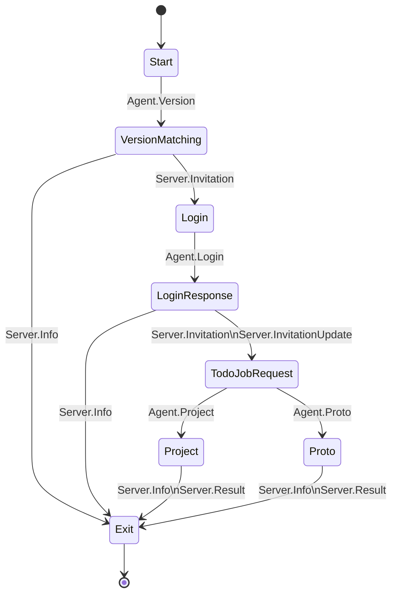

# AdHoc: Multi-Language Binary Protocol Code Generator

Performance should never be an afterthought.


When system components need to communicate efficiently across languages and platforms, manually coding serialization and deserialization becomes a
real burden — slow to write, prone to subtle bugs, and increasingly painful as the system grows, new languages are added, or data structures change.

**Domain-Specific Languages (DSLs) for protocol description** solve this by letting you declare your data structures, message types, and communication
protocols once, then automatically generate consistent, high-performance implementation code for any supported language. The benefits are concrete:

* **Reduced development time:** No manual serialization logic.
* **Fewer bugs:** Generated code is consistent across platforms, eliminating a whole class of human error.
* **Uniform implementation:** Data handling and protocol adherence are identical everywhere.
* **Easier maintenance:** Protocol changes go in one place and propagate automatically.

Many established frameworks use this approach:

- [**Swagger/OpenAPI**](https://swagger.io/docs/specification/data-models/): RESTful API definition with documentation and code generation.
- [**Protocol Buffers**](https://developers.google.com/protocol-buffers/docs/overview): Compact binary serialization with schema evolution.
- [**Cap'n Proto**](https://capnproto.org/language.html): High-performance, zero-copy serialization with RPC.
- [**FlatBuffers**](http://google.github.io/flatbuffers/flatbuffers_guide_writing_schema.html): Memory-efficient zero-copy serialization.
- [**ZCM**](https://github.com/ZeroCM/zcm/blob/master/docs/tutorial.md): Real-time, low-latency messaging for structured data.
- [**MAVLink**](https://github.com/mavlink/mavlink): Lightweight messaging for drones and robotics.
- [**Thrift**](https://thrift.apache.org/docs/idl): Cross-language serialization and RPC.
- [**Apache Avro**](https://avro.apache.org/docs/1.8.2/idl.html): Schema-based serialization for big data.

After evaluating these options, particularly for scenarios demanding maximum binary efficiency and application-specific protocol control, we developed
**AdHoc Protocol** — a next-generation code generator built for those demands.

AdHoc currently supports **C#, Java, and TypeScript**, with C++, Rust, and Go planned. It handles translation between binary data streams and
structured objects ("packs"), making high-performance cross-language communication straightforward.

## Why Choose AdHoc?

AdHoc is built for **data-oriented applications** that need high performance and efficient handling of structured binary data, whether for network
communication or custom storage formats. Unlike frameworks that require buffering entire messages in memory, **AdHoc uses a streaming architecture.**
Data is processed in small, reusable chunks, dramatically reducing memory usage and enabling efficient handling of messages of any size — including
messages larger than available RAM.

### 1. Best Fit: Data-Intensive Applications

AdHoc is well-suited for systems where data volume, speed, and efficiency matter:

- **Financial Trading:** Real-time, high-frequency market data with minimal latency.
- **CRM:** Large datasets of customer interactions and transactions.
- **ERP:** High-volume, real-time data updates in logistics, inventory, and operations.
- **Scientific & Industrial Data Acquisition:** Massive volumes of binary sensor data for factory automation and engineering analysis.
- **Game Servers:** Low-latency, real-time communication for multiplayer games.
- **IoT Systems:** High-throughput sensor data streams.
- **Real-Time Analytics:** Streaming data where processing speed is critical.
- **Streaming Media:** High-quality audio/video delivery with low latency.
- **Telecommunications:** High-volume call routing, message delivery, and network state.
- **Autonomous Vehicles:** Rapid processing of sensor and communication data.
- **Microservices:** Efficient data exchange in distributed systems.
- **Custom File Storage:** Application-specific binary formats optimized for retrieval and storage.

### 2. Performance Benefits

- **Drastically reduced memory usage:** AdHoc's streaming parser processes network data in small, reusable buffers (at least 256 bytes). Buffer
  allocation for the entire message is never required, preventing memory spikes even with very large payloads.
- **Lower GC pressure:** By avoiding large single-object allocations and reusing small buffers, AdHoc reduces garbage collector workload, leading to
  lower latency, fewer pauses, and more predictable throughput.
- **Efficient serialization/deserialization:** The streaming model transforms data on-the-fly, reducing end-to-end latency.

### 3. When to Consider Other Solutions

- **Text-based or content-oriented applications:** For blogs, CMS, or document storage where human-readable formats are acceptable, JSON or XML are
  simpler and sufficient.
- **Simple or low-performance use cases:** If data volume, speed, and resource efficiency are not priorities, standard formats are easier to implement
  and maintain.

## AdHoc Protocol Key Concepts


The **AdHoc** generator provides:

- C# as the protocol description language — familiar and well-tooled.
- Entities that can import (inherit) or subtract (remove) properties of others.
- Projects composable from other projects, or able to selectively import specific components such as **connections**, constants, or individual packs.
- **Connections** constructable from other connections or their components (stages, branches).
- Packs that can import or subtract individual fields or all fields of other packs.
- A [`custom code injection point`](#custom-code-injection-point) for safely integrating custom code with generated code.
- Built-in visualization through the **AdHoc Observer**, which renders interactive diagrams of network topology, pack field layouts, and data flow
  state machines.
- Bitfield support.
- Nullable primitive data types.
- Automatic `long` primitive representation for packs whose field data fits within 8 bytes, reducing GC overhead.
- Support for strings, maps, sets, and arrays.
- Multidimensional arrays with constant, fixed, or variable dimensions.
- Nested packs and enums.
- Standard and flags-style enums.
- Fields typed as enums or pack references.
- Constants at both host and packet levels.
- Circular reference handling and multiple inheritance. Reused entities can be modified for new projects.
- Compression via [Base 128 Varint](https://developers.google.com/protocol-buffers/docs/encoding) encoding.
- Fully functional generated code ready for network infrastructure.
- **Built-in streaming parser:** Processes all incoming data in small, reusable buffers (e.g., 256 bytes). Buffer allocation for the entire object is
  never required.

The **AdHoc Code Generator** is a [**SaaS**](https://en.wikipedia.org/wiki/Software_as_a_service) platform providing cloud-based code generation.

First, you'll need a personal [UUID](#uuid). A UUID — rather than a login and password — lets you automate code generation and embed the **AdHocAgent
** utility into your delivery pipeline.

To get started:

1. Install .NET.
2. Install a **C# IDE** such as **[Intellij Rider](https://www.jetbrains.com/rider/)**, **[Visual Studio Code](https://code.visualstudio.com/)**, or *
   *[Visual Studio](https://visualstudio.microsoft.com/vs/community/)**.

---

1. Install [7-Zip](https://www.7-zip.org/download.html) for PPMd compression of source files. Download [**version 24.07 or higher
   **](https://youtu.be/i5L9xEk_adw) for your platform:
	
	- **[Windows](https://www.7-zip.org/a/7zr.exe)**  
	  Add `C:\Program Files\7-Zip` to the system `PATH` and verify `7z` works in the console.
	
	- **[Linux](https://www.7-zip.org/a/7z2201-linux-x86.tar.xz)**
	  ```shell
	  apk add p7zip
	  ```
	
	- **[macOS](https://www.7-zip.org/a/7z2107-mac.tar.xz)**
	  ```
	  brew install p7zip
	  ```

2. Download the [AdHoc protocol metadata attributes Meta.cs file](https://github.com/AdHoc-Protocol/AdHoc-protocol/blob/master/src/Meta.cs), or add a
   dependency on `AdHocAgent.dll` to your protocol project.


1. Add a reference to `Meta` in your AdHoc protocol description project.  
   
2. Compose your protocol description project.
3. Use the **[AdHocAgent](https://github.com/cheblin/AdHocAgent)** utility to upload your project to the server and retrieve the generated code.

# AdHocAgent Utility

AdHocAgent is a command-line utility that handles:

1. Uploading your task
2. Downloading generated results
3. Deploying your project
4. Visualizing your project structure as a diagram
5. Uploading `.proto` files to convert to AdHoc protocol description format
6. Storing and updating your user `UUID`

The first argument is the path to the task file. The file extension determines the task type.

---

## `.cs`

Upload the `protocol description file` to generate source code.
<details>
 <summary><span style = "font-size:30px">👉</span><b><u>Click to see</u></b></summary>


 </details>

## `.cs?`

Launches the **AdHoc Observer**, a web-based tool for visualizing, analyzing, and documenting your protocol definitions. It connects via WebSocket to
receive live protocol data and renders it as a series of interconnected diagrams.

```cmd
    AdHocAgent.exe MyProtocol.cs?
```

The Observer lets you:

* **Visualize high-level architecture:** See all hosts, the packs they handle, and the **connections** linking them in a clear, interactive graph.
* **Drill into data flow logic:** Right-click a **connection** to open a detailed pop-up view of its state machine, including all stages and branching
  logic.
* **Inspect data structures:** Left-click a pack to view its fields, data types, and nested structures.
* **Annotate and document:** Double-click the background to create, edit, and save rich-text notes ("stickers") directly on the diagrams.
* **Navigate:** Use a searchable, collapsible tree view in the sidebar to find and focus on any host, pack, or **connection**.
* **Persist your workspace:** All layout customizations (node positions, pan, zoom) and annotations are automatically saved.

> **[See the full Observer User Guide](./Observer.md) for a detailed explanation of all features.**


> [!NOTE]    
> To enable navigation from the Observer to your source code, specify the path to your local C# IDE in the `AdHocAgent.toml` configuration file.

### Saving Your Workspace

The Observer automatically saves your workspace, including diagram layouts and annotations, into a dedicated folder.

* **Location:** The current working folder of AdHocAgent.
* **Manual save:** Open the sidebar and select **"Save Diagram"**.
* **Recovery:** If you accidentally close the browser without saving, the Observer creates a `current_working_folder/unsaved` folder. Move those files
  to the `current_working_folder` to recover your work.


## `.proto` or path to a folder

Converts a file or directory of [Protocol Buffers](https://developers.google.com/protocol-buffers) files to the AdHoc `protocol description` format.

<details>
 <summary><span style = "font-size:30px">👉</span><b><u>Click to see</u></b></summary>

```cmd
    AdHocAgent.exe MyProtocol.proto
```


 </details>

> [!NOTE]  
> The second argument can be a path to a directory containing additional imported `.proto` files, such as [
`well_known`](https://github.com/protocolbuffers/protobuf/tree/main/src/google/protobuf) files.

The result of `.proto` file conversion is only a starting point for migrating to AdHoc — it cannot be used as-is. Review it with the full capabilities
of AdHoc protocol in mind.

## `.json` or `.yaml`

Treats the input file as a Swagger/OpenAPI specification. An optional second argument specifies the output AdHoc protocol description `.cs` file path.
If omitted, the `.cs` file is written next to the input file. Do not expect a perfect result from this conversion; it is a starting point for
transitioning from an OpenAPI spec to AdHoc.

## `.md`

The provided path is a `deployment instruction file` for the embedded [Continuous Deployment](https://en.wikipedia.org/wiki/Continuous_deployment)
system. AdHocAgent will only repeat the deployment process for source files already received from the server. Useful for debugging deployments.

<details>
 <summary><span style = "font-size:30px">👉</span><b><u>Click to see</u></b></summary>


 </details>

> [!NOTE]  
> In addition to command-line arguments, AdHocAgent requires a configuration file:

- **`AdHocAgent.toml`:** Contains settings including:
	- The URL of the code-generating server.
	- The path to the local C# IDE binary, enabling the utility to open the IDE at a specific file and line.
	- The path to the [7-Zip](https://www.7-zip.org/download.html) binary.
		- [Windows](https://www.7-zip.org/a/7zr.exe) | [Linux](https://www.7-zip.org/a/7z2201-linux-x86.tar.xz) | [macOS](https://www.7-zip.org/a/7z2107-mac.tar.xz)
	- Paths to source code formatter binaries:
		- [clang-format](https://releases.llvm.org/download.html)
		- [prettier](https://prettier.io/docs/en/install.html) — install globally: `npm install -g prettier`
		- [astyle](https://sourceforge.net/projects/astyle/files/)

AdHocAgent searches for `AdHocAgent.toml` in its own directory. If not found, it generates a template to fill in.

## UUID

To get your first `volatile` personal [UUID](https://en.wikipedia.org/wiki/Universally_unique_identifier):

1. Sign in to **GitHub**.
2. Post a message in the [Sign-Up Discussion](https://github.com/orgs/AdHoc-Protocol/discussions/categories/sign-up).

Once your request is processed (when the post disappears), a bot creates a new **private** project for
you [here](https://github.com/orgs/AdHoc-Protocol/projects), tracking your code generation history and surfacing any issues with resolution details.

The project will contain a task with your `UUID`:  


Copy the `UUID` and run AdHocAgent once:

```shell
AdHocAgent 100b9fd2-e593-485b-a2fe-9b9c82bc1e3f
```

The utility saves the `volatile UUID` in `AdHocAgent.toml`.

> [!NOTE]  
> The UUID may be automatically renewed during new code generation requests and cannot be reused. Keep your `AdHocAgent.toml` file — it stores the
> updated UUID. If your UUID is rejected, repeat the sign-up process to get a new one.

> [!NOTE]  
> When run without arguments, AdHocAgent displays help and generates a `protocol description file` template.

## Continuous Deployment (CD) System

The embedded CD system automates deploying generated source code into your target projects. It uses a **Deployment Instructions File** (a Markdown
file) to control exactly how and where files are copied. Its key feature is **Smart Merge**, which preserves custom code inside designated injection
points, preventing your work from being overwritten during updates.

### The Deployment Workflow

1. **First run:** Run AdHocAgent. If it finds no deployment instructions file, it generates one (e.g., `AdHocProtocol.md`) and stops.
2. **Configure:** Open the `.md` file. It contains a complete tree of all source files. Add destination paths for your project folders.
3. **Redeploy:** Run AdHocAgent again. It reads your instructions and deploys the files, intelligently merging your custom code.
4. **Repeat:** After future code generation, re-run the utility. Your deployment configuration and custom code are preserved.

### The Deployment Instructions File

* **Naming:** Must match the protocol description filename with an `.md` extension (e.g., `AdHocProtocol.cs` → `AdHocProtocol.md`).
* **Location:** AdHocAgent searches first in the protocol file's directory, then the working directory.

#### Structure: The File Tree

The file contains a Markdown list representing the source directory structure:

```markdown
- 📁[InCS](/path/to/source/InCS)
	- 📁[Agent](/path/to/source/InCS/Agent)
		- ＃[Agent.cs](/path/to/source/InCS/Agent/gen/Agent.cs)
		- ＃[Channel.cs](/path/to/source/InCS/Agent/gen/Channel.cs)
```

#### Configuring Deployment Targets

Specify where files go by appending Markdown links to the end of a line: `[<regex_filter>](<destination_path>)`.

* The `regex_filter` is optional. If omitted (`[](/path)`), the rule applies to all files in scope.
* The `destination_path` is the target location on your filesystem.

##### Target Path Behavior

Behavior is determined by whether the destination path ends with `/` or `\`.

**1. Copy contents into a folder (path ends with `/` or `\`):**
Copies the *contents* of the source folder into the destination. The source folder itself is not created.

- **Folder:** `- 📁[Agent](...) [](/path/to/project/src/)`
	* Files inside `Agent` are copied directly into `/path/to/project/src/`.
- **File:** `- 🌀[demo.ts](...) [](/path/to/project/components/)`
	* The file is copied into the destination folder.

**2. Copy and rename (path does NOT end with `/` or `\`):**
Copies the source item with the exact name and location specified.

- **Folder:** `- 📁[Agent](...) [](/path/to/project/RenamedAgent)`
	* The `Agent` folder and its contents are copied to `RenamedAgent`.
- **File:** `- 🌀[demo.ts](...) [](/path/to/NewName.ts)`
	* The file is copied and renamed.

##### Inheritance and Filtering

* **Inheritance:** Rules on a parent folder are inherited by all its children.
* **Filtering:** Provide a regular expression to apply a rule only to matching files.

**Example:**
> [!TIP]
> Switch from Markdown preview to source to view detailed formatting.

```markdown
- 📁[Observer](/path/to/source/InTS/Observer)  ✅ All files go to 'src', images go to 'assets'.
  [\.(jpg|png|gif)$](/project/assets/images/)
  [](/project/src/)
	
	- 🌀[demo.ts](/path/to/source/InTS/Observer/demo.ts)  // Inherits rule → /project/src/demo.ts
	- 📁[gen](/path/to/source/InTS/Observer/gen)          // All files inside also inherit
```

##### Skipping Files and Folders

Add `⛔` to a line or use an empty target `[]()` to exclude from deployment:

```markdown
- 📁[Observer](/path/to/source/InTS/Observer) [](/path/to/project/src/)
	- 🌀[demo.ts](/path/to/source/InTS/Observer/demo.ts) ⛔ // Skipped
	- 📁[gen](/path/to/source/InTS/Observer/gen) []()        // Entire folder skipped
```

#### Advanced Processing: Execution Instructions

Run scripts or tools on source files *before* they are deployed — for formatting, linting, or other transformations. Instructions are defined in code
blocks and executed in order.

##### File Path Placeholder & Root Path

* Use the `FILE_PATH` placeholder — it is replaced with the actual file path at runtime.
* Paths starting with `/InCS/`, `/InJAVA/`, etc., are treated as relative to the source files root directory.

##### Shell Execution

```regexp
<regex_to_select_files>
```

```shell
<executable_path> <command_line_arguments_with_FILE_PATH>
```

**Example: Formatting C++, C#, and Java files with `clang-format`.**

```regexp
\.(java|cs|cpp|h)$
```

```shell
clang-format -i -style="{ColumnLimit: 120, BreakBeforeBraces: Allman}" FILE_PATH
```

##### C# Code Execution

Execute an inline C# script for more complex transformations. The file path is passed as `args[0]` to `Main`.

* **Reference assemblies:** Add assembly references in quotes at the top of the script if needed (e.g., for `System.Linq`).

**Example: Removing leading whitespace from region directives.**

```regexp
.*
```

```csharp
"System.Text.RegularExpressions"

using System;
using System.IO;
using System.Text;
using System.Text.RegularExpressions;

public class Program
{
    public static void Main(string[] args)
    {
        var filePath = args[0];
        var pattern = @"^\s+(?=//#region|#region)";
        var content = File.ReadAllText(filePath, Encoding.UTF8);
        var updatedContent = Regex.Replace(content, pattern, "", RegexOptions.Multiline);
        File.WriteAllText(filePath, updatedContent, new UTF8Encoding(false));
    }
}
```

### Preserving Custom Code: Smart Merge

Smart Merge ensures that custom logic you add to generated files is not lost on the next deployment. It acts as an intelligent intermediary between
your hand-written code and the code generator.

#### Injection Points

An **injection point** is a marked region in a generated file where you can safely add your own code. Each is identified by a **Unique ID (UID)**.

- **C#**:
  ```csharp
  #region > receiving
  // Your custom code goes here
  #endregion > ǺÿÿČ.Project.Connection receiving  // <-- DO NOT EDIT THIS UID
  ```
- **Java/TypeScript**:
  ```typescript
  //#region > receiving
  // Your custom code goes here
  //#endregion > ǺÿÿČ.Project.Connection receiving // <-- DO NOT EDIT THIS UID
  ```

> [!CAUTION]
> **Never edit, move, or duplicate the `endregion` line or its UID.** The UID is how the system locates your safe zone. Changing it causes your custom
> code to be permanently lost.

#### Generated Blocks

Inside an injection point, you may find pre-written code snippets wrapped in special tags (`//❗<` and `//❗/>`). These are **Generated Blocks**.

```csharp
#region > receiving
// Your custom code can go here.

//❗<
    // This is a generated block. Enable or disable it as needed.
//❗/>

// Your custom code can also go here.
#endregion > ǺÿÿČ.Project.Connection receiving
```

**Working with Generated Blocks:**

* ✅ **Enable/Disable:** Comment out **the entire block (including tags)** to disable; uncomment to enable.
* ✅ **Reorder:** Move an entire block (tags and all) within its injection point.
* ❌ **Do not edit** the code *inside* a generated block — changes are discarded on the next deployment.
* ❌ **Do not modify** the tags: block markers (e.g., `//❗<`).

#### Smart Update Notifications

When a new version of the protocol is deployed, the system merges your custom code with the new file. It adds `//todo 🔴` comments to flag important
generator changes for your review:

* **New active code:** A new, active generated block was added to your injection point.
  ```csharp
  //todo 🔴 New active generated code was added by the generator. Please review as it may affect your custom logic.
  //✅<
      callNewFunction();
  //✅/>
  ```
* **Removed code you used:** A generated block you had explicitly enabled was removed by the generator in this update. To prevent silent failures in
  your logic, it is commented out with a warning rather than permanently deleted. You free to review and remove it.
  ```csharp
  //todo 🔴 The following code block was removed by the code generator. Please review.
  // //❗<
  //    callObsoleteFunction();
  // //❗/>
  ```

#### Orphaned Code Protection

Sometimes, sweeping changes to a protocol mean an entire **Injection Point (UID)** is removed by the generator.

If this happens, the AdHoc Agent performs a smart "Orphan Check":

1. **Content Analysis:** It strips away all generated blocks from the missing region and checks if any hand-written custom code remains.
2. **Silent Cleanup:** If the region was empty or only contained generated code, it is safely discarded.
3. **Active Intervention:** If you wrote actual custom code in that region, the deployment is immediately paused. The console will display your "
   orphaned" code and require your explicit confirmation (`y/N`) before proceeding, ensuring your work is never deleted without your knowledge.

#### Automatic Backups & Recovery

Even if you mistakenly confirm the deletion of orphaned code, or if a deployment behaves unexpectedly, your work is safe.

Before any existing file is modified, the AdHoc Agent automatically copies the original files into a versioned backup folder (e.g., `backup_name_1`).
Inside this folder, you will find ready-to-use restore scripts (`restore.bat`, `restore.ps1`, `restore.sh`) that instantly revert your project to its
exact pre-deployment state.

### Lifecycle Hooks

Run executables at the very beginning or end of the entire deployment process:

```markdown
[before deployment]("C:\Program Files\dotnet\dotnet.exe" format "/InCS/MyProject")
[after deployment](/path/to/logging_script.sh --status=success)
```

### Automated Backups and Restoration

Before overwriting any files, the system creates a backup automatically.

#### How It Works

1. **Creates a backup directory** named sequentially (e.g., `AdHocProtocol_1`, `AdHocProtocol_2`) in the same location as the deployment instructions
   file.
2. **Copies existing files** that are about to be replaced, with generic names (`original_1.cs`, `original_2.java`) to prevent conflicts.
3. **Generates restore scripts** inside the backup directory:
	* `restore.bat` (Windows Command Prompt)
	* `restore.ps1` (Windows PowerShell)
	* `restore.sh` (Linux, macOS, WSL)

> [!IMPORTANT]
> Only files being **overwritten** are backed up. New files deployed to empty locations have no original to back up.

#### How to Restore

1. Open the latest backup folder (e.g., `AdHocProtocol_5`).
2. Run the script for your OS:
	* **Windows:** Double-click `restore.bat` or right-click `restore.ps1` → "Run with PowerShell".
	* **Linux/macOS:**
	  ```shell
	  chmod +x restore.sh
	  ./restore.sh
	  ```

Running the script copies every backed-up file back to its original project location, reverting the deployment entirely.

# Overview

The simplest `protocol description file` looks like this:

```csharp
using org.unirail.Meta; // Required for AdHoc protocol generation

namespace com.my.company // Required
{
    public interface MyProject // Declares an AdHoc protocol description project
    {
        class CommonPacket{ } // A common empty packet used across different hosts

        /// <see cref="InTS"/>-   // Generates an abstract TypeScript version
        /// <see cref="InCS"/>    // Generates the concrete C# implementation
        /// <see cref="InJAVA"/>  // Generates the concrete Java implementation
        struct Server : Host
        {
            public class PacketToClient{ }
        }

        /// <see cref="InTS"/>    // Generates the concrete TypeScript implementation
        /// <see cref="InCS"/>-   // Generates an abstract C# version
        /// <see cref="InJAVA"/>  // Generates the concrete Java implementation
        struct Client : Host
        {
            public class PacketToServer{ }
        }

        interface Connection : Connects<Client, Server>{
            interface Start :
                l____________<
                   (
                    CommonPacket,
                    Client.PacketToServer
                    )
                >,
                ____________r<
                    (
                    CommonPacket,
                    Server.PacketToClient
                    )
                >{ }
        }
    }
}
```

To visualize your protocol structure, run the **AdHoc Observer** by appending `?` to your protocol file path:
`AdHocAgent.exe /dir/minimal_descr_file.cs?`.

<details>
  <summary><span style = "font-size:30px">👉</span><b><u>Click to see</u></b></summary>


</details>

To upload a file and get generated source code: `AdHocAgent.exe /dir/minimal_descr_file.cs`

# Protocol Description File Format

> [!IMPORTANT]  
> **The `protocol description file` follows a specific naming convention:**
>
> - Names must not start or end with an underscore `_`.
> - C# prohibits a class from having a field or nested class with the same name as the class itself — a `Pack` cannot have a field or nested pack
    sharing its name.
> - Names must not match keywords in any language the code generator supports. **AdHocAgent** checks for these conflicts before uploading.

## Project

The `protocol description file` is a plain C# source file within a .NET project, using C# as
a [DSL](https://en.wikipedia.org/wiki/Domain-specific_language).

To create one:

- Create a C# project.
- Add a reference to the [AdHoc protocol metadata attributes](https://github.com/cheblin/AdHoc-protocol/tree/master/src/org/unirail/AdHoc).
- Create a new C# source file.
- Declare the protocol description project as a C# `interface` within your company's namespace.

```csharp
using org.unirail.Meta; // Required

namespace com.my.company // Required
{
    public interface MyProject
    {
        // Add your protocol description here
    }
}
```

> [!Note]
> C# 10 introduced file-scoped namespaces, eliminating curly braces and reducing indentation:

```csharp
using org.unirail.Meta;

namespace com.my.company;

public interface MyProject
{
    // Add your protocol description here
}
```

AdHoc protocol descriptions cover both the data structures (packets and fields) and the complete network topology: hosts, connections, and their
logical interconnections.

<details>
 <summary><span style = "font-size:30px">👉</span><b><u>Example protocol description file:</u></b></summary>

```csharp
using org.unirail.Meta;

namespace com.my.company2
{
    /**
		<see cref = 'BackendServer.ReplyInts'                      id = '7'/>
		<see cref = 'BackendServer.ReplySet'                       id = '8'/>
		<see cref = 'FrontendServer.PackB'                         id = '6'/>
		<see cref = 'FrontendServer.QueryDatabase'                 id = '5'/>
		<see cref = 'FullFeaturedClient.FullFeaturedClientPack'    id = '4'/>
		<see cref = 'FullFeaturedClient.Login'                     id = '3'/>
		<see cref = 'Point3'                                       id = '0'/>
		<see cref = 'Root'                                         id = '1'/>
		<see cref = 'TrialClient.TrialClientPack'                  id = '2'/>
	*/
	public interface MyProject{

        public class Root/*Ā*/{ // Non-transmittable base entity
            long id;
            long hash;
            long order;
        }

        class max_1_000_chars_string{ // Non-transmittable typedef
            [D(+1_000)] string? TYPEDEF;
        }

        class Point3/*ÿ*/{
            private float          x;
            private float          y;
            private float          z;
            max_1_000_chars_string label;
        }

        ///<see cref = 'InJAVA'/>
        struct FrontendServer/*ā*/ : Host{
            public class QueryDatabase/*Ą*/ : Root{
                private string? question;
            }

            public  class PackB/*ą*/{ }
        }

        ///<see cref = 'InCS'/>
        struct BackendServer/*ÿ*/ : Host{
            public class ReplyInts/*Ć*/ : Root{
                [D(300)] int[] reply;
            }

            public class ReplySet/*ć*/ : Root{
                [D(+300)] Set<int> reply;
            }
        }

        ///<see cref = 'InTS'/>
        struct FullFeaturedClient/*Ă*/ : Host{
            public class Login/*Ă*/ : Root{
                private string? login;
                private string? password;
            }

            public class FullFeaturedClientPack/*ă*/{
                max_1_000_chars_string query;
            }
        }

        ///<see cref = 'InCS'/>
        struct TrialClient/*ă*/ : Host{
            public class TrialClientPack/*ā*/{
                max_1_000_chars_string query;
            }
        }

        ///<see cref = 'InTS'/>
        struct FreeClient/*Ā*/ : Host{ }

        interface TrialConnection/*ÿ*/ : Connects<FrontendServer, TrialClient>{
            interface Start/*ÿ*/ : l____________</*ÿ*/
                                  (Point3,
                                  Root,
                                  TrialClient.TrialClientPack)
	                              >,
	                              ____________r</*Ā*/
	                                  Point3,
	                                  TrialClient.TrialClientPack
	                              >{ }
        }

        interface MainConnection/*Ā*/ : Connects<FrontendServer, FullFeaturedClient>{
            interface Start/*Ā*/ : l____________</*ÿ*/
                                  (Point3,
                                  Root,
                                  TrialClient.TrialClientPack,
                                  FullFeaturedClient.Login,
                                  FullFeaturedClient.FullFeaturedClientPack)
                              >,
                              ____________r</*Ā*/
                                  (Point3,
                                  TrialClient.TrialClientPack,
                                  FullFeaturedClient.FullFeaturedClientPack)
                              >{ }
        }

        interface TheConnection/*ā*/ : Connects<FrontendServer, FreeClient>{
            interface Start/*ā*/ : l____________</*ÿ*/
                                  (Point3,
                                  Root)
                              >,
                              ____________r</*Ā*/
                                  Point3
                              >{ }
        }

        interface BackendConnection/*Ă*/ : Connects<FrontendServer, BackendServer>{
            interface Start/*Ă*/ : l____________</*ÿ*/
                                  (FrontendServer.QueryDatabase,
                                  Point3,
                                  FrontendServer.PackB)
                              >,
                              ____________r</*Ā*/
                                  (BackendServer.ReplyInts,
                                  BackendServer.ReplySet)
                              >{ }
        }
    }
}
```

</details>
<details>
 <summary><span style = "font-size:30px">👉</span><b><u>Viewed in the AdHocAgent observer:</u></b></summary>  


Selecting a specific connection shows the packets involved and their destinations.


</details>

After processing with AdHocAgent, the tool assigns packet ID numbers for identification and tracking.


> [!NOTE]  
> A project can function as a [set of packs](#projecthost-as-a-named-pack-set).

### Extending Other Projects

To import all components from another project, extend it as a C# interface:

```csharp
interface MyProject : OtherProjects, MoreProjects
{
}
```

> [!NOTE]  
> The order of extended interfaces determines priority for name or pack ID conflicts — earlier ones take precedence.

For example, the [`AdHocProtocol.cs`](https://github.com/AdHoc-Protocol/AdHoc-protocol/blob/main/AdHocProtocol.cs) description defines public,
external connections. Backend infrastructure on the **Server** side often requires an internal protocol for tasks like:

- Distributing workloads across nodes
- Transmitting and aggregating metrics
- Managing internal database records
- Authentication and authorization

**Options:**

1. **Create a separate `Backend` protocol description** — best when the external and internal protocols don't share packet instances.

2. **Extend the existing `AdHocProtocol` description** — use when you want both protocols integrated within a single `Server` host:
   
   ```csharp
   using org.unirail.Meta;

   namespace org.unirail
   {
       public interface AdHocProtocolWithBackend : AdHocProtocol
       {
           // Backend-specific protocol details
       }
   }
   ```

An example backend extension:

```csharp
using org.unirail.Meta;

namespace org.unirail {
    public interface AdHocProtocolWithBackend : AdHocProtocol {

        ///<see cref="InCS"/>
        struct Metrics : Host { }

        class MetricsData{
            public string UserName;
            public long LoginTime;
            public long LogoutTime;
            public long SessionDuration;
            public int LoginAttempts;
            public int FailedLoginAttempts;
            public int SuccessfulLoginAttempts;
            public string LastAccessedPage;
            public int PagesViewed;
            public string BrowserInfo;
            public string OperatingSystem;
            public bool IsSessionActive;
        }

        enum Role {
            Admin,
            User,
            Guest,
            SuperAdmin,
            Moderator
        }

        public class AuthorisationRequest  {
            public string UserName;
            public string Password;
            public string Email;
            public string IPAddress;
            public bool RememberMe;
            public string TwoFactorCode;
        }

        ///<see cref="InJAVA"/>
        struct Authorizer : Host {
            public class AuthorisationConfirmed {
                public Role Role;
                public string UserName;
                public string Email;
                public bool IsAuthenticated;
                public bool IsEmailConfirmed;
                public bool IsTwoFactorEnabled;
                public long LastLogin;
                public string ConfirmationToken;
                public long ConfirmationExpiry;
            }

            public class AuthorisationRejected {
                public string UserName;
                public string Reason;
                public long RejectionTime;
                public int FailedAttempts;
                public string IPAddress;
                public string ErrorCode;
            }
        }

        interface ConnectionToMetrics : Connects<Server, Metrics> {
            interface One : l____________<
                                MetricsData
                            > { }
        }

        interface ConnectionToAuthorizer : Connects<Server, Authorizer> {
            interface Start : l____________<
                                  AuthorisationRequest
                              >,
                              ____________r<
                              (
                              Authorizer.AuthorisationConfirmed,
                              Authorizer.AuthorisationRejected
                               )
                              > { }
        }
    }
}
```

This example introduces two new hosts (`Metrics` in C#, `Authorizer` in Java), several packs, and two connections:

* `ConnectionToMetrics` — links `Server` and `Metrics`.
* `ConnectionToAuthorizer` — links `Server` and `Authorizer`, with a request/reply pattern.

> [!IMPORTANT]
> When working with multiple protocols, you cannot combine their generated protocol-processing code in the same VM instance due to `lib` **org.unirail
** namespace clashes. Assign each project's `lib` to a distinct namespace to resolve this.

### Selective Entity Import

AdHoc provides two methods for fine-tuning imported entities: **XML documentation tags** and **generic interfaces**.

#### By XML Documentation Tags

* **Exclude (`-`)**: Prevents an entity from being imported.
* **Include (`+`)**: Imports *only* the specified entities.

To import only specific connections, enums, or constant sets:

```csharp
	/// <see cref="SomeProject.Pack"/>+
	/// <see cref="FromProjects.Connection"/>+
	interface MyProject : OtherProjects, MoreProjects
	{
	}
```

> [!NOTE]  
> Note the **plus** character after the attribute. You cannot import `Stages` this way.

To exclude specific entities:

```csharp
/// <see cref="MoreProjects.UnnecessaryPack"/>-
/// <see cref="OtherProjects.UnnecessaryConnection"/>-
/// <see cref="OtherProjects.UnnecessaryConnection.Stage"/>-
interface MyProject : OtherProjects, MoreProjects
{
}
```

> [!NOTE]  
> The **minus** character after the attribute excludes the entity.

#### By Generic Interfaces (`_<TYPES>` and `X<TYPES>`)

Use `_<TYPES>` to explicitly **add** entities and `X<TYPES>` to **remove** them from the project scope. For multiple types, use C# tuple syntax:
`_<(TYPE_A, TYPE_B)>`.

```csharp
public interface AdHocProtocol :
    OtherProject,
    _<
        (AdHocProtocol.Agent.Project.Host.Pack.Field.DataType)
    >,
    X<
        OtherProject.LegacyConnection
    >
{
}
```

**Supported operations:**

1. **`_<T>` (Add)**
	* **Connections:** Adds the connection to the project.
	* **Enums / Constant Sets:**
		* **Project level** (`interface Project : _<Enum>`): Included in **every** host in the project.
		* **Host level** (`struct Host : _<Enum>`): Included in that **specific** host regardless of field references.
	* **Hosts:** Restricted — hosts must be referenced as endpoints within a **Connection**.
	* **Packs:** Restricted — packs must be referenced within a **Branch** of a **Stage**.

2. **`X<T>` (Remove)**
	* **Connections:** Removes the connection.
	* **Enums / Constant Sets:** Removes from project scope.
	* **Hosts:** Removes the host *and* any Connection referencing it.
	* **Packs:** Removes the pack from the project and from every Stage Branch where it appears.

3. **`_<(TYPE_A, TYPE_B, ...)>`:** Use C# tuple syntax for multiple types.

> [!NOTE]  
> To import a **host**, reference it as an endpoint within a **connection**. To import a **pack**, reference it within a branch of a stage.

[Learn how to modify imported packs](#modify-imported-packs).  
[Learn how to modify imported connections](#modify-imported-connections).

---

## Hosts

**Hosts** are the active participants in network communication, responsible for sending and receiving data packets across logical **Channels**
established over a **Connection**. A host is defined as a C# `struct` within a project's `interface` and must implement the `org.unirail.Meta.Host`
marker interface.

The AdHoc compiler generates host code only for the programming languages you explicitly specify, using XML documentation comments (`/// <see.../>`)
that define the target language and the desired implementation style.

### Implementation Modifiers

When specifying a target language, append a two-character modifier (e.g., `++`, `+-`) to control the generated code's behavior.

#### First Position: Parsing Strategy (`+` or `-`)

* `+` — **Full Object Deserialization (Concrete Implementation)**
	* The streaming parser reads the entire message and constructs a complete, in-memory object. All data is deserialized before your code accesses
	  it.
	* Best for most application and business logic — simple, stateful objects that can be passed to methods or stored.

* `-` — **Streaming Event-Based Parsing (Abstract Interface)**
	* Activates an event-driven parsing model. The generator creates an abstract base class you must implement. As the parser reads data from the
	  stream, it immediately calls methods on your implementation for each field encountered. **The full object is never allocated on the heap.**
	* Best for high-throughput, low-latency scenarios — network routers, data loggers, or services that must process messages larger than available
	  RAM.

#### Second Position: Hash Support (`+` or `-`)

* `+` — Generates `Equals()` and `GetHashCode()` implementations (or signatures in abstract mode). Use when storing packet objects in hash-based
  collections.
* `-` — Skips `Equals()` and `GetHashCode()`. Reduces generated code and avoids minor overhead when hash-based storage is not needed.

#### Modifier Summary Table

| Modifier | Example                | **Parsing Strategy**          | **Hash Support** |
|:--------:|:-----------------------|:------------------------------|:-----------------|
|   `++`   | `<see cref='InCS'/>++` | Full Object Deserialization   | Enabled          |
|   `+-`   | `<see cref='InCS'/>+-` | Full Object Deserialization   | Disabled         |
|   `-+`   | `<see cref='InCS'/>-+` | Streaming Event-Based Parsing | Enabled          |
|   `--`   | `<see cref='InCS'/>--` | Streaming Event-Based Parsing | Disabled         |

> **Default: `++`** — If a language tag has no modifier (e.g., `<see cref='InCS'/>`), it defaults to `++`.

---

### The Configuration Scoping System

* **No configuration, no code.** If a host has no `<see.../>` tag for a given language, no code is generated in that language.
* **Top-down and persistent.** The generator reads `<see.../>` tags top to bottom. When it encounters a language marker, that rule becomes the *
  *active rule** for that language and applies to all following entities — until another rule for the same language appears.
* **Grouped application.** When specific packs or [Pack Sets](#pack-set) are listed immediately after a language marker, that rule is **confined** to
  that group only. The previously active rule resumes afterward.

#### Recursive Scoping with the `@` Prefix

The `@` prefix acts as an **inline recursive Pack Set**. When the generator encounters `<see cref='@Target'/>` and `Target` is not a field, it *
*recursively includes all transmittable packets** found within the scope of `Target` (a Project, Host, or nested namespace/interface).

> **Note:** The container itself is excluded. Using `@` targets its children, not the container pack.

**Example:**

```csharp
/// <see cref="InTS"/>--
/// <see cref="@RootWithNestedPacks"/>
/// <see cref="InTS"/>+-
struct MonitoringObserver : Host {
    public int Channels => 256;
}
```

#### Detailed Example

```csharp
public interface MyProject
{
    interface BackendPacksThatImplementedOnServer :
        _<
           ( @Monitoring.Network,
            @Monitoring.Authorizer,
            @Monitoring.Processing)
        >{ }

    /**
    <see cref='InCS'/>+-                        // RULE 1: Default for C#, all packs in Server

    <see cref='InJAVA'/>                        // RULE 2: Confined group for Java (defaults to ++)
    <see cref='BackendPacksThatImplementedOnServer'/>
    <see cref='ToAgent.Result'/>
    <see cref='Agent.ToServer.Proto'/>
    <see cref='Agent.ToServer.Login'/>

    <see cref='InJAVA'/>--                      // RULE 3: New Java default for remaining packs
    */
    struct Server : Host { }
}
```

How the generator interprets this:

1. **Rule 1 (`InCS+-`):** `+-` applies to **every** pack in `Server` — no further C# rules override it.
2. **Rule 2 (`InJAVA`):** Defaults to `++`, but is **confined** to the four listed entities. All other Java packs are unaffected.
3. **Rule 3 (`InJAVA--`):** `--` applies to **all remaining** packs in `Server` not covered by Rule 2.

<details>
 <summary><span style = "font-size:30px">👉</span><b><u>Click to see</u></b></summary>


</details>

---

### Advanced Host Concepts

#### Modifying Imported Hosts

To alter code generation configuration for a host defined in another project, create a `struct` implementing `Modify<T>` where `T` is the imported
host, then apply configuration rules as usual:

```csharp
/**
// For the imported 'Server' host:
// 1. Start a confined group rule for Java (++).
<see cref='InJAVA'/>
// 2. Apply this rule only to 'Pack'.
<see cref='Pack'/>
// 3. Set the new Java default for all other packs to be abstract interfaces (--).
<see cref='InJAVA'/>--
*/
struct ModifyServer : Modify<Server> { }
```

#### Host as a Named Pack Set

A `Host` definition also implicitly acts as a named [Pack Set](#pack-set), allowing you to reference all packets defined directly within that host's
scope by its name.

## Pack Set

A Pack Set groups related packet types under a single unit, simplifying rule application and improving reusability. Pack Sets are the primary
mechanism for defining the target group of packets for a rule or operation.

### In-Place Pack Sets

The `org.unirail.Meta._<>` interface creates an **ad-hoc Pack Set** for flexible grouping. Use `org.unirail.Meta.X<>` to exclude specific entities
from a Pack Set.

### Named Pack Sets

**Named Pack Sets** group packets under a reusable name, improving readability and reducing complexity when referencing multiple packets.

```csharp
interface Info_Result:
    _<
    	(Server.Info,
    	Server.Result)
    >{}
```

Named Pack Sets can be declared anywhere within your project and may contain individual packs, other Named Pack Sets, projects, or hosts.

#### Filtering

Refine a Named Pack Set using `[Keep...]` or `[Skip...]` attributes from `org.unirail.Meta`. These filter contents using regular expressions matched
against the **full pack type name** or **doc comment**.

Multiple attributes of the same type can be stacked:

1. **Keep attributes (additive OR):** If any `[Keep...]` attributes are present, a packet is retained only if it matches at least one. If no
   `[Keep...]` attributes are present, all packets are candidates.
2. **Skip attributes (subtractive OR):** A packet is removed if it matches any provided pattern.

#### 1. Name Filtering (`[KeepName]` & `[SkipName]`)

Filter packets based on their **full type names** (namespace + name).

```csharp
[KeepName(@"\.Account\.")]
[KeepName(@"\.Billing\.")]
[SkipName(@"Test")]
[SkipName(@"Draft")]
interface FinancePackets : _< @Project > {}
```

#### 2. Documentation Filtering (`[KeepDoc]` & `[SkipDoc]`)

Filter packets based on their **documentation comments** — useful for organizing packets with visual tags, emojis, or keywords.

```csharp
/// 🔒 User credentials.
interface Credentials : ... {}

/// 📈 Server performance metrics.
interface CpuStats : ... {}

/// 📈 Network throughput.
interface NetStats : ... {}

/// ⛔ Legacy payload.
interface V1Payload : ... {}


[KeepDoc(@"📈")]
[KeepDoc(@"🔒")]
interface DashboardFeed : _< @Project > {}

[SkipDoc(@"⛔")]
[SkipDoc(@"🙈")]
interface PublicApi : _< @Project > {}

[KeepDoc(@"👉📈")]
[KeepDoc(@"👉👀")]
interface DataFlowVisualization : _< @Project > {}
```

**Note:** Filters scan raw documentation text. Since source files are typically UTF-8, symbols and emojis are fully supported in regex.

### Project, Host, or Pack as a Named Pack Set

A **Project**, **Host**, or **Pack** can be treated as a Named Pack Set to automatically include all transmittable packets defined directly within
their scope.

```csharp
interface Info_Result:
    _<
        (
    	Server.Info,
        Server.Result,
        Project,  // All transmittable packets directly in Project scope
        Host      // All transmittable packets directly in Host scope
        )
    >{}
```

To include **all transmittable packets recursively** (including nested structures), prefix the reference with `@`.

> **Important:** The `@` prefix excludes the container itself from the set.

```csharp
interface Info_Result:
    _<
    	(
        Server.Info,
        Server.Result,
        @Project,  // Recursively includes all transmittable packets in Project (excluding Project itself)
        Host,      // Directly includes transmittable packets in Host scope
        X<
        	(
            Packs,
            Need,
            @ToDelete
            )
        >
        )
    >{}
```

## Empty Packs, Constants, Enums

### Empty Packs

A **transmittable** (referenced in a connection) C# class-based pack with no instance fields — only [constants](#constants) or nested pack
declarations. Implemented as singletons, it is the most efficient way to signal simple events or states over a connection.

> [!NOTE]  
> If an empty pack's sole purpose is to define hierarchy structure and should not be transmitted, switch to a C#
> struct-based [Constants Container](#constant-container), which is non-transmittable.

### Constants Container

A **non-transmittable** C# struct-based pack that may contain [constants](#constants) or nested pack declarations. Instance fields are not allowed.
Used to define hierarchy structure and deliver metadata to generated code. Can be declared anywhere within your project.

<details>
 <summary><span style = "font-size:30px">👉</span><b><u>Click to see</u></b></summary>

```csharp
using System;
using org.unirail.Meta;

namespace com.my.company
{
    public interface MyProject2
    {
        [Flags]
        enum GIMBAL_DEVICE_FLAGS
        {
            GIMBAL_DEVICE_FLAGS_RETRACT    = 1,
            GIMBAL_DEVICE_FLAGS_NEUTRAL    = 2,
            GIMBAL_DEVICE_FLAGS_ROLL_LOCK  = 4,
            GIMBAL_DEVICE_FLAGS_PITCH_LOCK = 8,
            GIMBAL_DEVICE_FLAGS_YAW_LOCK   = 16,
        }

        ///<see cref = 'InJAVA'/>
        struct Server : Host
        {
            public enum MAV_BATTERY_FUNCTION : byte
            {
                MAV_BATTERY_FUNCTION_UNKNOWN,
                MAV_BATTERY_FUNCTION_ALL,
                MAV_BATTERY_FUNCTION_PROPULSION,
                MAV_BATTERY_FUNCTION_AVIONICS,
                MAV_BATTERY_TYPE_PAYLOAD,
            }

            class ServerPack { }
        }

        ///<see cref = 'InTS'/>
        struct Client : Host
        {
            class Login
            {
                string user;
                string password;
                [D(DST_CONST_FIELD)] Binary[,]  hash;

                static int      USE_ANY_FUNCTION = (int)Math.Sin(34) * 4 + 2;
                static string[] STRINGS          = { "", "\0", "ere::22r" + "K\nK\n\"KK", STR };

                [ValueFor(DST_CONST_FIELD)]
                private static int SRC_STATIC_FIELD = 45 * (int)Server.MAV_BATTERY_FUNCTION.MAV_BATTERY_FUNCTION_ALL + 45 >> 2 + USE_ANY_FUNCTION;
                const string STR = "KKKK";

                const int DST_CONST_FIELD = 0;
            }
        }

        struct SI_Unit
        {
            struct time
            {
                const string s   = "s";
                const string ds  = "ds";
                const string cs  = "cs";
                const string ms  = "ms";
                const string us  = "us";
                const string Hz  = "Hz";
                const string MHz = "MHz";
            }

            struct distance
            {
                const string km    = "km";
                const string dam   = "dam";
                const string m     = "m";
                const string m_s   = "m/s";
                const string m_s_s = "m/s/s";
                const string m_s_5 = "m/s*5";
                const string dm    = "dm";
                const string dm_s  = "dm/s";
                const string cm    = "cm";
                const string cm_2  = "cm^2";
                const string cm_s  = "cm/s";
                const string mm    = "mm";
                const string mm_s  = "mm/s";
                const string mm_h  = "mm/h";
            }
        }

        interface MainConnection : Connects<Server, Client> { }
    }
}
```

</details>

#### Distribution Over Hosts

By default, a Constants Container is included in the host where it is declared. Override this with `_<T>`:

* **Project level** (`interface Project : _<EnumOrConst>`): Included in **every** host in the project.
* **Host level** (`struct Host : _<EnumOrConst>`): Included in that **specific** host.

---

### Enums

Enums organize sets of constants of the same primitive type:

- Use `[Flags]` to indicate a bit field or set of flags.
- Manual value assignment is optional. Fields without explicit values are automatically assigned integers; with `[Flags]`, each field gets a unique
  power of two.

> [!NOTE]
> Enums and all constants are replicated on every host and are not transmitted. They serve as local copies available within each host's scope.

#### Distribution Over Hosts

An Enum is included in a generated Host only if:

1. It is declared within that Host's body.
2. It is referenced by a field in a pack transmitted by that Host.

Override this with `_<T>` at project or host level (same as Constants Containers above).

### Modifying Enums and Constants

Enums and constants can be modified like a [simple pack](#modify-imported-packs), but the modifier is discarded after the modification is applied.

---

## Packs

Packs are the smallest units of transmittable information, defined as C# `class` declarations. They can be nested and placed anywhere within a
project's scope.

Instance **fields** represent the data transmitted. A pack may also contain [constants](#constants) or nested pack declarations.

> [!NOTE]  
> A pack can act as a [set of packs](#projecthost-as-a-named-pack-set) — keep this in mind when organizing the pack hierarchy.

### Inheritance

AdHoc Packs use a **hybrid composition model** for constructing complex data structures by mixing fields from various sources (Mixins) or inheriting
them (OOP).

**The core principle: name occupation.** The generator builds the final field list by checking sources in strict order. Once a field name is "
occupied," any subsequent attempt to add a field with the same name is skipped.

**Resolution hierarchy:**

1. **Native fields** (highest priority) — fields written explicitly in the class body always win.
2. **XML documentation includes** (`<see .../>+`) — processed top-to-bottom; first occurrence wins.
3. **Inheritance** (`base` / `_<...>`) — base class fields are added last; already-occupied names are skipped.

---

**XML-Driven Composition (Mixins)**

Use XML documentation to inject or remove fields before the generator resolves inheritance.

| Operator | Action  | Description                                                                        |
|:--------:|:--------|:-----------------------------------------------------------------------------------|
| **`+`**  | Include | Imports fields from the target if the name is not yet taken.                       |
| **`-`**  | Exclude | Pre-emptively blocks a field name, preventing it from being imported or inherited. |

Because fields are imported via **symbolic XML references**, the pack creates a **live link** to the original definition — not a static copy.

**Single Source of Truth (SSOT):** The source class is the only place definitions exist. Update Packs are projections of that model. Rename a field in
the source via IDE refactoring and the XML tag updates automatically. Change a field's type and all referencing Packs adopt the new type.

#### Example

```csharp
class Player {
    /// <summary>Unique ID</summary>
    public int id;
    
    /// <summary>Current game score</summary>
    public int score;

    // 📉 The Update Pack: Defines a packet { int id; int score; }
    /// <see cref="Player.id"/>+
    /// <see cref="Player.score"/>+
    class Update_score { }
}
```

After renaming `score` → `experience` and changing its type to `long`:

```csharp
class Player {
    public int id;
    
    // ✏️ CHANGE: Renamed 'score' -> 'experience' and changed type 'int' -> 'long'
    public long experience;

    // ✅ MIRACLE: This pack is ALREADY fixed.
    // The IDE automatically updated the XML reference during the rename.
    // The Generator automatically pulls the new 'long' type.
    
    /// <see cref="Player.id"/>+
    /// <see cref="Player.experience"/>+   // Updated automatically by IDE
    class Update_score { }
}
```

The `Update_score` pack is now generated as `{ int id; long experience; }` with no manual intervention.

---

**Overriding Fields**

To override an inherited field, use the **"Exclude-then-Add"** pattern:

```csharp
/// <see cref="Header"/>+
/// <see cref="Header.id"/>-       // Block 'id' from being imported
/// <see cref="ExtendedHeader.id"/>+ // Import 'id' from new source
class MyPacket { ... }
```

---

**C# Inheritance Support**

Single inheritance:

```csharp
class MyPack : BasePack { ... }
```

Multiple inheritance via `_<TYPES>`:

```csharp
class MyPack : Base, _<(BaseA, BaseB, BaseC)> { ... }
```

If multiple base classes define the same field name, the leftmost source wins.

---

**Comprehensive example:**

```csharp
using org.unirail.Meta;

namespace com.my.project
{
    class CommonHeader
    {
        public int id;
        public int version;
        public string debug_tag;
    }

    class SessionInfo
    {
        public string token;
        public long expires;
    }

    // CASE 1: NATIVE PRIORITY
    /// <see cref="CommonHeader"/>+
    struct CustomHeader
    {
        // Native 'version' takes priority; CommonHeader.version is skipped.
        public string version;
    }

    // CASE 2: FILTERING
    /// <see cref="CommonHeader"/>+
    /// <see cref="CommonHeader.debug_tag"/>-
    /// <see cref="SessionInfo"/>+
    struct LoginPacket { }

    // CASE 3: EXPLICIT OVERRIDE
    /// <see cref="CommonHeader"/>+
    /// <see cref="CommonHeader.id"/>-  // Block 'int id' from CommonHeader
    struct BigIdPacket
    {
        public long id; // Native 'long id' fills the slot
    }
}
```

### Field Injection

The `FieldsInjectInto` interface defines a "template" class whose fields are automatically injected into the payload of other packets. The template
class itself is not preserved as a packet.

`FieldsInjectInto< PackSet >` injects fields only into transmittable packets within the specified [`PackSet`](#projecthost-as-a-named-pack-set).

**Example:**

```csharp
class CommonFields : FieldsInjectInto< _<(MyProject, X<Point2d>)> > {
    string name;
    int length;
}

class Point2d {
    float X;
    float Y;
}

class Point3d {
    float X;
    float Y;
    float Z;
}
```

**Result:**

```csharp
// Point2d: unchanged (excluded)
// Point3d: injected fields prepended
class Point3d {
    string name;
    int length;
    float X;
    float Y;
    float Z;
}
```

> [!NOTE]  
> If a target packet already has a field with the same name as an injected field, the injector's definition (type, attributes, documentation) takes
> precedence.

---

#### Modifying Imported Field Injection

Target a specific `TargetFieldInjection` using `org.unirail.Meta.Modify<TargetFieldInjection>` and specify a **PackSet** to add or remove fields:

```csharp
class FieldInjectionModifier : Modify<TargetFieldInjection>, _<(AddPack, X<RemovePack>)>  {
    string name;
    int length;
}
```

---

### Packet Headers

A **packet header** contains protocol-level metadata that is separate from the application payload. These fields are used to handle essential network
tasks such as routing, stream management, actor and actor instance identification, and session control.

**Key characteristics:**

- **Transmission order**  
  Headers are sent and received **after** the pack identifier but **before** the payload. They are directly accessible in network event handlers.

- **Data types**  
  All header fields must use primitive, **non-nullable** types (e.g. `bool`, `int`, `long`, `double`, `float`, `short`, `byte`, `ulong`, etc.).

- **Scope and attachment rules**  
  A header is attached to a packet **only** when that packet is sent **directly** over a connection.  
  When a packet is sent **indirectly** (i.e. it is referenced as a field type inside another packet), only its **payload** is included — **no header**
  is attached in this case.


#### Adding Header Fields

1. **Implicit (automatic):** Every standalone packet includes a `packet_id`.
2. **Explicit (user-defined):** Create a "Header" class implementing `HeaderFor< PackSet >`.

#### Header Scope

1. **Connection-specific (highest precedence):** Declare `HeaderFor<PackSet>` within a `Connection` interface.
2. **Host-specific:** Declare `HeaderFor<PackSet>` within a `Host` definition.
3. **Project scope (lowest precedence):** Declare `HeaderFor<PackSet>` at the project's top level.

**Precedence:** Connection-Specific **▷** Host-Specific **▷** Project Scope.

### Example Usage

```csharp
// 1. Project-scope header for Point2d packets
class SessionHeader : HeaderFor<Point2d> {
    int plain_id;
    int session;
}

// 2. Host-specific header for Point3d and Point2d packets
// (This overrides the project-scope SessionHeader for Point2d when sent from NodeB)
struct NodeB : Host {
    class WorldHeader : HeaderFor<(Point3d, Point2d)> {
        int world_id;
        long timestamp;
    }
}

// Packet payload definitions
class Point2d { float X; float Y; }
class Point3d { float X; float Y; float Z; }

// 3. Connection-specific header for TeamCoordination packets
interface CommunicationConnection : Connects<NodeA, NodeB> {
    class CoordinationHeader : HeaderFor<TeamCoordination> {
        uint sequence_num;
        ushort priority;
    }
}
```

### Resulting On-the-Wire Structure

**`Point3d` Packet (Sent from `NodeB`)**:
Applies the *Host-Specific* header.

```text
[-- HEADER --]
  pack_id     (Implicit)
  channel_id  (Conditional: if MultiChannelHost is used)
  world_id    (Host-Specific: from WorldHeader)
  timestamp   (Host-Specific: from WorldHeader)
[-- PAYLOAD --]
  X, Y, Z
```

**`TeamCoordination` Packet (if send via `CommunicationConnection`)**:
Applies the *Connection-Specific* header.

```text
[-- HEADER --]
  pack_id        (Implicit)
  channel_id     (Conditional: if MultiChannelHost is used)
  sequence_num   (Connection-Specific: from CoordinationHeader)
  priority       (Connection-Specific: from CoordinationHeader)
[-- PAYLOAD --]
  ... (TeamCoordination fields)
```

#### Modifying Imported Headers

```csharp
class HeaderModifier : Modify<TargetHeader>, (AddPack, X<RemovePack)>  {
    string name;
    int length;
}
```

---

### Value Pack

A **Value Pack** packs multiple fields into a single primitive type of up to 8 bytes.

**Key features:**

- **Zero heap allocation:** Stored as value types, avoiding GC overhead.
- **Compact memory layout:** Fields packed into eight bytes or fewer.
- **Type safety:** Full compile-time validation. Fields must be primitive numeric types or other Value Packs.
- **Automatic implementation:** The generator produces optimized packing/unpacking code.

```csharp
// 6 bytes total, packed into an 8-byte primitive (long)
class PositionPack {
    float x;     // 4 bytes
    byte layer;  // 1 byte
    byte flags;  // 1 byte
}
```

#### Smart Flattening

Nested single-field Value Packs are automatically flattened:

```csharp
class Temperature { float celsius; }
class SensorReading { Temperature measurement; }
// Result: class SensorReading { float measurement; }
```

Nullability is preserved through the chain:

```csharp
class Pressure { float kilopascals; }
class PressureSensor { Pressure? reading; }
// Result: class PressureSensor { float? reading; }
```

Deep chains are also flattened:

```csharp
class Voltage { float volts; }
class PowerLevel { Voltage? level; }
class DeviceStatus { PowerLevel? power; }
// Result: class DeviceStatus { float? power; }
```

The following fields all result in the same underlying type — `Set<float?>`:

```csharp
Set<FloatWrapper?>          set_a;
Set<FloatWrapperNullable>   set_b;
Set<FloatWrapperNullable?>  set_c;
```

### Modifying Imported Packs

Create a new pack implementing `org.unirail.Meta.Modify<TargetPack>` to merge fields into the target. Use XML comments to add or remove specific
fields:

```csharp
/// <see cref="Agent.Proto.proto"/>+   // Add field to target
/// <see cref="Agent.Login.uid"/>-     // Remove field from target
class Pack : Modify<TargetPack> {
    public string UserName;
    public long LoginTime;
}
```

> [!NOTE]  
> A modifier pack can function as a normal pack.

---

## Connections

A **Connection** establishes a communication link between two hosts. Connections are declared as C# interfaces within your project and must extend
`org.unirail.Meta.Connects<HostA, HostB>`.

Think of a **Connection** as the static definition of a remoting link — the supervisor and pipe through which all Actors on one node communicate with
Actors on a remote node.

**Example:**

```csharp
using org.unirail.Meta;

namespace com.company {
    public interface MyProject {
        interface Communication : Connects<Client, Server> { }
    }
}
```


**Connection Architecture**

At the endpoint level, each Connection is implemented as a layered structure. Each layer has both an **EXT**ernal side (facing the network) and an *
*INT**ernal side (facing the host application).

<details>
 <summary><span style="font-size:30px">👉</span><b><u>Click to see architecture diagram</u></b></summary>


</details>

Implemented through `org.unirail.AdHoc.Connection.External` and `org.unirail.AdHoc.Connection.Internal` interfaces.

> [!IMPORTANT]  
> **[Data is represented on the wire in little-endian format.](https://news.ycombinator.com/item?id=25611514)**

**Defining Protocol Flow**

Populate the connection interface body with [`States`](#states) and [`Branches`](#branches) to define logical message flows, packet ordering, and
response patterns. These define an Actor's **Finite State Machine (FSM)**, tracking which `State` the communication is in to validate incoming
messages.

**Importing and composing connections:**

```csharp
interface CommunicationConnection : Connects<Server, Client>,
                                    SomeOtherConnection,
                                    SwapHosts<TheConnection> { }
```

Use `SwapHosts<Connection>` to reverse the host roles of imported content.

### Actors

The Pairwise Actor System is a specialized, highly constrained model — a **Distributed, Choreographed 1-to-1 Protocol Engine**. It bridges the gap
between rigid stateless RPC and raw, unstructured WebSockets.

**What it is NOT:**

* Not a general-purpose message router — Actors only communicate with their exact mirror counterpart on the other side of the network.
* Not a stateless request/response framework — Actors are inherently stateful and context-aware.
* Not a raw socket wrapper — it enforces a strict, developer-defined state machine on every interaction.

**What it IS:**

The Pairwise Actor System makes **network boundaries safe and predictable** through four traits:

1. **Strictly bipartite (1-to-1 mirroring):** An interaction consists of exactly two peers. If you need 100 users in a chat room, build 100 Pairwise
   Actors between clients and the room manager — not one giant actor.
2. **Synchronized via FSM:** Both actors run identical replicas of a shared FSM — the single source of truth for what is allowed to happen next.
3. **Asymmetric authority:** In any given state, only one actor is "Main" (the leader) who dictates state transitions. The Follower requests
   permission. This provides lock-free, race-condition-free synchronization.
4. **Epoch sequencing:** Every state transition increments a shared "Epoch," creating a localized logical clock. Stale messages from past epochs are
   automatically dropped.

<details>
 <summary><span style="font-size:30px">👉</span><b><u>Why AdHoc Uses Actors — and Why async/await Is the Wrong Model for Network Protocols</u></b></summary>

**The Origin of async/await**

To understand why `async/await` is a poor fit for protocol-level networking, you must first understand what problem it was actually designed to solve.

`async/await` was born from a single use case: **Remote Procedure Call**. The mental model is seductive — you call a function, it travels over the
network, executes somewhere else, and returns a result. The network hop is invisible. The programmer writes linear code. It looks like this:

```csharp
var result = await RemoteService.ComputeAsync(input);
```

This is clean, readable, and for that one pattern — completely reasonable.

The catastrophe begins when you try to use this model for everything else.

---

**What Real Network Applications Actually Do**

RPC is a vanishingly small fraction of what a networked application actually does. Consider what a real protocol session looks like:

1. A connection is established — **hold state**
2. A handshake packet arrives — **validate, transition state**
3. A partial payload arrives — **buffer it, wait for more**
4. The rest of the payload arrives — **reassemble, transition state**
5. An authentication challenge is issued — **wait for response, hold state**
6. A heartbeat timeout fires — **react, maybe send, maybe close**
7. A second channel opens on the same connection — **manage parallel state**
8. A downstream dependency responds out of order — **correlate, reconcile state**

This is not a call stack. It is a **state machine**. It has memory. It reacts to events from multiple sources. It lives for seconds, minutes,
sometimes hours. It holds resources deliberately across many message exchanges.

`async/await` models computation as a **suspended call stack** — a coroutine that pauses waiting for one thing and resumes when that one thing
arrives. To force a state machine into this model, you end up doing one of two things:

- You fragment the state machine logic across dozens of `await` points, destroying the coherence of the protocol flow
- Or you build elaborate orchestration around `async/await` — `CancellationToken`, `TaskCompletionSource`, `SemaphoreSlim`, `Channel<T>`,
  `IAsyncEnumerable` — an entire bureaucracy of infrastructure to recover the expressiveness that was stripped away by choosing the wrong primitive in
  the first place

Every `await` is a potential heap allocation. Every suspended coroutine is a live object the garbage collector must track. In a server processing
thousands of concurrent sessions, each with dozens of in-flight protocol states, this is not a theoretical concern — it is the reason your latency
spikes, your GC pauses grow, and your memory profile looks like a staircase.

---

**The Actor Model Fits Protocols Naturally**

An actor is exactly what a protocol session is:

- It has **identity** — it is a specific session, with a specific peer, with specific negotiated parameters
- It has **state** — it remembers where the protocol is, what has been sent, what is pending, what has been negotiated
- It has a **mailbox** — it receives messages one at a time, in order, without data races
- It **reacts** — it processes an incoming message, updates its state, and optionally sends messages to other actors
- It **persists** — it lives for the duration of the session or as long as needed, not for the duration of a single request

There is no suspension. There is no heap-allocated coroutine waiting for a `TaskCompletionSource` to be resolved. There is no cancellation token
threaded through fifteen function signatures. The actor is simply **alive**, holding its state, processing the next message when it arrives.

The protocol logic becomes a single coherent state machine — readable, auditable, and trivially testable by injecting messages.

```
[session actor state]
  → receives LOGIN_REQUEST
  → validates credentials
  → transitions to AUTHENTICATED
  → sends LOGIN_RESPONSE
  → receives SUBSCRIBE_REQUEST
  → registers subscription (state mutation)
  → sends SUBSCRIBE_ACK
  → receives HEARTBEAT
  → resets timeout timer (state mutation)
  → ... continues for the lifetime of the session
```

Every step is explicit. Every state transition is visible. No hidden suspension points. No invisible allocations. [No
`async` infection spreading through
your entire call graph.](https://archive.is/bDczv)

---

**Actors Subsume RPC. RPC Cannot Subsume Actors.**

This is the critical asymmetry, and it is not subtle.

**Actors can express RPC trivially.** If you need request/response semantics, an actor sends a message and waits for a reply.
This is a standard pattern in any actor system, and it looks like this:

```
Actor A sends REQUEST(id=42, payload) → Actor B
Actor B processes, sends RESPONSE(id=42, result) → Actor A
Actor A matches id=42, delivers result to waiting logic
```

The actor doesn't suspend the thread. It simply holds the pending correlation in its state and handles the response when it arrives — alongside
heartbeats, errors, timeouts, and any other messages that might interleave. You get RPC semantics without giving up any of the generality of the actor
model.

**RPC cannot express actors.** The moment your protocol requires:

- Holding state across more than one request/response cycle
- Reacting to unsolicited server-initiated messages
- Managing multiple interleaved exchanges on the same session
- Handling timeouts that are decoupled from any specific call
- Receiving streaming or fragmented data

...`async/await` has no native answer. You find yourself bolting on state, fighting the call stack model, and building the actor model badly in the
gaps between your `await` expressions.

`async/await` is a **degenerate special case** of the actor model. It models the single-message, single-response, single-waiter case — and it models
that case well. But a general network protocol is not a collection of isolated request/response pairs. It is a living, stateful conversation between
two systems, and it requires a model that is alive for the duration of that conversation.

---

**What This Means for AdHoc**

AdHoc is built around the recognition that **the protocol is the state machine, and the state machine is the actor**.

Generated protocol code in AdHoc does not produce `async` methods returning `Task<T>`. It produces actors — entities with explicit state, explicit
message handlers, and explicit transitions. The generated code is:

- **Allocation-minimal** — no coroutine objects, no `TaskCompletionSource`, no intermediate promise chains
- **GC-friendly** — state lives in the actor's fields, not in heap-allocated closure captures
- **Readable** — the protocol flow is visible as a state machine, not scattered across `await` points
- **Composable** — actors communicate with other actors; RPC is available as a pattern, not as a constraint

When a developer using AdHoc wants RPC semantics, they use them — one actor sends a message, another response, correlation is handled in a few lines
of state. When they need streaming, subscription, long-lived session management, or server-push — they already have everything they need, because they
were always writing actors.

The reverse is not true. A developer committed to `async/await` who discovers they need session-level state must fight their way uphill to recover
what the actor model gives you for free from the start.

**The expressive power flows in one direction. Actors contain async. Async does not contain actors.**

</details>


Actors are declared within the connection scope as C# interfaces. Their concurrency limits, identity, and addressing schemes are defined by
implementing one of the following `org.unirail.Meta` interfaces:

* **`Actor` (Singleton):** Defines a singleton-style actor with a **fixed, well-known identity**. Because only one instance exists, the destination
  address is always stable and predictable. If an actor of this type is defined with only a **single state**, it is treated as a global entity, shared
  on the server across all connections.

* **`ActorSwarm` (Multi-instance):** A dynamic collective of actors where each instance generates a **unique, temporary identity**. To communicate,
  the sender must first discover the specific instance's ID.
* **`ActorSwarm_WithMulticasting` (Pub-Sub):** A multi-instance swarm that shares a **single, well-known address**. Sending a message to this address
  automatically fans out (multicasts) the message to all active instances of this type within the connection.

**Example:**

```csharp
using org.unirail.Meta;

namespace com.company {
    public interface MyProject {
        interface Communication : Connects<Client, Server> {

            // Singleton: Fixed identity, stable address
            interface MainControllerActor : Actor { }

            // Swarm: Dynamic identities, requires ID discovery to address specific instances
            interface CPUMetricsActor : ActorSwarm { }

            // Swarm + PubSub: Shared fixed address multicasts to all active instances of this type
            interface ChatRoomMemberActor : ActorSwarm_WithMulticasting { }
        }
    }
}
```

### States

States represent distinct processing phases within an Actor's lifecycle — what messages are expected and what logic should execute. The topmost State
declared represents the initial State.

> [!NOTE]  
> The state machine is event-driven by packet transmission and timeouts. The AdHoc server generates code from your dataflow description; developers
> integrate this code, adding custom logic as needed.

**Practical Example: Communication Lifecycle**

From [`AdHocProtocol.cs`](https://github.com/AdHoc-Protocol/AdHoc-protocol/blob/acfc582c971914a4a86f3458d4b85a141a787d3c/AdHocProtocol.cs#L443):

<details>
 <summary><span style="font-size:30px">👉</span><b><u>Click to view communication flow diagram</u></b></summary>


To view in the Observer:

```cmd
AdHocAgent.exe /path/to/AdHocProtocol.cs?
```

Right-click a connection link to open the connections window.



</details>

---

#### Declaring States

States are declared as C# interfaces within the Actor scope. The code generator traverses from the top State; unreachable States are ignored.

Branch declarations follow immediately after the host designation.


States can be unidirectional:


> [!WARNING]
> Short block comments like `/*įĂ*/` contain auto-generated unique identifiers. **Never edit or clone these.**

#### State Timeouts

Use built-in attributes to define maximum State duration (in seconds):

- `[ReceiveTimeout(seconds)]`
- `[TransmitTimeout(seconds)]`

Without these attributes, States persist indefinitely.

---

### Branches

Inside a **State**, **Branches** determine which host has authority to advance the conversation and which is restricted to sending data within the
current context.

| Syntax                         | Host Role            | Action Type    | Result                                                      |
|:-------------------------------|:---------------------|:---------------|:------------------------------------------------------------|
| **`L____________<P, S, ...>`** | **Left (Main)**      | **Transition** | Left sends `P` to move FSM to `S`. Supports up to 9 pairs.  |
| **`l____________<P>`**         | **Left (Follower)**  | Payload        | Left sends `P`; FSM **remains** in current state.           |
| **`____________R<P, S, ...>`** | **Right (Main)**     | **Transition** | Right sends `P` to move FSM to `S`. Supports up to 9 pairs. |
| **`____________r<P>`**         | **Right (Follower)** | Payload        | Right sends `P`; FSM **remains** in current state.          |
| **`_____lr_____<P>`**          | **Both**             | Peer-to-Peer   | Both send `P`; FSM **remains** in current state.            |

*For multiple packet types in a branch, use C# tuple syntax: `<(PackA, PackB), TargetState>`.*

Multi-Path Transitions

For states with multiple possible outcomes (e.g., Success/Failure), you can list multiple `<Pack, TargetState>` pairs in a single branch.

> [!TIP]
> **Readability First:** To maintain clarity, write each transition pair on its own line. Do not compress multiple transitions into a single
> unreadable line.

**Example: The "Decision" Pattern**

```csharp
interface Evaluating : ____________R<
    (AccessGranted, LimitAccessGranted), VaultOpen, // Path 1: Success
    AccessDenied, Exit                              // Path 2: Failure
> { }
```

> [!TIP]
> **Cross-Actor-Connection State References:**
> When defining a transition branch (`L____________<PACKS, STATE>` or `____________R<PACKS, STATE>`), the target `STATE` does not have to be local to
> the current Actor or Connection. You can reference a state defined in a completely different Actor.
>
> When this happens, **the parser performs a graph traversal and copies the referenced state**—along with all of its subsequently linked states and
> branches—directly into the current Actor's flow. This enables developers to create modular, reusable FSM blocks (e.g., standard error handling or
> teardown sequences) that can be easily grafted across multiple Actors.

---

**Example 1: The "Baton Pass" (Swapping Authority)**

```csharp
interface SecureHandshake : Actor {
    // STATE 1: Agent is the Boss. They initiate the request.
    interface Initializing :
        L____________<ClientHello, AwaitingChallenge> { }

    // STATE 2: Server is now the Boss. They control the validation.
    interface AwaitingChallenge :
        ____________R<(AuthChallenge, UpgradeRequest), Verifying> { }

    // STATE 3: Agent is back in control. They must provide the solution.
    interface Verifying :
        L____________<ChallengeResponse, Finalizing> { }

    // STATE 4: Server has the final word.
    interface Finalizing :
        ____________R<(Welcome, AccessDenied), End> { }
}
```

The "Boss" role passes back and forth. Only one side is "Main" at any given time, preventing race conditions.

---

**Example 2: Developer-Defined Governance**

```csharp
interface TelemetryStream : Actor {
    interface Active :
        l____________<(SensorData, GPSCoords)>, // Agent pumps data
        ____________R<PauseCmd, Paused>,        // Server controls state
        ____________R<Terminate, Exit>          // Server kills connection
    { }

    interface Paused :
        ____________R<Resume, Active>
    { }
}
```

The Server governs state transitions not because it is a "server" but because the developer designed the `Active` state that way.

---

**Example 3: Shared Authority with a Designated Governor**

```csharp
interface CollaborativeEdit : ActorSwarm {
    interface Editing :
        _____lr_____<(TextInsert, TextDelete, CursorMove)>, // Both sides can edit
        L____________<FinalizeDoc, Reviewing>               // Only Left can finalize
    { }

    interface Reviewing : ____________R<(Approved, NeedsChanges), Editing> { }
}
```

You get the flexibility of a raw socket with the safety of a formal state machine.

---

**Example 4: Cross-Actor State Reference**

```csharp
interface CommonFlows : Actor {
    // A generic teardown sequence we want to reuse
    interface GracefulDisconnect : 
        L____________<Goodbye, Closed> { }

    interface Closed : 
        ____________R<AckDisconnect, End> { }
}

interface DataSync : ActorSwarm {
    interface Syncing :
        _____lr_____<DataChunk>,
        // The parser will copy CommonFlows.GracefulDisconnect AND CommonFlows.Closed directly into the DataSync FSM.
        L____________<SyncComplete, CommonFlows.GracefulDisconnect> { } 
}
```

---

**Nesting Actors for Organization**

In large systems, nest interfaces within the connection scope to group related Actors logically. The code generator respects this hierarchy,
organizing the generated API accordingly.

**Example: "Smart Factory" Protocol**

```csharp
using org.unirail.Meta;

interface FactoryLink : Connects<Agent, Server> {

    interface Infrastructure {

        interface HealthMonitor : Actor {
            interface Active :
                l____________<(BatteryLevel, Temperature, CpuLoad)>,
                ____________R<RequestSelfTest, DiagnosticMode>
            { }

            interface DiagnosticMode :
                l____________<TestProgress>,
                ____________R<TestResult, Active>
            { }
        }
    }

    interface Production {

        interface TaskRunner : ActorSwarm {
            interface Idle : L____________<RequestJob, Assignment> { }

            interface Assignment : ____________R<
                (JobManifest, ToolingSpecs), Executing,
                WaitCommand, Idle
            > { }

            interface Executing :
                l____________<Telemetry>,
                L____________<JobComplete, Idle>,
                ____________R<EmergencyStop, Stopped>
            { }

            interface Stopped : L____________<ManualOverride, Idle> { }
        }

        interface AssetSync : ActorSwarm {
            interface Start : L____________<CheckUpdates, UpdateCheck> { }

            interface UpdateCheck : ____________R<
                NewFirmware, Downloading,
                UpToDate, End
            > { }

            interface Downloading :
                l____________<ChunkAck>,
                ____________r<FileChunk>,
                L____________<DownloadComplete, End>
            { }
        }
    }
}
```

---

### Modifying Imported Connections

Customize imported connections and their components without modifying the original definitions.

#### Modification Syntax

* Replicate the target's structure with custom naming and extend `org.unirail.Meta.Modify<TargetEntity>`.
* To delete entities, reference them with `/// <see cref="Delete.Connection"/>-`.
* Within branches: use `X<Entity>` to delete, reference new entities normally to add, and explicitly reference the target State to modify transitions.

> [!NOTE]  
> Modified branches are identified by their transition target State.

#### Example: Removing Entities from a Branch

```csharp
interface UpdateLogin : Modify<Login>,
                        L____________<
                            (
                            X<Agent.Login>,
                            X<Agent.Signup>,
                            X<Login>
                            ),
                            Update_to_state
                        >
{ }
```

#### Complete Example

```csharp
interface UpdateCommunication : Modify<AdHocProtocol.Communication> {

    interface Change_Info_Result : Modify<AdHocProtocol.Communication.Info_Result>,
                                   ____________R<
                                       X<Server.Info>
                                   > { }

    [TransmitTimeout(30)]
    interface Updated_Start : Modify<AdHocProtocol.Communication.Start>,
                              ____________R<
                                  X<AdHocProtocol.Communication.VersionMatching>,
                                  NewState
                              > { }

    interface UpdatedVersionMatching : Modify<AdHocProtocol.Communication.VersionMatching>,
                                       ____________r<
                                           (
                                           X<Server.Invitation>,
                                           Authorizer
                                           )
                                       > { }

    interface NewState : l____________<
                             Sending_Pack
                         > { }
}
```

# Fields

## Numeric Types

AdHoc supports all C# numeric primitives except `decimal`:

| Type     | Range                                                   |
|:---------|:--------------------------------------------------------|
| `sbyte`  | −128 to 127                                             |
| `byte`   | 0 to 255                                                |
| `short`  | −32,768 to 32,767                                       |
| `ushort` | 0 to 65,535                                             |
| `int`    | −2,147,483,648 to 2,147,483,647                         |
| `uint`   | 0 to 4,294,967,295                                      |
| `long`   | −9,223,372,036,854,775,808 to 9,223,372,036,854,775,807 |
| `ulong`  | 0 to 18,446,744,073,709,551,615                         |
| `float`  | ±1.5 × 10⁻⁴⁵ to ±3.4 × 10³⁸                             |
| `double` | ±5.0 × 10⁻³²⁴ to ±1.7 × 10³⁰⁸                           |

### longJS

TypeScript's `number` type can only safely represent integers in the range **−2⁵³ + 1 to 2⁵³ − 1** (
see [SAFE_INTEGER](https://developer.mozilla.org/en-US/docs/Web/JavaScript/Reference/Global_Objects/Number/SAFE_INTEGER)). Values outside this range
require [BigInt](https://developer.mozilla.org/en-US/docs/Web/JavaScript/Reference/Global_Objects/BigInt), which is less efficient.

If your field's values fall within the safe integer range, prefer `longJS` or `ulongJS` over `long` or `ulong` when communicating with TypeScript
hosts.

## Constants

Fields declared as `const` or `static` using primitive types, strings, or arrays of these types.

- **`static` fields:** Can be assigned a value or a calculated expression using any available C# static functions.
- **`const` fields:** Can be used as attribute parameters. Must use C# compile-time expressions and cannot call static functions.

To work around the limitations of `const` fields, use the `[ValueFor(const_constant)]` attribute on a proxy `static` field. The generator assigns the
value and type from the `static` field to the corresponding `const` at code generation time.

```csharp
[ValueFor(ConstantField)] static double value_for = Math.Sin(23);

const double ConstantField = 0; // Result: ConstantField = Math.Sin(23)
```

## Attributes

Attributes communicate metadata to the code generator for optimized implementation. They can be applied to **Hosts**, **Packs**, **Fields**, *
*Connections**, and **Stages**.

### Built-in Attributes

Consider a field with values in the range **400,000,000** to **400,000,193**. Storing these as `int` wastes space. Using a constant offset of
400,000,000, the entire range fits in one byte. The `MinMax` attribute handles this automatically:

```csharp
[MinMax(400_000_000, 400_000_193)] int ranged_field;
```

The code generator determines the most efficient storage type and generates getter/setter methods to handle the offset.

For ranges under 127, the generator can further optimize by packing fields into bit storage:

```csharp
[MinMax(1, 8)] int car_doors; // Range 1–8 requires only 3 bits
```

### Custom Attributes

Custom attributes are transformed by the generator into a hierarchy of constants.

- For **fields**, attributes are the primary method for specifying metadata.
- For other entities, metadata can use attributes or constants directly.

Example using a `Description` attribute on a connection stage:

```csharp
[AttributeUsage(AttributeTargets.Interface)]
public class DescriptionAttribute : Attribute {
    public DescriptionAttribute(string description) { }
}

interface Communication : Connects<Agent, Server> {
    [Description("The state either responds with the result if successful or provides an error message with relevant information in case of failure.")]
    interface State :
        _<
           (Server.Info,
            Server.Result)
        > { }
}
```

Equivalent using a constant:

```csharp
interface Communication : Connects<Agent, Server> {
    interface State :
        _<
            (Server.Info,
            Server.Result)
        > {
        const string Description = "The state either responds with the result if successful or provides an error message with relevant information in case of failure.";
    }
}
```

## Optional Fields

Optional (nullable) fields are declared with a trailing `?` (e.g., `int?`, `byte?`, `string?`). They are allocated in memory but transmit only a
single bit when empty, optimizing transmission size. Reference types (embedded packs, strings, collections) that are not inside a collection are
always treated as optional.

```csharp
class Packet
{
    string user;          // Reference types are always optional
    string[] tags;        // The collection field is optional; items are not
    string?[] emails;     // The collection field and items are both optional
    uint? optional_field; // Optional uint
}
```

For optional fields with primitive types, AdHoc attempts to encode the empty value efficiently by default. Override this by declaring the field as
non-nullable and specifying a "treat as empty" value via a custom attribute:

```csharp
[AttributeUsage(AttributeTargets.Field)]
public class IgnoreZoomIfEqualAttribute : Attribute
{
    public IgnoreZoomIfEqualAttribute(float value) { }
}

[IgnoreZoomIfEqual(1.1f)]
float zoom;
```

## Value Layers

The AdHoc generator uses a 3-layer approach for field values:

| Layer | Description                                                                                                     |
|:------|:----------------------------------------------------------------------------------------------------------------|
| exT   | **External type.** The representation required for external consumers (matches language data type granularity). |
| inT   | **Internal type.** The representation optimized for storage (matches language data type granularity).           |
| ioT   | **IO wire type.** The network transmission format — transmitted as a byte stream with no language granularity.  |


For a field with values from 1,000,000 to 1,080,000, shifting at the `exT ↔ inT` layer yields no memory savings in C# or Java due to fixed type
quantization. However, subtracting 1,000,000 before transmission (`ioT`) reduces the data to 3 bytes — restored on receipt by adding 1,000,000 back.


Data transformation at `exT ↔ inT` is often redundant; the meaningful optimization happens at `inT ↔ ioT`.

Note that when a field's data type is an enclosed array (such as keys in a `Map` or `Set`), repacking data into different array types during
transitions can be costly and impractical.

## Varint Type

For numeric fields with randomly distributed values spanning the full type range, compression is typically inefficient. However, when values cluster
within a narrower range, [Base 128 Varint](https://developers.google.com/protocol-buffers/docs/encoding) encoding becomes highly effective — it skips
leading zero bytes and restores them on the receiving end.

Three patterns are worth recognizing:

|                                                     Pattern                                                     | Description                                                                                    |
|:---------------------------------------------------------------------------------------------------------------:|:-----------------------------------------------------------------------------------------------|
|  | For rare fluctuations toward larger values relative to a probable `min`, use `[A(min, max)]`.  |
|  | For fluctuations in both directions relative to a probable `zero`, use `[X(amplitude, zero)]`. |
|  | For rare fluctuations toward smaller values relative to a probable `max`, use `[V(min, max)]`. |

```csharp
[A]          uint?  field1;  // Optional; compressible values from 0 to uint.MaxValue.
[MinMax(-1128, 873)] byte field2; // Required; fixed range without compression.
[X]          short? field3;  // Optional; compressed using the ZigZag algorithm.
[A(1000)]    short  field4;  // Required; compressed values from -1,000 to 65,535.
[V]          short? field5;  // Optional; compressed values from -65,535 to 0.
[MinMax(-11, 75)] short field6;  // Required; uniform distribution within range.
```

## Collection Type

Collections (`arrays`, `maps`, `sets`) can store primitives, strings, and user-defined types (packs). All collection fields are optional by nature.

By default, all collections (including `string`) are limited to 255 items. Override global limits with a `_DefaultMaxLengthOf` enum:

```csharp
enum _DefaultMaxLengthOf {
    Arrays  = 255,
    Maps    = 255,
    Sets    = 255,
    Strings = 255,
}
```

Types omitted retain the default limit.

### The `[D]` Attribute: `N` vs `+N`

The `[D]` attribute controls length limits and appears in two forms:

* **`[D(N)]`** — applies to **array fields**. `N` is the element count: the number of items in the array, list, or collection.
* **`[D(+N)]`** — applies to **non-array entities that have their own intrinsic length**, such as `string`, `Set`, and `Map`. The `+` prefix
  distinguishes the item-count limit from an array dimension. For example, `[D(+6)]` on a `string` limits it to 6 characters, while `[D(6)]` on a
  `string[]` limits the array to 6 string elements.

This distinction matters when combining the two: `[D(+50, -100)] string[,,][]` sets a string length limit of 50 (`+50`) and a constant outer dimension
of 100 (`-100`).

### Flat Array/List

Flat arrays are declared with square brackets `[]`. Three behaviors are supported:

| Declaration | Description                                                                                 |
|:------------|:--------------------------------------------------------------------------------------------|
| `[]`        | **Immutable:** Array length is constant and unchangeable.                                   |
| `[,]`       | **Fixed-at-Init:** Length is set during initialization and remains fixed (like a `string`). |
| `[,,]`      | **Dynamic:** Length varies up to a maximum (like a `List<T>`).                              |

Use `[D(N)]` to set specific field limits:

```cs
using org.unirail.Meta;

class Pack {
    string[] array_of_255_string_with_max_256_chars;
    [D(47)] Point[,] array_fixed_max_47_points;
    [D(47)] Point[,,] list_max_47_points;
}
```

### String

A `string` is an immutable array of characters, limited to 255 characters by default. Use `[D(+N)]` to impose a specific limit:

```csharp
class Packet {
    string                   string_field_with_max_255_chars;
    [D(+6)] string           opt_string_field_with_max_6_chars;
    [D(+7000)] string        string_field_with_max_7000_chars;
}
```

For frequently used string formats, use `TYPEDEF`:

```csharp
class max_6_chars_string {
    [D(+6)] string TYPEDEF;
}

class Packet {
    string             string_field_with_max_255_chars;
    max_6_chars_string string_field_with_max_6_chars;
}
```

> [!NOTE]  
> **AdHoc uses `Varint` encoding for string transmission instead of UTF-8.**
> <details>
> <summary><b>Why</b></summary>
>
> **Varint Encoding for Optimal Text Transmission in Framed Protocols**
>
> **Aligning Encoding with Protocol Guarantees**
>
> While UTF-8 is the standard for text in files and documents, its design is misaligned with the guarantees of a modern, framed network protocol. The
> features that make UTF-8 robust for unstructured data become redundant overhead within the structured channel of a TCP message stream.
>
> **1. Framing Makes Self-Synchronization Redundant**
>
> UTF-8's self-synchronizing byte pattern is designed for parsing corrupted or truncated streams. In a framed TCP connection, we don't operate on an
> undifferentiated byte stream — we read a length header, read exactly that many bytes, and repeat.
>
> In this model, UTF-8's self-synchronization solves a problem that no longer exists. If a byte is lost, the frame's length won't match and the entire
> frame is invalidated at the frame level. Attempting to resynchronize mid-message is an anti-pattern.
>
> **2. Better Space Efficiency for Modern Text**
>
> Varint encoding is more space-efficient than UTF-8 for characters beyond the Basic Multilingual Plane (emoji, historic scripts, specialized
> symbols).
>
> For the "Face with Tears of Joy" emoji (😂), U+1F602:
>
> * **UTF-8:** 4 bytes (`0xF0 0x9F 0x98 0x82`)
> * **Varint:** 3 bytes — a **25% reduction** per character.
>
> For purely ASCII text, the encodings are identical in size. Varint is better optimized for the full Unicode spectrum.
>
> **3. Simpler Implementation**
>
> Varint encoding/decoding is a simple loop of bitwise shifts and continuation-bit checks. A fully compliant UTF-8 decoder requires a more complex
> state machine to handle multi-byte sequences and validate against overlong encoding attacks. Varint has fewer edge cases and is typically faster.
>
> **Conclusion**
>
> UTF-8 was designed to bring order to unstructured text streams. Within a framed binary protocol, that problem is already solved by the protocol's
> structure. By leveraging protocol-level framing guarantees, **Varint encoding is the more efficient choice for text transmission.**
> </details>

### Map/Set

`Map` and `Set` types are declared in the `org.unirail.Meta` namespace, limited to 255 items by default. Use `[D(+N)]` to impose per-field size
limits:

```csharp
using org.unirail.Meta;

[D(+20)] Set<uint>          max_20_uints_set;
[D(+20)] Map<Point, uint>   map_of_max_20_items;
```

To apply attributes specifically to `Key` or `Val` generics:

```csharp
[Key: D(+30)]           // Limit string key length
[Val: D(100), X]        // Limit integer list length
Map<string, int[,,]> MAP;

[D(+70)]                // Limit set to 70 items
[Key: D(+30)]           // Limit double list key length
Set<double[,,]> SET;
```

For complex types used in many fields, use [`TYPEDEF`](#typedef):

```csharp
class string_max_30_chars {
   [D(+30)] string TYPEDEF;
}

class list_of_max_100_ints {
    [D(100), X] int[,,] TYPEDEF;
}

Map<string_max_30_chars, list_of_max_100_ints>[,,] MAP;
```

### Multidimensional Array

A `multidimensional array` extends a flat array with additional dimensions, each with constant or fixed length, defined via `[D(-N, ~N)]`:

|    | Description                                                         |
|---:|:--------------------------------------------------------------------|
| -N | Length of a constant-length dimension.                              |
| ~N | Maximum length of a fixed-length dimension (set at initialization). |

> [!CAUTION]
> Note the prepended characters `-` and `~`.

```cs
using org.unirail.Meta;

class Pack {
    [D(-2, -3, -4)] int      ints;
    [D(-2, ~3, ~4)] Point   points;
    [D(-2, -3, -4)] string  strings_with_max_255_chars;
}
```

Commas inside array brackets for formatting purposes are ignored.

### Flat Array of Collection

To define a flat array of collections, use additional array brackets:

```csharp
class Packet {
    [D(-100)]          string []   [,,]    list_of_100_arrays_of_255_strings_with_max_255_chars;
    [D(+50, -100)]     string [,,] [,]     array_of_max_100_lists_of_max_255_strings_with_max_50_chars;
    [D(+50, 20, ~100)] string [,]  []      array_of_max_100_arrays_of_max_20_strings_with_max_50_chars;
}
```

### Multidimensional Array of Collection

```csharp
class Packet {
    [D(+100, -3, ~3)] string?                []    mult_dim_array_of_strings_with_max_100_chars;
    [D(+100, -3, ~3)] Map<int[,,]?, byte[,]>?[]?   mult_dim_arrays_of_map_of_max_100_items;
    [D(~3, -3)]       Map<int[], byte?>      []    mult_dim_arrays_of_max_255_maps;
}
```

## Object Type

There is no distinct `Object` type. Use the [`Binary`](#binary-type) array type instead, pre-transforming your object to binary before storage and
converting back on retrieval.

For better efficiency when only a limited set of types is expected, define a specific optional field per type:

```csharp
// Less efficient:
Binary[,] myFieldOfObjects;

// Better:
string? myFieldIfString;
ulong? myFieldIfUlong;
Response? myFieldIfResponse;
```

> [!NOTE]  
> An empty (null) field allocates **just a single bit** in the transmitting packet bytes.

## Binary Type

Use the `Binary` type from `org.unirail.Meta` to declare a raw binary array. It maps to `byte` (signed) in **Java**, `byte` (unsigned) in **C#**, and
`ArrayBuffer` in **TypeScript**.

```csharp
using org.unirail.Meta;

class Result
{
    [D(650_000)] Binary[,,] result; // Binary list, max 650,000 bytes
    [D(100)]     Binary[]   hash;   // Binary array, constant length 100 bytes
}
```

**Usage guidance:**

* **In-memory data:** Use `Binary` when data is already in RAM (a cryptographic hash, a generated thumbnail, an active memory buffer).
* **External sources (disk/database):** Use `Stream` or `File` types instead — they support **Direct Transfer**, piping bytes from the external source
  directly to the socket buffer without loading into managed memory. This reduces memory pressure, GC overhead, and redundant memory copies.
  Stream-based fields require an explicit size limit via `[S(N)]` — see [Size Limits](#size-limits-sn).

| If the data is...    | Use...               | Benefit                                                                    |
|:---------------------|:---------------------|:---------------------------------------------------------------------------|
| **Already in RAM**   | `Binary`             | Simple access to raw bytes as a native array.                              |
| **On disk / in DB**  | [`File`](#File)      | Optimized for known-size BLOBs; direct source-to-socket transfer.          |
| **Continuous/large** | [`Stream`](#Streams) | Interruptible, chunked transfer; opaque forwarding without loading to RAM. |

## TYPEDEF

`Typedef` establishes an alias for a data type rather than creating a new type. When multiple fields share the same complex type, declare a `TYPEDEF`
to simplify future changes.

In AdHoc, `TYPEDEF` is a C# class containing a **single** field named `TYPEDEF`. The class name becomes an alias for that field's type.

```csharp
class max_6_chars_string {
    [D(+6)] string TYPEDEF;
}

class max_7000_chars_string {
    [D(+7_000)] string TYPEDEF;
}

class Packet {
    max_6_chars_string    string_field_with_max_6_chars;
    max_7000_chars_string string_field_with_max_7000_chars;
    [D(100)] max_7000_chars_string array_of_100_strings_with_max_7000_chars;
}
```

## Pack/Enum Type

Both `enums` and `packs` can serve as field data types. Packs can be nested and may contain self-referential fields, enabling complex interconnected
data structures.

> [!NOTE]  Nesting Depth (`_nested_max`)  
> AdHoc calculates the maximum nesting depth of every `Pack` at compile time. The runtime enforces the `_nested_max` limit even when rehydrating from
> a `FromStream`, preventing resource exhaustion attacks and enabling pre-calculated memory requirements.

Empty packs (no fields) or enums with fewer than two fields used as data types are represented as `boolean`.

<details>
 <summary><span style = "font-size:30px">👉</span><b><u>Click to see</u></b></summary>

```csharp
using org.unirail.Meta;

namespace com.my.company{
    /**
		<see cref = 'Client.RoomChangeResponse'                     id = '2'/>
		<see cref = 'Client.RoomChangeResponse.EnterRoomRequest'    id = '3'/>
		<see cref = 'RoomInfo'                                      id = '1'/>
		<see cref = 'Server.QuitRoomResponse'                       id = '0'/>
	*/
	public interface MyProject3{
        ///<see cref = 'InJAVA'/>
        struct Server : Host{
            public class QuitRoomResponse{
                MID?     mid;
                [X] int? result;
                [X] int? rid;
            }
        }

        public class RoomInfo{
            [X] long  id;
            [X] int?  rank;
            [X] int?  tYpe;
            [X] long? cumulativeGold;
            [X] long? state;
        }

        enum RoomType{ CLASSICS = 1, ARENA = 2, }

        enum MID{
            ServerRegisterReq   = 1001,
            ServerRegisterRes   = 1002,
            ServerListReq       = 1003,
            ServerListRes       = 1004,
            ChangeRoleServerReq = 1005,
            ChangeRoleServerRes = 1006,
            ServerEventReq      = 1007,
            ServerEventRes      = 1008,
        }

        ///<see cref = 'InTS'/>
        struct Client : Host{
            public class RoomChangeResponse{
                MID?      mid;
                RoomInfo? roomInfo;

                public class EnterRoomRequest{
                    MID?     mid;
                    RoomType tYpe;
                    [X] int  rank;
                }
            }
        }

        interface MainConnection : Connects<Server, Client>{ }
    }
}
```


</details>

---

## Streams

In high-performance architectures — message routers, binary object stores, drone telemetry proxies — a service often needs to transmit data without
inspecting its contents. AdHoc handles these scenarios via **Contextual Scoping**: a field's behavior changes dynamically based on the communication
path (the **Endpoint**) it travels.

---

**Channel Asymmetry**

Stream modifiers (`ToStream` and `FromStream`) break the standard symmetry between sender and receiver:

* **`ToStream<Endpoint, T>`:** The **Sender** serializes `T` as a structured pack. The **Receiver** (on the matching `Endpoint` path) treats it as *
  *raw bytes** — an opaque sink (e.g., a database saving a BLOB).
* **`FromStream<Endpoint, T>`:** The **Sender** (on the matching `Endpoint` path) treats the field as **raw bytes** — an opaque source (e.g., a disk
  reading bytes into the connection). The **Receiver** rehydrates the bytes back into a structured `T`.

This asymmetry keeps middle-tier infrastructure (proxies, routers, stores) lean and decoupled from the internal evolution of the packs they transport.

---

**Usage Patterns**

**1. The Binary Object Store**

```csharp
class StoreRequest {
    public long object_id;

    // Client sends a structured Pack → Store receives raw bytes (opaque sink)
    [S(1024 * 1024)]
    public ToStream<StoreEndpoint, UserProfile> data;
}

class StoreResponse {
    public long object_id;

    // Store sends raw bytes from disk → Client receives a structured Pack
    [S(1024 * 1024)]
    public FromStream<StoreEndpoint, UserProfile> data;
}
```

**2. Robotics & Drones: Interleaving and Interrupts**

The `Stream<To, From, Pack>` (Universal Stream) combines both asymmetric behaviors into a single field declaration. Its behavior is
endpoint-dependent:

* On the `To` endpoint path: acts like `ToStream` — the sender serializes `Pack`, the receiver gets raw bytes.
* On the `From` endpoint path: acts like `FromStream` — the sender provides raw bytes, the receiver rehydrates a `Pack`.
* On all other paths: both sides treat it as a fully-serialized nested `Pack`.

```csharp
/// On 'LoggingEndpoints' (from Router via RouterToLoggerChannel):
///   Acts like ToStream<Payload> — serializes to a chunked stream.
/// On 'DeserializingEndpoints' (from Router to Consumer):
///   Acts like FromStream<Payload> — deserializes from a standard stream.
/// On any other Endpoint (e.g., from Producer to Router):
///   Acts as a standard, fully-serialized nested Payload pack.
[S(65536)] // Mandatory size limit: max 64 KB.
public Stream<LoggingEndpoints, DeserializingEndpoints, Payload> event_payload;
```

This is designed for real-time systems where high-bandwidth raw data (video, audio) must be interleaved with low-latency structured control packs over
the same connection.

* **Interleaving:** Because the stream is framed, the receiver can distinguish between a raw video chunk and a structured `StatusUpdate` pack on the
  same channel.
* **Interruptibility:** `Stream` is the only **interruptible** flow. A sender can terminate a low-priority video stream immediately by sending a
  zero-length terminal chunk, freeing bandwidth for an urgent `Command` pack. A new stream can begin afterward.

---

**Comparison of Contextual Field Behaviors**

Assume **Endpoint E** is the designated route where the host acts as the "Opaque Pipe."

| Field Declaration          | Sender (at E)               | On-the-Wire Format | Receiver (from E)         | Behavior on Other Routes |
|:---------------------------|:----------------------------|:-------------------|:--------------------------|:-------------------------|
| `MyPack p;`                | `MyPack` object             | Standard AdHoc     | `MyPack` object           | Same                     |
| `ToStream<E, MyPack> p;`   | `MyPack` object             | Raw Bytes          | Raw Bytes (`ExtBytesDst`) | Normal Pack              |
| `FromStream<E, MyPack> p;` | Raw Bytes (`ExtBytesSrc`)   | Standard AdHoc     | `MyPack` object           | Normal Pack              |
| `Stream<E, E2, MyPack> p;` | Depends on path (see above) | Depends on path    | Depends on path           | Normal Pack              |

---

### Size Limits `[S(N)]`

All stream-based fields (`ToStream`, `FromStream`, `Stream`, and `File`) require an explicit maximum total size in bytes via the **`[S(N)]`**
attribute.

### File

While `Stream` uses chunking (`[length][data]...[0]`) for unknown or continuous feeds, `File` is optimized for data with a known size. It uses a
single length prefix (`[total_length][data]`), making it the most efficient option for disk-based BLOBs or memory buffers. Unlike `Stream`, `File` is
**not** interruptible.

## DateTime

AdHoc provides three strategies for handling time, from standard convenience to highly optimized compression. All time values are normalized to *
*milliseconds** for transmission.

### 1. Standard `DateTime`

For general-purpose fields where bandwidth is not critical.

* **Cost:** Fixed **8 bytes** (64 bits).

```csharp
class Pack
{
    DateTime createdAt;
}
```

---

### 2. Absolute Time (`DateTimeDef`)

Use `org.unirail.Meta.DateTimeDef` for long-term records anchored to a fixed point in history — birth dates, registration timestamps, audit logs.

* **Mechanism:** `Value = (ActualTime - MinAnchor) / Precision`
* **Alignment:** Bit-level — AdHoc allocates the exact bits needed to cover the range.

```csharp
public interface DateTimeDef
{
    DateTime min       { get; } // Anchor point. Default: DateTime.MinValue
    DateTime max       { get; } // End of range. Default: DateTime.MaxValue
    TimeSpan precision { get; } // Step size. Default: TimeSpan.FromMinutes(1)
}
```

```csharp
struct RegistrationDate : DateTimeDef
{
    public DateTime min => new DateTime(2020, 1, 1);
    public TimeSpan precision => TimeSpan.FromMinutes(1);
    // 'max' is calculated automatically by AdHoc based on available bits
}

class UserProfile
{
    RegistrationDate joinedAt;
}
```

#### Optimization: Managing Spare Bits

AdHoc calculates the bits required to cover the defined range (e.g., 13 bits). Since data is stored in bytes, there are typically spare bits (e.g., 3
spare bits in a 2-byte container). Two options for how spare capacity is used:

**1. Range Expansion (default):** Precision stays fixed; spare bits extend `max` further into the future. You get a longer lifespan than requested.

**2. Enhanced Precision (prefix with `@`):** Precision floats finer (down to 1ms minimum); `max` adjusts just enough to make the range divisible by
the new precision. You keep the time window close to what you requested but with higher fidelity.

```csharp
public @TimeSpan precision => TimeSpan.FromSeconds(1);
```

---

### 3. Relative History (`TimeSpanDef`)

Use `org.unirail.Meta.TimeSpanDef` for cyclic data where "age" matters more than specific date. Defines a **History Window** relative to "now." Suited
for real-time telemetry, sensor ring buffers, and session activity tracking.

```csharp
namespace org.unirail.Meta
{
    public interface TimeSpanDef
    {
        TimeSpan interval  { get; } // History window. Default: TimeSpan.FromDays(1)
        TimeSpan precision { get; } // Step size. Default: TimeSpan.FromSeconds(1)
    }
}
```

#### The "Boundary Crossing" Problem

In a cyclic system, network latency can cause a packet to arrive after the cycle boundary has rolled over. For example, a 24-hour cycle:

* **Sender at 23:59:59:** Sends `time: 0` (start of current cycle).
* **Receiver at 00:00:01 (2 seconds later):** The cycle has rolled over. Receiver interprets `time: 0` as the start of the *new* cycle — a **24-hour
  time jump error**.

#### The Solution: 1-Minute Protection Gap

AdHoc reserves an extra **1 minute** of capacity beyond the requested `interval`:

* Physical capacity = `Interval` + `1 Minute`.
* When the packet arrives after rollover, the decoder can mathematically determine the offset belongs to the previous cycle.

> **Usage constraint:** Always operate on dates within the range of `now()` and `EarliestValidDate` (a calculated property exposed by AdHoc).

---

**AdHoc Optimization Strategy for `TimeSpanDef`** (3-step calculation):

**Step 1: Byte allocation.** Find the smallest byte count to hold the requested interval ticks.

**Step 2: Ensure the gap fits.** If spare capacity is less than 1 minute, add a byte.

**Step 3: Refine precision.** Use the spare byte capacity to improve precision:

* New precision = `(Interval + 1 Minute) / Container Capacity`
* The interval floats slightly to align with the new precision.

**Example — CPU Monitor, last 27 hours with 1s precision:**

* 27 hours = 97,200 ticks. Requires 3 bytes (2²⁴ = 16,777,216).
* Spare space far exceeds 60 ticks — gap fits.
* Total coverage: 97,260,000 ms ÷ 16,777,216 steps = ~6 ms precision.
* Result: 3 bytes, upgraded from 1s to ~6ms precision automatically. All runtime calculations use integer arithmetic.

---

### Summary Table

| Feature           | `DateTimeDef` (Absolute)             | `TimeSpanDef` (Relative) |
|:------------------|:-------------------------------------|:-------------------------|
| **Concept**       | Linear Timeline                      | Cyclic Ring Buffer       |
| **Anchor**        | Fixed date (`min`)                   | Floating (`now`)         |
| **Sizing**        | Bit-level                            | Byte-level (1, 2, 3...)  |
| **Safety**        | Clamps to range                      | 1-minute protection gap  |
| **Spare space**   | Extends `max` OR refines `precision` | Refines `precision`      |
| **Latency error** | Immune                               | Protected by gap         |

## Meta

[Downloads](https://github.com/AdHoc-Protocol/AdHoc-protocol/releases)

* Ask questions and share ideas.
* Engage with other community members.

[AdHoc Agent and general forum](https://github.com/AdHoc-Protocol/AdHoc-protocol/discussions)  
[TypeScript generator forum](https://github.com/AdHoc-Protocol/InTS/discussions)  
[Java generator forum](https://github.com/AdHoc-Protocol/InJAVA/discussions)  
[C# generator forum](https://github.com/AdHoc-Protocol/InCS/discussions)  
C++ generator forum  
RUST generator forum  
Swift generator forum  
GO generator forum

# Third-Party Dependencies

1. **[Microsoft.CodeAnalysis.CSharp](https://www.nuget.org/packages/Microsoft.CodeAnalysis.CSharp/4.12.0-1.final)**  
   .NET Compiler Platform ("Roslyn") support for the C# language.

2. **[Microsoft.OpenApi.Readers](https://www.nuget.org/packages/Microsoft.OpenApi.Readers/2.0.0-preview2)**  
   Reading OpenAPI (Swagger) documents.

3. **[Cytoscape](https://js.cytoscape.org/)**  
   JavaScript library for visualizing networks and graphs, used in the Observer.
