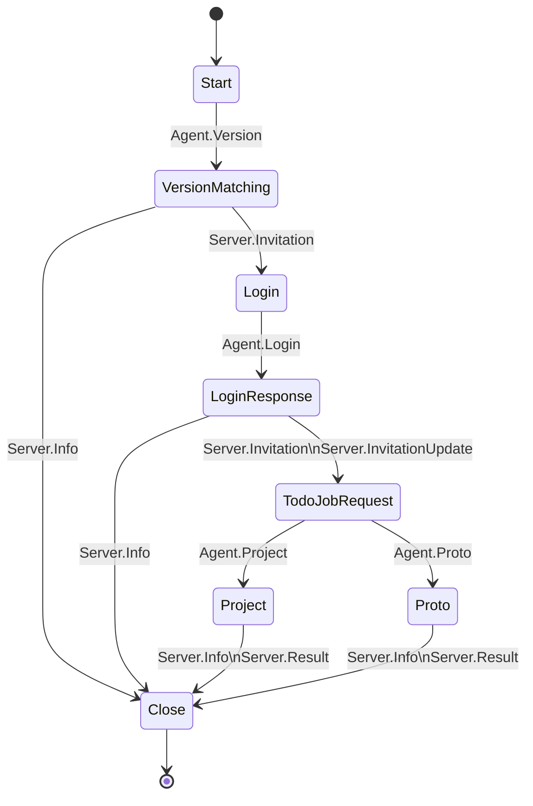

# AdHoc: Multi-Language Binary Protocol Code Generator

Performance should never be an afterthought.


When system components need to communicate efficiently across languages and platforms, manually coding serialization and deserialization becomes a
real burden - slow to write, prone to subtle bugs, and increasingly painful as the system grows, new languages are added, or data structures change.

**Domain-Specific Languages (DSLs) for protocol description** solve this by letting you declare your data structures, message types, and communication
protocols once, then automatically generate consistent, high-performance implementation code for any supported language. The benefits are concrete:

* **Reduced development time:** No manual serialization logic.
* **Fewer bugs:** Generated code is consistent across platforms, eliminating a whole class of human error.
* **Uniform implementation:** Data handling and protocol adherence are identical everywhere.
* **Easier maintenance:** Protocol changes go in one place and propagate automatically.

Many established frameworks use this approach:

- [**Swagger/OpenAPI**](https://swagger.io/docs/specification/data-models/): RESTful API definition with documentation and code generation.
- [**Protocol Buffers**](https://developers.google.com/protocol-buffers/docs/overview): Compact binary serialization with schema evolution.
- [**Cap'n Proto**](https://capnproto.org/language.html): High-performance, zero-copy serialization with RPC.
- [**FlatBuffers**](http://google.github.io/flatbuffers/flatbuffers_guide_writing_schema.html): Memory-efficient zero-copy serialization.
- [**ZCM**](https://github.com/ZeroCM/zcm/blob/master/docs/tutorial.md): Real-time, low-latency messaging for structured data.
- [**MAVLink**](https://github.com/mavlink/mavlink): Lightweight messaging for drones and robotics.
- [**Thrift**](https://thrift.apache.org/docs/idl): Cross-language serialization and RPC.
- [**Apache Avro**](https://avro.apache.org/docs/1.8.2/idl.html): Schema-based serialization for big data.

After evaluating these options, particularly for scenarios demanding maximum binary efficiency and application-specific protocol control, we developed
**AdHoc Protocol** - a next-generation code generator built for those demands.

AdHoc currently supports **C#, Java, and TypeScript**, with C++, Rust, and Go planned. It handles translation between binary data streams and
structured objects ("packs"), making high-performance cross-language communication straightforward.

## Why Choose AdHoc?

AdHoc is built for **data-oriented applications** that need high performance and efficient handling of structured binary data, whether for network
communication or custom storage formats. Unlike frameworks that require buffering entire messages in memory, **AdHoc uses a streaming architecture.**
Data is processed in small, reusable chunks, dramatically reducing memory usage and enabling efficient handling of messages of any size - including
messages larger than available RAM.

### 1. Best Fit: Data-Intensive Applications

AdHoc is well-suited for systems where data volume, speed, and efficiency matter:

- **Financial Trading:** Real-time, high-frequency market data with minimal latency.
- **CRM:** Large datasets of customer interactions and transactions.
- **ERP:** High-volume, real-time data updates in logistics, inventory, and operations.
- **Scientific & Industrial Data Acquisition:** Massive volumes of binary sensor data for factory automation and engineering analysis.
- **Game Servers:** Low-latency, real-time communication for multiplayer games.
- **IoT Systems:** High-throughput sensor data streams.
- **Real-Time Analytics:** Streaming data where processing speed is critical.
- **Streaming Media:** High-quality audio/video delivery with low latency.
- **Telecommunications:** High-volume call routing, message delivery, and network state.
- **Autonomous Vehicles:** Rapid processing of sensor and communication data.
- **Microservices:** Efficient data exchange in distributed systems.
- **Custom File Storage:** Application-specific binary formats optimized for retrieval and storage.

### 2. Performance Benefits

- **Drastically reduced memory usage:** AdHoc's streaming parser processes network data in small, reusable buffers (at least 256 bytes). Buffer
  allocation for the entire message is never required, preventing memory spikes even with very large payloads.
- **Lower GC pressure:** By avoiding large single-object allocations and reusing small buffers, AdHoc reduces garbage collector workload, leading to
  lower latency, fewer pauses, and more predictable throughput.
- **Efficient serialization/deserialization:** The streaming model transforms data on-the-fly, reducing end-to-end latency.

### 3. When to Consider Other Solutions

- **Text-based or content-oriented applications:** For blogs, CMS, or document storage where human-readable formats are acceptable, JSON or XML are
  simpler and sufficient.
- **Simple or low-performance use cases:** If data volume, speed, and resource efficiency are not priorities, standard formats are easier to implement
  and maintain.

## AdHoc Protocol Key Concepts


The **AdHoc** generator provides:

- C# as the protocol description language - familiar and well-tooled.
- Entities that can import (inherit) or subtract (remove) properties of others.
- Projects composable from other projects, or able to selectively import specific components such as **connections**, constants, or individual packs.
- **Connections** constructable from other connections or their components (states, branches).
- Packs that can import or subtract individual fields or all fields of other packs.
- A [`custom code injection point`](#custom-code-injection-point) for safely integrating custom code with generated code.
- Built-in visualization through the **AdHoc Observer**, which renders interactive diagrams of network topology, pack field layouts, and data flow
  state machines.
- Bitfield support.
- Nullable primitive data types.
- Automatic `long` primitive representation for packs whose field data fits within 8 bytes, reducing GC overhead.
- Support for strings, maps, sets, and arrays.
- Multidimensional arrays with constant, fixed, or variable dimensions.
- Nested packs and enums.
- Standard and flags-style enums.
- Fields typed as enums or pack references.
- Constants at both host and packet levels.
- Circular reference handling and multiple inheritance. Reused entities can be modified for new projects.
- Compression via [Base 128 Varint](https://developers.google.com/protocol-buffers/docs/encoding) encoding.
- Fully functional generated code ready for network infrastructure.
- **Built-in streaming parser:** Processes all incoming data in small, reusable buffers (e.g., 256 bytes). Buffer allocation for the entire object is
  never required.

The **AdHoc Code Generator** is a [**SaaS**](https://en.wikipedia.org/wiki/Software_as_a_service) platform providing cloud-based code generation.

First, you'll need a personal [UUID](#uuid). A UUID - rather than a login and password - lets you automate code generation and embed the **AdHocAgent
** utility into your delivery pipeline.

To get started:

1. Install .NET.
2. Install a **C# IDE** such as **[Intellij Rider](https://www.jetbrains.com/rider/)**, **[Visual Studio Code](https://code.visualstudio.com/)**, or *
   *[Visual Studio](https://visualstudio.microsoft.com/vs/community/)**.

---

1. Install [7-Zip](https://www.7-zip.org/download.html) for PPMd compression of source files. Download [**version 24.07 or higher
   **](https://youtu.be/i5L9xEk_adw) for your platform:
	
	- **[Windows](https://www.7-zip.org/a/7zr.exe)**  
	  Add `C:\Program Files\7-Zip` to the system `PATH` and verify `7z` works in the console.
	
	- **[Linux](https://www.7-zip.org/a/7z2201-linux-x86.tar.xz)**
	  ```shell
	  apk add p7zip
	  ```
	
	- **[macOS](https://www.7-zip.org/a/7z2107-mac.tar.xz)**
	  ```
	  brew install p7zip
	  ```

2. Download the [AdHoc protocol metadata attributes Meta.cs file](https://github.com/AdHoc-Protocol/AdHoc-protocol/blob/master/src/Meta.cs), or add a
   dependency on `AdHocAgent.dll` to your protocol project.


1. Add a reference to `Meta` in your AdHoc protocol description project.  
   
2. Compose your protocol description project.
3. Use the **[AdHocAgent](https://github.com/cheblin/AdHocAgent)** utility to upload your project to the server and retrieve the generated code.

# AdHocAgent Utility

AdHocAgent is a command-line utility that handles:

1. Uploading your task
2. Downloading generated results
3. Deploying your project
4. Visualizing your project structure as a diagram
5. Uploading `.proto` files to convert to AdHoc protocol description format
6. Storing and updating your user `UUID`

The first argument is the path to the task file. The file extension determines the task type.

---

## `.cs`

Upload the `protocol description file` to generate source code.
<details>
 <summary><span style = "font-size:30px">👉</span><b><u>Click to see</u></b></summary>


 </details>

## `.cs?`

Launches the **AdHoc Observer**, a web-based tool for visualizing, analyzing, and documenting your protocol definitions. It connects via WebSocket to
receive live protocol data and renders it as a series of interconnected diagrams.

```cmd
    AdHocAgent.exe MyProtocol.cs?
```

The Observer lets you:

* **Visualize high-level architecture:** See all hosts, the packs they handle, and the **connections** linking them in a clear, interactive graph.
* **Drill into data flow logic:** Right-click a **connection** to open a detailed pop-up view of its state machine, including all states and branching
  logic.
* **Inspect data structures:** Left-click a pack to view its fields, data types, and nested structures.
* **Annotate and document:** Double-click the background to create, edit, and save rich-text notes ("stickers") directly on the diagrams.
* **Navigate:** Use a searchable, collapsible tree view in the sidebar to find and focus on any host, pack, or **connection**.
* **Persist your workspace:** All layout customizations (node positions, pan, zoom) and annotations are automatically saved.

> **[See the full Observer User Guide](./Observer.md) for a detailed explanation of all features.**


> [!NOTE]    
> To enable navigation from the Observer to your source code, specify the path to your local C# IDE in the `AdHocAgent.toml` configuration file.

### Saving Your Workspace

The Observer automatically saves your workspace, including diagram layouts and annotations, into a dedicated folder.

* **Location:** The current working folder of AdHocAgent.
* **Manual save:** Open the sidebar and select **"Save Diagram"**.
* **Recovery:** If you accidentally close the browser without saving, the Observer creates a `current_working_folder/unsaved` folder. Move those files
  to the `current_working_folder` to recover your work.


## `.proto` or path to a folder

Converts a file or directory of [Protocol Buffers](https://developers.google.com/protocol-buffers) files to the AdHoc `protocol description` format.

<details>
 <summary><span style = "font-size:30px">👉</span><b><u>Click to see</u></b></summary>
```cmd
    AdHocAgent.exe MyProtocol.proto
```


 </details>

> [!NOTE]  
> Additional arguments can be paths to directories containing supplemental imported `.proto` files, such as
> [`well_known`](https://github.com/protocolbuffers/protobuf/tree/main/src/google/protobuf) files.
> Multiple directories are supported — for example, when imports are spread across several roots:
> ```cmd
>     AdHocAgent.exe influxdb  influxdb  google.proto
> ```
> If the last argument does not end with `.proto`, it is treated as the output destination directory rather than an import search path.

The result of `.proto` file conversion is only a starting point for migrating to AdHoc - it cannot be used as-is. Review it with the full capabilities
of AdHoc protocol in mind.

## `.json` or `.yaml`

Treats the input file as a Swagger/OpenAPI specification. An optional second argument specifies the output AdHoc protocol description `.cs` file path.
If omitted, the `.cs` file is written next to the input file. Do not expect a perfect result from this conversion; it is a starting point for
transitioning from an OpenAPI spec to AdHoc.

## `.md`

The provided path is a `deployment instruction file` for the embedded [Continuous Deployment](https://en.wikipedia.org/wiki/Continuous_deployment)
system. AdHocAgent will only repeat the deployment process for source files already received from the server. Useful for debugging deployments.

<details>
 <summary><span style = "font-size:30px">👉</span><b><u>Click to see</u></b></summary>


 </details>

> [!NOTE]  
> In addition to command-line arguments, AdHocAgent requires a configuration file:

- **`AdHocAgent.toml`:** Contains settings including:
	- The URL of the code-generating server.
	- The path to the local C# IDE binary, enabling the utility to open the IDE at a specific file and line.
	- The path to the [7-Zip](https://www.7-zip.org/download.html) binary.
		- [Windows](https://www.7-zip.org/a/7zr.exe) | [Linux](https://www.7-zip.org/a/7z2201-linux-x86.tar.xz) | [macOS](https://www.7-zip.org/a/7z2107-mac.tar.xz)
	- Paths to source code formatter binaries:
		- [clang-format](https://releases.llvm.org/download.html)
		- [prettier](https://prettier.io/docs/en/install.html) - install globally: `npm install -g prettier`
		- [astyle](https://sourceforge.net/projects/astyle/files/)

AdHocAgent searches for `AdHocAgent.toml` in its own directory. If not found, it generates a template to fill in.

## UUID

To get your first `volatile` personal [UUID](https://en.wikipedia.org/wiki/Universally_unique_identifier):

1. Sign in to **GitHub**.
2. Post a message in the [Sign-Up Discussion](https://github.com/orgs/AdHoc-Protocol/discussions/categories/sign-up).

Once your request is processed (when the post disappears), a bot creates a new **private** project for
you [here](https://github.com/orgs/AdHoc-Protocol/projects), tracking your code generation history and surfacing any issues with resolution details.

The project will contain a task with your `UUID`:  


Copy the `UUID` and run AdHocAgent once:

```shell
AdHocAgent 100b9fd2-e593-485b-a2fe-9b9c82bc1e3f
```

The utility saves the `volatile UUID` in `AdHocAgent.toml`.

> [!NOTE]  
> The UUID may be automatically renewed during new code generation requests and cannot be reused. Keep your `AdHocAgent.toml` file - it stores the
> updated UUID. If your UUID is rejected, repeat the sign-up process to get a new one.

> [!NOTE]  
> When run without arguments, AdHocAgent displays help and generates a `protocol description file` template.

## Continuous Deployment (CD) System

The embedded CD system automates deploying generated source code into your target projects. It uses a **Deployment Instructions File** (a Markdown
file) to control exactly how and where files are copied. Its key feature is **Smart Merge**, which preserves custom code inside designated injection
points, preventing your work from being overwritten during updates.

### The Deployment Workflow

1. **First run:** Run AdHocAgent. If it finds no deployment instructions file, it generates one (e.g., `AdHocProtocol.md`) and stops.
2. **Configure:** Open the `.md` file. It contains a complete tree of all source files. Add destination paths for your project folders.
3. **Redeploy:** Run AdHocAgent again. It reads your instructions and deploys the files, intelligently merging your custom code.
4. **Repeat:** After future code generation, re-run the utility. Your deployment configuration and custom code are preserved.

### The Deployment Instructions File

* **Naming:** Must match the protocol description filename with an `.md` extension (e.g., `AdHocProtocol.cs` → `AdHocProtocol.md`).
* **Location:** AdHocAgent searches first in the protocol file's directory, then the working directory.

#### Structure: The File Tree

The file contains a Markdown list representing the source directory structure:

```markdown
- 📁[InCS](/path/to/source/InCS)
	- 📁[Agent](/path/to/source/InCS/Agent)
		- ＃[Agent.cs](/path/to/source/InCS/Agent/gen/Agent.cs)
		- ＃[Channel.cs](/path/to/source/InCS/Agent/gen/Channel.cs)
```

#### Configuring Deployment Targets

Specify where files go by appending Markdown links to the end of a line: `[<regex_filter>](<destination_path>)`.

* The `regex_filter` is optional. If omitted (`[](/path)`), the rule applies to all files in scope.
* The `destination_path` is the target location on your filesystem.

##### Target Path Behavior

Behavior is determined by whether the destination path ends with `/` or `\`.

**1. Copy contents into a folder (path ends with `/` or `\`):**
Copies the *contents* of the source folder into the destination. The source folder itself is not created.

- **Folder:** `- 📁[Agent](...) [](/path/to/project/src/)`
	* Files inside `Agent` are copied directly into `/path/to/project/src/`.
- **File:** `- 🌀[demo.ts](...) [](/path/to/project/components/)`
	* The file is copied into the destination folder.

**2. Copy and rename (path does NOT end with `/` or `\`):**
Copies the source item with the exact name and location specified.

- **Folder:** `- 📁[Agent](...) [](/path/to/project/RenamedAgent)`
	* The `Agent` folder and its contents are copied to `RenamedAgent`.
- **File:** `- 🌀[demo.ts](...) [](/path/to/NewName.ts)`
	* The file is copied and renamed.

##### Inheritance and Filtering

* **Inheritance:** Rules on a parent folder are inherited by all its children.
* **Filtering:** Provide a regular expression to apply a rule only to matching files.

**Example:**
> [!TIP]
> Switch from Markdown preview to source to view detailed formatting.

```markdown
- 📁[Observer](/path/to/source/InTS/Observer)  ✅ All files go to 'src', images go to 'assets'.
  [\.(jpg|png|gif)$](/project/assets/images/)
  [](/project/src/)
	
	- 🌀[demo.ts](/path/to/source/InTS/Observer/demo.ts)  // Inherits rule → /project/src/demo.ts
	- 📁[gen](/path/to/source/InTS/Observer/gen)          // All files inside also inherit
```

##### Skipping Files and Folders

Add `⛔` to a line or use an empty target `[]()` to exclude from deployment:

```markdown
- 📁[Observer](/path/to/source/InTS/Observer) [](/path/to/project/src/)
	- 🌀[demo.ts](/path/to/source/InTS/Observer/demo.ts) ⛔ // Skipped
	- 📁[gen](/path/to/source/InTS/Observer/gen) []()        // Entire folder skipped
```

#### Advanced Processing: Execution Instructions

Run scripts or tools on source files *before* they are deployed - for formatting, linting, or other transformations. Instructions are defined in code
blocks and executed in order.

##### File Path Placeholder & Root Path

* Use the `FILE_PATH` placeholder - it is replaced with the actual file path at runtime.
* Paths starting with `/InCS/`, `/InJAVA/`, etc., are treated as relative to the source files root directory.

##### Shell Execution

```regexp
<regex_to_select_files>
```

```shell
<executable_path> <command_line_arguments_with_FILE_PATH>
```

**Example: Formatting C++, C#, and Java files with `clang-format`.**

```regexp
\.(java|cs|cpp|h)$
```

```shell
clang-format -i -style="{ColumnLimit: 120, BreakBeforeBraces: Allman}" FILE_PATH
```

##### C# Code Execution

Execute an inline C# script for more complex transformations. The file path is passed as `args[0]` to `Main`.

* **Reference assemblies:** Add assembly references in quotes at the top of the script if needed (e.g., for `System.Linq`).

**Example: Removing leading whitespace from region directives.**

```regexp
.*
```

```csharp
"System.Text.RegularExpressions"

using System;
using System.IO;
using System.Text;
using System.Text.RegularExpressions;

public class Program
{
    public static void Main(string[] args)
    {
        var filePath = args[0];
        var pattern = @"^\s+(?=//#region|#region)";
        var content = File.ReadAllText(filePath, Encoding.UTF8);
        var updatedContent = Regex.Replace(content, pattern, "", RegexOptions.Multiline);
        File.WriteAllText(filePath, updatedContent, new UTF8Encoding(false));
    }
}
```

### Preserving Custom Code: Smart Merge

Smart Merge ensures that custom logic you add to generated files is not lost on the next deployment. It acts as an intelligent intermediary between
your hand-written code and the code generator.

#### Injection Points

An **injection point** is a marked region in a generated file where you can safely add your own code. Each is identified by a **Unique ID (UID)**.

- **C#**:
  ```csharp
  #region > receiving
  // Your custom code goes here
  #endregion > ǺÿÿČ.Project.Connection receiving  // <-- DO NOT EDIT THIS UID
  ```
- **Java/TypeScript**:
  ```typescript
  //#region > receiving
  // Your custom code goes here
  //#endregion > ǺÿÿČ.Project.Connection receiving // <-- DO NOT EDIT THIS UID
  ```

> [!CAUTION]
> **Never edit, move, or duplicate the `endregion` line or its UID.** The UID is how the system locates your safe zone. Changing it causes your custom
> code to be permanently lost.

#### Generated Blocks

Inside an injection point, you may find pre-written code snippets wrapped in special tags (`//❗<` and `//❗/>`). These are **Generated Blocks**.

```csharp
#region > receiving
// Your custom code can go here.

//❗<
    // This is a generated block. Enable or disable it as needed.
//❗/>

// Your custom code can also go here.
#endregion > ǺÿÿČ.Project.Connection receiving
```

**Working with Generated Blocks:**

* ✅ **Enable/Disable:** Comment out **the entire block (including tags)** to disable; uncomment to enable.
* ✅ **Reorder:** Move an entire block (tags and all) within its injection point.
* ❌ **Do not edit** the code *inside* a generated block - changes are discarded on the next deployment.
* ❌ **Do not modify** the tags: block markers (e.g., `//❗<`).

#### Smart Update Notifications

When a new version of the protocol is deployed, the system merges your custom code with the new file. It adds `//todo 🔴` comments to flag important
generator changes for your review:

* **New active code:** A new, active generated block was added to your injection point.
  ```csharp
  //todo 🔴 New active generated code was added by the generator. Please review as it may affect your custom logic.
  //✅<
      callNewFunction();
  //✅/>
  ```
* **Removed code you used:** A generated block you had explicitly enabled was removed by the generator in this update. To prevent silent failures in
  your logic, it is commented out with a warning rather than permanently deleted. You free to review and remove it.
  ```csharp
  //todo 🔴 The following code block was removed by the code generator. Please review.
  //   callObsoleteFunction();
  ```

💡 **Best Practice for Notifications:**
It is highly recommended to investigate all `//todo 🔴` warnings immediately to understand how the protocol update affects your custom logic. Once you
have reviewed the changes and adjusted your code, **manually delete the warning lines and the obsolete commented-out blocks** to keep your codebase
clean.

**Auto-Cleanup:** If you forget to remove them, don't worry. During the *next* code refresh cycle, the AdHoc Agent will automatically and silently
clean up any lingering `//todo 🔴` warning lines. Furthermore, any generated blocks that are both disabled (commented out) and no longer exist in the
new protocol will simply disappear.

#### Orphaned Code Protection

Sometimes, sweeping changes to a protocol mean an entire **Injection Point (UID)** is removed by the generator.

If this happens, the AdHoc Agent performs a smart "Orphan Check":

1. **Content Analysis:** It strips away all generated blocks from the missing region and checks if any hand-written custom code remains.
2. **Silent Cleanup:** If the region was empty or only contained generated code, it is safely discarded.
3. **Active Intervention:** If you wrote actual custom code in that region, the deployment is immediately paused. The console will display your "
   orphaned" code and require your explicit confirmation (`y/N`) before proceeding, ensuring your work is never deleted without your knowledge.

#### Automatic Backups & Recovery

Even if you mistakenly confirm the deletion of orphaned code, or if a deployment behaves unexpectedly, your work is safe.

Before any existing file is modified, the AdHoc Agent automatically copies the original files into a versioned backup folder (e.g., `backup_name_1`).
Inside this folder, you will find ready-to-use restore scripts (`restore.bat`, `restore.ps1`, `restore.sh`) that instantly revert your project to its
exact pre-deployment state.

### Lifecycle Hooks

Run executables at the very beginning or end of the entire deployment process:

```markdown
[before deployment]("C:\Program Files\dotnet\dotnet.exe" format "/InCS/MyProject")
[after deployment](/path/to/logging_script.sh --status=success)
```

### Automated Backups and Restoration

Before overwriting any files, the system creates a backup automatically.

#### How It Works

1. **Creates a backup directory** named sequentially (e.g., `AdHocProtocol_1`, `AdHocProtocol_2`) in the same location as the deployment instructions
   file.
2. **Copies existing files** that are about to be replaced, with generic names (`original_1.cs`, `original_2.java`) to prevent conflicts.
3. **Generates restore scripts** inside the backup directory:
	* `restore.bat` (Windows Command Prompt)
	* `restore.ps1` (Windows PowerShell)
	* `restore.sh` (Linux, macOS, WSL)

> [!IMPORTANT]
> Only files being **overwritten** are backed up. New files deployed to empty locations have no original to back up.

#### How to Restore

1. Open the latest backup folder (e.g., `AdHocProtocol_5`).
2. Run the script for your OS:
	* **Windows:** Double-click `restore.bat` or right-click `restore.ps1` → "Run with PowerShell".
	* **Linux/macOS:**
	  ```shell
	  chmod +x restore.sh
	  ./restore.sh
	  ```

Running the script copies every backed-up file back to its original project location, reverting the deployment entirely.

# Overview

The simplest `protocol description file` looks like this:

```csharp
using org.unirail.Meta; // Required for AdHoc protocol generation

namespace com.my.company // Required
{
    public interface MyProject // Declares an AdHoc protocol description project
    {
        class CommonPacket{ } // A common empty packet used across different hosts

        /// <see cref="InTS"/>-   // Generates an abstract TypeScript version
        /// <see cref="InCS"/>    // Generates the concrete C# implementation
        /// <see cref="InJAVA"/>  // Generates the concrete Java implementation
        struct Server : Host
        {
            public class PacketToClient{ }
        }

        /// <see cref="InTS"/>    // Generates the concrete TypeScript implementation
        /// <see cref="InCS"/>-   // Generates an abstract C# version
        /// <see cref="InJAVA"/>  // Generates the concrete Java implementation
        struct Client : Host
        {
            public class PacketToServer{ }
        }

        interface Connection : Connects<Client, Server>{
            struct Start :
                l____________<
                   (
                    CommonPacket,
                    Client.PacketToServer
                    )
                >,
                ____________r<
                    (
                    CommonPacket,
                    Server.PacketToClient
                    )
                >{ }
        }
    }
}
```

To visualize your protocol structure, run the **AdHoc Observer** by appending `?` to your protocol file path:
`AdHocAgent.exe /dir/minimal_descr_file.cs?`.

<details>
  <summary><span style = "font-size:30px">👉</span><b><u>Click to see</u></b></summary>


</details>

To upload a file and get generated source code: `AdHocAgent.exe /dir/minimal_descr_file.cs`

# Protocol Description File Format

> [!IMPORTANT]  
> **The `protocol description file` follows a specific naming convention:**
>
> - Names must not start or end with an underscore `_`.
> - C# prohibits a class from having a field or nested class with the same name as the class itself - a `Pack` cannot have a field or nested pack
    sharing its name.
> - Names must not match keywords in any language the code generator supports. **AdHocAgent** checks for these conflicts before uploading.

## Project

The `protocol description file` is a plain C# source file within a .NET project, using C# as
a [DSL](https://en.wikipedia.org/wiki/Domain-specific_language).

To create one:

- Create a C# project.
- Add a reference to the [AdHoc protocol metadata attributes](https://github.com/cheblin/AdHoc-protocol/tree/master/src/org/unirail/AdHoc).
- Create a new C# source file.
- Declare the protocol description project as a C# `interface` within your company's namespace.

```csharp
using org.unirail.Meta; // Required

namespace com.my.company // Required
{
    public interface MyProject
    {
        // Add your protocol description here
    }
}
```

> [!Note]
> C# 10 introduced file-scoped namespaces, eliminating curly braces and reducing indentation:

```csharp
using org.unirail.Meta;

namespace com.my.company;

public interface MyProject
{
    // Add your protocol description here
}
```

AdHoc protocol descriptions cover both the data structures (packets and fields) and the complete network topology: hosts, connections, and their
logical interconnections.

<details>
 <summary><span style = "font-size:30px">👉</span><b><u>Example protocol description file:</u></b></summary>

```csharp
using org.unirail.Meta;

namespace com.my.company2
{
    /**
		<see cref = 'BackendServer.ReplyInts'                      id = '7'/>
		<see cref = 'BackendServer.ReplySet'                       id = '8'/>
		<see cref = 'FrontendServer.PackB'                         id = '6'/>
		<see cref = 'FrontendServer.QueryDatabase'                 id = '5'/>
		<see cref = 'FullFeaturedClient.FullFeaturedClientPack'    id = '4'/>
		<see cref = 'FullFeaturedClient.Login'                     id = '3'/>
		<see cref = 'Point3'                                       id = '0'/>
		<see cref = 'Root'                                         id = '1'/>
		<see cref = 'TrialClient.TrialClientPack'                  id = '2'/>
	*/
	public interface MyProject{

        public class Root/*Ā*/{ // Non-transmittable base entity
            long id;
            long hash;
            long order;
        }

        class max_1_000_chars_string{ // Non-transmittable typedef
            [D(+1_000)] string? TYPEDEF;
        }

        class Point3/*ÿ*/{
            private float          x;
            private float          y;
            private float          z;
            max_1_000_chars_string label;
        }

        ///<see cref = 'InJAVA'/>
        struct FrontendServer/*ā*/ : Host{
            public class QueryDatabase/*Ą*/ : Root{
                private string? question;
            }

            public  class PackB/*ą*/{ }
        }

        ///<see cref = 'InCS'/>
        struct BackendServer/*ÿ*/ : Host{
            public class ReplyInts/*Ć*/ : Root{
                [D(300)] int[] reply;
            }

            public class ReplySet/*ć*/ : Root{
                [D(+300)] Set<int> reply;
            }
        }

        ///<see cref = 'InTS'/>
        struct FullFeaturedClient/*Ă*/ : Host{
            public class Login/*Ă*/ : Root{
                private string? login;
                private string? password;
            }

            public class FullFeaturedClientPack/*ă*/{
                max_1_000_chars_string query;
            }
        }

        ///<see cref = 'InCS'/>
        struct TrialClient/*ă*/ : Host{
            public class TrialClientPack/*ā*/{
                max_1_000_chars_string query;
            }
        }

        ///<see cref = 'InTS'/>
        struct FreeClient/*Ā*/ : Host{ }

        interface TrialConnection/*ÿ*/ : Connects<FrontendServer, TrialClient>{
            struct Start/*ÿ*/ : l____________</*ÿ*/
                                  (Point3,
                                  Root,
                                  TrialClient.TrialClientPack)
	                              >,
	                              ____________r</*Ā*/
	                                  Point3,
	                                  TrialClient.TrialClientPack
	                              >{ }
        }

        interface MainConnection/*Ā*/ : Connects<FrontendServer, FullFeaturedClient>{
            struct Start/*Ā*/ : l____________</*ÿ*/
                                  (Point3,
                                  Root,
                                  TrialClient.TrialClientPack,
                                  FullFeaturedClient.Login,
                                  FullFeaturedClient.FullFeaturedClientPack)
                              >,
                              ____________r</*Ā*/
                                  (Point3,
                                  TrialClient.TrialClientPack,
                                  FullFeaturedClient.FullFeaturedClientPack)
                              >{ }
        }

        interface TheConnection/*ā*/ : Connects<FrontendServer, FreeClient>{
            struct Start/*ā*/ : l____________</*ÿ*/
                                  (Point3,
                                  Root)
                              >,
                              ____________r</*Ā*/
                                  Point3
                              >{ }
        }

        interface BackendConnection/*Ă*/ : Connects<FrontendServer, BackendServer>{
            struct Start/*Ă*/ : l____________</*ÿ*/
                                  (FrontendServer.QueryDatabase,
                                  Point3,
                                  FrontendServer.PackB)
                              >,
                              ____________r</*Ā*/
                                  (BackendServer.ReplyInts,
                                  BackendServer.ReplySet)
                              >{ }
        }
    }
}
```

</details>
<details>
 <summary><span style = "font-size:30px">👉</span><b><u>Viewed in the AdHocAgent observer:</u></b></summary>  


Selecting a specific connection shows the packets involved and their destinations.


</details>

After processing with AdHocAgent, the tool assigns packet ID numbers for identification and tracking.


> [!NOTE]  
> A project can function as a [set of packs](#projecthost-as-a-named-pack-set).

### Extending Other Projects

To import all components from another project, extend it as a C# interface:

```csharp
interface MyProject : OtherProjects, MoreProjects
{
}
```

> [!NOTE]  
> The order of extended interfaces determines priority for name or pack ID conflicts - earlier ones take precedence.

For example, the [`AdHocProtocol.cs`](https://github.com/AdHoc-Protocol/AdHoc-protocol/blob/main/AdHocProtocol.cs) description defines public,
external connections. Backend infrastructure on the **Server** side often requires an internal protocol for tasks like:

- Distributing workloads across nodes
- Transmitting and aggregating metrics
- Managing internal database records
- Authentication and authorization

**Options:**

1. **Create a separate `Backend` protocol description** - best when the external and internal protocols don't share packet instances.

2. **Extend the existing `AdHocProtocol` description** - use when you want both protocols integrated within a single `Server` host:
   
   ```csharp
   using org.unirail.Meta;

   namespace org.unirail
   {
       public interface AdHocProtocolWithBackend : AdHocProtocol
       {
           // Backend-specific protocol details
       }
   }
   ```

An example backend extension:

```csharp
using org.unirail.Meta;

namespace org.unirail {
    public interface AdHocProtocolWithBackend : AdHocProtocol {

        ///<see cref="InCS"/>
        struct Metrics : Host { }

        class MetricsData{
            public string UserName;
            public long LoginTime;
            public long LogoutTime;
            public long SessionDuration;
            public int LoginAttempts;
            public int FailedLoginAttempts;
            public int SuccessfulLoginAttempts;
            public string LastAccessedPage;
            public int PagesViewed;
            public string BrowserInfo;
            public string OperatingSystem;
            public bool IsSessionActive;
        }

        enum Role {
            Admin,
            User,
            Guest,
            SuperAdmin,
            Moderator
        }

        public class AuthorisationRequest  {
            public string UserName;
            public string Password;
            public string Email;
            public string IPAddress;
            public bool RememberMe;
            public string TwoFactorCode;
        }

        ///<see cref="InJAVA"/>
        struct Authorizer : Host {
            public class AuthorisationConfirmed {
                public Role Role;
                public string UserName;
                public string Email;
                public bool IsAuthenticated;
                public bool IsEmailConfirmed;
                public bool IsTwoFactorEnabled;
                public long LastLogin;
                public string ConfirmationToken;
                public long ConfirmationExpiry;
            }

            public class AuthorisationRejected {
                public string UserName;
                public string Reason;
                public long RejectionTime;
                public int FailedAttempts;
                public string IPAddress;
                public string ErrorCode;
            }
        }

        interface ConnectionToMetrics : Connects<Server, Metrics> {
            struct One : l____________<
                                MetricsData
                            > { }
        }

        interface ConnectionToAuthorizer : Connects<Server, Authorizer> {
            struct Start : l____________<
                                  AuthorisationRequest
                              >,
                              ____________r<
                              (
                              Authorizer.AuthorisationConfirmed,
                              Authorizer.AuthorisationRejected
                               )
                              > { }
        }
    }
}
```

This example introduces two new hosts (`Metrics` in C#, `Authorizer` in Java), several packs, and two connections:

* `ConnectionToMetrics` - links `Server` and `Metrics`.
* `ConnectionToAuthorizer` - links `Server` and `Authorizer`, with a request/reply pattern.

> [!IMPORTANT]
> When working with multiple protocols, you cannot combine their generated protocol-processing code in the same VM instance due to `lib` **org.unirail
** namespace clashes. Assign each project's `lib` to a distinct namespace to resolve this.

### Selective Entity Import

AdHoc provides two methods for fine-tuning imported entities: **XML documentation tags** and **generic interfaces**.

#### By XML Documentation Tags

* **Exclude (`-`)**: Prevents an entity from being imported.
* **Include (`+`)**: Imports *only* the specified entities.

To import only specific connections, enums, or constant sets:

```csharp
	/// <see cref="SomeProject.Pack"/>+
	/// <see cref="FromProjects.Connection"/>+
	interface MyProject : OtherProjects, MoreProjects
	{
	}
```

> [!NOTE]  
> Note the **plus** character after the attribute. You cannot import `State` this way.

To exclude specific entities:

```csharp
/// <see cref="MoreProjects.UnnecessaryPack"/>-
/// <see cref="OtherProjects.UnnecessaryConnection"/>-
/// <see cref="OtherProjects.UnnecessaryConnection.State"/>-
interface MyProject : OtherProjects, MoreProjects
{
}
```

> [!NOTE]  
> The **minus** character after the attribute excludes the entity.

#### By Generic Interfaces (`_<TYPES>` and `X<TYPES>`)

Use `_<TYPES>` to explicitly **add** entities and `X<TYPES>` to **remove** them from the project scope. For multiple types, use C# tuple syntax:
`_<(TYPE_A, TYPE_B)>`.

```csharp
public interface AdHocProtocol :
    OtherProject,
    _<
        (AdHocProtocol.Agent.Project.Host.Pack.Field.DataType)
    >,
    X<
        OtherProject.LegacyConnection
    >
{
}
```

**Supported operations:**

1. **`_<T>` (Add)**
	* **Connections:** Adds the connection to the project.
	* **Enums / Constant Sets:**
		* **Project level** (`interface Project : _<Enum>`): Included in **every** host in the project.
		* **Host level** (`struct Host : _<Enum>`): Included in that **specific** host regardless of field references.
	* **Hosts:** Restricted - hosts must be referenced as endpoints within a **Connection**.
	* **Packs:** Restricted - packs must be referenced within a **Branch** of a **State**.

2. **`X<T>` (Remove)**
	* **Connections:** Removes the connection.
	* **Enums / Constant Sets:** Removes from project scope.
	* **Hosts:** Removes the host *and* any Connection referencing it.
	* **Packs:** Removes the pack from the project and from every State Branch where it appears.

3. **`_<(TYPE_A, TYPE_B, ...)>`:** Use C# tuple syntax for multiple types.

> [!NOTE]  
> To import a **host**, reference it as an endpoint within a **connection**. To import a **pack**, reference it within a branch of a state.

[Learn how to modify imported packs](#modify-imported-packs).  
[Learn how to modify imported connections](#modify-imported-connections).

---

## Hosts

**Hosts** are the active participants in network communication, responsible for sending and receiving data packets across logical **Channels**
established over a **Connection**. A host is defined as a C# `struct` within a project's `interface` and must implement the `org.unirail.Meta.Host`
marker interface.

The AdHoc compiler generates host code only for the programming languages you explicitly specify, using XML documentation comments (`/// <see.../>`)
that define the target language and the desired implementation style.

### Implementation Modifiers

When specifying a target language, append a two-character modifier (e.g., `++`, `+-`) to control the generated code's behavior.

#### First Position: Parsing Strategy (`+` or `-`)

* `+` - **Full Object Deserialization (Concrete Implementation)**
	* The streaming parser reads the entire message and constructs a complete, in-memory object. All data is deserialized before your code accesses
	  it.
	* Best for most application and business logic - simple, stateful objects that can be passed to methods or stored.

* `-` - **Streaming Event-Based Parsing (Abstract Interface)**
	* Activates an event-driven parsing model. The generator creates an abstract base class you must implement. As the parser reads data from the
	  stream, it immediately calls methods on your implementation for each field encountered. **The full object is never allocated on the heap.**
	* Best for high-throughput, low-latency scenarios - network routers, data loggers, or services that must process messages larger than available
	  RAM.

#### Second Position: Hash Support (`+` or `-`)

* `+` - Generates `Equals()` and `GetHashCode()` implementations (or signatures in abstract mode). Use when storing packet objects in hash-based
  collections.
* `-` - Skips `Equals()` and `GetHashCode()`. Reduces generated code and avoids minor overhead when hash-based storage is not needed.

#### Modifier Summary Table

| Modifier | Example                | **Parsing Strategy**          | **Hash Support** |
|:--------:|:-----------------------|:------------------------------|:-----------------|
|   `++`   | `<see cref='InCS'/>++` | Full Object Deserialization   | Enabled          |
|   `+-`   | `<see cref='InCS'/>+-` | Full Object Deserialization   | Disabled         |
|   `-+`   | `<see cref='InCS'/>-+` | Streaming Event-Based Parsing | Enabled          |
|   `--`   | `<see cref='InCS'/>--` | Streaming Event-Based Parsing | Disabled         |

> **Default: `++`** - If a language tag has no modifier (e.g., `<see cref='InCS'/>`), it defaults to `++`.

---

### The Configuration Scoping System

* **No configuration, no code.** If a host has no `<see.../>` tag for a given language, no code is generated in that language.
* **Top-down and persistent.** The generator reads `<see.../>` tags top to bottom. When it encounters a language marker, that rule becomes the *
  *active rule** for that language and applies to all following entities - until another rule for the same language appears.
* **Grouped application.** When specific packs or [Pack Sets](#pack-set) are listed immediately after a language marker, that rule is **confined** to
  that group only. The previously active rule resumes afterward.

#### Recursive Scoping with the `@` Prefix

The `@` prefix acts as an **inline recursive Pack Set**. When the generator encounters `<see cref='@Target'/>` and `Target` is not a field, it *
*recursively includes all transmittable packets** found within the scope of `Target` (a Project, Host, or nested namespace/interface).

> **Note:** The container itself is excluded. Using `@` targets its children, not the container pack.

**Example:**

```csharp
/// <see cref="InTS"/>--
/// <see cref="@RootWithNestedPacks"/>
/// <see cref="InTS"/>+-
struct MonitoringObserver : Host {
    public int Channels => 256;
}
```

#### Detailed Example

```csharp
public interface MyProject
{
    interface BackendPacksThatImplementedOnServer :
        _<
           ( @Monitoring.Network,
            @Monitoring.Authorizer,
            @Monitoring.Processing)
        >{ }

    /**
    <see cref='InCS'/>+-                        // RULE 1: Default for C#, all packs in Server

    <see cref='InJAVA'/>                        // RULE 2: Confined group for Java (defaults to ++)
    <see cref='BackendPacksThatImplementedOnServer'/>
    <see cref='ToAgent.Result'/>
    <see cref='Agent.ToServer.Proto'/>
    <see cref='Agent.ToServer.Login'/>

    <see cref='InJAVA'/>--                      // RULE 3: New Java default for remaining packs
    */
    struct Server : Host { }
}
```

How the generator interprets this:

1. **Rule 1 (`InCS+-`):** `+-` applies to **every** pack in `Server` - no further C# rules override it.
2. **Rule 2 (`InJAVA`):** Defaults to `++`, but is **confined** to the four listed entities. All other Java packs are unaffected.
3. **Rule 3 (`InJAVA--`):** `--` applies to **all remaining** packs in `Server` not covered by Rule 2.

<details>
 <summary><span style = "font-size:30px">👉</span><b><u>Click to see</u></b></summary>


</details>

---

### Advanced Host Concepts

#### Modifying Imported Hosts

To alter code generation configuration for a host defined in another project, create a `struct` implementing `Modify<T>` where `T` is the imported
host, then apply configuration rules as usual:

```csharp
/**
// For the imported 'Server' host:
// 1. Start a confined group rule for Java (++).
<see cref='InJAVA'/>
// 2. Apply this rule only to 'Pack'.
<see cref='Pack'/>
// 3. Set the new Java default for all other packs to be abstract interfaces (--).
<see cref='InJAVA'/>--
*/
struct ModifyServer : Modify<Server> { }
```

#### Host as a Named Pack Set

A `Host` definition also implicitly acts as a named [Pack Set](#pack-set), allowing you to reference all packets defined directly within that host's
scope by its name.


Here is the rewritten chapter for the AdHoc protocol concept. The obsolete `WithCommentTags` has been removed, and the documentation has been restructured to teach the new generic `<SCOPE>` filtering architecture, progressing from basic grouping to advanced composition.

---

### Pack Set

A Pack Set groups related packet types under a single unit, simplifying rule application and improving reusability. Pack Sets are the primary mechanism for defining the target group of packets for a protocol rule or operation (such as `l__________<...>`).

#### In-Place Pack Sets

The `org.unirail.Meta._<>` interface creates an ad-hoc Pack Set for flexible, inline grouping. You can group multiple items using tuple syntax `(...)`. Conversely, use `org.unirail.Meta.X<>` to explicitly exclude specific entities from a Pack Set.

```csharp
interface Info_Result :
    _<
        (
            Server.Info,
            Server.Result,
            X<Server.Result.Deprecated> // Exclude a specific packet
        )
    > {}
```

#### Project, Host, or Pack Scopes

Instead of listing individual packets manually, a `Project`, `Host`, or `Pack` can be used as a source scope to automatically include transmittable packets defined within them.

```csharp
interface ServerData :
    _<
        (
            Server.Info,
            Project,  // All transmittable packets directly in Project scope
            Host      // All transmittable packets directly in Host scope
        )
    > {}
```

#### Recursive Scopes (`@`)

To include all transmittable packets recursively (including all nested structures inside a container), prefix the reference with `@`.

> **Important:** The `@` prefix extracts all the contents, but excludes the container itself from the set.

```csharp
interface AllTelemetry :
    _<
        (
            @Project,           // Recursively includes all transmittable packets in Project
            @Host.ExternalLib,  // Recursively includes packets from a specific host library
            X< @ToDelete >      // Recursively exclude everything inside the ToDelete container
        )
    > {}
```

---

#### Filtering Rules

You can refine any scope using `[Keep...]` or `[Skip...]` attributes from `org.unirail.Meta`. These filter a scope using regular expressions matched against either the full pack type name or the documentation comment.

*   **Keep attributes (Additive OR):** If any `[Keep...]` attributes are present, a packet is retained only if it matches at least one pattern. If no `[Keep...]` attributes exist, all packets in the scope are candidates.
*   **Skip attributes (Subtractive OR):** A packet is immediately removed if it matches any provided pattern.

##### By Name Filtering (`[KeepName]` & `[SkipName]`)
Filters packets based on their full type names (namespace + name). This is excellent for protocol versioning or strict namespace targeting.

```csharp
[KeepName(@"\.V1\.")]
// Keeps only packets containing ".V1." in their path

[SkipName(@"Test")]
// Removes any packet with "Test" in its name
```

##### By Documentation Filtering (`[KeepDoc]` & `[SkipDoc]`)
Filters packets based on their documentation comments. Because the generator scans raw UTF-8 documentation text, this enables powerful visual tagging using emojis or short keywords directly in your packet definitions.

```csharp
/// 🔒 User credentials.
class Credentials (...)

/// 📈 Server performance metrics.
class CpuStats (...)

/// ⛔ Legacy payload.
class V1Payload (...)

// Filters:
[KeepDoc(@"📈")]      // Keeps CpuStats[SkipDoc(@"⛔|🙈")]   // Skips V1Payload
[KeepDoc(@"🚨Fatal")] // Keeps urgent alerts
```

---

##### Two Filtering Paradigms

AdHoc offers two ways to apply these filters: **Filter Templates** (separated generic scopes) for maximum reusability, and **Named Pack Sets** (bound inline scopes) for specific, pre-packaged aliases.

###### 1. Filter Templates (Generic Scopes)
By utilizing C#'s generic type syntax (`<SCOPE>`), you can separate the filtering logic from the data source. A Filter Template defines *how* to filter, and you provide *what* to filter by passing a scope on the fly.

This functional style is perfect for enforcing global standards across a massive project.

```csharp
// 1. Define reusable filtering logic once[SkipDoc(@"⛔|Deprecated")]
interface ActiveOnly<SCOPE> {}

[KeepName(@"\.Telemetry\.")]
interface OnlyTelemetry<SCOPE> {}

// 2. Apply filters to specific scopes dynamically
interface GuestConnection : Connects<Server, Client> {
    interface StreamingActor : Actor {
        // Applies the ActiveOnly filter to the entire Project recursively
        interface ActiveState : l__________< ActiveOnly<@Project> > {}
    }
}
```

###### 2. Named Pack Sets (Bound Scopes)
When a specific filtered subset represents a distinct, reusable protocol concept that doesn't need to be applied generically to other scopes, you can combine the filters and the scope into a single declaration using inheritance.

The attributes apply directly to the base interfaces (`_<...>` and `X<...>`).

```csharp
// The filter and scope are bound together. 
// Just use the name 'ImplementOnObserver' later.
[KeepName(@"\.Sessions\.")]
interface ImplementOnObserver : _<@Monitoring>, X<All_Lists_on_Observer_are_virtual> { }

interface ObserverState : l__________< ImplementOnObserver > {}
```

---

##### Advanced Composition & Use Cases

Because filters, scopes, and sets are all evaluated as interfaces under the hood, they can be mixed and combined in highly expressive ways using native C# syntax.

###### Multi-Scope Union
You can pass multiple distinct scopes into a filter using tuple syntax. The generator merges them first, then applies the filter to the combined set.

```csharp
[KeepDoc(@"👁️Public")]
interface PublicView<SCOPE> {}

// Take packets from both local Project and Monitoring, then apply the filter
interface Feed : l__________< PublicView< (@Project, @Monitoring.Session) > > {}
```

###### Filter Composition (Intersection / AND)
A filtered set can be used as the `<SCOPE>` for another filter, creating an elegant functional pipeline. Because each filter sequentially narrows down the set, nesting them creates a logical intersection (AND). It reads from the inside out:

```csharp
// Example 1: Pipeline filtering
// 1. Take everything in @Project
// 2. Remove anything with ⛔ (ActiveOnly)
// 3. Keep only packets with ".Telemetry." in their name (OnlyTelemetry)
interface TelemetryStream : l__________< 
    OnlyTelemetry< ActiveOnly<@Project> > 
> {}

// Example 2: Composing Role Views
// 1. Take all packets recursively in Monitoring.Sessions
// 2. Keep only packets matching the AdminView rules
// 3. From those, keep only packets that ALSO match the PublicView rules
// Result: Strictly packets that satisfy BOTH Admin and Public requirements.
interface SharedSessionStream : l__________<
    PublicView< AdminView<@Monitoring.Sessions> >
> {}
```

###### Set Arithmetic & Mixed Paradigms
Combine Generic Filters, Named Pack Sets, In-Place Sets (`_<...>`), and Exclusions (`X<...>`) to achieve exact protocol definitions.

```csharp
[KeepDoc(@"🚨")]
interface CriticalAlerts<SCOPE> {}

// A state that combines generic templates and bound pack sets
interface AdminDashboardState : l__________<
    _<
        (
            ImplementOnObserver,                   // The Bound Named Pack Set defined earlier
            CriticalAlerts<@Host.ExternalLib>,     // PLUS all 🚨 packets from external host
            X< ActiveOnly<@Project.Legacy> >       // EXCEPT active packets from the legacy folder
        )
    >
> {}
```

###### Use Case: Role-Based Access Control (RBAC)
Filter templates make it effortless to define exactly what packets different client permission levels are allowed to see, all driven by emojis or tags in your packet documentation.

```csharp
[KeepDoc(@"👁️Public")] interface PublicView<SCOPE> {}
[KeepDoc(@"🛡️Admin")]  interface AdminView<SCOPE> {}

// Guest connection only gets Public packets
interface GuestStream : l__________< PublicView<@Project> > {}

// Admin gets both Public and Admin packets using a Union (OR)
interface AdminStream : l__________< (PublicView<@Project>, AdminView<@Project>) > {}
```

## Empty Packs, Constants, Enums

### Empty Packs

A **transmittable** (referenced in a connection) C# class-based pack with no instance fields - only [constants](#constants) or nested pack
declarations. Implemented as singletons, it is the most efficient way to signal simple events or states over a connection.

> [!NOTE]  
> If an empty pack's sole purpose is to define hierarchy structure and should not be transmitted, switch to a C#
> struct-based [Constants Container](#constant-container), which is non-transmittable.

### Constants Container

A **non-transmittable** C# struct-based pack that may contain [constants](#constants) or nested pack declarations. Instance fields are not allowed.
Used to define hierarchy structure and deliver metadata to generated code. Can be declared anywhere within your project.

<details>
 <summary><span style = "font-size:30px">👉</span><b><u>Click to see</u></b></summary>

```csharp
using System;
using org.unirail.Meta;

namespace com.my.company
{
    public interface MyProject2
    {
        [Flags]
        enum GIMBAL_DEVICE_FLAGS
        {
            GIMBAL_DEVICE_FLAGS_RETRACT    = 1,
            GIMBAL_DEVICE_FLAGS_NEUTRAL    = 2,
            GIMBAL_DEVICE_FLAGS_ROLL_LOCK  = 4,
            GIMBAL_DEVICE_FLAGS_PITCH_LOCK = 8,
            GIMBAL_DEVICE_FLAGS_YAW_LOCK   = 16,
        }

        ///<see cref = 'InJAVA'/>
        struct Server : Host
        {
            public enum MAV_BATTERY_FUNCTION : byte
            {
                MAV_BATTERY_FUNCTION_UNKNOWN,
                MAV_BATTERY_FUNCTION_ALL,
                MAV_BATTERY_FUNCTION_PROPULSION,
                MAV_BATTERY_FUNCTION_AVIONICS,
                MAV_BATTERY_TYPE_PAYLOAD,
            }

            class ServerPack { }
        }

        ///<see cref = 'InTS'/>
        struct Client : Host
        {
            class Login
            {
                string user;
                string password;
                [D(DST_CONST_FIELD)] Binary[,]  hash;

                static int      USE_ANY_FUNCTION = (int)Math.Sin(34) * 4 + 2;
                static string[] STRINGS          = { "", "\0", "ere::22r" + "K\nK\n\"KK", STR };

                [ValueFor(DST_CONST_FIELD)]
                private static int SRC_STATIC_FIELD = 45 * (int)Server.MAV_BATTERY_FUNCTION.MAV_BATTERY_FUNCTION_ALL + 45 >> 2 + USE_ANY_FUNCTION;
                const string STR = "KKKK";

                const int DST_CONST_FIELD = 0;
            }
        }

        struct SI_Unit
        {
            struct time
            {
                const string s   = "s";
                const string ds  = "ds";
                const string cs  = "cs";
                const string ms  = "ms";
                const string us  = "us";
                const string Hz  = "Hz";
                const string MHz = "MHz";
            }

            struct distance
            {
                const string km    = "km";
                const string dam   = "dam";
                const string m     = "m";
                const string m_s   = "m/s";
                const string m_s_s = "m/s/s";
                const string m_s_5 = "m/s*5";
                const string dm    = "dm";
                const string dm_s  = "dm/s";
                const string cm    = "cm";
                const string cm_2  = "cm^2";
                const string cm_s  = "cm/s";
                const string mm    = "mm";
                const string mm_s  = "mm/s";
                const string mm_h  = "mm/h";
            }
        }

        interface MainConnection : Connects<Server, Client> { }
    }
}
```

</details>

#### Distribution Over Hosts

By default, a Constants Container is included in the host where it is declared. Override this with `_<T>`:

* **Project level** (`interface Project : _<EnumOrConst>`): Included in **every** host in the project.
* **Host level** (`struct Host : _<EnumOrConst>`): Included in that **specific** host.

---

### Enums

Enums organize sets of constants of the same primitive type:

- Use `[Flags]` to indicate a bit field or set of flags.
- Manual value assignment is optional. Fields without explicit values are automatically assigned integers; with `[Flags]`, each field gets a unique
  power of two.

> [!NOTE]
> Enums and all constants are replicated on every host and are not transmitted. They serve as local copies available within each host's scope.

#### Distribution Over Hosts

An Enum is included in a generated Host only if:

1. It is declared within that Host's body.
2. It is referenced by a field in a pack transmitted by that Host.

Override this with `_<T>` at project or host level (same as Constants Containers above).

### Modifying Enums and Constants

Enums and constants can be modified like a [simple pack](#modify-imported-packs), but the modifier is discarded after the modification is applied.

---

## Packs

Packs are the smallest units of transmittable information, defined as C# `class` declarations. They can be nested and placed anywhere within a
project's scope.

Instance **fields** represent the data transmitted. A pack may also contain [constants](#constants) or nested pack declarations.

> [!NOTE]  
> A pack can act as a [set of packs](#projecthost-as-a-named-pack-set) - keep this in mind when organizing the pack hierarchy.

### Inheritance

AdHoc Packs use a **hybrid composition model** for constructing complex data structures by mixing fields from various sources (Mixins) or inheriting
them (OOP).

**The core principle: name occupation.** The generator builds the final field list by checking sources in strict order. Once a field name is "
occupied," any subsequent attempt to add a field with the same name is skipped.

**Resolution hierarchy:**

1. **Native fields** (highest priority) - fields written explicitly in the class body always win.
2. **XML documentation includes** (`<see .../>+`) - processed top-to-bottom; first occurrence wins.
3. **Inheritance** (`base` / `_<...>`) - base class fields are added last; already-occupied names are skipped.

---

**XML-Driven Composition (Mixins)**

Use XML documentation to inject or remove fields before the generator resolves inheritance.

| Operator | Action  | Description                                                                        |
|:--------:|:--------|:-----------------------------------------------------------------------------------|
| **`+`**  | Include | Imports fields from the target if the name is not yet taken.                       |
| **`-`**  | Exclude | Pre-emptively blocks a field name, preventing it from being imported or inherited. |

Because fields are imported via **symbolic XML references**, the pack creates a **live link** to the original definition - not a static copy.

**Single Source of Truth (SSOT):** The source class is the only place definitions exist. Update Packs are projections of that model. Rename a field in
the source via IDE refactoring and the XML tag updates automatically. Change a field's type and all referencing Packs adopt the new type.

**Example**

```csharp
class Player {
    /// <summary>Unique ID</summary>
    public int id;
    
    /// <summary>Current game score</summary>
    public int score;

    // 📉 The Update Pack: Defines a packet { int id; int score; }
    /// <see cref="Player.id"/>+
    /// <see cref="Player.score"/>+
    class Update_score { }
}
```

After renaming `score` → `experience` and changing its type to `long`:

```csharp
class Player {
    public int id;
    
    // ✏️ CHANGE: Renamed 'score' -> 'experience' and changed type 'int' -> 'long'
    public long experience;

    // ✅ MIRACLE: This pack is ALREADY fixed.
    // The IDE automatically updated the XML reference during the rename.
    // The Generator automatically pulls the new 'long' type.
    
    /// <see cref="Player.id"/>+
    /// <see cref="Player.experience"/>+   // Updated automatically by IDE
    class Update_score { }
}
```

The `Update_score` pack is now generated as `{ int id; long experience; }` with no manual intervention.

---

**Overriding Fields**

To override an inherited field, use the **"Exclude-then-Add"** pattern:

```csharp
/// <see cref="Header"/>+
/// <see cref="Header.id"/>-       // Block 'id' from being imported
/// <see cref="ExtendedHeader.id"/>+ // Import 'id' from new source
class MyPacket { ... }
```

---

**C# Inheritance Support**

Single inheritance:

```csharp
class MyPack : BasePack { ... }
```

Multiple inheritance via `_<TYPES>`:

```csharp
class MyPack : Base, _<(BaseA, BaseB, BaseC)> { ... }
```

If multiple base classes define the same field name, the leftmost source wins.

---

**Comprehensive example:**

```csharp
using org.unirail.Meta;

namespace com.my.project
{
    class CommonHeader
    {
        public int id;
        public int version;
        public string debug_tag;
    }

    class SessionInfo
    {
        public string token;
        public long expires;
    }

    // CASE 1: NATIVE PRIORITY
    /// <see cref="CommonHeader"/>+
    struct CustomHeader
    {
        // Native 'version' takes priority; CommonHeader.version is skipped.
        public string version;
    }

    // CASE 2: FILTERING
    /// <see cref="CommonHeader"/>+
    /// <see cref="CommonHeader.debug_tag"/>-
    /// <see cref="SessionInfo"/>+
    struct LoginPacket { }

    // CASE 3: EXPLICIT OVERRIDE
    /// <see cref="CommonHeader"/>+
    /// <see cref="CommonHeader.id"/>-  // Block 'int id' from CommonHeader
    struct BigIdPacket
    {
        public long id; // Native 'long id' fills the slot
    }
}
```

### Field Injection

The `FieldsInjectInto` interface defines a "template" class whose fields are automatically injected into the payload of other packets. The template
class itself is not preserved as a packet.

`FieldsInjectInto< PackSet >` injects fields only into transmittable packets within the specified [`PackSet`](#projecthost-as-a-named-pack-set).

**Example:**

```csharp
class CommonFields : FieldsInjectInto< _<(MyProject, X<Point2d>)> > {
    string name;
    int length;
}

class Point2d {
    float X;
    float Y;
}

class Point3d {
    float X;
    float Y;
    float Z;
}
```

**Result:**

```csharp
// Point2d: unchanged (excluded)
// Point3d: injected fields prepended
class Point3d {
    string name;
    int length;
    float X;
    float Y;
    float Z;
}
```

> [!NOTE]  
> If a target packet already has a field with the same name as an injected field, the injector's definition (type, attributes, documentation) takes
> precedence.

---

#### Modifying Imported Field Injection

Target a specific `TargetFieldInjection` using `org.unirail.Meta.Modify<TargetFieldInjection>` and specify a **PackSet** to add or remove fields:

```csharp
class FieldInjectionModifier : Modify<TargetFieldInjection>, _<(AddPack, X<RemovePack>)>  {
    string name;
    int length;
}
```

---

### Pack Headers

A **packet header** contains protocol-level metadata that is strictly segregated from the application payload. These fields handle essential network
tasks such as routing, stream sequence management, actor identification, and session control.

Under the hood, the AdHoc compiler treats headers as injected, artificial fields (e.g., `_header0`) that are prepended to the packet during
transmission but do not pollute your application-level data models.

#### Key Characteristics & Strict Constraints

The protocol parser enforces highly rigid rules for header definitions to ensure fast, deterministic parsing at the network edge:

- **Transmission Order**
  Headers are transmitted and parsed **after** the pack identifier but **before** the main payload. They are immediately accessible to network event
  handlers before the full payload is deserialized.
- **Standalone Packets Only**
  Headers are attached **only** to explicitly transmittable packets (root packets sent via Connection FSM branches).
  *If a packet is embedded as a field inside another packet (a Sub-packet), its header is completely stripped and ignored.*
- **Strict Data Type Limitations**
  Because headers must be parsed blindly at the transport layer, they are heavily restricted:
	- Must use **single, primitive, non-nullable** types (`bool`, `int`, `long`, `double`, `float`, `short`, `byte`, `ulong`, etc.).
	- **NO** Nullables (`int?`).
	- **NO** Arrays, Maps, Sets, or Strings (`string`, `byte[]`).
	- **NO** VarInt Compression. You cannot use `[V]`, `[A]`, or `[X]` attributes on header fields. They must have fixed wire sizes.
- **Automatic Conflict Resolution**
  If a header field shares a name with a payload field (or a field in another header), the compiler will automatically rename it (appending `_1`,
  `_2`, etc.) and issue a compilation warning to prevent data loss.

#### Contextual Scope & Declaration

Headers are defined by creating a class that implements `HeaderFor<PackSet>`. Where you declare this class dictates its scope. In fact, `HeaderFor` is
the **only** pack type allowed to be declared directly inside a `Connection` interface.

1. **Project Scope (Global):** Declared at the root level. Applies to the targeted packs everywhere in the project.
2. **Host Scope:** Declared inside a `Host` struct. Applies to the targeted packs only when transmitted or received by that specific Host.
3. **Connection Scope:** Declared inside a `Connects<A, B>` interface. Applies to the targeted packs only when transmitted over this specific
   connection.

**Example Usage:**

```csharp
// 1. Project-scope header: Applies globally to Point2d
class SessionHeader : HeaderFor<Point2d> {
    int plain_id;
    int session;
}

// Packet payload definitions
class Point2d { float X; float Y; }
class Point3d { float X; float Y; float Z; }

// 2. Host-specific scope
struct NodeB : Host {
    // Overlays a WorldHeader onto both Point3d and Point2d, 
    // but ONLY when NodeB is involved.
    class WorldHeader : HeaderFor<(Point3d, Point2d)> {
        int world_id;
        long timestamp;
    }
}

// 3. Connection-specific scope
interface CommunicationConnection : Connects<NodeA, NodeB> {
    // NOTE: Normal packs cannot be declared here. Only Headers and Modifiers!
    class CoordinationHeader : HeaderFor<TeamCoordination> {
        uint sequence_num;
        ushort priority;
    }
    
    // ... Actors and States ...
}
```

**Resulting On-the-Wire Structure**

**`Point3d` Packet (Sent from `NodeB`)**:
Applies the *Host-Specific* header.

```text
[-- HEADER --]
  pack_id     (Implicit)
  channel_id  (Conditional: if MultiChannelHost is used)
  world_id    (Host-Specific: from WorldHeader)
  timestamp   (Host-Specific: from WorldHeader)
[-- PAYLOAD --]
  X, Y, Z
```

**`TeamCoordination` Packet (if send via `CommunicationConnection`)**:
Applies the *Connection-Specific* header.

```text
[-- HEADER --]
  pack_id        (Implicit)
  channel_id     (Conditional: if MultiChannelHost is used)
  sequence_num   (Connection-Specific: from CoordinationHeader)
  priority       (Connection-Specific: from CoordinationHeader)
[-- PAYLOAD --]
  ... (TeamCoordination fields)
```

The protocol allows you to mutate imported or existing headers without rewriting them. By implementing `Modify<TargetHeader>`, you can inject new
fields into an existing header, overwrite existing fields, or change which packets the header applies to.

**Modifier Capabilities:**

1. **Field Injection/Override:** Any field declared in the modifier will be injected into the target header. If a field with the same name already
   exists in the target header, the modifier **overwrites** it.
2. **Target Pack Expansion:** By inheriting from packs or pack sets, you add them to the header's target list.
3. **Target Pack Reduction:** By inheriting from `X<PackToSkip>`, you explicitly remove a packet from the header's target list.

**Modifier Example:**

```csharp
// We want to modify the globally defined 'SessionHeader'
// 1. We add 'Point3d' to the packets that get this header.
// 2. We remove 'Point2d' from getting this header (using the X<> exclusion modifier).
class SessionHeaderModifier : Modify<SessionHeader>, Point3d, X<Point2d> {
    
    // This field is injected into SessionHeader
    long routing_hash; 
    
    // If SessionHeader already had a 'session' field, this overrides it
    uint session; 
}
```

---

### Value Pack

A **Value Pack** packs multiple fields into a single primitive type of up to 8 bytes.

**Key features:**

- **Zero heap allocation:** Stored as value types, avoiding GC overhead.
- **Compact memory layout:** Fields packed into eight bytes or fewer.
- **Type safety:** Full compile-time validation. Fields must be primitive numeric types or other Value Packs.
- **Automatic implementation:** The generator produces optimized packing/unpacking code.

```csharp
// 6 bytes total, packed into an 8-byte primitive (long)
class PositionPack {
    float x;     // 4 bytes
    byte layer;  // 1 byte
    byte flags;  // 1 byte
}
```

#### Smart Flattening

Nested single-field Value Packs are automatically flattened:

```csharp
class Temperature { float celsius; }
class SensorReading { Temperature measurement; }
// Result: class SensorReading { float measurement; }
```

Nullability is preserved through the chain:

```csharp
class Pressure { float kilopascals; }
class PressureSensor { Pressure? reading; }
// Result: class PressureSensor { float? reading; }
```

Deep chains are also flattened:

```csharp
class Voltage { float volts; }
class PowerLevel { Voltage? level; }
class DeviceStatus { PowerLevel? power; }
// Result: class DeviceStatus { float? power; }
```

The following fields all result in the same underlying type - `Set<float?>`:

```csharp
Set<FloatWrapper?>          set_a;
Set<FloatWrapperNullable>   set_b;
Set<FloatWrapperNullable?>  set_c;
```

### Modifying Imported Packs

Create a new pack implementing `org.unirail.Meta.Modify<TargetPack>` to merge fields into the target. Use XML comments to add or remove specific
fields:

```csharp
/// <see cref="Agent.Proto.proto"/>+   // Add field to target
/// <see cref="Agent.Login.uid"/>-     // Remove field from target
class Pack : Modify<TargetPack> {
    public string UserName;
    public long LoginTime;
}
```

> [!NOTE]  
> A modifier pack can function as a normal pack.

---

# Connections

A **Connection** is the static definition of a remoting link — the typed pipe through which all protocol logic flows between two hosts. Every
message, every state transition, every RPC call is declared inside a Connection.

Connections are declared as C# interfaces that extend `org.unirail.Meta.Connects< HostLeft, HostRight >`:

```csharp
using org.unirail.Meta;

namespace com.company {
    public interface MyProject {
        interface Communication : Connects<Client, Server> { }
    }
}
```

> [!IMPORTANT]
> **[Data is represented on the wire in little-endian format.](https://news.ycombinator.com/item?id=25611514)**

---

The body of a Connection interface is where you define its **protocol flow**: the logical sequence of messages, the ordering of packets, and the
valid response patterns. You do this by declaring [`Actors`](#actors), [`States`](#states), and [`Branches`](#branches).

Together, these constructs define a **Finite State Machine (FSM)** for each participating actor. The FSM tracks which `State` the communication is
currently in, which in turn determines which messages are valid to send or receive at that moment.

---

## Importing and Composing Connections

Connections can be based on other connections. Use standard C# interface inheritance, and use `SwapHosts<Connection>` to reverse the host roles
of imported content:

```csharp
interface CommunicationConnection : Connects<Server, Client>,
                                    SomeOtherConnection,
                                    SwapHosts<TheConnection> { }
```

---

## Actors

An **Actor** is the unit of concurrent, stateful behavior inside a Connection. Each Actor owns an independent FSM — an isolated logical thread of
conversation between two hosts.

1. **Exactly One Linked Chain:** An Actor may contain only **one** sequence of states connected by transitional branches (`L____________` or
   `____________R`).
   This represents the Actor’s "Main Thread" or synchronized FSM.
2. **Unlimited Isolated States:** An Actor may contain **any number** of isolated states. These states use **non-transitional** branches (
   `l____________`,   `____________r`, or `_____lr_____`) that **do not change the Actor's state**. Isolated states use the Actor scope as
   a **logical grouping unit**.
   Related fire-and-forget notifications or status updates that don't drive a workflow are grouped into the same Actor to keep the API organized.

### The Default Actor (Actor0)

Every connection interface contains one implicit, connection-wide actor known as **Actor0**. This is the "Primary Pipe." You do not need to declare
it; it
is always there to handle connection logic, discovery, or fire-and-forget notifications.

The connection body itself acts as the declaration scope for Actor0. How Actor0 is populated depends on how you use the interface body:

| Declaration Style    | Resulting Structure                          |
|:---------------------|:---------------------------------------------|
| ** `struct` States** | Actor0 uses these states as its primary FSM. |
| ** RPC Methods**     | These methods are Actors nested into Actor0. |

If `Actor0` FSM contains multiply states, this actor restricted to only one instance.   
Actors declared in the Connection body create own hierarchy and never nested into Actor0.

---

### Singleton Actor

| Property      | Description                                                                                                                                                                                                                                                           |
|:--------------|:----------------------------------------------------------------------------------------------------------------------------------------------------------------------------------------------------------------------------------------------------------------------|
| **Identity**  | Bound to the **Type** — fixed, predefined address                                                                                                                                                                                                                     |
| **Lifecycle** | Permanent; always available on both hosts                                                                                                                                                                                                                             |
| **FSM**       | Isolated, non-linked states; uses **non-transitional branches** exclusively (`l____________`, `____________r`, or `_____lr_____`). Because there are no transitions, neither host acts as "Main" — **both sides are equal**. Each state acts as a logical aggregator. |
| **Memory**    | Zero — no instance is ever created                                                                                                                                                                                                                                    |

Singleton actors are the workhorse of **fire-and-forget** messaging. Because they have no linked state transitions, no session needs to be tracked,
and no actor instance is ever allocated. A group of related fire-and-forget functions is simply a host-wide global singleton with multiple independent
non-transitional branches.

---

### RPC Actor — Transient / Asymmetric

| Property      | Description                                                          |
|:--------------|:---------------------------------------------------------------------|
| **Identity**  | Bound to a **Dynamic Address** (the callback address)                |
| **Lifecycle** | Created on call; destroyed on reply                                  |
| **Memory**    | Initiator-only: **only the caller** allocates a small context object |

All C# method-based declarations and simple request-response flow Actors. The design and implementation is intentionally asymmetric:

- **The Initiator (Stateful):** Spawns a local actor instance to hold the callback context. It waits in the `Return` state to ensure the returning
  packet is valid and directed to the right logic.
- **The Replier (Stateless):** Receives the request, processes it, and sends the reply to the dynamic address. **The replier never allocates an actor
  instance.**

---

### Stateful Actor — Synchronized / 1-to-1

A Stateful Actor owns a **single chain of linked states** — at least one state in the chain must contain a **transitional branch** (`L____________` or
`____________R`) that advances the FSM to another user-defined state.

| Property            | Description                                                     |
|:--------------------|:----------------------------------------------------------------|
| **Identity**        | Bound to **Type + Instance** — unique dynamic address per pair  |
| **Lifecycle**       | Managed via `End` or `Close` terminal states                    |
| **Synchronization** | A shared "Epoch" (logical clock) increments on every transition |

When the initiator creates an actor instance, a peer instance is automatically created on the other host - both sides allocate a real, stateful
object. The two instances are permanently bound by sharing the same dynamic address, so every message travels directly between these exact
counterparts. Both run identical replicas of the shared FSM - the single source of truth.

Within the state chain, the presence of a transitional branch assigns the **Main** role to that host, granting it sole authority to advance the state,
while the opposite host acts as the **Follower** (limited to executing non-transitional branches within that state). This asymmetric authority
prevents race conditions; stale messages carrying an outdated Epoch are silently dropped.

Use Stateful Actors for complex, multistep workflows: handshakes, file streaming, collaborative editing.

---

### Declaring Actors

#### Fire-and-Forget

A fire-and-forget operation is a one-way notification: one host sends a packet, no response is expected, and the FSM remains in its current state.
These are declared with states using **non-transitional branches**:

- `l____________` - Left host initiates (send)
- `____________r` - Right host initiates
- `_____lr_____` - Either side may call function (send function argument pack)

Each isolated state acts as a named function group: a logical aggregator of related fire-and-forget operations.

**Example: Left initiates, overloads**

*Traditional C# equivalent:*

```csharp
void LogEvent();
void LogEvent(StringMessage msg);
void LogEvent(WarningEvent ev);
void LogEvent(ErrorEvent ev);
```

The overloads are collapsed into a single FSM state using a tuple.

*AdHoc FSM declaration:*

```csharp
interface ClientServerConnection : Connects<Client, Server>{
	interface LogEventActor : Actor {
	    struct LogEvent : l____________<(NoArg, StringMessage, WarningEvent, ErrorEvent)> { }
	}
}
```

**No-Argument Overloads**

The packet system requires every branch to carry a concrete type — there is no native "void argument." To declare a function that takes no argument,
create a reusable empty sentinel class **once** per project:

```csharp
class NoArg { }
```

Reuse it anywhere a no-argument overload is needed.

**Example: Grouping related fire-and-forget functions**

Related fire-and-forget functions can be grouped as multiple states under a single actor. This is the preferred compact form — each state is a named,
always-available function group.

*Traditional C# equivalent:*

```csharp
void LogEvent((StringMessage, WarningEvent, ErrorEvent) msg);
void UpdateStatus(StatusPayload status);
```

*AdHoc FSM declaration:*

```csharp
interface ClientServerConnection : Connects<Client, Server>{
	interface MyFunctions : Actor {
	    struct LogEvent     : l____________<(StringMessage, WarningEvent, ErrorEvent)> { }
	    struct UpdateStatus : l____________<(StatusPayload, OR_PartialStatus)> { }
	}
}
```

Because there are no transitions, the actor is automatically a host-wide global singleton. No `MaxActiveInstances` declaration is needed.

---

#### Unidirectional Request-Response (RPC)

One host initiates a call and expects a result from the other. The direction marker placed **inside the return tuple** names the host that **sends the
request**. The opposite host always sends the reply.

> [!NOTE]
> Unlike fire-and-forget, a request-response actor requires two states (`Call` → `Return`) and must transition to `End` to destroy the actor after
> completion.

**Example: Simple call, single argument, single return type**

*Traditional C# equivalent:*

```csharp
UserProfile GetUser(UserId id);
```

*AdHoc FSM declaration (Left initiates):*

```csharp
interface ClientServerConnection : Connects<Client, Server> {
        (l____________, UserProfile) GetUser(UserId id);
}
```

**Example: Multiple argument overloads, multiple return types including errors**

*Traditional C# equivalent:*

```csharp
FileData FetchFile(FileName name);
OR_NotFound FetchFile(FileId id);
```

*AdHoc FSM declaration:*

```csharp
interface ClientServerConnection : Connects<Client, Server> {
	(l____________, FileData, OR_NotFound) FetchFile((FileName, FileId) query);
}
```

in this shorthand form, implicitly `int MaxActiveInstances => UNLIMITED;`.
use [Full-Featured form](#full-featured-actor) to declare MaxActiveInstances explicitly.

```csharp
interface FetchFile: Actor{
	int MaxActiveInstances => 14;
	struct Call: L____________<(FileName, FileId), Return>{}
	struct Return: ____________R<(FileData, OR_NotFound), End>{}
}
```

RPC-like actors do not support multicasting due to their short-lived nature.

---

#### Bidirectional Request-Response

When **either host** may independently initiate the same interaction, omit the direction marker from the return tuple entirely. The code generator
produces **two distinct state** — one for each direction — so both sides can initiate without race conditions.

**Example: Either host can look up a user**

*Traditional C# equivalent:*

```csharp
// Both sides can call this
(UserInfo, OR_NotFound) LookupUser(UserId id);
```

*AdHoc FSM declaration (produces two symmetric actors):*

```csharp
interface ClientServerConnection : Connects<Client, Server> {
	(UserInfo, OR_NotFound) LookupUser(UserId id);
}    
```

---

#### Full-Featured Actor

For complex workflows requiring **multiple states**, declare a full Actor explicitly. Actors are C# interfaces inside the Connection scope that extend
`org.unirail.Meta.Actor`. Their concurrency mode is configured by inheriting from `Actor` and setting `MaxActiveInstances`.

##### Concurrency Modes

| Mode                   | Declaration                            | Identity                                | Behavior                                                      |
|:-----------------------|:---------------------------------------|:----------------------------------------|:--------------------------------------------------------------|
| **Singleton**          | `int MaxActiveInstances => 1`          | Fixed, predefined address               | One per connection; stable destination                        |
| **Swarm**              | `int MaxActiveInstances => 14;`        | Dynamic per-instance address            | Up to N concurrent instances                                  |
| **Unlimited Swarm**    | `int MaxActiveInstances => UNLIMITED;` | Dynamic per-instance address            | No limit checks — ideal for short-lived RPC actors            |
| **Multicast (PubSub)** | `int MaxActiveInstances => +22;`       | Dynamic instances + fixed group address | Sending to the group address fans out to all active instances |

RPC-like actors do not support multicasting due to their short-lived nature.
You have to set the `MaxActiveInstances` explicitly.

**Example:**

```csharp
using org.unirail.Meta;

namespace com.company {
    public interface MyProject {
        interface Communication : Connects<Client, Server> {

            // Per-connection singleton (fixed address, one instance).
            interface MainControllerActor : Actor { int MaxActiveInstances => 1; }

            // Swarm of up to 14 instances (dynamic addresses).
            interface CPUMetricsActor : Actor { int MaxActiveInstances => 14; }

            // Unlimited swarm — zero limit-check overhead.
            interface BackgroundTaskActor : Actor { int MaxActiveInstances => UNLIMITED; }

            // Swarm + PubSub — one shared fixed address multicasts to all active instances.
            interface ChatRoomMemberActor : Actor { int MaxActiveInstances => +22; }
        }
    }
}
```

---

### Nesting Actors

In large systems, nest actor interfaces inside the Connection scope to group related actors logically. The code generator respects the hierarchy and
organizes the generated API accordingly.

**Example: Smart Factory Protocol**

```csharp
using org.unirail.Meta;

interface FactoryLink : Connects<Agent, Server> {

    interface Infrastructure {

        // Singleton health monitor
        interface HealthMonitor : Actor {
            struct Active :
                l____________<(BatteryLevel, Temperature, CpuLoad)>,
                ____________R<RequestSelfTest, DiagnosticMode>
            { }

            struct DiagnosticMode :
                l____________<TestProgress>,
                ____________R<TestResult, Active>
            { }
        }
    }

    interface Production {

        // Multi-instance task runner
        interface TaskRunner : Actor {
            int MaxActiveInstances => 14;

            struct Idle : L____________<RequestJob, Assignment> { }

            struct Assignment : ____________R<
                (JobManifest, ToolingSpecs), Executing,
                WaitCommand, Idle
            > { }

            struct Executing :
                l____________<Telemetry>,
                L____________<JobComplete, Idle>,
                ____________R<EmergencyStop, Stopped>
            { }

            struct Stopped : L____________<ManualOverride, Idle> { }
        }

        // Multi-instance asset sync
        interface AssetSync : Actor {
            int MaxActiveInstances => 14;

            struct Start : L____________<CheckUpdates, UpdateCheck> { }

            struct UpdateCheck : ____________R<
                NewFirmware, Downloading,
                UpToDate, End
            > { }

            struct Downloading :
                l____________<ChunkAck>,
                ____________r<FileChunk>,
                L____________<DownloadComplete, End>
            { }
        }
    }
}
```

---

### Actor Lifecycle

The runtime engine automatically enforces the following rules:

- **Allocation Limits:** Exceeding `MaxActiveInstances` **closes the network connection**. Standard swarms configured with `UNLIMITED` and all RPC
  Shorthand Actors bypass these checks completely.
- **Timeouts:** If a `[ReceiveTimeout]` or `[TransmitTimeout]` is reached, the **network connection is closed** by default to prevent hangs.
- **`End` State:** Transitions to `org.unirail.Meta.End` **delete the actor pair**, freeing instances while keeping the physical connection open for
  other actors.
- **`Close` State:** Transitions to `org.unirail.Meta.Close` trigger a **graceful connection shutdown** — the transmission queue is fully drained
  before the physical link closes.
- **Customization:** All default lifecycle actions can be overridden in generated code for custom error-handling or recovery strategies.
- **User Responsibility:** Everything outside explicit limits and terminal states is the **developer's responsibility** to manage.

---

## States

States represent the distinct processing phases in an Actor's lifecycle. They define which messages are valid and which logic should execute. The
**topmost declared state** inside an Actor is the **initial state** — name it clearly (e.g., `Start` or `Init`).

States are declared as C# `struct`s inside the Actor interface.

> [!NOTE]
> The state machine is purely event-driven (packet transmission and timeouts). AdHoc generates all state-transition code from your dataflow
> description. You only need to integrate the generated code and add your custom business logic.

The code generator collects all states, resolves links via branch targets, and traverses the state graph starting from the initial state. A
compilation error is raised if the generator detects duplicate state names or multiple independent state chains.

Branch targets are not restricted to the local Actor or Connection. You can reference a state defined in an entirely different Actor and Connection.
In such cases, the parser performs a graph traversal and **copies the referenced state**—including all s ubsequent links and branches—directly into
the
current Actor’s flow. This mechanism allows you to build modular, reusable FSM blocks (e.g., standard error-handling or teardown sequences) that can
be seamlessly grafted across multiple Actors.

---

### Built-in Terminal States

**`org.unirail.Meta.End`**
Deallocates the current actor instance. The linked actor pair is deleted, but the underlying physical connection remains open for other actors.

**`org.unirail.Meta.Close`**
Gracefully terminates the physical connection. The transmission queue is fully drained before the link is shut down.

---

### State Attributes

Limit how long an actor may wait in a state using built-in timeout attributes (values in seconds):

- `[ReceiveTimeout(seconds)]` — maximum time to wait for an incoming message
- `[TransmitTimeout(seconds)]` — maximum time to send an outgoing message

You may also add **any custom attributes** to states, branches, or actors. The code generator preserves them and makes them available as constants or
static fields in the generated code. Use this to attach routing tags, UI labels, or any application-specific metadata directly to your protocol FSM.

---

## Branches

Inside a **State**, **Branches** define the data flow and assign host roles. Branches themselves are strictly either **transitional** or *
*non-transitional**.

By declaring a transitional branch for a specific host, you assign that host the **Main** role, granting it sole authority to advance the FSM. The
opposite host acts as a **Follower**, limited to executing non-transitional branches. If a state contains only non-transitional branches, neither host
holds the Main role, and **both sides are equal**.

| Syntax                     | Host Side | Branch Type          | Effect                                                          |
|:---------------------------|:----------|:---------------------|:----------------------------------------------------------------|
| `L____________<P, S, ...>` | **Left**  | **Transitional**     | Left (as **Main**) sends `P`, FSM moves to `S`. Up to 9 pairs.  |
| `l____________<P>`         | **Left**  | **Non-transitional** | Left sends payload `P`; FSM **stays** in current state.         |
| `____________R<P, S, ...>` | **Right** | **Transitional**     | Right (as **Main**) sends `P`, FSM moves to `S`. Up to 9 pairs. |
| `____________r<P>`         | **Right** | **Non-transitional** | Right sends payload `P`; FSM **stays** in current state.        |
| `_____lr_____<P>`          | **Both**  | **Non-transitional** | Either side sends payload `P`; FSM **stays** in current state.  |

For multiple packet types in a single branch, use C# tuple syntax: `<(PackA, PackB), TargetState>`.

> [!IMPORTANT]
> **Packet ID Uniqueness & The "Always Active" Rule**
> In an Actor, the outcome of a transmission is recognized and differentiated *solely* by the packet ID. Because of this, **a specific packet type
transmission can only be declared once for a specific host within the active FSM context.**
>
> **Non-Transitional (Isolated) States are Always Active:**
> Because non-transitional states (`l____________`, `____________r`) act merely as a logical grouping of functions and never change the Actor's state,
> they are essentially *globally active* within the Actor. Therefore:
>
> - **In a Singleton Actor:** Since the actor consists *only* of non-transitional states, **all packets across all its states** must be strictly
    unique.
> - **In a Stateful Actor:** The packets transmitted in any active transitional state must be unique *and must not overlap* with any packets defined
    in the actor's non-transitional states.
>
> **Need the same data to trigger different outcomes?**
> If you need the same payload information to trigger different effects (e.g., a normal update that stays in state vs. a final update that triggers a
> transition), do not declare the same packet twice. Instead, simply create a new packet
> using [AdHoc Protocol packet inheritance](#inheritance) to generate a new Pack with unique Packet ID
> carrying identical fields:
>
> ```csharp
> // Original data packet
> class StatusPayload { string Message; }
> 
> // New packet ID, exact same payload structure
> class FinalStatusPayload : StatusPayload { } 
> 
> struct ProcessingState : 
>     l____________<StatusPayload>,                   // ID 1: Stay in state
>     L____________<FinalStatusPayload, DoneState>    // ID 2: Transition to DoneState
> { }
> ```

---

### Multi-Path Transitions

For states with multiple possible outcomes (e.g., Success/Failure), list multiple `<PackSet, TargetState>` pairs inside a single branch. Write each
pair on its own line for readability.

**The "Decision" pattern:**

```csharp
struct Evaluating : ____________R<
    (AccessGranted, LimitAccessGranted), VaultOpen,   // Path 1: Success
    AccessDenied,                        Close         // Path 2: Failure
> { }
```

---

### Cross-Actor State Grafting

When defining a transition branch, the target `STATE` does not have to be local to the current Actor or Connection. You can reference a state defined
in a completely different Actor. When this happens, the parser **performs a graph traversal and copies the referenced state** — along with all its
subsequently linked states and branches — directly into the current Actor's flow. This lets you create modular, reusable FSM blocks (e.g., standard
error-handling or teardown sequences) that can be grafted across multiple actors.

> [!WARNING]
> **State Name Collisions during Grafting:** Every state within a single Actor must have a unique name. If a grafted state collides with an existing
> one, the parser halts with a **FSM Integrity Error** and prints a full state map identifying local vs. grafted states and their source locations.
> Resolve conflicts by renaming states in either the target Actor or the source block.

---

### Branch Examples

**Example 1: The "Baton Pass" — Swapping authority**

The "Main" role passes back and forth, ensuring only one side is in control at any given moment.

```csharp
interface SecureHandshake : Actor {
    // STATE 1: Agent holds authority — initiates the handshake.
    struct Initializing :
        L____________<ClientHello, AwaitingChallenge> { }

    // STATE 2: Server holds authority — issues a challenge.
    struct AwaitingChallenge :
        ____________R<(AuthChallenge, UpgradeRequest), Verifying> { }

    // STATE 3: Agent holds authority again — responds to the challenge.
    struct Verifying :
        L____________<ChallengeResponse, Finalizing> { }

    // STATE 4: Server delivers the final verdict.
    struct Finalizing :
        ____________R<(Welcome, AccessDenied), End> { }
}
```

---

**Example 2: Server-Governed Data Stream**

The Server controls state transitions. The Agent pumps data freely as a follower.

```csharp
interface TelemetryStream : Actor {
    struct Active :
        l____________<(SensorData, GPSCoords)>,  // Agent streams data
        ____________R<PauseCmd, Paused>,          // Server pauses the stream
        ____________R<Terminate, Close>            // Server kills the connection
    { }

    struct Paused :
        ____________R<Resume, Active>
    { }
}
```

The Server governs state transitions not because it is a "server" but because the developer designed the `Active` state that way.

---

**Example 3: Shared Authority with a Designated Finalizer**

Both sides collaborate freely, but only Left can finalize.

```csharp
interface CollaborativeEdit : Actor {
    int MaxActiveInstances => 5;

    struct Editing :
        _____lr_____<(TextInsert, TextDelete, CursorMove)>, // Both sides can edit
        L____________<FinalizeDoc, Reviewing>                // Only Left can finalize
    { }

    struct Reviewing : ____________R<(Approved, NeedsChanges), Editing> { }
}
```

---

**Example 4: Cross-Actor State Grafting — Reusable Teardown**

A standard teardown sequence is defined once in `CommonFlows` and grafted into `DataSync`.

```csharp
interface CommonFlows : Actor {
    struct GracefulDisconnect :
        L____________<Goodbye, Closed> { }

    struct Closed :
        ____________R<AckDisconnect, End> { }
}

interface DataSync : Actor {
    int MaxActiveInstances => 14;

    struct Syncing :
        _____lr_____<DataChunk>,
        // Parser copies CommonFlows.GracefulDisconnect and Closed into this FSM.
        L____________<SyncComplete, CommonFlows.GracefulDisconnect> { }
}
```

---

**Example 5: Entire-Project Pack Set — One-Line Full-Duplex Channel**

Reference an entire project scope as a pack set with `@Project`. Combined with `_____lr_____`, this creates a fully-duplex connection state where
both sides can freely exchange **every packet in the project** — all in a single line.

```csharp
interface GameProject {

    class UserPoint  { float X; float Y; float Z; }
    class PlayerAction { int ActionId; }
    class ServerUpdate { int Health; }
    // ... hundreds more packs ...

    struct PlayerClient : Host { }
    struct GameServer   : Host { }

    public interface GameplayCommunication : Connects<PlayerClient, GameServer> {
        interface MainActor : Actor {
            // Full-duplex channel: both sides can send any packet in GameProject.
            struct PlayingState : _____lr_____<@GameProject> { }
        }
    }
}
```

- **`@GameProject`** — collects all packs declared anywhere inside the `GameProject` scope.
- **`_____lr_____`** — both `PlayerClient` (Left) and `GameServer` (Right) can send any of those packets without breaking state.

---

## Real-World State Machine Diagram

The following diagram illustrates the FSM from
[`AdHocProtocol.cs`](https://github.com/AdHoc-Protocol/AdHoc-protocol/blob/acfc582c971914a4a86f3458d4b85a141a787d3c/AdHocProtocol.cs#L443):


```mermaid
stateDiagram-v2
    [*] --> Start

    Start --> VersionMatching : Agent.Version

    VersionMatching --> Login : Server.Invitation
    VersionMatching --> Close : Server.Info

    Login --> LoginResponse : Agent.Login

    LoginResponse --> TodoJobRequest : Server.Invitation\nServer.InvitationUpdate
    LoginResponse --> Close : Server.Info

    TodoJobRequest --> Project : Agent.Project
    TodoJobRequest --> Proto : Agent.Proto

    Project --> Close : Server.Info\nServer.Result
    Proto --> Close : Server.Info\nServer.Result

    Close --> [*]
```

> [!WARNING]
> Short block comments such as `/*įĂ*/` contain auto-generated unique identifiers. **Never edit or duplicate them.**

---

## Modifying Imported Connections

You can customize an imported Connection and all its components without touching the original definition.

### Modification Syntax

- Replicate the target's structure with your own naming, and extend `org.unirail.Meta.Modify<TargetEntity>`.
- To **delete** entities entirely, reference them with `/// <see cref="Delete.Connection"/>-`.
- Within branches: use `X<Entity>` to delete a packet from the branch, reference new entities normally to add them, and explicitly reference the
  target State to modify its transitions.

> [!NOTE]
> Modified branches are identified by their transition target State.

### Example: Remove Specific Packets from a Branch

```csharp
struct UpdateLogin : Modify<Login>,
                     L____________<
                         (
                         X<Agent.Login>,
                         X<Agent.Signup>,
                         X<Login>
                         ),
                         Update_to_state
                     >
{ }
```

### Complete Modification Example

```csharp
interface UpdateCommunication : Modify<AdHocProtocol.Communication> {

    // Remove Server.Info from this branch's packet set.
    struct Change_Info_Result : Modify<AdHocProtocol.Communication.Info_Result>,
                                ____________R<
                                    X<Server.Info>
                                > { }

    // Add a transmit timeout and introduce a new target state.
    [TransmitTimeout(30)]
    struct Updated_Start : Modify<AdHocProtocol.Communication.Start>,
                           ____________R<
                               X<AdHocProtocol.Communication.VersionMatching>,
                               NewState
                           > { }

    // Swap out Server.Invitation for a custom Authorizer packet.
    struct UpdatedVersionMatching : Modify<AdHocProtocol.Communication.VersionMatching>,
                                    ____________r<
                                        (
                                        X<Server.Invitation>,
                                        Authorizer
                                        )
                                    > { }

    // A new state introduced by the modification above.
    struct NewState : l____________<Sending_Pack> { }
}
```

# Fields

## Numeric Types

AdHoc supports all C# numeric primitives except `decimal`:

| Type     | Range                                                   |
|:---------|:--------------------------------------------------------|
| `sbyte`  | −128 to 127                                             |
| `byte`   | 0 to 255                                                |
| `short`  | −32,768 to 32,767                                       |
| `ushort` | 0 to 65,535                                             |
| `int`    | −2,147,483,648 to 2,147,483,647                         |
| `uint`   | 0 to 4,294,967,295                                      |
| `long`   | −9,223,372,036,854,775,808 to 9,223,372,036,854,775,807 |
| `ulong`  | 0 to 18,446,744,073,709,551,615                         |
| `float`  | ±1.5 × 10⁻⁴⁵ to ±3.4 × 10³⁸                             |
| `double` | ±5.0 × 10⁻³²⁴ to ±1.7 × 10³⁰⁸                           |

### longJS

TypeScript's `number` type can only safely represent integers in the range **−2⁵³ + 1 to 2⁵³ − 1** (
see [SAFE_INTEGER](https://developer.mozilla.org/en-US/docs/Web/JavaScript/Reference/Global_Objects/Number/SAFE_INTEGER)). Values outside this range
require [BigInt](https://developer.mozilla.org/en-US/docs/Web/JavaScript/Reference/Global_Objects/BigInt), which is less efficient.

If your field's values fall within the safe integer range, prefer `longJS` or `ulongJS` over `long` or `ulong` when communicating with TypeScript
hosts.

## Constants

Fields declared as `const` or `static` using primitive types, strings, or arrays of these types.

- **`static` fields:** Can be assigned a value or a calculated expression using any available C# static functions.
- **`const` fields:** Can be used as attribute parameters. Must use C# compile-time expressions and cannot call static functions.

To work around the limitations of `const` fields, use the `[ValueFor(const_constant)]` attribute on a proxy `static` field. The generator assigns the
value and type from the `static` field to the corresponding `const` at code generation time.

```csharp
[ValueFor(ConstantField)] static double value_for = Math.Sin(23);

const double ConstantField = 0; // Result: ConstantField = Math.Sin(23)
```

## Attributes

Attributes communicate metadata to the code generator for optimized implementation. They can be applied to **Hosts**, **Packs**, **Fields**,
**Connections**, **Actors**, **States**.

### Built-in Attributes

Consider a field with values in the range **400,000,000** to **400,000,193**. Storing these as `int` wastes space. Using a constant offset of
400,000,000, the entire range fits in one byte. The `MinMax` attribute handles this automatically:

```csharp
[MinMax(400_000_000, 400_000_193)] int ranged_field;
```

The code generator determines the most efficient storage type and generates getter/setter methods to handle the offset.

For ranges under 127, the generator can further optimize by packing fields into bit storage:

```csharp
[MinMax(1, 8)] int car_doors; // Range 1–8 requires only 3 bits
```

### Custom Attributes

Custom attributes are transformed by the generator into a hierarchy of constants.

- For **fields**, attributes are the primary method for specifying metadata.
- For other entities, metadata can use attributes or constants directly.

Example using a `Description` attribute on a connection state:

```csharp
[AttributeUsage(AttributeTargets.Struct)]
public class DescriptionAttribute : Attribute {
    public DescriptionAttribute(string description) { }
}

interface Communication : Connects<Agent, Server> {
    [Description("The state either responds with the result if successful or provides an error message with relevant information in case of failure.")]
    struct State :
        _<
           (Server.Info,
            Server.Result)
        > { }
}
```

Equivalent using a constant:

```csharp
interface Communication : Connects<Agent, Server> {
    struct State :
        _<
            (Server.Info,
            Server.Result)
        > {
        const string Description = "The state either responds with the result if successful or provides an error message with relevant information in case of failure.";
    }
}
```

## Optional Fields

Optional (nullable) fields are declared with a trailing `?` (e.g., `int?`, `byte?`, `string?`). They are allocated in memory but transmit only a
single bit when empty, optimizing transmission size. Reference types (embedded packs, strings, collections) that are not inside a collection are
always treated as optional.

```csharp
class Packet
{
    string user;          // Reference types are always optional
    string[] tags;        // The collection field is optional; items are not
    string?[] emails;     // The collection field and items are both optional
    uint? optional_field; // Optional uint
}
```

For optional fields with primitive types, AdHoc attempts to encode the empty value efficiently by default. Override this by declaring the field as
non-nullable and specifying a "treat as empty" value via a custom attribute:

```csharp
[AttributeUsage(AttributeTargets.Field)]
public class IgnoreZoomIfEqualAttribute : Attribute
{
    public IgnoreZoomIfEqualAttribute(float value) { }
}

[IgnoreZoomIfEqual(1.1f)]
float zoom;
```

## Value Layers

The AdHoc generator uses a 3-layer approach for field values:

| Layer | Description                                                                                                     |
|:------|:----------------------------------------------------------------------------------------------------------------|
| exT   | **External type.** The representation required for external consumers (matches language data type granularity). |
| inT   | **Internal type.** The representation optimized for storage (matches language data type granularity).           |
| ioT   | **IO wire type.** The network transmission format - transmitted as a byte stream with no language granularity.  |


For a field with values from 1,000,000 to 1,080,000, shifting at the `exT ↔ inT` layer yields no memory savings in C# or Java due to fixed type
quantization. However, subtracting 1,000,000 before transmission (`ioT`) reduces the data to 3 bytes - restored on receipt by adding 1,000,000 back.


Data transformation at `exT ↔ inT` is often redundant; the meaningful optimization happens at `inT ↔ ioT`.

Note that when a field's data type is an enclosed array (such as keys in a `Map` or `Set`), repacking data into different array types during
transitions can be costly and impractical.

## Varint Type

For numeric fields with randomly distributed values spanning the full type range, compression is typically inefficient. However, when values cluster
within a narrower range, [Base 128 Varint](https://developers.google.com/protocol-buffers/docs/encoding) encoding becomes highly effective - it skips
leading zero bytes and restores them on the receiving end.

Three patterns are worth recognizing:

|                                                     Pattern                                                     | Description                                                                                    |
|:---------------------------------------------------------------------------------------------------------------:|:-----------------------------------------------------------------------------------------------|
|  | For rare fluctuations toward larger values relative to a probable `min`, use `[A(min, max)]`.  |
|  | For fluctuations in both directions relative to a probable `zero`, use `[X(amplitude, zero)]`. |
|  | For rare fluctuations toward smaller values relative to a probable `max`, use `[V(min, max)]`. |

```csharp
[A]          uint?  field1;  // Optional; compressible values from 0 to uint.MaxValue.
[MinMax(-1128, 873)] byte field2; // Required; fixed range without compression.
[X]          short? field3;  // Optional; compressed using the ZigZag algorithm.
[A(1000)]    short  field4;  // Required; compressed values from -1,000 to 65,535.
[V]          short? field5;  // Optional; compressed values from -65,535 to 0.
[MinMax(-11, 75)] short field6;  // Required; uniform distribution within range.
```

## Collection Type

Collections (`arrays`, `maps`, `sets`) can store primitives, strings, and user-defined types (packs). All collection fields are optional by nature.

By default, all collections (including `string`) are limited to 255 items. Override global limits with a `_DefaultMaxLengthOf` enum:

```csharp
enum _DefaultMaxLengthOf {
    Arrays  = 255,
    Maps    = 255,
    Sets    = 255,
    Strings = 255,
}
```

Types omitted retain the default limit.

**The `[D]` Attribute: `N` vs `+N`**

The `[D]` attribute controls length limits and appears in two forms:

* **`[D(N)]`** - applies to **array fields**. `N` is the element count: the number of items in the array, list, or collection.
* **`[D(+N)]`** - applies to **non-array entities that have their own intrinsic length**, such as `string`, `Set`, and `Map`. The `+` prefix
  distinguishes the item-count limit from an array dimension. For example, `[D(+6)]` on a `string` limits it to 6 characters, while `[D(6)]` on a
  `string[]` limits the array to 6 string elements.

This distinction matters when combining the two: `[D(+50, -100)] string[,,][]` sets a string length limit of 50 (`+50`) and a constant outer dimension
of 100 (`-100`).

### Flat Array/List

Flat arrays are declared with square brackets `[]`. Three behaviors are supported:

| Declaration | Description                                                                                 |
|:------------|:--------------------------------------------------------------------------------------------|
| `[]`        | **Immutable:** Array length is constant and unchangeable.                                   |
| `[,]`       | **Fixed-at-Init:** Length is set during initialization and remains fixed (like a `string`). |
| `[,,]`      | **Dynamic:** Length varies up to a maximum (like a `List<T>`).                              |

Use `[D(N)]` to set specific field limits:

```cs
using org.unirail.Meta;

class Pack {
    string[] array_of_255_string_with_max_256_chars;
    [D(47)] Point[,] array_fixed_max_47_points;
    [D(47)] Point[,,] list_max_47_points;
}
```

### String

A `string` is an immutable array of characters, limited to 255 characters by default. Use `[D(+N)]` to impose a specific limit:

```csharp
class Packet {
    string                   string_field_with_max_255_chars;
    [D(+6)] string           opt_string_field_with_max_6_chars;
    [D(+7000)] string        string_field_with_max_7000_chars;
}
```

For frequently used string formats, use `TYPEDEF`:

```csharp
class max_6_chars_string {
    [D(+6)] string TYPEDEF;
}

class Packet {
    string             string_field_with_max_255_chars;
    max_6_chars_string string_field_with_max_6_chars;
}
```

> [!NOTE]  
> **AdHoc uses `Varint` encoding for string transmission instead of UTF-8.**
> native string → [encode] → varint bytes on wire → [decode] → native string
> <details>
> <summary><b>Why</b></summary>
>
> **Varint Encoding for Optimal Text Transmission in Framed Protocols**
>
> **Aligning Encoding with Protocol Guarantees**
>
> While UTF-8 is the standard for text in files and documents, its design is misaligned with the guarantees of a modern, framed network protocol. The
> features that make UTF-8 robust for unstructured data become redundant overhead within the structured channel of a TCP message stream.
>
> **1. Framing Makes Self-Synchronization Redundant**
>
> UTF-8's self-synchronizing byte pattern is designed for parsing corrupted or truncated streams. In a framed TCP connection, we don't operate on an
> undifferentiated byte stream - we read a length header, read exactly that many bytes, and repeat.
>
> In this model, UTF-8's self-synchronization solves a problem that no longer exists. If a byte is lost, the frame's length won't match and the entire
> frame is invalidated at the frame level. Attempting to resynchronize mid-message is an anti-pattern.
>
> **2. Better Space Efficiency for Modern Text**
>
> Varint encoding is more space-efficient than UTF-8 for characters beyond the Basic Multilingual Plane (emoji, historic scripts, specialized
> symbols).
>
> For the "Face with Tears of Joy" emoji (😂), U+1F602:
>
> * **UTF-8:** 4 bytes (`0xF0 0x9F 0x98 0x82`)
> * **Varint:** 3 bytes - a **25% reduction** per character.
>
> For purely ASCII text, the encodings are identical in size. Varint is better optimized for the full Unicode spectrum.
>
> **3. Simpler Implementation**
>
> Varint encoding/decoding is a simple loop of bitwise shifts and continuation-bit checks - typically under 10 lines per direction. A fully compliant
> UTF-8 decoder requires a complex state machine to handle multibyte sequences, overlong encoding attacks, invalid sequences, and surrogate pair
> rejection - running to hundreds or thousands of lines to be spec-correct. Varint has far fewer edge cases and is typically faster.
>
> **Conclusion**
>
> UTF-8 was designed to bring order to unstructured text streams. Within a framed binary protocol, that problem is already solved by the protocol's
> structure. By leveraging protocol-level framing guarantees, **Varint encoding is the more efficient choice for text transmission.**
> Every major binary protocol encodes string *content* as UTF-8, using varint only for the **length prefix**:
> SAD table
> | Protocol | String length | String content |
> |------------------|---------------|----------------|
> | Protocol Buffers | varint | UTF-8 |
> | MessagePack | varint | UTF-8 |
> | Cap'n Proto | varint | UTF-8 |
> | FlatBuffers | uint32 | UTF-8 |
> | Avro | varint | UTF-8 |
> | CBOR | varint | UTF-8 |
> | Thrift | int32 | UTF-8 |
> </details>

### Map/Set

`Map` and `Set` types are declared in the `org.unirail.Meta` namespace, limited to 255 items by default. Use `[D(+N)]` to impose per-field size
limits:

```csharp
using org.unirail.Meta;

[D(+20)] Set<uint>          max_20_uints_set;
[D(+20)] Map<Point, uint>   map_of_max_20_items;
```

To apply attributes specifically to `Key` or `Val` generics:

```csharp
[Key: D(+30)]           // Limit string key length
[Val: D(100), X]        // Limit integer list length
Map<string, int[,,]> MAP;

[D(+70)]                // Limit set to 70 items
[Key: D(+30)]           // Limit double list key length
Set<double[,,]> SET;
```

For complex types used in many fields, use [`TYPEDEF`](#typedef):

```csharp
class string_max_30_chars {
   [D(+30)] string TYPEDEF;
}

class list_of_max_100_ints {
    [D(100), X] int[,,] TYPEDEF;
}

Map<string_max_30_chars, list_of_max_100_ints>[,,] MAP;
```

### Multidimensional Array

A `multidimensional array` extends a flat array with additional dimensions, each with constant or fixed length, defined via `[D(-N, ~N)]`:

|    | Description                                                         |
|---:|:--------------------------------------------------------------------|
| -N | Length of a constant-length dimension.                              |
| ~N | Maximum length of a fixed-length dimension (set at initialization). |

> [!CAUTION]
> Note the prepended characters `-` and `~`.

```cs
using org.unirail.Meta;

class Pack {
    [D(-2, -3, -4)] int      ints;
    [D(-2, ~3, ~4)] Point   points;
    [D(-2, -3, -4)] string  strings_with_max_255_chars;
}
```

Commas inside array brackets for formatting purposes are ignored.

### Flat Array of Collection

To define a flat array of collections, use additional array brackets:

```csharp
class Packet {
    [D(-100)]          string []   [,,]    list_of_100_arrays_of_255_strings_with_max_255_chars;
    [D(+50, -100)]     string [,,] [,]     array_of_max_100_lists_of_max_255_strings_with_max_50_chars;
    [D(+50, 20, ~100)] string [,]  []      array_of_max_100_arrays_of_max_20_strings_with_max_50_chars;
}
```

### Multidimensional Array of Collection

```csharp
class Packet {
    [D(+100, -3, ~3)] string?                []    mult_dim_array_of_strings_with_max_100_chars;
    [D(+100, -3, ~3)] Map<int[,,]?, byte[,]>?[]?   mult_dim_arrays_of_map_of_max_100_items;
    [D(~3, -3)]       Map<int[], byte?>      []    mult_dim_arrays_of_max_255_maps;
}
```

## Object Type

There is no distinct `Object` type. Use the [`Binary`](#binary-type) array type instead, pre-transforming your object to binary before storage and
converting back on retrieval.

For better efficiency when only a limited set of types is expected, define a specific optional field per type:

```csharp
// Less efficient:
Binary[,] myFieldOfObjects;

// Better:
string? myFieldIfString;
ulong? myFieldIfUlong;
Response? myFieldIfResponse;
```

> [!NOTE]  
> An empty (null) field allocates **just a single bit** in the transmitting packet bytes.

## Binary Type

Use the `Binary` type from `org.unirail.Meta` to declare a raw binary array. It maps to `byte` (signed) in **Java**, `byte` (unsigned) in **C#**, and
`ArrayBuffer` in **TypeScript**.

```csharp
using org.unirail.Meta;

class Result
{
    [D(650_000)] Binary[,,] result; // Binary list, max 650,000 bytes
    [D(100)]     Binary[]   hash;   // Binary array, constant length 100 bytes
}
```

**Usage guidance:**

* **In-memory data:** Use `Binary` when data is already in RAM (a cryptographic hash, a generated thumbnail, an active memory buffer).
* **External sources (disk/database):** Use `Stream` or `File` types instead - they support **Direct Transfer**, piping bytes from the external source
  directly to the socket buffer without loading into managed memory. This reduces memory pressure, GC overhead, and redundant memory copies.
  Stream-based fields require an explicit size limit via `[S(N)]` - see [Size Limits](#size-limits-sn).

| If the data is...    | Use...               | Benefit                                                                    |
|:---------------------|:---------------------|:---------------------------------------------------------------------------|
| **Already in RAM**   | `Binary`             | Simple access to raw bytes as a native array.                              |
| **On disk / in DB**  | [`File`](#File)      | Optimized for known-size BLOBs; direct source-to-socket transfer.          |
| **Continuous/large** | [`Stream`](#Streams) | Interruptible, chunked transfer; opaque forwarding without loading to RAM. |

## TYPEDEF

`Typedef` establishes an alias for a data type rather than creating a new type. When multiple fields share the same complex type, declare a `TYPEDEF`
to simplify future changes.

In AdHoc, `TYPEDEF` is a C# class containing a **single** field named `TYPEDEF`. The class name becomes an alias for that field's type.

```csharp
class max_6_chars_string {
    [D(+6)] string TYPEDEF;
}

class max_7000_chars_string {
    [D(+7_000)] string TYPEDEF;
}

class Packet {
    max_6_chars_string    string_field_with_max_6_chars;
    max_7000_chars_string string_field_with_max_7000_chars;
    [D(100)] max_7000_chars_string array_of_100_strings_with_max_7000_chars;
}
```

## Pack/Enum Type

Both `enums` and `packs` can serve as field data types. Packs can be nested and may contain self-referential fields, enabling complex interconnected
data structures.

> [!NOTE]  Nesting Depth (`_nested_max`)  
> AdHoc calculates the maximum nesting depth of every `Pack` at compile time. The runtime enforces the `_nested_max` limit even when rehydrating from
> a `FromStream`, preventing resource exhaustion attacks and enabling pre-calculated memory requirements.

Empty packs (no fields) or enums with fewer than two fields used as data types are represented as `boolean`.

<details>
 <summary><span style = "font-size:30px">👉</span><b><u>Click to see</u></b></summary>

```csharp
using org.unirail.Meta;

namespace com.my.company{
    /**
		<see cref = 'Client.RoomChangeResponse'                     id = '2'/>
		<see cref = 'Client.RoomChangeResponse.EnterRoomRequest'    id = '3'/>
		<see cref = 'RoomInfo'                                      id = '1'/>
		<see cref = 'Server.QuitRoomResponse'                       id = '0'/>
	*/
	public interface MyProject3{
        ///<see cref = 'InJAVA'/>
        struct Server : Host{
            public class QuitRoomResponse{
                MID?     mid;
                [X] int? result;
                [X] int? rid;
            }
        }

        public class RoomInfo{
            [X] long  id;
            [X] int?  rank;
            [X] int?  tYpe;
            [X] long? cumulativeGold;
            [X] long? state;
        }

        enum RoomType{ CLASSICS = 1, ARENA = 2, }

        enum MID{
            ServerRegisterReq   = 1001,
            ServerRegisterRes   = 1002,
            ServerListReq       = 1003,
            ServerListRes       = 1004,
            ChangeRoleServerReq = 1005,
            ChangeRoleServerRes = 1006,
            ServerEventReq      = 1007,
            ServerEventRes      = 1008,
        }

        ///<see cref = 'InTS'/>
        struct Client : Host{
            public class RoomChangeResponse{
                MID?      mid;
                RoomInfo? roomInfo;

                public class EnterRoomRequest{
                    MID?     mid;
                    RoomType tYpe;
                    [X] int  rank;
                }
            }
        }

        interface MainConnection : Connects<Server, Client>{ }
    }
}
```


</details>

---

## Streams

In high-performance architectures—message routers, binary object stores, drone telemetry proxies—a service often needs to transmit data without
inspecting its contents. AdHoc handles these scenarios via **Contextual Scoping**: a field's behavior changes dynamically based on the communication
path (the **Endpoint**) it travels.

### Defining Endpoints

An **Endpoint** is defined by identifying a specific "Source" (who is sending) and the "Pipe" (which connection). This is declared using a dedicated
interface:

```csharp
// Syntax: IfSendingFrom<fromHost, viaConnection>
public interface FromProducer : IfSendingFrom<Producer, ProducerToRouterConnection> { }
public interface FromRouter   : IfSendingFrom<Router, ProducerToRouterConnection> { }
```

By grouping these interfaces, you can create **Endpoint Sets** to apply behavior to multiple paths simultaneously:

```csharp
public interface ExternalTraffic : _<(FromProducer, FromRouter)> { }
```

---

### Channel Asymmetry

Stream modifiers (`ToStream` and `FromStream`) break the standard symmetry between sender and receiver based on the defined Endpoint:

* **`ToStream<Endpoint, T>`**: When the data originates at the specified `Endpoint`, the **Sender** serializes `T` as a structured pack. The *
  *Receiver** (the other side of that specific connection) treats it as **raw bytes**—an opaque sink.
* **`FromStream<Endpoint, T>`**: When the data originates at the specified `Endpoint`, the **Sender** treats the field as **raw bytes**—an opaque
  source (e.g., streaming directly from a file handle). The **Receiver** rehydrates those bytes back into a structured `T`.

This asymmetry keeps middle-tier infrastructure (proxies, routers, stores) lean and decoupled from the internal evolution of the packs they transport.

---

### Usage Patterns

#### 1. The Binary Object Store

In this scenario, a **Client** uploads a profile to a **StorageNode**. The StorageNode should not need the `UserProfile` metadata just to save the
bytes to disk.

```csharp
// 1. Define the participants
public struct Client : Host { ... }
public struct StorageNode : Host { ... }
public interface ClientToStore : Connects<Client, StorageNode> { ... }

// 2. Define the Endpoint
public interface FromClient : IfSendingFrom<Client, ClientToStore> { }

// 3. Apply to Packs
class StoreRequest {
    public long object_id;

    // Client (at FromClient) sends structured Pack 
    // StorageNode receives raw bytes (opaque sink)
    [S(1024 * 1024)]
    public ToStream<FromClient, UserProfile> data;
}
```

#### 2. Robotics & Drones: Interleaving and Interrupts

The `Stream<To, From, Pack>` (**Universal Stream**) combines both behaviors. Its behavior is path-dependent:

* On the **`To`** endpoint path: Acts like `ToStream`.
* On the **`From`** endpoint path: Acts like `FromStream`.
* On all other paths: Both sides treat it as a standard nested `Pack`.

```csharp
public interface FromDrone : IfSendingFrom<Drone, DroneToCloudConnection> { }
public interface FromCloud : IfSendingFrom<Cloud, DroneToCloudConnection> { }

class TelemetryFrame {
    // From Drone: Serializes Pack -> Cloud receives bytes (for storage)
    // From Cloud: Sends bytes (from storage) -> Drone UI rehydrates Pack
    // On other connections (e.g. Drone to Controller): Standard nested Pack
    [S(65536)] 
    public Stream<FromDrone, FromCloud, VideoMetadata> metadata;
}
```

* **Interleaving**: Because the stream is framed, the receiver can distinguish between a raw video chunk and a structured `StatusUpdate` pack on the
  same channel.
* **Interruptibility**: `Stream` is the only **interruptible** flow. A sender can terminate a low-priority stream immediately by sending a zero-length
  terminal chunk, freeing bandwidth for an urgent `Command` pack.

---

### Comparison of Contextual Field Behaviors

Assume **Endpoint E** is defined as `IfSendingFrom<HostA, ConnectionAB>`.

| Field Declaration          | Sender (at E)             | On-the-Wire Format | Receiver (from E)         | Behavior on Other Routes |
|:---------------------------|:--------------------------|:-------------------|:--------------------------|:-------------------------|
| `MyPack p;`                | `MyPack` object           | Standard AdHoc     | `MyPack` object           | Same                     |
| `ToStream<E, MyPack> p;`   | `MyPack` object           | Raw Bytes          | Raw Bytes (`ExtBytesDst`) | Normal Pack              |
| `FromStream<E, MyPack> p;` | Raw Bytes (`ExtBytesSrc`) | Standard AdHoc     | `MyPack` object           | Normal Pack              |
| `Stream<E, E2, MyPack> p;` | Depends on path           | Depends on path    | Depends on path           | Normal Pack              |

---

### Limits `[S(N)]`

All stream-based fields (`ToStream`, `FromStream`, `Stream`, and `File`) require an explicit maximum total size in bytes via the **`[S(N)]`**
attribute.

### Stream

While `Stream<To, From, Pack>` is topology-aware, the bare `Stream` type is a pure, untyped binary conduit. The source is not assumed to be a `Pack`
—it may be a file handle or a network socket. The receiver consumes it as raw bytes via the `BytesDst` interface. It uses chunking (
`[length][data]...[0]`) for unknown or continuous feeds and is **interruptible**.

### File

`File` is optimized for data with a known size. It uses a single length prefix (`[total_length][data]`), making it the most efficient option for
disk-based BLOBs or memory buffers. Unlike `Stream`, `File` is **not** interruptible.

## DateTime

AdHoc provides three strategies for handling time, from standard convenience to highly optimized compression. All time values are normalized to *
*milliseconds** for transmission.

### 1. Standard `DateTime`

For general-purpose fields where bandwidth is not critical.

* **Cost:** Fixed **8 bytes** (64 bits).

```csharp
class Pack
{
    DateTime createdAt;
}
```

---

### 2. Absolute Time (`DateTimeDef`)

Use `org.unirail.Meta.DateTimeDef` for long-term records anchored to a fixed point in history - birth dates, registration timestamps, audit logs.

* **Mechanism:** `Value = (ActualTime - MinAnchor) / Precision`
* **Alignment:** Bit-level - AdHoc allocates the exact bits needed to cover the range.

```csharp
public interface DateTimeDef
{
    DateTime min       { get; } // Anchor point. Default: 0
    DateTime max       { get; } // End of range. Default: DateTimeOffset.MaxValue.LocalDateTime
    TimeSpan precision { get; } // Step size. Default: TimeSpan.FromMinutes(1)
}
```

```csharp
struct RegistrationDate : DateTimeDef
{
    public DateTime min => new DateTime(2020, 1, 1);
    public TimeSpan precision => TimeSpan.FromMinutes(1);
    // 'max' is calculated automatically by AdHoc based on available bits
}

class UserProfile
{
    RegistrationDate joinedAt;
}
```

#### Optimization: Managing Spare Bits

AdHoc calculates the bits required to cover the defined range (e.g., 13 bits). Since data is stored in bytes, there are typically spare bits (e.g., 3
spare bits in a 2-byte container). Two options for how spare capacity is used:

**1. Range Expansion (default):** Precision stays fixed; spare bits extend `max` further into the future. You get a longer lifespan than requested.

**2. Enhanced Precision (prefix with `@`):** Precision floats finer (down to 1ms minimum); `max` adjusts just enough to make the range divisible by
the new precision. You keep the time window close to what you requested but with higher fidelity.

```csharp
public @TimeSpan precision => TimeSpan.FromSeconds(1);
```

---

### 3. Relative History (`TimeSpanDef`)

Use `org.unirail.Meta.TimeSpanDef` for cyclic data where "age" matters more than specific date. Defines a **History Window** relative to "now." Suited
for real-time telemetry, sensor ring buffers, and session activity tracking.

```csharp
namespace org.unirail.Meta
{
    public interface TimeSpanDef
    {
        TimeSpan interval  { get; } // History window. Default: TimeSpan.FromDays(1)
        TimeSpan precision { get; } // Step size. Default: TimeSpan.FromSeconds(1)
    }
}
```

#### The "Boundary Crossing" Problem

In a cyclic system, network latency can cause a packet to arrive after the cycle boundary has rolled over. For example, a 24-hour cycle:

* **Sender at 23:59:59:** Sends `time: 0` (start of current cycle).
* **Receiver at 00:00:01 (2 seconds later):** The cycle has rolled over. Receiver interprets `time: 0` as the start of the *new* cycle - a **24-hour
  time jump error**.

#### The Solution: 1-Minute Protection Gap

AdHoc reserves an extra **1 minute** of capacity beyond the requested `interval`:

* Physical capacity = `Interval` + `1 Minute`.
* When the packet arrives after rollover, the decoder can mathematically determine the offset belongs to the previous cycle.

> **Usage constraint:** Always operate on dates within the range of `now()` and `EarliestValidDate` (a calculated property exposed by AdHoc).

---

**AdHoc Optimization Strategy for `TimeSpanDef`** (3-step calculation):

**Step 1: Byte allocation.** Find the smallest byte count to hold the requested interval ticks.

**Step 2: Ensure the gap fits.** If spare capacity is less than 1 minute, add a byte.

**Step 3: Refine precision.** Use the spare byte capacity to improve precision:

* New precision = `(Interval + 1 Minute) / Container Capacity`
* The interval floats slightly to align with the new precision.

**Example - CPU Monitor, last 27 hours with 1s precision:**

* 27 hours = 97,200 ticks. Requires 3 bytes (2²⁴ = 16,777,216).
* Spare space far exceeds 60 ticks - gap fits.
* Total coverage: 97,260,000 ms ÷ 16,777,216 steps = ~6 ms precision.
* Result: 3 bytes, upgraded from 1s to ~6ms precision automatically. All runtime calculations use integer arithmetic.

---

### 4. Elapsed Time (`Duration`)

Use `org.unirail.Meta.Duration` for fields that measure **how long something took** — a non-negative elapsed duration from zero up to a known maximum.
Suited for request latency, task runtimes, timeout intervals, and heartbeat periods.

* **No calendar anchor** — unlike `DateTimeDef`, it carries no fixed origin point in history.
* **Non-cyclic** — unlike `TimeSpanDef`, it is linear and never rolls over, so no boundary-crossing protection is needed.
* **Mechanism:** `Value = ElapsedTime / Precision`, encoded as a step count in `[0, max]`.
* **Sizing:** Byte-level — AdHoc allocates the smallest whole-byte container (1 to 7 bytes) required for your requested `max` step count. **Note:**
  AdHoc automatically scales the actual operational `max` up to completely fill the allocated bytes.

```csharp
public interface Duration
{
    long     max       { get; } // Upper bound in steps of precision.
                                // AdHoc strictly caps this at JS MAX_SAFE_INTEGER: (1L << 53) - 1.
                                // This guarantees lossless cross-platform compatibility using plain
                                // Numbers, avoiding the performance overhead of BigInt entirely.
                                // Any provided value above this limit is automatically clamped.
                                // Default: (1L << 53) - 1 

    TimeSpan precision { get; } // Granularity of one step. Evaluated as total milliseconds.
                                // Values are clamped to a minimum of 1 ms, and an upper
                                // limit of JS MAX_SAFE_INTEGER: (1L << 53) - 1.
                                // Default: TimeSpan.FromSeconds(1)
}
```

**Example:**

```csharp
struct RequestLatency : Duration
{
    public long     max       => 30_000;                    // Requires 2 bytes (UInt16). 
                                                            // AdHoc expands the actual max to 65,535.
    
    public TimeSpan precision => TimeSpan.FromMilliseconds(19); // 19 ms per step.
                                                                // Expanded limits allow up to ~20 minutes 
                                                                // of duration (65,535 steps * 19 ms).
}

class ApiCall
{
    RequestLatency latency;
}
```

#### Spare Bits: `max` Expansion

After byte allocation, unused bit capacity is turned into a **larger representable range**: AdHoc silently increases `max` so that every bit in the
allocated bytes is used. Precision is never altered — the step size you declared stays fixed, and you simply get headroom beyond what you explicitly
requested.

> **Example — task runtime, up to 3 600 steps of 1 s (1 hour):**
> * 3 600 steps requires ⌈log₂ 3 601⌉ = 12 bits → **2 bytes** (65 536 capacity).
> * Spare capacity: 65 536 − 3 601 = **61 935 steps**.
> * Effective `max` promoted to **65 535 steps** → ~18.2 hours at 1 s precision.
> * Wire cost: still 2 bytes.

### Summary Table

| Feature           | `DateTimeDef` (Absolute)             | `TimeSpanDef` (Relative) | `Duration` (Elapsed) |
|:------------------|:-------------------------------------|:-------------------------|:---------------------|
| **Concept**       | Linear timeline                      | Cyclic ring buffer       | Linear elapsed time  |
| **Anchor**        | Fixed date (`min`)                   | Floating (`now`)         | Zero (no anchor)     |
| **Sizing**        | Bit-level                            | Byte-level               | Byte-level           |
| **Safety**        | Clamps to range                      | 1-minute protection gap  | None needed          |
| **Spare space**   | Extends `max` or refines `precision` | Refines `precision`      | Extends `max`        |
| **Latency error** | Immune                               | Protected by gap         | Immune               |

## Meta

[Downloads](https://github.com/AdHoc-Protocol/AdHoc-protocol/releases)

* Ask questions and share ideas.
* Engage with other community members.

[AdHoc Agent and general forum](https://github.com/AdHoc-Protocol/AdHoc-protocol/discussions)  
[TypeScript generator forum](https://github.com/AdHoc-Protocol/InTS/discussions)  
[Java generator forum](https://github.com/AdHoc-Protocol/InJAVA/discussions)  
[C# generator forum](https://github.com/AdHoc-Protocol/InCS/discussions)  
C++ generator forum  
RUST generator forum  
Swift generator forum  
GO generator forum

# Third-Party Dependencies

1. **[Microsoft.CodeAnalysis.CSharp](https://www.nuget.org/packages/Microsoft.CodeAnalysis.CSharp/4.12.0-1.final)**  
   .NET Compiler Platform ("Roslyn") support for the C# language.

2. **[Microsoft.OpenApi.Readers](https://www.nuget.org/packages/Microsoft.OpenApi.Readers/2.0.0-preview2)**  
   Reading OpenAPI (Swagger) documents.

3. **[Cytoscape](https://js.cytoscape.org/)**  
   JavaScript library for visualizing networks and graphs, used in the Observer.
